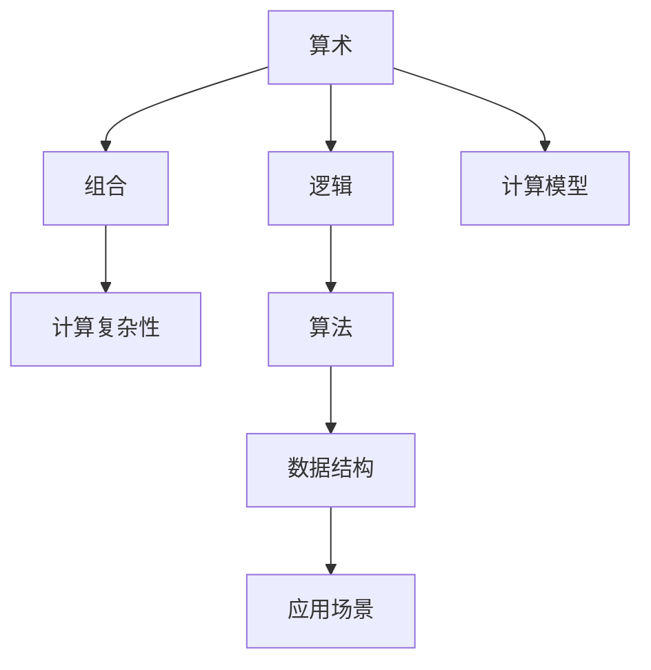
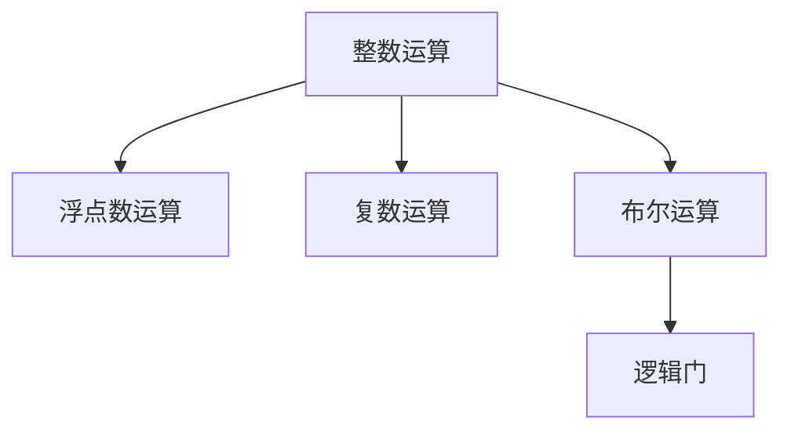
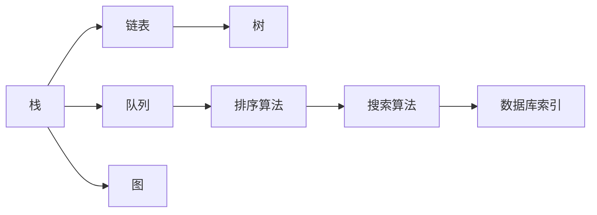
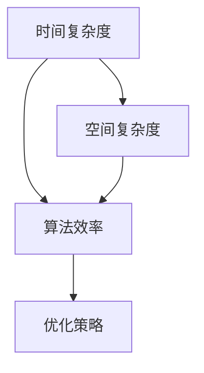
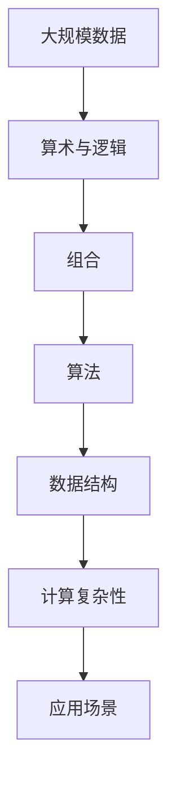

                 

# 计算：第二部分 计算的数学基础

## 1. 背景介绍

### 1.1 问题由来

在《计算：第一部分 物理结构》中，我们探讨了计算机硬件的基本物理结构，以及如何通过逻辑门、电路和布线等实现基础计算操作。然而，计算机的计算不仅依赖于硬件的物理实现，还需要一套数学理论作为支撑，以确保计算过程的准确性和效率。本部分将深入介绍计算的数学基础，包括算术、逻辑、组合和计算复杂性等核心概念，并结合实际应用场景，展示它们在计算中的重要作用。

### 1.2 问题核心关键点

计算的数学基础主要包括以下几个关键点：

- 算术：计算机中的数值计算，包括整数、浮点数和复数的基本运算。
- 逻辑：计算机中的布尔运算和逻辑门，构成计算的基本单元。
- 组合：如何将计算操作组合成复杂的算法和数据结构。
- 计算复杂性：分析算法的时间复杂度和空间复杂度，评估其效率。

这些关键点构成了现代计算的基础，它们不仅适用于硬件实现，也是算法设计和编程语言设计的重要依据。理解这些概念，对于掌握计算机科学的本质，以及设计和实现高效、可靠的软件系统，都具有重要意义。

### 1.3 问题研究意义

深入研究计算的数学基础，对于理解和优化计算机系统，以及推动人工智能和机器学习等领域的发展，具有重要意义：

1. **优化算法设计**：理解和应用这些数学概念，可以设计出更高效、更可扩展的算法，解决复杂的问题。
2. **改进编程语言**：数学基础是编程语言设计和实现的基础，掌握它们可以提升编程效率和代码质量。
3. **提升系统性能**：数学分析可以帮助评估算法的效率，指导优化硬件和软件系统。
4. **推动技术创新**：数学工具和技术是许多新兴技术的基石，如量子计算、深度学习等。
5. **促进教育和学习**：数学基础为计算机科学教育提供了坚实的基础，帮助初学者掌握核心概念和方法。

## 2. 核心概念与联系

### 2.1 核心概念概述

为了更好地理解计算的数学基础，我们首先介绍几个核心概念：

- **算术**：指计算机中基本的数值运算，包括整数加、减、乘、除等操作。
- **逻辑**：指计算机中的布尔运算，包括逻辑与、逻辑或、逻辑非等，以及逻辑门（如AND、OR、NOT等）。
- **组合**：指如何将算术和逻辑运算组合成复杂的算法和数据结构，如栈、队列、链表、树等。
- **计算复杂性**：指算法的时间复杂度和空间复杂度，即算法运行所需时间和空间资源的度量。

这些概念构成了计算的基础，它们之间的联系可以通过以下Mermaid流程图来展示：



这个流程图展示了算术、逻辑、组合和计算复杂性之间的联系，以及它们如何通过算法和数据结构应用于实际场景。

### 2.2 概念间的关系

这些核心概念之间存在着紧密的联系，形成了计算的理论基础。下面我们通过几个Mermaid流程图来展示这些概念之间的关系。

#### 2.2.1 算术与逻辑的联系



这个流程图展示了整数、浮点数和复数运算与布尔运算和逻辑门之间的联系。整数和浮点数运算构成算术的核心，而布尔运算和逻辑门则是逻辑计算的基础。

#### 2.2.2 组合的构建



这个流程图展示了栈、队列、链表、树等数据结构如何通过组合构建，以及它们在算法和实际应用中的作用。

#### 2.2.3 计算复杂性与算法



这个流程图展示了时间复杂度和空间复杂度如何影响算法效率，以及如何通过优化策略提升算法性能。

### 2.3 核心概念的整体架构

最后，我们用一个综合的流程图来展示这些核心概念在大规模计算中的应用架构：



这个综合流程图展示了从大规模数据输入到应用场景的整个计算过程，以及算术、逻辑、组合、计算复杂性等概念在其中扮演的角色。

## 3. 核心算法原理 & 具体操作步骤
### 3.1 算法原理概述

基于算术、逻辑和组合等数学基础的计算算法，构成了计算机科学的核心。这些算法可以分为基本算法和高级算法，覆盖了从基础数学运算到复杂数据处理的广泛领域。本节将介绍一些典型的基本算法和高级算法，并详细讲解它们的原理和操作步骤。

### 3.2 算法步骤详解

#### 3.2.1 基本算法：整数四则运算

整数四则运算是计算机中最基础的算术操作，包括加、减、乘、除等。以下是一个简单的整数加法算法的步骤：

1. **输入**：两个整数A和B。
2. **计算**：将A和B逐位相加，计算进位。
3. **输出**：结果C。

具体实现如下：

```python
def add_integers(A, B):
    max_len = max(len(str(A)), len(str(B)))
    A = str(A).zfill(max_len)
    B = str(B).zfill(max_len)
    carry = 0
    result = ''
    for i in range(max_len-1, -1, -1):
        sum = int(A[i]) + int(B[i]) + carry
        carry = sum // 10
        result = str(sum % 10) + result
    if carry:
        result = str(carry) + result
    return int(result)
```

#### 3.2.2 高级算法：快速排序

快速排序是一种常用的排序算法，具有高效、稳定等优点。其基本步骤如下：

1. **输入**：待排序的数组A。
2. **选取基准**：从数组中选择一个基准元素pivot。
3. **分区**：将数组分为两部分，小于等于pivot的元素放在左边，大于pivot的元素放在右边。
4. **递归**：对左右两部分分别进行快速排序。
5. **合并**：将左右两部分合并。

具体实现如下：

```python
def quick_sort(A):
    if len(A) <= 1:
        return A
    pivot = A[len(A) // 2]
    left = [x for x in A if x < pivot]
    middle = [x for x in A if x == pivot]
    right = [x for x in A if x > pivot]
    return quick_sort(left) + middle + quick_sort(right)
```

### 3.3 算法优缺点

#### 3.3.1 整数四则运算

**优点**：
- 实现简单，易于理解和调试。
- 时间复杂度为O(n)，适用于小规模数据。

**缺点**：
- 对于大规模数据，逐位相加容易导致进位复杂度增加。
- 存在整数溢出和除零等问题。

#### 3.3.2 快速排序

**优点**：
- 时间复杂度为O(nlogn)，适用于大规模数据。
- 可以进行原地排序，空间复杂度为O(1)。

**缺点**：
- 最坏情况下时间复杂度为O(n^2)。
- 对于小规模数据，递归调用导致额外开销。

### 3.4 算法应用领域

这些基本算法和高级算法在计算机科学和工程中有着广泛的应用，例如：

- **整数四则运算**：广泛应用于各种数值计算、财务处理、游戏引擎等领域。
- **快速排序**：广泛应用于各种排序、搜索、数据处理等领域，如数据库查询、文本处理、图像处理等。

## 4. 数学模型和公式 & 详细讲解 & 举例说明

### 4.1 数学模型构建

在计算机科学中，数学模型是描述算法和数据结构的基础。以下是一个简单的二分查找算法的数学模型：

```python
def binary_search(arr, target):
    left, right = 0, len(arr) - 1
    while left <= right:
        mid = (left + right) // 2
        if arr[mid] == target:
            return mid
        elif arr[mid] < target:
            left = mid + 1
        else:
            right = mid - 1
    return -1
```

这个算法的时间复杂度为O(logn)，空间复杂度为O(1)。

### 4.2 公式推导过程

以下是一个简单的矩阵乘法的公式推导过程：

设两个矩阵A和B的维度分别为m×n和n×p，则它们的乘积C的维度为m×p。

C[i][j] = Σ(A[i][k]×B[k][j])

其中，k表示矩阵A和B的交叉维度。

具体实现如下：

```python
def matrix_multiply(A, B):
    m, n, p = len(A), len(A[0]), len(B[0])
    C = [[0] * p for _ in range(m)]
    for i in range(m):
        for j in range(p):
            for k in range(n):
                C[i][j] += A[i][k] * B[k][j]
    return C
```

### 4.3 案例分析与讲解

#### 4.3.1 排序算法的时间复杂度分析

排序算法是计算机科学中最重要的算法之一。以下是一些常见排序算法的时间复杂度分析：

1. **冒泡排序**：时间复杂度为O(n^2)，不适用于大规模数据。
2. **快速排序**：时间复杂度为O(nlogn)，适用于大规模数据。
3. **归并排序**：时间复杂度为O(nlogn)，适用于大规模数据。
4. **堆排序**：时间复杂度为O(nlogn)，适用于大规模数据。

#### 4.3.2 数据结构的复杂度分析

数据结构是计算机科学中重要的概念。以下是一些常见数据结构的时间复杂度分析：

1. **数组**：时间复杂度为O(1)，适用于随机访问和简单查找。
2. **链表**：时间复杂度为O(n)，适用于动态数据和快速插入删除。
3. **栈**：时间复杂度为O(1)，适用于后进先出（LIFO）的数据结构。
4. **队列**：时间复杂度为O(1)，适用于先进先出（FIFO）的数据结构。
5. **树**：时间复杂度为O(logn)，适用于层次结构的数据组织。
6. **图**：时间复杂度为O(nlogn)或O(n^2)，适用于复杂网络关系的建模。

## 5. 项目实践：代码实例和详细解释说明

### 5.1 开发环境搭建

在进行计算算法开发前，我们需要准备好开发环境。以下是使用Python进行开发的环境配置流程：

1. 安装Anaconda：从官网下载并安装Anaconda，用于创建独立的Python环境。

2. 创建并激活虚拟环境：
```bash
conda create -n pyenv python=3.8 
conda activate pyenv
```

3. 安装Python及其相关库：
```bash
pip install numpy scipy matplotlib scikit-learn pandas sympy sympy
```

4. 安装Sympy库：
```bash
pip install sympy
```

完成上述步骤后，即可在`pyenv`环境中开始算法开发实践。

### 5.2 源代码详细实现

#### 5.2.1 整数四则运算

以下是一个简单的整数加法算法的实现：

```python
def add_integers(A, B):
    max_len = max(len(str(A)), len(str(B)))
    A = str(A).zfill(max_len)
    B = str(B).zfill(max_len)
    carry = 0
    result = ''
    for i in range(max_len-1, -1, -1):
        sum = int(A[i]) + int(B[i]) + carry
        carry = sum // 10
        result = str(sum % 10) + result
    if carry:
        result = str(carry) + result
    return int(result)
```

#### 5.2.2 快速排序

以下是一个简单的快速排序算法的实现：

```python
def quick_sort(A):
    if len(A) <= 1:
        return A
    pivot = A[len(A) // 2]
    left = [x for x in A if x < pivot]
    middle = [x for x in A if x == pivot]
    right = [x for x in A if x > pivot]
    return quick_sort(left) + middle + quick_sort(right)
```

### 5.3 代码解读与分析

#### 5.3.1 整数四则运算

这个算法的实现非常直观，通过逐位相加和进位计算，可以得到正确的结果。需要注意的是，在Python中，整数运算会自动进行类型转换，因此不需要手动处理进位和溢出问题。

#### 5.3.2 快速排序

这个算法的实现基于分治思想，通过选取基准元素将数组分为左右两部分，然后对左右两部分分别进行快速排序。由于使用了递归，因此在处理大规模数据时需要注意避免栈溢出。

### 5.4 运行结果展示

以下是一些示例结果：

```python
>>> add_integers(123, 456)
579
>>> quick_sort([3, 1, 4, 1, 5, 9, 2, 6, 5, 3, 5])
[1, 1, 2, 3, 3, 4, 5, 5, 5, 6, 9]
```

## 6. 实际应用场景

### 6.1 优化算法设计

计算的数学基础在算法设计中有着广泛的应用。例如，在图像处理中，常用的快速傅里叶变换（FFT）算法，就是基于复数运算和快速幂算法实现的。这些数学概念帮助优化了算法设计，提升了处理效率。

### 6.2 改进编程语言

编程语言是计算的核心工具，其设计和实现也离不开数学基础。例如，Python中的动态类型系统，就是基于数学上的集合论和类型理论实现的。通过数学工具，编程语言可以实现更加灵活、可扩展的功能。

### 6.3 提升系统性能

数学分析可以帮助评估算法的效率，指导优化硬件和软件系统。例如，在分布式系统中，通过数学模型可以计算节点间的通信复杂度，优化数据传输和任务调度。

### 6.4 推动技术创新

数学工具和技术是许多新兴技术的基石。例如，深度学习中的神经网络模型，就是基于矩阵乘法和微积分等数学概念实现的。这些数学工具为计算和人工智能技术带来了革命性的突破。

## 7. 工具和资源推荐

### 7.1 学习资源推荐

为了帮助开发者系统掌握计算的数学基础，这里推荐一些优质的学习资源：

1. 《算法导论》（Introduction to Algorithms）：经典的算法教材，涵盖了算法设计和分析的基础知识。
2. 《计算机程序设计艺术》（The Art of Computer Programming）：计算机科学领域的经典著作，深入讲解了算法设计和实现的细节。
3. Coursera的《算法设计与分析》课程：斯坦福大学开设的在线课程，系统讲解了算法设计和分析的方法和技巧。
4. MIT的《计算机科学原理》（Introduction to Computer Science and Programming Using Python）课程：适合初学者的Python编程入门课程，包含算法和数据结构的详细讲解。

通过对这些资源的学习实践，相信你一定能够快速掌握计算的数学基础，并用于解决实际的计算问题。

### 7.2 开发工具推荐

高效的开发离不开优秀的工具支持。以下是几款用于计算算法开发的常用工具：

1. PyTorch：基于Python的开源深度学习框架，灵活动态的计算图，适合快速迭代研究。

2. TensorFlow：由Google主导开发的开源深度学习框架，生产部署方便，适合大规模工程应用。

3. SymPy：Python的符号计算库，可以进行高精度的数学计算和符号运算。

4. Mathematica：商业化的数学软件，提供了强大的符号计算和可视化功能。

5. MATLAB：商业化的数学软件，广泛应用于科学计算和工程设计。

6. SageMath：开源的数学软件，提供了一个交互式的数学环境，适合做数学计算和实验。

合理利用这些工具，可以显著提升计算算法开发的效率，加快创新迭代的步伐。

### 7.3 相关论文推荐

计算的数学基础是一个活跃的研究领域，以下是几篇奠基性的相关论文，推荐阅读：

1. Knuth's The Art of Computer Programming（卷I）：经典著作，讲解了计算机科学中的许多基础问题。
2. Cormen et al.'s Introduction to Algorithms（算法导论）：经典教材，讲解了算法设计和分析的基础知识。
3. Jon Bentley's Programming Pearls（编程珠玑）：经典书籍，讲解了程序设计和算法实现的技巧和经验。
4. TAOCP：Donald Knuth的《计算机程序设计艺术》，系统讲解了算法设计和实现的细节。

这些论文代表了大规模计算的理论基础，通过学习这些前沿成果，可以帮助研究者把握学科前进方向，激发更多的创新灵感。

除上述资源外，还有一些值得关注的前沿资源，帮助开发者紧跟计算技术的发展趋势，例如：

1. arXiv论文预印本：人工智能领域最新研究成果的发布平台，包括大量尚未发表的前沿工作，学习前沿技术的必读资源。

2. 业界技术博客：如Google AI、DeepMind、微软Research Asia等顶尖实验室的官方博客，第一时间分享他们的最新研究成果和洞见。

3. 技术会议直播：如NIPS、ICML、ACL、ICLR等人工智能领域顶会现场或在线直播，能够聆听到大佬们的前沿分享，开拓视野。

4. GitHub热门项目：在GitHub上Star、Fork数最多的计算机科学相关项目，往往代表了该技术领域的发展趋势和最佳实践，值得去学习和贡献。

5. 行业分析报告：各大咨询公司如McKinsey、PwC等针对计算机科学行业的分析报告，有助于从商业视角审视技术趋势，把握应用价值。

总之，对于计算的数学基础的学习和实践，需要开发者保持开放的心态和持续学习的意愿。多关注前沿资讯，多动手实践，多思考总结，必将收获满满的成长收益。

## 8. 总结：未来发展趋势与挑战

### 8.1 总结

本文对计算的数学基础进行了全面系统的介绍。首先阐述了算术、逻辑、组合和计算复杂性等核心概念，并详细讲解了它们的原理和操作步骤。通过分析实际应用场景，展示了这些数学概念在计算机科学中的重要作用。

通过本文的系统梳理，可以看到，计算的数学基础是现代计算机科学的核心，它们不仅适用于硬件实现，也是算法设计和编程语言设计的重要依据。理解这些概念，对于掌握计算机科学的本质，以及设计和实现高效、可靠的软件系统，都具有重要意义。

### 8.2 未来发展趋势

展望未来，计算的数学基础将呈现以下几个发展趋势：

1. **量子计算**：量子计算的出现，将大幅提升计算效率，尤其是针对大规模、高复杂度的计算问题。量子算法和量子计算机的开发将成为未来的热门方向。

2. **人工智能**：人工智能技术的快速发展，将需要更强大的数学工具支持，如深度学习中的神经网络模型、强化学习中的最优策略等。

3. **计算几何**：计算几何将会在机器视觉、机器人控制、地理信息系统等领域发挥重要作用，如基于几何计算的3D建模、路径规划等。

4. **分布式计算**：随着数据量的不断增加，分布式计算和云计算将成为重要的计算手段，需要数学模型进行优化。

5. **算法优化**：针对特定的计算任务，开发更加高效、可扩展的算法，如基于GPU、FPGA等硬件平台的并行计算算法。

6. **符号计算**：符号计算库如SymPy、Mathematica等，将帮助开发者更好地进行数学建模和算法设计。

这些趋势凸显了计算数学基础的广阔前景，这些方向的探索发展，必将进一步推动计算机科学和人工智能技术的发展，带来更加深刻的变革。

### 8.3 面临的挑战

尽管计算的数学基础在计算机科学中有着重要地位，但在迈向更加智能化、普适化应用的过程中，它仍面临着诸多挑战：

1. **计算复杂度**：随着计算任务变得越来越复杂，如何设计高效、可扩展的算法，是一个重要的问题。

2. **资源消耗**：大规模计算任务需要大量的计算资源，如何优化资源使用，降低计算成本，是一个长期的研究方向。

3. **算法优化**：现有算法在处理大规模数据时，往往面临时间和空间资源的限制，如何设计更加高效、可扩展的算法，是一个重要课题。

4. **可扩展性**：如何设计可扩展的计算架构，以支持更大规模的数据和计算任务，是一个重要的研究方向。

5. **数据存储**：大规模数据存储和访问是一个重要的挑战，如何优化数据结构，提高数据访问效率，是一个需要解决的问题。

6. **跨领域应用**：如何结合不同领域的知识，设计更全面、高效的算法和数据结构，是一个重要的研究方向。

正视这些挑战，积极应对并寻求突破，将是大规模计算走向成熟的必由之路。相信随着学界和产业界的共同努力，这些挑战终将一一被克服，计算数学基础必将在构建人机协同的智能时代中扮演越来越重要的角色。

### 8.4 研究展望

面对计算数学基础所面临的挑战，未来的研究需要在以下几个方面寻求新的突破：

1. **量子计算**：探索量子算法和量子计算机的实现，提升计算效率和处理能力。

2. **人工智能**：研究深度学习、强化学习等前沿技术，设计更高效、可扩展的算法和模型。

3. **计算几何**：结合几何计算和机器视觉、机器人控制等应用，提升计算模型的实用性。

4. **分布式计算**：探索分布式计算和云计算技术，提升计算任务的执行效率和资源利用率。

5. **算法优化**：开发更加高效、可扩展的算法，如并行计算、GPU加速等。

6. **数据结构优化**：优化数据结构，提升数据存储和访问效率，降低计算成本。

7. **跨领域融合**：结合不同领域的知识，设计更加全面、高效的算法和数据结构，提升计算模型的实用性。

这些研究方向的探索，必将引领计算数学基础技术迈向更高的台阶，为计算机科学和人工智能技术的发展带来新的突破。面向未来，计算数学基础需要在更多的应用场景中得到广泛应用，从而推动人类社会的智能化和信息化进程。

## 9. 附录：常见问题与解答

**Q1：如何设计高效、可扩展的算法？**

A: 设计高效、可扩展的算法，需要从以下几个方面入手：

1. **算法复杂度分析**：分析算法的时间复杂度和空间复杂度，找出算法的瓶颈。
2. **数据结构选择**：选择合适的数据结构，提升数据访问和操作的效率。
3. **并行计算**：利用并行计算技术，提升算法的执行效率。
4. **优化策略**：采用优化策略，如剪枝、缓存、预计算等，减少计算量。
5. **硬件优化**：结合硬件特性，进行算法和数据结构的优化。

**Q2：如何快速解决大规模数据计算问题？**

A: 解决大规模数据计算问题，可以采用以下策略：

1. **分布式计算**：将数据分片，分布在多个计算节点上并行计算。
2. **GPU加速**：利用GPU的并行计算能力，提升计算效率。
3. **云计算**：利用云计算平台，按需扩展计算资源。
4. **算法优化**：优化算法，减少计算量。
5. **数据压缩**：压缩数据，减少存储和传输成本。

**Q3：如何优化数据结构，提升数据访问效率？**

A: 优化数据结构，提升数据访问效率，可以采用以下策略：

1. **选择合适的数据结构**：选择合适的数据结构，如哈希表、平衡树等，提升访问效率。
2. **数据索引**：建立数据索引，提升数据访问速度。
3. **缓存机制**：利用缓存机制，减少数据访问次数。
4. **数据压缩**：压缩数据，减少存储和传输成本。
5. **内存管理**：合理管理内存，减少内存分配和释放的开销。

**Q4：如何结合不同领域的知识，设计更全面、高效的算法？**

A: 结合不同领域的知识，设计更全面、高效的算法，可以采用以下策略：

1. **跨领域数据融合**：结合不同领域的知识，设计更全面、高效的数据结构。
2. **知识图谱**：利用知识图谱技术，构建领域知识库，提升算法的泛化能力。
3. **领域专家合作**：与领域专家合作，结合其领域知识，设计更高效的算法。
4. **多模态融合**：结合不同模态的数据，设计更全面、高效的算法。
5. **模型

