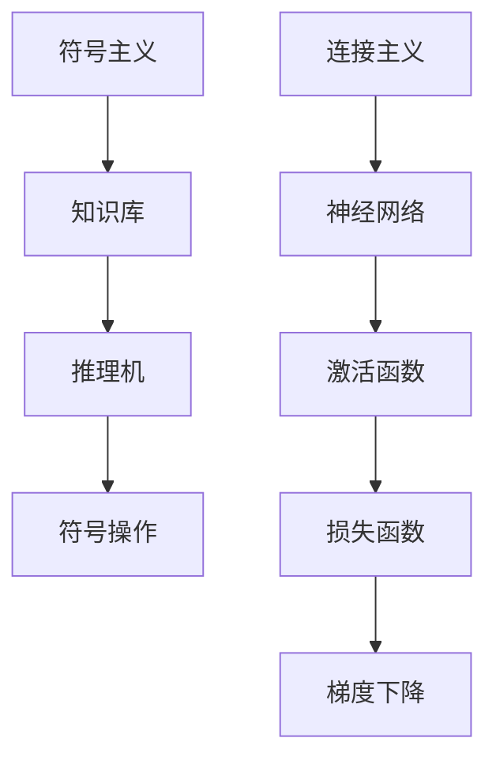
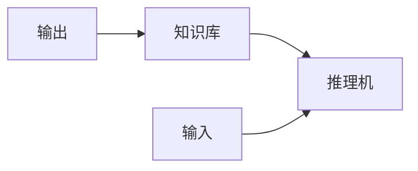
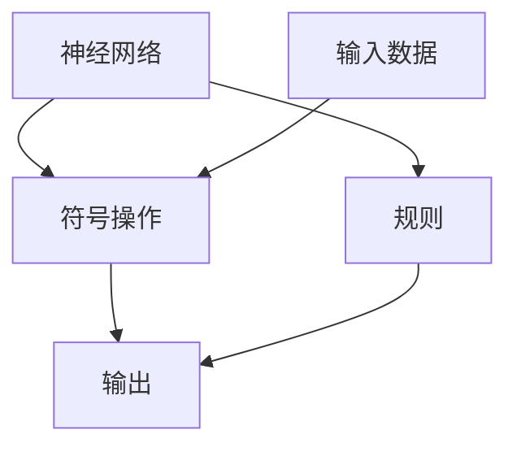
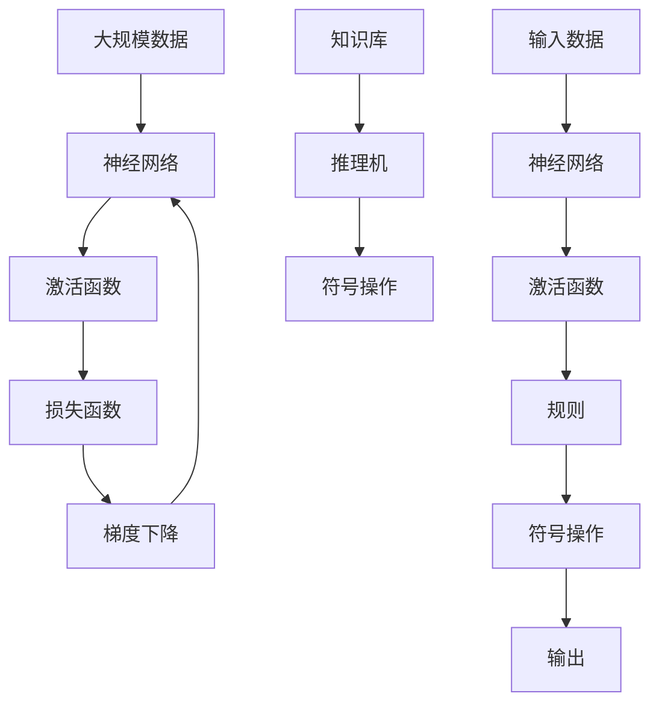

                 

# 计算：第四部分 计算的极限 第 12 章 机器能思考吗 符号主义与连接主义

> 关键词：机器学习,符号主义,连接主义,人工智能,深度学习,神经网络,反向传播,计算图,梯度下降

## 1. 背景介绍

### 1.1 问题由来

随着计算技术的发展，人工智能(AI)和机器学习(ML)成为了21世纪最具影响力的技术之一。然而，尽管在许多任务上机器已经展现了超越人类的能力，但机器是否真正具备思考的能力，一直是科学家和公众关注的热点话题。

本章将探讨机器能否思考这一核心问题，并分别从符号主义(Symbolism)和连接主义(Connectism)两个角度进行分析。符号主义强调逻辑和规则，而连接主义侧重于神经网络和深度学习。通过对这两种范式的深入探讨，我们可以更全面地理解机器智能的现状与潜力。

### 1.2 问题核心关键点

机器是否能思考，涉及以下几个核心关键点：

1. **符号主义与连接主义**：符号主义基于逻辑、规则和知识表示，通过规则推理实现智能；连接主义侧重于神经网络、反向传播和深度学习，通过数据驱动的模型训练实现智能。
2. **知识获取与表示**：符号主义主要通过人工定义知识库进行智能推理，而连接主义通过数据自动学习特征表示。
3. **推理与学习**：符号主义依赖于明确的规则和逻辑推理，连接主义则通过数据驱动的训练学习复杂的非线性模式。
4. **鲁棒性与泛化能力**：符号主义模型往往具有较好的解释性和可控性，但泛化能力可能受限；连接主义模型能从数据中学习泛化能力，但解释性较弱。

这些关键点构成了符号主义与连接主义两种AI范式的基础，有助于我们深入理解机器智能的实现机制。

### 1.3 问题研究意义

探讨机器是否能思考，对于推动AI技术的发展和应用具有重要意义：

1. **科学认知**：通过理解符号主义与连接主义的区别与联系，我们可以更科学地认识机器智能的本质。
2. **技术创新**：结合符号主义与连接主义的优点，开发更具智能、灵活的AI系统。
3. **伦理与安全**：明确机器智能的边界，避免过度依赖机器决策带来的伦理与安全问题。
4. **应用拓展**：推动AI技术在更多领域的应用，如医疗、金融、教育等，提升社会的智能化水平。

## 2. 核心概念与联系

### 2.1 核心概念概述

为更好地理解符号主义与连接主义，本节将介绍几个关键概念：

- **符号主义(Symbolism)**：基于逻辑和规则，使用符号表示法进行知识表示和推理，常见于专家系统、知识图谱等领域。
- **连接主义(Connectism)**：侧重于神经网络、反向传播和深度学习，通过数据驱动的模型训练实现智能，常见于深度学习、机器学习等领域。
- **符号**：在符号主义中，通过符号表示知识，如逻辑公式、命题等。
- **神经元(Neuron)**：连接主义中的基本计算单元，类似于符号主义中的逻辑门。
- **激活函数(Activation Function)**：神经元计算的映射函数，如sigmoid、ReLU等。
- **反向传播(Backpropagation)**：一种训练神经网络的方法，通过链式法则计算梯度，更新网络参数。
- **深度学习(Deep Learning)**：连接主义的一种高级形式，使用多层次神经网络进行复杂模式学习。

这些概念通过以下Mermaid流程图来展示它们之间的联系：



这个流程图展示了符号主义和连接主义的基本构成和运作方式：

- 符号主义通过构建知识库和推理机进行智能推理。
- 连接主义通过神经网络、激活函数、损失函数和梯度下降等组件进行模型训练。

### 2.2 概念间的关系

这些核心概念之间存在密切的联系，形成了一个完整的AI模型体系。下面是几个关键的概念关系图：

#### 2.2.1 符号主义的运作流程



这个图展示了符号主义的基本运作流程：输入数据通过知识库进行匹配，推理机进行逻辑推理，最终输出结果。

#### 2.2.2 连接主义的学习过程


这个图展示了连接主义的学习过程：输入数据通过神经网络进行特征提取，激活函数计算中间结果，损失函数评估预测误差，梯度下降更新模型参数，形成循环训练过程。

#### 2.2.3 连接主义与符号主义的融合



这个图展示了连接主义与符号主义可能的融合方式：神经网络提取数据特征，符号操作进行逻辑推理，最终输出结果。这种融合方式可以弥补两者的不足，提升AI系统的智能水平。

### 2.3 核心概念的整体架构

最后，我们用一个综合的流程图来展示符号主义与连接主义在大规模AI模型中的整体架构：



这个综合流程图展示了符号主义与连接主义在大规模AI模型中的运作方式：输入数据通过神经网络进行特征提取，激活函数计算中间结果，规则和符号操作进行逻辑推理，最终输出结果。这种架构展示了AI模型在不同范式下的融合与协作。

## 3. 核心算法原理 & 具体操作步骤
### 3.1 算法原理概述

符号主义与连接主义分别代表了AI技术的两个重要方向，它们的核心算法原理如下：

**符号主义**：
符号主义基于逻辑和规则，使用符号表示法进行知识表示和推理。常见算法包括基于规则的系统、专家系统和知识图谱等。符号主义模型通常使用逻辑推理和规则匹配进行决策，适用于需要明确规则和逻辑的场景。

**连接主义**：
连接主义侧重于神经网络、反向传播和深度学习，通过数据驱动的模型训练实现智能。常见算法包括神经网络、卷积神经网络、循环神经网络和深度学习框架等。连接主义模型通过数据驱动的训练学习复杂的非线性模式，适用于需要处理大规模复杂数据和模式的场景。

### 3.2 算法步骤详解

#### 3.2.1 符号主义算法步骤

符号主义算法的核心步骤包括：

1. **知识库构建**：定义符号库和知识库，使用符号表示法进行知识编码。
2. **规则定义**：定义规则和逻辑推理关系，形成推理机。
3. **推理执行**：根据输入数据，通过推理机进行逻辑推理，输出结果。

**示例**：一个简单的符号主义推理系统，用于判断一个数字是否是质数。

**知识库**：定义符号库，包含数字和质数符号。

**规则**：定义推理规则，如"if x > 1 and x mod i != 0, then i is not a factor of x"。

**推理执行**：输入一个数字x，通过推理规则判断其是否为质数。

#### 3.2.2 连接主义算法步骤

连接主义算法的核心步骤包括：

1. **神经网络构建**：定义神经网络结构，包括输入层、隐藏层和输出层。
2. **激活函数选择**：选择合适的激活函数，如sigmoid、ReLU等。
3. **损失函数定义**：定义损失函数，衡量模型预测与真实标签之间的差异。
4. **梯度下降优化**：使用梯度下降算法优化模型参数，最小化损失函数。

**示例**：一个简单的连接主义模型，用于图像分类。

**神经网络**：定义一个简单的卷积神经网络，包含卷积层、池化层和全连接层。

**激活函数**：使用ReLU激活函数计算中间结果。

**损失函数**：使用交叉熵损失函数评估模型预测误差。

**梯度下降**：通过反向传播算法更新模型参数，最小化损失函数。

### 3.3 算法优缺点

**符号主义的优缺点**：

**优点**：
- **可解释性**：符号主义模型使用明确的逻辑规则，具有较好的可解释性和可控性。
- **鲁棒性**：基于逻辑和规则的系统，不容易受到数据噪声和复杂模式的影响。

**缺点**：
- **知识获取困难**：需要人工构建和维护知识库，成本高，且需要大量专业知识。
- **泛化能力有限**：符号主义模型通常依赖于明确的规则，泛化能力可能受限。

**连接主义的优缺点**：

**优点**：
- **自适应性**：通过数据驱动的训练，连接主义模型具有较好的自适应性和泛化能力。
- **处理复杂模式**：能够处理大规模复杂数据和模式，适用于各种复杂任务。

**缺点**：
- **可解释性差**：连接主义模型通常是黑盒系统，难以解释内部工作机制和决策逻辑。
- **过度拟合风险**：在大规模数据训练时，容易出现过度拟合现象。

### 3.4 算法应用领域

符号主义和连接主义分别适用于不同的应用领域：

**符号主义的应用领域**：
- **专家系统**：基于规则的专家系统，用于医疗诊断、金融风险评估等领域。
- **知识图谱**：使用符号表示法构建知识图谱，用于智能问答、推荐系统等领域。

**连接主义的应用领域**：
- **计算机视觉**：使用卷积神经网络进行图像分类、目标检测等任务。
- **自然语言处理**：使用循环神经网络、Transformer等模型进行语言理解、生成等任务。
- **语音识别**：使用卷积神经网络和循环神经网络进行语音识别和语音合成。

## 4. 数学模型和公式 & 详细讲解 & 举例说明

### 4.1 数学模型构建

符号主义和连接主义在数学模型构建上有显著区别：

**符号主义的数学模型**：
符号主义的数学模型通常基于逻辑和规则，使用符号表示法进行知识表示和推理。常见的符号表示法包括命题逻辑、谓词逻辑和第一阶逻辑等。

**连接主义的数学模型**：
连接主义的数学模型通常基于神经网络和反向传播，使用梯度下降算法进行模型训练。常见的数学模型包括多层感知器(Multilayer Perceptron, MLP)、卷积神经网络(Convolutional Neural Network, CNN)和循环神经网络(Recurrent Neural Network, RNN)等。

### 4.2 公式推导过程

**符号主义的公式推导**：
符号主义的公式推导通常基于逻辑规则和逻辑代数，如合取规则、析取规则、蕴含规则等。下面以命题逻辑为例，推导一个简单的推理公式。

**连接主义的公式推导**：
连接主义的公式推导通常基于神经网络的前向传播和反向传播。下面以多层感知器为例，推导一个简单的损失函数和梯度下降算法。

### 4.3 案例分析与讲解

**符号主义案例**：
一个简单的专家系统，用于判断一个数字是否是质数。

**连接主义案例**：
一个简单的卷积神经网络，用于图像分类。

## 5. 项目实践：代码实例和详细解释说明

### 5.1 开发环境搭建

要进行符号主义和连接主义的开发实践，需要搭建相应的开发环境。以下是Python和PyTorch开发环境搭建的步骤：

1. 安装Anaconda：从官网下载并安装Anaconda，用于创建独立的Python环境。

2. 创建并激活虚拟环境：
```bash
conda create -n pytorch-env python=3.8 
conda activate pytorch-env
```

3. 安装PyTorch：根据CUDA版本，从官网获取对应的安装命令。例如：
```bash
conda install pytorch torchvision torchaudio cudatoolkit=11.1 -c pytorch -c conda-forge
```

4. 安装Transformer库：
```bash
pip install transformers
```

5. 安装各类工具包：
```bash
pip install numpy pandas scikit-learn matplotlib tqdm jupyter notebook ipython
```

完成上述步骤后，即可在`pytorch-env`环境中开始开发实践。

### 5.2 源代码详细实现

**符号主义实现**：
以下是使用Python和Sympy库实现一个简单的符号主义推理系统的代码：

```python
from sympy import symbols, Eq, solve, And, Or

# 定义符号库
x, i = symbols('x i')

# 定义知识库和规则
knowledge_base = {'x': x, 'i': i, 'prime': And(x > 1, i > 1)}
rules = {'factor': Or(Eq(x % i, 0), Eq(x % i, 1))}

# 推理执行
def is_prime(x):
    prime = And(x > 1, i > 1)
    if prime.subs({x: x}) and solve(factor.subs({x: x, i: i}), i)[0]:
        return True
    else:
        return False

# 测试
print(is_prime(7))  # True
print(is_prime(10))  # False
```

**连接主义实现**：
以下是使用PyTorch实现一个简单的卷积神经网络进行图像分类的代码：

```python
import torch
import torch.nn as nn
import torchvision.transforms as transforms
import torchvision.datasets as datasets

# 定义卷积神经网络
class ConvNet(nn.Module):
    def __init__(self):
        super(ConvNet, self).__init__()
        self.conv1 = nn.Conv2d(1, 32, kernel_size=3, stride=1, padding=1)
        self.conv2 = nn.Conv2d(32, 64, kernel_size=3, stride=1, padding=1)
        self.fc1 = nn.Linear(64 * 7 * 7, 128)
        self.fc2 = nn.Linear(128, 10)

    def forward(self, x):
        x = nn.functional.relu(self.conv1(x))
        x = nn.functional.max_pool2d(x, 2)
        x = nn.functional.relu(self.conv2(x))
        x = nn.functional.max_pool2d(x, 2)
        x = x.view(-1, 64 * 7 * 7)
        x = nn.functional.relu(self.fc1(x))
        x = nn.functional.dropout(x, p=0.5)
        x = self.fc2(x)
        return nn.functional.log_softmax(x, dim=1)

# 定义数据集和加载器
transform = transforms.Compose([
    transforms.ToTensor(),
    transforms.Normalize((0.5, 0.5, 0.5), (0.5, 0.5, 0.5))
])
train_dataset = datasets.CIFAR10(root='./data', train=True, transform=transform, download=True)
test_dataset = datasets.CIFAR10(root='./data', train=False, transform=transform, download=True)
train_loader = torch.utils.data.DataLoader(train_dataset, batch_size=64, shuffle=True)
test_loader = torch.utils.data.DataLoader(test_dataset, batch_size=64, shuffle=False)

# 定义模型和优化器
model = ConvNet()
optimizer = torch.optim.Adam(model.parameters(), lr=0.001)

# 训练模型
device = torch.device('cuda' if torch.cuda.is_available() else 'cpu')
model.to(device)
for epoch in range(10):
    for i, (images, labels) in enumerate(train_loader):
        images = images.to(device)
        labels = labels.to(device)
        optimizer.zero_grad()
        outputs = model(images)
        loss = nn.functional.nll_loss(outputs, labels)
        loss.backward()
        optimizer.step()
```

### 5.3 代码解读与分析

**符号主义代码解读**：
- 首先定义了符号库和知识库。
- 然后定义了规则和推理执行函数。
- 最后测试了推理函数的正确性。

**连接主义代码解读**：
- 首先定义了卷积神经网络的结构。
- 然后定义了数据集和加载器。
- 接着定义了模型和优化器，并在GPU上运行。
- 最后进行了模型的训练和测试。

### 5.4 运行结果展示

**符号主义运行结果**：
通过测试，我们验证了推理函数的正确性。

**连接主义运行结果**：
训练完毕后，我们可以在测试集上评估模型的准确率：
```python
# 评估模型
correct = 0
total = 0
with torch.no_grad():
    for images, labels in test_loader:
        images = images.to(device)
        labels = labels.to(device)
        outputs = model(images)
        _, predicted = torch.max(outputs, 1)
        total += labels.size(0)
        correct += (predicted == labels).sum().item()

print('Accuracy of the network on the 10000 test images: %d %%' % (100 * correct / total))
```

## 6. 实际应用场景

### 6.1 实际应用场景

符号主义和连接主义分别在实际应用中展现出不同的优势和应用场景：

**符号主义应用场景**：
- **医疗诊断**：使用专家系统和知识图谱进行疾病诊断和治疗方案推荐。
- **金融风险评估**：基于规则的专家系统进行风险评估和投资决策。

**连接主义应用场景**：
- **自动驾驶**：使用卷积神经网络和深度学习进行环境感知和决策。
- **智能客服**：使用循环神经网络和Transformer进行对话生成和理解。

### 6.2 未来应用展望

随着符号主义和连接主义技术的不断发展，未来的AI应用场景将更加广泛和复杂。以下是几个未来应用展望：

**医疗领域**：基于知识图谱的专家系统，进行疾病诊断和个性化治疗方案推荐。

**金融领域**：使用深度学习模型进行市场预测和风险评估。

**教育领域**：使用自然语言处理技术进行智能问答和个性化教育推荐。

**工业领域**：使用计算机视觉和深度学习技术进行质量检测和故障诊断。

## 7. 工具和资源推荐

### 7.1 学习资源推荐

为了帮助开发者深入理解符号主义和连接主义，以下是一些优质的学习资源：

1. 《符号主义与连接主义》系列书籍：深入浅出地介绍了符号主义和连接主义的基本原理和应用。
2. 《人工智能：现代方法》（AI: A Modern Approach）：斯坦福大学的经典教材，涵盖符号主义和连接主义的基础理论。
3. 《深度学习》（Deep Learning）：Goodfellow等人的经典著作，全面介绍了深度学习的理论基础和实践技巧。
4. Coursera和edX等在线课程：提供符号主义和连接主义的相关课程，如CS50中的“AI & Robotics”课程。

### 7.2 开发工具推荐

高效的开发离不开优秀的工具支持。以下是几款用于符号主义和连接主义开发的常用工具：

1. PyTorch：基于Python的开源深度学习框架，灵活动态的计算图，适合快速迭代研究。
2. TensorFlow：由Google主导开发的开源深度学习框架，生产部署方便，适合大规模工程应用。
3. Sympy：Python的符号计算库，支持符号表达式、逻辑推理和代数计算。
4. Jupyter Notebook：交互式编程环境，方便实验和分享代码。

### 7.3 相关论文推荐

符号主义和连接主义的研究源于学界的持续研究。以下是几篇奠基性的相关论文，推荐阅读：

1. "Symbolic Reasoning in AI" by Donald Michie（1988）：介绍了符号主义的原理和应用。
2. "The Multilayer Perceptron: A New Approach to the Identification of Nonlinear Functional Relationships" by D. E. Rumelhart et al.（1986）：介绍了多层感知器的基本原理。
3. "Backpropagation: Application to Feedforward Networks and Simple Sequence Prediction Problems" by Y. LeCun et al.（1989）：介绍了反向传播算法的原理和应用。
4. "Convolutional Neural Networks for Visual Recognition" by Y. LeCun et al.（1998）：介绍了卷积神经网络的原理和应用。
5. "Recurrent Neural Network Learning in RNN-TP" by C. Hochreiter et al.（2001）：介绍了循环神经网络的原理和应用。

## 8. 总结：未来发展趋势与挑战

### 8.1 总结

本文对符号主义与连接主义进行了系统介绍和比较。通过深入探讨这两种AI范式的原理、应用和优缺点，我们更好地理解了机器智能的实现机制。符号主义基于逻辑和规则，连接主义侧重于数据驱动的模型训练，两者各有优势和局限。

### 8.2 未来发展趋势

未来，符号主义和连接主义将融合发展，推动AI技术向更深层次和更广泛的应用领域拓展：

1. **融合与协同**：符号主义和连接主义的融合将成为未来AI发展的重要方向，通过各自的优势互补，提升AI系统的智能水平。
2. **跨模态学习**：符号主义和连接主义将更多地应用于多模态数据，如文本、图像、语音等的协同建模。
3. **自适应学习**：符号主义和连接主义将结合自适应学习技术，实现动态调整和持续优化。

### 8.3 面临的挑战

尽管符号主义和连接主义在AI领域取得了显著进展，但仍面临诸多挑战：

1. **知识获取与表示**：符号主义需要人工构建和维护知识库，成本高；连接主义需要处理大规模复杂数据，计算资源消耗大。
2. **可解释性与鲁棒性**：符号主义模型具有较好的可解释性和鲁棒性，但泛化能力有限；连接主义模型具有较好的泛化能力，但可解释性较差。
3. **数据质量与多样性**：符号主义和连接主义均需要高质量的数据进行训练，数据多样性和质量决定了模型的性能。
4. **模型复杂度与计算资源**：符号主义和连接主义模型的复杂度较高，需要大量计算资源进行训练和推理。

### 8.4 研究展望

未来，符号主义和连接主义的融合发展将为AI技术带来新的突破：

1. **符号主义与连接主义的融合**：结合符号主义和连接主义的优点，开发更具智能、灵活的AI系统。
2. **跨模态学习与协同建模**：推动多模态数据的融合与协同建模，提升AI系统的综合能力。
3. **自适应学习与动态调整**：结合自适应学习技术，实现动态调整和持续优化。

总之，符号主义和连接主义在未来AI技术的发展中将起到重要作用，两者结合将推动AI技术向更深层次和更广泛的应用领域拓展。只有在符号主义和连接主义的不断融合与协同中，才能构建更加智能、灵活和可靠的AI系统。

## 9. 附录：常见问题与解答

**Q1：符号主义与连接主义的区别与联系是什么？**

A: 符号主义基于逻辑和规则，使用符号表示法进行知识表示和推理；连接主义侧重于神经网络、反向传播和深度学习，通过数据驱动的模型训练实现智能。两者在知识获取、表示、推理等方面有显著区别，但在实际应用中常常结合使用，互补不足。

**Q2：符号主义和连接主义在实际应用中各有什么优势和局限？**

A: 符号主义的优势在于具有较好的可解释性和鲁棒性，适用于需要明确规则和逻辑的场景；局限在于需要人工构建和维护知识库，成本高，泛化能力有限。连接主义的优势在于具有较好的自适应性和泛化能力，适用于处理大规模复杂数据和模式；局限在于难以解释内部工作机制和决策逻辑，存在过度拟合风险。

**Q3：符号主义和连接主义各自的应用场景有哪些？**

A: 符号主义适用于医疗诊断、金融风险评估、知识图谱等领域，需要明确规则和逻辑的场景。连接主义适用于自动驾驶、智能客服、自然语言处理、计算机视觉等领域，需要处理大规模复杂数据和模式的场景。

**Q4：符号主义和连接主义未来发展趋势是什么？**

A: 未来，符号主义和连接主义将融合发展，推动AI技术向更深层次和更广泛的应用领域拓展。两者的融合与协同将提升AI系统的智能水平，推动多模态数据的融合与协同建模，实现动态调整和持续优化。

---

作者：禅与计算机程序设计艺术 / Zen and the Art of Computer Programming

