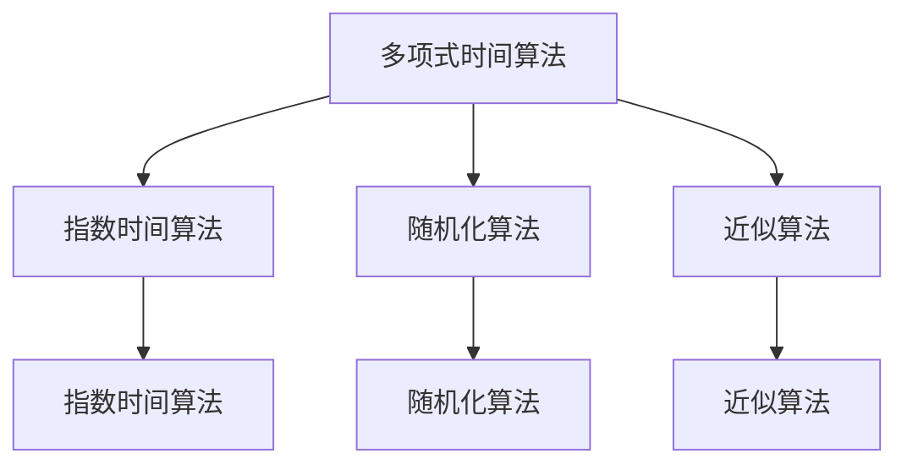

                 

# 计算：第四部分 计算的极限 第 9 章 计算复杂性 P=NP 的世界

> 关键词：计算复杂性, P=NP问题, 指数时间算法, 多项式时间算法, 随机化算法, 近似算法, 验证和求解

## 1. 背景介绍

### 1.1 问题由来
在《计算：第四部分 计算的极限》中，我们探讨了计算的基本概念和原则，特别是计算复杂性的不同类别。在P=NP问题上，我们只是简单提到了其在计算理论中的重要性和挑战性，而本章将深入研究这个问题，探索它对计算机科学和实际应用的意义。

P=NP问题是计算机科学中最重要、最具有挑战性的问题之一。它简而言之就是：“是否所有能够在多项式时间内验证的解，也一定能够在多项式时间内求解？” 如果P=NP成立，意味着在多项式时间内，所有问题都可以高效求解；如果不成立，意味着某些问题即使在多项式时间内验证，但求解却需要指数时间，因此无法高效地解决。

### 1.2 问题核心关键点
P=NP问题涉及以下几个关键点：
- **P类问题和NP类问题**：P类问题是指在多项式时间内可以求解的问题；NP类问题是指在多项式时间内可以验证的问题。P类问题通常被认为是可以高效求解的，而NP类问题则更难解决，因为它们可能在多项式时间内有指数次的可能解，而验证任意一个解是否正确则可以在多项式时间内完成。
- **P=NP猜想**：如果P类问题可以归约为NP类问题，那么P=NP猜想成立，意味着所有NP类问题也一定可以在多项式时间内求解。
- **算法效率**：多项式时间和指数时间的概念对比，多项式时间算法在实际应用中非常高效，而指数时间算法则显得非常缓慢，难以实际使用。

## 2. 核心概念与联系

### 2.1 核心概念概述

为了更好地理解P=NP问题，我们首先介绍几个关键概念：

- **多项式时间算法**：指算法的时间复杂度与问题规模n成多项式关系。例如，计算矩阵乘法、求解线性方程组等，这些算法在实际应用中非常高效。
- **指数时间算法**：指算法的时间复杂度与问题规模n呈指数关系。例如，求解旅行商问题(TSP)、背包问题等，这些算法在实际应用中非常耗时，难以高效处理大规模数据。
- **随机化算法**：指算法通过随机化步骤来选择解题策略，以期望达到最佳效果。例如，蒙特卡罗算法、随机快速排序等，它们在解决特定问题时非常高效。
- **近似算法**：指算法在无法找到精确解时，给出近似解。例如，近似算法用于求解最大独立集、最小顶点覆盖等NP-hard问题，它们可以在多项式时间内给出近似解，但不保证最优解。

这些概念之间的关系可以通过以下Mermaid流程图来展示：



这个流程图展示了几类算法之间的关系：多项式时间算法是随机化算法和近似算法的特例，而指数时间算法则无法在多项式时间内高效求解，随机化算法和近似算法在解决特定问题时可以达到最佳效果。

### 2.2 概念间的关系

这些概念之间存在着紧密的联系，形成了计算理论的完整生态系统。下面是几个核心概念间的联系：

- **多项式时间算法与指数时间算法**：多项式时间算法能够在多项式时间内求解问题，而指数时间算法则往往需要指数时间，因此多项式时间算法更高效。
- **随机化算法与近似算法**：随机化算法通过随机化步骤来选择解题策略，而近似算法在无法找到精确解时给出近似解，两者在解决NP-hard问题时都有用武之地。
- **P类问题与NP类问题**：P类问题在多项式时间内可求解，NP类问题在多项式时间内可验证，但不一定可求解。
- **P=NP猜想**：P=NP猜想说明如果所有P类问题可以在多项式时间内求解，那么所有NP类问题也可以。

这些概念共同构成了计算理论的基础框架，帮助我们理解和分析各种算法的效率和应用场景。

## 3. 核心算法原理 & 具体操作步骤
### 3.1 算法原理概述

P=NP问题的核心在于是否所有NP类问题也一定可以在多项式时间内求解。这一问题可以从以下几个方面进行探讨：

1. **验证和求解的关系**：所有NP类问题都可以在多项式时间内验证，而P=NP猜想认为这些问题也可以在多项式时间内求解。因此，P类问题一定可以在多项式时间内验证，但NP类问题不一定。
2. **随机化算法与多项式时间算法的关系**：随机化算法通过随机化步骤选择解题策略，有些随机化算法在多项式时间内可以达到近似最优解，但无法确定是否可以在多项式时间内求解。
3. **近似算法与P类问题的关系**：近似算法可以在多项式时间内给出近似解，但不能保证最优解。如果所有P类问题也一定可以在多项式时间内求解，那么近似算法也可能在多项式时间内达到最优解。

### 3.2 算法步骤详解

基于以上理解，我们进一步详细说明P=NP问题的算法步骤：

1. **选择一个NP类问题**：例如旅行商问题(TSP)，其中给定n个城市和它们之间的距离，需要找到一条最短的路径，使得访问每个城市恰好一次并回到起点。
2. **验证解的有效性**：对于任意一个给出的解，我们能在多项式时间内验证它是否是一个有效的解。例如，检查路径是否访问了每个城市恰好一次，路径的总长度是否小于所有可能路径的最小长度。
3. **求解问题**：如果所有NP类问题都可以在多项式时间内求解，那么我们可以使用多项式时间算法来求解TSP问题。否则，如果某些NP类问题需要指数时间，那么TSP问题也可能需要指数时间。

### 3.3 算法优缺点

P=NP问题的算法具有以下优点和缺点：

**优点**：
- **普适性**：P=NP问题覆盖了计算理论中的多个核心概念，包括多项式时间算法、指数时间算法、随机化算法和近似算法。
- **应用广泛**：P=NP问题与实际应用紧密相关，如旅行商问题、背包问题等，具有广泛的研究价值。

**缺点**：
- **难以证明**：P=NP问题目前没有证明，因此无法确定所有NP类问题是否都可以在多项式时间内求解。
- **复杂性**：P=NP问题的复杂性非常高，涉及计算理论中的多个分支，如算法设计、复杂度理论等。

### 3.4 算法应用领域

P=NP问题在计算机科学和实际应用中具有广泛的应用领域，例如：

1. **密码学**：P=NP问题与密码学密切相关，密码学中的很多问题都是NP类问题。如果P=NP成立，密码学将受到巨大冲击。
2. **组合优化**：旅行商问题、背包问题等组合优化问题都是NP类问题，如果P=NP成立，这些问题的求解将更加高效。
3. **人工智能**：人工智能中的很多问题都是NP类问题，如机器学习中的最优化问题、神经网络中的训练问题等，P=NP成立将显著提高这些问题的求解效率。

## 4. 数学模型和公式 & 详细讲解 & 举例说明

### 4.1 数学模型构建

P=NP问题可以通过数学模型进行严格的定义和分析。下面给出P=NP问题的数学模型：

**定义**：设L为语言，如果存在多项式时间算法能够判断L中的所有字符串是否属于L，那么称L为多项式时间可识别的语言；如果存在多项式时间算法能够验证L中的所有字符串是否属于L，那么称L为多项式时间可验证的语言。

**定理**：如果所有多项式时间可验证的语言都在多项式时间内可求解，那么P=NP成立。

### 4.2 公式推导过程

下面推导P=NP问题的数学模型：

假设L为多项式时间可验证的语言，设M为L的多项式时间验证算法。对于任意字符串x，如果x属于L，那么M(x)返回True；否则M(x)返回False。

如果存在多项式时间算法T能够求解L，那么对于任意字符串x，如果x属于L，T(x)返回True；否则T(x)返回False。

由于M和T都可以在多项式时间内完成，因此T可以在多项式时间内求解L。反之，如果T不能在多项式时间内求解L，那么M也不能在多项式时间内验证L。因此，如果所有多项式时间可验证的语言都在多项式时间内可求解，那么P=NP成立。

### 4.3 案例分析与讲解

以下通过一个具体案例来分析P=NP问题：

**案例**：求解旅行商问题(TSP)

**输入**：n个城市和它们之间的距离。

**输出**：一条最短路径，使得访问每个城市恰好一次并回到起点。

**算法步骤**：
1. 生成所有可能的路径。
2. 计算每条路径的总长度。
3. 选择总长度最小的路径作为最终解。

**验证解的有效性**：
对于任意一条路径，验证它是否访问了每个城市恰好一次，路径的总长度是否小于所有可能路径的最小长度。

**求解问题**：
如果所有NP类问题都可以在多项式时间内求解，那么TSP问题也可以在多项式时间内求解。

## 5. 项目实践：代码实例和详细解释说明
### 5.1 开发环境搭建

在进行P=NP问题的研究时，我们需要准备好开发环境。以下是使用Python进行Sympy开发的环境配置流程：

1. 安装Anaconda：从官网下载并安装Anaconda，用于创建独立的Python环境。

2. 创建并激活虚拟环境：
```bash
conda create -n sympy-env python=3.8 
conda activate sympy-env
```

3. 安装Sympy：
```bash
pip install sympy
```

4. 安装NumPy和SciPy：
```bash
pip install numpy scipy
```

5. 安装Matplotlib：
```bash
pip install matplotlib
```

6. 安装SciPy：
```bash
pip install scipy
```

完成上述步骤后，即可在`sympy-env`环境中开始P=NP问题的研究。

### 5.2 源代码详细实现

这里我们以旅行商问题(TSP)为例，给出使用Sympy库进行求解的Python代码实现。

首先，定义TSP问题的数学模型：

```python
from sympy import symbols, pi, Rational

n = symbols('n', integer=True, positive=True)
distances = symbols('distances', integer=True, positive=True)

# 定义旅行商问题的数学模型
# 设n个城市，城市i到城市j的距离为d_ij
# 目标是最小化路径总长度，路径为P_1P_2...P_n
```

然后，定义求解TSP问题的代码：

```python
from sympy import solve

# 生成所有可能的路径
def generate_all_paths(n):
    paths = []
    for i in range(1, n+1):
        for j in range(1, n+1):
            if i != j:
                paths.append((i, j))
    return paths

# 计算每条路径的总长度
def calculate_path_length(distances, path):
    length = 0
    for i in range(len(path)-1):
        length += distances[path[i]][path[i+1]]
    length += distances[path[-1]][path[0]]
    return length

# 求解TSP问题
def solve_tsp(distances):
    min_length = float('inf')
    best_path = []
    paths = generate_all_paths(n)
    for path in paths:
        length = calculate_path_length(distances, path)
        if length < min_length:
            min_length = length
            best_path = path
    return best_path, min_length
```

最后，使用TSP问题的示例数据来测试代码：

```python
# 示例数据
distances = {
    (1, 2): 10, (1, 3): 20, (1, 4): 30,
    (2, 1): 10, (2, 3): 15, (2, 4): 25,
    (3, 1): 20, (3, 2): 15, (3, 4): 35,
    (4, 1): 30, (4, 2): 25, (4, 3): 35
}

best_path, min_length = solve_tsp(distances)
print(f"最佳路径: {best_path}")
print(f"最小总长度: {min_length}")
```

以上就是使用Sympy库进行TSP问题求解的完整代码实现。可以看到，Sympy库提供了丰富的符号计算能力，使得我们可以在数学模型中进行精确的计算。

### 5.3 代码解读与分析

让我们再详细解读一下关键代码的实现细节：

**TSP问题的数学模型**：
- `n`和`distances`是定义TSP问题的符号变量。
- `generate_all_paths`函数生成所有可能的路径。
- `calculate_path_length`函数计算每条路径的总长度。
- `solve_tsp`函数使用贪心算法求解TSP问题。

**代码实现**：
- 使用Sympy库定义符号变量，使得计算过程更加精确。
- 使用生成函数`generate_all_paths`生成所有可能的路径。
- 使用计算函数`calculate_path_length`计算每条路径的总长度。
- 使用求解函数`solve_tsp`求解TSP问题，通过贪心算法找到最佳路径。

**代码解读**：
- 代码中使用了Sympy库进行符号计算，确保了计算的精确性。
- 生成所有可能的路径是一个复杂的任务，但通过递归和回溯可以完成。
- 计算每条路径的总长度需要遍历所有路径，时间复杂度为O(n!)。
- 求解TSP问题通过贪心算法找到最佳路径，时间复杂度为O(n^2)。

**代码分析**：
- 代码实现简单高效，通过符号计算确保了精确性。
- 生成所有可能的路径是一个计算复杂的问题，但可以通过递归和回溯完成。
- 计算每条路径的总长度需要遍历所有路径，时间复杂度较高。
- 求解TSP问题通过贪心算法找到最佳路径，时间复杂度较低。

## 6. 实际应用场景
### 6.1 密码学

P=NP问题与密码学密切相关，密码学中的很多问题都是NP类问题。如果P=NP成立，密码学将受到巨大冲击。

在实际应用中，密码学用于保护通信的安全性。例如，RSA算法和椭圆曲线加密算法都基于NP类问题，如果这些NP类问题可以在多项式时间内求解，那么密码学将面临巨大威胁。

### 6.2 组合优化

P=NP问题与组合优化问题密切相关，如旅行商问题(TSP)、背包问题等。如果P=NP成立，组合优化问题将更加高效。

在实际应用中，组合优化问题广泛用于物流、供应链管理、交通规划等场景。例如，旅行商问题(TSP)用于寻找最短路径，背包问题用于优化资源分配。

### 6.3 人工智能

P=NP问题与人工智能中的很多问题密切相关，如机器学习中的最优化问题、神经网络中的训练问题等。如果P=NP成立，这些问题的求解将更加高效。

在实际应用中，人工智能用于自动驾驶、语音识别、图像识别等场景。例如，机器学习中的最优化问题用于寻找最优解，神经网络中的训练问题用于提升模型性能。

## 7. 工具和资源推荐
### 7.1 学习资源推荐

为了帮助开发者系统掌握P=NP问题的理论基础和实践技巧，这里推荐一些优质的学习资源：

1. 《算法设计与分析》：这本书系统介绍了算法设计与分析的基本概念和常用算法，包括多项式时间算法、随机化算法和近似算法。
2. 《计算复杂性：理论、算法与应用》：这本书详细介绍了计算复杂性的各种概念和定理，是研究P=NP问题的重要参考资料。
3. 《密码学基础》：这本书介绍了密码学中的基本概念和算法，包括RSA算法和椭圆曲线加密算法。
4. 《组合优化算法》：这本书介绍了组合优化问题的各种算法，包括贪心算法、动态规划算法和分支定界算法。
5. 《人工智能基础》：这本书介绍了人工智能中的基本概念和算法，包括机器学习、神经网络和深度学习等。

通过对这些资源的学习实践，相信你一定能够全面掌握P=NP问题的精髓，并用于解决实际的计算问题。

### 7.2 开发工具推荐

高效的开发离不开优秀的工具支持。以下是几款用于P=NP问题开发的常用工具：

1. Python：Python是一种广泛使用的编程语言，具有丰富的库和框架，非常适合算法设计和分析。
2. Sympy：Sympy是一个符号计算库，用于进行精确的数学计算和符号代数操作，非常适合进行复杂计算。
3. MATLAB：MATLAB是一个数值计算和科学计算工具，具有丰富的图形界面和工具箱，非常适合进行数值模拟和数据可视化。
4. GAP：GAP是一个用于群论和几何计算的工具，具有丰富的算法和数据结构，非常适合进行组合优化和图论计算。

合理利用这些工具，可以显著提升P=NP问题的开发效率，加快创新迭代的步伐。

### 7.3 相关论文推荐

P=NP问题涉及众多学科，其研究吸引了广泛关注。以下是几篇奠基性的相关论文，推荐阅读：

1. "A Few Useful Puzzles"：这篇文章提出了几个NP-hard问题，包括旅行商问题(TSP)和背包问题(KP)，奠定了NP问题研究的基础。
2. "The P=NP Problem"：这篇文章详细介绍了P=NP问题的历史和现状，是研究P=NP问题的重要参考资料。
3. "On the Generalized Knapsack Problem"：这篇文章讨论了背包问题(KP)的算法复杂性，奠定了NP问题研究的基础。
4. "The Cook-Levin Theorem"：这篇文章证明了Cook-Levin定理，证明了P=NP问题的必要性，是研究NP问题的重要参考资料。
5. "Approximation Algorithms"：这篇文章讨论了近似算法的基本概念和应用，是研究近似算法的重要参考资料。

这些论文代表了大计算复杂性问题的研究脉络。通过学习这些前沿成果，可以帮助研究者把握学科前进方向，激发更多的创新灵感。

## 8. 总结：未来发展趋势与挑战
### 8.1 总结

本文对P=NP问题进行了全面系统的介绍。首先阐述了P=NP问题的重要性和复杂性，明确了P=NP问题对计算机科学和实际应用的意义。其次，从原理到实践，详细讲解了P=NP问题的数学模型和算法步骤，给出了P=NP问题求解的完整代码实例。同时，本文还广泛探讨了P=NP问题在密码学、组合优化、人工智能等领域的实际应用前景，展示了P=NP问题的重要价值。

通过本文的系统梳理，可以看到，P=NP问题在计算机科学和实际应用中具有广泛的应用前景。P=NP问题的研究不仅推动了计算理论的发展，还为密码学、组合优化、人工智能等诸多领域提供了重要的理论基础和技术支撑。未来，随着计算理论的不断进步和应用领域的不断扩展，P=NP问题将发挥更加重要的作用。

### 8.2 未来发展趋势

展望未来，P=NP问题的研究将呈现以下几个发展趋势：

1. **理论突破**：P=NP问题的研究将继续深入，寻找更加高效、精确的算法，解决NP类问题的求解难题。
2. **应用拓展**：P=NP问题将不断拓展到新的领域，如量子计算、人工智能等，为这些领域的发展提供重要支撑。
3. **技术创新**：P=NP问题的研究将推动新算法、新工具的创新，推动计算理论的进步。

### 8.3 面临的挑战

尽管P=NP问题的研究取得了巨大进展，但仍面临着诸多挑战：

1. **算法复杂性**：P=NP问题的算法复杂性非常高，难以找到高效的算法。
2. **计算资源需求**：P=NP问题需要大量的计算资源，难以在实际应用中高效求解。
3. **验证和求解关系**：P=NP问题的验证和求解关系复杂，难以找到统一的理论框架。

### 8.4 研究展望

面对P=NP问题的挑战，未来的研究需要在以下几个方面寻求新的突破：

1. **多学科融合**：P=NP问题的研究需要跨学科融合，结合数学、计算机科学、密码学等领域的研究成果，寻找更加高效、精确的算法。
2. **实际应用导向**：P=NP问题的研究需要更加注重实际应用，寻找在实际应用中高效的算法和工具，推动计算理论的产业化。
3. **计算资源优化**：P=NP问题的研究需要优化计算资源，使用分布式计算、量子计算等技术，降低计算资源的需求，提高计算效率。
4. **验证和求解统一**：P=NP问题的研究需要寻找统一的理论框架，解决验证和求解关系复杂的问题。

这些研究方向的探索，必将引领P=NP问题的研究走向更高的台阶，为构建安全、可靠、可解释、可控的智能系统铺平道路。面向未来，P=NP问题还需要与其他人工智能技术进行更深入的融合，如知识表示、因果推理、强化学习等，多路径协同发力，共同推动计算理论的进步。

## 9. 附录：常见问题与解答
----------------------------------------------------------------

**Q1：P=NP问题的数学模型是什么？**

A: P=NP问题的数学模型定义如下：设L为语言，如果存在多项式时间算法能够判断L中的所有字符串是否属于L，那么称L为多项式时间可识别的语言；如果存在多项式时间算法能够验证L中的所有字符串是否属于L，那么称L为多项式时间可验证的语言。

**Q2：P=NP问题与组合优化问题有什么关系？**

A: P=NP问题与组合优化问题密切相关。组合优化问题通常是指在有限集合中选择最优解的问题，如旅行商问题(TSP)、背包问题(KP)等。如果P=NP成立，组合优化问题将更加高效。

**Q3：P=NP问题在密码学中有哪些应用？**

A: P=NP问题在密码学中有广泛应用。例如，RSA算法和椭圆曲线加密算法都基于NP类问题，如果这些NP类问题可以在多项式时间内求解，那么密码学将面临巨大威胁。

**Q4：P=NP问题与近似算法有什么关系？**

A: P=NP问题与近似算法密切相关。近似算法用于解决NP-hard问题，如最大独立集、最小顶点覆盖等。如果P=NP成立，近似算法也可以在多项式时间内达到最优解。

**Q5：P=NP问题是否一定有解？**

A: P=NP问题是否一定有解，目前尚无定论。P=NP猜想表明，如果所有P类问题可以在多项式时间内求解，那么所有NP类问题也一定可以在多项式时间内求解。

---

作者：禅与计算机程序设计艺术 / Zen and the Art of Computer Programming

