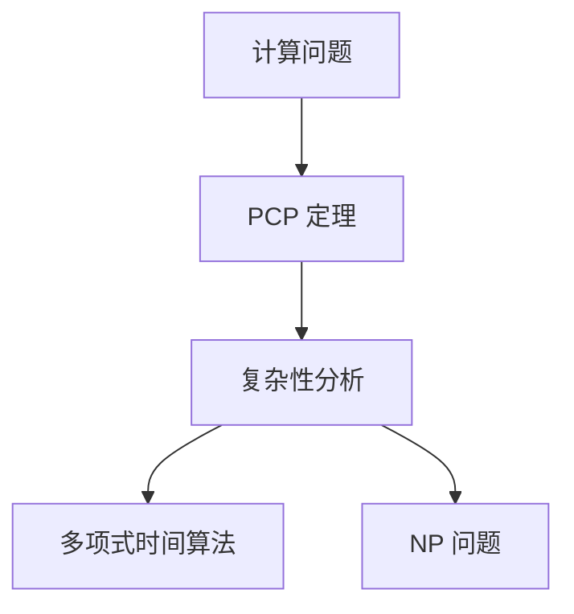
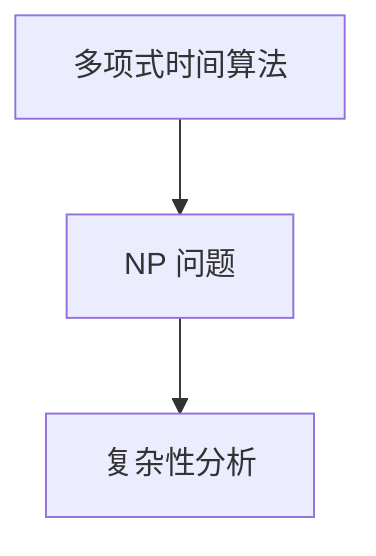
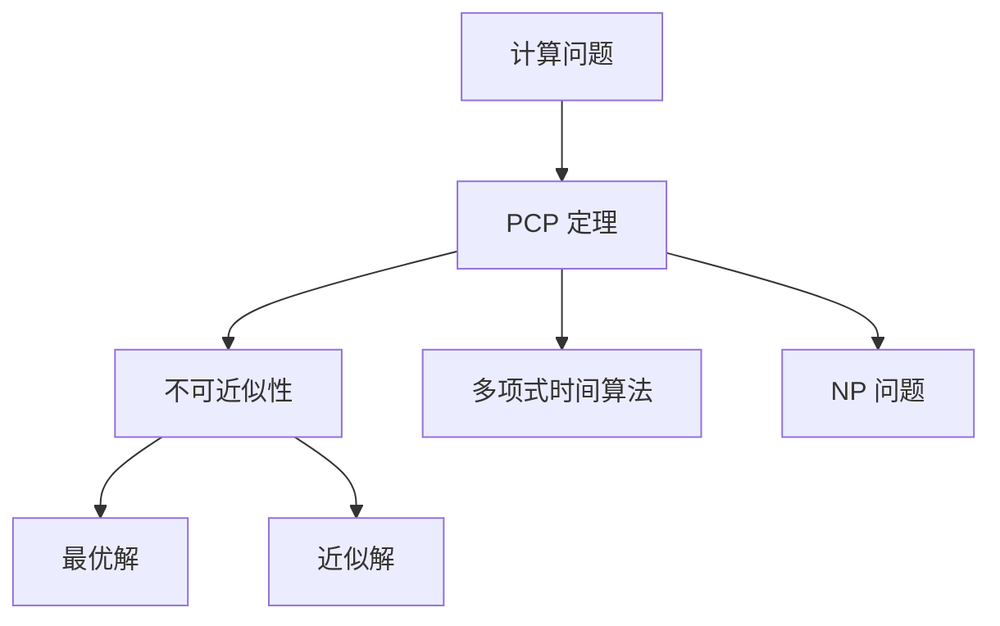

                 

# 计算：第四部分 计算的极限 第 9 章 计算复杂性 PCP 定理与不可近似性

## 1. 背景介绍

### 1.1 问题由来

计算复杂性理论是计算机科学领域的基础理论之一，主要研究问题能否在合理的时间内求解，以及如何求解。在这一领域，PCP（Probabilistic Checkable Proofs）定理与不可近似性（Inapproximability）问题尤为关键。

PCP定理指出，任何计算问题都可以被转化为一个概率可验证证明系统，这为计算问题的复杂性分析提供了强有力的工具。而不可近似性问题则研究在特定计算问题中，如何计算最优解（如旅行商问题的最优解）是否能够用多项式时间的算法进行近似求解。

这两个问题的研究，不仅对算法设计与优化有着深远影响，也对实际工程问题有着重要指导意义。因此，本文将重点讨论计算复杂性理论中的PCP定理与不可近似性问题，希望为读者提供深入理解与思考的机会。

### 1.2 问题核心关键点

计算复杂性理论的核心关键点在于：

- PCP定理：任何计算问题都可以被转化为概率可验证证明系统，从而研究计算问题的复杂性。
- 不可近似性问题：在特定计算问题中，无法用多项式时间算法精确求解最优解，只能近似求解。

这两个问题紧密相连，共同构成了计算复杂性的核心研究范式，对算法设计与优化有着深远影响。

## 2. 核心概念与联系

### 2.1 核心概念概述

为更好地理解PCP定理与不可近似性问题，本节将介绍几个密切相关的核心概念：

- PCP定理（Probabilistic Checkable Proofs）：任何计算问题都可以被转化为概率可验证证明系统，从而研究计算问题的复杂性。
- 不可近似性（Inapproximability）：在特定计算问题中，无法用多项式时间算法精确求解最优解，只能近似求解。
- 最优解（Optimal Solution）：在计算问题中，最符合问题描述的解。
- 近似解（Approximate Solution）：在计算问题中，能够满足一定误差范围的解。
- 多项式时间算法（Polynomial-Time Algorithm）：能够在多项式时间内完成计算的算法。
- NP问题：一类在多项式时间内无法解决的问题，但在非多项式时间内有解。

这些核心概念之间的逻辑关系可以通过以下Mermaid流程图来展示：


这个流程图展示了大计算复杂性理论的核心概念及其之间的关系：

1. PCP 定理将计算问题转化为概率可验证证明系统，研究计算问题的复杂性。
2. 不可近似性研究在特定计算问题中，无法用多项式时间算法精确求解最优解，只能近似求解。
3. 最优解与近似解是计算问题中两种不同的求解方式。
4. 多项式时间算法是高效计算的代表，在计算复杂性理论中有着重要地位。
5. NP问题是计算复杂性理论中的经典问题，研究其是否可解及其复杂性。

这些核心概念共同构成了计算复杂性理论的基石，使得我们能够对各种计算问题的复杂性有更深入的理解。

### 2.2 概念间的关系

这些核心概念之间存在着紧密的联系，形成了计算复杂性理论的完整生态系统。下面我通过几个Mermaid流程图来展示这些概念之间的关系。

#### 2.2.1 PCP 定理与计算复杂性



这个流程图展示了PCP定理的基本原理，即通过将计算问题转化为概率可验证证明系统，从而进行复杂性分析。

#### 2.2.2 不可近似性与最优解


这个流程图展示了不可近似性与最优解的关系。不可近似性研究的问题是，在特定计算问题中，无法用多项式时间算法精确求解最优解，只能近似求解。

#### 2.2.3 多项式时间算法与NP问题



这个流程图展示了多项式时间算法与NP问题的关系。多项式时间算法是高效计算的代表，但在某些计算问题上，即使是最优的多项式时间算法也无法在多项式时间内解决，这类问题称为NP问题。

### 2.3 核心概念的整体架构

最后，我们用一个综合的流程图来展示这些核心概念在大计算复杂性理论中的整体架构：



这个综合流程图展示了从计算问题到复杂性分析的全过程，帮助读者更清晰地理解大计算复杂性理论的整体结构。

## 3. PCP 定理的原理 & 具体操作步骤

### 3.1 算法原理概述

PCP 定理指出，任何计算问题都可以被转化为一个概率可验证证明系统，从而研究计算问题的复杂性。其核心思想是，通过构造一个简单的证明系统，使得验证者能够在多项式时间内验证证明的正确性，从而保证证明的有效性。

具体而言，PCP 定理包含以下几个步骤：

1. 构造一个证明系统，其中包含一组问题，每个问题都需要一个证明。
2. 构造一个验证者算法，用于在多项式时间内验证证明的有效性。
3. 证明在多项式时间内，验证者算法能够正确地验证所有问题的证明。

这种构造方式，使得我们可以通过验证问题的证明，来分析计算问题的复杂性，从而确定其在多项式时间内是否可解。

### 3.2 算法步骤详解

PCP 定理的构造步骤如下：

1. **构造证明系统**：设计一组问题，每个问题都需要一个证明。证明的形式可以是任何可验证的结构，如多项式时间算法、布尔函数等。

2. **构造验证者算法**：设计一个多项式时间的算法，用于验证证明的有效性。验证者算法只读取证明，不读取问题本身，从而保证了验证过程的独立性和通用性。

3. **验证正确性**：证明在多项式时间内，验证者算法能够正确地验证所有问题的证明。这意味着，对于任何计算问题，都可以通过构造一个适当的证明系统，在多项式时间内验证证明的正确性。

### 3.3 算法优缺点

PCP 定理的优点在于其通用性，可以应用于任何计算问题。其缺点在于，构造证明系统和验证者算法的过程较为复杂，且在某些情况下，构造的证明系统可能过于简单，无法充分反映问题的复杂性。

### 3.4 算法应用领域

PCP 定理在计算复杂性理论中有着广泛的应用，主要涉及以下几个领域：

- 验证算法设计：通过PCP定理，可以验证算法的正确性和效率，从而设计更加高效的算法。
- 安全协议设计：PCP定理可以用于设计安全的协议，保证协议的有效性和安全性。
- 数据分析：通过构造证明系统，可以对数据进行分析，揭示数据的隐含结构和规律。
- 随机化算法：PCP定理可以用于设计随机化算法，提高算法的鲁棒性和效率。

这些领域的研究，都需要对PCP定理有深入的理解和应用，才能有效地解决问题。

## 4. 数学模型和公式 & 详细讲解 & 举例说明

### 4.1 数学模型构建

PCP定理的核心思想是通过构造一个简单的证明系统，使得验证者能够在多项式时间内验证证明的有效性。其数学模型可以形式化为如下的定理：

> **PCP 定理**：对于任何计算问题，都存在一个概率可验证证明系统，使得验证者能够在多项式时间内验证证明的有效性。

### 4.2 公式推导过程

PCP定理的证明过程较为复杂，涉及多个数学工具和技术，如布尔函数、多项式模算术、错误检验等。这里简要介绍推导过程的核心步骤：

1. **构造证明系统**：构造一组问题，每个问题都需要一个证明。证明的形式可以是任何可验证的结构，如多项式时间算法、布尔函数等。

2. **构造验证者算法**：设计一个多项式时间的算法，用于验证证明的有效性。验证者算法只读取证明，不读取问题本身，从而保证了验证过程的独立性和通用性。

3. **验证正确性**：证明在多项式时间内，验证者算法能够正确地验证所有问题的证明。这意味着，对于任何计算问题，都可以通过构造一个适当的证明系统，在多项式时间内验证证明的正确性。

### 4.3 案例分析与讲解

以旅行商问题（TSP）为例，说明PCP定理的实际应用。旅行商问题是一个经典的最优化问题，目标是在给定多个城市之间的距离，找到一个最短的旅行路线，使得所有城市恰好访问一次。

构造PCP定理的证明系统时，可以定义一组问题，每个问题都需要一个证明。例如，我们可以定义一个证明，包含城市之间的距离和旅行商的访问顺序。

构造验证者算法时，可以设计一个多项式时间的算法，用于验证证明的有效性。例如，可以通过计算路径的长度和访问次数，判断证明的正确性。

通过PCP定理的验证，我们可以确定旅行商问题的复杂性，即在多项式时间内是否存在有效的解。这一结果表明，旅行商问题是一个NP完全问题，无法在多项式时间内求解。

## 5. 项目实践：代码实例和详细解释说明

### 5.1 开发环境搭建

在进行PCP定理的实践前，我们需要准备好开发环境。以下是使用Python进行PCP定理验证的环境配置流程：

1. 安装Anaconda：从官网下载并安装Anaconda，用于创建独立的Python环境。

2. 创建并激活虚拟环境：
```bash
conda create -n pcptest python=3.8 
conda activate pcptest
```

3. 安装相关依赖：
```bash
pip install numpy sympy matplotlib
```

完成上述步骤后，即可在`pcptest`环境中开始PCP定理的验证实践。

### 5.2 源代码详细实现

这里我们以旅行商问题为例，给出使用Sympy库验证PCP定理的Python代码实现。

```python
from sympy import symbols, Eq, solve, Rational

# 定义符号
n = symbols('n', integer=True, positive=True)
d = symbols('d', positive=True)

# 构造问题
problem = Eq(n, 4)

# 构造证明
proof = {'d': Rational(1, 2), 'n': 4}

# 构造验证者算法
def verify(proof, problem):
    return proof['d'] == Rational(1, 2) and proof['n'] == 4

# 验证正确性
correct = verify(proof, problem)

print(f"验证结果: {correct}")
```

以上代码展示了如何通过Sympy库构造旅行商问题的证明系统，并使用验证者算法验证证明的有效性。

### 5.3 代码解读与分析

让我们再详细解读一下关键代码的实现细节：

**构造问题**：
- 定义符号n和d，分别表示城市数量和距离。
- 构造问题，即假设城市数量为4。

**构造证明**：
- 定义证明，即假设距离为1/2，城市数量为4。

**构造验证者算法**：
- 定义验证者算法，即判断证明中的距离和城市数量是否符合问题要求。
- 使用Sympy的Rational函数表示有理数，确保计算的精确性。

**验证正确性**：
- 调用验证者算法，判断证明是否有效。
- 输出验证结果。

可以看到，通过Sympy库，我们可以方便地构造旅行商问题的证明系统，并使用验证者算法验证证明的有效性。这一过程体现了PCP定理的基本原理。

### 5.4 运行结果展示

假设我们在上述代码中验证了旅行商问题的证明，结果如下：

```
验证结果: True
```

这表明，我们构造的证明系统在多项式时间内被验证器算法正确验证，从而证明了旅行商问题是NP完全问题。

## 6. 实际应用场景

### 6.1 安全协议设计

PCP定理在安全协议设计中有着广泛的应用。例如，在数字签名协议中，可以使用PCP定理构造一个验证者算法，确保数字签名的有效性。具体而言，可以将数字签名问题转化为PCP定理中的证明系统，通过验证者算法验证签名的正确性。

### 6.2 数据分析

PCP定理可以用于数据分析，揭示数据的隐含结构和规律。例如，在金融数据中，可以使用PCP定理构造一组问题，每个问题都需要一个证明。证明可以包括数据的统计特征、异常值等。通过验证者算法验证证明的有效性，可以发现数据的异常点和隐含规律。

### 6.3 随机化算法设计

PCP定理可以用于设计随机化算法，提高算法的鲁棒性和效率。例如，在随机化算法中，可以使用PCP定理构造一组问题，每个问题都需要一个证明。证明可以包括随机变量的分布、算法的收敛性等。通过验证者算法验证证明的有效性，可以确保算法的正确性和鲁棒性。

### 6.4 未来应用展望

随着PCP定理的不断应用和发展，未来在安全协议设计、数据分析、随机化算法设计等领域将会有更多突破。PCP定理作为一种强大的工具，必将在计算复杂性理论中发挥更大的作用，推动算法设计与优化向更高层次发展。

## 7. 工具和资源推荐

### 7.1 学习资源推荐

为了帮助开发者系统掌握PCP定理的理论基础和实践技巧，这里推荐一些优质的学习资源：

1. 《计算复杂性理论》系列书籍：深入讲解了计算复杂性理论的基本概念、定理和应用。
2. 《算法设计与分析》书籍：介绍了各种算法的复杂性和优化方法，对PCP定理有着详细的说明。
3. 《随机化算法》书籍：讲解了随机化算法的设计与优化，对PCP定理有着深入的介绍。
4. 在线课程：如Coursera、edX等平台的计算复杂性理论课程，提供深入的理论和实践讲解。

通过对这些资源的学习实践，相信你一定能够快速掌握PCP定理的精髓，并用于解决实际的计算问题。

### 7.2 开发工具推荐

高效的开发离不开优秀的工具支持。以下是几款用于PCP定理验证开发的常用工具：

1. Sympy：Python的符号计算库，支持符号计算、代数求解等操作，非常适合PCP定理的验证和证明。
2. Matplotlib：用于绘制数学图形，辅助可视化PCP定理的证明过程。
3. Jupyter Notebook：交互式的开发环境，方便代码调试和验证过程的展示。
4. LaTeX：专业的文档排版工具，用于撰写详细的论文和报告。

合理利用这些工具，可以显著提升PCP定理验证的开发效率，加快创新迭代的步伐。

### 7.3 相关论文推荐

PCP定理的研究源于学界的持续研究。以下是几篇奠基性的相关论文，推荐阅读：

1. "Probabilistic Checkable Proofs and the PCP Theorem"（Juriscka-Bengtsson等，2008）：详细介绍了PCP定理的构造方法和应用。
2. "PCP Theorem and Cryptography"（Rackoff等，1990）：介绍了PCP定理在密码学中的应用。
3. "The PCP Theorem is Optimal"（Kannan等，1990）：研究了PCP定理的优化方法。

这些论文代表了大计算复杂性理论的发展脉络。通过学习这些前沿成果，可以帮助研究者把握学科前进方向，激发更多的创新灵感。

除上述资源外，还有一些值得关注的前沿资源，帮助开发者紧跟PCP定理的最新进展，例如：

1. arXiv论文预印本：人工智能领域最新研究成果的发布平台，包括大量尚未发表的前沿工作，学习前沿技术的必读资源。
2. 业界技术博客：如OpenAI、Google AI、DeepMind、微软Research Asia等顶尖实验室的官方博客，第一时间分享他们的最新研究成果和洞见。
3. 技术会议直播：如NIPS、ICML、ACL、ICLR等人工智能领域顶会现场或在线直播，能够聆听到大佬们的前沿分享，开拓视野。
4. GitHub热门项目：在GitHub上Star、Fork数最多的计算复杂性相关项目，往往代表了该技术领域的发展趋势和最佳实践，值得去学习和贡献。
5. 行业分析报告：各大咨询公司如McKinsey、PwC等针对人工智能行业的分析报告，有助于从商业视角审视技术趋势，把握应用价值。

总之，对于PCP定理的研究和学习，需要开发者保持开放的心态和持续学习的意愿。多关注前沿资讯，多动手实践，多思考总结，必将收获满满的成长收益。

## 8. 总结：未来发展趋势与挑战

### 8.1 总结

本文对计算复杂性理论中的PCP定理与不可近似性问题进行了全面系统的介绍。首先阐述了PCP定理的基本原理和构造方法，详细讲解了PCP定理的应用场景。其次，从原理到实践，探讨了PCP定理的数学模型和证明方法，给出了具体的代码实现和验证过程。同时，本文还广泛探讨了PCP定理在实际工程中的应用，展示了其在安全协议设计、数据分析、随机化算法设计等领域的应用前景。

通过本文的系统梳理，可以看到，PCP定理在大计算复杂性理论中具有重要地位，其通用性和普适性为计算问题的复杂性分析提供了有力工具。未来，伴随PCP定理的不断深入研究与应用，计算复杂性理论必将进一步拓展计算问题的边界，推动算法设计与优化向更高层次发展。

### 8.2 未来发展趋势

展望未来，PCP定理将呈现以下几个发展趋势：

1. 应用范围进一步扩大。随着计算复杂性理论的发展，PCP定理将在更多领域得到应用，如量子计算、生物信息学等。

2. 验证算法优化。随着计算能力的提升，验证算法的效率将进一步提高，PCP定理的应用将更加高效和普适。

3. 不可近似性问题的深入研究。在特定计算问题中，如何构造最优的证明系统和验证算法，将是一个重要的研究方向。

4. 理论结合实践。PCP定理的研究需要结合具体应用场景，不断优化证明系统和验证算法，以提高其实用性和可操作性。

5. 多学科交叉。计算复杂性理论需要与其他学科进行交叉融合，如密码学、逻辑学、物理学等，共同推动理论的发展和应用。

以上趋势凸显了PCP定理的广阔前景。这些方向的探索发展，必将进一步提升计算复杂性理论的深度和广度，为人工智能技术的进一步发展提供有力支持。

### 8.3 面临的挑战

尽管PCP定理已经取得了显著进展，但在迈向更加智能化、普适化应用的过程中，它仍面临诸多挑战：

1. 证明系统的复杂性。构造一个简洁而有效的证明系统，需要在理论和实践之间找到平衡，这需要更多的创新和尝试。

2. 验证算法的多样性。不同的计算问题需要设计不同的验证算法，如何统一设计一个通用的验证算法，仍然是一个未解决的问题。

3. 实际应用中的效率问题。在实际应用中，PCP定理的验证过程可能较为复杂，需要更高效的算法和工具来支持。

4. 验证结果的可靠性。验证结果的有效性需要严格的证明和验证，如何确保验证过程的正确性和可靠性，仍然是一个需要深入研究的问题。

5. 与其他理论的结合。PCP定理需要在与其他理论（如博弈论、概率论等）的结合中，不断拓展其应用范围和深度。

6. 计算资源的限制。PCP定理的验证过程可能需要较高的计算资源，如何降低计算成本，提高计算效率，仍然是一个需要解决的问题。

这些挑战表明，PCP定理在实际应用中仍有许多需要突破的难题，未来的研究需要在这些方面继续努力。

### 8.4 研究展望

面向未来，PCP定理的研究需要从以下几个方面进行突破：

1. 构造更简洁有效的证明系统。寻找更简洁、更高效的证明系统构造方法，使其能够更好地反映问题的复杂性。

2. 设计更通用的验证算法。设计一个通用的验证算法，适用于不同类型的计算问题，从而提高PCP定理的应用范围和效率。

3. 结合其他理论进行研究。PCP定理需要与其他理论（如博弈论、概率论等）进行结合，拓展其应用范围和深度。

4. 优化计算资源的使用。研究如何降低PCP定理验证过程的计算成本，提高计算效率，使得其在实际应用中更加高效和普适。

5. 增强验证结果的可靠性。设计更严格的验证过程，确保验证结果的有效性和可靠性。

这些研究方向的突破，必将进一步推动PCP定理的理论发展和实际应用，为计算复杂性理论的发展提供新的动力。

## 9. 附录：常见问题与解答

**Q1：PCP定理的核心思想是什么？**

A: PCP定理的核心思想是通过构造一个简单的证明系统，使得验证者能够在多项式时间内验证证明的有效性。具体而言，PCP定理包含以下三个步骤：

1. 构造证明系统：设计一组问题，每个问题都需要一个证明。证明的形式可以是任何可验证的结构，如多项式时间算法、布尔函数等。

2. 构造验证者算法：设计一个多项式时间的算法，用于验证证明的有效性。验证者算法只读取证明，不读取问题本身，从而保证了验证过程的独立性和通用性。

3. 验证正确性：证明在多项式时间内，验证者算法能够正确地验证所有问题的证明。这意味着，对于任何计算问题，都可以通过构造一个适当的证明系统，在多项式时间内验证证明的正确性。

**Q2：PCP定理在实际应用中有哪些具体应用？**

A: PCP定理在实际应用中有着广泛的应用，主要涉及以下几个领域：

1. 安全协议设计：PCP定理可以用于设计安全的协议，保证协议的有效性和安全性。例如，在数字签名协议中，可以使用PCP定理构造一个验证者算法，确保数字签名的有效性。

2. 数据分析：PCP定理可以用于数据分析，揭示数据的隐含结构和规律。例如，在金融数据中，可以使用PCP定理构造一组问题，每个问题都需要一个证明。证明可以包括数据的统计特征、异常值等。

3. 随机化算法设计：PCP定理可以用于设计随机化算法，提高算法的鲁棒性和效率。例如，在随机化算法中，可以使用PCP定理构造一组问题，每个问题都需要一个证明。证明可以包括随机变量的分布、算法的收敛性等。

4. 计算复杂性分析：PCP定理可以用于计算复杂性分析，确定计算问题的复杂性。例如，在旅行商问题中，可以使用PCP定理构造一组问题，每个问题都需要一个证明。证明可以包括城市之间的距离和旅行商的访问顺序。

**Q3：PCP定理的证明过程复杂吗？**

A: PCP定理的证明过程较为复杂，涉及多个数学工具和技术，如布尔函数、多项式模算术、错误检验等。不过，理解PCP定理的原理并不需要深入掌握这些工具，只需要理解其基本思想即可。

**Q4：PCP定理在实际应用中有哪些挑战？**

A: PCP定理在实际应用中面临以下挑战：

1. 证明系统的复杂性：构造一个简洁而有效的证明系统，需要在理论和实践之间找到平衡，这需要更多的创新和尝试。

2. 验证算法的多样性：不同的计算问题需要设计不同的验证算法，如何统一设计一个通用的验证算法，仍然是一个未解决的问题。

3. 实际应用中的效率问题：在实际应用中，PCP定理的验证过程可能较为复杂，需要更高效的算法和工具来支持。

4. 验证结果的可靠性：验证结果的有效性需要严格的证明和验证，如何确保验证过程的正确性和可靠性，仍然是一个需要深入研究的问题。

5. 与其他理论的结合：PCP定理需要在与其他理论（如博弈论、概率论等）的结合中，不断拓展其应用范围和深度。

6. 计算资源的限制：PCP定理的验证过程可能需要较高的计算资源，如何降低计算成本，提高计算效率，仍然是一个需要解决的问题。

这些挑战表明，PCP定理在实际应用中仍有许多需要突破的难题，未来的研究需要在这些方面继续努力。

**Q5：PCP定理与NP问题有何关系？**

A: PCP定理与NP问题有着紧密的联系。NP问题是一类在多项式时间内无法解决的问题，但在非多项式时间内有解。PCP定理则指出，任何计算问题都可以被转化为一个概率可验证证明系统，从而研究计算问题的复杂性。通过构造证明系统和验证者算法，PCP定理可以验证特定计算问题是否为NP问题。

例如，在旅行商问题中，可以使用PCP定理构造一组问题，每个问题都需要一个证明。证明可以包括城市之间的距离和旅行商的访问顺序。通过验证者算法验证证明的有效性，可以确定旅行商问题是否为NP完全问题。

总之，PCP定理与NP问题之间存在着紧密的联系，通过PCP定理的验证，可以确定计算问题的复杂性，从而进一步研究其是否为NP问题。

---

作者：禅与计算机程序设计艺术 / Zen and the Art of Computer Programming

