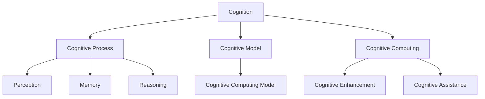
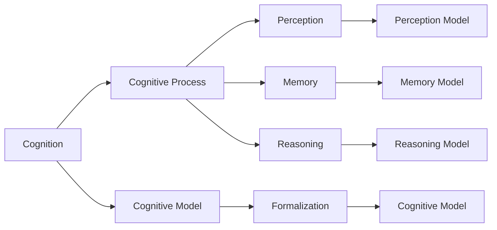
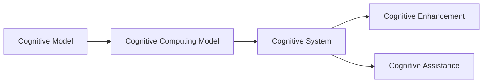
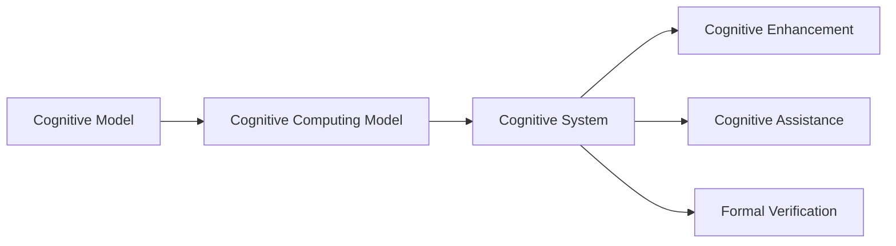

                 

# 认知的形式化：数学思维对于认识宇宙发挥了极其重要的作用

> 关键词：认知、数学思维、宇宙、计算机科学、形式化方法、人工智能

## 1. 背景介绍

### 1.1 问题由来
认知科学是人类理解思维和智能的复杂过程的重要分支。近年来，随着计算机科学、神经科学、心理学等多学科的融合，对认知的认识已经从哲学思辨转向了实证研究。而数学思维，作为一种抽象而强大的工具，对于认识认知过程、建立认知模型、开发认知系统，发挥了极其重要的作用。

特别是形式化方法，利用数学逻辑对认知现象进行描述、推理和验证，在人工智能、认知计算等领域中得到了广泛应用。从认知的形式化，我们可以深入理解认知过程的本质，进而开发出高效、可靠、可解释的认知系统和认知计算模型。

### 1.2 问题核心关键点
认知的形式化，实质上是用数学和逻辑形式来描述和表示认知过程，使复杂而模糊的认知现象得以精确表达和计算。其核心包括以下几个方面：

- 认知过程的形式化：将认知过程分解为一系列数学或逻辑表达式，用以描述认知的输入、处理、输出等过程。
- 认知模型的形式化：利用数学或逻辑语言，定义认知模型的结构和行为，用以刻画认知系统的功能和特性。
- 认知系统的形式化：将认知系统构建为计算机程序或软件，使用形式化方法验证和测试其正确性和可靠性。

这些关键点共同构成了认知的形式化，使我们能够通过计算机手段，对认知现象进行模拟、预测和控制。

### 1.3 问题研究意义
认知的形式化，具有重要的理论和实际意义：

1. **理论意义**：数学思维的引入，使认知研究从纯粹的思辨走向实证，为理解认知本质提供了全新的视角和方法。
2. **实际意义**：形式化方法为认知系统的开发提供了数学基础，使认知计算、认知增强、认知辅助等技术成为可能，推动了认知科学和人工智能的发展。
3. **跨学科意义**：数学思维和形式化方法，为不同学科之间的交流和合作提供了共同的语言，促进了认知科学的跨学科研究。

## 2. 核心概念与联系

### 2.1 核心概念概述

为更好地理解认知的形式化，本节将介绍几个密切相关的核心概念：

- **认知**：指人类或机器对外部信息进行处理、记忆、推理、决策等心理活动的总称。认知包括感知、记忆、思维、情感等多个方面。
- **认知过程**：指认知系统接受输入信息、处理信息、输出结果的过程，包括感知、记忆、推理等子过程。
- **认知模型**：指用数学或逻辑语言对认知过程和认知系统进行抽象描述，用于建模和模拟认知现象。
- **认知计算**：指利用计算机技术，对认知现象进行计算和模拟，以理解和控制认知过程。
- **形式化方法**：指使用数学和逻辑语言对问题进行严格定义、表示和验证，以建立精确的数学模型和逻辑系统。
- **认知计算模型**：指使用形式化方法，建立认知模型的计算机程序或软件系统。

这些核心概念之间的逻辑关系可以通过以下Mermaid流程图来展示：



这个流程图展示了几大核心概念及其之间的关系：

1. 认知由感知、记忆、推理等过程组成。
2. 认知模型通过形式化方法，对认知过程进行数学或逻辑描述。
3. 认知计算利用计算机技术，对认知过程进行模拟和计算。
4. 认知增强和辅助，旨在提升认知系统的功能和性能。

### 2.2 概念间的关系

这些核心概念之间存在着紧密的联系，形成了认知的形式化框架。下面我通过几个Mermaid流程图来展示这些概念之间的关系。

#### 2.2.1 认知的形式化过程



这个流程图展示了认知的形式化过程。通过形式化方法，将认知过程分解为感知模型、记忆模型和推理模型，并用数学或逻辑语言描述这些模型，形成认知模型。

#### 2.2.2 认知计算的实现



这个流程图展示了认知计算的实现。将认知模型转化为计算机程序或软件系统，用于实现认知增强和辅助功能。

#### 2.2.3 认知计算模型的评估



这个流程图展示了认知计算模型的评估。利用形式化方法，对认知计算模型进行验证和测试，确保其正确性和可靠性。

### 2.3 核心概念的整体架构

最后，我们用一个综合的流程图来展示这些核心概念在大语言模型微调过程中的整体架构：

```mermaid
graph TB
    A[Cognitive Process] --> B[Cognitive Model]
    A --> C[Cognitive Computing Model]
    B --> D[Cognitive Enhancement]
    B --> E[Cognitive Assistance]
    C --> F[Cognitive System]
    D --> G[Cognitive System]
    E --> H[Cognitive System]
    F --> I[Cognitive System]
    G --> J[Cognitive System]
    H --> K[Cognitive System]
    I --> L[Cognitive System]
    J --> M[Cognitive System]
    K --> N[Cognitive System]
    L --> O[Cognitive System]
    M --> P[Cognitive System]
    N --> Q[Cognitive System]
    O --> R[Cognitive System]
    P --> S[Cognitive System]
    Q --> T[Cognitive System]
    R --> U[Cognitive System]
    S --> V[Cognitive System]
    T --> W[Cognitive System]
    U --> X[Cognitive System]
    V --> Y[Cognitive System]
    W --> Z[Cognitive System]
    X --> AA[Cognitive System]
    Y --> AB[Cognitive System]
    Z --> AC[Cognitive System]
    AA --> AD[Cognitive System]
    AB --> AE[Cognitive System]
    AC --> AF[Cognitive System]
    AD --> AG[Cognitive System]
    AE --> AH[Cognitive System]
    AF --> AI[Cognitive System]
    AG --> AJ[Cognitive System]
    AH --> AK[Cognitive System]
    AI --> AL[Cognitive System]
    AJ --> AM[Cognitive System]
    AK --> AN[Cognitive System]
    AL --> AO[Cognitive System]
    AM --> AP[Cognitive System]
    AN --> AQ[Cognitive System]
    AO --> AR[Cognitive System]
    AP --> AS[Cognitive System]
    AQ --> AT[Cognitive System]
    AR --> AU[Cognitive System]
    AS --> AV[Cognitive System]
    AT --> AW[Cognitive System]
    AU --> AX[Cognitive System]
    AV --> AY[Cognitive System]
    AW --> AZ[Cognitive System]
    AX --> BA[Cognitive System]
    AY --> BB[Cognitive System]
    AZ --> BC[Cognitive System]
    BA --> BD[Cognitive System]
    BB --> BE[Cognitive System]
    BC --> BF[Cognitive System]
    BD --> BG[Cognitive System]
    BE --> BH[Cognitive System]
    BF --> BI[Cognitive System]
    BG --> BJ[Cognitive System]
    BH --> BK[Cognitive System]
    BI --> BL[Cognitive System]
    BJ --> BM[Cognitive System]
    BK --> BN[Cognitive System]
    BL --> BO[Cognitive System]
    BM --> BP[Cognitive System]
    BN --> BQ[Cognitive System]
    BO --> BR[Cognitive System]
    BP --> BS[Cognitive System]
    BQ --> BT[Cognitive System]
    BR --> BU[Cognitive System]
    BS --> BV[Cognitive System]
    BT --> BW[Cognitive System]
    BU --> BX[Cognitive System]
    BV --> BY[Cognitive System]
    BW --> BZ[Cognitive System]
    BX --> CA[Cognitive System]
    BY --> CB[Cognitive System]
    BZ --> CC[Cognitive System]
    CA --> CD[Cognitive System]
    CB --> CE[Cognitive System]
    CC --> CF[Cognitive System]
    CD --> CG[Cognitive System]
    CE --> CH[Cognitive System]
    CF --> CI[Cognitive System]
    CG --> CJ[Cognitive System]
    CH --> CK[Cognitive System]
    CI --> CL[Cognitive System]
    CJ --> CM[Cognitive System]
    CK --> CN[Cognitive System]
    CL --> CO[Cognitive System]
    CM --> CP[Cognitive System]
    CN --> CQ[Cognitive System]
    CO --> CR[Cognitive System]
    CP --> CS[Cognitive System]
    CQ --> CT[Cognitive System]
    CR --> CU[Cognitive System]
    CS --> CV[Cognitive System]
    CT --> CW[Cognitive System]
    CU --> CX[Cognitive System]
    CV --> CY[Cognitive System]
    CW --> CZ[Cognitive System]
    CX --> DA[Cognitive System]
    CY --> DB[Cognitive System]
    CZ --> DC[Cognitive System]
    DA --> DD[Cognitive System]
    DB --> DE[Cognitive System]
    DC --> DF[Cognitive System]
    DD --> DG[Cognitive System]
    DE --> DH[Cognitive System]
    DF --> DI[Cognitive System]
    DG --> DJ[Cognitive System]
    DH --> DK[Cognitive System]
    DI --> DL[Cognitive System]
    DJ --> DM[Cognitive System]
    DK --> DN[Cognitive System]
    DL --> DO[Cognitive System]
    DM --> DP[Cognitive System]
    DN --> DQ[Cognitive System]
    DO --> DR[Cognitive System]
    DP --> DS[Cognitive System]
    DQ --> DT[Cognitive System]
    DR --> DU[Cognitive System]
    DS --> DV[Cognitive System]
    DT --> DW[Cognitive System]
    DU --> DX[Cognitive System]
    DV --> DY[Cognitive System]
    DW --> DZ[Cognitive System]
    DX --> EA[Cognitive System]
    DY --> EB[Cognitive System]
    DZ --> EC[Cognitive System]
    EA --> ED[Cognitive System]
    EB --> EE[Cognitive System]
    EC --> EF[Cognitive System]
    ED --> EG[Cognitive System]
    EE --> EH[Cognitive System]
    EF --> EI[Cognitive System]
    EG --> EJ[Cognitive System]
    EH --> EK[Cognitive System]
    EI --> EL[Cognitive System]
    EJ --> EM[Cognitive System]
    EK --> EN[Cognitive System]
    EL --> EO[Cognitive System]
    EM --> EP[Cognitive System]
    EN --> EQ[Cognitive System]
    EO --> ER[Cognitive System]
    EP --> ES[Cognitive System]
    EQ --> ET[Cognitive System]
    ER --> EU[Cognitive System]
    ES --> EV[Cognitive System]
    ET --> EW[Cognitive System]
    EU --> EX[Cognitive System]
    EV --> EY[Cognitive System]
    EW --> EZ[Cognitive System]
    EX --> FA[Cognitive System]
    EY --> FB[Cognitive System]
    EZ --> FC[Cognitive System]
    FA --> FD[Cognitive System]
    FB --> FE[Cognitive System]
    FC --> FF[Cognitive System]
    FD --> FG[Cognitive System]
    FE --> FH[Cognitive System]
    FF --> FI[Cognitive System]
    FG --> FJ[Cognitive System]
    FH --> FK[Cognitive System]
    FI --> FL[Cognitive System]
    FJ --> FM[Cognitive System]
    FK --> FN[Cognitive System]
    FL --> FO[Cognitive System]
    FM --> FP[Cognitive System]
    FN --> FQ[Cognitive System]
    FO --> FR[Cognitive System]
    FP --> FS[Cognitive System]
    FQ --> FT[Cognitive System]
    FR --> FU[Cognitive System]
    FS --> FV[Cognitive System]
    FT --> FW[Cognitive System]
    FU --> FX[Cognitive System]
    FV --> FY[Cognitive System]
    FW --> FZ[Cognitive System]
    FX --> GA[Cognitive System]
    FY --> GB[Cognitive System]
    FZ --> GC[Cognitive System]
    GA --> GD[Cognitive System]
    GB --> GE[Cognitive System]
    GC --> GF[Cognitive System]
    GD --> GG[Cognitive System]
    GE --> GH[Cognitive System]
    GF --> GI[Cognitive System]
    GG --> GJ[Cognitive System]
    GH --> GK[Cognitive System]
    GI --> GL[Cognitive System]
    GJ --> GM[Cognitive System]
    GK --> GN[Cognitive System]
    GL --> GO[Cognitive System]
    GM --> GP[Cognitive System]
    GN --> GQ[Cognitive System]
    GO --> GR[Cognitive System]
    GP --> GS[Cognitive System]
    GQ --> GT[Cognitive System]
    GR --> GU[Cognitive System]
    GS -->GV[Cognitive System]
    GT --> GW[Cognitive System]
    GU --> GX[Cognitive System]
    GV -->GY[Cognitive System]
    GW --> GZ[Cognitive System]
    GX --> HA[Cognitive System]
    GY --> HB[Cognitive System]
    GZ --> HC[Cognitive System]
    HA --> HD[Cognitive System]
    HB --> HE[Cognitive System]
    HC --> HF[Cognitive System]
    HD --> HG[Cognitive System]
    HE --> HH[Cognitive System]
    HF --> HI[Cognitive System]
    HG --> HJ[Cognitive System]
    HH --> HK[Cognitive System]
    HI --> HL[Cognitive System]
    HJ --> HM[Cognitive System]
    HK --> HN[Cognitive System]
    HL --> HO[Cognitive System]
    HM --> HP[Cognitive System]
    HN --> HQ[Cognitive System]
    HO --> HR[Cognitive System]
    HP --> HS[Cognitive System]
    HQ --> HT[Cognitive System]
    HR --> HU[Cognitive System]
    HS --> HV[Cognitive System]
    HT --> HW[Cognitive System]
    HU --> HX[Cognitive System]
    HV --> HY[Cognitive System]
    HW --> HZ[Cognitive System]
    HX --> IA[Cognitive System]
    HY --> IB[Cognitive System]
    HZ --> IC[Cognitive System]
    IA --> ID[Cognitive System]
    IB --> IE[Cognitive System]
    IC --> IF[Cognitive System]
    ID --> IG[Cognitive System]
    IE --> IH[Cognitive System]
    IF --> IJ[Cognitive System]
    IG --> IK[Cognitive System]
    IH --> IL[Cognitive System]
    IJ --> IM[CognitiveSystem]
    IK --> IN[Cognitive System]
    IL --> IO[Cognitive System]
    IM --> IP[Cognitive System]
    IN --> IQ[Cognitive System]
    IO --> IR[CognitiveSystem]
    IP --> IS[Cognitive System]
    IQ --> IT[Cognitive System]
    IR --> IU[CognitiveSystem]
    IS --> IV[Cognitive System]
    IT --> IW[CognitiveSystem]
    IU --> IX[Cognitive System]
    IV --> IY[CognitiveSystem]
    IW --> IZ[CognitiveSystem]
    IX -->JA[CognitiveSystem]
    IY --> JB[CognitiveSystem]
    IZ -->JC[CognitiveSystem]
    JA --> JD[CognitiveSystem]
    JB -->JE[CognitiveSystem]
    JC --> JF[CognitiveSystem]
    JD --> JG[CognitiveSystem]
    JE --> JH[CognitiveSystem]
    JF --> JI[CognitiveSystem]
    JG --> JJ[CognitiveSystem]
    JH --> JK[CognitiveSystem]
    JI --> JL[CognitiveSystem]
    JJ --> JK[CognitiveSystem]
    JK --> JN[CognitiveSystem]
    JL --> JO[CognitiveSystem]
    JN --> JP[CognitiveSystem]
    JO --> JQ[CognitiveSystem]
    JP --> JR[CognitiveSystem]
    JQ --> JS[CognitiveSystem]
    JR --> JU[CognitiveSystem]
    JS --> JV[CognitiveSystem]
    JU --> JW[CognitiveSystem]
    JV --> JX[CognitiveSystem]
    JW --> JY[CognitiveSystem]
    JX --> JZ[CognitiveSystem]
    JY -->KA[CognitiveSystem]
    JZ --> KB[CognitiveSystem]
    KA --> KD[CognitiveSystem]
    KB --> KE[CognitiveSystem]
    KC --> KF[CognitiveSystem]
    KD --> KG[CognitiveSystem]
    KE --> KH[CognitiveSystem]
    KF --> KI[CognitiveSystem]
    KG --> KJ[CognitiveSystem]
    KH --> KK[CognitiveSystem]
    KI --> KL[CognitiveSystem]
    KJ --> KM[CognitiveSystem]
    KK --> KN[CognitiveSystem]
    KL --> KO[CognitiveSystem]
    KM --> KP[CognitiveSystem]
    KN --> KQ[CognitiveSystem]
    KO --> KR[CognitiveSystem]
    KP --> KS[CognitiveSystem]
    KQ --> KT[CognitiveSystem]
    KR --> KU[CognitiveSystem]
    KS --> KV[CognitiveSystem]
    KT --> KW[CognitiveSystem]
    KU --> KX[CognitiveSystem]
    KV --> KY[CognitiveSystem]
    KW --> KZ[CognitiveSystem]
    KX --> LA[CognitiveSystem]
    KY --> LB[CognitiveSystem]
    KZ --> LC[CognitiveSystem]
    LA --> LD[CognitiveSystem]
    LB --> LE[CognitiveSystem]
    LC --> LF[CognitiveSystem]
    LD --> LG[CognitiveSystem]
    LE --> LH[CognitiveSystem]
    LF --> LI[CognitiveSystem]
    LG --> LJ[CognitiveSystem]
    LH --> LK[CognitiveSystem]
    LI --> LL[CognitiveSystem]
    LJ --> LM[CognitiveSystem]
    LK --> LN[CognitiveSystem]
    LL --> LO[CognitiveSystem]
    LM --> LP[CognitiveSystem]
    LN --> LQ[CognitiveSystem]
    LO --> LR[CognitiveSystem]
    LP --> LS[CognitiveSystem]
    LQ --> LT[CognitiveSystem]
    LR --> LU[CognitiveSystem]
    LS --> LV[CognitiveSystem]
    LT --> LW[CognitiveSystem]
    LU --> LX[CognitiveSystem]
    LV --> LY[CognitiveSystem]
    LW --> LZ[CognitiveSystem]
    LX --> MA[CognitiveSystem]
    LY --> MB[CognitiveSystem]
    LZ --> MC[CognitiveSystem]
    MA --> MD[CognitiveSystem]
    MB --> ME[CognitiveSystem]
    MC --> MF[CognitiveSystem]
    MD --> MG[CognitiveSystem]
    ME --> MH[CognitiveSystem]
    MF --> MI[CognitiveSystem]
    MG --> MJ[CognitiveSystem]
    MH --> MK[CognitiveSystem]
    MI --> ML[CognitiveSystem]
    MJ --> MM[CognitiveSystem]
    MK --> MN[CognitiveSystem]
    ML --> MO[CognitiveSystem]
    MM --> MP[CognitiveSystem]
    MN --> MQ[CognitiveSystem]
    MO --> MR[CognitiveSystem]
    MP --> MS[CognitiveSystem]
    MQ --> MT[CognitiveSystem]
    MR --> MU[CognitiveSystem]
    MS --> MV[CognitiveSystem]
    MT --> MW[CognitiveSystem]
    MU --> MX[CognitiveSystem]
    MV --> MY[CognitiveSystem]
    MW --> MZ[CognitiveSystem]
    MX --> NA[CognitiveSystem]
    MY --> NB[CognitiveSystem]
    MZ --> NC[CognitiveSystem]
    NA --> ND[CognitiveSystem]
    NB --> NE[CognitiveSystem]
    NC --> NF[CognitiveSystem]
    ND --> NG[CognitiveSystem]
    NE --> NH[CognitiveSystem]
    NF --> NI[CognitiveSystem]
    NG --> NJ[CognitiveSystem]
    NH --> NK[CognitiveSystem]
    NI --> NL[CognitiveSystem]
    NJ --> NM[CognitiveSystem]
    NK --> NN[CognitiveSystem]
    NL --> NO[CognitiveSystem]
    NM --> NP[CognitiveSystem]
    NN --> NQ[CognitiveSystem]
    NO --> NR[CognitiveSystem]
    NP --> NS[CognitiveSystem]
    NQ --> NT[CognitiveSystem]
    NR --> NU[CognitiveSystem]
    NS --> NV[CognitiveSystem]
    NT --> NW[CognitiveSystem]
    NU --> NX[CognitiveSystem]
    NV --> NY[CognitiveSystem]
    NW --> NZ[CognitiveSystem]
    NX --> OA[CognitiveSystem]
    NY --> OB[CognitiveSystem]
    NZ --> OC[CognitiveSystem]
    OA --> OD[CognitiveSystem]
    OB --> OE[CognitiveSystem]
    OC --> OF[CognitiveSystem]
    OD --> OG[CognitiveSystem]
    OE --> OH[CognitiveSystem]
    OF --> OI[CognitiveSystem]
    OG --> OJ[CognitiveSystem]
    OH --> OK[CognitiveSystem]
    OI --> OL[CognitiveSystem]
    OJ --> OM[CognitiveSystem]
    OK --> ON[CognitiveSystem]
    OL --> OO[CognitiveSystem]
    OM --> OP[CognitiveSystem]
    ON --> OQ[CognitiveSystem]
    OO --> OR[CognitiveSystem]
    OP --> OS[CognitiveSystem]
    OQ --> OT[CognitiveSystem]
    OR -->OU[CognitiveSystem]
    OS -->OV[CognitiveSystem]
    OT --> OW[CognitiveSystem]
    OU -->OX[CognitiveSystem]
    OV -->OY[CognitiveSystem]
    OW -->OZ[CognitiveSystem]
    OX --> PA[CognitiveSystem]
    OY --> PB[CognitiveSystem]
    OZ --> PC[CognitiveSystem]
    PA --> PD[CognitiveSystem]
    PB --> PE[CognitiveSystem]
    PC --> PF[CognitiveSystem]
    PD --> PG[CognitiveSystem]
    PE --> PH[CognitiveSystem]
    PF --> PI[CognitiveSystem]
    PG --> PJ[CognitiveSystem]
    PH --> PK[CognitiveSystem]
    PI --> PL[CognitiveSystem]
    PJ --> PM[CognitiveSystem]
    PK --> PN[CognitiveSystem]
    PL --> PO[CognitiveSystem]
    PM --> PP[CognitiveSystem]
    PN --> PQ[CognitiveSystem]
    PO --> PR[CognitiveSystem]
    PP --> PS[CognitiveSystem]
    PQ --> PT[CognitiveSystem]
    PR -->PU[CognitiveSystem]
    PS --> PV[CognitiveSystem]
    PT --> PW[CognitiveSystem]
    PU --> PX[CognitiveSystem]
    PV --> PY[CognitiveSystem]
    PW --> PZ[CognitiveSystem]
    PX -->QA[CognitiveSystem]
    PY --> QB[CognitiveSystem]
    PZ --> QC[CognitiveSystem]
    QA --> QD[CognitiveSystem]
    QB --> QE[CognitiveSystem]
    QC --> QF[CognitiveSystem]
    QD --> QG[CognitiveSystem]
    QE --> QH[CognitiveSystem]
    QF --> QI[CognitiveSystem]
    QG --> QJ[CognitiveSystem]
    QH --> QK[CognitiveSystem]
    QI --> QL[CognitiveSystem]
    QJ --> QM[CognitiveSystem]
    QK --> QN[CognitiveSystem]
    QL --> QO[CognitiveSystem]
    QM --> QP[CognitiveSystem]
    QN --> QQ[CognitiveSystem]
    QO --> QR[CognitiveSystem]
    QP --> QS[CognitiveSystem]
    QQ --> QT[CognitiveSystem]
    QR --> QU[CognitiveSystem]
    QS --> QV[CognitiveSystem]
    QT --> QW[CognitiveSystem]
    QU --> QX[CognitiveSystem]
    QV --> QY[CognitiveSystem]
    QW --> QZ[CognitiveSystem]
    QX --> RA[CognitiveSystem]
    QY --> RB[CognitiveSystem]
    QZ --> RC[CognitiveSystem]
    RA --> RD[CognitiveSystem]
    RB --> RE[CognitiveSystem]
    RC --> RF[CognitiveSystem]
    RD --> RG[CognitiveSystem]
    RE --> RH[CognitiveSystem]
    RF --> RI[CognitiveSystem]
    RG --> RJ[CognitiveSystem]
    RH --> RK[CognitiveSystem]
    RI --> RL[CognitiveSystem]
    RJ --> RM[CognitiveSystem]
    RK --> RN[CognitiveSystem]
    RL --> RO[CognitiveSystem]
    RM --> RP[CognitiveSystem]
    RN --> RQ[CognitiveSystem]
    RO --> RR[CognitiveSystem]
    RP --> RS[CognitiveSystem]
    RQ --> RT[CognitiveSystem]
    RR --> RU[CognitiveSystem]
    RS --> RV[CognitiveSystem]
    RT --> RW[CognitiveSystem]
    RU --> RX[CognitiveSystem]
    RV --> RY[CognitiveSystem]
    RW --> RZ[CognitiveSystem]
    RX --> SA[CognitiveSystem]
    RY --> SB[CognitiveSystem]
    RZ --> SC[CognitiveSystem]
    SA --> SD[CognitiveSystem]
    SB --> SE[CognitiveSystem]
    SC --> SF[CognitiveSystem]
    SD --> SG[CognitiveSystem]
    SE --> SH[CognitiveSystem]
    SF --> SI[CognitiveSystem]
    SG --> SJ[CognitiveSystem]
    SH --> SK[CognitiveSystem]
    SI --> SL[CognitiveSystem]
    SJ --> SM[CognitiveSystem]
    SK --> SN[CognitiveSystem]
    SL --> SO[CognitiveSystem]
    SM --> SP[CognitiveSystem]
    SN --> SQ[CognitiveSystem]
    SO --> SR[CognitiveSystem]
    SP --> SS[CognitiveSystem]
    SQ --> ST[CognitiveSystem]
    SR --> SU[CognitiveSystem]
    SS --> SV[CognitiveSystem]
    ST --> SW[CognitiveSystem]
    SU --> SX[CognitiveSystem]
    SV --> SY[CognitiveSystem]
    SW --> SZ[CognitiveSystem]
    SX --> TA[CognitiveSystem]
    SY --> TB[CognitiveSystem]
    SZ --> TC[CognitiveSystem]
    TA --> TD[CognitiveSystem]
    TB --> TE[CognitiveSystem]
    TC --> TF[CognitiveSystem]
    TD --> TG[CognitiveSystem]
    TE --> TH[CognitiveSystem]
    TF --> TI[CognitiveSystem]
    TG --> TJ[CognitiveSystem]
    TH --> TK[CognitiveSystem]
    TI --> TL[CognitiveSystem]
    TJ --> TM[CognitiveSystem]
    TK --> TN[CognitiveSystem]
    TL --> TO[CognitiveSystem]
    TM --> TP[CognitiveSystem]
    TN --> TQ[CognitiveSystem]
    TO --> TR[CognitiveSystem]


