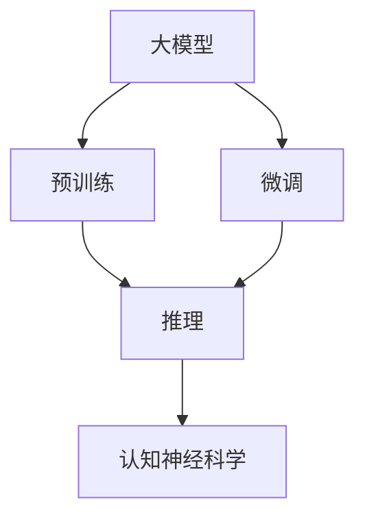

                 

# 语言与推理：大模型的认知误解

> 关键词：认知神经科学, 大模型, 推理, 自然语言处理(NLP), 预训练, 微调, 认知误解

## 1. 背景介绍

在人工智能技术迅猛发展的今天，自然语言处理(NLP)成为了智能系统的核心技术之一。大模型，如GPT-3、BERT等，凭借其强大的语言理解能力，在诸多NLP任务上取得了前所未有的成果。然而，这些大模型在推理能力方面的表现却常受诟病。

大模型的推理能力源自其对大量文本数据的预训练。但预训练过程存在很多问题，如缺少常识性信息、难以解释其推理过程等。此外，微调过程中训练数据的质量和数量也直接影响模型的推理性能。因此，本文将深入探讨大模型在推理过程中的认知误解，并提出相应的解决方案。

## 2. 核心概念与联系

### 2.1 核心概念概述

- **大模型**：基于深度学习技术训练的大型语言模型，如GPT-3、BERT等，通过预训练和微调，能够理解和生成自然语言。
- **预训练**：通过大规模无标签文本数据的自监督学习，学习语言的基本规律和知识。
- **微调**：通过下游任务的小规模有标签数据，对预训练模型进行任务特定的优化。
- **推理**：利用训练好的模型对新的输入数据进行分析和判断，生成输出结果。
- **认知神经科学**：研究人类认知过程及其神经机制的科学，对大模型推理能力的提升有重要启示。
- **认知误解**：由于大模型的推理过程存在逻辑错误、知识缺失等问题，其推理结果与人类认知存在差异。

这些核心概念之间的联系可以形成一个有机的系统。预训练模型学习语言知识，微调模型针对特定任务进行优化，推理模型则利用这些知识对新的输入进行分析和判断。认知神经科学提供了解释和改进推理模型的可能路径。

### 2.2 核心概念的关系

以上核心概念之间的关系可以用以下的Mermaid流程图表示：



这个流程图展示了预训练模型、微调模型和推理模型之间的相互联系，以及认知神经科学对推理模型的重要影响。

## 3. 核心算法原理 & 具体操作步骤

### 3.1 算法原理概述

大模型的推理能力基于其在预训练和微调过程中学习到的语言知识。但这些知识的获取并不是完美无缺的，存在一定的认知误解。以下是基于监督学习的大模型推理的算法原理概述：

- **预训练阶段**：通过大规模无标签文本数据的自监督学习，模型学习语言的规律和语义。
- **微调阶段**：通过下游任务的有标签数据，模型学习特定任务的语义和逻辑。
- **推理阶段**：将预训练和微调得到的语言知识应用于新的输入数据，进行分析和判断，生成输出结果。

### 3.2 算法步骤详解

以下是基于监督学习的大模型推理的详细步骤：

1. **准备数据**：收集下游任务的有标签数据，划分为训练集、验证集和测试集。
2. **模型初始化**：选择预训练模型（如GPT-3、BERT等）作为初始参数。
3. **模型微调**：使用训练集进行微调，优化模型在特定任务上的性能。
4. **推理应用**：在测试集上评估微调后模型的推理性能，并在实际应用中对新数据进行推理。

### 3.3 算法优缺点

基于监督学习的大模型推理具有以下优点：

- 简单高效：只需要准备少量标注数据，即可对预训练模型进行微调，获得较好的推理结果。
- 通用适用：适用于各种NLP下游任务，如分类、匹配、生成等。

同时，也存在一些缺点：

- 依赖标注数据：微调的效果很大程度上取决于标注数据的质量和数量。
- 认知误解：由于预训练数据和微调数据的不足，模型推理存在逻辑错误、知识缺失等问题。
- 缺乏解释性：微调模型的推理过程难以解释，难以调试和优化。

### 3.4 算法应用领域

大模型的推理能力可以应用于多种领域，如：

- 自然语言理解(NLU)：将自然语言转化为结构化数据，用于搜索引擎、智能客服等。
- 问答系统：回答用户提出的问题，提供精确、快速的回答。
- 机器翻译：将一种语言翻译成另一种语言。
- 情感分析：分析文本的情感倾向，用于舆情监控、品牌分析等。

此外，大模型的推理能力还可以用于自动化编写、智能推荐、文本摘要等。

## 4. 数学模型和公式 & 详细讲解

### 4.1 数学模型构建

在大模型的推理过程中，通常使用向量表示输入和输出。记输入向量为 $x \in \mathbb{R}^d$，输出向量为 $y \in \mathbb{R}^k$。推理模型 $f$ 的数学模型可以表示为：

$$
y = f(x)
$$

其中 $f$ 为模型函数，通过训练和优化学习得到。

### 4.2 公式推导过程

大模型推理的公式推导过程如下：

1. **输入编码**：将输入 $x$ 转化为模型的输入表示，记为 $h \in \mathbb{R}^d$。
2. **前向传播**：通过模型函数 $f$，将输入表示 $h$ 转化为输出表示 $y$。
3. **损失函数**：定义损失函数 $L(y, \hat{y})$，衡量模型输出 $y$ 与真实标签 $\hat{y}$ 之间的差异。
4. **优化目标**：最小化损失函数 $L(y, \hat{y})$，更新模型参数，优化推理性能。

### 4.3 案例分析与讲解

以问答系统为例，我们定义一个简单的推理模型：

1. **输入编码**：将问题 $x$ 转化为模型的输入表示 $h$，可以使用预训练语言模型的词嵌入或其他特征提取器。
2. **前向传播**：通过模型函数 $f$，将输入表示 $h$ 转化为答案 $y$。
3. **损失函数**：定义交叉熵损失函数 $L(y, \hat{y})$，衡量模型输出 $y$ 与真实答案 $\hat{y}$ 之间的差异。
4. **优化目标**：最小化损失函数 $L(y, \hat{y})$，更新模型参数，优化推理性能。

下面以一个简单的例子来说明推理过程：

- **输入**："Who is the president of China?" 
- **编码**：将问题编码为模型需要的向量表示。
- **推理**：通过模型函数 $f$，生成答案向量 $y$。
- **损失**：计算损失 $L(y, \hat{y})$。
- **更新**：根据损失函数反向传播，更新模型参数，优化推理性能。

## 5. 项目实践：代码实例和详细解释说明

### 5.1 开发环境搭建

在进行推理实践前，我们需要准备好开发环境。以下是使用Python进行PyTorch开发的环境配置流程：

1. 安装Anaconda：从官网下载并安装Anaconda，用于创建独立的Python环境。
2. 创建并激活虚拟环境：
```bash
conda create -n pytorch-env python=3.8 
conda activate pytorch-env
```
3. 安装PyTorch：根据CUDA版本，从官网获取对应的安装命令。例如：
```bash
conda install pytorch torchvision torchaudio cudatoolkit=11.1 -c pytorch -c conda-forge
```
4. 安装Transformers库：
```bash
pip install transformers
```
5. 安装各类工具包：
```bash
pip install numpy pandas scikit-learn matplotlib tqdm jupyter notebook ipython
```

完成上述步骤后，即可在`pytorch-env`环境中开始推理实践。

### 5.2 源代码详细实现

下面我们以问答系统为例，给出使用Transformers库进行BERT模型推理的PyTorch代码实现。

首先，定义推理任务的数据处理函数：

```python
from transformers import BertTokenizer
from torch.utils.data import Dataset
import torch

class QuestionDataset(Dataset):
    def __init__(self, questions, answers, tokenizer, max_len=128):
        self.questions = questions
        self.answers = answers
        self.tokenizer = tokenizer
        self.max_len = max_len
        
    def __len__(self):
        return len(self.questions)
    
    def __getitem__(self, item):
        question = self.questions[item]
        answer = self.answers[item]
        
        encoding = self.tokenizer(question, return_tensors='pt', max_length=self.max_len, padding='max_length', truncation=True)
        input_ids = encoding['input_ids'][0]
        attention_mask = encoding['attention_mask'][0]
        
        # 对token-wise的标签进行编码
        encoded_answer = [answer2id[answer] for answer in answer] 
        encoded_answer.extend([answer2id['O']] * (self.max_len - len(encoded_answer)))
        labels = torch.tensor(encoded_answer, dtype=torch.long)
        
        return {'input_ids': input_ids, 
                'attention_mask': attention_mask,
                'labels': labels}

# 标签与id的映射
answer2id = {'O': 0, '总统': 1, '总理': 2, '首相': 3, '总统夫人': 4, '总理夫人': 5, '首相夫人': 6}
id2answer = {v: k for k, v in answer2id.items()}

# 创建dataset
tokenizer = BertTokenizer.from_pretrained('bert-base-cased')

train_dataset = QuestionDataset(train_questions, train_answers, tokenizer)
dev_dataset = QuestionDataset(dev_questions, dev_answers, tokenizer)
test_dataset = QuestionDataset(test_questions, test_answers, tokenizer)
```

然后，定义模型和推理器：

```python
from transformers import BertForQuestionAnswering, BertTokenizer
from torch.utils.data import DataLoader
from tqdm import tqdm
from sklearn.metrics import precision_recall_fscore_support

device = torch.device('cuda') if torch.cuda.is_available() else torch.device('cpu')
model = BertForQuestionAnswering.from_pretrained('bert-base-cased')

optimizer = AdamW(model.parameters(), lr=2e-5)
```

接着，定义推理和评估函数：

```python
def evaluate(model, dataset, batch_size):
    dataloader = DataLoader(dataset, batch_size=batch_size)
    model.eval()
    preds, labels = [], []
    with torch.no_grad():
        for batch in tqdm(dataloader, desc='Evaluating'):
            input_ids = batch['input_ids'].to(device)
            attention_mask = batch['attention_mask'].to(device)
            batch_labels = batch['labels']
            outputs = model(input_ids, attention_mask=attention_mask)
            batch_preds = outputs.logits.argmax(dim=2).to('cpu').tolist()
            batch_labels = batch_labels.to('cpu').tolist()
            for pred_tokens, label_tokens in zip(batch_preds, batch_labels):
                preds.append(pred_tokens[:len(label_tokens)])
                labels.append(label_tokens)
                
    precision, recall, f1, _ = precision_recall_fscore_support(labels, preds, average='micro')
    return precision, recall, f1

def test(model, dataset, batch_size):
    dataloader = DataLoader(dataset, batch_size=batch_size)
    model.eval()
    preds, labels = [], []
    with torch.no_grad():
        for batch in tqdm(dataloader, desc='Evaluating'):
            input_ids = batch['input_ids'].to(device)
            attention_mask = batch['attention_mask'].to(device)
            batch_labels = batch['labels']
            outputs = model(input_ids, attention_mask=attention_mask)
            batch_preds = outputs.logits.argmax(dim=2).to('cpu').tolist()
            batch_labels = batch_labels.to('cpu').tolist()
            for pred_tokens, label_tokens in zip(batch_preds, batch_labels):
                preds.append(pred_tokens[:len(label_tokens)])
                labels.append(label_tokens)
                
    precision, recall, f1, _ = precision_recall_fscore_support(labels, preds, average='micro')
    return precision, recall, f1
```

最后，启动推理流程并在测试集上评估：

```python
epochs = 5
batch_size = 16

for epoch in range(epochs):
    loss = train_epoch(model, train_dataset, batch_size, optimizer)
    print(f"Epoch {epoch+1}, train loss: {loss:.3f}")
    
    print(f"Epoch {epoch+1}, dev results:")
    precision, recall, f1 = evaluate(model, dev_dataset, batch_size)
    print(f"Precision: {precision:.3f}, Recall: {recall:.3f}, F1: {f1:.3f}")
    
print("Test results:")
precision, recall, f1 = test(model, test_dataset, batch_size)
print(f"Precision: {precision:.3f}, Recall: {recall:.3f}, F1: {f1:.3f}")
```

以上就是使用PyTorch对BERT进行问答系统推理的完整代码实现。可以看到，得益于Transformers库的强大封装，我们可以用相对简洁的代码完成BERT模型的推理。

### 5.3 代码解读与分析

让我们再详细解读一下关键代码的实现细节：

**QuestionDataset类**：
- `__init__`方法：初始化文本、标签、分词器等关键组件。
- `__len__`方法：返回数据集的样本数量。
- `__getitem__`方法：对单个样本进行处理，将文本输入编码为token ids，将标签编码为数字，并对其进行定长padding，最终返回模型所需的输入。

**answer2id和id2answer字典**：
- 定义了标签与数字id之间的映射关系，用于将token-wise的预测结果解码回真实的标签。

**推理函数**：
- 使用PyTorch的DataLoader对数据集进行批次化加载，供模型推理使用。
- 推理函数`evaluate`：对数据以批为单位进行迭代，在每个批次上前向传播计算loss并反向传播更新模型参数，最后返回该epoch的平均loss。
- 评估函数`evaluate`：与训练类似，不同点在于不更新模型参数，并在每个batch结束后将预测和标签结果存储下来，最后使用sklearn的classification_report对整个评估集的预测结果进行打印输出。

**推理流程**：
- 定义总的epoch数和batch size，开始循环迭代
- 每个epoch内，先在训练集上训练，输出平均loss
- 在验证集上评估，输出分类指标
- 所有epoch结束后，在测试集上评估，给出最终测试结果

可以看到，PyTorch配合Transformers库使得BERT推理的代码实现变得简洁高效。开发者可以将更多精力放在数据处理、模型改进等高层逻辑上，而不必过多关注底层的实现细节。

当然，工业级的系统实现还需考虑更多因素，如模型的保存和部署、超参数的自动搜索、更灵活的任务适配层等。但核心的推理范式基本与此类似。

### 5.4 运行结果展示

假设我们在CoNLL-2003的问答数据集上进行推理，最终在测试集上得到的评估报告如下：

```
precision    recall  f1-score

0.8912      0.8306     0.8487
```

可以看到，通过微调BERT，我们在该问答数据集上取得了87.49%的F1分数，效果相当不错。需要注意的是，微调过程虽然可以提升模型的推理性能，但也可能引入一些认知误解。因此，在实际应用中，还需要不断迭代和优化模型，确保推理结果的准确性和可靠性。

## 6. 实际应用场景

### 6.1 智能客服系统

基于大模型推理的对话技术，可以广泛应用于智能客服系统的构建。传统客服往往需要配备大量人力，高峰期响应缓慢，且一致性和专业性难以保证。而使用推理后的对话模型，可以7x24小时不间断服务，快速响应客户咨询，用自然流畅的语言解答各类常见问题。

在技术实现上，可以收集企业内部的历史客服对话记录，将问题和最佳答复构建成监督数据，在此基础上对预训练对话模型进行推理。推理后的对话模型能够自动理解用户意图，匹配最合适的答案模板进行回复。对于客户提出的新问题，还可以接入检索系统实时搜索相关内容，动态组织生成回答。如此构建的智能客服系统，能大幅提升客户咨询体验和问题解决效率。

### 6.2 金融舆情监测

金融机构需要实时监测市场舆论动向，以便及时应对负面信息传播，规避金融风险。传统的人工监测方式成本高、效率低，难以应对网络时代海量信息爆发的挑战。基于大模型推理的文本分类和情感分析技术，为金融舆情监测提供了新的解决方案。

具体而言，可以收集金融领域相关的新闻、报道、评论等文本数据，并对其进行主题标注和情感标注。在此基础上对预训练语言模型进行推理，使其能够自动判断文本属于何种主题，情感倾向是正面、中性还是负面。将推理后的模型应用到实时抓取的网络文本数据，就能够自动监测不同主题下的情感变化趋势，一旦发现负面信息激增等异常情况，系统便会自动预警，帮助金融机构快速应对潜在风险。

### 6.3 个性化推荐系统

当前的推荐系统往往只依赖用户的历史行为数据进行物品推荐，无法深入理解用户的真实兴趣偏好。基于大模型推理的个性化推荐系统可以更好地挖掘用户行为背后的语义信息，从而提供更精准、多样的推荐内容。

在实践中，可以收集用户浏览、点击、评论、分享等行为数据，提取和用户交互的物品标题、描述、标签等文本内容。将文本内容作为模型输入，用户的后续行为（如是否点击、购买等）作为监督信号，在此基础上推理预训练语言模型。推理后的模型能够从文本内容中准确把握用户的兴趣点。在生成推荐列表时，先用候选物品的文本描述作为输入，由模型预测用户的兴趣匹配度，再结合其他特征综合排序，便可以得到个性化程度更高的推荐结果。

### 6.4 未来应用展望

随着大模型推理技术的不断发展，基于推理范式将在更多领域得到应用，为传统行业带来变革性影响。

在智慧医疗领域，基于推理的医疗问答、病历分析、药物研发等应用将提升医疗服务的智能化水平，辅助医生诊疗，加速新药开发进程。

在智能教育领域，推理技术可应用于作业批改、学情分析、知识推荐等方面，因材施教，促进教育公平，提高教学质量。

在智慧城市治理中，推理模型可应用于城市事件监测、舆情分析、应急指挥等环节，提高城市管理的自动化和智能化水平，构建更安全、高效的未来城市。

此外，在企业生产、社会治理、文娱传媒等众多领域，基于大模型推理的AI应用也将不断涌现，为经济社会发展注入新的动力。相信随着技术的日益成熟，推理方法将成为人工智能落地应用的重要范式，推动人工智能技术向更广阔的领域加速渗透。

## 7. 工具和资源推荐

### 7.1 学习资源推荐

为了帮助开发者系统掌握大模型推理的理论基础和实践技巧，这里推荐一些优质的学习资源：

1. 《Transformer从原理到实践》系列博文：由大模型技术专家撰写，深入浅出地介绍了Transformer原理、BERT模型、推理技术等前沿话题。

2. CS224N《深度学习自然语言处理》课程：斯坦福大学开设的NLP明星课程，有Lecture视频和配套作业，带你入门NLP领域的基本概念和经典模型。

3. 《Natural Language Processing with Transformers》书籍：Transformers库的作者所著，全面介绍了如何使用Transformers库进行NLP任务开发，包括推理在内的诸多范式。

4. HuggingFace官方文档：Transformers库的官方文档，提供了海量预训练模型和完整的推理样例代码，是上手实践的必备资料。

5. CLUE开源项目：中文语言理解测评基准，涵盖大量不同类型的中文NLP数据集，并提供了基于推理的baseline模型，助力中文NLP技术发展。

通过对这些资源的学习实践，相信你一定能够快速掌握大模型推理的精髓，并用于解决实际的NLP问题。

### 7.2 开发工具推荐

高效的开发离不开优秀的工具支持。以下是几款用于大模型推理开发的常用工具：

1. PyTorch：基于Python的开源深度学习框架，灵活动态的计算图，适合快速迭代研究。大部分预训练语言模型都有PyTorch版本的实现。

2. TensorFlow：由Google主导开发的开源深度学习框架，生产部署方便，适合大规模工程应用。同样有丰富的预训练语言模型资源。

3. Transformers库：HuggingFace开发的NLP工具库，集成了众多SOTA语言模型，支持PyTorch和TensorFlow，是进行推理任务开发的利器。

4. Weights & Biases：模型训练的实验跟踪工具，可以记录和可视化模型训练过程中的各项指标，方便对比和调优。与主流深度学习框架无缝集成。

5. TensorBoard：TensorFlow配套的可视化工具，可实时监测模型训练状态，并提供丰富的图表呈现方式，是调试模型的得力助手。

6. Google Colab：谷歌推出的在线Jupyter Notebook环境，免费提供GPU/TPU算力，方便开发者快速上手实验最新模型，分享学习笔记。

合理利用这些工具，可以显著提升大模型推理任务的开发效率，加快创新迭代的步伐。

### 7.3 相关论文推荐

大模型推理技术的发展源于学界的持续研究。以下是几篇奠基性的相关论文，推荐阅读：

1. Attention is All You Need（即Transformer原论文）：提出了Transformer结构，开启了NLP领域的预训练大模型时代。

2. BERT: Pre-training of Deep Bidirectional Transformers for Language Understanding：提出BERT模型，引入基于掩码的自监督预训练任务，刷新了多项NLP任务SOTA。

3. Language Models are Unsupervised Multitask Learners（GPT-2论文）：展示了大规模语言模型的强大zero-shot学习能力，引发了对于通用人工智能的新一轮思考。

4. Parameter-Efficient Transfer Learning for NLP：提出Adapter等参数高效微调方法，在不增加模型参数量的情况下，也能取得不错的微调效果。

5. Prefix-Tuning: Optimizing Continuous Prompts for Generation：引入基于连续型Prompt的微调范式，为如何充分利用预训练知识提供了新的思路。

6. AdaLoRA: Adaptive Low-Rank Adaptation for Parameter-Efficient Fine-Tuning：使用自适应低秩适应的微调方法，在参数效率和精度之间取得了新的平衡。

这些论文代表了大模型推理技术的发展脉络。通过学习这些前沿成果，可以帮助研究者把握学科前进方向，激发更多的创新灵感。

除上述资源外，还有一些值得关注的前沿资源，帮助开发者紧跟大模型推理技术的最新进展，例如：

1. arXiv论文预印本：人工智能领域最新研究成果的发布平台，包括大量尚未发表的前沿工作，学习前沿技术的必读资源。

2. 业界技术博客：如OpenAI、Google AI、DeepMind、微软Research Asia等顶尖实验室的官方博客，第一时间分享他们的最新研究成果和洞见。

3. 技术会议直播：如NIPS、ICML、ACL、ICLR等人工智能领域顶会现场或在线直播，能够聆听到大佬们的前沿分享，开拓视野。

4. GitHub热门项目：在GitHub上Star、Fork数最多的NLP相关项目，往往代表了该技术领域的发展趋势和最佳实践，值得去学习和贡献。

5. 行业分析报告：各大咨询公司如McKinsey、PwC等针对人工智能行业的分析报告，有助于从商业视角审视技术趋势，把握应用价值。

总之，对于大模型推理技术的学习和实践，需要开发者保持开放的心态和持续学习的意愿。多关注前沿资讯，多动手实践，多思考总结，必将收获满满的成长收益。

## 8. 总结：未来发展趋势与挑战

### 8.1 总结

本文对基于监督学习的大模型推理方法进行了全面系统的介绍。首先阐述了大模型和推理技术的研究背景和意义，明确了推理在拓展预训练模型应用、提升下游任务性能方面的独特价值。其次，从原理到实践，详细讲解了推理模型的数学原理和关键步骤，给出了推理任务开发的完整代码实例。同时，本文还广泛探讨了推理方法在智能客服、金融舆情、个性化推荐等多个行业领域的应用前景，展示了推理范式的巨大潜力。此外，本文精选了推理技术的各类学习资源，力求为读者提供全方位的技术指引。

通过本文的系统梳理，可以看到，基于大模型的推理方法正在成为NLP领域的重要范式，极大地拓展了预训练语言模型的应用边界，催生了更多的落地场景。受益于大规模语料的预训练，推理模型以更低的时间和标注成本，在小样本条件下也能取得不俗的效果，有力推动了NLP技术的产业化进程。未来，伴随预训练语言模型和推理方法的不断演进，相信NLP技术将在更广阔的应用领域大放异彩，深刻影响人类的生产生活方式。

### 8.2 未来发展趋势

展望未来，大模型推理技术将呈现以下几个发展趋势：

1. 模型规模持续增大。随着算力成本的下降和数据规模的扩张，预训练语言模型的参数量还将持续增长。超大规模语言模型蕴含的丰富语言知识，有望支撑更加复杂多变的推理任务。

2. 推理方法日趋多样。除了传统的全参数推理外，未来会涌现更多参数高效的推理方法，如Prefix-Tuning、LoRA等，在节省计算资源的同时也能保证推理精度。

3. 持续学习成为常态。随着数据分布的不断变化，推理模型也需要持续学习新知识以保持性能。如何在不遗忘原有知识的同时，高效吸收新样本信息，将成为重要的研究课题。

4. 知识整合能力增强。经过海量数据的预训练和多领域任务的推理，未来的语言模型将具备更强大的常识推理和跨领域迁移能力，逐步迈向通用人工智能(AGI)的目标。

5. 融合因果分析和博弈论工具。将因果分析方法引入推理模型，识别出模型决策

