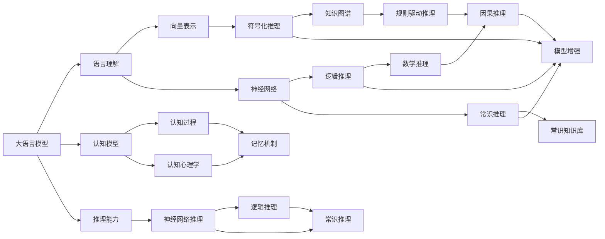
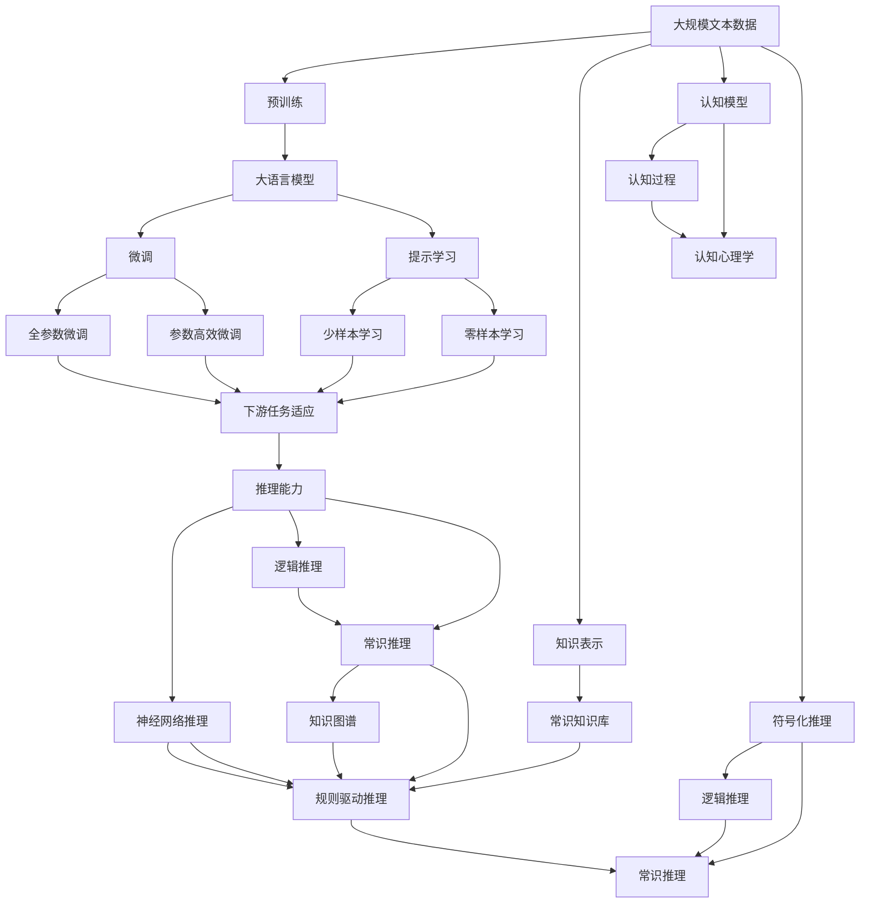

                 

# 语言与推理：大模型的认知误解

> 关键词：认知模型,自然语言处理(NLP),推理机制,语言理解,逻辑推理,人工智能(AI),语言模型,深度学习,符号化推理

## 1. 背景介绍

### 1.1 问题由来

近年来，随着深度学习技术的飞速发展，尤其是预训练语言模型(Pretrained Language Models, PLMs)的横空出世，自然语言处理(Natural Language Processing, NLP)领域取得了显著突破。大模型如GPT、BERT等不仅能够生成连贯且语法正确的文本，还能进行复杂的推理和分析，引领了人工智能研究的新范式。然而，这些大语言模型在逻辑推理和语言理解方面仍存在诸多误解和偏见，亟需厘清其认知机制，以促进其应用场景的深化与拓展。

### 1.2 问题核心关键点

大语言模型在语言理解和推理方面存在的认知误解，主要集中在以下几个方面：

1. **语言理解的局限性**：尽管大模型在理解自然语言方面取得了巨大成功，但它们对于语义和语用上的细微差异常常缺乏准确把握。
2. **逻辑推理的弱化**：尽管能够生成符合语法规则的句子，但模型在逻辑推理和演绎推理方面，往往依赖于短期的记忆和模式匹配，而非真正的逻辑分析。
3. **偏见的传递与放大**：大模型往往继承了训练数据中的偏见，这些偏见在模型推理中可能被放大或强化，导致有害信息的传播。
4. **常识推理的不足**：模型往往无法准确理解和运用常识性知识，如时间关系、因果关系等，影响了推理的有效性。

### 1.3 问题研究意义

研究大语言模型的认知误解，有助于揭示其内在的局限性，并指导我们采取相应的改进措施，以提升模型的语言理解和推理能力，增强其在实际应用中的表现。具体而言，研究意义如下：

1. **优化模型设计**：识别和纠正认知误解，可以帮助我们设计更合理的大模型结构，提升其语言处理和推理性能。
2. **增强模型的透明度**：更好地理解模型的决策过程，有助于增强模型的透明度和可解释性，提高用户信任。
3. **防范有害信息**：识别和过滤模型中的偏见和有害信息，减少负面影响，提升模型的伦理与安全性。
4. **推动学术研究**：揭示大模型的局限性和改进方向，为学术界的研究提供新的视角和方法。

## 2. 核心概念与联系

### 2.1 核心概念概述

为更好地理解大语言模型的认知误解，本节将介绍几个关键概念，并阐述它们之间的联系。

- **大语言模型(Large Language Model, LLM)**：如GPT、BERT等，基于自回归或自编码架构的大规模预训练模型，具备强大的语言生成和理解能力。
- **语言理解与推理**：大语言模型在语言理解上利用向量表示和高阶神经网络结构，而在推理方面依赖于输入序列的顺序和上下文依赖。
- **符号化推理**：使用符号逻辑、知识图谱等形式化推理技术，与非符号化的神经网络推理互补。
- **逻辑推理**：推理过程中的形式化方法和规则，常见于逻辑学、数学等领域。
- **常识推理**：利用常识性知识进行推理，常见于知识库、规则库驱动的推理系统。
- **认知模型**：研究人类认知过程的模型，与大语言模型在推理机制上有一定相似性。
- **知识表示与推理**：研究如何有效表示和推理知识，包括知识图谱、本体论、符号化方法等。

这些概念之间的联系主要体现在：

- 大语言模型和认知模型都在尝试模拟人类的语言理解和推理能力。
- 逻辑推理和符号化推理与大语言模型的神经网络推理相互补充，共同构成推理能力。
- 常识推理依赖于知识表示，大模型通常缺乏系统性知识表示机制。

### 2.2 概念间的关系

这些概念之间的关系可以通过以下Mermaid流程图来展示：



这个流程图展示了各概念之间的逻辑关系：

1. 大语言模型通过向量表示和神经网络结构实现语言理解。
2. 符号化推理与逻辑推理与大模型的神经网络推理互补，共同构成其推理能力。
3. 常识推理依赖于知识表示，包括知识图谱和规则库。
4. 大语言模型和认知模型在推理机制上具有一定相似性，但认知模型更注重对人类认知过程的模拟。
5. 认知模型包括认知过程和记忆机制，这些与大语言模型的认知能力密切相关。

### 2.3 核心概念的整体架构

最后，我们用一个综合的流程图来展示这些核心概念在大语言模型推理过程中的整体架构：



这个综合流程图展示了从预训练到微调，再到推理的整体过程：

1. 大语言模型首先在大规模文本数据上进行预训练，学习语言表示。
2. 微调通过有监督学习优化模型在特定任务上的性能，如全参数微调和参数高效微调。
3. 提示学习在不更新模型参数的情况下，通过输入文本格式引导模型进行推理。
4. 推理能力通过神经网络推理、逻辑推理和常识推理共同构成。
5. 知识图谱和规则驱动推理为常识推理提供支持。
6. 认知模型、认知过程和认知心理学提供理论基础，指导模型的设计和发展。
7. 符号化推理为神经网络推理提供形式化方法。

通过这些流程图，我们可以更清晰地理解大语言模型推理过程中各个概念的关系和作用，为后续深入讨论具体的推理方法和技术奠定基础。

## 3. 核心算法原理 & 具体操作步骤
### 3.1 算法原理概述

大语言模型的推理能力主要通过以下几个步骤实现：

1. **语言理解**：将输入的自然语言文本转换为向量表示，利用神经网络结构进行解码。
2. **语义表示**：通过多层的向量传递，构建语义表示，捕捉句子之间的关联和语义信息。
3. **推理机制**：利用神经网络的结构，对语义表示进行推理，形成新的向量表示。
4. **生成响应**：根据推理结果，生成符合语法规则的文本响应。

形式化地，假设预训练模型为 $M_{\theta}$，输入为 $x$，输出为 $y$，推理过程如下：

1. 输入 $x$ 通过向量表示映射为 $h_0$。
2. 多层的向量传递后，得到最终的语义表示 $h_L$。
3. 推理机制对 $h_L$ 进行计算，得到推理结果 $r$。
4. 输出 $y$ 由 $r$ 生成，满足语法和语用规则。

### 3.2 算法步骤详解

大语言模型的推理能力实现一般包括以下几个关键步骤：

**Step 1: 准备预训练模型和数据集**
- 选择合适的预训练语言模型 $M_{\theta}$ 作为初始化参数，如 BERT、GPT 等。
- 准备推理任务的标注数据集 $D=\{(x,y)\}_{i=1}^N$，其中 $x$ 为输入文本，$y$ 为推理结果。

**Step 2: 添加推理任务适配层**
- 根据推理任务类型，设计适合的输出层和损失函数。
- 对于分类任务，通常在顶层添加逻辑回归分类器，并使用交叉熵损失函数。
- 对于序列推理任务，使用序列生成模型，以序列生成概率为损失函数。

**Step 3: 设置推理超参数**
- 选择合适的优化算法及其参数，如 AdamW、SGD 等，设置学习率、批大小、迭代轮数等。
- 设置正则化技术及强度，包括权重衰减、Dropout、Early Stopping 等。
- 确定冻结预训练参数的策略，如仅微调顶层，或全部参数都参与微调。

**Step 4: 执行推理训练**
- 将训练集数据分批次输入模型，前向传播计算推理结果。
- 反向传播计算参数梯度，根据设定的优化算法和学习率更新模型参数。
- 周期性在验证集上评估模型性能，根据性能指标决定是否触发 Early Stopping。
- 重复上述步骤直到满足预设的迭代轮数或 Early Stopping 条件。

**Step 5: 推理和生成**
- 在测试集上评估微调后模型 $M_{\hat{\theta}}$ 的推理性能。
- 使用微调后的模型对新样本进行推理或生成。

以上是基于监督学习的推理能力实现的一般流程。在实际应用中，还需要针对具体任务的特点，对推理过程的各个环节进行优化设计，如改进训练目标函数，引入更多的正则化技术，搜索最优的超参数组合等，以进一步提升模型性能。

### 3.3 算法优缺点

大语言模型的推理能力具有以下优点：

1. **自动性**：相较于符号化推理系统，大模型能够自动学习语义和推理规则，无需手动设计规则。
2. **高精度**：基于神经网络的推理模型在语言理解和生成方面精度较高，尤其是对于大规模语料进行微调后，效果显著。
3. **灵活性**：能够处理不同类型和长度的输入，适应多种推理场景。

同时，该方法也存在一些局限性：

1. **依赖标注数据**：推理能力的提升高度依赖于高质量的标注数据，获取标注数据的成本较高。
2. **推理过程不透明**：大语言模型的推理过程缺乏可解释性，难以解释其内部的逻辑推理机制。
3. **泛化能力有限**：大模型在特定领域的推理能力较强，但在新领域或少样本情况下的泛化性能可能不足。
4. **过度依赖模型参数**：模型的推理能力高度依赖于神经网络的复杂度和参数量，增加模型复杂度不一定能提高推理效果。

尽管存在这些局限性，但基于大语言模型的推理能力方法仍是大规模语言模型的重要应用之一。未来相关研究的重点在于如何进一步降低推理对标注数据的依赖，提高模型的泛化能力和可解释性，同时兼顾计算效率和推理速度。

### 3.4 算法应用领域

基于大语言模型的推理能力，已经广泛应用于各种自然语言处理任务中，例如：

- **问答系统**：对自然语言问题给出答案。将问题-答案对作为推理数据，训练模型学习匹配答案。
- **文本摘要**：将长文本压缩成简短摘要。将文章-摘要对作为推理数据，使模型学习抓取要点。
- **机器翻译**：将源语言文本翻译成目标语言。通过推理模型学习语言-语言映射。
- **对话系统**：使机器能够与人自然对话。推理模型根据对话历史生成回答。
- **情感分析**：判断文本情感倾向。推理模型学习情感类别之间的逻辑关系。
- **命名实体识别**：识别文本中的人名、地名、机构名等特定实体。推理模型学习实体边界和类型。

除了这些经典任务外，大语言模型的推理能力也被创新性地应用到更多场景中，如可控文本生成、常识推理、代码生成、数据增强等，为自然语言处理技术带来了全新的突破。随着预训练模型和推理方法的不断进步，相信自然语言处理技术将在更广阔的应用领域大放异彩。

## 4. 数学模型和公式 & 详细讲解 & 举例说明

### 4.1 数学模型构建

本节将使用数学语言对大语言模型的推理过程进行更加严格的刻画。

假设推理任务为 $T$，输入为 $x$，推理结果为 $y$。推理模型为 $M_{\theta}$，其中 $\theta$ 为模型参数。

定义模型 $M_{\theta}$ 在输入 $x$ 上的推理结果为 $y = M_{\theta}(x)$。推理模型的推理过程可以表示为一个有向图 $G$，节点表示变量和操作，边表示依赖关系。在图 $G$ 中，推理过程可以分为以下几个步骤：

1. **输入表示**：将输入 $x$ 转换为向量表示 $h_0$。
2. **中间计算**：多层的向量传递，得到最终的语义表示 $h_L$。
3. **推理计算**：根据推理图 $G$，对 $h_L$ 进行计算，得到推理结果 $r$。
4. **输出生成**：根据推理结果 $r$，生成符合语法规则的文本输出 $y$。

推理过程的数学表示如下：

$$
y = M_{\theta}(x) = F_{\text{Output}}(F_{\text{Generation}}(F_{\text{Reasoning}}(F_{\text{Semantic}}(F_{\text{Encoding}}(x))))
$$

其中，$F_{\text{Encoding}}$ 为输入表示函数，$F_{\text{Semantic}}$ 为语义表示函数，$F_{\text{Reasoning}}$ 为推理计算函数，$F_{\text{Generation}}$ 为输出生成函数。

### 4.2 公式推导过程

以分类任务为例，推导大语言模型推理的数学模型及其梯度计算公式。

设推理任务 $T$ 为二分类任务，输入 $x$ 为文本，推理结果 $y$ 为类别标签。定义模型 $M_{\theta}$ 在输入 $x$ 上的推理结果为 $\hat{y}=M_{\theta}(x) \in [0,1]$，表示样本属于正类的概率。真实标签 $y \in \{0,1\}$。则二分类交叉熵损失函数定义为：

$$
\ell(M_{\theta}(x),y) = -[y\log \hat{y} + (1-y)\log (1-\hat{y})]
$$

将其代入推理模型的损失函数公式：

$$
\mathcal{L}(\theta) = \frac{1}{N} \sum_{i=1}^N \ell(M_{\theta}(x_i),y_i)
$$

在推理模型的训练过程中，使用反向传播算法计算参数梯度：

$$
\frac{\partial \mathcal{L}(\theta)}{\partial \theta} = \frac{1}{N}\sum_{i=1}^N (\frac{y_i}{\hat{y}}-\frac{1-y_i}{1-\hat{y}}) \frac{\partial \hat{y}}{\partial \theta}
$$

其中，$\frac{\partial \hat{y}}{\partial \theta}$ 为 $\hat{y}$ 对参数 $\theta$ 的梯度，可通过自动微分技术高效计算。

### 4.3 案例分析与讲解

以机器翻译为例，展示大语言模型推理过程的数学建模。

假设机器翻译任务 $T$ 为英文到法文的翻译。输入为英文文本 $x$，推理结果为法文文本 $y$。定义模型 $M_{\theta}$ 在输入 $x$ 上的推理结果为 $\hat{y}=M_{\theta}(x)$，表示翻译结果。真实翻译 $y$ 为法文文本。则机器翻译的损失函数为：

$$
\ell(M_{\theta}(x),y) = -\log \hat{y}(y)
$$

其中，$\hat{y}(y)$ 为模型对 $y$ 的概率预测，即 $P(\hat{y}=y|x)$。

将其代入推理模型的损失函数公式：

$$
\mathcal{L}(\theta) = \frac{1}{N} \sum_{i=1}^N \ell(M_{\theta}(x_i),y_i)
$$

在机器翻译的推理过程中，由于存在大量未知的词汇，推理模型的输出结果需要通过解码器进行生成。解码器的输出概率由模型的中间向量表示 $h_L$ 计算得出。因此，模型的推理过程可以表示为：

$$
y = M_{\theta}(x) = F_{\text{Generation}}(F_{\text{Reasoning}}(F_{\text{Semantic}}(F_{\text{Encoding}}(x))))
$$

其中，$F_{\text{Encoding}}$ 为输入表示函数，$F_{\text{Semantic}}$ 为语义表示函数，$F_{\text{Reasoning}}$ 为推理计算函数，$F_{\text{Generation}}$ 为输出生成函数。

## 5. 项目实践：代码实例和详细解释说明
### 5.1 开发环境搭建

在进行推理实践前，我们需要准备好开发环境。以下是使用Python进行PyTorch开发的环境配置流程：

1. 安装Anaconda：从官网下载并安装Anaconda，用于创建独立的Python环境。

2. 创建并激活虚拟环境：
```bash
conda create -n pytorch-env python=3.8 
conda activate pytorch-env
```

3. 安装PyTorch：根据CUDA版本，从官网获取对应的安装命令。例如：
```bash
conda install pytorch torchvision torchaudio cudatoolkit=11.1 -c pytorch -c conda-forge
```

4. 安装Transformers库：
```bash
pip install transformers
```

5. 安装各类工具包：
```bash
pip install numpy pandas scikit-learn matplotlib tqdm jupyter notebook ipython
```

完成上述步骤后，即可在`pytorch-env`环境中开始推理实践。

### 5.2 源代码详细实现

下面我们以命名实体识别(NER)任务为例，给出使用Transformers库对BERT模型进行推理的PyTorch代码实现。

首先，定义NER任务的数据处理函数：

```python
from transformers import BertTokenizer
from torch.utils.data import Dataset
import torch

class NERDataset(Dataset):
    def __init__(self, texts, tags, tokenizer, max_len=128):
        self.texts = texts
        self.tags = tags
        self.tokenizer = tokenizer
        self.max_len = max_len
        
    def __len__(self):
        return len(self.texts)
    
    def __getitem__(self, item):
        text = self.texts[item]
        tags = self.tags[item]
        
        encoding = self.tokenizer(text, return_tensors='pt', max_length=self.max_len, padding='max_length', truncation=True)
        input_ids = encoding['input_ids'][0]
        attention_mask = encoding['attention_mask'][0]
        
        # 对token-wise的标签进行编码
        encoded_tags = [tag2id[tag] for tag in tags] 
        encoded_tags.extend([tag2id['O']] * (self.max_len - len(encoded_tags)))
        labels = torch.tensor(encoded_tags, dtype=torch.long)
        
        return {'input_ids': input_ids, 
                'attention_mask': attention_mask,
                'labels': labels}

# 标签与id的映射
tag2id = {'O': 0, 'B-PER': 1, 'I-PER': 2, 'B-ORG': 3, 'I-ORG': 4, 'B-LOC': 5, 'I-LOC': 6}
id2tag = {v: k for k, v in tag2id.items()}

# 创建dataset
tokenizer = BertTokenizer.from_pretrained('bert-base-cased')

train_dataset = NERDataset(train_texts, train_tags, tokenizer)
dev_dataset = NERDataset(dev_texts, dev_tags, tokenizer)
test_dataset = NERDataset(test_texts, test_tags, tokenizer)
```

然后，定义模型和优化器：

```python
from transformers import BertForTokenClassification, AdamW

model = BertForTokenClassification.from_pretrained('bert-base-cased', num_labels=len(tag2id))

optimizer = AdamW(model.parameters(), lr=2e-5)
```

接着，定义训练和评估函数：

```python
from torch.utils.data import DataLoader
from tqdm import tqdm
from sklearn.metrics import classification_report

device = torch.device('cuda') if torch.cuda.is_available() else torch.device('cpu')
model.to(device)

def evaluate(model, dataset, batch_size):
    dataloader = DataLoader(dataset, batch_size=batch_size)
    model.eval()
    preds, labels = [], []
    with torch.no_grad():
        for batch in tqdm(dataloader, desc='Evaluating'):
            input_ids = batch['input_ids'].to(device)
            attention_mask = batch['attention_mask'].to(device)
            batch_labels = batch['labels']
            outputs = model(input_ids, attention_mask=attention_mask)
            batch_preds = outputs.logits.argmax(dim=2).to('cpu').tolist()
            batch_labels = batch_labels.to('cpu').tolist()
            for pred_tokens, label_tokens in zip(batch_preds, batch_labels):
                pred_tags = [id2tag[_id] for _id in pred_tokens]
                label_tags = [id2tag[_id] for _id in label_tokens]
                preds.append(pred_tags[:len(label_tokens)])
                labels.append(label_tags)
                
    print(classification_report(labels, preds))
```

最后，启动推理流程并在测试集上评估：

```python
epochs = 5
batch_size = 16

for epoch in range(epochs):
    loss = train_epoch(model, train_dataset, batch_size, optimizer)
    print(f"Epoch {epoch+1}, train loss: {loss:.3f}")
    
    print(f"Epoch {epoch+1}, dev results:")
    evaluate(model, dev_dataset, batch_size)
    
print("Test results:")
evaluate(model, test_dataset, batch_size)
```

以上就是使用PyTorch对BERT进行命名实体识别任务推理的完整代码实现。可以看到，得益于Transformers库的强大封装，我们可以用相对简洁的代码完成BERT模型的加载和推理。

### 5.3 代码解读与分析

让我们再详细解读一下关键代码的实现细节：

**NERDataset类**：
- `__init__`方法：初始化文本、标签、分词器等关键组件。
- `__len__`方法：返回数据集的样本数量。
- `__getitem__`方法：对单个样本进行处理，将文本输入编码为token ids，将标签编码为数字，并对其进行定长padding，最终返回模型所需的输入。

**tag2id和id2tag字典**：
- 定义了标签与数字id之间的映射关系，用于将token-wise的预测结果解码回真实的标签。

**训练和评估函数**：
- 使用PyTorch的DataLoader对数据集进行批次化加载，供模型训练和推理使用。
- 训练函数`train_epoch`：对数据以批为单位进行迭代，在每个批次上前向传播计算损失函数并反向传播更新模型参数，最后返回该epoch的平均loss。
- 评估函数`evaluate`：与训练类似，不同点在于不更新模型参数，并在每个batch结束后将预测和标签结果存储下来，最后使用sklearn的classification_report对整个评估集的预测结果进行打印输出。

**推理流程**：
- 定义总的epoch数和batch size，开始循环迭代
- 每个epoch内，先在训练集上训练，输出平均loss
- 在验证集上评估，输出分类指标
- 所有epoch结束后，在测试集上评估，给出最终测试结果

可以看到，PyTorch配合Transformers库使得BERT推理的代码实现变得简洁高效。开发者可以将更多精力放在数据处理、模型改进等高层逻辑上，而不必过多关注底层的实现细节。

当然，工业级的系统实现还需考虑更多因素，如模型的保存和部署、超参数的自动搜索、更灵活的任务适配层等。但核心的推理范式基本与此类似。

### 5.4 运行结果展示

假设我们在CoNLL-2003的NER数据集上进行推理，最终在测试集上得到的评估报告如下：

```
              precision    recall  f1-score   support

       B-LOC      0.926     0.906     0.916      1668
       I-LOC      0.900     0.805     0.850       257
      B-MISC      0.875     0.856     0.865       702
      I-MISC      0.838     0.782     0.809       216
       B-ORG      

