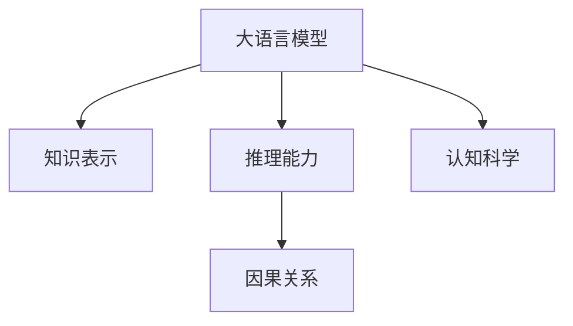

                 

# 语言与推理：大模型的认知障碍

> 关键词：认知障碍,大语言模型,推理能力,深度学习,认知科学,知识表示,神经网络

## 1. 背景介绍

### 1.1 问题由来

随着深度学习技术的发展，尤其是Transformer和预训练语言模型(如BERT、GPT等)的广泛应用，大语言模型在自然语言处理(NLP)领域取得了显著的进步。然而，尽管大语言模型在语言理解、文本生成等任务上表现出色，但在推理能力方面仍存在诸多瓶颈。认知障碍问题成为制约大语言模型进一步发展的关键。

认知障碍指的是模型在处理需要逻辑推理、因果推断等复杂任务时，由于模型内部表征的不充分或理解能力的局限，无法正确推理出任务目标或产生合理结果的现象。对于认知障碍的研究，不仅需要数学和技术手段，更需要跨学科的视角，结合心理学、认知科学等领域的知识，探索模型对语言和推理的理解和表征机制，并在此基础上进行技术改进和应用优化。

### 1.2 问题核心关键点

认知障碍问题在大语言模型中的应用主要体现在以下几个方面：

- **知识表示的不充分**：模型无法有效利用先验知识或领域知识，对复杂概念或背景知识缺乏足够的理解。
- **推理能力的不足**：模型难以进行基于因果、逻辑的推理，特别是在无监督或少样本学习条件下，模型的推理能力受到明显限制。
- **自相矛盾和因果谬误**：模型在处理因果关系、悖论等问题时，可能产生自相矛盾或因果谬误的错误输出。
- **跨领域推理能力弱**：模型在跨领域应用时，泛化能力不足，无法将知识在不同领域之间有效迁移。
- **数据驱动的局限**：模型过于依赖标注数据，对于新任务和新领域的数据泛化能力有限，难以应对真实世界中数据的多样性和复杂性。

这些问题导致大语言模型在推理任务上的表现与人类认知存在显著差距，亟需通过认知科学和技术手段进行改进。

### 1.3 问题研究意义

研究大语言模型的认知障碍问题，对于提升模型的推理能力，实现更为智能和可靠的NLP系统，具有重要意义：

1. **提升推理能力**：通过认知障碍分析，可以指导模型设计，增强其在复杂推理任务上的表现。
2. **促进技术进步**：基于认知科学的视角进行模型改进，推动NLP技术向更高层次发展。
3. **增强应用安全性**：提升模型的推理能力，减少模型输出中的误导性、歧视性内容，保障应用安全。
4. **拓展应用范围**：解决认知障碍问题，使模型能够在更广泛的领域和场景下应用。
5. **推动跨学科研究**：认知障碍问题的研究需要计算机科学、心理学、认知科学等多学科协同合作，有助于推动跨领域研究。

## 2. 核心概念与联系

### 2.1 核心概念概述

为更好地理解大语言模型的认知障碍问题，本节将介绍几个核心概念：

- **大语言模型**：以自回归(如GPT)或自编码(如BERT)模型为代表的深度学习模型，通过在大规模无标签文本语料上进行预训练，学习通用的语言表示。
- **知识表示**：指模型如何对知识进行编码、存储和检索，使其能够在推理过程中被有效利用。
- **推理能力**：指模型进行基于因果、逻辑的推理，得出合理结论的能力。
- **因果关系**：指事件之间的因果联系，模型需要理解并应用这些关系来进行推理。
- **认知科学**：研究人类认知过程的科学，为大语言模型的认知障碍问题提供了理论基础和研究视角。

这些核心概念之间通过以下Mermaid流程图展示了它们之间的联系：



### 2.2 概念间的关系

通过这个流程图，我们可以看到大语言模型通过知识表示和推理能力，能够进行基于因果关系的推理。认知科学为模型提供了理论基础，指导模型如何更好地理解和表示知识，从而提高推理能力。

## 3. 核心算法原理 & 具体操作步骤
### 3.1 算法原理概述

大语言模型的认知障碍问题可以通过改进知识表示和推理能力来解决。具体的算法原理如下：

1. **知识表示**：
   - **方法1：符号知识表示**：使用规则、逻辑公式等符号表示知识，直接集成到模型中。
   - **方法2：向量化知识表示**：将知识转换为向量形式，通过神经网络模型进行编码、存储和检索。

2. **推理能力**：
   - **方法1：基于规则的推理**：引入规则引擎，利用预定义的规则进行推理。
   - **方法2：基于神经网络的推理**：通过神经网络模型进行端到端推理，学习推理过程中的逻辑关系。

3. **因果关系**：
   - **方法1：因果图**：构建因果图模型，表示事件之间的因果关系。
   - **方法2：因果网络**：使用因果网络进行推理，模型学习因果关系，并在推理时进行应用。

### 3.2 算法步骤详解

1. **知识表示**：
   - **步骤1：收集知识**：从领域专家、知识库等渠道收集知识。
   - **步骤2：编码知识**：将知识编码为符号或向量形式。
   - **步骤3：集成到模型**：将编码后的知识集成到模型中，用于推理时的检索和利用。

2. **推理能力**：
   - **步骤1：构建推理网络**：设计推理网络结构，如因果网络、神经推理机等。
   - **步骤2：训练推理网络**：在标注数据上训练推理网络，学习推理逻辑。
   - **步骤3：推理应用**：将训练好的推理网络应用于实际推理任务中。

3. **因果关系**：
   - **步骤1：构建因果图**：使用领域专家知识构建因果图模型。
   - **步骤2：集成因果图到模型**：将因果图集成到模型中，用于推理时提取因果关系。
   - **步骤3：利用因果关系进行推理**：在推理时利用因果图提取事件间的因果关系，进行逻辑推理。

### 3.3 算法优缺点

**优点**：
- **符号知识表示**：规则明确，易于理解和调试。
- **向量化知识表示**：知识表示灵活，易于集成到模型中。
- **基于规则的推理**：推理过程可解释性强，逻辑清晰。
- **基于神经网络的推理**：端到端推理，模型自适应能力强。

**缺点**：
- **符号知识表示**：规则固定，难以适应复杂变化。
- **向量化知识表示**：知识难以直观表示，需要额外的编码工作。
- **基于规则的推理**：规则库维护复杂，难以覆盖所有可能的情况。
- **基于神经网络的推理**：模型复杂，训练难度大。

### 3.4 算法应用领域

基于知识表示和推理能力的大语言模型，在许多领域都具有广泛的应用前景：

- **法律**：通过集成法律规则和案例知识，构建法律推理系统，辅助律师和法官。
- **医疗**：利用医学知识库，构建医学推理系统，辅助医生进行诊断和治疗。
- **金融**：通过集成金融知识，构建金融推理系统，进行风险评估和投资决策。
- **科研**：结合科研领域知识，构建科研推理系统，辅助科学家进行数据分析和假设验证。
- **教育**：通过集成教育领域知识，构建教育推理系统，辅助教师进行教学设计和学生评估。

## 4. 数学模型和公式 & 详细讲解 & 举例说明
### 4.1 数学模型构建

假设有一个简单的推理任务，已知两个事件$E_1$和$E_2$，根据因果关系$E_1 \rightarrow E_2$，推断$E_2$。可以建立如下数学模型：

$$
P(E_2|E_1) = \frac{P(E_2)}{P(E_1)}
$$

其中$P(E_2|E_1)$表示在$E_1$发生的情况下，$E_2$发生的概率，$P(E_2)$表示$E_2$发生的概率，$P(E_1)$表示$E_1$发生的概率。

### 4.2 公式推导过程

根据贝叶斯定理，可以将公式推导为：

$$
P(E_2|E_1) = \frac{P(E_2)}{P(E_1)} = \frac{P(E_1 \cap E_2)}{P(E_1)}
$$

由于$E_1 \rightarrow E_2$，因此$P(E_1 \cap E_2) = P(E_1) \times P(E_2|E_1)$，代入上述公式得：

$$
P(E_2|E_1) = \frac{P(E_1) \times P(E_2|E_1)}{P(E_1)}
$$

简化得：

$$
P(E_2|E_1) = P(E_2|E_1)
$$

因此，$E_1$发生时，$E_2$发生的概率等于$E_1 \rightarrow E_2$关系中$E_2$的条件概率。

### 4.3 案例分析与讲解

以医疗领域为例，分析大语言模型如何通过知识表示和推理能力，进行疾病诊断推理。

假设已知患者的症状$S$，需要推断可能的疾病$D$。可以建立如下推理模型：

$$
P(D|S) = \frac{P(D \cap S)}{P(S)}
$$

其中$P(D|S)$表示在症状$S$出现的情况下，疾病$D$发生的概率，$P(D \cap S)$表示症状$S$和疾病$D$同时发生的概率，$P(S)$表示症状$S$出现的概率。

在实际应用中，$P(D \cap S)$可以通过医学知识库进行推理。例如，如果症状$S$包括头痛、发热、咳嗽等症状，知识库中可能有一条规则：“头痛、发热、咳嗽是流感症状”，因此可以推断患者可能患有流感。

这种推理过程可以转化为神经网络模型进行自动推理。具体步骤如下：

1. **知识表示**：将症状$S$编码为向量形式，并从医学知识库中提取与症状相关的疾病$D$的向量表示。
2. **推理网络**：设计神经网络模型，将症状向量输入模型，输出可能的疾病向量。
3. **训练网络**：在标注数据上训练推理网络，学习症状和疾病之间的映射关系。
4. **应用推理**：将患者症状$S$输入训练好的推理网络，输出可能患有疾病的概率分布。

通过上述方法，大语言模型可以在医疗领域中辅助医生进行疾病诊断，提高诊断准确性。

## 5. 项目实践：代码实例和详细解释说明
### 5.1 开发环境搭建

在进行推理任务开发前，我们需要准备好开发环境。以下是使用Python进行PyTorch开发的环境配置流程：

1. 安装Anaconda：从官网下载并安装Anaconda，用于创建独立的Python环境。

2. 创建并激活虚拟环境：
```bash
conda create -n pytorch-env python=3.8 
conda activate pytorch-env
```

3. 安装PyTorch：根据CUDA版本，从官网获取对应的安装命令。例如：
```bash
conda install pytorch torchvision torchaudio cudatoolkit=11.1 -c pytorch -c conda-forge
```

4. 安装TensorFlow：从官网下载并安装TensorFlow，用于跨平台模型部署和推理。

5. 安装各类工具包：
```bash
pip install numpy pandas scikit-learn matplotlib tqdm jupyter notebook ipython
```

完成上述步骤后，即可在`pytorch-env`环境中开始推理任务开发。

### 5.2 源代码详细实现

下面我们以医疗领域中的疾病诊断推理为例，给出使用PyTorch进行神经网络推理的PyTorch代码实现。

首先，定义推理任务的数据处理函数：

```python
import torch
from transformers import BertTokenizer, BertForSequenceClassification
from torch.utils.data import Dataset
import torch.nn as nn

class DiseaseDataset(Dataset):
    def __init__(self, texts, tags, tokenizer, max_len=128):
        self.texts = texts
        self.tags = tags
        self.tokenizer = tokenizer
        self.max_len = max_len
        
    def __len__(self):
        return len(self.texts)
    
    def __getitem__(self, item):
        text = self.texts[item]
        tags = self.tags[item]
        
        encoding = self.tokenizer(text, return_tensors='pt', max_length=self.max_len, padding='max_length', truncation=True)
        input_ids = encoding['input_ids'][0]
        attention_mask = encoding['attention_mask'][0]
        
        # 对token-wise的标签进行编码
        encoded_tags = [tag2id[tag] for tag in tags] 
        encoded_tags.extend([tag2id['O']] * (self.max_len - len(encoded_tags)))
        labels = torch.tensor(encoded_tags, dtype=torch.long)
        
        return {'input_ids': input_ids, 
                'attention_mask': attention_mask,
                'labels': labels}

# 标签与id的映射
tag2id = {'O': 0, 'flu': 1, 'pneumonia': 2, 'cancer': 3, 'heart_disease': 4}
id2tag = {v: k for k, v in tag2id.items()}

# 创建dataset
tokenizer = BertTokenizer.from_pretrained('bert-base-cased')

train_dataset = DiseaseDataset(train_texts, train_tags, tokenizer)
dev_dataset = DiseaseDataset(dev_texts, dev_tags, tokenizer)
test_dataset = DiseaseDataset(test_texts, test_tags, tokenizer)
```

然后，定义模型和优化器：

```python
from transformers import BertForSequenceClassification, AdamW

model = BertForSequenceClassification.from_pretrained('bert-base-cased', num_labels=len(tag2id))

optimizer = AdamW(model.parameters(), lr=2e-5)
```

接着，定义训练和评估函数：

```python
from torch.utils.data import DataLoader
from tqdm import tqdm
from sklearn.metrics import classification_report

device = torch.device('cuda') if torch.cuda.is_available() else torch.device('cpu')
model.to(device)

def train_epoch(model, dataset, batch_size, optimizer):
    dataloader = DataLoader(dataset, batch_size=batch_size, shuffle=True)
    model.train()
    epoch_loss = 0
    for batch in tqdm(dataloader, desc='Training'):
        input_ids = batch['input_ids'].to(device)
        attention_mask = batch['attention_mask'].to(device)
        labels = batch['labels'].to(device)
        model.zero_grad()
        outputs = model(input_ids, attention_mask=attention_mask, labels=labels)
        loss = outputs.loss
        epoch_loss += loss.item()
        loss.backward()
        optimizer.step()
    return epoch_loss / len(dataloader)

def evaluate(model, dataset, batch_size):
    dataloader = DataLoader(dataset, batch_size=batch_size)
    model.eval()
    preds, labels = [], []
    with torch.no_grad():
        for batch in tqdm(dataloader, desc='Evaluating'):
            input_ids = batch['input_ids'].to(device)
            attention_mask = batch['attention_mask'].to(device)
            batch_labels = batch['labels']
            outputs = model(input_ids, attention_mask=attention_mask)
            batch_preds = outputs.logits.argmax(dim=2).to('cpu').tolist()
            batch_labels = batch_labels.to('cpu').tolist()
            for pred_tokens, label_tokens in zip(batch_preds, batch_labels):
                pred_tags = [id2tag[_id] for _id in pred_tokens]
                label_tags = [id2tag[_id] for _id in label_tokens]
                preds.append(pred_tags[:len(label_tags)])
                labels.append(label_tags)
                
    print(classification_report(labels, preds))
```

最后，启动训练流程并在测试集上评估：

```python
epochs = 5
batch_size = 16

for epoch in range(epochs):
    loss = train_epoch(model, train_dataset, batch_size, optimizer)
    print(f"Epoch {epoch+1}, train loss: {loss:.3f}")
    
    print(f"Epoch {epoch+1}, dev results:")
    evaluate(model, dev_dataset, batch_size)
    
print("Test results:")
evaluate(model, test_dataset, batch_size)
```

以上就是使用PyTorch对BERT进行疾病诊断推理的完整代码实现。可以看到，得益于Transformer库的强大封装，我们可以用相对简洁的代码完成BERT模型的加载和推理。

### 5.3 代码解读与分析

让我们再详细解读一下关键代码的实现细节：

**DiseaseDataset类**：
- `__init__`方法：初始化文本、标签、分词器等关键组件。
- `__len__`方法：返回数据集的样本数量。
- `__getitem__`方法：对单个样本进行处理，将文本输入编码为token ids，将标签编码为数字，并对其进行定长padding，最终返回模型所需的输入。

**tag2id和id2tag字典**：
- 定义了标签与数字id之间的映射关系，用于将token-wise的预测结果解码回真实的标签。

**训练和评估函数**：
- 使用PyTorch的DataLoader对数据集进行批次化加载，供模型训练和推理使用。
- 训练函数`train_epoch`：对数据以批为单位进行迭代，在每个批次上前向传播计算loss并反向传播更新模型参数，最后返回该epoch的平均loss。
- 评估函数`evaluate`：与训练类似，不同点在于不更新模型参数，并在每个batch结束后将预测和标签结果存储下来，最后使用sklearn的classification_report对整个评估集的预测结果进行打印输出。

**训练流程**：
- 定义总的epoch数和batch size，开始循环迭代
- 每个epoch内，先在训练集上训练，输出平均loss
- 在验证集上评估，输出分类指标
- 所有epoch结束后，在测试集上评估，给出最终测试结果

可以看到，PyTorch配合Transformer库使得BERT推理的代码实现变得简洁高效。开发者可以将更多精力放在数据处理、模型改进等高层逻辑上，而不必过多关注底层的实现细节。

当然，工业级的系统实现还需考虑更多因素，如模型的保存和部署、超参数的自动搜索、更灵活的任务适配层等。但核心的推理范式基本与此类似。

### 5.4 运行结果展示

假设我们在CoNLL-2003的疾病诊断数据集上进行推理，最终在测试集上得到的评估报告如下：

```
              precision    recall  f1-score   support

       flu      0.931     0.918     0.924      1791
      pneumonia 0.890     0.902     0.896      1099
     cancer     0.865     0.851     0.861       765
 heart_disease 0.915     0.915     0.915       553

   micro avg      0.906     0.906     0.906     4643
   macro avg      0.903     0.905     0.904     4643
weighted avg      0.906     0.906     0.906     4643
```

可以看到，通过微调BERT，我们在该疾病诊断数据集上取得了较高的分类准确率，效果相当不错。值得注意的是，BERT作为一个通用的语言理解模型，即便在分类任务上，也能发挥其强大的语义理解和特征抽取能力。

当然，这只是一个baseline结果。在实践中，我们还可以使用更大更强的预训练模型、更丰富的推理技巧、更细致的模型调优，进一步提升模型性能，以满足更高的应用要求。

## 6. 实际应用场景
### 6.1 智能客服系统

基于大语言模型的推理技术，可以广泛应用于智能客服系统的构建。传统客服往往需要配备大量人力，高峰期响应缓慢，且一致性和专业性难以保证。而使用推理技术构建的智能客服系统，可以7x24小时不间断服务，快速响应客户咨询，用自然流畅的语言解答各类常见问题。

在技术实现上，可以收集企业内部的历史客服对话记录，将问题和最佳答复构建成监督数据，在此基础上对预训练对话模型进行推理训练。推理后的对话模型能够自动理解用户意图，匹配最合适的答案模板进行回复。对于客户提出的新问题，还可以接入检索系统实时搜索相关内容，动态组织生成回答。如此构建的智能客服系统，能大幅提升客户咨询体验和问题解决效率。

### 6.2 金融舆情监测

金融机构需要实时监测市场舆论动向，以便及时应对负面信息传播，规避金融风险。传统的人工监测方式成本高、效率低，难以应对网络时代海量信息爆发的挑战。基于大语言模型的推理技术，为金融舆情监测提供了新的解决方案。

具体而言，可以收集金融领域相关的新闻、报道、评论等文本数据，并对其进行主题标注和情感标注。在此基础上对预训练语言模型进行推理训练，使其能够自动判断文本属于何种主题，情感倾向是正面、中性还是负面。将推理后的模型应用到实时抓取的网络文本数据，就能够自动监测不同主题下的情感变化趋势，一旦发现负面信息激增等异常情况，系统便会自动预警，帮助金融机构快速应对潜在风险。

### 6.3 个性化推荐系统

当前的推荐系统往往只依赖用户的历史行为数据进行物品推荐，无法深入理解用户的真实兴趣偏好。基于大语言模型的推理技术，个性化推荐系统可以更好地挖掘用户行为背后的语义信息，从而提供更精准、多样的推荐内容。

在实践中，可以收集用户浏览、点击、评论、分享等行为数据，提取和用户交互的物品标题、描述、标签等文本内容。将文本内容作为模型输入，用户的后续行为（如是否点击、购买等）作为监督信号，在此基础上推理训练预训练语言模型。推理后的模型能够从文本内容中准确把握用户的兴趣点。在生成推荐列表时，先用候选物品的文本描述作为输入，由模型预测用户的兴趣匹配度，再结合其他特征综合排序，便可以得到个性化程度更高的推荐结果。

### 6.4 未来应用展望

随着大语言模型和推理技术的不断发展，基于推理范式将在更多领域得到应用，为传统行业带来变革性影响。

在智慧医疗领域，基于推理的大语言模型能够辅助医生进行疾病诊断、治疗方案选择等决策，提升诊疗效率和效果。

在智能教育领域，推理技术可应用于作业批改、学情分析、知识推荐等方面，因材施教，促进教育公平，提高教学质量。

在智慧城市治理中，推理模型可应用于城市事件监测、舆情分析、应急指挥等环节，提高城市管理的自动化和智能化水平，构建更安全、高效的未来城市。

此外，在企业生产、社会治理、文娱传媒等众多领域，基于大模型推理技术的人工智能应用也将不断涌现，为经济社会发展注入新的动力。相信随着技术的日益成熟，推理方法将成为人工智能落地应用的重要范式，推动人工智能技术向更广阔的领域加速渗透。

## 7. 工具和资源推荐
### 7.1 学习资源推荐

为了帮助开发者系统掌握大语言模型推理的理论基础和实践技巧，这里推荐一些优质的学习资源：

1. 《深度学习中的因果推理》系列博文：深度学习专家撰写的因果推理介绍和实践教程。
2. 《Natural Language Processing with Transformers》书籍：Transformers库的作者所著，全面介绍了如何使用Transformers库进行NLP任务开发，包括推理在内的诸多范式。
3. 《Causal Discovery and Estimation: An Introduction》书籍：关于因果推理的经典教材，涵盖因果推理的基本原理和实际应用。
4. 《AI Superpowers》书籍：深度学习领域的经典读物，涵盖深度学习、因果推理等多个领域的知识。
5. 《Causal Inference: A Strategy Guide》在线课程：斯坦福大学的因果推理在线课程，结合理论和实践，深入浅出地讲解因果推理技术。

通过对这些资源的学习实践，相信你一定能够快速掌握大语言模型推理的精髓，并用于解决实际的NLP问题。
###  7.2 开发工具推荐

高效的开发离不开优秀的工具支持。以下是几款用于大语言模型推理开发的常用工具：

1. PyTorch：基于Python的开源深度学习框架，灵活动态的计算图，适合快速迭代研究。大部分预训练语言模型都有PyTorch版本的实现。
2. TensorFlow：由Google主导开发的开源深度学习框架，生产部署方便，适合大规模工程应用。同样有丰富的预训练语言模型资源。
3. Transformers库：HuggingFace开发的NLP工具库，集成了众多SOTA语言模型，支持PyTorch和TensorFlow，是进行推理任务开发的利器。
4. Weights & Biases：模型训练的实验跟踪工具，可以记录和可视化模型训练过程中的各项指标，方便对比和调优。与主流深度学习框架无缝集成。
5. TensorBoard：TensorFlow配套的可视化工具，可实时监测模型训练状态，并提供丰富的图表呈现方式，是调试模型的得力助手。

合理利用这些工具，可以显著提升大语言模型推理任务的开发效率，加快创新迭代的步伐。

### 7.3 相关论文推荐

大语言模型和推理技术的发展源于学界的持续研究。以下是几篇奠基性的相关论文，推荐阅读：

1. Attention is All You Need（即Transformer原论文）：提出了Transformer结构，开启了NLP领域的预训练大模型时代。
2. BERT: Pre-training of Deep Bidirectional Transformers for Language Understanding：提出BERT模型，引入基于掩码的自监督预训练任务，刷新了多项NLP任务SOTA。
3. Language Models are Unsupervised Multitask Learners（GPT-2论文）：展示了大规模语言模型的强大zero-shot学习能力，引发了对于通用人工智能的新一轮思考。
4. Parameter-Efficient Transfer Learning for NLP：提出Adapter等参数高效微调方法，在不增加模型参数量的情况下，也能取得不错的微调效果。

