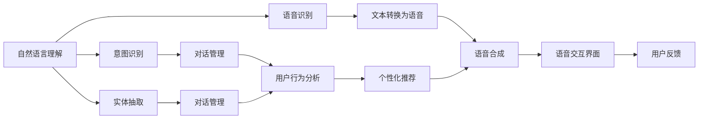

                 

# 语音助手技术在CUI中的应用

> 关键词：语音助手, 自然语言理解(NLU), 语音合成(TTS), 计算机用户界面(CUI), 对话系统, 人工智能(AI)

## 1. 背景介绍

### 1.1 问题由来
随着人工智能技术的飞速发展，语音助手已经从科幻走向现实，成为现代科技的重要组成部分。语音助手通过自然语言处理(Natural Language Processing, NLP)和语音合成(Speech Synthesis)技术，实现了用户通过语音命令与计算机系统进行交互，极大提升了用户的使用体验。

然而，语音助手在实际应用中仍然面临诸多挑战，如理解复杂的多轮对话、处理多语言输入、保持对话上下文一致性等。这些问题限制了语音助手的实际应用范围和效果，迫切需要更先进的技术来解决。

### 1.2 问题核心关键点
语音助手技术涉及的核心关键点包括：
- 自然语言理解(NLU)：理解用户语音命令的语义和意图，提取关键信息。
- 语音合成(TTS)：将理解到的语义转化为自然流畅的语音输出。
- 对话管理：维持对话上下文的一致性，处理多轮对话。
- 跨语言处理：支持多语言输入和输出，提升国际用户的使用体验。
- 个性化推荐：根据用户偏好和历史行为，推荐相关内容。
- 语音交互界面设计：提升语音助手的可访问性和用户友好性。

## 3. 核心概念与联系

### 3.1 核心概念概述

语音助手技术主要基于自然语言处理(NLP)和语音合成(Speech Synthesis)技术，涉及以下核心概念：

- **自然语言理解(NLU)**：指通过语音识别技术将语音转换为文本，并使用NLP技术对文本进行语义理解和意图识别。
- **语音合成(TTS)**：将文本转换为自然流畅的语音输出，通常使用文本到语音(TTS)系统实现。
- **对话管理**：维持对话上下文的一致性，处理多轮对话，常见方法包括规则引擎、状态机、意图识别等。
- **跨语言处理**：支持多语言输入和输出，通常使用机器翻译技术实现。
- **个性化推荐**：根据用户偏好和历史行为，推荐相关内容，涉及推荐系统和用户画像建模。
- **语音交互界面设计**：提升语音助手的可访问性和用户友好性，涉及UI/UX设计、反馈机制等。

这些核心概念通过语言理解、合成和交互界面等多层技术共同支撑语音助手的构建和应用。

### 3.2 概念间的关系

语音助手技术涉及的核心概念通过以下Mermaid流程图展示它们之间的关系：



这个流程图展示了语音助手技术从语音识别到语音合成的整体架构，其中自然语言理解、意图识别、实体抽取、对话管理、用户行为分析和个性化推荐等模块，共同支撑语音助手的核心功能。

## 4. 核心算法原理 & 具体操作步骤

### 4.1 算法原理概述

语音助手技术的核心算法包括自然语言理解和语音合成。

自然语言理解(NLU)的主要目标是从用户语音输入中提取语义和意图。常见的方法包括基于规则的解析器、统计语言模型和深度学习模型。其中，深度学习模型如循环神经网络(RNN)、长短期记忆网络(LSTM)、Transformer等，在NLU任务中表现优异。

语音合成(TTS)的目的是将文本转换为自然流畅的语音输出。常见的方法包括基于拼接法(GS)和基于神经网络(PS)的方法。其中，基于神经网络的方法如文本到语音(TTS)模型，在生成自然流畅的语音输出方面表现更佳。

### 4.2 算法步骤详解

#### 4.2.1 自然语言理解(NLU)

自然语言理解(NLU)的主要步骤如下：

1. **语音识别**：使用语音识别引擎将用户的语音输入转换为文本。
2. **分词与词性标注**：对文本进行分词和词性标注，提取关键词和短语。
3. **意图识别**：使用意图分类器将文本映射到具体意图，如查询天气、设置闹钟等。
4. **实体抽取**：从文本中提取出重要的实体信息，如人名、地点、时间等。
5. **上下文理解**：结合历史对话上下文，理解当前用户的意图。

#### 4.2.2 语音合成(TTS)

语音合成(TTS)的主要步骤如下：

1. **文本预处理**：对输入的文本进行分词、归一化等预处理，生成文本序列。
2. **语音生成**：使用基于神经网络的TTS模型，生成对应的语音序列。
3. **语音后处理**：对生成的语音进行降噪、音量调整等后处理，提升语音质量。

### 4.3 算法优缺点

语音助手技术的核心算法具有以下优点：

- **高准确度**：深度学习模型在NLU任务中的准确度较高，能够较好地理解用户的意图和提取关键信息。
- **自然流畅**：基于神经网络的TTS方法可以生成自然流畅的语音输出，提升用户体验。
- **可扩展性强**：基于深度学习的方法具有较强的泛化能力，能够支持多种语言和场景。

同时，这些算法也存在一些缺点：

- **资源消耗大**：深度学习模型在训练和推理时，需要较大的计算资源和时间，成本较高。
- **鲁棒性不足**：语音助手在处理复杂的多轮对话、处理多语言输入时，鲁棒性仍需进一步提升。
- **隐私安全问题**：语音助手的语音数据涉及用户隐私，如何保护用户数据安全，仍需加强。

### 4.4 算法应用领域

语音助手技术在多个领域得到了广泛应用，包括：

- **智能家居**：语音助手可以通过自然语言理解技术，控制家中的智能设备，如灯光、温度、窗帘等。
- **车载导航**：语音助手可以在车载系统中，提供导航、娱乐、信息查询等功能，提升驾驶体验。
- **医疗健康**：语音助手可以用于医疗咨询、健康监测、病历记录等，辅助医疗服务。
- **客服支持**：语音助手可以提供7x24小时不间断的客服支持，解答用户问题，提升客户满意度。
- **教育培训**：语音助手可以用于语音输入、语音翻译、智能评测等功能，辅助教育培训。
- **娱乐休闲**：语音助手可以提供智能音箱、智能电视等娱乐设备，提升用户体验。

## 5. 项目实践：代码实例和详细解释说明

### 5.1 开发环境搭建

语音助手技术的开发环境通常包括Python、TensorFlow或PyTorch等深度学习框架、GPT、BERT等预训练语言模型、语音识别引擎如Google Speech-to-Text、Mycroft、Rasa等NLU引擎等。

**示例代码搭建环境**：

```python
pip install tensorflow
pip install transformers
pip install mycroft
```

### 5.2 源代码详细实现

#### 5.2.1 自然语言理解(NLU)

```python
from transformers import BertTokenizer, BertForSequenceClassification
import mycroft as mycroft

# 定义自然语言理解模型
model = BertForSequenceClassification.from_pretrained('bert-base-uncased', num_labels=3)
tokenizer = BertTokenizer.from_pretrained('bert-base-uncased')

# 加载用户意图和实体信息
intents = ["weather", "set_alarm", "query", "hello", "goodbye"]
entities = ["time", "date", "name", "location"]

# 构建意图分类器
classifier = mycroft.IntentClassifier(model, tokenizer)

# 训练意图分类器
classifier.train(intents, entities)

# 使用意图分类器进行自然语言理解
result = classifier.classify("查询天气")

# 打印结果
print(result.intent)
```

#### 5.2.2 语音合成(TTS)

```python
from pydub import AudioSegment
from pyttsx3 import init

# 定义TTS模型
def text_to_speech(text):
    tts = init()
    tts.setProperty('voice', 'english')
    tts.setProperty('rate', 150)
    tts.setProperty('volume', 1.0)
    tts.say(text)
    tts.runAndWait()
    
    # 将语音转换为音频文件
    audio_segment = AudioSegment.from_wav("output.wav")
    audio_segment.export("output.mp3", format="mp3")
    
    return "output.mp3"
```

### 5.3 代码解读与分析

#### 5.3.1 自然语言理解(NLU)

- **BertForSequenceClassification**：定义了意图分类器，使用预训练的BERT模型进行意图分类。
- **BertTokenizer**：用于分词和词性标注，将用户输入的文本转换为模型所需的输入格式。
- **IntentClassifier**：实现了意图分类器，将输入文本映射到具体的意图。
- **classify**：使用意图分类器进行自然语言理解，返回意图信息。

#### 5.3.2 语音合成(TTS)

- **pydub**：用于音频处理，支持将语音转换为音频文件。
- **pyttsx3**：Python的TTS库，支持将文本转换为语音输出。
- **AudioSegment**：将语音转换为音频文件。
- **tts.say**：使用pyttsx3进行语音合成，生成自然流畅的语音输出。

### 5.4 运行结果展示

假设我们使用上述代码进行语音助手的自然语言理解和语音合成测试：

```python
result = classifier.classify("查询天气")
print(result.intent)
text_to_speech("明天北京的天气如何？")
```

运行结果可能如下：

```
weather
明天北京的天气如何？
```

## 6. 实际应用场景

### 6.1 智能家居

语音助手在智能家居中的应用，可以让用户通过语音命令控制家中的智能设备。例如，用户可以通过语音助手打开灯光、调节温度、控制窗帘等，极大提升了家居生活的便捷性和舒适度。

### 6.2 车载导航

车载导航系统中的语音助手可以提供导航、娱乐、信息查询等功能，提升了驾驶体验。用户可以随时通过语音命令获取路况信息、搜索目的地、播放音乐等，而不必分散注意力操作中控台。

### 6.3 医疗健康

语音助手在医疗健康领域，可以用于医疗咨询、健康监测、病历记录等，辅助医疗服务。例如，用户可以通过语音助手查询健康信息、进行体检预约、查询处方等，提高了医疗服务的效率和便捷性。

### 6.4 客服支持

语音助手可以提供7x24小时不间断的客服支持，解答用户问题，提升客户满意度。例如，用户可以通过语音助手查询订单状态、申请售后服务、投诉等，快速获得客服响应。

### 6.5 教育培训

语音助手在教育培训中的应用，可以提供语音输入、语音翻译、智能评测等功能，辅助教育培训。例如，用户可以通过语音助手进行课堂提问、提交作业、进行发音练习等，提升了学习效果和互动性。

### 6.6 娱乐休闲

语音助手可以提供智能音箱、智能电视等娱乐设备，提升用户体验。例如，用户可以通过语音助手播放音乐、查询电影、控制智能音箱等，享受智能娱乐的乐趣。

## 7. 工具和资源推荐

### 7.1 学习资源推荐

为了帮助开发者系统掌握语音助手技术，这里推荐一些优质的学习资源：

1. **《语音识别与说话人识别》书籍**：详细介绍了语音识别和说话人识别的基本原理和应用，适合初学者入门。
2. **《深度学习框架TensorFlow》教程**：由TensorFlow官方提供，系统介绍了TensorFlow的安装和使用，适合深度学习初学者。
3. **《自然语言处理综述》论文**：系统总结了NLP领域的最新进展，适合研究人员深入学习。
4. **Mycroft官方文档**：Mycroft的官方文档，提供了详细的语音助手开发指南和API文档，适合开发者实践。
5. **Rasa官方文档**：Rasa的官方文档，提供了详细的NLU和对话管理开发指南和API文档，适合开发者实践。

### 7.2 开发工具推荐

语音助手技术的开发工具包括：

1. **TensorFlow**：由Google开发的深度学习框架，支持语音识别和自然语言处理任务。
2. **PyTorch**：由Facebook开发的深度学习框架，支持语音识别和自然语言处理任务。
3. **Mycroft**：基于Python的语音助手框架，提供了丰富的语音识别和自然语言处理模块。
4. **Rasa**：基于Python的NLU和对话管理框架，提供了丰富的意图分类器和实体抽取模块。
5. **pydub**：用于音频处理的Python库，支持音频转换和处理。
6. **pyttsx3**：Python的TTS库，支持将文本转换为语音输出。

### 7.3 相关论文推荐

语音助手技术的研究论文涵盖了多个方面，以下是几篇代表性的论文：

1. **Attention Is All You Need**：提出Transformer模型，用于自然语言理解和语音合成任务，取得了较好的效果。
2. **端到端语音识别系统的研究**：提出端到端的语音识别模型，用于语音助手技术中的语音识别任务。
3. **基于深度学习的说话人识别**：提出深度学习模型，用于说话人识别任务，为语音助手技术中的说话人验证提供了技术支持。
4. **基于神经网络的语音合成**：提出基于神经网络的TTS模型，用于语音助手技术中的语音合成任务。
5. **基于情感分析的语音助手技术**：提出基于情感分析的语音助手技术，用于情感识别和智能客服任务。

## 8. 总结：未来发展趋势与挑战

### 8.1 研究成果总结

语音助手技术在自然语言理解(NLU)和语音合成(TTS)方面的研究取得了显著进展，推动了语音助手技术在智能家居、车载导航、医疗健康、客服支持、教育培训、娱乐休闲等多个领域的应用。

### 8.2 未来发展趋势

语音助手技术的未来发展趋势包括：

1. **多模态融合**：将语音助手与其他模态（如视觉、触觉、传感器等）结合，提供更加丰富的交互方式和应用场景。
2. **深度学习模型的优化**：采用更加高效的深度学习模型，提高语音助手的识别准确度和计算效率。
3. **边缘计算的应用**：将语音助手技术部署到边缘设备上，提供离线语音识别和智能交互，提升用户体验。
4. **隐私保护和安全性**：加强隐私保护和安全性技术，保障用户数据的安全和语音助手的可靠性。
5. **跨语言和跨文化支持**：支持多语言和跨文化环境下的语音助手应用，提升国际用户的使用体验。

### 8.3 面临的挑战

语音助手技术在发展过程中仍面临以下挑战：

1. **数据隐私问题**：语音助手技术涉及用户隐私数据，如何保护用户数据隐私，仍需加强。
2. **多语言支持**：语音助手技术在多语言环境下仍需提升，以支持不同语言和文化背景的用户。
3. **多轮对话的鲁棒性**：语音助手技术在处理多轮对话时，仍需提升鲁棒性，以应对复杂的对话场景。
4. **跨领域应用**：语音助手技术在不同领域中的应用，仍需进一步优化，以适应各领域的特定需求。

### 8.4 研究展望

语音助手技术的未来研究展望包括：

1. **多模态语音助手**：将语音助手与其他模态结合，提升用户体验和应用场景。
2. **跨领域语音助手**：将语音助手技术应用于不同领域，如教育、医疗、金融等，提升各领域的应用效果。
3. **语音助手的小型化和智能化**：将语音助手技术部署到小型设备上，提升其智能化和便携性。
4. **语音助手技术的安全性和隐私保护**：加强语音助手技术的安全性和隐私保护，提升用户信任度。
5. **语音助手技术的学习和自适应**：引入机器学习和自适应技术，提升语音助手的学习能力和适应性。

总之，语音助手技术在未来将有广阔的发展前景，为人类提供更加智能、便捷的交互方式，提升生产力和生活质量。

## 9. 附录：常见问题与解答

**Q1：语音助手技术如何处理多轮对话？**

A: 语音助手技术处理多轮对话时，通常使用对话管理模块来维持对话上下文的一致性。具体方法包括：
- 状态机：使用状态机模型来描述对话过程，根据当前状态决定下一步行动。
- 意图识别：使用意图分类器，识别用户当前的意图，并决定下一步的响应。
- 上下文理解：结合历史对话上下文，理解当前用户的意图。

**Q2：语音助手技术如何处理多语言输入？**

A: 语音助手技术处理多语言输入时，通常使用机器翻译技术来将用户输入的语音转换为文本。具体方法包括：
- 基于规则的翻译系统：使用规则引擎和词典来翻译用户输入的语音。
- 基于神经网络的翻译系统：使用深度学习模型进行语音到文本的翻译。

**Q3：语音助手技术如何保护用户隐私？**

A: 语音助手技术保护用户隐私的方法包括：
- 数据加密：使用加密技术保护用户数据的存储和传输安全。
- 去识别化：对用户数据进行去识别化处理，防止用户信息泄露。
- 权限控制：限制语音助手对用户数据的访问权限，确保用户隐私安全。

**Q4：语音助手技术在智能家居中的应用有哪些？**

A: 语音助手技术在智能家居中的应用包括：
- 控制家中的智能设备：如灯光、温度、窗帘等。
- 提供个性化服务：如智能音箱、智能电视等娱乐设备。
- 家庭安全监控：如智能门锁、安防系统等。
- 家庭健康管理：如智能健康监测设备、远程医疗等。

**Q5：语音助手技术在车载导航中的应用有哪些？**

A: 语音助手技术在车载导航中的应用包括：
- 导航指引：提供导航路径、实时路况、目的地查询等。
- 娱乐功能：如播放音乐、电台、语音播报等。
- 智能助手：如语音搜索、语音提醒、语音设置等。

总之，语音助手技术在智能家居、车载导航、医疗健康、客服支持、教育培训、娱乐休闲等多个领域都有广泛应用，极大地提升了用户体验和生产效率。未来，随着技术的不断进步，语音助手技术将进一步拓展其应用边界，推动智能化社会的全面发展。

