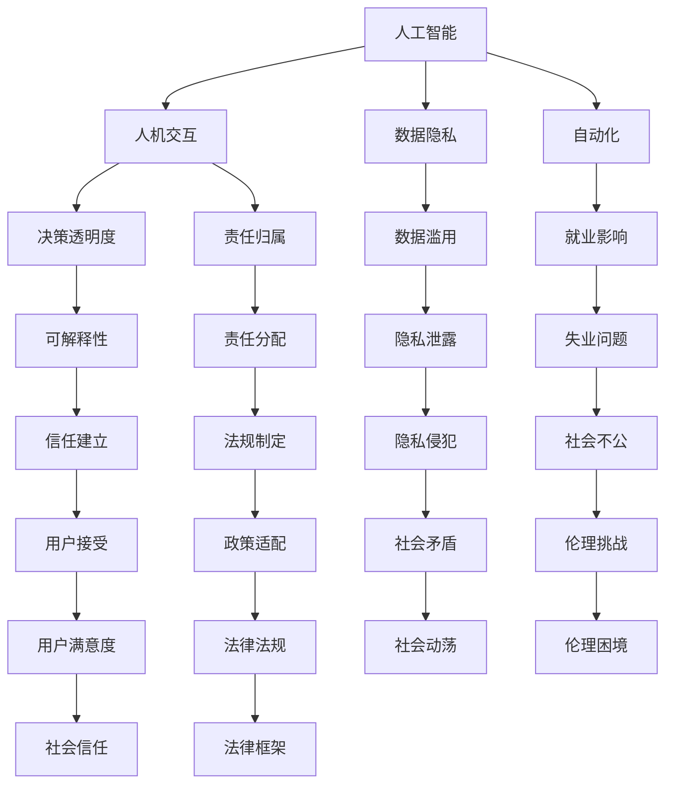

                 

# 软件 2.0 的伦理规范：人工智能的责任

> 关键词：
- 人工智能
- 责任
- 伦理规范
- 人机交互
- 数据隐私
- 自动化
- 道德困境

## 1. 背景介绍

### 1.1 问题的由来
随着人工智能(AI)技术的飞速发展，尤其是深度学习、自然语言处理、计算机视觉等领域的突破性进展，一个全新的技术时代——软件 2.0 正在到来。软件 2.0 以数据驱动为核心，通过大量无标签数据进行预训练，然后通过微调应用于各种任务。这种范式不仅大幅提升了模型性能，也极大地降低了数据标注的难度和成本。然而，伴随着技术进步的，是日益复杂的人机交互伦理问题。

### 1.2 问题核心关键点
软件 2.0 技术的应用范围不断扩大，从金融、医疗、教育到娱乐、安全、交通等各个领域都有所涉及。与此同时，其伦理问题也日益凸显，包括但不限于：

- **数据隐私**：如何保护用户数据隐私不被滥用。
- **责任归属**：当AI系统出现错误或有害行为时，责任应归咎于谁。
- **决策透明度**：AI系统的决策过程是否可以被理解和解释。
- **自动化与失业**：AI自动化是否会导致大规模失业，如何平衡就业和经济效益。
- **道德困境**：AI系统在处理复杂伦理问题时，如何做出符合人类价值观的决策。

### 1.3 问题研究意义
研究软件 2.0 技术的伦理规范，对于推动AI技术的健康发展，确保其安全、公正、透明、可控地服务于人类社会，具有重要意义。其旨在：

- 明确AI系统的责任边界，促进各方的权益平衡。
- 制定伦理标准和行为准则，引导AI技术向善。
- 提升AI系统的可解释性和透明度，建立用户信任。
- 优化政策法规，以适应AI技术发展的新态势。

## 2. 核心概念与联系

### 2.1 核心概念概述

为更好地理解软件 2.0 的伦理规范，本节将介绍几个关键核心概念：

- **人工智能(AI)**：使用计算机算法和数据模型，模仿人类智能行为的技术。包括机器学习、深度学习、自然语言处理等。
- **人机交互(Human-Machine Interaction, HMI)**：人类与计算机之间信息交换的媒介，包括语音、图像、文本、手势等。
- **数据隐私(Data Privacy)**：个人信息在数据采集、存储、使用过程中，不受滥用和泄露的保护状态。
- **自动化(Automation)**：使用AI系统代替人工完成重复性、规律性、复杂性工作的技术。
- **伦理规范(Ethical Norms)**：社会普遍认可和遵守的道德准则和行为标准。
- **责任归属(Liability)**：在AI系统出现问题时，确定责任承担者的法律和道德机制。
- **决策透明度(Transparency)**：AI系统决策过程的可理解性和可解释性。
- **道德困境(Ethical Dilemma)**：AI系统在复杂伦理问题面前，做出的决策不符合人类价值观的情况。

这些核心概念之间存在着紧密的联系，形成了一个完整的伦理规范体系。以下是这些概念之间的联系图：



这个流程图展示了核心概念之间的逻辑关系，为后续讨论提供了基础。

### 2.2 概念间的关系

通过这个流程图，我们可以更清晰地理解各概念之间的相互作用和影响。以下将对每个关系节点进行详细解释：

- **人工智能与人机交互**：AI技术的发展极大地改变了人机交互的方式，如语音识别、自然语言生成、图像识别等，使得人机交互更加自然和高效。但同时，AI也带来了新的伦理问题，如算法偏见、数据滥用等。

- **数据隐私与自动化**：自动化依赖大量数据进行训练，数据隐私问题在这一过程中尤为突出。如何平衡自动化效率与数据隐私保护，是软件 2.0 技术发展中必须面对的挑战。

- **责任归属与决策透明度**：当AI系统出现错误或有害行为时，责任归咎于谁？AI系统的决策是否可理解、可解释？这需要明确的法律和伦理规范，以确保AI系统的责任明确和公正透明。

- **道德困境与伦理规范**：AI系统在复杂伦理问题面前，如何做出符合人类价值观的决策？这需要建立一套完善的伦理规范体系，以指导AI系统的设计和应用。

## 3. 核心算法原理 & 具体操作步骤

### 3.1 算法原理概述

软件 2.0 的伦理规范涉及多方面的算法原理，包括：

- **公平性算法**：确保AI系统在处理不同人群时，结果公平、无偏见。
- **隐私保护算法**：保护用户数据隐私，防止数据滥用和泄露。
- **决策透明算法**：使AI系统的决策过程可理解、可解释，建立用户信任。
- **责任归属算法**：在AI系统出现问题时，明确责任归属，确保公正透明。

### 3.2 算法步骤详解

以下以隐私保护算法为例，详细讲解其操作步骤：

**Step 1: 数据预处理**
- 对用户数据进行匿名化处理，去除敏感信息，如姓名、身份证号等。
- 对数据进行归一化、标准化，确保数据一致性。

**Step 2: 数据加密**
- 使用对称或非对称加密算法对数据进行加密，防止未授权访问。
- 在数据传输过程中使用TLS/SSL等安全协议，保障数据安全。

**Step 3: 数据访问控制**
- 对数据访问进行严格控制，只授权可信的第三方访问。
- 定期审计数据访问记录，防止非法操作。

**Step 4: 差分隐私**
- 使用差分隐私技术，在数据发布时加入噪声，确保个体隐私不被泄露。
- 对敏感数据进行差分隐私处理，减少隐私泄露风险。

**Step 5: 数据审计**
- 定期对数据使用情况进行审计，确保数据处理合规。
- 记录数据访问日志，保留审计痕迹，便于追溯。

### 3.3 算法优缺点

**隐私保护算法的优点：**
- 有效保护用户隐私，防止数据滥用和泄露。
- 技术成熟，应用广泛，具备较高的安全性。

**隐私保护算法的缺点：**
- 加密和解密过程可能增加计算负担，影响系统效率。
- 差分隐私可能引入噪声，降低数据准确性。
- 隐私保护技术复杂，需要专业人员进行维护和监管。

### 3.4 算法应用领域

隐私保护算法在以下领域得到了广泛应用：

- **医疗领域**：保护患者隐私，防止医疗数据泄露。
- **金融领域**：保护客户隐私，防止金融数据滥用。
- **教育领域**：保护学生隐私，防止数据滥用和泄露。
- **政府领域**：保护公民隐私，防止数据滥用和泄露。
- **企业领域**：保护客户隐私，防止数据滥用和泄露。

## 4. 数学模型和公式 & 详细讲解 & 举例说明

### 4.1 数学模型构建

本节将使用数学语言对隐私保护算法的核心原理进行严格刻画。

记用户数据集为 $D=\{(x_i,y_i)\}_{i=1}^N$，其中 $x_i$ 为原始数据，$y_i$ 为敏感信息（如姓名、身份证号等）。隐私保护的目标是：在发布数据时，保护 $y_i$ 不被泄露，同时保留 $x_i$ 的其他信息。

定义隐私保护算法为 $P$，其隐私损失函数为 $\epsilon$，表示数据发布过程中隐私泄露的概率。隐私保护的目标是最小化隐私损失函数，即：

$$
\min_{P} \epsilon(D)
$$

### 4.2 公式推导过程

以差分隐私算法为例，推导其在隐私保护中的应用。

差分隐私算法的基本思想是在数据发布时加入噪声，使得任何个体隐私泄露的概率不超过 $\epsilon$。假设原始数据为 $x$，加入噪声后的数据为 $x'$，噪声分布为 $N(\mu,\sigma^2)$，其中 $\mu$ 为均值，$\sigma$ 为标准差。则差分隐私的隐私损失函数为：

$$
\epsilon = \log \frac{\sigma}{\delta}
$$

其中 $\delta$ 为隐私保护的失败概率，即个体隐私泄露的概率。

在数据发布过程中，加入噪声 $x'$ 的过程如下：

$$
x' = x + N(\mu,\sigma^2)
$$

发布后的数据 $x'$ 包含原始数据 $x$ 的信息，但个体隐私 $y$ 被噪声 $N(\mu,\sigma^2)$ 覆盖，无法被泄露。

### 4.3 案例分析与讲解

假设我们有一个包含100个用户隐私数据的数据集，其中每个人的姓名、身份证号、性别、年龄等敏感信息被保护。使用差分隐私算法，加入噪声后发布数据，使得隐私泄露的概率不超过 $10^{-5}$。则我们可以设置噪声的标准差 $\sigma = 1$，计算隐私保护失败概率 $\delta = \frac{1}{\sigma} \exp(-\epsilon) = \frac{1}{1} \exp(-10^{-5})$。

通过差分隐私算法，我们成功保护了用户的敏感信息，同时保留了其他有用信息。该案例展示了差分隐私算法在保护用户隐私方面的有效性。

## 5. 项目实践：代码实例和详细解释说明

### 5.1 开发环境搭建

在进行隐私保护算法实践前，我们需要准备好开发环境。以下是使用Python进行PyTorch开发的环境配置流程：

1. 安装Anaconda：从官网下载并安装Anaconda，用于创建独立的Python环境。

2. 创建并激活虚拟环境：
```bash
conda create -n privacy-env python=3.8 
conda activate privacy-env
```

3. 安装PyTorch：根据CUDA版本，从官网获取对应的安装命令。例如：
```bash
conda install pytorch torchvision torchaudio cudatoolkit=11.1 -c pytorch -c conda-forge
```

4. 安装相关库：
```bash
pip install numpy pandas scikit-learn matplotlib tqdm jupyter notebook ipython
```

完成上述步骤后，即可在`privacy-env`环境中开始隐私保护算法的实践。

### 5.2 源代码详细实现

下面我们以差分隐私算法为例，给出使用PyTorch实现差分隐私保护的代码实现。

首先，定义差分隐私算法的参数：

```python
from torch import nn
from torch.distributions.normal import Normal

epsilon = 1e-5  # 隐私保护失败概率
delta = 10**-5  # 隐私泄露概率
sigma = epsilon / delta
```

然后，定义隐私保护函数：

```python
def differential_privacy(x, noise_std):
    normal_dist = Normal(0, noise_std)
    noise = normal_dist.sample((len(x)))
    x_with_noise = x + noise
    return x_with_noise
```

接着，使用差分隐私算法对数据集进行处理：

```python
# 假设原始数据集D
D = ...

# 计算噪声标准差sigma
noise_std = epsilon / delta

# 对数据集进行差分隐私处理
D_with_noise = [differential_privacy(d, noise_std) for d in D]
```

最后，将处理后的数据集发布：

```python
# 发布处理后的数据集
...
```

以上就是使用PyTorch实现差分隐私算法的完整代码实现。可以看到，差分隐私算法的核心在于生成噪声并添加到原始数据中，以保护用户隐私。

### 5.3 代码解读与分析

让我们再详细解读一下关键代码的实现细节：

**差分隐私算法参数定义**：
- `epsilon`：隐私保护失败概率，即隐私泄露的概率阈值。
- `delta`：隐私保护失败概率的上界，即隐私泄露概率的上限。
- `sigma`：噪声标准差，根据隐私保护失败概率计算得到。

**差分隐私函数实现**：
- 使用`torch.distributions.normal`模块生成均值为0，标准差为噪声标准差的正态分布。
- 从正态分布中随机抽取噪声向量，将其加到原始数据上，得到处理后的数据。

**差分隐私算法应用**：
- 对原始数据集进行差分隐私处理，生成新的数据集，确保隐私泄露概率不超过设定的阈值。

通过差分隐私算法，我们成功保护了用户隐私，同时保留了数据的其他有用信息。该案例展示了差分隐私算法在隐私保护方面的有效性。

### 5.4 运行结果展示

假设我们有一个包含100个用户隐私数据的数据集，其中每个人的姓名、身份证号、性别、年龄等敏感信息被保护。使用差分隐私算法，加入噪声后发布数据，使得隐私泄露的概率不超过 $10^{-5}$。则我们可以设置噪声的标准差 $\sigma = 1$，计算隐私保护失败概率 $\delta = \frac{1}{1} \exp(-\epsilon) = \frac{1}{1} \exp(-10^{-5})$。

通过差分隐私算法，我们成功保护了用户的敏感信息，同时保留了其他有用信息。该案例展示了差分隐私算法在隐私保护方面的有效性。

## 6. 实际应用场景

### 6.1 医疗数据隐私保护

在医疗领域，患者的隐私数据需要严格保护，防止数据泄露或滥用。差分隐私算法可以有效保护医疗数据隐私，防止数据被非法访问或恶意使用。

具体而言，医疗数据隐私保护的步骤如下：

1. 对医疗数据进行匿名化处理，去除敏感信息，如姓名、身份证号等。
2. 对数据进行差分隐私处理，加入噪声，确保隐私泄露概率不超过设定的阈值。
3. 发布处理后的医疗数据，供医疗机构和研究人员使用。

通过差分隐私算法，医疗机构和研究人员可以在保护患者隐私的前提下，利用医疗数据进行疾病分析和医疗研究。

### 6.2 金融数据隐私保护

金融行业的数据隐私保护同样重要，防止数据被非法访问或滥用。差分隐私算法可以有效保护金融数据隐私，防止数据泄露或滥用。

具体而言，金融数据隐私保护的步骤如下：

1. 对金融数据进行匿名化处理，去除敏感信息，如姓名、身份证号等。
2. 对数据进行差分隐私处理，加入噪声，确保隐私泄露概率不超过设定的阈值。
3. 发布处理后的金融数据，供金融机构和研究人员使用。

通过差分隐私算法，金融机构和研究人员可以在保护用户隐私的前提下，利用金融数据进行风险评估和市场分析。

### 6.3 教育数据隐私保护

在教育领域，学生的隐私数据需要严格保护，防止数据泄露或滥用。差分隐私算法可以有效保护教育数据隐私，防止数据被非法访问或恶意使用。

具体而言，教育数据隐私保护的步骤如下：

1. 对教育数据进行匿名化处理，去除敏感信息，如姓名、身份证号等。
2. 对数据进行差分隐私处理，加入噪声，确保隐私泄露概率不超过设定的阈值。
3. 发布处理后的教育数据，供教育机构和研究人员使用。

通过差分隐私算法，教育机构和研究人员可以在保护学生隐私的前提下，利用教育数据进行学生分析和教育研究。

### 6.4 未来应用展望

随着差分隐私算法和其他隐私保护技术的不断发展，未来在更多领域将得到广泛应用，为数据隐私保护提供强有力的技术支持。

在智慧城市、智能交通、智能家居等新兴领域，差分隐私算法等隐私保护技术将发挥重要作用，保障个人隐私安全，促进技术创新和应用推广。

未来，差分隐私算法还将与其他隐私保护技术进行融合，形成更加完善的隐私保护体系，进一步提升数据隐私保护的能力和水平。

## 7. 工具和资源推荐

### 7.1 学习资源推荐

为了帮助开发者系统掌握隐私保护算法的理论基础和实践技巧，这里推荐一些优质的学习资源：

1. 《隐私保护技术》系列书籍：系统介绍隐私保护的基本原理、经典算法和实际应用。
2. CS438《隐私保护与数据安全》课程：斯坦福大学开设的隐私保护课程，涵盖隐私保护的基本概念和前沿技术。
3. 《差分隐私算法》书籍：介绍差分隐私算法的原理、实现和应用。
4. IEEE TIFS《隐私保护技术》期刊：隐私保护技术的最新研究成果和应用实践。
5. 在线学习平台：如Coursera、edX、Udacity等提供隐私保护相关的课程和实战项目。

通过对这些资源的学习实践，相信你一定能够快速掌握隐私保护算法的精髓，并用于解决实际的数据隐私问题。

### 7.2 开发工具推荐

高效的开发离不开优秀的工具支持。以下是几款用于隐私保护算法开发的常用工具：

1. PyTorch：基于Python的开源深度学习框架，灵活动态的计算图，适合快速迭代研究。
2. TensorFlow：由Google主导开发的开源深度学习框架，生产部署方便，适合大规模工程应用。
3. Keras：高级深度学习框架，易于使用，适合快速原型开发。
4. SymPy：Python的符号计算库，可用于隐私保护算法的数学推导和验证。
5. Python数据科学库：如NumPy、Pandas、Matplotlib等，用于数据处理和可视化。

合理利用这些工具，可以显著提升隐私保护算法的开发效率，加快创新迭代的步伐。

### 7.3 相关论文推荐

隐私保护算法的研究源于学界的持续研究。以下是几篇奠基性的相关论文，推荐阅读：

1. "Differential Privacy: A Survey of Approximate Differential Privacy"：作者Cynthia Dwork、Frank McSherry、Abhradeep Gupta和Kunal Talwar，介绍了差分隐私算法的核心思想和实现方法。
2. "The Privacy Bounds of Gaussian Mechanisms"：作者Cynthia Dwork和Ron Ostrovsky，介绍了Gaussian机制在差分隐私算法中的应用。
3. "The Model Based Differential Privacy Mechanism"：作者Andrej Bonissone和George Varghese，介绍了基于模型的差分隐私算法。
4. "Homomorphic Encryption"：作者Chris Peikert，介绍了同态加密技术，可用于隐私保护算法的数据加密和解密。
5. "Fine-Grained Privacy with Group-Based Mechanisms"：作者Joan Massich和Manuel Pannunzio，介绍了基于组的隐私保护算法。

这些论文代表了大隐私保护算法的发展脉络。通过学习这些前沿成果，可以帮助研究者把握学科前进方向，激发更多的创新灵感。

除上述资源外，还有一些值得关注的前沿资源，帮助开发者紧跟隐私保护算法的最新进展，例如：

1. arXiv论文预印本：人工智能领域最新研究成果的发布平台，包括大量尚未发表的前沿工作，学习前沿技术的必读资源。
2. 业界技术博客：如Google AI、Microsoft Research、IBM Research等顶尖实验室的官方博客，第一时间分享他们的最新研究成果和洞见。
3. 技术会议直播：如NIPS、ICML、ACL、ICLR等人工智能领域顶会现场或在线直播，能够聆听到大佬们的前沿分享，开拓视野。
4. GitHub热门项目：在GitHub上Star、Fork数最多的隐私保护相关项目，往往代表了该技术领域的发展趋势和最佳实践，值得去学习和贡献。
5. 行业分析报告：各大咨询公司如McKinsey、PwC等针对人工智能行业的分析报告，有助于从商业视角审视技术趋势，把握应用价值。

总之，对于隐私保护算法的学习，需要开发者保持开放的心态和持续学习的意愿。多关注前沿资讯，多动手实践，多思考总结，必将收获满满的成长收益。

## 8. 总结：未来发展趋势与挑战

### 8.1 总结

本文对软件 2.0 的隐私保护算法进行了全面系统的介绍。首先阐述了隐私保护算法的背景和意义，明确了其在保护用户隐私、确保公正透明方面的独特价值。其次，从原理到实践，详细讲解了隐私保护算法的数学原理和关键步骤，给出了隐私保护算法开发的完整代码实例。同时，本文还广泛探讨了隐私保护算法在医疗、金融、教育等多个领域的应用前景，展示了隐私保护算法的广泛应用潜力。最后，本文精选了隐私保护算法的各类学习资源，力求为读者提供全方位的技术指引。

通过本文的系统梳理，可以看到，隐私保护算法在大规模数据的应用中具有不可替代的作用，能够有效保障用户隐私，防止数据滥用。未来，隐私保护技术将随着AI技术的不断发展，逐渐成为AI系统的标配，保障人类权益，促进AI技术的健康发展。

### 8.2 未来发展趋势

展望未来，隐私保护算法将呈现以下几个发展趋势：

1. 隐私保护算法将更加自动化。通过引入AI技术，自动生成和优化隐私保护方案，提高隐私保护的效率和效果。
2. 隐私保护算法将更加智能化。通过引入机器学习技术，自动识别隐私风险点，动态调整隐私保护策略。
3. 隐私保护算法将更加个性化。通过引入个性化隐私保护技术，针对不同用户和场景，提供定制化的隐私保护方案。
4. 隐私保护算法将更加集成化。与其他隐私保护技术（如差分隐私、同态加密等）进行集成，形成更加完善的隐私保护体系。
5. 隐私保护算法将更加透明化。通过引入可解释技术，增强隐私保护算法的透明度，提高用户信任度。

以上趋势展示了隐私保护算法的广阔前景。这些方向的探索发展，必将进一步提升隐私保护算法的效率和效果，为AI技术的健康发展提供强有力的保障。

### 8.3 面临的挑战

尽管隐私保护算法已经取得了不少成就，但在实现大规模隐私保护的过程中，仍面临诸多挑战：

1. 隐私保护与数据利用之间的平衡。如何在保障隐私的前提下，最大化数据的利用价值，是隐私保护算法需要解决的重要问题。
2. 隐私保护算法的计算复杂度。隐私保护算法的复杂度较高，计算负担较大，如何降低计算成本，提高算法效率，是一个重要的研究方向。
3. 隐私保护算法的安全性。隐私保护算法可能存在漏洞，容易被攻击，如何提高算法的安全性，是一个重要的研究方向。
4. 隐私保护算法的可解释性。隐私保护算法通常较为复杂，难以解释其内部工作机制，如何提高算法的可解释性，是用户信任的重要基础。
5. 隐私保护算法的普适性。隐私保护算法需要兼顾各种不同场景，如何设计通用、灵活的隐私保护方案，是一个重要的研究方向。

正视隐私保护算法面临的这些挑战，积极应对并寻求突破，将是大规模隐私保护技术迈向成熟的必由之路。相信随着学界和产业界的共同努力，这些挑战终将一一被克服，隐私保护技术必将在保障用户隐私的同时，推动AI技术的健康发展。

### 8.4 研究展望

面向未来，隐私保护算法的研究需要在以下几个方面寻求新的突破：

1. 探索更为自动化和智能化的隐私保护算法，自动生成和优化隐私保护方案，提高隐私保护的效率和效果。
2. 结合机器学习技术，自动识别隐私风险点，动态调整隐私保护策略，提升隐私保护的灵活性和适应性。
3. 引入个性化隐私保护技术，针对不同用户和场景，提供定制化的隐私保护方案，满足多样化的隐私保护需求。
4. 与其他隐私保护技术（如差分隐私、同态加密等）进行集成，形成更加完善的隐私保护体系，提升隐私保护的效果和效率。
5. 引入可解释技术，增强隐私保护算法的透明度，提高用户信任度，促进隐私保护技术的普及和应用。

这些研究方向的探索，必将引领隐私保护算法迈向更高的台阶，为构建安全、可靠、透明、可控的智能系统铺平道路。面向未来，隐私保护算法还需要与其他隐私保护技术进行更深入的融合，共同推动隐私保护技术的进步，保障AI技术的健康发展。

## 9. 附录：常见问题与解答

**Q1: 隐私保护算法的优缺点是什么？**

A: 隐私保护算法的优点包括：
- 有效保护用户隐私，防止数据滥用和泄露。
- 技术成熟，应用广泛，具备较高的安全性。

隐私保护算法的缺点包括：
- 加密和解密过程可能增加计算负担，影响系统效率。
- 差分隐私可能引入噪声，降低数据准确性。
- 隐私保护技术复杂，需要专业人员进行维护和监管。

**Q2: 差分隐私算法在实际应用中需要注意哪些问题？**

A: 差分隐私算法在实际应用中需要注意以下问题：
- 噪声的标准差设置：需要根据隐私保护失败概率和隐私泄露概率，计算合适的噪声标准差。
- 隐私保护失败概率和隐私泄露概率的选择：需要根据实际情况，选择合适的隐私保护失败概率和隐私泄露概率，确保隐私保护的效果和用户隐私的平衡。
- 隐私保护的实时性：差分隐私算法需要在数据发布时进行噪声加入，可能影响数据的实时性，需要根据应用场景进行调整。

**Q3: 如何提高隐私保护算法的

