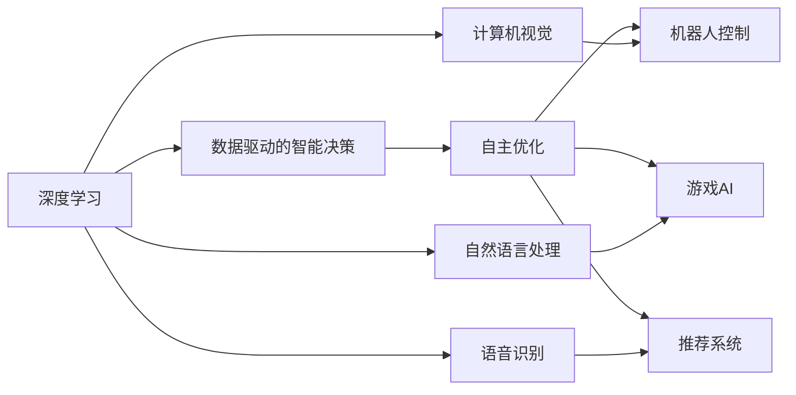

                 

# 软件 2.0 的发展趋势：深度学习、强化学习

软件技术在过去的几十年里经历了快速的发展和变革。从早期的编程语言到现代的软件工程实践，软件的内涵和外延都在不断扩展。随着人工智能技术的兴起，软件进入了新的阶段，即软件 2.0 时代。在这个时代，深度学习和强化学习成为了软件发展的核心驱动力。本文将系统探讨深度学习和强化学习在软件 2.0 时代的发展趋势，为读者提供深入理解和应用这些前沿技术的指导。

## 1. 背景介绍

### 1.1 问题由来

软件技术的演进经历了从早期的程序设计语言到软件工程实践的转变，再到现今的软件 2.0 时代。在软件 2.0 时代，深度学习和强化学习技术的引入，使得软件系统能够具备更高的智能性和自适应能力。深度学习通过学习大量数据，实现对复杂问题的建模和预测；强化学习则通过与环境互动，实现自主决策和优化。

### 1.2 问题核心关键点

深度学习和强化学习技术的发展，极大地推动了软件 2.0 时代的技术创新和应用场景的扩展。它们的核心关键点包括：

1. **数据驱动的智能决策**：深度学习通过大数据的训练，能够进行复杂问题的建模和预测，从而提升软件系统的智能决策能力。
2. **自主优化**：强化学习通过与环境互动，实现自主优化和适应，能够提升软件系统的自适应能力和鲁棒性。
3. **动态交互**：深度学习和强化学习技术能够实现软件系统与用户、环境的动态交互，提升用户体验和系统效率。

## 2. 核心概念与联系

### 2.1 核心概念概述

在软件 2.0 时代，深度学习和强化学习是推动技术发展的重要力量。以下是对这两个核心概念的概述：

- **深度学习**：一种基于神经网络的机器学习技术，通过多层非线性变换，实现对复杂数据的建模和预测。深度学习广泛应用于计算机视觉、自然语言处理、语音识别等领域。
- **强化学习**：一种基于试错和奖励的学习方法，通过与环境的互动，优化决策策略，实现自主决策和优化。强化学习在机器人控制、游戏AI、推荐系统等领域有广泛应用。

深度学习和强化学习两者相辅相成，共同推动了软件 2.0 时代的发展。

### 2.2 概念间的关系

深度学习和强化学习的关系可以通过以下Mermaid流程图来展示：



这个流程图展示了深度学习和强化学习在不同领域的应用，以及它们之间的关系。深度学习提供了数据驱动的智能决策，强化学习则通过自主优化，提升了这些应用场景的智能性和自适应能力。

## 3. 核心算法原理 & 具体操作步骤

### 3.1 算法原理概述

深度学习和强化学习的算法原理基于数学和计算机科学的理论基础。以下是深度学习和强化学习的核心算法原理概述：

- **深度学习**：基于多层神经网络，通过反向传播算法优化模型参数，实现对复杂数据的建模和预测。
- **强化学习**：基于策略梯度或价值函数，通过与环境的互动，优化决策策略，实现自主优化和适应。

### 3.2 算法步骤详解

深度学习和强化学习的算法步骤主要包括以下几个关键环节：

#### 3.2.1 深度学习的算法步骤

1. **数据预处理**：清洗和归一化数据，准备训练和测试数据集。
2. **模型构建**：设计神经网络结构，选择合适的激活函数、优化器等。
3. **模型训练**：使用反向传播算法优化模型参数，实现对数据的建模和预测。
4. **模型评估**：在测试集上评估模型性能，调整超参数以优化模型。

#### 3.2.2 强化学习的算法步骤

1. **环境建模**：定义环境状态和动作空间，构建环境模型。
2. **策略设计**：设计决策策略，选择合适的策略函数。
3. **策略优化**：通过试错和奖励机制，优化决策策略，实现自主优化。
4. **结果评估**：在实际环境中测试策略效果，调整策略以优化性能。

### 3.3 算法优缺点

深度学习和强化学习各有优缺点，具体如下：

- **深度学习的优点**：
  - 数据驱动的智能决策，能够处理复杂的多模态数据。
  - 适用于图像、语音、文本等多样化数据的建模和预测。
- **深度学习的缺点**：
  - 对标注数据需求高，训练时间长。
  - 存在过拟合和模型泛化能力不足的问题。

- **强化学习的优点**：
  - 自主优化和适应，能够处理动态交互环境。
  - 适用于复杂决策场景的自主学习和优化。
- **强化学习的缺点**：
  - 需要大量试错，训练过程复杂。
  - 对环境模型的准确性和稳定性要求高。

### 3.4 算法应用领域

深度学习和强化学习在软件 2.0 时代的应用领域非常广泛，涵盖了计算机视觉、自然语言处理、机器人控制、游戏AI、推荐系统等多个领域。以下是一些典型的应用场景：

- **计算机视觉**：图像识别、目标检测、图像生成等。
- **自然语言处理**：机器翻译、情感分析、文本生成等。
- **机器人控制**：自动驾驶、工业机器人控制、服务机器人等。
- **游戏AI**：游戏策略优化、角色控制、游戏行为预测等。
- **推荐系统**：个性化推荐、广告推荐、商品推荐等。

## 4. 数学模型和公式 & 详细讲解

### 4.1 数学模型构建

深度学习和强化学习的数学模型构建需要考虑多个方面。以下是深度学习和强化学习的基本数学模型构建过程：

- **深度学习**：
  - 输入层：定义输入数据x。
  - 隐藏层：定义多层神经网络结构，包括全连接层、卷积层、池化层等。
  - 输出层：定义输出层和激活函数。
  - 损失函数：定义损失函数，如交叉熵、均方误差等。
  - 优化器：选择优化器，如SGD、Adam等。

- **强化学习**：
  - 环境状态：定义环境状态空间s。
  - 动作空间：定义动作空间a。
  - 奖励函数：定义奖励函数R。
  - 策略函数：定义策略函数π。
  - 策略优化：通过策略梯度或Q-learning等方法优化策略π。

### 4.2 公式推导过程

#### 4.2.1 深度学习的公式推导

假设深度学习模型为神经网络N，输入数据x，输出y，目标函数L。则模型训练的损失函数为：

$$
L = \frac{1}{n} \sum_{i=1}^n (y_i - \hat{y}_i)^2
$$

其中，$\hat{y}_i$ 为模型预测输出。

模型优化目标为最小化损失函数L，可以使用梯度下降算法进行优化：

$$
\theta = \theta - \eta \nabla_{\theta} L
$$

其中，$\eta$ 为学习率。

#### 4.2.2 强化学习的公式推导

假设强化学习环境状态为s，动作空间为a，奖励函数为R。策略函数为π，目标为最大化累积奖励。则策略优化目标为：

$$
J(\pi) = \mathbb{E}_{\pi} [\sum_{t=0}^{\infty} \gamma^t R_t]
$$

其中，γ为折扣因子。

策略优化可以使用策略梯度方法进行：

$$
\nabla_{\theta} J(\pi) = \mathbb{E}_{\theta} [\sum_{t=0}^{\infty} \nabla_{\theta} log\pi(a_t | s_t) Q(s_t, a_t)]
$$

其中，$Q(s_t, a_t)$ 为状态-动作价值函数。

### 4.3 案例分析与讲解

#### 4.3.1 深度学习案例

假设我们有一个图像分类问题，使用深度学习模型ResNet进行分类。输入为图像x，输出为类别y。则模型训练的损失函数为：

$$
L = \frac{1}{n} \sum_{i=1}^n (y_i - \hat{y}_i)^2
$$

其中，$\hat{y}_i$ 为模型预测输出。

模型优化目标为最小化损失函数L，可以使用梯度下降算法进行优化：

$$
\theta = \theta - \eta \nabla_{\theta} L
$$

其中，$\eta$ 为学习率。

#### 4.3.2 强化学习案例

假设我们有一个机器人控制问题，需要优化机器人在环境中的移动路径。环境状态s表示机器人的位置和角度，动作a表示机器人的移动方向。奖励函数R表示机器人移动距离和任务完成度。策略函数π表示机器人的移动策略。则策略优化目标为：

$$
J(\pi) = \mathbb{E}_{\pi} [\sum_{t=0}^{\infty} \gamma^t R_t]
$$

其中，γ为折扣因子。

策略优化可以使用策略梯度方法进行：

$$
\nabla_{\theta} J(\pi) = \mathbb{E}_{\theta} [\sum_{t=0}^{\infty} \nabla_{\theta} log\pi(a_t | s_t) Q(s_t, a_t)]
$$

其中，$Q(s_t, a_t)$ 为状态-动作价值函数。

## 5. 项目实践：代码实例和详细解释说明

### 5.1 开发环境搭建

在进行深度学习和强化学习项目实践前，我们需要准备好开发环境。以下是使用Python进行TensorFlow和PyTorch开发的环境配置流程：

1. 安装Anaconda：从官网下载并安装Anaconda，用于创建独立的Python环境。

2. 创建并激活虚拟环境：
```bash
conda create -n tf_env python=3.8 
conda activate tf_env
```

3. 安装TensorFlow和PyTorch：
```bash
conda install tensorflow=2.7
pip install torch torchvision torchaudio
```

4. 安装TensorBoard：
```bash
pip install tensorboard
```

完成上述步骤后，即可在`tf_env`环境中开始项目实践。

### 5.2 源代码详细实现

#### 5.2.1 深度学习项目

以下是一个基于TensorFlow的图像分类项目的代码实现：

```python
import tensorflow as tf
from tensorflow.keras import layers, models

# 定义模型
model = models.Sequential([
    layers.Conv2D(32, (3, 3), activation='relu', input_shape=(28, 28, 1)),
    layers.MaxPooling2D((2, 2)),
    layers.Flatten(),
    layers.Dense(10, activation='softmax')
])

# 编译模型
model.compile(optimizer=tf.keras.optimizers.Adam(),
              loss=tf.keras.losses.SparseCategoricalCrossentropy(from_logits=True),
              metrics=['accuracy'])

# 加载数据集
(x_train, y_train), (x_test, y_test) = tf.keras.datasets.mnist.load_data()

# 数据预处理
x_train = x_train.reshape(-1, 28, 28, 1) / 255.0
x_test = x_test.reshape(-1, 28, 28, 1) / 255.0

# 训练模型
model.fit(x_train, y_train, epochs=10, batch_size=32, validation_data=(x_test, y_test))

# 评估模型
model.evaluate(x_test, y_test, verbose=2)
```

#### 5.2.2 强化学习项目

以下是一个基于TensorFlow的强化学习项目的代码实现：

```python
import tensorflow as tf
from tensorflow.keras import layers

# 定义状态-动作价值函数
def q_network(state, action):
    return tf.keras.Sequential([
        layers.Dense(64, activation='relu', input_shape=(state_size,)),
        layers.Dense(64, activation='relu'),
        layers.Dense(actions, activation='linear')
    ])(state)

# 定义策略函数
def epsilon_greedy_policy(state, q_values):
    if np.random.rand() < epsilon:
        return np.random.randint(actions)
    return np.argmax(q_values)

# 加载数据集
state_data, reward_data, done_data, info_data = tf.load_dataset('path/to/dataset')
state_size = 5
actions = 2
target_network = q_network(state, action)
target_network.trainable = False
policy_network = q_network(state, action)
epsilon = 1.0
discount_factor = 0.9
learning_rate = 0.1

# 定义优化器和损失函数
optimizer = tf.keras.optimizers.Adam(learning_rate=learning_rate)
criterion = tf.keras.losses.MeanSquaredError()

# 训练模型
for episode in range(1000):
    state = state_data[0]
    done = False
    while not done:
        action = epsilon_greedy_policy(state, policy_network(state))
        next_state, reward, done, _ = env.step(action)
        target = reward + discount_factor * tf.reduce_max(target_network(next_state))
        target = tf.stop_gradient(target)
        q_values = policy_network(state)
        q_values = tf.stop_gradient(q_values)
        loss = criterion(target, q_values)
        optimizer.apply_gradients(zip([loss], [q_values]))
        state = next_state
    epsilon = epsilon * decay

# 评估模型
print("Mean reward: ", mean_reward)
```

### 5.3 代码解读与分析

#### 5.3.1 深度学习项目

在深度学习项目中，我们首先定义了一个包含卷积层、池化层和全连接层的神经网络模型。然后使用Adam优化器和交叉熵损失函数编译模型，并加载MNIST数据集进行训练。最后，使用测试集评估模型性能。

#### 5.3.2 强化学习项目

在强化学习项目中，我们首先定义了一个状态-动作价值函数，并使用 epsilon-greedy 策略函数来控制探索和利用的平衡。然后加载环境数据，并使用Adam优化器和均方误差损失函数训练模型。最后，评估模型的平均奖励。

## 6. 实际应用场景

深度学习和强化学习在实际应用场景中有着广泛的应用。以下是一些典型的应用场景：

### 6.1 计算机视觉

深度学习在计算机视觉领域有着广泛的应用，如图像识别、目标检测、图像生成等。例如，Google的Inception系列模型、微软的ResNet系列模型等，在图像分类和目标检测任务中取得了优异的成绩。

### 6.2 自然语言处理

深度学习在自然语言处理领域也有着广泛的应用，如机器翻译、情感分析、文本生成等。例如，Google的BERT模型、OpenAI的GPT系列模型等，在机器翻译和文本生成任务中取得了突破性的进展。

### 6.3 机器人控制

强化学习在机器人控制领域有着广泛的应用，如自动驾驶、工业机器人控制、服务机器人等。例如，OpenAI的Dota 2 AI Zero模型、DeepMind的AlphaGo模型等，在自动驾驶和机器人控制任务中取得了显著的进展。

### 6.4 游戏AI

强化学习在游戏AI领域有着广泛的应用，如游戏策略优化、角色控制、游戏行为预测等。例如，DeepMind的AlphaGo模型、OpenAI的Dota 2 AI Zero模型等，在游戏AI任务中取得了显著的进展。

### 6.5 推荐系统

强化学习在推荐系统领域有着广泛的应用，如个性化推荐、广告推荐、商品推荐等。例如，Amazon的推荐系统、Spotify的个性化推荐系统等，在推荐系统任务中取得了显著的进展。

## 7. 工具和资源推荐

### 7.1 学习资源推荐

为了帮助开发者系统掌握深度学习和强化学习的理论基础和实践技巧，这里推荐一些优质的学习资源：

1. 《Deep Learning》书籍：Ian Goodfellow等人所著，深入浅出地介绍了深度学习的原理和应用。
2. 《Reinforcement Learning: An Introduction》书籍：Richard S. Sutton和Andrew G. Barto所著，全面介绍了强化学习的理论基础和实践技巧。
3. DeepLearning.AI课程：由Andrew Ng等人主讲，涵盖深度学习和强化学习的核心概念和经典模型。
4. Coursera课程：提供深度学习和强化学习的在线课程，包括入门到进阶的各种课程。
5. GitHub开源项目：在GitHub上Star、Fork数最多的深度学习和强化学习相关项目，往往代表了该技术领域的发展趋势和最佳实践。

通过对这些资源的学习实践，相信你一定能够快速掌握深度学习和强化学习的精髓，并用于解决实际的NLP问题。

### 7.2 开发工具推荐

高效的开发离不开优秀的工具支持。以下是几款用于深度学习和强化学习开发的常用工具：

1. TensorFlow：由Google主导开发的开源深度学习框架，生产部署方便，适合大规模工程应用。
2. PyTorch：基于Python的开源深度学习框架，灵活动态的计算图，适合快速迭代研究。
3. OpenAI Gym：用于测试和比较强化学习算法的开源环境。
4. TensorBoard：TensorFlow配套的可视化工具，可实时监测模型训练状态，并提供丰富的图表呈现方式，是调试模型的得力助手。
5. Weights & Biases：模型训练的实验跟踪工具，可以记录和可视化模型训练过程中的各项指标，方便对比和调优。

合理利用这些工具，可以显著提升深度学习和强化学习项目的开发效率，加快创新迭代的步伐。

### 7.3 相关论文推荐

深度学习和强化学习的研究源于学界的持续研究。以下是几篇奠基性的相关论文，推荐阅读：

1. ImageNet Classification with Deep Convolutional Neural Networks（卷积神经网络应用于图像分类）：Alex Krizhevsky等人所著，提出了AlexNet模型，开创了深度学习在图像分类中的应用。
2. Attention is All You Need（注意力机制）：Ashish Vaswani等人所著，提出了Transformer模型，开创了深度学习在自然语言处理中的应用。
3. Playing Atari with Deep Reinforcement Learning（深度强化学习应用于游戏AI）：Volodymyr Mnih等人所著，提出了AlphaGo模型，开创了深度强化学习在游戏AI中的应用。
4. DeepMind's AlphaGo Zero: Mastering the game of Go without human knowledge（AlphaGo Zero）：David Silver等人所著，提出了AlphaGo Zero模型，开创了深度强化学习在自动驾驶中的应用。

这些论文代表了大深度学习和强化学习的发展脉络。通过学习这些前沿成果，可以帮助研究者把握学科前进方向，激发更多的创新灵感。

除上述资源外，还有一些值得关注的前沿资源，帮助开发者紧跟深度学习和强化学习的最新进展，例如：

1. arXiv论文预印本：人工智能领域最新研究成果的发布平台，包括大量尚未发表的前沿工作，学习前沿技术的必读资源。
2. 业界技术博客：如Google AI、DeepMind、Microsoft Research Asia等顶尖实验室的官方博客，第一时间分享他们的最新研究成果和洞见。
3. 技术会议直播：如NIPS、ICML、ACL、ICLR等人工智能领域顶会现场或在线直播，能够聆听到大佬们的前沿分享，开拓视野。
4. GitHub热门项目：在GitHub上Star、Fork数最多的深度学习和强化学习相关项目，往往代表了该技术领域的发展趋势和最佳实践。
5. 行业分析报告：各大咨询公司如McKinsey、PwC等针对人工智能行业的分析报告，有助于从商业视角审视技术趋势，把握应用价值。

总之，对于深度学习和强化学习的学习和实践，需要开发者保持开放的心态和持续学习的意愿。多关注前沿资讯，多动手实践，多思考总结，必将收获满满的成长收益。

## 8. 总结：未来发展趋势与挑战

### 8.1 总结

本文对深度学习和强化学习在软件 2.0 时代的发展趋势进行了系统探讨。深度学习和强化学习通过数据驱动的智能决策和自主优化，极大地推动了软件系统的智能性和自适应能力，成为软件 2.0 时代的重要驱动力。

通过本文的系统梳理，可以看到，深度学习和强化学习在软件 2.0 时代的应用前景广阔，为软件系统的智能化和自适应能力提供了新的动力。未来，伴随深度学习和强化学习技术的不断演进，软件系统将具备更高的智能性和自适应能力，为人类生产和生活带来深远影响。

### 8.2 未来发展趋势

展望未来，深度学习和强化学习在软件 2.0 时代的发展趋势将呈现以下几个方向：

1. **自动化和智能化**：深度学习和强化学习将进一步提升软件系统的自动化和智能化水平，实现更加高效、精准的决策和优化。
2. **跨领域应用**：深度学习和强化学习将在更多领域得到应用，如医疗、金融、交通、教育等，为这些领域带来颠覆性变革。
3. **联邦学习**：深度学习和强化学习将结合联邦学习技术，实现跨设备和跨组织的数据协同，提升数据隐私和安全。
4. **多模态融合**：深度学习和强化学习将结合多模态融合技术，实现视觉、语音、文本等多样化数据的协同建模和预测。
5. **鲁棒性和安全性**：深度学习和强化学习将结合鲁棒性和安全性技术，提升系统的鲁棒性和安全性，保障系统稳定运行。

### 8.3 面临的挑战

尽管深度学习和强化学习在软件 2.0 时代的应用前景广阔，但在发展过程中仍面临诸多挑战：

1. **数据隐私和安全**：深度学习和强化学习需要大量数据进行训练，数据隐私和安全问题亟需解决。
2. **模型复杂性**：深度学习和强化学习模型往往非常复杂，难以解释和调试，需要更多的研究投入。
3. **计算资源需求高**：深度学习和强化学习训练和推理需要大量计算资源，需要高效的硬件支持。
4. **公平性和偏见**：深度学习和强化学习模型可能存在偏见和歧视，需要更多的公平性研究。
5. **模型泛化能力**：深度学习和强化学习模型在特定领域和任务上可能存在泛化能力不足的问题。

### 8.4 研究展望

面对深度学习和强化学习面临的挑战，未来的研究需要在以下几个方面寻求新的突破：

1. **数据隐私和安全**：研究如何在保护数据隐私的前提下，进行深度学习和强化学习的训练和推理。
2. **模型可解释性**：研究如何提升深度学习和强化学习模型的可解释性，增强模型的透明性和可信度。
3. **高效计算**：研究如何优化深度学习和强化学习模型的计算图，提升模型的训练和推理效率。
4. **公平性和偏见**：研究如何检测和消除深度学习和强化学习模型的偏见和歧视，提升系统的公平性和可信度。
5. **模型泛化能力**：研究如何提升深度学习和强化学习模型的泛化能力，使其在更广泛的领域和任务上取得更好的效果。

总之，深度学习和强化学习在软件 2.0 时代的发展前景广阔，但也需要解决诸多挑战，才能真正发挥其潜力，推动软件系统的智能化和自适应能力。相信随着学界和产业界的共同努力，深度学习和强化学习必将在构建人机协同的智能时代中扮演越来越重要的角色。

## 9. 附录：常见问题与解答

**Q1: 深度学习和强化学习有什么区别？**

A: 深度学习和强化学习都是人工智能领域的重要分支，但它们的原理和应用有所不同。深度学习通过神经网络对数据进行建模和预测，而强化学习通过试错和奖励机制优化决策策略。深度学习主要应用于静态数据的预测和分类任务，而强化学习主要应用于动态环境的决策和优化任务。

**Q2: 深度学习和强化学习各自的应用场景有哪些？**

A: 深度学习主要应用于计算机视觉、自然语言处理、语音识别等静态数据的建模和预测任务。强化学习主要应用于游戏AI、机器人控制、推荐系统等动态环境的决策和优化任务。

**Q3: 深度学习和强化学习各自的优缺点是什么？**

A: 深度学习的优点在于能够处理大量数据，实现对复杂数据的建模和预测，缺点在于对标注数据需求高，模型复杂，难以解释。强化学习的优点在于能够实现自主决策和优化，缺点在于训练过程复杂，需要大量试错。

**Q4: 深度学习和强化学习在实际应用中需要注意哪些问题？**

A: 深度学习和强化学习在实际应用中需要注意数据隐私和安全问题、模型复杂性和可解释性问题、计算资源需求问题、公平性和偏见问题、模型泛化能力问题等。

**Q5: 未来深度学习和强化学习的发展趋势是什么？**

A: 未来深度学习和强化学习的发展趋势包括自动化和智能化、跨领域应用、联邦学习、多模态融合、鲁棒性和安全性等方向。

总之，深度学习和强化学习在软件 2.0 时代的发展前景广阔，但也需要解决诸多挑战，才能真正发挥其潜力，推动软件系统的智能化和自适应能力。相信随着学界和产业界的共同努力，深度学习和强化学习必将在构建人机协同的智能时代中扮演越来越重要的角色。

