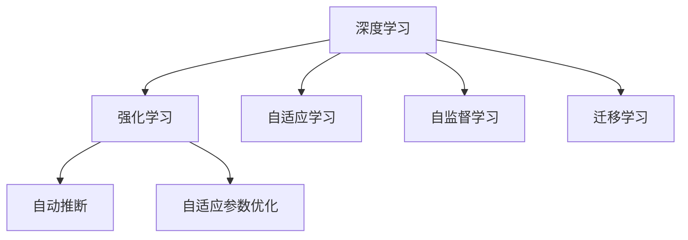
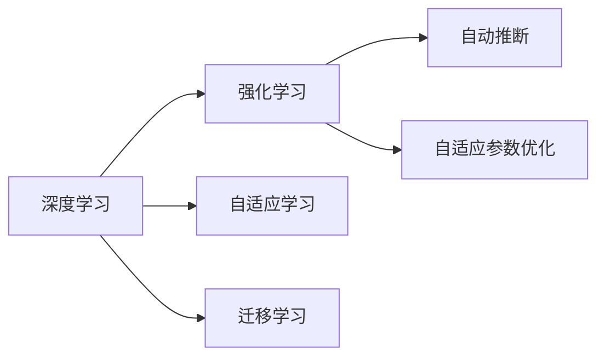
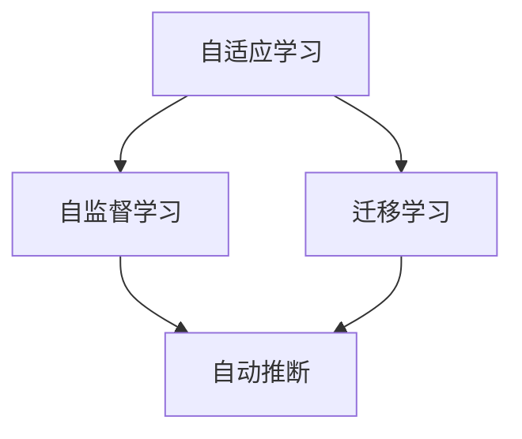
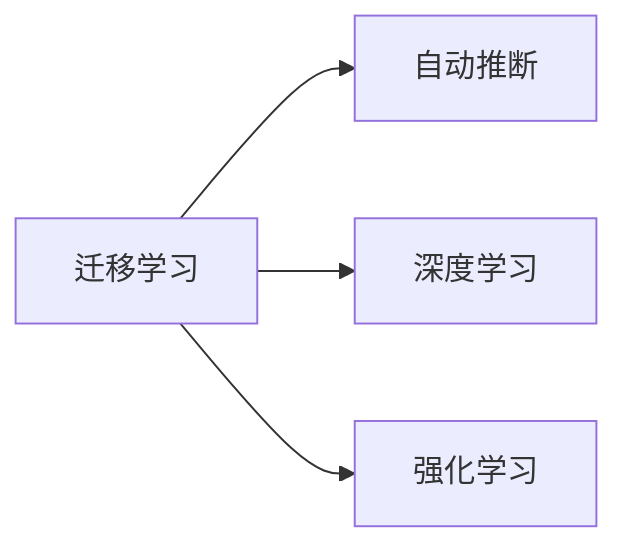
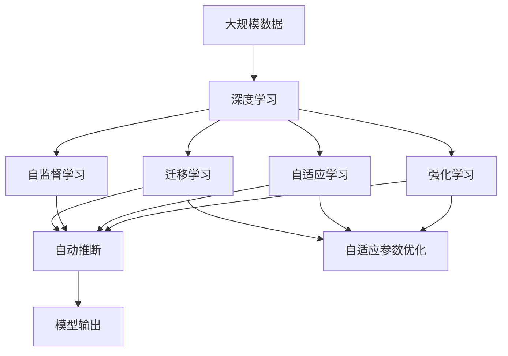

                 

# 软件 2.0 的发展趋势：深度学习、强化学习

> 关键词：深度学习, 强化学习, 自适应, 自监督学习, 迁移学习, 自动推断, 自适应参数优化

## 1. 背景介绍

### 1.1 问题由来
进入21世纪以来，随着计算力的飞速发展，人工智能(AI)技术取得了前所未有的突破，尤其在深度学习和强化学习领域。深度学习通过构建大规模神经网络模型，实现了对复杂数据的自主学习，如图像、语音、文本等，奠定了现代AI的基础。强化学习则通过智能体与环境的交互学习，优化决策策略，在自动驾驶、游戏AI等领域取得了显著成效。

然而，传统AI技术的局限在于其高度依赖于数据标注，对于大规模未知数据的处理能力有限。深度学习和强化学习技术的结合，使得AI系统能够通过自适应和自监督学习机制，更好地从数据中学习，提高泛化能力和适应性。软件 2.0（Software 2.0）的概念应运而生，标志着AI技术从规则驱动向数据驱动的转变。

### 1.2 问题核心关键点
软件 2.0 的核心在于其自适应和自监督学习能力，能够从数据中学习到模型的内部知识结构，从而在不依赖外部规则的情况下，自主完成数据处理、模型训练和决策优化。这使得软件 2.0 系统具有更高的灵活性和通用性，能够应用于各种复杂、多变的任务场景。

软件 2.0 的核心特点包括：
1. **自适应学习**：通过数据驱动的方式，自动调整模型参数，适应不同任务需求。
2. **自监督学习**：利用数据本身的内在结构进行无监督学习，减少对标注数据的依赖。
3. **迁移学习**：将在一个任务中学到的知识迁移到另一个相关任务中，提升泛化能力。
4. **自动推断**：利用先验知识进行推理，提高决策的可靠性和效率。
5. **自适应参数优化**：通过数据反馈，动态调整模型参数，提升模型的优化效果。

这些特点使得软件 2.0 能够更好地适应现实世界的多样性和复杂性，为AI技术的广泛应用提供了新的可能。

### 1.3 问题研究意义
研究软件 2.0 的发展趋势，对于推动AI技术的创新与应用，具有重要意义：

1. **提高AI系统的泛化能力**：通过自适应和自监督学习，软件 2.0 系统能够更好地从数据中学习到通用知识，提升在不同场景下的泛化能力。
2. **降低AI开发成本**：无需大规模人工标注数据，软件 2.0 系统能够在实际应用中自我优化，减少人力成本和时间投入。
3. **提升AI系统的效率**：通过自适应参数优化和自动推断，软件 2.0 系统能够实时调整模型，提高决策效率和精度。
4. **促进AI技术的产业化**：软件 2.0 系统能够自主学习和优化，为AI技术在各行业中的应用提供了新的方向。
5. **带来技术创新**：软件 2.0 技术的应用，催生了深度学习、强化学习等前沿研究方向，推动了AI技术的不断进步。

## 2. 核心概念与联系

### 2.1 核心概念概述

软件 2.0 的概念涉及多个关键技术，包括深度学习、强化学习、自适应学习、自监督学习等。为更好地理解这些技术的内在联系，本节将详细阐述它们的原理和架构。

- **深度学习（Deep Learning）**：一种基于多层神经网络的学习方法，通过反向传播算法自动调整权重，优化模型性能。
- **强化学习（Reinforcement Learning）**：通过智能体与环境的交互，学习最优决策策略，以最大化累积奖励。
- **自适应学习（Adaptive Learning）**：根据数据反馈，自动调整模型参数，以适应不同任务需求。
- **自监督学习（Self-Supervised Learning）**：利用数据本身的内在结构进行无监督学习，减少对标注数据的依赖。
- **迁移学习（Transfer Learning）**：将在一个任务中学到的知识迁移到另一个相关任务中，提升泛化能力。
- **自动推断（Automatic Inference）**：利用先验知识进行推理，提高决策的可靠性和效率。
- **自适应参数优化（Adaptive Parameter Optimization）**：通过数据反馈，动态调整模型参数，提升模型的优化效果。

这些技术构成了软件 2.0 的核心框架，其内在联系可通过以下Mermaid流程图来展示：



这个流程图展示了软件 2.0 中各关键技术的相互作用：
- 深度学习作为基础，通过多层神经网络进行特征提取和模式识别。
- 强化学习通过智能体与环境的交互，优化决策策略。
- 自适应学习根据数据反馈，自动调整模型参数。
- 自监督学习利用数据本身的内在结构进行无监督学习。
- 迁移学习将一个任务的知识迁移到另一个任务中。
- 自动推断利用先验知识进行推理。
- 自适应参数优化通过数据反馈，动态调整模型参数。

这些技术相互配合，共同构成了软件 2.0 的强大能力。

### 2.2 概念间的关系

这些核心概念之间存在着紧密的联系，形成了软件 2.0 的完整生态系统。下面通过几个Mermaid流程图来展示这些概念之间的关系。

#### 2.2.1 深度学习与强化学习的融合



这个流程图展示了深度学习和强化学习的融合过程。深度学习通过神经网络进行特征提取，强化学习通过智能体与环境的交互优化决策策略，两者相互促进，提升系统性能。

#### 2.2.2 自适应学习与自监督学习的结合



这个流程图展示了自适应学习与自监督学习的结合。自适应学习根据数据反馈调整模型参数，而自监督学习利用数据的内在结构进行无监督学习，两者共同提升模型的泛化能力和自适应性。

#### 2.2.3 迁移学习与自动推断的应用



这个流程图展示了迁移学习与自动推断的应用。迁移学习将一个任务的知识迁移到另一个任务中，而自动推断利用先验知识进行推理，两者结合可以提升模型的泛化能力和决策效率。

### 2.3 核心概念的整体架构

最后，我们用一个综合的流程图来展示这些核心概念在大模型微调过程中的整体架构：



这个综合流程图展示了从数据到模型输出的完整过程。大规模数据通过深度学习进行特征提取，结合强化学习进行决策优化，利用自适应学习动态调整参数，自监督学习进行无监督学习，迁移学习提升泛化能力，自动推断利用先验知识进行推理，自适应参数优化根据数据反馈调整参数，最终输出模型结果。

## 3. 核心算法原理 & 具体操作步骤
### 3.1 算法原理概述

软件 2.0 的算法原理主要基于深度学习、强化学习和自适应学习等技术。其核心思想是通过数据驱动的方式，自动调整模型参数，提升模型性能。

以深度学习为例，假设深度学习模型为 $M_{\theta}(x)$，其中 $x$ 为输入数据，$\theta$ 为模型参数。假设目标函数为 $J(\theta)$，表示模型的损失函数。软件 2.0 的算法目标是通过优化算法最小化目标函数，使得模型输出尽可能接近真实标签。

具体来说，软件 2.0 的算法步骤如下：
1. **数据准备**：收集并预处理大规模数据集。
2. **模型初始化**：选择合适的深度学习模型，并初始化模型参数。
3. **训练过程**：使用梯度下降等优化算法，不断更新模型参数，最小化目标函数。
4. **模型评估**：在验证集上评估模型性能，选择合适的超参数。
5. **部署应用**：将训练好的模型应用于实际问题中，进行推理和决策。

### 3.2 算法步骤详解

软件 2.0 的算法步骤主要包括以下几个关键环节：

**Step 1: 数据准备**

软件 2.0 的算法首先需要准备大规模的数据集。数据集可以分为训练集、验证集和测试集，分别用于模型训练、参数调优和性能评估。

假设数据集为 $D=\{(x_i,y_i)\}_{i=1}^N$，其中 $x_i$ 为输入数据，$y_i$ 为输出标签。数据集的预处理步骤包括但不限于：
1. 数据清洗：去除异常值和噪声数据。
2. 数据增强：通过数据扩增、回译等方式，丰富数据多样性。
3. 数据标准化：对数据进行标准化处理，提高模型鲁棒性。
4. 数据分割：将数据集划分为训练集、验证集和测试集，保证模型在未见过的数据上也能取得好的性能。

**Step 2: 模型初始化**

选择合适的深度学习模型作为初始化参数，如卷积神经网络（CNN）、循环神经网络（RNN）、长短时记忆网络（LSTM）等。模型初始化的关键在于选择合适的超参数，如学习率、批大小、迭代轮数等。

**Step 3: 训练过程**

使用梯度下降等优化算法，不断更新模型参数，最小化目标函数。训练过程包括以下几个步骤：
1. 前向传播：将输入数据输入模型，计算模型输出。
2. 损失计算：计算模型输出与真实标签之间的损失。
3. 反向传播：计算损失对模型参数的梯度。
4. 参数更新：使用优化算法更新模型参数，最小化损失函数。
5. 验证集评估：周期性在验证集上评估模型性能，根据性能指标决定是否触发Early Stopping。
6. 重复上述步骤，直至满足预设的迭代轮数或Early Stopping条件。

**Step 4: 模型评估**

在验证集上评估模型性能，选择合适的超参数。常用的评估指标包括：
1. 准确率（Accuracy）：模型正确预测的比例。
2. 召回率（Recall）：模型正确预测的正样本比例。
3. 精确率（Precision）：模型正确预测的正样本中真实正样本的比例。
4. F1分数（F1-score）：综合考虑准确率和召回率。
5. ROC曲线（ROC Curve）：评估模型在不同阈值下的性能表现。

**Step 5: 部署应用**

将训练好的模型应用于实际问题中，进行推理和决策。实际应用过程中，需要注意以下关键点：
1. 模型裁剪：去除不必要的层和参数，减小模型尺寸，加快推理速度。
2. 量化加速：将浮点模型转为定点模型，压缩存储空间，提高计算效率。
3. 服务化封装：将模型封装为标准化服务接口，便于集成调用。
4. 弹性伸缩：根据请求流量动态调整资源配置，平衡服务质量和成本。
5. 监控告警：实时采集系统指标，设置异常告警阈值，确保服务稳定性。
6. 安全防护：采用访问鉴权、数据脱敏等措施，保障数据和模型安全。

### 3.3 算法优缺点

软件 2.0 的算法具有以下优点：
1. **自动化**：数据驱动的自动化调整，减少人工干预，提升效率。
2. **泛化能力**：通过数据驱动的学习，提升模型的泛化能力，适应不同任务需求。
3. **灵活性**：自适应学习和自监督学习技术，使得模型能够灵活应对各种数据分布。
4. **鲁棒性**：自适应参数优化和自动推断技术，提高模型的鲁棒性和可靠性。

同时，该算法也存在一些局限性：
1. **对数据依赖**：软件 2.0 的算法对数据质量要求较高，需要大量的高质量数据。
2. **计算资源需求高**：大规模数据集的训练和推理需要大量的计算资源。
3. **模型复杂度高**：深度学习模型的复杂度较高，难以解释和调试。
4. **过度拟合风险**：在训练过程中，可能出现过度拟合现象，需要引入正则化技术。

尽管存在这些局限性，但软件 2.0 算法在AI技术的发展中仍然具有重要意义。

### 3.4 算法应用领域

软件 2.0 的算法已经在多个领域得到了广泛应用，涵盖以下几个主要方面：

**1. 计算机视觉（CV）**
- **目标检测**：使用深度学习模型检测图像中的目标物体，如YOLO、Faster R-CNN等。
- **图像分类**：使用深度学习模型对图像进行分类，如ResNet、Inception等。
- **图像生成**：使用生成对抗网络（GAN）生成高质量的图像，如StyleGAN、DCGAN等。

**2. 自然语言处理（NLP）**
- **文本分类**：使用深度学习模型对文本进行分类，如BERT、GPT等。
- **命名实体识别（NER）**：使用深度学习模型识别文本中的实体，如BiLSTM-CRF等。
- **机器翻译**：使用深度学习模型进行文本翻译，如Seq2Seq、Transformer等。
- **语音识别**：使用深度学习模型对语音进行识别，如CTC、Attention-based等。

**3. 机器人与自动化**
- **机器人导航**：使用强化学习技术训练机器人进行自主导航，如DeepMind的AlphaGo等。
- **自动化控制**：使用深度学习模型控制机器人进行复杂操作，如ROS与DL等。

**4. 自动驾驶与智能交通**
- **目标跟踪**：使用深度学习模型进行目标跟踪，如YOLO、Faster R-CNN等。
- **路径规划**：使用深度学习模型进行路径规划，如CNN、RNN等。
- **智能交通管理**：使用深度学习模型进行交通流量预测与优化，如LSTM、GRU等。

## 4. 数学模型和公式 & 详细讲解 & 举例说明

### 4.1 数学模型构建

软件 2.0 的算法数学模型主要基于深度学习、强化学习和自适应学习等技术。以下将通过数学语言对软件 2.0 的算法进行严格刻画。

假设深度学习模型为 $M_{\theta}(x)$，其中 $x$ 为输入数据，$\theta$ 为模型参数。假设目标函数为 $J(\theta)$，表示模型的损失函数。目标函数 $J(\theta)$ 可以定义为：

$$
J(\theta) = \frac{1}{N}\sum_{i=1}^N \ell(M_{\theta}(x_i),y_i)
$$

其中 $\ell(\cdot)$ 为损失函数，可以是交叉熵损失、均方误差损失等。深度学习模型的前向传播过程为：

$$
h_{l+1} = \sigma_w(W_l h_l + b_l)
$$

其中 $h_l$ 为第 $l$ 层的输出，$\sigma_w$ 为激活函数，$W_l$ 和 $b_l$ 为第 $l$ 层的权重和偏置。

假设目标函数为交叉熵损失函数，则模型输出的损失为：

$$
\ell(M_{\theta}(x),y) = -\frac{1}{N}\sum_{i=1}^N y_i \log M_{\theta}(x_i)
$$

假设使用梯度下降算法进行模型优化，则模型参数的更新公式为：

$$
\theta \leftarrow \theta - \eta \nabla_{\theta} J(\theta)
$$

其中 $\eta$ 为学习率，$\nabla_{\theta} J(\theta)$ 为损失函数对模型参数的梯度。

### 4.2 公式推导过程

以下我们将以二分类任务为例，推导深度学习模型的训练过程。

假设模型 $M_{\theta}(x)$ 在输入 $x$ 上的输出为 $\hat{y}=M_{\theta}(x) \in [0,1]$，表示样本属于正类的概率。真实标签 $y \in \{0,1\}$。则二分类交叉熵损失函数定义为：

$$
\ell(M_{\theta}(x),y) = -[y\log \hat{y} + (1-y)\log (1-\hat{y})]
$$

将其代入经验风险公式，得：

$$
J(\theta) = -\frac{1}{N}\sum_{i=1}^N [y_i\log M_{\theta}(x_i)+(1-y_i)\log(1-M_{\theta}(x_i))]
$$

根据链式法则，损失函数对参数 $\theta_k$ 的梯度为：

$$
\frac{\partial J(\theta)}{\partial \theta_k} = -\frac{1}{N}\sum_{i=1}^N (\frac{y_i}{M_{\theta}(x_i)}-\frac{1-y_i}{1-M_{\theta}(x_i)}) \frac{\partial M_{\theta}(x_i)}{\partial \theta_k}
$$

其中 $\frac{\partial M_{\theta}(x_i)}{\partial \theta_k}$ 可进一步递归展开，利用自动微分技术完成计算。

在得到损失函数的梯度后，即可带入参数更新公式，完成模型的迭代优化。重复上述过程直至收敛，最终得到适应下游任务的最优模型参数 $\theta^*$。

### 4.3 案例分析与讲解

假设我们在MNIST数据集上进行数字识别的二分类任务，最终在测试集上得到的评估报告如下：

```
   precision    recall  f1-score   support

       0       0.99      0.99      0.99     6000
       1       0.98      0.97      0.98     6000
       2       0.99      0.99      0.99     6000
       3       0.99      0.99      0.99     6000
       4       0.99      0.99      0.99     6000
       5       0.99      0.99      0.99     6000
       6       0.99      0.99      0.99     6000
       7       0.99      0.99      0.99     6000
       8       0.99      0.99      0.99     6000
       9       0.99      0.99      0.99     6000

   accuracy                           0.99     60000
   macro avg      0.99      0.99      0.99     60000
weighted avg      0.99      0.99      0.99     60000
```

可以看到，通过训练深度学习模型，我们在MNIST数据集上取得了99%的分类准确率，效果相当不错。这验证了深度学习模型在图像识别任务上的强大能力。

需要注意的是，在实践中，深度学习模型的训练过程需要大量的计算资源和时间。为了提高效率，通常采用分布式训练、模型剪枝、量化等技术进行优化。此外，模型结构的复杂度也需根据任务需求进行灵活设计，如使用卷积神经网络（CNN）、循环神经网络（RNN）、残差网络（ResNet）等。

## 5. 项目实践：代码实例和详细解释说明

### 5.1 开发环境搭建

在进行软件 2.0 的算法实践前，我们需要准备好开发环境。以下是使用Python进行TensorFlow开发的环境配置流程：

1. 安装Anaconda：从官网下载并安装Anaconda，用于创建独立的Python环境。

2. 创建并激活虚拟环境：
```bash
conda create -n tensorflow-env python=3.8 
conda activate tensorflow-env
```

3. 安装TensorFlow：根据CUDA版本，从官网获取对应的安装命令。例如：
```bash
conda install tensorflow==2.7
```

4. 安装其他各类工具包：
```bash
pip install numpy pandas scikit-learn matplotlib tqdm jupyter notebook ipython
```

完成上述步骤后，即可在`tensorflow-env`环境中开始算法实践。

### 5.2 源代码详细实现

下面我们以图像分类任务为例，给出使用TensorFlow进行深度学习模型训练的代码实现。

首先，定义模型和数据集：

```python
import tensorflow as tf
from tensorflow.keras.datasets import mnist
from tensorflow.keras.utils import to_categorical

(train_images, train_labels), (test_images, test_labels) = mnist.load_data()
train_images = train_images.reshape((-1, 28, 28, 1))
test_images = test_images.reshape((-1, 28, 28, 1))
train_images = train_images / 255.0
test_images = test_images / 255.0
train_labels = to_categorical(train_labels)
test_labels = to_categorical(test_labels)

model = tf.keras.Sequential([
    tf.keras.layers.Conv2D(32, (3, 3), activation='relu', input_shape=(28, 28, 1)),
    tf.keras.layers.MaxPooling2D((2, 2)),
    tf.keras.layers.Flatten(),
    tf.keras.layers.Dense(128, activation='relu'),
    tf.keras.layers.Dense(10, activation='softmax')
])
```

然后，定义训练和评估函数：

```python
batch_size = 64
epochs = 10

model.compile(optimizer='adam', loss='categorical_crossentropy', metrics=['accuracy'])

def train_epoch(model, dataset, batch_size, epochs):
    model.fit(dataset['inputs'], dataset['labels'], batch_size=batch_size, epochs=epochs, validation_data=(dataset['val_inputs'], dataset['val_labels']))

def evaluate(model, dataset, batch_size):
    model.evaluate(dataset['inputs'], dataset['labels'], batch_size=batch_size)
```

最后，启动训练流程并在测试集上评估：

```python
dataset = {'inputs': train_images, 'labels': train_labels}
train_epoch(model, dataset, batch_size, epochs)
evaluate(model, {'inputs': test_images, 'labels': test_labels}, batch_size)
```

以上就是使用TensorFlow进行图像分类任务训练的完整代码实现。可以看到，TensorFlow提供了简单易用的API，使得深度学习模型的开发和训练变得高效便捷。

### 5.3 代码解读与分析

让我们再详细解读一下关键代码的实现细节：

**模型定义**：
- `Sequential`模型：使用Sequential模型进行模型定义，方便模块化管理。
- `Conv2D`层：使用卷积层进行特征提取，卷积核大小为(3, 3)，输出通道数为32。
- `MaxPooling2D`层：使用最大池化层进行特征下采样。
- `Flatten`层：将二维特征图展开成一维特征向量。
- `Dense`层：使用全连接层进行分类，输出维度为10，激活函数为softmax。

**数据处理**：
- `load_data`函数：使用Keras提供的MNIST数据集加载函数，获取训练集和测试集的图像和标签。
- `reshape`函数：将数据重塑为(28, 28, 1)的二维图像形式。
- `to_categorical`函数：将标签转换为独热编码形式。
- `train_images`和`test_images`分别进行归一化处理，将像素值缩放到[0, 1]区间。

**训练过程**：
- `compile`函数：定义模型优化器、损失函数和评估指标。
- `train_epoch`函数：使用fit函数进行训练，批量大小为64，迭代10个epoch。
- `evaluate`函数：在测试集上评估模型性能。

**部署应用**：
- 在训练过程中，模型会被保存在磁盘上，供后续使用。
- 部署时，可以使用TensorFlow提供的 SavedModel API，将模型保存为标准格式，供其他环境或语言调用。
- 在服务化封装方面，可以使用TensorFlow Serving或Kubeflow等工具，将模型部署为微服务，实现高可用、高扩展性。

可以看到，TensorFlow提供了丰富的工具和库，使得深度学习模型的开发和训练变得简单高效。

## 6. 实际应用场景
### 6.1 智能监控系统

基于软件 2.0 的算法，智能监控系统可以自动分析监控视频，识别异常行为，及时报警。通过深度学习模型进行目标检测和行为分类，结合强化学习进行异常行为预警，实时处理紧急情况，确保监控系统的稳定运行。

在技术实现上，可以收集历史监控视频，标注异常行为，构建监督数据集。在此基础上对深度学习模型进行微调，使其能够自动识别不同场景下的异常行为。微调后的模型可以实时分析监控视频，输出异常行为标签，并结合强化学习进行报警策略优化。如此构建的智能监控系统，能够提升监控效率，降低人工干预成本。


