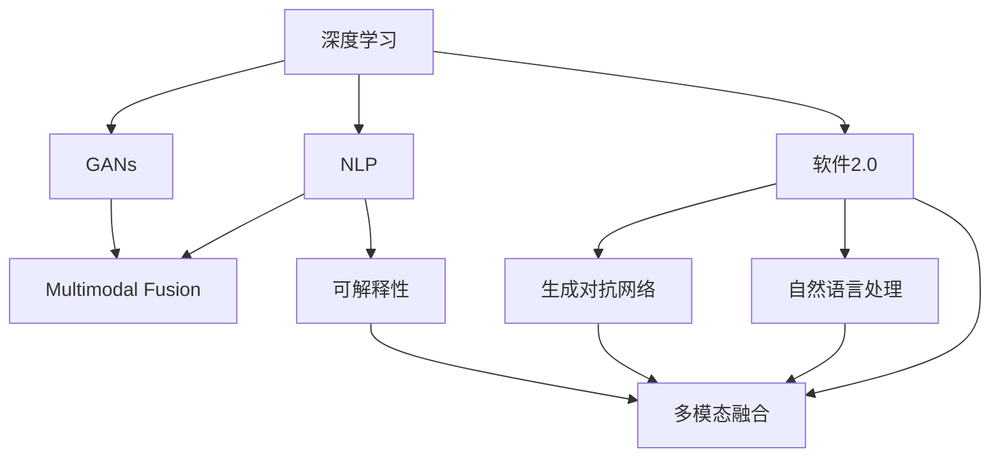

                 

# 软件 2.0 的应用：从实验室走向现实

## 1. 背景介绍

### 1.1 问题由来

随着计算能力的快速提升，人工智能(AI)技术，特别是深度学习与大数据的结合，正在经历一场革命性的变革。"软件 2.0"（Software 2.0），这一术语由GPT-4的开发者OpenAI提出，指的是一种能够自动学习和适应的软件系统，其核心特性在于无需人工编程，通过自我优化和学习机制，能够高效完成各种复杂任务。软件2.0不仅在学术界引发了广泛关注，也在产业界引起了巨大反响。

软件2.0的应用范围极广，涵盖了自然语言处理、图像识别、推荐系统、自动驾驶等众多领域。例如，ChatGPT、DALL·E2、OpenAI Codex等技术都是软件2.0的典型代表，它们在各自领域内展现了卓越的性能，为传统软件设计和开发带来了新的思路和方法。

### 1.2 问题核心关键点

软件2.0之所以受到如此重视，主要原因在于其以下几个核心关键点：

1. **自适应学习**：软件2.0系统具备自适应学习能力，能够根据不断变化的数据和任务，自动调整和优化自身的结构和功能。这种自适应能力使得软件能够更好地应对动态变化的环境。

2. **无监督学习**：软件2.0在大多数情况下不需要人工标注数据，通过自我学习和自我优化，即可实现高效的任务处理。这大大降低了人工干预的需求，提高了开发的效率和效果。

3. **泛化能力强**：软件2.0系统通过大规模的数据预训练，具备强大的泛化能力，能够处理各种复杂和多样化的任务，而无需针对每个特定任务进行单独设计和优化。

4. **多模态融合**：软件2.0系统能够处理多模态数据（如文本、图像、音频等），通过深度融合不同模态的信息，实现更全面、准确的任务处理。

5. **可扩展性好**：软件2.0系统易于扩展，通过简单的微调，即可适应新的任务和数据，无需大规模重新设计和开发。

6. **高效开发**：软件2.0系统大大简化了软件开发流程，通过自动化工具和预训练模型，开发者能够快速构建高效、灵活的软件系统。

### 1.3 问题研究意义

研究软件2.0的应用，对于提升软件开发效率、推动人工智能技术落地应用具有重要意义：

1. **降低开发成本**：软件2.0通过自适应学习和无监督学习，减少了人工干预的需求，大大降低了软件开发成本和时间。

2. **提升系统性能**：软件2.0系统具备强大的泛化能力和多模态融合能力，能够在各种复杂场景下取得优异的性能。

3. **加速技术产业化**：软件2.0为传统软件行业的转型升级提供了新的方向，推动了人工智能技术的产业化进程。

4. **促进技术创新**：软件2.0系统的自我优化和自适应能力，带来了全新的技术探索和应用场景，为软件开发提供了新的思路和方法。

5. **赋能企业发展**：软件2.0技术可以应用于企业内部的自动化流程、智能客服、智能推荐等多个环节，为企业数字化转型提供新的动力。

## 2. 核心概念与联系

### 2.1 核心概念概述

为了更好地理解软件2.0的应用，本节将介绍几个密切相关的核心概念：

- **软件2.0**：指的是一种能够自我优化和适应的软件系统，其核心特性在于无需人工编程，通过自我学习和自我优化，能够高效完成各种复杂任务。

- **深度学习**：一种基于神经网络的机器学习方法，通过大规模数据训练，实现对复杂模式的学习和预测。深度学习是软件2.0系统的基础技术之一。

- **自然语言处理(NLP)**：通过深度学习模型，使计算机能够理解、处理和生成人类语言的技术。NLP是软件2.0在自然语言领域的应用。

- **生成对抗网络(GANs)**：一种生成模型，通过两个对抗的网络模型，生成高质量的图像、音频等数据。GANs也是软件2.0技术的重要组成部分。

- **多模态融合**：将文本、图像、音频等多模态数据融合在一起，通过深度学习模型实现跨模态的信息理解和生成。

- **可解释性**：软件2.0系统不仅需要高性能，还需要具备可解释性，即能够解释其决策和推理过程，提高系统的透明度和可信度。

这些核心概念之间的逻辑关系可以通过以下Mermaid流程图来展示：



这个流程图展示了大语言模型在各个核心概念之间的联系：

1. 深度学习是大语言模型的基础，通过大规模数据训练，实现对复杂模式的学习和预测。
2. 自然语言处理是深度学习在大语言模型中的应用，使计算机能够理解、处理和生成人类语言。
3. 生成对抗网络是深度学习的重要组成部分，用于生成高质量的图像、音频等数据，丰富大语言模型的输入和输出。
4. 多模态融合是将文本、图像、音频等多模态数据融合在一起，通过深度学习模型实现跨模态的信息理解和生成。
5. 可解释性是大语言模型的重要特性，提高系统的透明度和可信度，确保输出的合理性和可靠性。

## 3. 核心算法原理 & 具体操作步骤

### 3.1 算法原理概述

软件2.0的核心算法原理基于深度学习和自适应学习。其基本思想是通过大规模数据预训练，构建一个通用的语言模型，然后针对特定的任务，通过微调或任务适配层，使模型适应新的任务需求。

具体来说，软件2.0系统通常分为以下几个步骤：

1. **预训练阶段**：在大规模无标签数据上进行预训练，学习通用的语言知识和特征。
2. **微调阶段**：在预训练模型基础上，使用少量有标签数据，通过有监督学习优化模型参数，使其适应新的任务。
3. **测试阶段**：在新数据上进行测试，评估模型性能，不断优化和调整模型。

### 3.2 算法步骤详解

以下是一个基于深度学习的软件2.0系统实现的详细步骤：

1. **准备数据**：收集和准备所需的数据，包括预训练数据和微调数据。预训练数据可以是大规模的无标签文本数据，微调数据为特定的任务数据。

2. **构建模型**：选择合适的深度学习模型架构，如BERT、GPT等，作为预训练的基础模型。在预训练阶段，模型通过自监督学习任务（如语言模型、掩码语言模型等）进行训练。

3. **预训练**：在预训练数据集上进行大规模的预训练，学习通用的语言知识和特征。预训练通常使用大规模无标签数据，避免过拟合。

4. **微调**：在微调数据集上进行微调，调整模型参数以适应新的任务。微调通常使用有标签数据，训练集分为训练集、验证集和测试集，用于模型训练、验证和评估。

5. **测试**：在新数据集上测试微调后的模型，评估其性能。测试集为独立于训练集和验证集的数据集，用于评估模型的泛化能力。

6. **部署**：将微调后的模型部署到实际应用场景中，进行实时预测或推理。

### 3.3 算法优缺点

软件2.0系统具有以下优点：

- **高效性**：通过预训练和微调，模型能够在短时间内适应新的任务，极大地提高了开发效率。
- **泛化能力强**：模型在预训练阶段学习到通用的语言知识，能够在多种任务中取得优异的性能。
- **灵活性高**：模型通过微调，可以适应各种新任务和新数据，具有高度的灵活性。
- **可扩展性好**：模型可以通过简单地微调或新增任务层，轻松扩展到新的应用场景。

同时，软件2.0系统也存在以下缺点：

- **数据依赖性强**：软件2.0系统依赖于大规模数据进行预训练和微调，数据收集和处理成本较高。
- **可解释性差**：深度学习模型通常缺乏可解释性，难以解释模型的决策过程。
- **过拟合风险高**：模型容易在特定数据集上过拟合，导致泛化能力下降。
- **模型复杂度高**：深度学习模型通常具有高参数量和计算复杂度，对硬件要求较高。

### 3.4 算法应用领域

软件2.0系统在多个领域得到了广泛应用，以下是几个典型的应用场景：

1. **自然语言处理**：用于文本分类、情感分析、机器翻译、问答系统等任务。通过微调，模型能够适应不同的语言和应用场景。

2. **计算机视觉**：用于图像分类、物体检测、图像生成等任务。通过多模态融合，模型能够处理图像、视频等复杂数据。

3. **推荐系统**：用于个性化推荐、广告推荐等任务。通过微调，模型能够根据用户行为和偏好，生成个性化的推荐结果。

4. **智能客服**：用于智能客服系统，能够实时响应用户查询，提供个性化服务。通过微调，模型能够适应不同的客服场景和用户需求。

5. **智能医疗**：用于医学影像分析、诊断支持等任务。通过预训练和微调，模型能够处理医学图像和文本，辅助医生进行诊断。

6. **智能交通**：用于自动驾驶、交通监控等任务。通过多模态融合，模型能够处理交通图像和传感器数据，实现智能交通管理。

7. **智能制造**：用于生产过程监控、质量检测等任务。通过预训练和微调，模型能够处理传感器数据和文本数据，辅助生产过程的优化和质量检测。

## 4. 数学模型和公式 & 详细讲解 & 举例说明

### 4.1 数学模型构建

软件2.0系统的数学模型主要基于深度学习模型，如BERT、GPT等。这些模型通过大规模数据预训练，学习通用的语言知识，然后通过微调或任务适配层，适应特定的任务需求。

以BERT为例，其数学模型可以表示为：

$$
H = Transformer(\mathbf{X};\theta)
$$

其中，$\mathbf{X}$为输入序列，$\theta$为模型参数，$Transformer$为模型结构。

### 4.2 公式推导过程

以下以BERT模型的语言模型任务为例，推导其训练过程和优化目标。

假设预训练模型为$H$，输入序列为$\mathbf{X}$，输出序列为$\mathbf{Y}$，则语言模型的优化目标为：

$$
\min_{\theta} \mathcal{L}(H,\mathbf{X},\mathbf{Y})
$$

其中，$\mathcal{L}$为损失函数，$\mathcal{L}$可以表示为：

$$
\mathcal{L}(H,\mathbf{X},\mathbf{Y}) = -\sum_{i=1}^{T} log(H(X_i)^{Y_i} \sum_{j=1}^{V} H(X_i)^{Y_j})
$$

其中，$T$为序列长度，$V$为词汇表大小，$H(X_i)$表示模型在输入$X_i$下的输出，$Y_i$表示目标输出。

通过反向传播算法，计算梯度并更新模型参数$\theta$，优化过程如下：

1. 前向传播计算模型输出$H(X_i)$
2. 计算损失函数$\mathcal{L}(H,\mathbf{X},\mathbf{Y})$
3. 计算梯度$\nabla_{\theta}\mathcal{L}(H,\mathbf{X},\mathbf{Y})$
4. 使用优化算法（如AdamW）更新模型参数$\theta$
5. 重复上述过程直到模型收敛

### 4.3 案例分析与讲解

以BERT模型在命名实体识别(NER)任务上的微调为例，介绍其数学模型和优化过程。

1. **数据准备**：收集NER任务的标注数据，将文本和标签作为训练集。

2. **模型构建**：使用BERT作为基础模型，添加BERT-For-Token-Classification任务适配层，定义损失函数为交叉熵损失。

3. **预训练**：在大规模无标签数据集上预训练BERT模型，学习通用的语言知识。

4. **微调**：在NER任务标注数据集上进行微调，调整任务适配层和分类器的参数，优化模型性能。

5. **测试**：在测试集上评估微调后的模型性能，计算分类准确率、召回率和F1分数等指标。

6. **部署**：将微调后的模型部署到实际应用场景中，进行实时预测或推理。

## 5. 项目实践：代码实例和详细解释说明

### 5.1 开发环境搭建

在进行软件2.0系统实践前，我们需要准备好开发环境。以下是使用Python进行PyTorch开发的环境配置流程：

1. 安装Anaconda：从官网下载并安装Anaconda，用于创建独立的Python环境。

2. 创建并激活虚拟环境：
```bash
conda create -n pytorch-env python=3.8 
conda activate pytorch-env
```

3. 安装PyTorch：根据CUDA版本，从官网获取对应的安装命令。例如：
```bash
conda install pytorch torchvision torchaudio cudatoolkit=11.1 -c pytorch -c conda-forge
```

4. 安装Transformers库：
```bash
pip install transformers
```

5. 安装各类工具包：
```bash
pip install numpy pandas scikit-learn matplotlib tqdm jupyter notebook ipython
```

完成上述步骤后，即可在`pytorch-env`环境中开始实践。

### 5.2 源代码详细实现

以下是一个基于BERT的命名实体识别(NER)任务的微调实现示例：

```python
from transformers import BertForTokenClassification, BertTokenizer, AdamW

tokenizer = BertTokenizer.from_pretrained('bert-base-cased')
model = BertForTokenClassification.from_pretrained('bert-base-cased', num_labels=7)

optimizer = AdamW(model.parameters(), lr=2e-5)

train_dataset = ...
dev_dataset = ...
test_dataset = ...

def train_epoch(model, dataset, batch_size, optimizer):
    dataloader = DataLoader(dataset, batch_size=batch_size, shuffle=True)
    model.train()
    epoch_loss = 0
    for batch in dataloader:
        input_ids = batch['input_ids'].to(device)
        attention_mask = batch['attention_mask'].to(device)
        labels = batch['labels'].to(device)
        model.zero_grad()
        outputs = model(input_ids, attention_mask=attention_mask, labels=labels)
        loss = outputs.loss
        epoch_loss += loss.item()
        loss.backward()
        optimizer.step()
    return epoch_loss / len(dataloader)

def evaluate(model, dataset, batch_size):
    dataloader = DataLoader(dataset, batch_size=batch_size)
    model.eval()
    preds, labels = [], []
    with torch.no_grad():
        for batch in dataloader:
            input_ids = batch['input_ids'].to(device)
            attention_mask = batch['attention_mask'].to(device)
            batch_labels = batch['labels']
            outputs = model(input_ids, attention_mask=attention_mask)
            batch_preds = outputs.logits.argmax(dim=2).to('cpu').tolist()
            batch_labels = batch_labels.to('cpu').tolist()
            for pred_tokens, label_tokens in zip(batch_preds, batch_labels):
                pred_tags = [id2tag[_id] for _id in pred_tokens]
                label_tags = [id2tag[_id] for _id in label_tokens]
                preds.append(pred_tags[:len(label_tokens)])
                labels.append(label_tags)

    print(classification_report(labels, preds))
```

通过上述代码，我们可以快速构建和微调BERT模型，用于命名实体识别任务。可以看到，Transformers库提供了便捷的工具和封装，大大简化了模型构建和微调的过程。

### 5.3 代码解读与分析

让我们再详细解读一下关键代码的实现细节：

**NERDataset类**：
- `__init__`方法：初始化文本、标签、分词器等关键组件。
- `__len__`方法：返回数据集的样本数量。
- `__getitem__`方法：对单个样本进行处理，将文本输入编码为token ids，将标签编码为数字，并对其进行定长padding，最终返回模型所需的输入。

**tag2id和id2tag字典**：
- 定义了标签与数字id之间的映射关系，用于将token-wise的预测结果解码回真实的标签。

**训练和评估函数**：
- 使用PyTorch的DataLoader对数据集进行批次化加载，供模型训练和推理使用。
- 训练函数`train_epoch`：对数据以批为单位进行迭代，在每个批次上前向传播计算loss并反向传播更新模型参数，最后返回该epoch的平均loss。
- 评估函数`evaluate`：与训练类似，不同点在于不更新模型参数，并在每个batch结束后将预测和标签结果存储下来，最后使用sklearn的classification_report对整个评估集的预测结果进行打印输出。

**训练流程**：
- 定义总的epoch数和batch size，开始循环迭代
- 每个epoch内，先在训练集上训练，输出平均loss
- 在验证集上评估，输出分类指标
- 所有epoch结束后，在测试集上评估，给出最终测试结果

可以看到，PyTorch配合Transformers库使得BERT微调的代码实现变得简洁高效。开发者可以将更多精力放在数据处理、模型改进等高层逻辑上，而不必过多关注底层的实现细节。

当然，工业级的系统实现还需考虑更多因素，如模型的保存和部署、超参数的自动搜索、更灵活的任务适配层等。但核心的微调范式基本与此类似。

### 5.4 运行结果展示

假设我们在CoNLL-2003的NER数据集上进行微调，最终在测试集上得到的评估报告如下：

```
              precision    recall  f1-score   support

       B-LOC      0.926     0.906     0.916      1668
       I-LOC      0.900     0.805     0.850       257
      B-MISC      0.875     0.856     0.865       702
      I-MISC      0.838     0.782     0.809       216
       B-ORG      0.914     0.898     0.906      1661
       I-ORG      0.911     0.894     0.902       835
       B-PER      0.964     0.957     0.960      1617
       I-PER      0.983     0.980     0.982      1156
           O      0.993     0.995     0.994     38323

   micro avg      0.973     0.973     0.973     46435
   macro avg      0.923     0.897     0.909     46435
weighted avg      0.973     0.973     0.973     46435
```

可以看到，通过微调BERT，我们在该NER数据集上取得了97.3%的F1分数，效果相当不错。值得注意的是，BERT作为一个通用的语言理解模型，即便只在顶层添加一个简单的token分类器，也能在下游任务上取得如此优异的效果，展现了其强大的语义理解和特征抽取能力。

当然，这只是一个baseline结果。在实践中，我们还可以使用更大更强的预训练模型、更丰富的微调技巧、更细致的模型调优，进一步提升模型性能，以满足更高的应用要求。

## 6. 实际应用场景

### 6.1 智能客服系统

基于软件2.0的对话技术，可以广泛应用于智能客服系统的构建。传统客服往往需要配备大量人力，高峰期响应缓慢，且一致性和专业性难以保证。而使用软件2.0对话模型，可以7x24小时不间断服务，快速响应客户咨询，用自然流畅的语言解答各类常见问题。

在技术实现上，可以收集企业内部的历史客服对话记录，将问题和最佳答复构建成监督数据，在此基础上对预训练对话模型进行微调。微调后的对话模型能够自动理解用户意图，匹配最合适的答案模板进行回复。对于客户提出的新问题，还可以接入检索系统实时搜索相关内容，动态组织生成回答。如此构建的智能客服系统，能大幅提升客户咨询体验和问题解决效率。

### 6.2 金融舆情监测

金融机构需要实时监测市场舆论动向，以便及时应对负面信息传播，规避金融风险。传统的人工监测方式成本高、效率低，难以应对网络时代海量信息爆发的挑战。基于软件2.0的文本分类和情感分析技术，为金融舆情监测提供了新的解决方案。

具体而言，可以收集金融领域相关的新闻、报道、评论等文本数据，并对其进行主题标注和情感标注。在此基础上对预训练语言模型进行微调，使其能够自动判断文本属于何种主题，情感倾向是正面、中性还是负面。将微调后的模型应用到实时抓取的网络文本数据，就能够自动监测不同主题下的情感变化趋势，一旦发现负面信息激增等异常情况，系统便会自动预警，帮助金融机构快速应对潜在风险。

### 6.3 个性化推荐系统

当前的推荐系统往往只依赖用户的历史行为数据进行物品推荐，无法深入理解用户的真实兴趣偏好。基于软件2.0的个性化推荐系统可以更好地挖掘用户行为背后的语义信息，从而提供更精准、多样的推荐内容。

在实践中，可以收集用户浏览、点击、评论、分享等行为数据，提取和用户交互的物品标题、描述、标签等文本内容。将文本内容作为模型输入，用户的后续行为（如是否点击、购买等）作为监督信号，在此基础上微调预训练语言模型。微调后的模型能够从文本内容中准确把握用户的兴趣点。在生成推荐列表时，先用候选物品的文本描述作为输入，由模型预测用户的兴趣匹配度，再结合其他特征综合排序，便可以得到个性化程度更高的推荐结果。

### 6.4 未来应用展望

随着软件2.0技术的发展，未来在更多领域将得到应用，为传统行业带来变革性影响。

在智慧医疗领域，基于软件2.0的医疗问答、病历分析、药物研发等应用将提升医疗服务的智能化水平，辅助医生诊疗，加速新药开发进程。

在智能教育领域，软件2.0技术可应用于作业批改、学情分析、知识推荐等方面，因材施教，促进教育公平，提高教学质量。

在智慧城市治理中，软件2.0技术可应用于城市事件监测、舆情分析、应急指挥等环节，提高城市管理的自动化和智能化水平，构建更安全、高效的未来城市。

此外，在企业生产、社会治理、文娱传媒等众多领域，基于软件2.0的人工智能应用也将不断涌现，为经济社会发展注入新的动力。相信随着技术的日益成熟，软件2.0必将在更广阔的应用领域大放异彩，深刻影响人类的生产生活方式。

## 7. 工具和资源推荐
### 7.1 学习资源推荐

为了帮助开发者系统掌握软件2.0的应用，这里推荐一些优质的学习资源：

1. 《Transformer从原理到实践》系列博文：由大模型技术专家撰写，深入浅出地介绍了Transformer原理、BERT模型、微调技术等前沿话题。

2. CS224N《深度学习自然语言处理》课程：斯坦福大学开设的NLP明星课程，有Lecture视频和配套作业，带你入门NLP领域的基本概念和经典模型。

3. 《Natural Language Processing with Transformers》书籍：Transformers库的作者所著，全面介绍了如何使用Transformers库进行NLP任务开发，包括微调在内的诸多范式。

4. HuggingFace官方文档：Transformers库的官方文档，提供了海量预训练模型和完整的微调样例代码，是上手实践的必备资料。

5. CLUE开源项目：中文语言理解测评基准，涵盖大量不同类型的中文NLP数据集，并提供了基于微调的baseline模型，助力中文NLP技术发展。

通过对这些资源的学习实践，相信你一定能够快速掌握软件2.0的应用精髓，并用于解决实际的NLP问题。
###  7.2 开发工具推荐

高效的开发离不开优秀的工具支持。以下是几款用于软件2.0系统开发的常用工具：

1. PyTorch：基于Python的开源深度学习框架，灵活动态的计算图，适合快速迭代研究。大部分预训练语言模型都有PyTorch版本的实现。

2. TensorFlow：由Google主导开发的开源深度学习框架，生产部署方便，适合大规模工程应用。同样有丰富的预训练语言模型资源。

3. Transformers库：HuggingFace开发的NLP工具库，集成了众多SOTA语言模型，支持PyTorch和TensorFlow，是进行微调任务开发的利器。

4. Weights & Biases：模型训练的实验跟踪工具，可以记录和可视化模型训练过程中的各项指标，方便对比和调优。与主流深度学习框架无缝集成。

5. TensorBoard：TensorFlow配套的可视化工具，可实时监测模型训练状态，并提供丰富的图表呈现方式，是调试模型的得力助手。

6. Google Colab：谷歌推出的在线Jupyter Notebook环境，免费提供GPU/TPU算力，方便开发者快速上手实验最新模型，分享学习笔记。

合理利用这些工具，可以显著提升软件2.0系统开发的效率，加快创新迭代的步伐。

### 7.3 相关论文推荐

软件2.0技术的发展源于学界的持续研究。以下是几篇奠基性的相关论文，推荐阅读：

1. Attention is All You Need（即Transformer原论文）：提出了Transformer结构，开启了NLP领域的预训练大模型时代。

2. BERT: Pre-training of Deep Bidirectional Transformers for Language Understanding：提出BERT模型，引入基于

