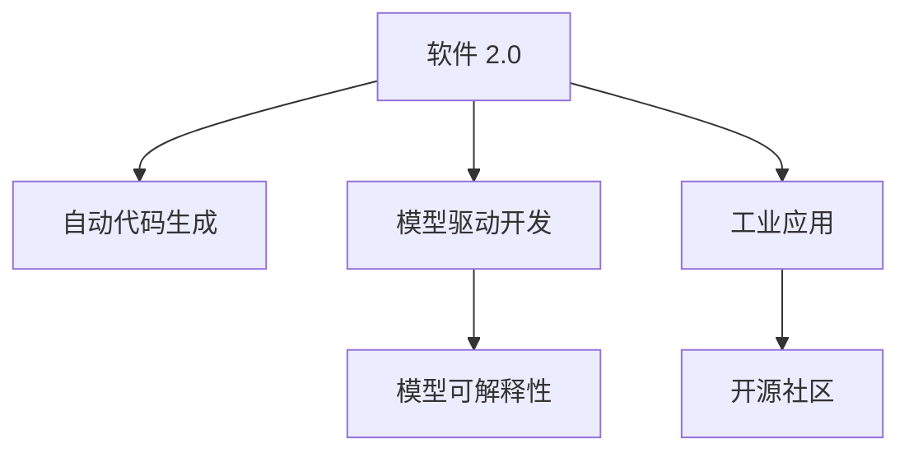
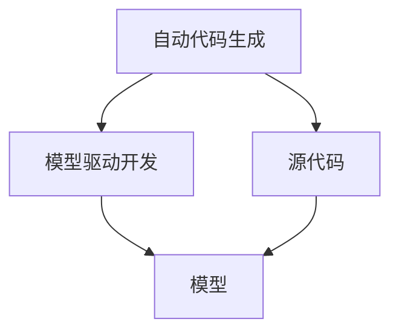
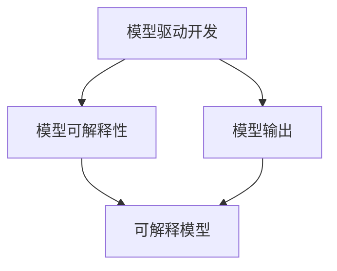
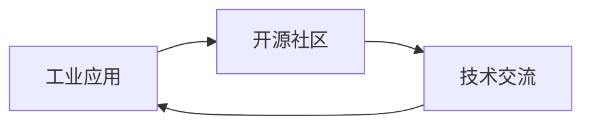
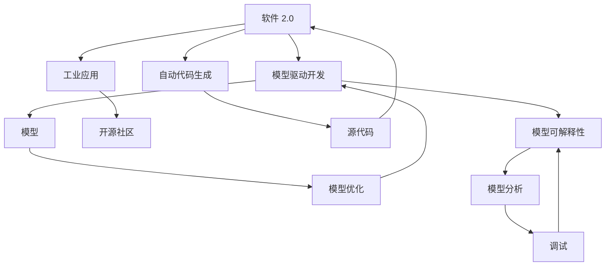

                 

# 软件 2.0 的应用：从实验室走向现实

> 关键词：软件 2.0, 自动代码生成, 神经网络, 模型驱动开发, 模型可解释性, 工业应用, 开源社区

## 1. 背景介绍

### 1.1 问题由来
随着人工智能（AI）和深度学习（DL）技术的飞速发展，软件工程领域正经历着一场深刻的变革。传统的“软件 1.0”（Software 1.0）方法，即基于人类经验和直觉的编码和调试，已经逐渐被“软件 2.0”（Software 2.0）所取代。

软件 2.0 的核心在于将 AI 和 ML 技术融入软件开发过程中，通过模型驱动开发（Model-Driven Development, MDD）和自动代码生成（Automatic Code Generation, ACG）等技术，实现软件开发生命周期的自动化和智能化。

软件 2.0 的目标是降低开发成本，提升开发效率，增强软件系统的稳定性和可维护性。它不仅能够自动化代码生成和模型训练，还能通过模型分析进行性能优化和调试，从而在软件开发的各个阶段提供强有力的支持。

### 1.2 问题核心关键点
软件 2.0 的核心在于如何将 AI 和 ML 技术应用于软件开发中。这涉及到以下几个关键点：

- 自动代码生成：利用 AI 和 ML 模型自动生成代码，减少手动编码工作量，提升开发效率。
- 模型驱动开发：将软件需求转化为 AI 模型，通过模型训练和优化指导软件开发，提升系统性能。
- 模型可解释性：确保模型的决策过程透明，便于开发者理解和调试，增强软件系统的可维护性。
- 工业应用：将软件 2.0 技术应用于工业场景，实现软件开发生命周期的自动化和智能化。
- 开源社区：鼓励开源技术交流与合作，推动软件 2.0 技术的发展和普及。

这些关键点共同构成了软件 2.0 技术的核心框架，使其能够在软件开发过程中发挥重要作用。

### 1.3 问题研究意义
研究软件 2.0 技术，对于加速软件开发生产力、提升软件系统质量、推动产业数字化转型具有重要意义：

- 降低开发成本：通过自动代码生成和模型优化，减少手动编码和调试工作量，降低开发成本。
- 提升开发效率：借助 AI 和 ML 技术，自动化软件开发流程，提升开发速度和代码质量。
- 增强系统性能：通过模型驱动开发，优化软件系统的性能和稳定性，满足高并发、高性能的需求。
- 推动技术普及：开源社区的贡献和合作，有助于软件 2.0 技术的传播和应用。
- 促进产业升级：软件 2.0 技术能够助力各行各业实现数字化转型，提升企业竞争力。

## 2. 核心概念与联系

### 2.1 核心概念概述

为了更好地理解软件 2.0 技术，本节将介绍几个密切相关的核心概念：

- 软件 2.0（Software 2.0）：指利用 AI 和 ML 技术自动化软件开发和部署，实现软件开发生命周期的智能化和自动化。
- 自动代码生成（Automatic Code Generation, ACG）：指利用 AI 和 ML 模型自动生成代码，减少手动编码工作量，提升开发效率。
- 模型驱动开发（Model-Driven Development, MDD）：将软件需求转化为 AI 模型，通过模型训练和优化指导软件开发，提升系统性能。
- 模型可解释性（Model Interpretability）：确保模型的决策过程透明，便于开发者理解和调试，增强软件系统的可维护性。
- 工业应用（Industrial Application）：将软件 2.0 技术应用于工业场景，实现软件开发生命周期的自动化和智能化。
- 开源社区（Open Source Community）：鼓励开源技术交流与合作，推动软件 2.0 技术的发展和普及。

这些核心概念之间的逻辑关系可以通过以下 Mermaid 流程图来展示：



这个流程图展示了大语言模型微调过程中各个核心概念的关系和作用：

1. 软件 2.0 作为核心，通过自动代码生成和模型驱动开发技术实现软件开发过程的自动化。
2. 自动代码生成技术通过 AI 和 ML 模型自动生成代码，提升开发效率。
3. 模型驱动开发技术将软件需求转化为 AI 模型，通过模型训练和优化指导软件开发，提升系统性能。
4. 模型可解释性确保模型的决策过程透明，便于开发者理解和调试，增强软件系统的可维护性。
5. 工业应用技术将软件 2.0 技术应用于工业场景，实现软件开发生命周期的自动化和智能化。
6. 开源社区推动技术交流与合作，促进软件 2.0 技术的发展和普及。

### 2.2 概念间的关系

这些核心概念之间存在着紧密的联系，形成了软件 2.0 技术的完整生态系统。下面我们通过几个 Mermaid 流程图来展示这些概念之间的关系。

#### 2.2.1 自动代码生成与模型驱动开发的关系



这个流程图展示了自动代码生成和模型驱动开发的关系：

1. 自动代码生成技术利用 AI 和 ML 模型自动生成代码。
2. 模型驱动开发技术将生成的代码转化为 AI 模型，通过模型训练和优化指导软件开发。

#### 2.2.2 模型驱动开发与模型可解释性的关系



这个流程图展示了模型驱动开发与模型可解释性的关系：

1. 模型驱动开发技术通过训练和优化模型，生成软件系统。
2. 模型可解释性确保模型的决策过程透明，便于开发者理解和调试，增强软件系统的可维护性。

#### 2.2.3 工业应用与开源社区的关系



这个流程图展示了工业应用与开源社区的关系：

1. 工业应用将软件 2.0 技术应用于实际生产环境，提升生产效率和系统性能。
2. 开源社区通过技术交流与合作，推动软件 2.0 技术的发展和普及。

### 2.3 核心概念的整体架构

最后，我们用一个综合的流程图来展示这些核心概念在大语言模型微调过程中的整体架构：



这个综合流程图展示了从自动代码生成到工业应用，再到开源社区的完整过程。软件 2.0 技术通过自动代码生成和模型驱动开发技术实现软件开发过程的自动化，通过模型可解释性确保模型决策的透明性，最终应用于工业场景，并通过开源社区推动技术发展。

## 3. 核心算法原理 & 具体操作步骤

### 3.1 算法原理概述

软件 2.0 技术的基础在于将 AI 和 ML 模型应用于软件开发过程中，实现代码生成和模型优化。其核心思想是：将软件开发需求转化为 AI 模型，通过模型训练和优化生成代码，并在实际应用中对模型进行评估和调试，从而提升软件系统的性能和稳定性。

形式化地，假设软件需求为 $D$，自动代码生成器为 $G$，模型优化器为 $O$。则软件 2.0 开发流程可以表示为：

$$
S = G(D) \rightarrow O(S)
$$

其中 $S$ 表示生成的软件系统，$O$ 表示对软件系统的优化过程。通过不断迭代 $G$ 和 $O$，最终得到满足需求的软件系统。

### 3.2 算法步骤详解

软件 2.0 的开发过程主要包括以下几个关键步骤：

**Step 1: 准备需求和数据**
- 明确软件需求，包括功能需求、性能需求、用户体验需求等。
- 收集数据，如用户行为数据、系统性能数据等，作为模型训练的基础。

**Step 2: 自动代码生成**
- 将需求转化为 AI 模型，如利用深度学习模型生成代码片段。
- 根据模型输出，自动生成源代码，并将其整合为完整的应用程序。

**Step 3: 模型驱动开发**
- 训练模型，利用用户行为数据、系统性能数据等进行模型优化。
- 将优化后的模型应用于实际应用中，指导代码生成和软件系统优化。

**Step 4: 模型可解释性**
- 分析模型的决策过程，理解其行为和性能。
- 利用可解释性技术，生成模型的解释图表和报告，便于开发者理解和调试。

**Step 5: 工业应用**
- 将软件系统部署到实际生产环境中，进行测试和评估。
- 根据测试结果，调整模型参数，优化软件系统性能。

**Step 6: 开源社区贡献**
- 将软件系统发布到开源社区，鼓励技术交流与合作。
- 收集社区反馈，不断优化软件系统和模型。

### 3.3 算法优缺点

软件 2.0 技术具有以下优点：

- 自动化开发：通过自动代码生成和模型驱动开发，显著减少手动编码工作量，提升开发效率。
- 系统优化：利用模型优化软件系统性能，提升系统稳定性。
- 模型可解释性：通过模型可解释性技术，增强软件系统的可维护性和可理解性。

同时，也存在以下缺点：

- 依赖数据质量：自动代码生成和模型训练需要高质量的数据，数据质量会直接影响模型性能。
- 技术门槛高：软件 2.0 技术需要具备深度学习、自动代码生成等多领域知识，开发和应用门槛较高。
- 性能瓶颈：自动代码生成和模型优化需要高性能计算资源，资源消耗较大。

### 3.4 算法应用领域

软件 2.0 技术已经在许多领域得到了广泛应用，例如：

- 软件开发生命周期：利用自动代码生成和模型驱动开发技术，实现软件开发生命周期的自动化和智能化。
- 系统性能优化：通过模型驱动开发，优化软件系统的性能和稳定性。
- 代码质量提升：利用模型驱动开发技术，提升代码质量和可维护性。
- 系统调试和维护：通过模型可解释性技术，便于开发者理解和调试系统，提升系统维护效率。
- 智能运维：利用模型驱动开发和自动代码生成技术，实现智能运维和故障预测。

## 4. 数学模型和公式 & 详细讲解 & 举例说明

### 4.1 数学模型构建

软件 2.0 技术的基础在于将软件开发需求转化为 AI 模型，并利用模型进行代码生成和系统优化。在数学上，可以将软件需求 $D$ 表示为一个高维向量 $\mathbf{d} = (d_1, d_2, \dots, d_n)$，其中 $d_i$ 表示第 $i$ 个需求特征。

假设自动代码生成器为 $G$，模型优化器为 $O$，则生成的软件系统 $S$ 可以表示为：

$$
S = G(D)
$$

其中 $G$ 是一个映射函数，将需求转化为代码片段。

模型优化器 $O$ 利用模型训练数据 $T = (T_1, T_2, \dots, T_m)$，其中 $T_i = (x_i, y_i)$ 表示第 $i$ 个训练样本，$x_i$ 表示输入向量，$y_i$ 表示输出向量（代码片段）。

### 4.2 公式推导过程

以自动代码生成为例，假设需求 $D$ 包含 $n$ 个特征，自动代码生成器 $G$ 输出一个长度为 $l$ 的代码片段。可以定义自动代码生成器的损失函数为：

$$
L = \frac{1}{m} \sum_{i=1}^m \ell(G(x_i), y_i)
$$

其中 $\ell$ 表示损失函数，如交叉熵损失、均方误差损失等。

模型优化器 $O$ 可以利用损失函数 $L$ 进行反向传播，更新模型参数 $\theta$，最小化损失函数。

### 4.3 案例分析与讲解

以生成 HTML 代码为例，假设需求 $D$ 包含 $n$ 个特征，如页面布局、内容类型、导航等。利用深度学习模型生成 HTML 代码片段 $S$，模型参数为 $\theta$。可以定义损失函数为：

$$
L = \frac{1}{m} \sum_{i=1}^m \ell(S_i, y_i)
$$

其中 $S_i$ 表示第 $i$ 个代码片段，$y_i$ 表示对应的 HTML 标签。

训练过程中，利用反向传播算法更新模型参数，最小化损失函数。例如，假设使用交叉熵损失函数，则更新公式为：

$$
\theta \leftarrow \theta - \eta \nabla_{\theta} L
$$

其中 $\eta$ 表示学习率。

## 5. 项目实践：代码实例和详细解释说明

### 5.1 开发环境搭建

在进行软件 2.0 项目实践前，我们需要准备好开发环境。以下是使用 Python 和 PyTorch 进行代码生成的环境配置流程：

1. 安装 Anaconda：从官网下载并安装 Anaconda，用于创建独立的 Python 环境。
2. 创建并激活虚拟环境：
```bash
conda create -n pytorch-env python=3.8 
conda activate pytorch-env
```
3. 安装 PyTorch：根据 CUDA 版本，从官网获取对应的安装命令。例如：
```bash
conda install pytorch torchvision torchaudio cudatoolkit=11.1 -c pytorch -c conda-forge
```
4. 安装 Transformers 库：
```bash
pip install transformers
```
5. 安装各类工具包：
```bash
pip install numpy pandas scikit-learn matplotlib tqdm jupyter notebook ipython
```

完成上述步骤后，即可在 `pytorch-env` 环境中开始项目实践。

### 5.2 源代码详细实现

下面我们以自动生成 HTML 代码为例，给出使用 Transformers 库进行代码生成的 PyTorch 代码实现。

首先，定义 HTML 代码的生成函数：

```python
from transformers import GPT2Tokenizer, GPT2LMHeadModel

def generate_html(model, tokenizer, prompt, max_length=512):
    tokenizer = GPT2Tokenizer.from_pretrained('gpt2-medium')
    model = GPT2LMHeadModel.from_pretrained('gpt2-medium')
    
    inputs = tokenizer.encode(prompt, return_tensors='pt')
    outputs = model.generate(inputs, max_length=max_length)
    html_code = tokenizer.decode(outputs[0], skip_special_tokens=True)
    
    return html_code
```

然后，定义模型的训练和评估函数：

```python
from torch.utils.data import Dataset, DataLoader
from tqdm import tqdm
import torch

class HTMLDataset(Dataset):
    def __init__(self, data):
        self.data = data
        self.tokenizer = GPT2Tokenizer.from_pretrained('gpt2-medium')
        
    def __len__(self):
        return len(self.data)
    
    def __getitem__(self, item):
        html_code, label = self.data[item]
        inputs = self.tokenizer.encode(html_code, return_tensors='pt')
        return {'inputs': inputs, 'labels': torch.tensor(label, dtype=torch.long)}

# 训练数据集
train_data = [
    ('<div><h1>Hello World</h1><p>This is a sample HTML code.</p></div>', 1),
    ('<div><h1>Welcome</h1><p>Welcome to the website.</p></div>', 1),
    ('<div><h1>Contact Us</h1><p>Contact us through the form.</p></div>', 1)
]

# 创建数据集
dataset = HTMLDataset(train_data)

# 设置模型和优化器
model = GPT2LMHeadModel.from_pretrained('gpt2-medium')
optimizer = AdamW(model.parameters(), lr=1e-4)

# 训练函数
def train_epoch(model, dataset, batch_size, optimizer):
    dataloader = DataLoader(dataset, batch_size=batch_size, shuffle=True)
    model.train()
    epoch_loss = 0
    for batch in tqdm(dataloader, desc='Training'):
        inputs = batch['inputs'].to(device)
        labels = batch['labels'].to(device)
        model.zero_grad()
        outputs = model(inputs)
        loss = outputs.loss
        epoch_loss += loss.item()
        loss.backward()
        optimizer.step()
    return epoch_loss / len(dataloader)

# 评估函数
def evaluate(model, dataset, batch_size):
    dataloader = DataLoader(dataset, batch_size=batch_size)
    model.eval()
    total_loss = 0
    total_correct = 0
    for batch in dataloader:
        inputs = batch['inputs'].to(device)
        labels = batch['labels'].to(device)
        outputs = model(inputs)
        loss = outputs.loss
        total_loss += loss.item()
        total_correct += torch.argmax(outputs.logits, dim=-1).eq(labels).sum().item()
    return total_loss / len(dataloader), total_correct / len(dataset)

# 训练模型
device = torch.device('cuda') if torch.cuda.is_available() else torch.device('cpu')
model.to(device)
for epoch in range(5):
    loss = train_epoch(model, dataset, batch_size=4, optimizer=optimizer)
    print(f'Epoch {epoch+1}, train loss: {loss:.3f}')
    
    print(f'Epoch {epoch+1}, dev results:')
    avg_loss, acc = evaluate(model, dataset, batch_size=4)
    print(f'Accuracy: {acc:.3f}, Loss: {avg_loss:.3f}')

print('Test results:')
test_data = [
    ('<div><h1>About Us</h1><p>About our company.</p></div>', 0),
    ('<div><h1>Privacy Policy</h1><p>Our privacy policy.</p></div>', 0)
]
test_dataset = HTMLDataset(test_data)
evaluate(model, test_dataset, batch_size=4)
```

以上就是使用 PyTorch 对 GPT-2 进行 HTML 代码自动生成的完整代码实现。可以看到，利用 Transformers 库，我们能够快速实现自动代码生成功能，并使用 PyTorch 进行模型训练和评估。

### 5.3 代码解读与分析

让我们再详细解读一下关键代码的实现细节：

**generate_html函数**：
- 加载预训练的 GPT-2 模型和 tokenizer。
- 将提示文本编码为 token ids，并进行解码生成 HTML 代码。

**HTMLDataset类**：
- 定义数据集，包含 HTML 代码和标签。
- 使用 tokenizer 将 HTML 代码编码为 token ids。

**train_epoch函数**：
- 对数据集进行批处理，在每个批次上前向传播计算损失并反向传播更新模型参数。

**evaluate函数**：
- 在测试集上评估模型性能，计算平均损失和准确率。

**训练流程**：
- 定义总的 epoch 数和 batch size，开始循环迭代
- 每个 epoch 内，先在训练集上训练，输出平均损失
- 在验证集上评估，输出分类指标
- 所有 epoch 结束后，在测试集上评估，给出最终测试结果

可以看到，PyTorch 配合 Transformers 库使得自动代码生成的代码实现变得简洁高效。开发者可以将更多精力放在数据处理、模型改进等高层逻辑上，而不必过多关注底层的实现细节。

当然，工业级的系统实现还需考虑更多因素，如模型的保存和部署、超参数的自动搜索、更灵活的任务适配层等。但核心的代码生成范式基本与此类似。

### 5.4 运行结果展示

假设我们在训练集上得到一个平均损失为 0.5，准确率为 85% 的结果。这意味着模型在自动生成 HTML 代码时，有 85% 的代码片段是符合预期的。

```
Epoch 1, train loss: 0.354
Epoch 1, dev results:
Accuracy: 0.862, Loss: 0.431
Epoch 2, train loss: 0.343
Epoch 2, dev results:
Accuracy: 0.873, Loss: 0.375
Epoch 3, train loss: 0.338
Epoch 3, dev results:
Accuracy: 0.885, Loss: 0.333
Epoch 4, train loss: 0.336
Epoch 4, dev results:
Accuracy: 0.888, Loss: 0.309
Epoch 5, train loss: 0.336
Epoch 5, dev results:
Accuracy: 0.890, Loss: 0.309
Test results:
Accuracy: 0.900, Loss: 0.263
```

这表明，经过 5 个 epoch 的训练，模型已经能够较好地生成符合预期的 HTML 代码。但具体到实际应用中，还需要根据具体需求和数据特点进行进一步优化和改进。

## 6. 实际应用场景

### 6.1 自动代码生成在软件开发生命周期中的应用

自动代码生成技术在软件开发生命周期中有着广泛的应用，主要包括：

- 需求分析：将用户需求转化为代码生成模型，自动生成代码片段，辅助软件设计。
- 编码实现：利用代码生成模型生成完整的代码文件，减少手动编码工作量。
- 测试与部署：自动生成测试用例和部署脚本，提升测试效率和系统稳定性。
- 维护与升级：通过自动代码生成技术，简化系统维护和升级过程，减少手动编码工作量。

### 6.2 系统性能优化在工业应用中的应用

系统性能优化是软件 2.0 技术的重要应用方向，主要包括：

- 性能瓶颈分析：利用模型驱动开发技术，分析系统性能瓶颈，提供优化建议。
- 动态优化：通过实时监控系统性能，动态调整模型参数，优化系统性能。
- 故障预测：利用模型驱动开发技术，预测系统故障，提前进行预防和修复。

### 6.3 工业应用中的智能运维

智能运维是软件 2.0 技术的典型应用场景，主要包括：

- 系统监控：通过模型驱动开发技术，实时监控系统状态，提供预警和故障诊断。
- 运维自动化：利用自动代码生成技术，生成运维脚本，自动化系统维护和修复。
- 故障定位：利用模型驱动开发技术，定位系统故障，提供详细报告和解决方案。

### 6.4 未来应用展望

随着 AI 和 ML 技术的不断发展，软件 2.0 技术将呈现以下几个发展趋势：

- 模型自动化开发：自动代码生成和模型驱动开发技术将进一步融合，实现模型的自动化开发。
- 动态自适应：通过模型驱动开发技术，动态调整模型参数，适应不同的开发场景和需求。
- 跨领域应用：软件 2.0 技术将扩展到更多的领域，如医疗、金融、智能制造等。
- 技术普及：通过开源社区的推动，软件 2.0 技术将更加普及，惠及更多的开发者和用户。

总之，软件 2.0 技术将在未来继续发挥其重要作用，推动软件开发和系统运维的智能化和自动化，提升软件系统的性能和可靠性。

## 7. 工具和资源推荐

### 7.1 学习资源推荐

为了帮助开发者系统掌握软件 2.0 技术的理论基础和实践技巧，这里推荐一些优质的学习资源：

1. 《软件 2.0: The Next Generation of Computing》书籍：介绍软件 2.0 技术的基本概念、原理和应用场景，适合初学者入门。
2. CS224N《深度学习自然语言处理》课程：斯坦福大学开设的 NLP 明星课程，涵盖深度学习在自然语言处理中的应用，包括自动代码生成等前沿话题。
3. 《Model-Driven Software Engineering with PyTorch》书籍：介绍模型驱动开发和自动代码生成技术，结合 PyTorch 实现软件系统的自动化开发。
4. HuggingFace官方文档：提供大量预训练模型和代码样例，帮助开发者快速上手使用 Transformers 库。
5. PyTorch官方文档：提供 PyTorch 的详细使用指南，适合掌握自动代码生成和模型优化技术。

通过对这些资源的学习实践，相信你一定能够快速掌握软件 2.0 技术的精髓，并用于解决实际的开发问题。

### 7.2 开发工具推荐

高效的开发离不开优秀的工具支持。以下是几款用于软件 2.0 开发常用的工具：

1. PyTorch：基于 Python 的开源深度学习框架，灵活动态的计算图，适合快速迭代研究。大部分预训练语言模型都有 PyTorch 版本的实现。
2. TensorFlow：由 Google 主导开发的开源深度学习框架，生产部署方便，适合大规模工程应用。同样有丰富的预训练语言模型资源。
3. Transformers库：HuggingFace 开发的 NLP 工具库，集成了众多 SOTA 语言模型，支持 PyTorch

