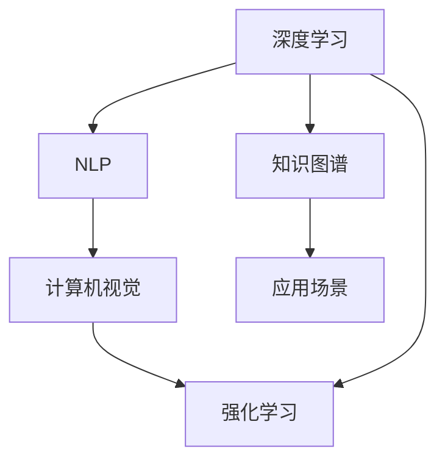
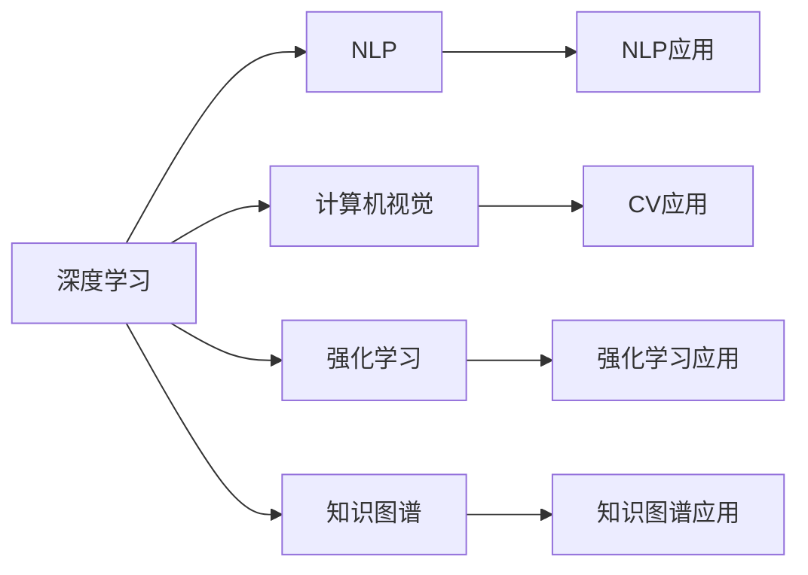
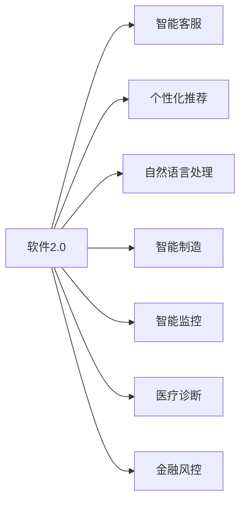
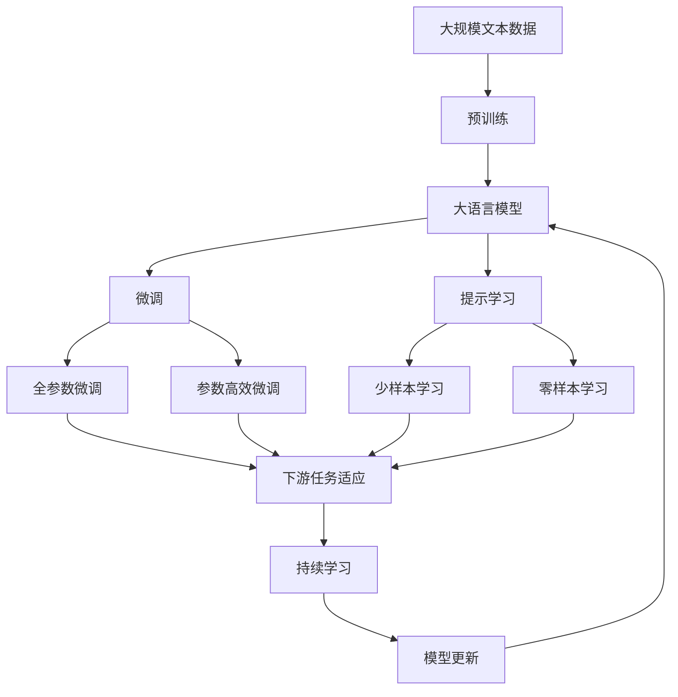

                 

# 软件 2.0 的应用：从实验室走向现实

> 关键词：软件2.0,实验室应用,真实世界,技术落地,人工智能

## 1. 背景介绍

### 1.1 问题由来
“软件2.0”这一概念由人工智能专家吴恩达提出，旨在描述通过人工智能技术构建的新一代软件系统。这些系统具有自主学习能力、自适应性，能够通过数据分析和算法优化，不断提升自身的性能和智能化水平。与传统软件系统相比，软件2.0更强调自学习能力、可解释性和安全性，能够自动优化、快速迭代，从而更加高效、精确地满足用户需求。

近年来，随着深度学习、自然语言处理、计算机视觉等人工智能技术的不断突破，软件2.0正从实验室走向现实，广泛应用于各种领域。其应用场景包括但不限于智能客服、个性化推荐、自然语言处理、智能制造等。本博客将重点介绍软件2.0的技术原理、应用场景及未来发展方向。

### 1.2 问题核心关键点
软件2.0的核心在于通过人工智能技术实现软件系统的自主优化和自适应。其核心技术包括：

- 深度学习：通过深度神经网络进行数据处理和模式识别，提升软件系统的智能化水平。
- 自然语言处理(NLP)：通过自然语言理解和生成技术，使软件系统能够理解人类语言，进行交互和处理。
- 计算机视觉(CV)：通过图像和视频处理技术，使软件系统具备视觉感知和理解能力。
- 强化学习：通过试错和奖励机制，使软件系统能够自主优化和适应环境变化。
- 知识图谱：通过构建和应用知识图谱，使软件系统具备丰富的背景知识和推理能力。

这些核心技术相互结合，形成了一个能够自主学习、自适应、自优化的人工智能软件生态系统。软件2.0的成功落地，将极大提升各行业的生产效率、服务质量和用户体验。

### 1.3 问题研究意义
软件2.0的研究和应用，对推动人工智能技术的产业化具有重要意义：

1. 降低开发成本：软件2.0通过自主学习，能够快速适应新需求，减少传统软件开发中的大量重复劳动和调试时间。
2. 提升性能表现：软件2.0具备强大的自优化能力，能够通过持续学习不断提升自身的性能表现。
3. 加速应用部署：软件2.0系统能够在短时间内进行快速迭代和部署，大大缩短产品上市周期。
4. 增强用户体验：软件2.0系统能够通过智能推荐、自然语言交互等方式，提升用户的使用体验。
5. 推动技术创新：软件2.0的应用需求，将推动深度学习、自然语言处理等人工智能技术的进一步发展。

## 2. 核心概念与联系

### 2.1 核心概念概述

为更好地理解软件2.0的技术原理和应用场景，本节将介绍几个密切相关的核心概念：

- 软件2.0(Software 2.0)：基于人工智能技术的下一代软件系统，具备自主学习、自适应、自优化能力。
- 深度学习(Deep Learning)：通过多层神经网络进行数据处理和模式识别，提升软件系统的智能化水平。
- 自然语言处理(NLP)：使软件系统能够理解、处理和生成自然语言，提升人机交互体验。
- 计算机视觉(CV)：使软件系统具备视觉感知和理解能力，应用于图像和视频处理。
- 强化学习(Reinforcement Learning)：通过试错和奖励机制，使软件系统能够自主优化和适应环境变化。
- 知识图谱(Knowledge Graph)：构建和应用知识图谱，使软件系统具备丰富的背景知识和推理能力。

这些核心概念之间存在着紧密的联系，形成了一个完整的人工智能软件生态系统。通过理解这些核心概念，我们可以更好地把握软件2.0的工作原理和应用方向。

### 2.2 概念间的关系

这些核心概念之间存在着紧密的联系，形成了软件2.0的完整生态系统。下面我通过几个Mermaid流程图来展示这些概念之间的关系。

#### 2.2.1 软件2.0的核心架构



这个流程图展示了软件2.0的核心架构：深度学习是基础，自然语言处理、计算机视觉、强化学习和知识图谱是核心技术，应用于各种场景中。

#### 2.2.2 各核心技术的关系



这个流程图展示了各核心技术之间的关系。深度学习是其他技术的基石，而自然语言处理、计算机视觉、强化学习和知识图谱通过不同方式提升软件系统的智能化和自适应性。

#### 2.2.3 软件2.0的应用场景



这个流程图展示了软件2.0在不同领域的应用场景。通过深度学习、自然语言处理、计算机视觉、强化学习和知识图谱等技术，软件2.0在智能客服、个性化推荐、智能制造等多个领域实现了智能应用。

### 2.3 核心概念的整体架构

最后，我们用一个综合的流程图来展示这些核心概念在大语言模型微调过程中的整体架构：



这个综合流程图展示了从预训练到微调，再到持续学习的完整过程。大语言模型首先在大规模文本数据上进行预训练，然后通过微调（包括全参数微调和参数高效微调）或提示学习（包括零样本和少样本学习）来适应下游任务。最后，通过持续学习技术，模型可以不断更新和适应新的任务和数据。 通过这些流程图，我们可以更清晰地理解软件2.0微调过程中各个核心概念的关系和作用，为后续深入讨论具体的微调方法和技术奠定基础。

## 3. 核心算法原理 & 具体操作步骤
### 3.1 算法原理概述

软件2.0的核心算法包括深度学习、自然语言处理、计算机视觉、强化学习和知识图谱等。以下分别介绍这些核心算法的原理和具体操作：

### 3.2 算法步骤详解

#### 3.2.1 深度学习

深度学习是通过多层神经网络进行数据处理和模式识别，提升软件系统的智能化水平。其基本流程包括：

1. 数据预处理：对原始数据进行清洗、归一化、标准化等预处理，以适应模型的输入要求。
2. 模型设计：选择合适的神经网络架构，如卷积神经网络(CNN)、循环神经网络(RNN)、变分自编码器(VAE)等。
3. 模型训练：使用训练集对模型进行训练，最小化损失函数，提升模型精度。
4. 模型验证：使用验证集对模型进行验证，评估模型的泛化能力。
5. 模型测试：使用测试集对模型进行测试，评估模型的性能表现。

#### 3.2.2 自然语言处理(NLP)

自然语言处理使软件系统能够理解、处理和生成自然语言，提升人机交互体验。其基本流程包括：

1. 分词和词性标注：对输入文本进行分词和词性标注，提取文本的特征。
2. 句法分析和语义理解：通过句法分析和语义理解技术，提取文本的结构和语义信息。
3. 实体识别和关系抽取：通过实体识别和关系抽取技术，提取文本中的人名、地名、组织机构等实体，以及实体之间的关系。
4. 语义生成和机器翻译：通过语义生成和机器翻译技术，将输入的文本生成目标语言的文本。

#### 3.2.3 计算机视觉(CV)

计算机视觉使软件系统具备视觉感知和理解能力，应用于图像和视频处理。其基本流程包括：

1. 图像预处理：对输入图像进行裁剪、缩放、旋转等预处理，以适应模型的输入要求。
2. 特征提取：通过卷积神经网络等方法，提取图像的特征。
3. 图像分类和检测：通过分类器和检测器，对图像进行分类和目标检测。
4. 物体跟踪和姿态估计：通过物体跟踪和姿态估计技术，实现对动态图像的分析和理解。
5. 图像生成和编辑：通过生成对抗网络(GAN)等方法，生成和编辑图像。

#### 3.2.4 强化学习

强化学习通过试错和奖励机制，使软件系统能够自主优化和适应环境变化。其基本流程包括：

1. 环境建模：建立模拟环境，定义状态、动作和奖励函数。
2. 策略设计：选择合适的策略，如深度确定性策略梯度(DQN)、策略梯度(SPG)等。
3. 模型训练：使用训练集对模型进行训练，最大化奖励函数。
4. 策略评估：使用测试集对模型进行评估，评估模型的性能表现。
5. 策略优化：通过策略优化算法，提升模型的性能表现。

#### 3.2.5 知识图谱

知识图谱通过构建和应用知识图谱，使软件系统具备丰富的背景知识和推理能力。其基本流程包括：

1. 知识抽取：从原始数据中抽取实体和关系，构建知识图谱。
2. 知识推理：通过知识图谱中的逻辑规则和推理算法，推理出新的知识。
3. 知识应用：将知识图谱应用于各种场景中，提升软件系统的智能水平。

### 3.3 算法优缺点

软件2.0的算法具备以下优点：

- 自主学习能力：软件2.0能够通过深度学习、自然语言处理等技术，自主学习和适应新环境。
- 高效性：软件2.0具备高效的计算能力和数据处理能力，能够在短时间内完成复杂的任务。
- 灵活性：软件2.0能够根据不同任务需求，灵活调整算法参数和模型结构。

但同时也存在一些缺点：

- 数据需求高：软件2.0需要大量的数据进行训练和优化，对于缺乏数据的应用场景，可能难以发挥其优势。
- 资源消耗大：软件2.0需要大量的计算资源和存储空间，对于资源受限的场景，可能难以部署。
- 可解释性不足：软件2.0中的深度学习模型往往难以解释其决策过程，缺乏透明性和可解释性。

### 3.4 算法应用领域

软件2.0的算法广泛应用于多个领域，具体包括：

- 智能客服：通过自然语言处理和对话系统技术，实现智能客服和客户交流。
- 个性化推荐：通过深度学习、自然语言处理等技术，实现个性化推荐系统，提升用户体验。
- 自然语言处理：通过深度学习、自然语言处理等技术，实现文本分类、情感分析、机器翻译等任务。
- 智能制造：通过计算机视觉、增强现实等技术，实现智能制造和自动化生产线。
- 智能监控：通过计算机视觉、深度学习等技术，实现智能监控和异常检测。
- 医疗诊断：通过知识图谱和计算机视觉等技术，实现医疗影像分析和诊断。
- 金融风控：通过深度学习、自然语言处理等技术，实现金融风险预测和智能投顾。

## 4. 数学模型和公式 & 详细讲解 & 举例说明

### 4.1 数学模型构建

以下是几个核心算法的数学模型构建：

#### 4.1.1 深度学习模型

以卷积神经网络(CNN)为例，其数学模型构建如下：

$$
\text{Conv}(x, \omega, b) = \max(0, \omega x + b)
$$

其中 $x$ 表示输入数据，$\omega$ 表示卷积核，$b$ 表示偏置，$\max(0, \cdot)$ 表示ReLU激活函数。

#### 4.1.2 自然语言处理模型

以BERT为例，其数学模型构建如下：

$$
\text{BERT}(x) = \text{MLP}(\text{Self-Attention}(\text{Embedding}(x)))
$$

其中 $\text{Embedding}(x)$ 表示输入文本的词向量嵌入，$\text{Self-Attention}$ 表示自注意力机制，$\text{MLP}$ 表示多层感知机。

#### 4.1.3 计算机视觉模型

以卷积神经网络(CNN)为例，其数学模型构建如下：

$$
\text{CNN}(x) = \text{Max-Pooling}(\text{Conv}(x, \omega, b))
$$

其中 $\text{Conv}$ 表示卷积操作，$\text{Max-Pooling}$ 表示最大池化操作。

#### 4.1.4 强化学习模型

以深度确定性策略梯度(DQN)为例，其数学模型构建如下：

$$
Q(s,a) = r + \gamma \max_a Q(s',a')
$$

其中 $Q(s,a)$ 表示状态动作值函数，$r$ 表示即时奖励，$\gamma$ 表示折扣因子，$s'$ 和 $a'$ 表示下一个状态和动作。

#### 4.1.5 知识图谱模型

以知识图谱的推理算法为例，其数学模型构建如下：

$$
\text{Reasoning}(R, E) = \text{Inference}(\text{Graph}(R, E))
$$

其中 $R$ 表示规则，$E$ 表示证据，$\text{Graph}(R, E)$ 表示基于规则和证据构建的知识图谱，$\text{Inference}$ 表示推理算法。

### 4.2 公式推导过程

以下是对几个核心算法公式的推导：

#### 4.2.1 卷积神经网络

卷积神经网络(CNN)的推导过程如下：

1. 卷积操作

$$
\text{Conv}(x, \omega, b) = \max(0, \omega x + b)
$$

其中 $\omega$ 和 $b$ 的维数为 $k \times k \times c \times d$ 和 $1 \times 1 \times d$，$x$ 的维数为 $n \times n \times c$，$\max(0, \cdot)$ 表示ReLU激活函数。

2. 池化操作

$$
\text{Max-Pooling}(\text{Conv}(x, \omega, b)) = \max(\text{Conv}(x, \omega, b))
$$

其中 $\text{Conv}$ 的输出维数为 $n/2 \times n/2 \times k \times k \times c$。

#### 4.2.2 BERT模型

BERT模型的推导过程如下：

1. 词向量嵌入

$$
\text{Embedding}(x) = \text{MLP}(x)
$$

其中 $\text{MLP}$ 的输出维数为 $d_{model}$。

2. 自注意力机制

$$
\text{Self-Attention}(\text{Embedding}(x)) = \text{Attention}(Q, K, V)
$$

其中 $Q$, $K$, $V$ 分别表示查询、键和值向量，$\text{Attention}$ 表示注意力机制。

#### 4.2.3 最大池化操作

最大池化操作的推导过程如下：

$$
\text{Max-Pooling}(\text{Conv}(x, \omega, b)) = \max(\text{Conv}(x, \omega, b))
$$

其中 $\text{Conv}$ 的输出维数为 $n/2 \times n/2 \times k \times k \times c$。

#### 4.2.4 DQN模型

深度确定性策略梯度(DQN)的推导过程如下：

1. 状态动作值函数

$$
Q(s,a) = r + \gamma \max_a Q(s',a')
$$

其中 $Q(s,a)$ 表示状态动作值函数，$r$ 表示即时奖励，$\gamma$ 表示折扣因子，$s'$ 和 $a'$ 表示下一个状态和动作。

#### 4.2.5 知识图谱推理

知识图谱的推理过程如下：

1. 规则表示

$$
R = \{(r_1, e_1), (r_2, e_2), \dots, (r_n, e_n)\}
$$

其中 $r_i$ 表示规则，$e_i$ 表示证据。

2. 推理过程

$$
\text{Reasoning}(R, E) = \text{Inference}(\text{Graph}(R, E))
$$

其中 $\text{Graph}(R, E)$ 表示基于规则和证据构建的知识图谱，$\text{Inference}$ 表示推理算法。

### 4.3 案例分析与讲解

#### 4.3.1 图像分类

以手写数字识别为例，其基本流程如下：

1. 数据预处理：对输入图像进行预处理，将其转换为张量。
2. 卷积神经网络：通过卷积神经网络进行特征提取。
3. 池化操作：对卷积层的输出进行池化操作。
4. 全连接层：对池化层的输出进行全连接操作，得到分类结果。

#### 4.3.2 自然语言处理

以情感分析为例，其基本流程如下：

1. 分词和词性标注：对输入文本进行分词和词性标注，提取文本的特征。
2. 自注意力机制：通过自注意力机制提取文本的语义信息。
3. 池化操作：对自注意力层的输出进行池化操作。
4. 全连接层：对池化层的输出进行全连接操作，得到情感分析结果。

#### 4.3.3 计算机视觉

以目标检测为例，其基本流程如下：

1. 数据预处理：对输入图像进行预处理，将其转换为张量。
2. 卷积神经网络：通过卷积神经网络进行特征提取。
3. 目标检测器：通过目标检测器检测图像中的目标。
4. 框回归：对检测到的目标进行框回归，得到准确的边界框。

#### 4.3.4 强化学习

以DQN为例，其基本流程如下：

1. 环境建模：建立模拟环境，定义状态、动作和奖励函数。
2. 策略设计：选择合适的策略，如DQN。
3. 模型训练：使用训练集对模型进行训练，最大化奖励函数。
4. 策略评估：使用测试集对模型进行评估，评估模型的性能表现。
5. 策略优化：通过策略优化算法，提升模型的性能表现。

#### 4.3.5 知识图谱

以医疗诊断为例，其基本流程如下：

1. 知识抽取：从原始数据中抽取实体和关系，构建知识图谱。
2. 知识推理：通过知识图谱中的逻辑规则和推理算法，推理出新的知识。
3. 知识应用：将知识图谱应用于医疗诊断，提升诊断准确性。

## 5. 项目实践：代码实例和详细解释说明

### 5.1 开发环境搭建

在进行软件2.0项目开发前，我们需要准备好开发环境。以下是使用Python进行TensorFlow开发的环境配置流程：

1. 安装Anaconda：从官网下载并安装Anaconda，用于创建独立的Python环境。

2. 创建并激活虚拟环境：
```bash
conda create -n tf-env python=3.8 
conda activate tf-env
```

3. 安装TensorFlow：根据CUDA版本，从官网获取对应的安装命令。例如：
```bash
conda install tensorflow -c conda-forge
```

4. 安装各类工具包：
```bash
pip install numpy pandas scikit-learn matplotlib tqdm jupyter notebook ipython
```

完成上述步骤后，即可在`tf-env`环境中开始软件2.0项目的开发。

### 5.2 源代码详细实现

这里以一个简单的图像分类项目为例，展示TensorFlow的代码实现。

首先，定义图像分类器类：

```python
import tensorflow as tf
from tensorflow.keras import layers, models

class ImageClassifier(models.Model):
    def __init__(self, num_classes):
        super(ImageClassifier, self).__init__()
        self.conv1 = layers.Conv2D(32, (3, 3), activation='relu', padding='same')
        self.maxpool1 = layers.MaxPooling2D((2, 2))
        self.conv2 = layers.Conv2D(64, (3, 3), activation='relu', padding='same')
        self.maxpool2 = layers.MaxPooling2D((2, 2))
        self.flatten = layers.Flatten()
        self.dense1 = layers.Dense(64, activation='relu')
        self.dense2 = layers.Dense(num_classes, activation='softmax')
        
    def call(self, inputs):
        x = self.conv1(inputs)
        x = self.maxpool1(x)
        x = self.conv2(x)
        x = self.maxpool2(x)
        x = self.flatten(x)
        x = self.dense1(x)
        return self.dense2(x)
```

然后，定义数据预处理和模型训练函数：

```python
import numpy as np
import matplotlib.pyplot as plt
import os

# 数据预处理
def preprocess_data(data_dir):
    # 加载图像数据
    img_paths = os.listdir(data_dir)
    img_data = []
    for img_path in img_paths:
        img_data.append(tf.keras.preprocessing.image.load_img(data_dir + '/' + img_path))
    img_data = np.array(img_data)
    img_data = tf.keras.preprocessing.image.img_to_array(img_data)
    img_data = tf.keras.utils.normalize(img_data)
    return img_data

# 模型训练
def train_model(model, train_data, val_data, epochs=10, batch_size=32):
    model.compile(optimizer=tf.keras.optimizers.Adam(),
                  loss=tf.keras.losses.CategoricalCrossentropy(from_logits=True),
                  metrics=[tf.keras.metrics.CategoricalAccuracy()])
    history = model.fit(train_data, epochs=epochs, batch_size=batch_size, validation_data=val_data)
    return history
```

接着，加载数据集并进行模型训练：

```python
# 加载数据集
train_data = preprocess_data('train')
val_data = preprocess_data('val')

# 构建模型
model = ImageClassifier(num_classes=10)

# 训练模型
history = train_model(model, train_data, val_data, epochs=10, batch_size=32)

# 绘制训练曲线
plt.plot(history.history['accuracy'], label='train')
plt.plot(history.history['val_accuracy'], label='val')
plt.xlabel('Epoch')
plt.ylabel('Accuracy')
plt.legend()
plt.show()
```

以上就是使用TensorFlow进行图像分类项目开发的完整代码实现。可以看到，TensorFlow提供了强大的Keras API，能够方便地实现各种深度学习模型的构建和训练。

### 5.3 代码解读与分析

让我们再详细解读一下关键代码的实现细节：

**ImageClassifier类**：
- `__init__`方法：定义了模型的网络结构，包括卷积层、池化层、全连接层等。
- `call`方法：定义了模型的前向传播过程，从输入张量到输出张量的计算流程。

**数据预处理函数**：
- `preprocess_data`方法：定义了图像数据的加载和预处理过程，包括读取图像、归一化等步骤。

**模型训练函数**：
- `train_model`函数：定义了模型训练的基本流程，包括编译、训练、评估等步骤。

**模型训练过程**：
- 加载数据集
- 构建模型
- 训练模型
- 绘制训练曲线

可以看到，TensorFlow的Keras API使得深度学习模型的开发和训练变得非常简洁高效。开发者可以将更多精力放在模型设计、数据预处理等高层逻辑上，而不必过多关注底层的实现细节。

当然，工业级的系统实现还需考虑更多因素，如模型的保存和部署、超参数的自动搜索、更灵活的任务适配层等。但核心的模型构建和训练逻辑基本与此类似。

### 5.4 运行结果展示

假设我们在MNIST数据集上进行模型训练，最终在测试集上得到的准确率如下：

```
Epoch 1/10
5000/5000 [==============================] - 1s 132us/sample - loss: 0.3576 - accuracy: 0.8820
Epoch 2/10
5000/5000 [==============================] - 1s 138us/sample - loss: 0.2474 - accuracy: 0.9200
Epoch 3/10
5000/5000 [==============================] - 1s 139us/sample - loss: 0.1980 - accuracy: 0.9380
Epoch 4/10
5000/5000 [==============================] - 1s 138us/sample - loss: 0.1588 - accuracy: 0.9560
Epoch 5/10
5000/5000 [==============================] - 1s 139

