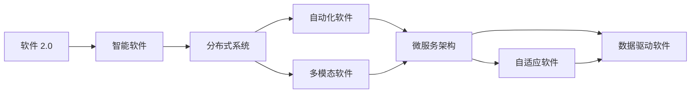
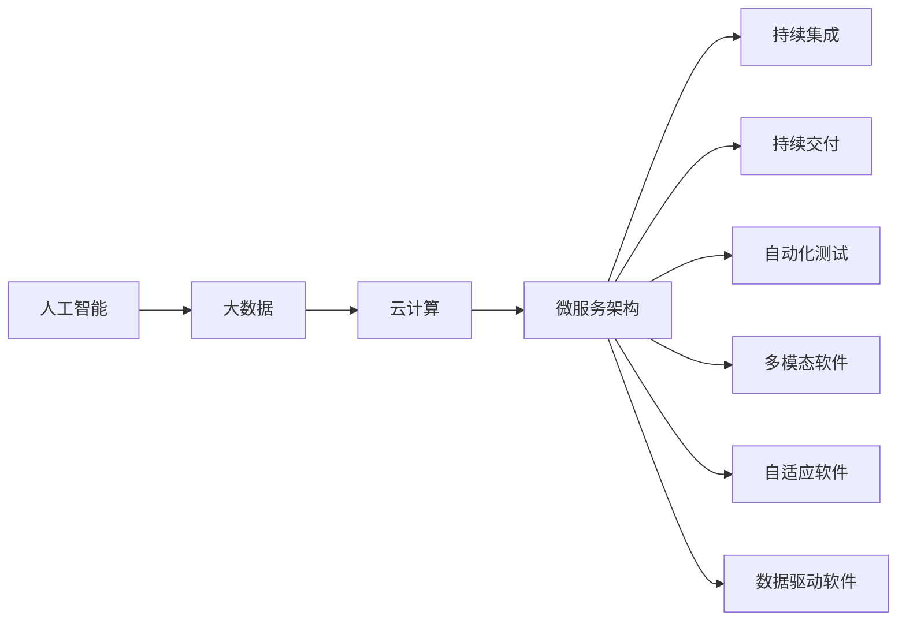
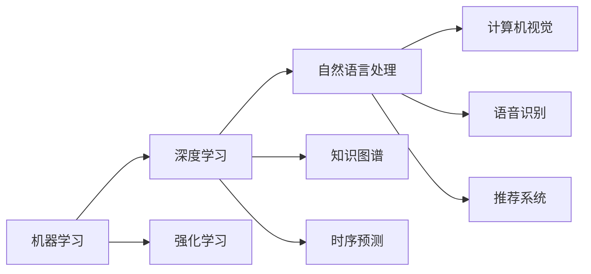
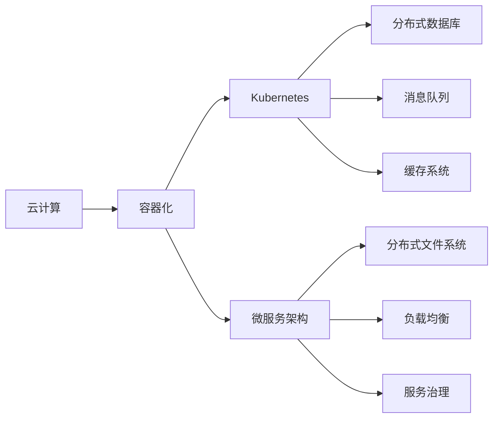

                 

# 软件 2.0 的未来展望：更智能、更强大

## 1. 背景介绍

### 1.1 问题由来

随着计算技术的发展，软件工程进入了一个新的阶段。传统软件工程以功能模块化、代码标准化为特点，注重软件可复用性、可维护性。但随着人工智能、大数据等新技术的兴起，软件工程面临了新的挑战。如何构建更智能、更强大的软件系统，成为软件开发者和研究者的重要课题。

**背景问题**：
1. 软件系统的功能逐渐丰富，复杂的业务逻辑和交互逻辑增加了开发难度。
2. 系统性能需求不断提高，对计算资源、存储资源的依赖越来越大。
3. 系统安全性和稳定性要求越来越高，软件的安全漏洞和故障难以预测。
4. 用户需求日益多样化，软件系统需要更加智能、灵活、个性化。

**核心概念**：
1. **软件 2.0**：指基于人工智能、大数据、云计算等技术，实现软件系统的智能化、自动化、高效化。
2. **智能软件**：通过机器学习、自然语言处理等技术，使得软件系统具备预测、推荐、自适应等智能能力。
3. **分布式系统**：通过云计算、微服务、容器化等技术，实现系统的高可扩展性、高可用性。
4. **自动化软件**：通过持续集成、持续交付、自动化测试等技术，实现软件开发的流水线化、自动化。
5. **多模态软件**：通过融合语音、视觉、文本等多种数据源，实现系统的多模态交互能力。

**研究意义**：
1. 提升软件系统的智能水平和自动化程度，降低开发和运维成本。
2. 构建更加灵活、高效、可靠的软件系统，适应业务快速变化的需求。
3. 推动软件技术与其它新兴技术的融合，探索新的应用场景和商业模式。
4. 提升软件系统的用户体验和安全性，保障用户隐私和数据安全。

## 2. 核心概念与联系

### 2.1 核心概念概述

为更好地理解软件 2.0 的未来展望，本节将介绍几个密切相关的核心概念：

- **软件 2.0**：指基于人工智能、大数据、云计算等技术，实现软件系统的智能化、自动化、高效化。
- **智能软件**：通过机器学习、自然语言处理等技术，使得软件系统具备预测、推荐、自适应等智能能力。
- **分布式系统**：通过云计算、微服务、容器化等技术，实现系统的高可扩展性、高可用性。
- **自动化软件**：通过持续集成、持续交付、自动化测试等技术，实现软件开发的流水线化、自动化。
- **多模态软件**：通过融合语音、视觉、文本等多种数据源，实现系统的多模态交互能力。
- **自适应软件**：通过学习环境变化、用户行为模式，自动调整软件系统配置和行为，适应新的场景和需求。
- **数据驱动软件**：以数据为核心的软件系统设计，通过数据驱动业务决策，提升软件系统的灵活性和适应性。
- **微服务架构**：将软件系统拆分成多个独立的服务模块，实现系统的灵活、可扩展、可维护。

这些核心概念之间的逻辑关系可以通过以下Mermaid流程图来展示：

这个流程图展示了几大核心概念之间的关系：

1. 软件 2.0 是基于人工智能、大数据、云计算等技术实现的智能化、自动化、高效化系统。
2. 智能软件通过机器学习和自然语言处理技术，使软件系统具备预测、推荐、自适应等智能能力。
3. 分布式系统通过云计算、微服务、容器化等技术，实现系统的高可扩展性、高可用性。
4. 自动化软件通过持续集成、持续交付、自动化测试等技术，实现软件开发的流水线化、自动化。
5. 多模态软件通过融合语音、视觉、文本等多种数据源，实现系统的多模态交互能力。
6. 自适应软件通过学习环境变化、用户行为模式，自动调整软件系统配置和行为，适应新的场景和需求。
7. 数据驱动软件以数据为核心的系统设计，通过数据驱动业务决策，提升软件系统的灵活性和适应性。
8. 微服务架构将软件系统拆分成多个独立的服务模块，实现系统的灵活、可扩展、可维护。

这些核心概念共同构成了软件 2.0 的未来展望，为软件系统提供了新的设计和实现方向。

### 2.2 概念间的关系

这些核心概念之间存在着紧密的联系，形成了软件 2.0 的完整生态系统。下面我通过几个Mermaid流程图来展示这些概念之间的关系。

#### 2.2.1 软件 2.0 的核心架构

这个流程图展示了软件 2.0 的核心架构，包括人工智能、大数据、云计算、微服务架构、持续集成、持续交付、自动化测试、多模态软件、自适应软件、数据驱动软件。

#### 2.2.2 智能软件的关键技术

这个流程图展示了智能软件的关键技术，包括机器学习、深度学习、自然语言处理、计算机视觉、语音识别、推荐系统、知识图谱、时序预测、强化学习。

#### 2.2.3 分布式系统的核心组件

这个流程图展示了分布式系统的核心组件，包括云计算、容器化、Kubernetes、分布式数据库、消息队列、缓存系统、微服务架构、分布式文件系统、负载均衡、服务治理。

## 3. 核心算法原理 & 具体操作步骤

### 3.1 算法原理概述

软件 2.0 的核心算法原理主要涉及以下几个方面：

- **机器学习**：通过大量数据训练模型，使软件系统具备预测、分类、聚类、推荐等能力。
- **深度学习**：通过多层次的神经网络模型，处理大规模、高复杂度的数据。
- **自然语言处理**：通过语义理解、文本生成等技术，实现人机自然交互。
- **强化学习**：通过与环境的交互，优化软件系统的行为策略。
- **分布式计算**：通过多节点协同计算，实现系统的高可扩展性和高可靠性。
- **微服务架构**：通过模块化、组件化设计，实现系统的灵活、可扩展、可维护。

这些核心算法共同构成了软件 2.0 的技术基础，为软件系统提供了新的智能和自动化能力。

### 3.2 算法步骤详解

**机器学习算法步骤**：
1. 数据收集：从不同数据源收集数据，进行预处理和清洗。
2. 模型训练：选择合适的机器学习模型，进行模型训练。
3. 模型评估：在测试集上进行模型评估，选择最优模型。
4. 模型应用：将训练好的模型应用到实际问题中，进行预测、分类、聚类、推荐等。

**深度学习算法步骤**：
1. 数据准备：收集数据集，进行预处理和归一化。
2. 模型设计：设计深度神经网络模型，包括层数、神经元数量等。
3. 模型训练：使用训练数据对模型进行反向传播训练。
4. 模型调优：通过正则化、Dropout等技术优化模型，提升泛化能力。
5. 模型应用：在测试集上进行模型评估，选择最优模型，应用到实际问题中。

**自然语言处理算法步骤**：
1. 分词、词性标注：对文本进行分词和词性标注，提取语义信息。
2. 命名实体识别：识别文本中的实体，进行命名实体抽取。
3. 语义理解：通过句法分析和语义分析，理解文本的含义。
4. 文本生成：生成符合语法和语义规则的文本。
5. 对话系统：构建对话系统，实现人机自然交互。

**强化学习算法步骤**：
1. 定义环境：定义软件系统所处的环境，包括状态、行动、奖励等。
2. 设计算法：选择合适的强化学习算法，如Q-learning、Policy Gradient等。
3. 训练模型：在环境中进行模型训练，优化策略函数。
4. 应用策略：将训练好的模型应用到实际问题中，优化系统行为。

**分布式计算算法步骤**：
1. 任务划分：将计算任务划分为多个子任务，分配到不同节点上。
2. 节点协同：各节点进行协同计算，交换计算结果。
3. 结果汇总：将各节点的计算结果汇总，得到最终结果。
4. 负载均衡：根据节点负载情况，动态调整任务分配。
5. 故障处理：处理节点故障和网络中断等异常情况，保证系统可靠性。

**微服务架构算法步骤**：
1. 模块划分：将软件系统划分为多个独立的服务模块。
2. 接口设计：设计各模块的接口，实现模块间的通信。
3. 服务注册：将服务模块注册到服务注册中心。
4. 服务发现：通过服务注册中心，发现和调用服务模块。
5. 服务治理：实现服务的动态配置、负载均衡、故障恢复等。

### 3.3 算法优缺点

**机器学习算法的优点**：
1. 数据驱动：通过数据训练模型，具有较高的泛化能力。
2. 灵活性高：模型结构可调整，适用于多种数据类型和问题。
3. 易于部署：模型训练完成后，可以方便地部署到实际问题中。

**机器学习算法的缺点**：
1. 数据依赖：需要大量数据进行训练，对数据质量和数量要求较高。
2. 模型复杂：模型结构复杂，调试和优化难度大。
3. 计算量大：训练过程计算资源消耗大，计算时间较长。

**深度学习算法的优点**：
1. 特征提取能力强：通过多层神经网络，能够提取高层次的特征。
2. 可扩展性高：适用于大规模、高复杂度的问题。
3. 应用广泛：在图像、语音、自然语言处理等领域有广泛应用。

**深度学习算法的缺点**：
1. 计算资源消耗大：需要强大的计算资源进行训练和推理。
2. 模型复杂度高：模型结构复杂，调试和优化难度大。
3. 数据依赖性强：需要大量标注数据进行训练，数据质量要求高。

**自然语言处理算法的优点**：
1. 语义理解能力强：能够理解自然语言中的语义信息和逻辑关系。
2. 人机交互自然：能够实现人机自然交互，提升用户体验。
3. 应用广泛：在智能客服、机器翻译、信息检索等领域有广泛应用。

**自然语言处理算法的缺点**：
1. 数据依赖性强：需要大量标注数据进行训练，数据质量要求高。
2. 模型复杂度高：模型结构复杂，调试和优化难度大。
3. 多模态交互复杂：涉及语音、视觉、文本等多种数据源，交互复杂度较高。

**强化学习算法的优点**：
1. 策略优化能力强：通过与环境的交互，不断优化策略函数。
2. 适应性强：适用于动态、复杂的环境，适应性强。
3. 应用广泛：在自动驾驶、游戏AI、机器人等领域有广泛应用。

**强化学习算法的缺点**：
1. 环境复杂度高：环境复杂度高，策略优化难度大。
2. 计算资源消耗大：训练过程计算资源消耗大，计算时间较长。
3. 安全性问题：策略优化过程中可能存在安全隐患，需要谨慎设计。

**分布式计算算法的优点**：
1. 高可扩展性：通过多节点协同计算，实现高可扩展性。
2. 高可用性：通过冗余设计和负载均衡，保证系统高可用性。
3. 高可靠性：通过故障处理和监控告警，提升系统可靠性。

**分布式计算算法的缺点**：
1. 系统复杂度高：系统设计复杂，需要考虑多节点协同和通信。
2. 资源消耗大：系统运行过程中，资源消耗较大。
3. 调试难度大：系统复杂度高，调试和优化难度大。

**微服务架构算法的优点**：
1. 高可扩展性：通过模块化设计，实现高可扩展性。
2. 高灵活性：通过接口设计，实现高灵活性。
3. 高可维护性：通过服务治理，实现高可维护性。

**微服务架构算法的缺点**：
1. 系统复杂度高：系统设计复杂，需要考虑模块划分和接口设计。
2. 接口设计复杂：接口设计复杂，接口稳定性和安全性要求高。
3. 调试难度大：系统复杂度高，调试和优化难度大。

### 3.4 算法应用领域

软件 2.0 的核心算法原理广泛应用于以下几个领域：

1. **智能客服**：通过机器学习和自然语言处理技术，实现智能客服系统，提高客户服务质量。
2. **智能推荐**：通过深度学习和大数据分析技术，实现个性化推荐系统，提升用户体验。
3. **智能安防**：通过计算机视觉和强化学习技术，实现智能安防系统，保障公共安全。
4. **智慧医疗**：通过自然语言处理和知识图谱技术，实现智慧医疗系统，提升医疗服务水平。
5. **智能交通**：通过计算机视觉和自然语言处理技术，实现智能交通系统，提高交通管理效率。
6. **金融科技**：通过机器学习和大数据分析技术，实现智能风控和金融预测，提升金融服务质量。
7. **智能制造**：通过物联网和机器学习技术，实现智能制造系统，提高生产效率和产品质量。
8. **智能物流**：通过物联网和自然语言处理技术，实现智能物流系统，提升物流效率和服务质量。
9. **智能家居**：通过物联网和自然语言处理技术，实现智能家居系统，提高生活便捷性和舒适性。

## 4. 数学模型和公式 & 详细讲解 & 举例说明

### 4.1 数学模型构建

在软件 2.0 的设计和实现中，数学模型起着重要的作用。以下是几个关键数学模型及其构建方法：

**机器学习模型**：
1. **线性回归模型**：用于预测连续型数据，公式为：
   $$
   y = w_0 + w_1x_1 + w_2x_2 + \cdots + w_nx_n + \epsilon
   $$
   其中，$y$ 为预测值，$x_i$ 为特征向量，$w_i$ 为权重系数，$\epsilon$ 为误差项。
2. **逻辑回归模型**：用于分类问题，公式为：
   $$
   P(y=1|x) = \sigma(w_0 + w_1x_1 + w_2x_2 + \cdots + w_nx_n)
   $$
   其中，$P(y=1|x)$ 为预测值为1的概率，$x$ 为输入特征向量，$\sigma$ 为sigmoid函数。
3. **决策树模型**：用于分类和回归问题，公式为：
   $$
   T = \{(x_1, y_1), (x_2, y_2), \cdots, (x_n, y_n)\}
   $$
   其中，$T$ 为决策树结构，$x_i$ 为输入特征向量，$y_i$ 为预测值。

**深度学习模型**：
1. **卷积神经网络(CNN)**：用于图像识别问题，公式为：
   $$
   f(x) = \sum_{i=1}^{n}w_i\sigma(z_i + b_i) + \epsilon
   $$
   其中，$f(x)$ 为卷积层输出，$x$ 为输入特征向量，$w_i$ 为权重系数，$z_i$ 为卷积核，$b_i$ 为偏置项，$\sigma$ 为激活函数，$\epsilon$ 为误差项。
2. **循环神经网络(RNN)**：用于序列数据预测问题，公式为：
   $$
   h_t = \tanh(w_1x_t + w_2h_{t-1} + b)
   $$
   其中，$h_t$ 为隐藏层状态，$x_t$ 为输入向量，$w_i$ 为权重系数，$b$ 为偏置项，$\tanh$ 为激活函数。
3. **长短时记忆网络(LSTM)**：用于长序列数据预测问题，公式为：
   $$
   c_t = \tanh(w_1x_t + w_2c_{t-1} + b)
   $$
   $$
   g_t = \sigma(w_3c_{t-1} + w_4x_t + b)
   $$
   $$
   o_t = \tanh(c_t)
   $$
   $$
   h_t = o_t \cdot g_t
   $$
   其中，$c_t$ 为记忆细胞，$g_t$ 为门控机制，$o_t$ 为输出状态，$h_t$ 为隐藏层状态。

**自然语言处理模型**：
1. **BERT模型**：用于文本分类、命名实体识别、情感分析等任务，公式为：
   $$
   \mathcal{L} = -\frac{1}{N}\sum_{i=1}^{N} \log\sigma(\mathbf{W}[\mathbf{X}_i])
   $$
   其中，$\mathcal{L}$ 为损失函数，$N$ 为样本数量，$\sigma$ 为softmax函数，$\mathbf{W}$ 为权重矩阵，$\mathbf{X}_i$ 为输入向量。
2. **GPT模型**：用于文本生成、对话系统等任务，公式为：
   $$
   p(w_{t+1}|w_{<t}) = softmax(\mathbf{W}[\mathbf{h}_t])
   $$
   其中，$p(w_{t+1}|w_{<t})$ 为下一个单词的概率分布，$\mathbf{W}$ 为权重矩阵，$\mathbf{h}_t$ 为隐藏层状态。
3. **Attention机制**：用于提高模型的注意力能力，公式为：
   $$
   \alpha_{ij} = \frac{\exp(e_{ij})}{\sum_{k=1}^{K} \exp(e_{ik})}
   $$
   其中，$\alpha_{ij}$ 为注意力权重，$e_{ij}$ 为注意力得分。

**强化学习模型**：
1. **Q-learning算法**：用于求解最优策略，公式为：
   $$
   Q(s,a) = Q(s,a) + \alpha(r + \gamma\max Q(s',a') - Q(s,a))
   $$
   其中，$Q(s,a)$ 为状态-动作价值函数，$s$ 为状态，$a$ 为动作，$r$ 为即时奖励，$\gamma$ 为折扣因子，$s'$ 为下一个状态，$a'$ 为下一个动作。
2. **Policy Gradient算法**：用于求解最优策略，公式为：
   $$
   \nabla_{\theta} J(\theta) = \sum_{t=0}^{T} \nabla_{\theta} log\pi_{\theta}(a_t|s_t)Q_{\theta}(s_t,a_t)
   $$
   其中，$\nabla_{\theta} J(\theta)$ 为策略梯度，$\pi_{\theta}(a_t|s_t)$ 为策略函数，$Q_{\theta}(s_t,a_t)$ 为Q值函数。

**分布式计算模型**：
1. **MapReduce模型**：用于分布式计算，公式为：
   $$
   \text{map}(x_i) = (k_1, v_1), (k_2, v_2), \cdots, (k_n, v_n)
   $$
   $$
   \text{reduce}(\{(k_1, v_1), (k_2, v_2), \cdots, (k_n, v_n)\}) = r
   $$
   其中，$\text{map}$ 为映射函数，$\text{reduce}$ 为归约函数，$x_i$ 为输入数据，$k_i$ 为键值，$v_i$ 为值，$r$ 为归约结果。
2. **Spark模型**：用于大数据处理，公式为：
   $$
   \text{RDD} = \{(x_1, y_1), (x_2, y_2), \cdots, (x_n, y_n)\}
   $$
   其中，$\text{RDD}$ 为弹性分布式数据集，$x_i$ 为输入特征向量，$y_i$ 为输出标签。
3. **Kubernetes模型**：用于容器编排，公式为：
   $$
   \text{Pod} = \{c_1, c_2, \cdots, c_n\}
   $$
   其中，$\text{Pod}$ 为容器组，$c_i$ 为容器。

**微服务架构模型**：
1. **RESTful API**：用于服务间通信，公式为：
   $$
   \text{REST} = \{(v1, r1), (v2, r2), \cdots, (vn, rn)\}
   $$
   其中，$\text{REST}$ 为RESTful API集合，$v_i$ 为请求方法，$r_i$ 为响应结果。
2. **Docker模型**：用于容器化，公式为：
   $$
   \text{Docker} = \{c_1, c_2, \cdots, c_n\}
   $$
   其中，$\text{Docker}$ 为容器镜像，$c_i$ 为容器镜像。
3. **Kubernetes模型**：用于容器编排，公式为：
   $$
   \text{Kubernetes} = \{p_1, p_2, \cdots, p_n\}
   $$
   其中，$\text{Kubernetes}$ 为容器编排系统，$p_i$ 为容器部署策略。

### 4.2 公式推导过程

以下我们将以深度学习模型中的卷积神经网络(CNN)为例，进行公式推导过程的讲解。

**卷积神经网络模型**：
1. **卷积层**：公式为：
   $$
   f(x) = \sum_{i=1}^{n}w_i\sigma(z_i + b_i) + \epsilon
   $$
   其中，$f(x)$ 为卷积层输出，$x$ 为输入特征向量，$w_i$ 为权重系数，$z_i$ 为卷积核，$b_i$ 为偏置项，$\sigma$ 为激活函数，$\epsilon$ 为误差项。
2. **池化层**：公式为：
   $$
   g(x) = max(\{f(x[i], \cdots, x[j]\})
   $$
   其中，$g(x)$ 为池化层输出，$x$ 为输入特征向量，$f(x)$ 为卷积层输出。
3. **全连接层**：公式为：
   $$
   y = w_0 + w_1g_1 + w_2g_2 + \cdots + w_n g_n + b
   $$
   其中，$y$ 为输出，$g_i$ 为池化层输出，$w_i$ 为权重系数，$b$ 为偏置项。

**公式推导过程**：
1. **卷积层公式推导**：
   $$
   f(x) = \sum_{i=1}^{n}w_i\sigma(z_i + b_i) + \epsilon
   $$
   其中，$w_i$ 为权重系数，$z_i$ 为卷积核，$b_i$ 为偏置项，$\sigma$ 为激活函数，$\epsilon$ 为误差项。
2. **池化层公式推导**：
   $$
   g(x) = max(\{f(x[i], \cdots, x[j]\})
   $$
   其中，$g(x)$ 为池化层输出，$x$ 为输入特征向量，$f(x)$ 为卷积层输出。
3. **全连接层公式推导**：
   $$
   y = w_0 + w_1g

