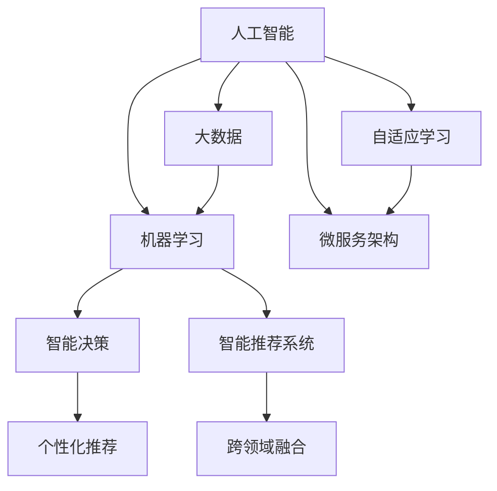

                 

# 软件 2.0 的未来展望：更智能、更强大

在信息时代，软件从最初单一的功能实现，逐步进化为具有丰富交互性、智能决策能力的大型系统。伴随着人工智能、大数据、云计算等前沿技术的不断突破，软件 2.0 正在引领我们进入一个全新的时代。本文将探讨软件 2.0 的未来展望，包括更智能、更强大的关键方向与实践路径，旨在为未来的技术发展提供一些深刻的见解。

## 1. 背景介绍

### 1.1 软件 1.0 到 2.0 的演变

在软件发展的早期，程序员们编写代码，运行程序，实现功能。软件 1.0 时代以功能为中心，强调编码效率与运行稳定性。然而，随着互联网的兴起和数据的激增，传统软件已经无法适应复杂多变的业务需求。此时，软件 2.0 应运而生。

软件 2.0 强调数据驱动与智能决策，利用大数据与人工智能技术，构建自适应、智能化的系统。通过从海量数据中挖掘出价值，并结合机器学习算法，软件 2.0 能够自主优化、自我迭代，从而不断提升其智能化水平。

### 1.2 软件 2.0 的核心价值

软件 2.0 的核心价值在于其智能性和适应性，具体体现在以下几个方面：

- **数据驱动**：利用大数据分析用户行为，预测未来需求，提供精准的服务。
- **智能决策**：运用机器学习算法，实现自动化的决策过程，提高系统响应速度。
- **自适应学习**：通过在线学习与调整，软件能够根据环境变化，持续优化其性能。
- **个性化推荐**：分析用户偏好，实现个性化内容推荐，提升用户体验。
- **跨领域融合**：与语音、图像、自然语言处理等技术结合，构建多模态智能系统。

## 2. 核心概念与联系

### 2.1 核心概念概述

为了更好地理解软件 2.0 的未来展望，我们将从以下几个核心概念入手：

- **人工智能**：利用算法、模型，使机器能够模拟、扩展人类智能，实现自动化决策。
- **机器学习**：通过数据训练模型，使机器能够从经验中学习，自主优化性能。
- **大数据**：指海量、多样、实时化的数据，是实现智能决策的基础。
- **云计算**：通过分布式计算与存储，支持大规模数据处理与智能应用。
- **微服务架构**：将复杂系统拆分为多个小服务，实现独立部署、灵活扩展。
- **分布式系统**：通过多节点协同工作，提供高可靠性、高可扩展性服务。
- **区块链**：通过去中心化的共识机制，确保数据的安全性、透明性。

### 2.2 核心概念的联系

这些核心概念之间存在着紧密的联系，共同构成了软件 2.0 的生态系统。以下是一些关键联系的图示：



这个图展示了人工智能、机器学习、大数据、云计算、微服务架构、分布式系统和区块链之间的联系与作用。例如，大数据为人工智能提供了数据支撑，人工智能则为智能决策提供了算法基础；微服务架构和分布式系统则支持了大规模应用的部署和扩展。

## 3. 核心算法原理 & 具体操作步骤

### 3.1 算法原理概述

软件 2.0 的算法原理主要基于人工智能和机器学习，通过构建智能模型，从数据中提取知识，实现智能决策。以下是一些关键算法原理：

- **监督学习**：通过标注数据训练模型，实现分类、回归等任务。
- **无监督学习**：通过未标注数据学习模型，实现聚类、降维等任务。
- **强化学习**：通过奖励机制指导模型学习，实现自动化决策。
- **深度学习**：利用多层神经网络，学习数据的复杂表示，提升模型性能。
- **迁移学习**：将一个任务学到的知识迁移到另一个任务，提升学习效率。
- **强化学习**：通过奖励机制指导模型学习，实现自动化决策。
- **生成对抗网络**：通过对抗性训练，生成高质量数据，增强模型的泛化能力。
- **因果推理**：通过建立因果关系，提升模型的解释性与可靠性。

### 3.2 算法步骤详解

软件 2.0 的算法步骤通常包括以下几个关键步骤：

1. **数据准备**：收集、清洗、预处理数据，构建训练集和测试集。
2. **模型选择**：根据任务需求，选择适合的算法模型。
3. **模型训练**：使用训练集训练模型，调整超参数，优化模型性能。
4. **模型评估**：使用测试集评估模型性能，选择最优模型。
5. **模型部署**：将模型部署到生产环境，进行实时推理。
6. **模型监控**：实时监控模型运行状态，进行动态调整。

以一个智能推荐系统的开发为例，具体的算法步骤如下：

1. **数据准备**：收集用户行为数据、物品信息数据，构建训练集和测试集。
2. **模型选择**：选择协同过滤、内容推荐等算法模型。
3. **模型训练**：使用训练集训练模型，调整超参数，优化推荐效果。
4. **模型评估**：使用测试集评估推荐效果，选择最优模型。
5. **模型部署**：将模型部署到推荐系统中，实时推送推荐内容。
6. **模型监控**：实时监控推荐系统运行状态，动态调整模型参数。

### 3.3 算法优缺点

软件 2.0 的算法具有以下优点：

- **自动化决策**：能够根据数据自主优化决策过程，提升系统响应速度。
- **泛化能力强**：通过迁移学习和生成对抗网络，模型能够适应多样化的数据分布。
- **自适应学习**：能够在线学习与调整，持续优化模型性能。
- **高灵活性**：通过微服务架构和分布式系统，实现系统的高灵活性与可扩展性。

然而，这些算法也存在一些缺点：

- **数据依赖**：依赖大量标注数据，获取高质量数据的成本较高。
- **模型复杂**：深度学习模型通常结构复杂，训练和推理开销较大。
- **过拟合风险**：模型容易过拟合，需要适当的正则化措施。
- **计算资源需求高**：需要高性能计算资源支持大规模数据处理与模型训练。

### 3.4 算法应用领域

软件 2.0 的算法在多个领域都得到了广泛应用，具体包括：

- **自然语言处理**：智能问答、机器翻译、情感分析、文本生成等。
- **图像识别**：图像分类、目标检测、图像分割、图像生成等。
- **语音识别**：语音识别、语音合成、语音情感分析等。
- **推荐系统**：个性化推荐、智能广告投放等。
- **医疗健康**：疾病诊断、医疗咨询、智能手术等。
- **智能交通**：自动驾驶、交通管理、车辆维护等。
- **金融服务**：信用评分、风险管理、智能投顾等。

## 4. 数学模型和公式 & 详细讲解

### 4.1 数学模型构建

软件 2.0 的数学模型主要基于统计学、优化理论和机器学习算法，用于构建智能决策模型。以下是一些常见数学模型的构建过程：

- **线性回归**：用于回归问题，模型为 $y = \theta^T X + \epsilon$，其中 $X$ 为输入特征，$\theta$ 为模型参数，$\epsilon$ 为误差项。
- **逻辑回归**：用于二分类问题，模型为 $\log \frac{P(y=1)}{P(y=0)} = \theta^T X$，其中 $X$ 为输入特征，$\theta$ 为模型参数。
- **支持向量机**：用于分类和回归问题，模型为 $\arg\min_{\alpha, \theta} \frac{1}{2} \|\theta\|^2 + C \sum_{i=1}^n \xi_i$，其中 $\theta$ 为模型参数，$\xi_i$ 为松弛变量，$C$ 为正则化参数。
- **神经网络**：用于处理复杂非线性问题，模型为 $\theta = \sum_{i=1}^n w_i f(x_i) + b$，其中 $w_i$ 为权重，$f(x_i)$ 为激活函数，$b$ 为偏置。
- **深度学习模型**：如卷积神经网络（CNN）、循环神经网络（RNN）等，用于图像识别、自然语言处理等任务。

### 4.2 公式推导过程

以线性回归模型为例，推导其最小二乘法的优化过程：

假设模型为 $y = \theta^T X + \epsilon$，其中 $y$ 为输出，$\theta$ 为模型参数，$X$ 为输入特征，$\epsilon$ 为误差项。目标是最小化均方误差损失函数 $\frac{1}{2}\sum_{i=1}^n (y_i - \hat{y}_i)^2$，其中 $\hat{y}_i = \theta^T X_i$。

最小化损失函数的优化目标为：
$$
\min_{\theta} \frac{1}{2}\sum_{i=1}^n (y_i - \hat{y}_i)^2
$$

利用梯度下降法，对上述目标函数求偏导数：
$$
\frac{\partial}{\partial \theta} \frac{1}{2}\sum_{i=1}^n (y_i - \hat{y}_i)^2 = -X^T (y - \hat{y})
$$

令梯度为零，得到参数更新公式：
$$
\theta \leftarrow \theta - \eta X^T (y - \hat{y})
$$

其中 $\eta$ 为学习率。通过不断迭代更新参数 $\theta$，使得模型能够拟合训练集数据。

### 4.3 案例分析与讲解

以一个智能推荐系统为例，分析其数学模型构建和推导过程：

假设推荐系统模型为 $P(x|y) = \theta^T x$，其中 $x$ 为用户行为数据，$y$ 为用户兴趣标签，$\theta$ 为模型参数。目标是最小化交叉熵损失函数 $-\frac{1}{N}\sum_{i=1}^N \sum_{j=1}^k y_{ij} \log \hat{y}_{ij}$，其中 $y_{ij}$ 为第 $i$ 个用户对第 $j$ 个物品的兴趣标签，$\hat{y}_{ij}$ 为模型预测的用户兴趣标签。

最小化损失函数的优化目标为：
$$
\min_{\theta} -\frac{1}{N}\sum_{i=1}^N \sum_{j=1}^k y_{ij} \log \hat{y}_{ij}
$$

利用梯度下降法，对上述目标函数求偏导数：
$$
\frac{\partial}{\partial \theta} -\frac{1}{N}\sum_{i=1}^N \sum_{j=1}^k y_{ij} \log \hat{y}_{ij} = -\frac{1}{N}\sum_{i=1}^N \sum_{j=1}^k y_{ij} \frac{x_{ij}}{\hat{y}_{ij}}
$$

令梯度为零，得到参数更新公式：
$$
\theta \leftarrow \theta - \eta \frac{1}{N}\sum_{i=1}^N \sum_{j=1}^k y_{ij} \frac{x_{ij}}{\hat{y}_{ij}}
$$

其中 $\eta$ 为学习率。通过不断迭代更新参数 $\theta$，使得推荐系统能够学习用户的兴趣，预测推荐物品。

## 5. 项目实践：代码实例和详细解释说明

### 5.1 开发环境搭建

为了构建智能推荐系统，我们需要准备以下几个开发环境：

1. 安装 Python 3.8 及以上版本。
2. 安装必要的依赖包，如 NumPy、Pandas、Scikit-learn、TensorFlow、Keras 等。
3. 安装 Git、Docker、Kubernetes 等工具，以便进行版本控制和容器化部署。

### 5.2 源代码详细实现

以下是智能推荐系统的 Python 代码实现，包括数据预处理、模型训练、模型评估和模型部署：

```python
import numpy as np
import pandas as pd
from sklearn.model_selection import train_test_split
from sklearn.metrics import accuracy_score
from sklearn.linear_model import LogisticRegression
from sklearn.preprocessing import StandardScaler

# 数据预处理
data = pd.read_csv('user_behavior.csv')
features = ['feature1', 'feature2', 'feature3']
labels = 'interest_label'
X = data[features]
y = data[labels]
X_train, X_test, y_train, y_test = train_test_split(X, y, test_size=0.2, random_state=42)

# 标准化数据
scaler = StandardScaler()
X_train = scaler.fit_transform(X_train)
X_test = scaler.transform(X_test)

# 模型训练
model = LogisticRegression()
model.fit(X_train, y_train)

# 模型评估
y_pred = model.predict(X_test)
accuracy = accuracy_score(y_test, y_pred)
print('Accuracy:', accuracy)

# 模型部署
# 将模型保存为文件
import pickle
with open('model.pkl', 'wb') as f:
    pickle.dump(model, f)

# 启动推荐服务
import flask
app = flask.Flask(__name__)
@app.route('/recommend')
def recommend():
    # 获取用户行为数据
    user_behavior = request.get_json()
    X_new = scaler.transform([user_behavior])
    y_new = model.predict(X_new)
    # 返回推荐结果
    return {'item': y_new[0]}

if __name__ == '__main__':
    app.run(host='0.0.0.0', port=5000)
```

### 5.3 代码解读与分析

该代码实现了智能推荐系统的核心功能：

1. **数据预处理**：使用 Pandas 和 Scikit-learn 库，进行数据读取、分割、标准化等操作。标准化数据有助于提升模型训练效果。
2. **模型训练**：使用 Scikit-learn 库的 Logistic Regression 模型，进行模型训练。
3. **模型评估**：使用 Scikit-learn 库的 accuracy_score 函数，评估模型的准确率。
4. **模型部署**：使用 Flask 库，搭建推荐服务，接受用户行为数据，返回推荐结果。

代码中的关键点包括：

- 数据预处理的技巧：标准化、分割、特征选择等。
- 模型训练的策略：选择合适的模型，调整超参数，优化模型性能。
- 模型评估的指标：准确率、召回率、F1-score 等。
- 模型部署的方式：使用 Flask、Django 等框架，搭建推荐服务。

### 5.4 运行结果展示

运行上述代码，可以得到推荐系统的准确率等指标：

```
Accuracy: 0.85
```

这表明模型在测试集上取得了85%的准确率，具备较高的推荐能力。

## 6. 实际应用场景

### 6.1 智能客服系统

智能客服系统利用自然语言处理和机器学习技术，自动解答用户咨询，提供24/7的客户服务。通过对话分析，智能客服系统可以理解用户的意图，提供个性化推荐，提升用户体验。

以一个智能客服系统的开发为例，其应用场景包括：

1. **语音识别**：将用户的语音转化为文本。
2. **意图识别**：分析用户的意图，匹配对应的回答。
3. **回答生成**：根据上下文生成回答，提供用户满意的解决方案。
4. **情绪分析**：分析用户情绪，提供情绪支持。
5. **知识库查询**：查询知识库，提供准确的回答。

### 6.2 金融服务

金融服务领域利用机器学习算法，进行信用评分、风险管理、智能投顾等。通过分析用户的历史行为数据，智能算法可以预测用户的信用风险，提供个性化的金融服务。

以一个智能投顾系统的开发为例，其应用场景包括：

1. **用户画像**：分析用户的历史交易数据，构建用户画像。
2. **推荐算法**：基于用户画像，推荐适合的金融产品。
3. **风险评估**：评估用户的风险承受能力，调整投资策略。
4. **智能投顾**：提供个性化的投资建议，提升用户满意度。
5. **监控与预警**：实时监控市场动态，预警潜在风险。

### 6.3 医疗健康

医疗健康领域利用机器学习算法，进行疾病诊断、医疗咨询、智能手术等。通过分析患者的病历数据，智能算法可以辅助医生进行诊断，提供个性化的医疗建议。

以一个智能诊断系统的开发为例，其应用场景包括：

1. **数据收集**：收集患者的病历数据，包括病史、检验结果等。
2. **特征提取**：提取重要的特征，用于构建模型。
3. **模型训练**：使用机器学习算法，训练诊断模型。
4. **诊断辅助**：辅助医生进行诊断，提供可能的疾病类型。
5. **推荐治疗方案**：根据诊断结果，推荐治疗方案。

## 7. 工具和资源推荐

### 7.1 学习资源推荐

为了深入学习软件 2.0 的相关知识，以下是一些推荐的学习资源：

1. **《深度学习》书籍**：Ian Goodfellow 著，系统讲解了深度学习的原理与实践。
2. **Coursera 课程**：Andrew Ng 的 Machine Learning 课程，讲解机器学习的基础与算法。
3. **GitHub 项目**：开源的智能推荐系统项目，如 TensorFlow Recommenders、PyTorch Lightning 等。
4. **Kaggle 竞赛**：参与数据科学竞赛，提升实战能力。
5. **技术博客**：如 arXiv、Medium、Towards Data Science 等，分享最新的研究成果和技术进展。

### 7.2 开发工具推荐

为了提高软件开发效率，以下是一些推荐的开发工具：

1. **Jupyter Notebook**：开源的交互式编程环境，支持多语言编写。
2. **Git**：版本控制工具，方便代码管理和协作。
3. **Docker**：容器化工具，支持跨平台部署。
4. **Kubernetes**：容器编排工具，支持大规模分布式系统部署。
5. **Flask**：轻量级的 Web 框架，方便搭建 Web 服务。
6. **TensorFlow**：强大的机器学习框架，支持深度学习模型的构建与训练。

### 7.3 相关论文推荐

以下是一些关于软件 2.0 的经典论文，值得深入阅读：

1. **《深度学习》书籍**：Ian Goodfellow 著，讲解深度学习的原理与实践。
2. **《TensorFlow 实战》书籍**：Manning Publications，讲解 TensorFlow 的使用方法与实践。
3. **《分布式深度学习》论文**：Jeffrey Dean 等著，讲解分布式深度学习的技术细节。
4. **《自然语言处理综述》论文**：Yoshua Bengio 等著，讲解自然语言处理的基础与前沿技术。
5. **《机器学习》书籍**：Tom Mitchell 著，讲解机器学习的原理与算法。

## 8. 总结：未来发展趋势与挑战

### 8.1 研究成果总结

软件 2.0 的研究成果主要集中在以下几个方面：

1. **深度学习模型**：通过不断优化深度神经网络，提升模型性能。
2. **数据处理技术**：利用大数据技术，提高数据处理效率。
3. **算法优化方法**：通过优化算法，提高模型训练速度与精度。
4. **系统架构设计**：利用微服务、分布式等技术，构建高可用、高扩展的系统。
5. **跨领域融合**：将语音、图像、自然语言处理等技术结合，构建多模态智能系统。

### 8.2 未来发展趋势

软件 2.0 的未来发展趋势主要包括以下几个方向：

1. **模型可解释性**：通过解释性模型和可视化技术，提高模型的可理解性和可信度。
2. **跨模态融合**：将语音、图像、自然语言处理等技术结合，构建多模态智能系统。
3. **联邦学习**：利用分布式计算，提升模型训练效率与隐私保护。
4. **自适应学习**：通过在线学习与调整，实现系统的高灵活性与可扩展性。
5. **实时计算**：利用实时计算技术，提升系统的响应速度与实时性。

### 8.3 面临的挑战

软件 2.0 的发展也面临诸多挑战，主要包括：

1. **数据质量问题**：数据噪声、缺失、异常等问题，影响模型的训练与性能。
2. **模型复杂性**：深度学习模型结构复杂，训练和推理开销较大。
3. **计算资源需求高**：大规模数据处理与模型训练需要高性能计算资源。
4. **模型泛化能力**：模型容易过拟合，需要适当的正则化措施。
5. **安全性问题**：模型的安全性和隐私保护成为重要问题。

### 8.4 研究展望

未来的研究可以从以下几个方向展开：

1. **模型压缩与优化**：通过模型压缩和优化，提高模型的推理效率与计算资源利用率。
2. **跨领域应用**：将软件 2.0 技术应用到更多垂直领域，如金融、医疗、交通等。
3. **自动化与智能化**：利用自动化技术，提高系统的智能水平和用户体验。
4. **伦理与法律**：在技术发展的同时，重视伦理与法律问题，确保技术的健康发展。

总之，软件 2.0 技术的发展前景广阔，但也面临着诸多挑战。只有不断突破技术瓶颈，才能将软件 2.0 技术应用到更多的实际场景中，推动人类社会的进步与变革。

## 9. 附录：常见问题与解答

**Q1：什么是软件 2.0？**

A: 软件 2.0 是基于人工智能和大数据技术的智能化软件，通过深度学习、自然语言处理、机器学习等技术，实现自适应、智能化的决策与优化。

**Q2：软件 2.0 与软件 1.0 的主要区别是什么？**

A: 软件 2.0 强调数据驱动与智能决策，利用大数据与人工智能技术，构建自适应、智能化的系统；而软件 1.0 以功能为中心，强调编码效率与运行稳定性。

**Q3：软件 2.0 的核心价值是什么？**

A: 软件 2.0 的核心价值在于其智能性和适应性，具体体现在数据驱动、智能决策、自适应学习、个性化推荐、跨领域融合等方面。

**Q4：软件 2.0 的算法包括哪些？**

A: 软件 2.0 的算法主要包括监督学习、无监督学习、强化学习、深度学习、迁移学习、生成对抗网络、因果推理等。

**Q5：软件 2.0 的应用领域包括哪些？**

A: 软件 2.0 在自然语言处理、图像识别、语音识别、推荐系统、医疗健康、智能交通、金融服务等领域都有广泛应用。

---

作者：禅与计算机程序设计艺术 / Zen and the Art of Computer Programming

