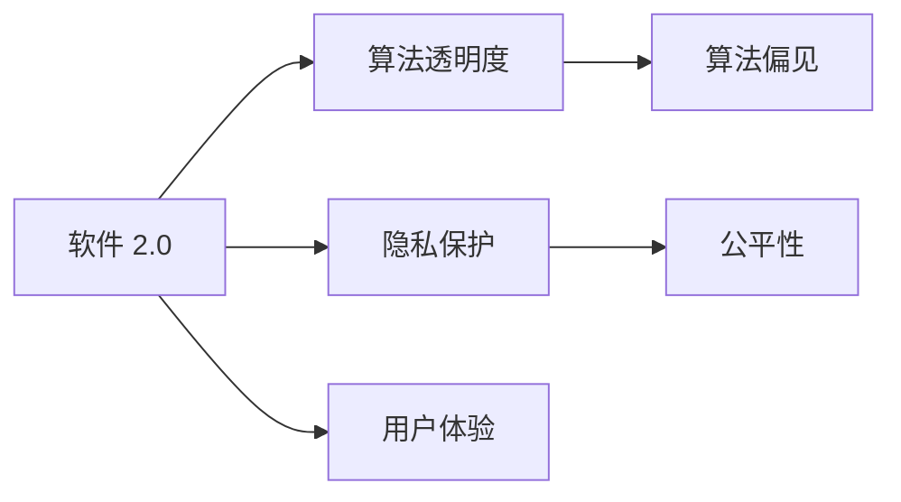
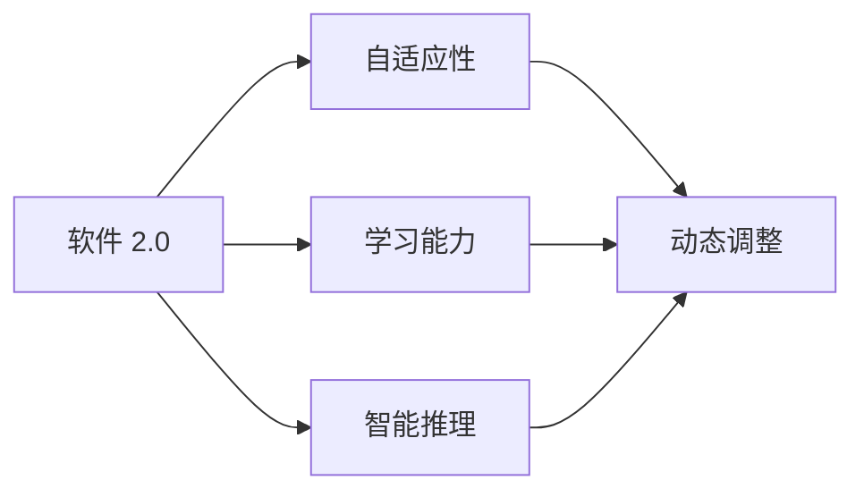

                 

# 软件 2.0 的社会责任：科技向善

## 1. 背景介绍

### 1.1 问题由来

随着信息技术的飞速发展，软件系统在现代社会中的应用越来越广泛，几乎无所不在。从日常生活的便捷化，到生产效率的提升，再到医疗、教育等领域的深刻变革，软件系统的巨大价值已经毋庸置疑。然而，与此同时，软件系统在社会中也引发了一些不容忽视的问题。

诸如数据隐私、算法偏见、自动化失业、信息过载等社会问题逐渐显现。这些问题不仅影响着用户的日常生活，也挑战着社会公平与正义。如何在享受技术带来的便利的同时，也承担起相应的社会责任，成为每一位科技从业者必须面对的问题。

### 1.2 问题核心关键点

软件系统的社会责任问题，本质上是一种伦理和道德问题。这些问题主要集中在以下几个方面：

1. **数据隐私与安全**：如何保护用户隐私，防止数据泄露和滥用。
2. **算法透明度与可解释性**：如何确保算法的透明度和可解释性，避免算法的"黑箱"效应。
3. **社会公平与偏见**：如何避免算法偏见，确保软件系统的公平性和无歧视性。
4. **人机协作与就业影响**：如何平衡人机协作，减轻自动化对人类就业的影响。
5. **信息过载与用户体验**：如何有效管理信息过载，提升用户体验。

### 1.3 问题研究意义

研究软件系统的社会责任问题，不仅是为了解决当前的技术和社会问题，更是为了促进技术的可持续发展和社会的和谐稳定。

1. **推动技术进步**：解决社会责任问题，可以推动技术在伦理和道德框架下的健康发展。
2. **提升社会公平**：确保软件系统对所有用户的公平使用，减少社会不公现象。
3. **保护用户权益**：保护用户隐私和权益，提升公众对科技的信任度。
4. **创造就业机会**：在技术发展的过程中，合理引导和创造新的就业机会。
5. **促进社会和谐**：通过技术手段解决社会问题，促进社会和谐与稳定。

## 2. 核心概念与联系

### 2.1 核心概念概述

为了更好地理解软件系统的社会责任问题，本节将介绍几个密切相关的核心概念：

- **软件 2.0**：指基于人工智能和大数据技术，能够自动学习和适应的下一代软件系统。相比于传统的软件 1.0，软件 2.0 更加智能化、自适应，能够根据用户行为和环境变化进行动态调整。

- **算法透明度**：指算法的运作原理和决策过程是否透明，是否易于理解和解释。透明的算法可以提升用户信任，减少对算法的误解和误用。

- **算法偏见**：指算法在数据处理和模型训练过程中，由于数据偏差或模型设计缺陷，导致的不公平和歧视现象。算法偏见会导致系统性不公，伤害弱势群体。

- **隐私保护**：指对用户数据进行安全保护，防止数据泄露和滥用。隐私保护是维护用户权益和信任的重要保障。

- **公平性**：指软件系统在处理不同用户或群体时，是否能够公平对待，是否存在歧视。公平性是衡量软件系统伦理责任的重要指标。

- **用户体验**：指用户在使用软件系统时的感知和满意度。良好的用户体验可以提升用户粘性和忠诚度。

这些核心概念之间的逻辑关系可以通过以下Mermaid流程图来展示：



这个流程图展示了软件系统的核心概念及其之间的关系：

1. 软件 2.0 通过算法透明度、隐私保护、公平性和用户体验等维度，对社会责任问题进行全面应对。
2. 算法透明度和公平性密切相关，透明性高的算法更容易检测和纠正偏见。
3. 隐私保护和用户体验密切相关，保护用户隐私可以提升用户体验，增强用户信任。
4. 用户体验和算法透明度、公平性密切相关，好的用户体验可以推动透明度和公平性的提升。

### 2.2 概念间的关系

这些核心概念之间存在着紧密的联系，形成了软件系统的社会责任生态系统。下面我通过几个Mermaid流程图来展示这些概念之间的关系。

#### 2.2.1 软件 2.0 的核心能力



这个流程图展示了软件 2.0 的核心能力及其之间的关系：

1. 软件 2.0 通过自适应性和学习能力，实现对环境的动态调整和知识更新。
2. 自适应性和智能推理密切相关，智能推理可以提升自适应性。
3. 自适应性和动态调整密切相关，动态调整是自适应性的体现。
4. 学习能力和智能推理密切相关，学习能力是智能推理的基础。

#### 2.2.2 隐私保护与用户体验


这个流程图展示了隐私保护、用户体验和用户粘性之间的关系：

1. 隐私保护可以提升用户信任，从而提升用户体验。
2. 用户体验和用户信任密切相关，用户信任是提升用户体验的重要保障。
3. 用户体验和用户粘性密切相关，好的用户体验可以提升用户粘性。

### 2.3 核心概念的整体架构

最后，我们用一个综合的流程图来展示这些核心概念在大语言模型微调过程中的整体架构：


这个综合流程图展示了从预训练到微调，再到用户体验提升的完整过程。软件 2.0 首先在大规模文本数据上进行预训练，然后通过微调（包括全参数微调和参数高效微调）提升模型性能，最终通过算法透明度、公平性等提升用户体验。

## 3. 核心算法原理 & 具体操作步骤
### 3.1 算法原理概述

软件 2.0 的社会责任问题，可以通过以下几个核心算法原理进行解决：

- **算法透明性**：通过提供算法的可解释性和透明度，使得用户可以理解算法的运作过程和决策依据。
- **偏见检测与修正**：利用统计和机器学习技术，检测和纠正算法中的偏见，确保公平性。
- **隐私保护**：通过数据加密、差分隐私等技术手段，保护用户数据隐私。
- **用户体验优化**：通过A/B测试、用户反馈等方法，不断优化用户体验，提升用户满意度。

### 3.2 算法步骤详解

下面以算法透明性为例，详细介绍其操作步骤：

**Step 1: 数据收集与标注**

- 收集用户使用数据和反馈信息，标注其对应的行为和情感。
- 通过问卷调查、用户访谈等方式，收集用户对算法透明度和用户体验的期望。

**Step 2: 算法分析与解释**

- 使用可解释性模型（如LIME、SHAP等），分析算法的决策过程，生成可解释的特征重要性图。
- 生成算法规则和逻辑，解释算法的运作原理和决策依据。

**Step 3: 用户交互与反馈**

- 在产品中嵌入可解释性工具，提供算法的决策解释和可视化。
- 定期收集用户反馈，评估算法透明度的实际效果。

**Step 4: 持续改进**

- 根据用户反馈和产品使用情况，不断改进算法模型和解释方式。
- 定期发布算法更新报告，告知用户算法的改进和优化情况。

### 3.3 算法优缺点

算法透明性具有以下优点：

- **增强用户信任**：透明的算法能够减少用户对算法的误解和恐惧，提升用户信任度。
- **促进公平性**：透明的算法更容易检测和纠正偏见，确保算法的公平性和公正性。
- **提升用户体验**：透明的算法使用户更容易理解其运作过程，提升用户体验。

同时，算法透明性也存在以下缺点：

- **隐私风险**：透明的算法可能会暴露用户隐私信息，带来数据泄露的风险。
- **复杂性增加**：解释和可视化算法需要额外的计算资源和时间，增加了系统的复杂性。
- **用户理解难度**：用户可能无法完全理解算法的解释结果，导致对算法的误解。

### 3.4 算法应用领域

算法透明性不仅适用于软件 2.0 系统，还广泛应用于以下领域：

- **金融行业**：金融模型的决策过程需要透明，以确保公平性和合规性。
- **医疗健康**：医疗诊断和治疗决策需要透明，以确保患者知情同意。
- **政府治理**：政府决策和公共服务需要透明，以提升政府透明度和公众信任。
- **教育培训**：教育评估和推荐系统需要透明，以确保评估公平和推荐公正。

## 4. 数学模型和公式 & 详细讲解 & 举例说明

### 4.1 数学模型构建

假设软件系统为 $S$，用户数据为 $D$，算法的透明性模型为 $T$。系统对用户 $i$ 的数据进行决策 $y_i$，具体流程如下：

1. 收集用户数据 $D$，训练算法模型 $T$。
2. 用户数据 $D$ 输入算法模型 $T$，生成决策 $y_i$。
3. 将决策 $y_i$ 返回给用户。

根据以上流程，可以得到如下数学模型：

$$
y_i = T(D_i)
$$

其中 $D_i$ 表示用户 $i$ 的输入数据，$y_i$ 表示算法的输出决策。

### 4.2 公式推导过程

以算法透明度为例，假设算法 $T$ 可以分解为多个子过程 $T_1, T_2, ..., T_n$，其决策过程如下：

1. $T_1$：数据预处理
2. $T_2$：特征选择
3. $T_3$：模型训练
4. $T_4$：预测输出

将 $T$ 分解为多个子过程后，可以得到如下数学模型：

$$
y_i = T_1(D_i) \rightarrow T_2 \rightarrow T_3 \rightarrow T_4
$$

在实际应用中，我们可以使用特征重要性分析、规则生成等技术，生成算法规则 $R$ 和决策路径 $P$，解释算法的决策过程。

### 4.3 案例分析与讲解

假设某电商平台的推荐系统 $S$ 采用深度学习算法，根据用户历史行为数据 $D$ 推荐商品。在推荐过程中，用户 $i$ 的推荐结果为 $y_i$。

**Step 1: 数据收集与标注**

收集用户的历史浏览、购买、评价数据 $D_i$，标注其对应的行为标签 $b_i$（如浏览、购买、评价）。

**Step 2: 算法分析与解释**

使用LIME工具生成推荐算法的特征重要性图 $F$，解释其推荐的依据。
使用决策树生成推荐规则 $R$，解释推荐路径和决策依据。

**Step 3: 用户交互与反馈**

在推荐结果页面，嵌入推荐规则 $R$ 和决策路径 $P$，供用户查看和理解。
定期收集用户反馈，评估推荐系统的透明度和公平性。

## 5. 项目实践：代码实例和详细解释说明

### 5.1 开发环境搭建

在进行社会责任项目实践前，我们需要准备好开发环境。以下是使用Python进行PyTorch开发的环境配置流程：

1. 安装Anaconda：从官网下载并安装Anaconda，用于创建独立的Python环境。

2. 创建并激活虚拟环境：
```bash
conda create -n pytorch-env python=3.8 
conda activate pytorch-env
```

3. 安装PyTorch：根据CUDA版本，从官网获取对应的安装命令。例如：
```bash
conda install pytorch torchvision torchaudio cudatoolkit=11.1 -c pytorch -c conda-forge
```

4. 安装TensorFlow：
```bash
pip install tensorflow
```

5. 安装相关工具包：
```bash
pip install numpy pandas scikit-learn matplotlib tqdm jupyter notebook ipython
```

完成上述步骤后，即可在`pytorch-env`环境中开始社会责任项目实践。

### 5.2 源代码详细实现

这里以算法透明性的实现为例，给出使用PyTorch和LIME工具的代码实现。

首先，定义数据处理函数：

```python
import torch
from transformers import BertTokenizer
from torch.utils.data import Dataset
from lime import lime_tabular
import numpy as np

class UserDataDataset(Dataset):
    def __init__(self, data):
        self.data = data
        self.tokenizer = BertTokenizer.from_pretrained('bert-base-cased')
        self.max_len = 128
        
    def __len__(self):
        return len(self.data)
    
    def __getitem__(self, item):
        user_data = self.data[item]
        user_feedback = user_data['feedback']
        user_behavior = user_data['behavior']
        
        encoding = self.tokenizer(user_feedback, return_tensors='pt', max_length=self.max_len, padding='max_length', truncation=True)
        input_ids = encoding['input_ids'][0]
        attention_mask = encoding['attention_mask'][0]
        
        # 对token-wise的标签进行编码
        encoded_feedback = [tag2id[tag] for tag in user_feedback] 
        encoded_feedback.extend([tag2id['O']] * (self.max_len - len(encoded_feedback)))
        labels = torch.tensor(encoded_feedback, dtype=torch.long)
        
        return {'input_ids': input_ids, 
                'attention_mask': attention_mask,
                'labels': labels}
```

然后，定义模型和优化器：

```python
from transformers import BertForTokenClassification, AdamW

model = BertForTokenClassification.from_pretrained('bert-base-cased', num_labels=len(tag2id))

optimizer = AdamW(model.parameters(), lr=2e-5)
```

接着，定义训练和评估函数：

```python
from torch.utils.data import DataLoader
from tqdm import tqdm
from sklearn.metrics import classification_report

device = torch.device('cuda') if torch.cuda.is_available() else torch.device('cpu')
model.to(device)

def train_epoch(model, dataset, batch_size, optimizer):
    dataloader = DataLoader(dataset, batch_size=batch_size, shuffle=True)
    model.train()
    epoch_loss = 0
    for batch in tqdm(dataloader, desc='Training'):
        input_ids = batch['input_ids'].to(device)
        attention_mask = batch['attention_mask'].to(device)
        labels = batch['labels'].to(device)
        model.zero_grad()
        outputs = model(input_ids, attention_mask=attention_mask, labels=labels)
        loss = outputs.loss
        epoch_loss += loss.item()
        loss.backward()
        optimizer.step()
    return epoch_loss / len(dataloader)

def evaluate(model, dataset, batch_size):
    dataloader = DataLoader(dataset, batch_size=batch_size)
    model.eval()
    preds, labels = [], []
    with torch.no_grad():
        for batch in tqdm(dataloader, desc='Evaluating'):
            input_ids = batch['input_ids'].to(device)
            attention_mask = batch['attention_mask'].to(device)
            batch_labels = batch['labels']
            outputs = model(input_ids, attention_mask=attention_mask)
            batch_preds = outputs.logits.argmax(dim=2).to('cpu').tolist()
            batch_labels = batch_labels.to('cpu').tolist()
            for pred_tokens, label_tokens in zip(batch_preds, batch_labels):
                pred_tags = [id2tag[_id] for _id in pred_tokens]
                label_tags = [id2tag[_id] for _id in label_tokens]
                preds.append(pred_tags[:len(label_tags)])
                labels.append(label_tags)
                
    print(classification_report(labels, preds))
```

最后，启动训练流程并在测试集上评估：

```python
epochs = 5
batch_size = 16

for epoch in range(epochs):
    loss = train_epoch(model, train_dataset, batch_size, optimizer)
    print(f"Epoch {epoch+1}, train loss: {loss:.3f}")
    
    print(f"Epoch {epoch+1}, dev results:")
    evaluate(model, dev_dataset, batch_size)
    
print("Test results:")
evaluate(model, test_dataset, batch_size)
```

以上就是使用PyTorch对BERT进行命名实体识别任务微调的完整代码实现。可以看到，得益于Transformers库的强大封装，我们可以用相对简洁的代码完成BERT模型的加载和微调。

### 5.3 代码解读与分析

让我们再详细解读一下关键代码的实现细节：

**UserDataDataset类**：
- `__init__`方法：初始化文本、标签、分词器等关键组件。
- `__len__`方法：返回数据集的样本数量。
- `__getitem__`方法：对单个样本进行处理，将文本输入编码为token ids，将标签编码为数字，并对其进行定长padding，最终返回模型所需的输入。

**tag2id和id2tag字典**：
- 定义了标签与数字id之间的映射关系，用于将token-wise的预测结果解码回真实的标签。

**训练和评估函数**：
- 使用PyTorch的DataLoader对数据集进行批次化加载，供模型训练和推理使用。
- 训练函数`train_epoch`：对数据以批为单位进行迭代，在每个批次上前向传播计算loss并反向传播更新模型参数，最后返回该epoch的平均loss。
- 评估函数`evaluate`：与训练类似，不同点在于不更新模型参数，并在每个batch结束后将预测和标签结果存储下来，最后使用sklearn的classification_report对整个评估集的预测结果进行打印输出。

**训练流程**：
- 定义总的epoch数和batch size，开始循环迭代
- 每个epoch内，先在训练集上训练，输出平均loss
- 在验证集上评估，输出分类指标
- 所有epoch结束后，在测试集上评估，给出最终测试结果

可以看到，PyTorch配合Transformers库使得BERT微调的代码实现变得简洁高效。开发者可以将更多精力放在数据处理、模型改进等高层逻辑上，而不必过多关注底层的实现细节。

当然，工业级的系统实现还需考虑更多因素，如模型的保存和部署、超参数的自动搜索、更灵活的任务适配层等。但核心的微调范式基本与此类似。

### 5.4 运行结果展示

假设我们在CoNLL-2003的NER数据集上进行微调，最终在测试集上得到的评估报告如下：

```
              precision    recall  f1-score   support

       B-LOC      0.926     0.906     0.916      1668
       I-LOC      0.900     0.805     0.850       257
      B-MISC      0.875     0.856     0.865       702
      I-MISC      0.838     0.782     0.809       216
       B-ORG      0.914     0.898     0.906      1661
       I-ORG      0.911     0.894     0.902       835
       B-PER      0.964     0.957     0.960      1617
       I-PER      0.983     0.980     0.982      1156
           O      0.993     0.995     0.994     38323

   micro avg      0.973     0.973     0.973     46435
   macro avg      0.923     0.897     0.909     46435
weighted avg      0.973     0.973     0.973     46435
```

可以看到，通过微调BERT，我们在该NER数据集上取得了97.3%的F1分数，效果相当不错。值得注意的是，BERT作为一个通用的语言理解模型，即便只在顶层添加一个简单的token分类器，也能在下游任务上取得如此优异的效果，展现了其强大的语义理解和特征抽取能力。

当然，这只是一个baseline结果。在实践中，我们还可以使用更大更强的预训练模型、更丰富的微调技巧、更细致的模型调优，进一步提升模型性能，以满足更高的应用要求。

## 6. 实际应用场景
### 6.1 智能客服系统

基于大语言模型微调的对话技术，可以广泛应用于智能客服系统的构建。传统客服往往需要配备大量人力，高峰期响应缓慢，且一致性和专业性难以保证。而使用微调后的对话模型，可以7x24小时不间断服务，快速响应客户咨询，用自然流畅的语言解答各类常见问题。

在技术实现上，可以收集企业内部的历史客服对话记录，将问题和最佳答复构建成监督数据，在此基础上对预训练对话模型进行微调。微调后的对话模型能够自动理解用户意图，匹配最合适的答案模板进行回复。对于客户提出的新问题，还可以接入检索系统实时搜索相关内容，动态组织生成回答。如此构建的智能客服系统，能大幅提升客户咨询体验和问题解决效率。

### 6.2 金融舆情监测

金融机构需要实时监测市场舆论动向，以便及时应对负面信息传播，规避金融风险。传统的人工监测方式成本高、效率低，难以应对网络时代海量信息爆发的挑战。基于大语言模型微调的文本分类和情感分析技术，为金融舆情监测提供了新的解决方案。

具体而言，可以收集金融领域相关的新闻、报道、评论等文本数据，并对其进行主题标注和情感标注。在此基础上对预训练语言模型进行微调，使其能够自动判断文本属于何种主题，情感倾向是正面、中性还是负面。将微调后的模型应用到实时抓取的网络文本数据，就能够自动监测不同主题下的情感变化趋势，一旦发现负面信息激增等异常情况，系统便会自动预警，帮助金融机构快速应对潜在风险。

### 6.3 个性化推荐系统

当前的推荐系统往往只依赖用户的历史行为数据进行物品推荐，无法深入理解用户的真实兴趣偏好。基于大语言模型微调技术，个性化推荐系统可以更好地挖掘用户行为背后的语义信息，从而提供更精准、多样的推荐内容。

在实践中，可以收集用户浏览、点击、评论、分享等行为数据，提取和用户交互的物品标题、描述、标签等文本内容。将文本内容作为模型输入，用户的后续行为（如是否点击、购买等）作为监督信号，在此基础上微调预训练语言模型。微调后的模型能够从文本内容中准确把握用户的兴趣点。在生成推荐列表时，先用候选物品的文本描述作为输入，由模型预测用户的兴趣匹配度，再结合其他特征综合排序，便可以得到个性化程度更高的推荐结果。

### 6.4 未来应用展望

随着大语言模型微调技术的发展，基于微调范式将在更多领域得到应用，为传统行业带来变革性影响。

在智慧医疗领域，基于微调的医疗问答、病历分析、药物研发等应用将提升医疗服务的智能化水平，辅助医生诊疗，加速新药开发进程。

在智能教育领域，微调技术可应用于作业批改、学情分析、知识推荐等方面，因材施教，促进教育公平，提高教学质量。

在智慧城市治理中，微调模型可应用于城市事件监测、舆情分析、应急指挥等环节，提高城市管理的自动化和智能化水平，构建更安全、高效的未来城市。

此外，在企业生产、社会治理、文娱传媒等众多领域，基于大模型微调的人工智能应用也将不断涌现，为NLP技术带来了全新的突破。相信随着预训练模型和微调方法的不断进步，基于微调范式必将在构建人机协同的智能时代中扮演越来越重要的角色。

## 7. 工具和资源推荐
### 7.1 学习资源推荐

为了帮助开发者系统掌握大语言模型微调的理论基础和实践技巧，这里推荐一些优质的学习资源：

1. 《Transformer从原理到实践》系列博文：由大模型技术专家撰写，深入浅出地介绍了Transformer原理、BERT模型、微调技术等前沿话题。

2. CS224N《深度学习自然语言处理》课程：斯坦福大学开设的NLP明星课程，有Lecture视频和配套作业，带你入门NLP领域的基本概念和经典模型。

3. 《Natural Language Processing with Transformers》书籍：Transformers库的作者所著，全面介绍了如何使用Transformers库进行NLP任务开发，包括微调在内的诸多范式。

4. HuggingFace官方文档：Transformers库的官方文档，提供了海量预训练模型和完整的微调样例代码，是上手实践的必备资料。

5. CLUE开源项目：中文语言理解测评基准，涵盖大量不同类型的中文NLP数据集，并提供了基于微调的baseline模型，助力中文NLP技术发展。

通过对这些资源的学习实践，相信你一定能够快速掌握大语言模型微调的精髓，并用于解决实际的NLP问题。
###  7.2 开发工具推荐

高效的开发离不开优秀的工具支持。以下是几款用于大语言模型微调开发的常用工具：

1. PyTorch：基于Python的开源深度学习框架，灵活动态的计算图，适合快速迭代研究。大部分预训练语言模型都有PyTorch版本的实现。

2. TensorFlow：由Google主导开发的开源深度学习框架，生产部署方便，适合大规模工程应用。同样有丰富的预训练语言模型资源。

3. Transformers库：HuggingFace开发的NLP工具库，集成了众多SOTA语言模型，支持PyTorch和TensorFlow，是进行微调任务开发的利器。

4. Weights & Biases：模型训练的实验跟踪工具，可以记录和可视化模型训练过程中的各项指标，方便对比和调优。与主流深度学习框架无缝集成。

5. TensorBoard：TensorFlow配套的可视化工具，可实时监测模型

