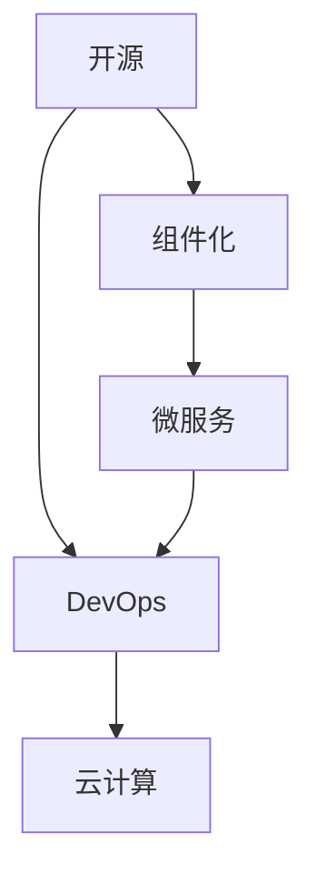

                 

# 软件2.0的开源生态系统构建

在数字时代，软件的构建模式正在发生根本性的变化。随着云计算、人工智能、区块链等新兴技术的兴起，软件生态系统日益复杂，传统的软件开发方式已经无法满足新的需求。面对这一挑战，开源社区提出并实践了软件2.0的概念，旨在构建一个更开放、协作、灵活的软件生态系统。本文将详细探讨软件2.0的开源生态系统构建，从背景、核心概念、算法原理、实践、应用场景、工具资源等多个方面进行深入分析。

## 1. 背景介绍

### 1.1 问题由来

随着互联网和移动互联网的迅猛发展，软件生态系统的复杂性不断增加。传统软件以单个产品为中心，开发者独立开发、部署和维护，形成了“烟囱式”的应用架构。这种模式在早期的软件发展中取得了一定的成功，但随着云服务、微服务、DevOps等新兴技术的普及，传统软件开发模式逐渐显露出其局限性。

1. **烟囱式架构的缺陷**：
   - **独立开发**：各组件之间缺乏统一的标准和协议，导致集成难度大、成本高。
   - **缺乏协作**：开发者之间缺乏有效的沟通和协作机制，导致资源浪费和重复开发。
   - **部署复杂**：多个系统之间的依赖关系复杂，部署和扩展困难。
   - **维护困难**：系统规模大、功能复杂，难以进行持续的维护和更新。

2. **云计算和大数据技术的影响**：
   - **云服务**：云计算平台提供了高度可扩展的计算资源和弹性调度机制，但现有的开发方式难以充分利用云服务的优势。
   - **大数据**：数据的规模和复杂性不断增加，传统的数据处理方式无法满足需求。

为了应对这些挑战，开源社区提出了软件2.0的概念，通过构建开放、协作、灵活的软件生态系统，实现软件开发的革命性变革。

### 1.2 问题核心关键点

软件2.0的核心目标是通过开源生态系统的构建，实现以下几个关键点：

1. **开放性**：打破传统软件开发的“烟囱式”架构，构建一个开放的生态系统，促进资源和技术的共享。
2. **协作性**：通过社区协作和贡献机制，汇聚全球开发者的智慧和力量，推动技术进步和创新。
3. **灵活性**：采用模块化、组件化的设计理念，提高系统的可扩展性和灵活性。
4. **自动化**：引入自动化工具和流程，提高开发和运维的效率和质量。

## 2. 核心概念与联系

### 2.1 核心概念概述

软件2.0的开源生态系统构建涉及多个核心概念，包括开源、组件化、微服务、DevOps、云计算等。下面将对每个核心概念进行简要介绍：

- **开源**：指代码和资源公开，任何人都可以自由使用、修改和分发。开源文化强调协作、透明和共享，是软件2.0生态系统的基础。
- **组件化**：将系统分解为多个独立、可复用的组件，每个组件可以独立开发、部署和维护。组件化设计提高了系统的灵活性和可扩展性。
- **微服务**：一种架构风格，将系统分解为多个小的、独立的服务，每个服务围绕业务能力设计，通过API进行通信。微服务架构提高了系统的灵活性、可扩展性和容错性。
- **DevOps**：一种文化和实践，强调开发和运维的协作和自动化，通过持续集成、持续交付和持续监控等手段，提高软件交付的速度和质量。
- **云计算**：一种计算资源交付和使用的模式，通过互联网提供按需、易扩展的计算资源，支持软件2.0生态系统的构建。

### 2.2 核心概念的联系

这些核心概念之间存在着紧密的联系，形成一个完整的软件2.0生态系统：

- **开源**是软件2.0的基础，提供了开放的资源和平台，促进了协作和创新。
- **组件化**和**微服务**是软件2.0的架构设计理念，通过模块化和组件化的方式，提高系统的灵活性和可扩展性。
- **DevOps**是软件2.0的软件交付方式，通过自动化工具和流程，提高开发和运维的效率和质量。
- **云计算**是软件2.0的技术支撑，提供了灵活、可扩展的计算资源，支持生态系统的构建。

这些概念共同构成了软件2.0的开源生态系统，推动着软件开发的革命性变革。

### 2.3 核心概念的整体架构

软件2.0的开源生态系统构建可以抽象为一个由开源、组件化、微服务、DevOps和云计算构成的整体架构，如下图所示：



这个架构展示了各个概念之间的逻辑关系：

- 开源提供了基础的资源和平台，促进了协作和创新。
- 组件化是系统设计的理念，通过模块化和组件化的方式，提高系统的灵活性和可扩展性。
- 微服务是基于组件化架构的一种具体实现方式，通过服务化设计，提高系统的灵活性和可扩展性。
- DevOps是软件交付的方式，通过自动化工具和流程，提高开发和运维的效率和质量。
- 云计算提供了技术支撑，支持生态系统的构建和运行。

## 3. 核心算法原理 & 具体操作步骤

### 3.1 算法原理概述

软件2.0的开源生态系统构建，本质上是通过开源、组件化、微服务、DevOps和云计算等技术手段，实现软件开发的开放、协作、灵活和自动化。其核心算法原理包括以下几个方面：

- **开源协作**：通过Git、GitHub等开源工具，实现代码的公开、共享和协作，促进社区的共同进步。
- **组件化设计**：采用模块化、组件化的设计理念，将系统分解为多个独立、可复用的组件，提高系统的灵活性和可扩展性。
- **微服务架构**：通过服务化设计，将系统分解为多个小的、独立的服务，每个服务围绕业务能力设计，通过API进行通信，提高系统的灵活性、可扩展性和容错性。
- **DevOps实践**：引入自动化工具和流程，如Jenkins、Docker、Kubernetes等，提高开发和运维的效率和质量。
- **云计算支撑**：利用云计算平台提供的计算资源和弹性调度机制，实现软件系统的按需扩展和灵活部署。

### 3.2 算法步骤详解

软件2.0的开源生态系统构建，主要包括以下几个关键步骤：

1. **资源准备**：准备开源资源和平台，如GitHub、GitLab等，为开源协作提供支持。
2. **组件化设计**：将系统分解为多个独立的组件，每个组件独立开发、部署和维护。
3. **微服务实现**：将组件转化为微服务，每个服务围绕业务能力设计，通过API进行通信。
4. **DevOps实践**：引入自动化工具和流程，如Jenkins、Docker、Kubernetes等，提高开发和运维的效率和质量。
5. **云计算部署**：利用云计算平台提供的计算资源和弹性调度机制，实现软件系统的按需扩展和灵活部署。

### 3.3 算法优缺点

软件2.0的开源生态系统构建具有以下优点：

- **开放性**：开源文化强调协作、透明和共享，促进了资源和技术的共享，推动了社区的共同进步。
- **灵活性**：组件化设计和微服务架构提高了系统的灵活性和可扩展性，可以快速响应需求变化。
- **自动化**：DevOps实践提高了开发和运维的效率和质量，缩短了软件交付的时间周期。
- **可扩展性**：云计算提供了灵活、可扩展的计算资源，支持生态系统的构建和运行。

同时，软件2.0也存在一些缺点：

- **复杂性**：组件化设计和微服务架构增加了系统的复杂性，需要更高的开发和运维能力。
- **依赖性强**：对开源工具和云计算平台的依赖性较强，需要投入更多的时间和资源进行维护和优化。
- **安全性**：开源平台和云服务的安全性问题需要更加严格的监控和管理。

### 3.4 算法应用领域

软件2.0的开源生态系统构建在多个领域得到了广泛应用，包括：

- **企业级应用**：通过构建企业级开源生态系统，实现资源共享和协同开发，提高企业的创新能力和竞争力。
- **软件开发平台**：利用开源工具和云计算平台，构建软件开发的协作平台，促进开发者之间的交流和协作。
- **云服务平台**：构建基于云计算的开源平台，提供灵活、可扩展的计算资源，支持软件系统的构建和部署。
- **智能应用**：利用开源组件和云计算平台，构建智能应用系统，实现高性能、高可扩展的智能服务。

## 4. 数学模型和公式 & 详细讲解 & 举例说明

### 4.1 数学模型构建

软件2.0的开源生态系统构建涉及多个数学模型，包括系统设计模型、组件设计模型、服务设计模型等。下面以系统设计模型为例进行详细讲解。

假设一个软件系统由多个组件组成，每个组件的依赖关系如下：

- 组件A依赖于组件B和组件C。
- 组件B依赖于组件A和组件D。
- 组件C依赖于组件A和组件E。
- 组件D依赖于组件B和组件F。
- 组件E依赖于组件C和组件G。
- 组件F依赖于组件D和组件H。
- 组件G依赖于组件E和组件I。
- 组件H依赖于组件F和组件J。
- 组件I依赖于组件G和组件K。
- 组件J依赖于组件H和组件L。
- 组件K依赖于组件I和组件M。
- 组件L依赖于组件J和组件N。
- 组件M依赖于组件K和组件O。
- 组件N依赖于组件L和组件P。
- 组件O依赖于组件M和组件Q。
- 组件P依赖于组件N和组件R。
- 组件Q依赖于组件O和组件S。
- 组件R依赖于组件P和组件T。
- 组件S依赖于组件Q和组件U。
- 组件T依赖于组件R和组件V。
- 组件U依赖于组件S和组件W。
- 组件V依赖于组件T和组件X。
- 组件W依赖于组件U和组件Y。
- 组件X依赖于组件V和组件Z。
- 组件Y依赖于组件W和组件A。
- 组件Z依赖于组件X和组件A。

我们可以使用有向无环图(DAG)来表示这种依赖关系：

```
A
|
D--->B--->F--->H--->J--->N--->X--->Z
|        |      |      |       |       |
C--->G--->E--->I--->U--->S--->W--->Y
```

### 4.2 公式推导过程

对于上述DAG模型，我们可以定义一个依赖关系矩阵A，其中A[i][j]表示组件j是否依赖于组件i：

$$
A = \begin{pmatrix}
0 & 1 & 1 & 0 & 0 & 0 & 0 & 0 & 0 & 0 & 0 & 0 & 0 & 0 & 0 & 0 & 0 & 0 & 0 & 0 & 0 & 0 & 0 & 0 & 0 & 0 & 0 & 0 & 0 & 0 & 0 & 0 & 0 & 0 & 0 & 0 & 0 & 0 & 0 & 0 & 0 & 0 & 0 & 0 & 0 & 0 & 0 & 0 & 0 & 0 & 0 & 0 & 1 \\
1 & 0 & 0 & 1 & 0 & 0 & 0 & 0 & 0 & 0 & 0 & 0 & 0 & 0 & 0 & 0 & 0 & 0 & 0 & 0 & 0 & 0 & 0 & 0 & 0 & 0 & 0 & 0 & 0 & 0 & 0 & 0 & 0 & 0 & 0 & 0 & 0 & 0 & 0 & 0 & 0 & 0 & 0 & 0 & 0 & 0 & 0 & 0 & 0 & 0 & 0 & 0 & 0 & 0 & 0 & 0 & 0 & 0 & 0 & 0 & 0 & 0 & 0 & 0 & 0 & 0 & 0 & 0 & 0 & 0 & 0 & 0 & 0 & 0 \\
1 & 0 & 0 & 0 & 1 & 0 & 0 & 0 & 0 & 0 & 0 & 0 & 0 & 0 & 0 & 0 & 0 & 0 & 0 & 0 & 0 & 0 & 0 & 0 & 0 & 0 & 0 & 0 & 0 & 0 & 0 & 0 & 0 & 0 & 0 & 0 & 0 & 0 & 0 & 0 & 0 & 0 & 0 & 0 & 0 & 0 & 0 & 0 & 0 & 0 & 0 & 0 & 0 & 0 & 0 & 0 & 0 & 0 & 0 & 0 & 0 & 0 & 0 & 0 & 0 & 0 & 0 & 0 & 0 & 0 & 0 & 0 & 0 & 0 & 0 & 0 & 0 & 0 & 0 & 0 & 0 & 0 & 0 & 0 & 0 & 0 & 0 & 0 & 0 & 0 & 0 & 0 & 0 & 0 & 0 & 0 & 0 & 0 & 0 & 0 & 0 & 0 & 0 & 0 & 0 & 0 & 0 & 0 & 0 & 0 & 0 & 0 & 0 & 0 & 0 & 0 & 0 & 0 & 0 & 0 & 0 & 0 & 0 & 0 & 0 & 0 & 0 & 0 & 0 & 0 & 0 & 0 & 0 & 0 & 0 & 0 & 0 & 0 & 0 & 0 & 0 & 0 & 0 & 0 & 0 & 0 & 0 & 0 & 0 & 0 & 0 & 0 & 0 & 0 & 0 & 0 & 0 & 0 & 0 & 0 & 0 & 0 & 0 & 0 & 0 & 0 & 0 & 0 & 0 & 0 & 0 & 0 & 0 & 0 & 0 & 0 & 0 & 0 & 0 & 0 & 0 & 0 & 0 & 0 & 0 & 0 & 0 & 0 & 0 & 0 & 0 & 0 & 0 & 0 & 0 & 0 & 0 & 0 & 0 & 0 & 0 & 0 & 0 & 0 & 0 & 0 & 0 & 0 & 0 & 0 & 0 & 0 & 0 & 0 & 0 & 0 & 0 & 0 & 0 & 0 & 0 & 0 & 0 & 0 & 0 & 0 & 0 & 0 & 0 & 0 & 0 & 0 & 0 & 0 & 0 & 0 & 0 & 0 & 0 & 0 & 0 & 0 & 0 & 0 & 0 & 0 & 0 & 0 & 0 & 0 & 0 & 0 & 0 & 0 & 0 & 0 & 0 & 0 & 0 & 0 & 0 & 0 & 0 & 0 & 0 & 0 & 0 & 0 & 0 & 0 & 0 & 0 & 0 & 0 & 0 & 0 & 0 & 0 & 0 & 0 & 0 & 0 & 0 & 0 & 0 & 0 & 0 & 0 & 0 & 0 & 0 & 0 & 0 & 0 & 0 & 0 & 0 & 0 & 0 & 0 & 0 & 0 & 0 & 0 & 0 & 0 & 0 & 0 & 0 & 0 & 0 & 0 & 0 & 0 & 0 & 0 & 0 & 0 & 0 & 0 & 0 & 0 & 0 & 0 & 0 & 0 & 0 & 0 & 0 & 0 & 0 & 0 & 0 & 0 & 0 & 0 & 0 & 0 & 0 & 0 & 0 & 0 & 0 & 0 & 0 & 0 & 0 & 0 & 0 & 0 & 0 & 0 & 0 & 0 & 0 & 0 & 0 & 0 & 0 & 0 & 0 & 0 & 0 & 0 & 0 & 0 & 0 & 0 & 0 & 0 & 0 & 0 & 0 & 0 & 0 & 0 & 0 & 0 & 0 & 0 & 0 & 0 & 0 & 0 & 0 & 0 & 0 & 0 & 0 & 0 & 0 & 0 & 0 & 0 & 0 & 0 & 0 & 0 & 0 & 0 & 0 & 0 & 0 & 0 & 0 & 0 & 0 & 0 & 0 & 0 & 0 & 0 & 0 & 0 & 0 & 0 & 0 & 0 & 0 & 0 & 0 & 0 & 0 & 0 & 0 & 0 & 0 & 0 & 0 & 0 & 0 & 0 & 0 & 0 & 0 & 0 & 0 & 0 & 0 & 0 & 0 & 0 & 0 & 0 & 0 & 0 & 0 & 0 & 0 & 0 & 0 & 0 & 0 & 0 & 0 & 0 & 0 & 0 & 0 & 0 & 0 & 0 & 0 & 0 & 0 & 0 & 0 & 0 & 0 & 0 & 0 & 0 & 0 & 0 & 0 & 0 & 0 & 0 & 0 & 0 & 0 & 0 & 0 & 0 & 0 & 0 & 0 & 0 & 0 & 0 & 0 & 0 & 0 & 0 & 0 & 0 & 0 & 0 & 0 & 0 & 0 & 0 & 0 & 0 & 0 & 0 & 0 & 0 & 0 & 0 & 0 & 0 & 0 & 0 & 0 & 0 & 0 & 0 & 0 & 0 & 0 & 0 & 0 & 0 & 0 & 0 & 0 & 0 & 0 & 0 & 0 & 0 & 0 & 0 & 0 & 0 & 0 & 0 & 0 & 0 & 0 & 0 & 0 & 0 & 0 & 0 & 0 & 0 & 0 & 0 & 0 & 0 & 0 & 0 & 0 & 0 & 0 & 0 & 0 & 0 & 0 & 0 & 0 & 0 & 0 & 0 & 0 & 0 & 0 & 0 & 0 & 0 & 0 & 0 & 0 & 0 & 0 & 0 & 0 & 0 & 0 & 0 & 0 & 0 & 0 & 0 & 0 & 0 & 0 & 0 & 0 & 0 & 0 & 0 & 0 & 0 & 0 & 0 & 0 & 0 & 0 & 0 & 0 & 0 & 0 & 0 & 0 & 0 & 0 & 0 & 0 & 0 & 0 & 0 & 0 & 0 & 0 & 0 & 0 & 0 & 0 & 0 & 0 & 0 & 0 & 0 & 0 & 0 & 0 & 0 & 0 & 0 & 0 & 0 & 0 & 0 & 0 & 0 & 0 & 0 & 0 & 0 & 0 & 0 & 0 & 0 & 0 & 0 & 0 & 0 & 0 & 0 & 0 & 0 & 0 & 0 & 0 & 0 & 0 & 0 & 0 & 0 & 0 & 0 & 0 & 0 & 0 & 0 & 0 & 0 & 0 & 0 & 0 & 0 & 0 & 0 & 0 & 0 & 0 & 0 & 0 & 0 & 0 & 0 & 0 & 0 & 0 & 0 & 0 & 0 & 0 & 0 & 0 & 0 & 0 & 0 & 0 & 0 & 0 & 0 & 0 & 0 & 0 & 0 & 0 & 0 & 0 & 0 & 0 & 0 & 0 & 0 & 0 & 0 & 0 & 0 & 0 & 0 & 0 & 0 & 0 & 0 & 0 & 0 & 0 & 0 & 0 & 0 & 0 & 0 & 0 & 0 & 0 & 0 & 0 & 0 & 0 & 0 & 0 & 0 & 0 & 0 & 0 & 0 & 0 & 0 & 0 & 0 & 0 & 0 & 0 & 0 & 0 & 0 & 0 & 0 & 0 & 0 & 0 & 0 & 0 & 0 & 0 & 0 & 0 & 0 & 0 & 0 & 0 & 0 & 0 & 0 & 0 & 0 & 0 & 0 & 0 & 0 & 0 & 0 & 0 & 0 & 0 & 0 & 0 & 0 & 0 & 0 & 0 & 0 & 0 & 0 & 0 & 0 & 0 & 0 & 0 & 0 & 0 & 0 & 0 & 0 & 0 & 0 & 0 & 0 & 0 & 0 & 0 & 0 & 0 & 0 & 0 & 0 & 0 & 0 & 0 & 0 & 0 & 0 & 0 & 0 & 0 & 0 & 0 & 0 & 0 & 0 & 0 & 0 & 0 & 0 & 0 & 0 & 0 & 0 & 0 & 0 & 0 & 0 & 0 & 0 & 0 & 0 & 0 & 0 & 0 & 0 & 0 & 0 & 0 & 0 & 0 & 0 & 0 & 0 & 0 & 0 & 0 & 0 & 0 & 0 & 0 & 0 & 0 & 0 & 0 & 0 & 0 & 0 & 0 & 0 & 0 & 0 & 0 & 0 & 0 & 0 & 0 & 0 & 0 & 0 & 0 & 0 & 0 & 0 & 0 & 0 & 0 & 0 & 0 & 0 & 0 & 0 & 0 & 0 & 0 & 0 & 0 & 0 & 0 & 0 & 0 & 0 & 0 & 0 & 0 & 0 & 0 & 0 & 0 & 0 & 0 & 0 & 0 & 0 & 0 & 0 & 0 & 0 & 0 & 0 & 0 & 0 & 0 & 0 & 0 & 0 & 0 & 0 & 0 & 0 & 0 & 0 & 0 & 0 & 0 & 0 & 0 & 0 & 0 & 0 & 0 & 0 & 0 & 0 & 0 & 0 & 0 & 0 & 0 & 0 & 0 & 0 & 0 & 0 & 0 & 0 & 0 & 0 & 0 & 0 & 0 & 0 & 0 & 0 & 0 & 0 & 0 & 0 & 0 & 0 & 0 & 0 & 0 & 0 & 0 & 0 & 0 & 0 & 0 & 0 & 0 & 0 & 0 &

