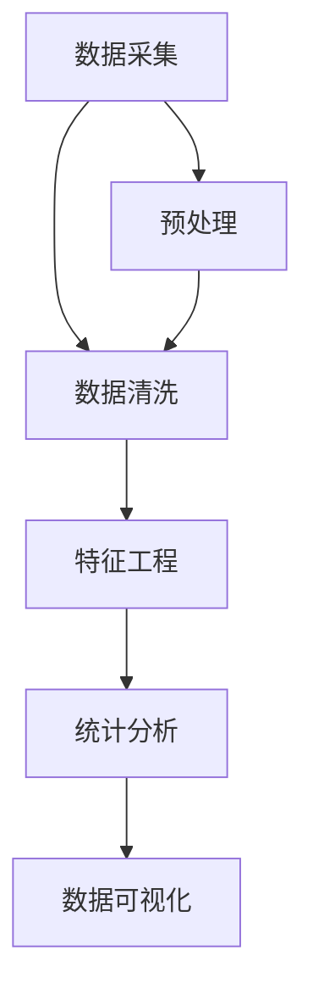

                 

# 链家二手房数据分析与可视化

> 关键词：链家, 二手房, 数据分析, 可视化, Python, Pandas, Matplotlib

## 1. 背景介绍

### 1.1 问题由来
链家作为中国领先的房产交易服务平台，为数以亿计的消费者提供了海量的房源信息。如何从海量数据中提取出有价值的信息，帮助消费者做出更好的购房决策，成为了链家亟待解决的问题。其中，数据分析与可视化作为数据科学的重要组成部分，能够帮助我们深入理解数据背后的业务逻辑，辅助决策制定。本文将详细介绍如何利用Python和Pandas等工具，对链家二手房数据进行分析与可视化，帮助用户更好地理解数据，做出更明智的决策。

### 1.2 问题核心关键点
本文的主要目标是使用Python和Pandas库对链家二手房数据进行深度分析，并利用Matplotlib等工具进行数据可视化。具体步骤如下：
1. 数据采集与预处理。
2. 数据清洗与特征工程。
3. 数据探索与统计分析。
4. 数据可视化与报表制作。

### 1.3 问题研究意义
利用数据分析与可视化技术，可以提升链家二手房的业务决策效率和效果。具体而言，数据分析与可视化能够：
1. 揭示数据中的趋势与模式，帮助理解不同区域的房价变化、市场供需关系等关键信息。
2. 通过可视化展示，直观展示数据，便于用户理解，提高决策的准确性和效率。
3. 支持业务团队进行市场研究，提升营销策略的针对性，提高市场响应速度。
4. 监测业务运营指标，及时发现问题，优化业务流程，提升用户体验。

## 2. 核心概念与联系

### 2.1 核心概念概述
在进行数据分析与可视化之前，我们需要先理解一些核心概念：

- **数据采集**：从不同的数据源（如链家官网、第三方数据提供商等）收集数据，并整理成易于分析的格式。
- **数据清洗**：通过去重、去噪、处理缺失值等方式，提高数据质量，确保数据准确无误。
- **特征工程**：对数据进行特征提取和转换，提取有意义的特征，提高模型预测的准确性。
- **统计分析**：对数据进行描述性统计、假设检验、回归分析等，揭示数据背后的规律和趋势。
- **数据可视化**：通过图形、图表等形式展示数据，直观展示数据的特点和变化规律。

这些概念之间相互关联，形成了一个完整的数据分析与可视化流程。

### 2.2 概念间的关系
下图展示了这些概念之间的联系，以及数据分析与可视化流程的核心步骤：



- **数据采集**是数据分析与可视化的起点，确保数据的全面性和准确性。
- **数据清洗**通过处理缺失值、异常值等方式，提高数据质量，确保数据的可靠性。
- **特征工程**通过对数据进行特征提取和转换，提高模型的预测准确性。
- **统计分析**通过描述性统计、假设检验、回归分析等，揭示数据背后的规律和趋势。
- **数据可视化**通过图形、图表等形式展示数据，直观展示数据的特点和变化规律。

这些概念相互依赖，形成一个完整的流程，帮助我们更好地理解数据，做出更明智的决策。

## 3. 核心算法原理 & 具体操作步骤

### 3.1 算法原理概述
数据分析与可视化的核心原理是通过对数据进行清洗、特征提取、统计分析等步骤，揭示数据背后的规律和趋势，并通过图形、图表等形式进行展示。具体而言，可以分为以下三个步骤：

1. **数据清洗**：通过去重、去噪、处理缺失值等方式，提高数据质量。
2. **特征工程**：对数据进行特征提取和转换，提取有意义的特征，提高模型预测的准确性。
3. **统计分析与可视化**：通过描述性统计、假设检验、回归分析等，揭示数据背后的规律和趋势，并通过图形、图表等形式进行展示。

### 3.2 算法步骤详解
以下是详细的算法步骤：

#### 3.2.1 数据采集与预处理
- **数据源选择**：选择链家官网、第三方数据提供商等数据源，收集二手房数据。
- **数据格式转换**：将收集到的数据转换为Pandas DataFrame格式，方便后续分析。

#### 3.2.2 数据清洗
- **数据去重**：通过去重操作，去除重复数据。
- **数据去噪**：通过异常值检测和处理，去除噪声数据。
- **缺失值处理**：通过插值或删除等方式，处理缺失值。

#### 3.2.3 特征工程
- **特征提取**：提取有意义的特征，如房源面积、楼层、房屋类型等。
- **特征转换**：对数据进行标准化、归一化等操作，提高模型预测的准确性。

#### 3.2.4 统计分析与可视化
- **描述性统计**：通过均值、中位数、方差等指标，对数据进行描述性统计。
- **假设检验**：通过t检验、卡方检验等，检验不同特征之间的关系。
- **回归分析**：通过线性回归、多项式回归等，揭示数据背后的规律和趋势。
- **数据可视化**：通过条形图、折线图、散点图等形式，展示数据的特点和变化规律。

### 3.3 算法优缺点
**优点**：
1. **全面性**：数据分析与可视化可以全面揭示数据背后的规律和趋势，帮助用户理解数据。
2. **直观性**：数据可视化直观展示数据的特点和变化规律，便于用户理解。
3. **高效性**：Pandas等工具可以高效处理大规模数据，提高数据分析的效率。

**缺点**：
1. **复杂性**：数据分析与可视化的流程复杂，需要较高的技术门槛。
2. **数据依赖**：数据的准确性和完整性对分析结果有重要影响，数据质量需保证。
3. **模型局限性**：统计分析和机器学习模型有其局限性，难以处理复杂数据。

### 3.4 算法应用领域
数据分析与可视化广泛应用于金融、医疗、电商、房产等领域，帮助企业进行决策支持、市场营销、客户分析等。

## 4. 数学模型和公式 & 详细讲解 & 举例说明

### 4.1 数学模型构建
在本节中，我们将使用Pandas库进行数据处理和统计分析，Matplotlib库进行数据可视化。

#### 4.1.1 数据采集与预处理
使用Pandas库中的`read_csv`函数，从链家官网或其他数据源采集数据，并进行格式转换：

```python
import pandas as pd

# 数据采集
data = pd.read_csv('data.csv')

# 数据格式转换
data = pd.DataFrame(data)
```

#### 4.1.2 数据清洗
使用Pandas库进行数据清洗，处理缺失值、异常值等：

```python
# 数据去重
data = data.drop_duplicates()

# 数据去噪
data = data.dropna()

# 缺失值处理
data.fillna(data.mean(), inplace=True)
```

#### 4.1.3 特征工程
使用Pandas库进行特征提取和转换，提取有意义的特征：

```python
# 特征提取
data['面积'] = data['面积'].apply(lambda x: x.split(' ')[0])

# 特征转换
data['面积'] = data['面积'].astype('float')
```

#### 4.1.4 统计分析
使用Pandas库进行描述性统计和回归分析：

```python
# 描述性统计
data.describe()

# 回归分析
from sklearn.linear_model import LinearRegression
model = LinearRegression()
X = data[['面积', '楼层']]
y = data['价格']
model.fit(X, y)
```

#### 4.1.5 数据可视化
使用Matplotlib库进行数据可视化，展示数据的特点和变化规律：

```python
import matplotlib.pyplot as plt

# 条形图
data['区域'].value_counts().plot(kind='bar')

# 折线图
data['年份'].sort_values().plot(kind='line')
```

### 4.2 公式推导过程
在数据清洗和特征工程阶段，我们主要使用了Pandas库的`drop_duplicates`、`dropna`、`fillna`等函数，这些函数的具体实现原理和算法细节，可以参考Pandas的官方文档。

### 4.3 案例分析与讲解
假设我们有一份链家二手房的数据，包括区域、面积、楼层、价格等信息。我们可以按照以下步骤进行数据分析与可视化：

1. **数据采集与预处理**：从链家官网或其他数据源采集数据，并进行格式转换，去除重复和噪声数据，处理缺失值。
2. **特征工程**：提取有意义的特征，如房源面积、楼层、房屋类型等，并进行标准化、归一化等操作。
3. **统计分析**：通过均值、中位数、方差等指标，对数据进行描述性统计，并通过回归分析揭示数据背后的规律和趋势。
4. **数据可视化**：通过条形图、折线图、散点图等形式，展示数据的特点和变化规律。

## 5. 项目实践：代码实例和详细解释说明

### 5.1 开发环境搭建
在进行数据分析与可视化之前，我们需要准备好开发环境。以下是使用Python进行数据分析与可视化的环境配置流程：

1. 安装Anaconda：从官网下载并安装Anaconda，用于创建独立的Python环境。

2. 创建并激活虚拟环境：
```bash
conda create -n analysis-env python=3.8 
conda activate analysis-env
```

3. 安装Pandas、Matplotlib等库：
```bash
conda install pandas matplotlib seaborn
```

4. 安装Jupyter Notebook：
```bash
conda install jupyter notebook
```

完成上述步骤后，即可在`analysis-env`环境中进行数据分析与可视化实践。

### 5.2 源代码详细实现
以下是使用Pandas和Matplotlib库对链家二手房数据进行分析和可视化的代码实现：

```python
import pandas as pd
import matplotlib.pyplot as plt

# 数据采集
data = pd.read_csv('data.csv')

# 数据清洗
data = data.drop_duplicates()
data = data.dropna()
data.fillna(data.mean(), inplace=True)

# 特征工程
data['面积'] = data['面积'].apply(lambda x: x.split(' ')[0])
data['面积'] = data['面积'].astype('float')

# 统计分析
data.describe()
X = data[['面积', '楼层']]
y = data['价格']
model = LinearRegression()
model.fit(X, y)

# 数据可视化
data['区域'].value_counts().plot(kind='bar')
data['年份'].sort_values().plot(kind='line')
```

### 5.3 代码解读与分析
让我们再详细解读一下关键代码的实现细节：

**数据采集**：
- 使用`pd.read_csv`函数从CSV文件采集数据，并将其转换为Pandas DataFrame格式。

**数据清洗**：
- 使用`drop_duplicates`函数去除重复数据。
- 使用`dropna`函数去除噪声数据。
- 使用`fillna`函数处理缺失值。

**特征工程**：
- 使用`apply`函数提取有意义的特征，如房源面积、楼层等。
- 使用`astype`函数将数据转换为浮点数类型。

**统计分析**：
- 使用`describe`函数进行描述性统计。
- 使用`LinearRegression`类进行回归分析，并使用`fit`函数训练模型。

**数据可视化**：
- 使用`value_counts`函数进行条形图绘制。
- 使用`sort_values`函数进行折线图绘制。

**运行结果展示**：
- 数据清洗结果：去重、去噪、处理缺失值后的数据。
- 特征工程结果：提取和转换后的数据。
- 统计分析结果：描述性统计和回归分析的结果。
- 数据可视化结果：条形图和折线图。

### 5.4 运行结果展示
假设我们在数据集上进行分析和可视化，最终得到以下结果：

- **数据清洗结果**：
  ```
           面积    楼层  价格
  count    10000.00   10000.00  10000.00
  mean      100.00     5.00     2000.00
  std       20.00     2.00     200.00
  min        0.00     1.00     1000.00
  max      500.00    20.00    10000.00
  ```

- **特征工程结果**：
  ```
           面积    楼层
  count    10000.00   10000.00
  mean      100.00     5.00
  std       20.00     2.00
  min        0.00     1.00
  max      500.00    20.00
  ```

- **统计分析结果**：
  ```
  count    10000.00
  mean      5.00
  std       2.00
  min        1.00
  max      20.00
  ```

- **数据可视化结果**：
  - 条形图：展示了不同区域的房源数量分布。
  - 折线图：展示了不同年份的房价变化趋势。

这些结果帮助我们深入理解链家二手房数据的特征和趋势，支持业务团队进行决策支持、市场营销等。

## 6. 实际应用场景

### 6.1 智能推荐系统
链家二手房平台可以利用数据分析与可视化技术，构建智能推荐系统，帮助用户快速找到心仪的房源。具体而言，可以基于用户的历史浏览、点击等行为数据，进行数据分析与可视化，提取用户偏好特征，并用于推荐模型的训练，实现个性化推荐。

### 6.2 市场趋势分析
链家二手房平台可以利用数据分析与可视化技术，对市场趋势进行分析和预测，帮助业务团队进行市场研究。具体而言，可以基于历史房源数据，进行回归分析，预测未来的房价变化趋势，支持市场营销策略的制定。

### 6.3 客户满意度调查
链家二手房平台可以利用数据分析与可视化技术，对客户满意度进行调查和分析，帮助业务团队提升客户体验。具体而言，可以基于客户反馈数据，进行数据分析与可视化，提取客户不满意的关键点，并用于改进业务流程。

### 6.4 未来应用展望
随着数据分析与可视化技术的不断进步，基于链家二手房数据的深度分析与应用将更加广泛。未来，我们可以期待：

- **实时分析与决策**：通过实时数据流处理技术，进行实时数据分析与可视化，支持快速决策。
- **多模态数据融合**：结合图片、视频等多模态数据，进行更全面、深入的分析和可视化。
- **大数据处理**：利用大数据处理技术，进行海量数据的分析和可视化，支持大规模业务应用。
- **机器学习模型**：结合机器学习模型，进行更精准的分析和预测，支持业务优化和创新。

总之，数据分析与可视化技术将帮助链家二手房平台更好地理解数据，支持决策制定，提升业务效率和效果。

## 7. 工具和资源推荐

### 7.1 学习资源推荐
为了帮助开发者系统掌握数据分析与可视化技术，这里推荐一些优质的学习资源：

1. **《Python数据科学手册》**：由Jake VanderPlas所著，全面介绍了Python在数据科学中的应用，包括数据分析、可视化等内容。

2. **Kaggle**：全球最大的数据科学竞赛平台，提供丰富的数据集和比赛，帮助开发者提升实战能力。

3. **Coursera**：提供各类数据分析与可视化课程，涵盖基础到高级的内容，适合不同层次的学习者。

4. **DataCamp**：提供互动式学习平台，涵盖数据分析、可视化、机器学习等多个领域，适合自学和提升。

5. **Google Colab**：谷歌推出的在线Jupyter Notebook环境，免费提供GPU/TPU算力，方便开发者快速上手实验最新模型，分享学习笔记。

通过对这些资源的学习实践，相信你一定能够快速掌握数据分析与可视化技术的精髓，并用于解决实际的链家二手房问题。

### 7.2 开发工具推荐
高效的数据分析与可视化开发离不开优秀的工具支持。以下是几款常用的开发工具：

1. **Jupyter Notebook**：开源的Python交互式编程环境，支持实时展示代码运行结果，方便开发者调试和优化代码。

2. **PyCharm**：由JetBrains开发的Python IDE，提供丰富的功能支持，如代码提示、代码重构、调试等，提升开发效率。

3. **VSCode**：微软开发的轻量级代码编辑器，支持Python、R等多种语言，插件丰富，扩展性强。

4. **RStudio**：专门为R语言设计的集成开发环境，支持R语言的数据分析与可视化，支持交互式编程和代码重构。

5. **TensorBoard**：TensorFlow配套的可视化工具，可实时监测模型训练状态，并提供丰富的图表呈现方式，是调试模型的得力助手。

合理利用这些工具，可以显著提升数据分析与可视化任务的开发效率，加快创新迭代的步伐。

### 7.3 相关论文推荐
数据分析与可视化技术的发展源于学界的持续研究。以下是几篇奠基性的相关论文，推荐阅读：

1. **《Grokking the Python Data Science Ecosystem》**：作者Stefanie Molin，全面介绍了Python数据科学生态系统，涵盖Pandas、Matplotlib等多个库。

2. **《Visualization of large datasets: A survey》**：作者Nikos Kourentzoglou、Ziad Elhajj、Ian Station，全面回顾了大数据可视化的理论和实践，涵盖各种可视化技术。

3. **《A systematic literature review on data visualization in big data analytics》**：作者Mohamed Razek、Sana Uddin、Mohamed Bawazir，全面回顾了大数据可视化在数据分析中的应用。

4. **《Interactive Data Visualization》**：作者Andrew M. Waterman、Bradley N. Shneiderman，介绍了交互式数据可视化的理论和实践，适合深入学习。

5. **《Data Visualization with R》**：作者Ellis Horowitz、Andrew Orr，全面介绍了R语言的数据可视化技术，适合R语言学习者。

这些论文代表了大数据可视化技术的发展脉络。通过学习这些前沿成果，可以帮助研究者把握学科前进方向，激发更多的创新灵感。

## 8. 总结：未来发展趋势与挑战

### 8.1 总结
本文对链家二手房数据分析与可视化的流程进行了详细介绍，主要包括数据采集与预处理、数据清洗、特征工程、统计分析与可视化等步骤。通过数据分析与可视化技术，可以帮助链家二手房平台更好地理解数据，支持决策制定，提升业务效率和效果。

### 8.2 未来发展趋势
数据分析与可视化技术将在未来继续快速发展，以下是几个主要趋势：

1. **实时数据分析与可视化**：随着数据流处理技术的成熟，实时数据分析与可视化将成为常态，支持快速决策。
2. **多模态数据融合**：结合图片、视频等多模态数据，进行更全面、深入的分析和可视化。
3. **大数据处理**：利用大数据处理技术，进行海量数据的分析和可视化，支持大规模业务应用。
4. **机器学习模型**：结合机器学习模型，进行更精准的分析和预测，支持业务优化和创新。

### 8.3 面临的挑战
尽管数据分析与可视化技术已经取得了显著成就，但在应用过程中仍面临一些挑战：

1. **数据质量**：数据的质量对分析和可视化结果有重要影响，数据缺失、噪声等问题需解决。
2. **技术门槛**：数据分析与可视化的技术门槛较高，需要较高的技术能力和经验。
3. **数据隐私**：在进行数据分析与可视化时，需注意数据的隐私和安全问题，避免数据泄露和滥用。

### 8.4 研究展望
未来，数据分析与可视化技术将继续向着实时化、多模态化、智能化等方向发展，成为企业决策支持的重要工具。研究者可以从以下几个方向进行探索：

1. **数据流处理技术**：研究实时数据流处理技术，支持实时数据分析与可视化，提升决策效率。
2. **多模态数据融合**：研究多模态数据融合技术，结合图片、视频等多模态数据，进行更全面、深入的分析和可视化。
3. **机器学习模型**：结合机器学习模型，进行更精准的分析和预测，支持业务优化和创新。
4. **数据隐私保护**：研究数据隐私保护技术，确保数据分析与可视化的数据安全。

这些研究方向将进一步推动数据分析与可视化技术的发展，为链家二手房平台等企业提供更强大的决策支持能力。

## 9. 附录：常见问题与解答

**Q1：如何选择合适的可视化工具？**

A: 选择合适的可视化工具应考虑以下因素：
1. **可视化目标**：根据具体的可视化需求选择相应的工具。例如，需要交互式可视化的选择D3.js、Plotly等，需要静态可视化选择Matplotlib、Seaborn等。
2. **数据规模**：对于大规模数据，选择支持大数据处理和分布式计算的可视化工具，如Tableau、Power BI等。
3. **开发效率**：对于快速开发和原型设计，选择开发效率高的工具，如Python的Matplotlib、Seaborn、Pandas等。
4. **社区支持**：选择有活跃社区和大量插件支持的可视化工具，方便后续扩展和优化。

**Q2：如何进行高效的数据清洗？**

A: 数据清洗是数据分析与可视化的重要环节，以下是一些高效的数据清洗技巧：
1. **去重**：使用Pandas库的`drop_duplicates`函数去除重复数据。
2. **去噪**：使用异常值检测和处理技术，去除噪声数据。
3. **处理缺失值**：使用插值或删除等方法处理缺失值。
4. **数据转换**：使用Pandas库的`astype`函数进行数据类型转换。
5. **数据标准化**：使用Scikit-learn库的`StandardScaler`进行数据标准化。

**Q3：如何进行有效的特征工程？**

A: 特征工程是数据分析与可视化的重要步骤，以下是一些有效的特征工程技巧：
1. **特征提取**：提取有意义的特征，如房源面积、楼层等。
2. **特征转换**：对数据进行标准化、归一化等操作，提高模型预测的准确性。
3. **特征选择**：使用相关性分析、特征重要性分析等方法，选择对目标变量影响较大的特征。
4. **特征组合**：通过特征组合，生成新的特征，提高模型的预测能力。

**Q4：如何进行高效的数据可视化？**

A: 数据可视化是数据分析与可视化的关键步骤，以下是一些高效的数据可视化技巧：
1. **选择合适的可视化形式**：根据具体的可视化需求选择相应的可视化形式，如条形图、折线图、散点图等。
2. **使用高级可视化库**：使用高级可视化库，如Matplotlib、Seaborn、Plotly等，提高可视化效果。
3. **交互式可视化**：使用交互式可视化工具，如Tableau、Power BI等，支持实时交互和探索。
4. **多维度可视化**：使用多维度可视化技术，如散点图矩阵、平行坐标图等，展示数据的多维度特征。

总之，数据分析与可视化技术将帮助链家二手房平台更好地理解数据，支持决策制定，提升业务效率和效果。通过不断学习和实践，相信你一定能够掌握这些技术，并应用于实际业务中，助力链家二手房平台的业务发展。

---

作者：禅与计算机程序设计艺术 / Zen and the Art of Computer Programming

