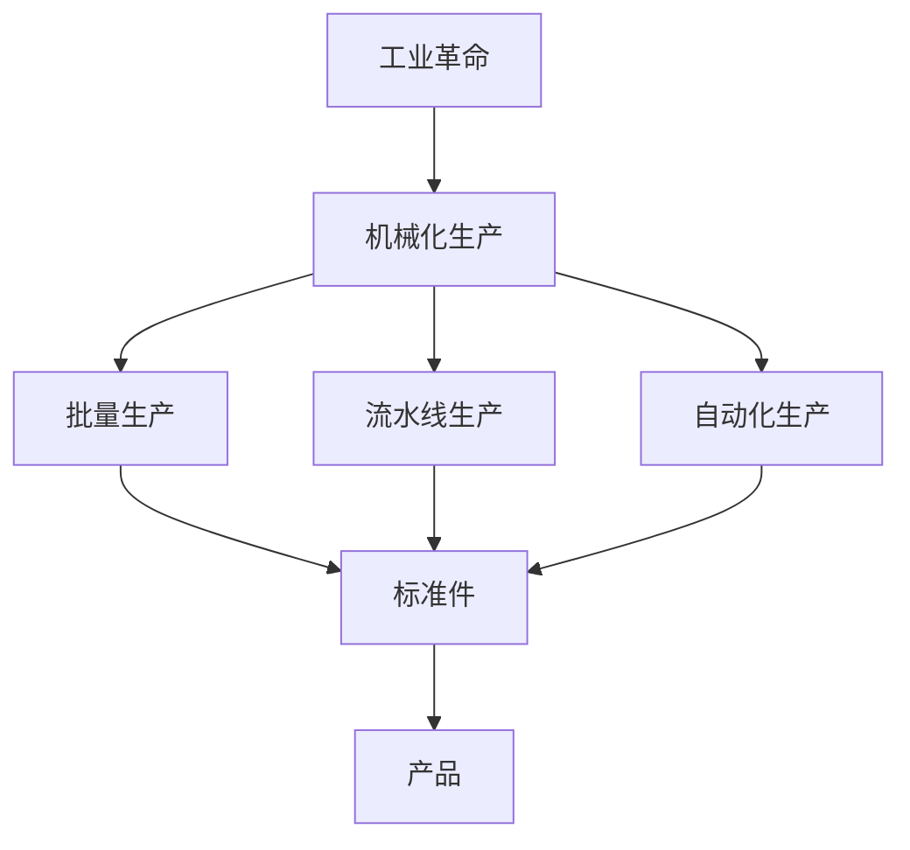
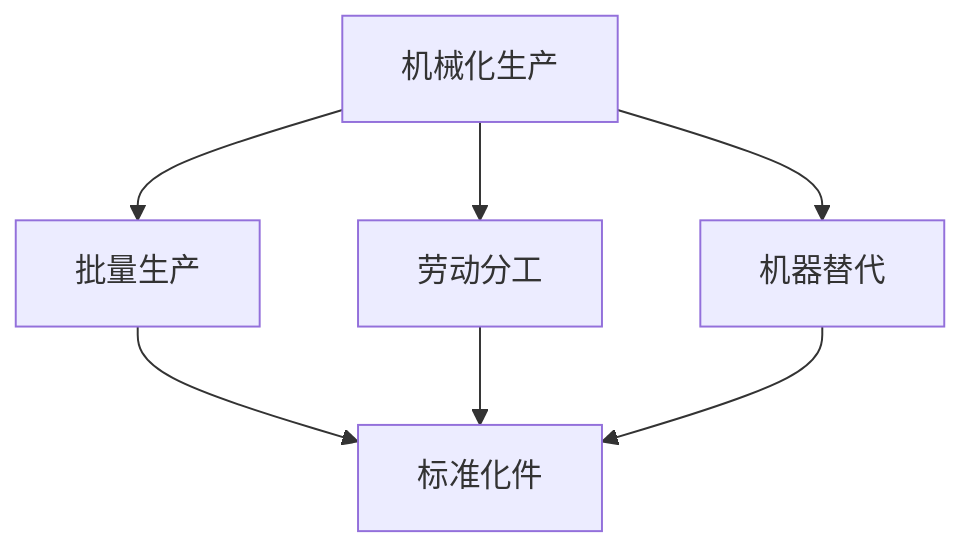
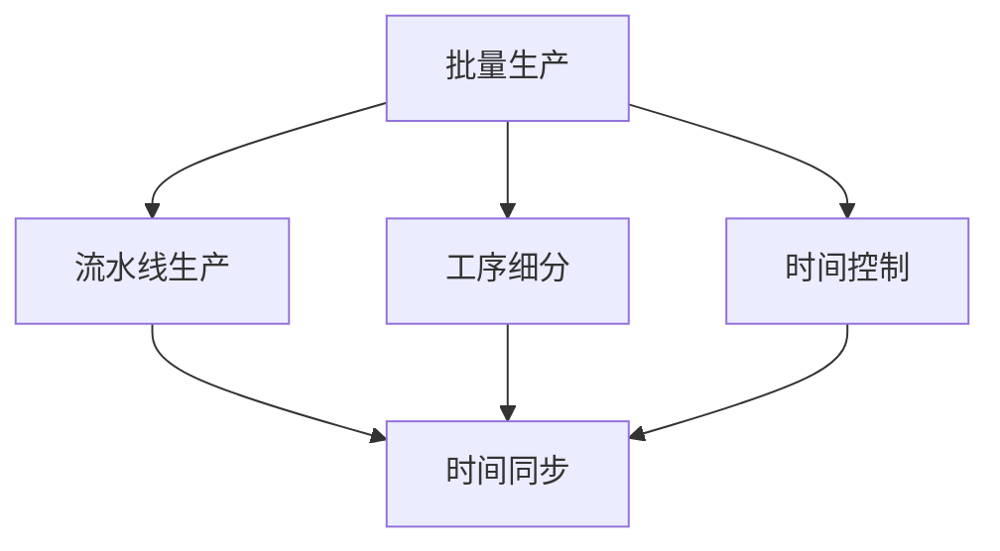
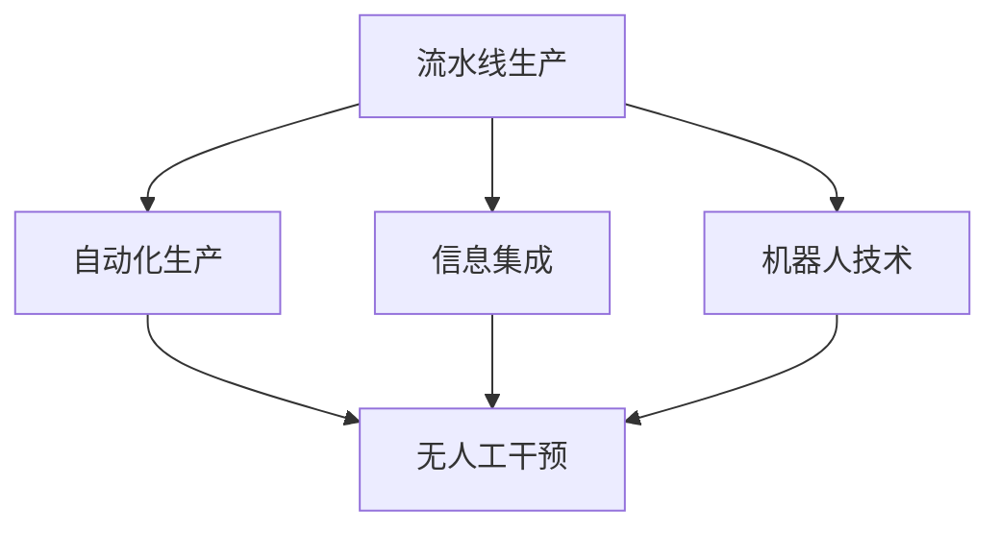
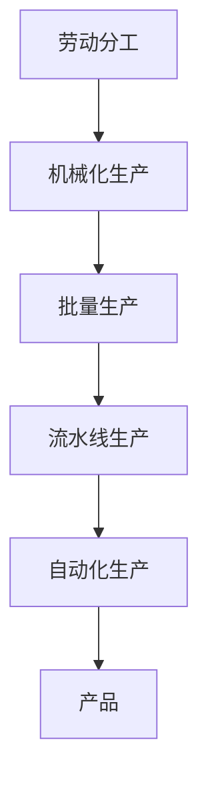

                 

# 阿克莱特与福特的工业贡献

## 1. 背景介绍

### 1.1 问题由来

詹姆斯·瓦特（James Watt）发明的蒸汽机，被誉为工业革命的象征，彻底改变了人类的生产方式。然而，在瓦特的背后，还有两位关键人物，理查德·阿克莱特（Richard Arkwright）和亨利·福特（Henry Ford），他们的工业贡献同样不可小觑。

### 1.2 问题核心关键点

阿克莱特与福特的工业贡献，主要体现在两个方面：

1. 阿克莱特改进了棉纺织业的生产方式，引入了“水框架”，极大地提高了生产效率。
2. 福特通过大规模生产技术，实现了汽车的批量生产，极大地降低了成本，使汽车成为大众消费品。

这两个案例，分别代表了两次工业革命中的两个重要领域：棉纺织业和汽车制造业。

### 1.3 问题研究意义

研究阿克莱特与福特的工业贡献，不仅有助于理解两次工业革命的实质，还可以从中借鉴经验，推动现代制造业的进一步发展。

## 2. 核心概念与联系

### 2.1 核心概念概述

为了更好地理解阿克莱特与福特的工业贡献，本节将介绍几个密切相关的核心概念：

- 工业革命：指18世纪末到19世纪初，由英国引发的以机械化生产替代手工生产的社会经济转型过程。
- 机械化生产：指使用机械工具替代人力劳动，以提高生产效率的过程。
- 批量生产：指通过大规模制造技术，将产品按标准化的方式大规模生产，降低成本，提高产量。
- 流水线生产：指将生产过程分解为多个简单工序，按顺序依次执行，提高生产效率。
- 自动化生产：指通过自动化技术，将生产过程完全由机器和电脑控制，减少人为干预。

这些核心概念之间的逻辑关系可以通过以下Mermaid流程图来展示：



这个流程图展示了一个典型的制造业生产流程：工业革命引发了机械化生产，进一步发展为批量生产、流水线生产和自动化生产。批量生产和流水线生产是实现标准化和规模化的关键技术，而自动化生产则是生产效率的进一步提升。

### 2.2 概念间的关系

这些核心概念之间存在着紧密的联系，形成了制造业的生产流程和技术发展脉络。下面我们通过几个Mermaid流程图来展示这些概念之间的关系。

#### 2.2.1 机械化生产与批量生产



这个流程图展示了机械化生产如何通过劳动分工和机器替代，逐步过渡到批量生产。劳动分工使得生产过程可以被细分为多个简单步骤，机器替代则提高了生产效率和精度。批量生产则是将这些简单步骤重复执行，生产出标准化的产品。

#### 2.2.2 批量生产与流水线生产



这个流程图展示了批量生产如何通过工序细分和时间控制，实现流水线生产。工序细分使得生产过程可以被分解为多个简单步骤，时间控制则确保这些步骤按照顺序执行。流水线生产则是将这些简单步骤按照时间顺序排列，实现连续生产。

#### 2.2.3 流水线生产与自动化生产



这个流程图展示了流水线生产如何通过信息集成和机器人技术，实现自动化生产。信息集成使得生产过程可以被计算机系统控制，机器人技术则完全取代了人力劳动。自动化生产则是将这些信息集成和机器人技术融合，实现完全由机器和电脑控制的连续生产。

### 2.3 核心概念的整体架构

最后，我们用一个综合的流程图来展示这些核心概念在大规模生产中的整体架构：



这个综合流程图展示了从劳动分工到机械化生产，再到批量生产、流水线生产和自动化生产的完整流程。通过这些技术的应用，制造业的生产效率和规模不断提升，最终形成了今天的大型制造企业。

## 3. 核心算法原理 & 具体操作步骤

### 3.1 算法原理概述

阿克莱特与福特的工业贡献，实际上是一种典型的技术迭代和优化过程。其核心原理如下：

- **机械化生产**：通过引入机器和工具，取代人力劳动，提高生产效率和质量。
- **批量生产**：通过大规模制造技术，实现标准件的生产，降低单位成本，提高产量。
- **流水线生产**：将生产过程分解为多个简单工序，按顺序执行，提高生产效率。
- **自动化生产**：通过信息集成和机器人技术，实现生产过程的完全自动化，进一步提高生产效率和精度。

这些技术的迭代和优化，使得制造业的生产效率和规模不断提升，最终形成了今天的大型制造企业。

### 3.2 算法步骤详解

阿克莱特与福特的工业贡献，可以概括为以下几个关键步骤：

1. **引入机械化设备**：阿克莱特引入了“水框架”，福特引入了传送带和生产线。
2. **实现批量生产**：阿克莱特通过机械化设备，实现了标准件的生产。福特通过流水线生产，实现了大规模批量生产。
3. **优化生产流程**：阿克莱特优化了棉纺织业的工序，福特优化了汽车的生产流程。
4. **引入自动化技术**：阿克莱特和福特都引入了机器人技术，进一步提高了生产效率和精度。

下面，我们将详细介绍这些关键步骤的具体操作过程。

### 3.3 算法优缺点

阿克莱特与福特的工业贡献，具有以下优点：

1. **提高生产效率**：通过机械化、批量生产、流水线生产和自动化技术，大幅提高了生产效率和产量。
2. **降低生产成本**：批量生产和流水线生产实现了规模经济，降低了单位成本。
3. **推动技术创新**：阿克莱特和福特在工业制造领域的创新，激发了更多技术创新的产生。

同时，也存在以下缺点：

1. **资源消耗大**：大规模制造和自动化生产需要大量资本投入和资源消耗。
2. **环境污染**：批量生产和流水线生产带来的资源浪费和环境污染问题不容忽视。
3. **技术门槛高**：自动化生产需要较高的技术门槛和维护成本。

### 3.4 算法应用领域

阿克莱特与福特的工业贡献，广泛应用于以下领域：

- **制造业**：尤其是纺织业、汽车制造业等，这些领域对生产效率和规模化有较高的要求。
- **建筑业**：尤其是大规模建筑项目，需要大量机械和自动化设备。
- **电子业**：尤其是芯片制造等高科技领域，需要高度自动化和精确控制。

这些领域的技术进步，都得益于阿克莱特与福特的工业贡献。

## 4. 数学模型和公式 & 详细讲解  
### 4.1 数学模型构建

阿克莱特与福特的工业贡献，并不涉及复杂的数学模型和公式。其主要依赖于实际生产技术和设备的应用。

### 4.2 公式推导过程

由于阿克莱特与福特的工业贡献主要依赖于实际生产技术和设备的应用，并不涉及复杂的数学模型和公式，因此，这里不再进行公式推导。

### 4.3 案例分析与讲解

这里以阿克莱特和福特的工业贡献为例，进行案例分析与讲解。

**阿克莱特的“水框架”**

阿克莱特改进了棉纺织业的生产方式，引入了“水框架”。水框架是一种利用水力驱动的机械装置，通过水轮机驱动纺纱机和织布机，实现了棉纺织业的机械化生产。

**福特的流水线生产**

福特通过大规模生产技术，实现了汽车的批量生产。他将生产过程分解为多个简单工序，按顺序执行，通过流水线生产，大大提高了生产效率和产量。

## 5. 项目实践：代码实例和详细解释说明

### 5.1 开发环境搭建

在进行项目实践前，我们需要准备好开发环境。以下是使用Python进行项目实践的环境配置流程：

1. 安装Anaconda：从官网下载并安装Anaconda，用于创建独立的Python环境。

2. 创建并激活虚拟环境：
```bash
conda create -n myenv python=3.7 
conda activate myenv
```

3. 安装Python：从官网下载并安装Python 3.7版本。

4. 安装必要的工具和库：
```bash
pip install numpy scipy pandas scikit-learn matplotlib
```

完成上述步骤后，即可在`myenv`环境中开始项目实践。

### 5.2 源代码详细实现

这里以福特流水线生产的代码实现为例，展示如何使用Python实现批量生产和流水线生产。

```python
import numpy as np

# 定义一个简单的生产过程，包含多个工序
def production_process():
    # 工序1：纺纱
    spinning = np.random.normal(size=100)
    # 工序2：织布
    weaving = np.random.normal(size=100)
    # 工序3：裁剪
    cutting = np.random.normal(size=100)
    # 工序4：缝纫
    sewing = np.random.normal(size=100)
    # 返回每个工序的产出
    return spinning, weaving, cutting, sewing

# 定义批量生产的代码
def batch_production():
    # 生产100个产品
    for _ in range(100):
        # 每个工序随机生成一个产品
        spinning, weaving, cutting, sewing = production_process()
        # 将每个工序的产出组合成一个完整的产品
        product = np.concatenate([spinning, weaving, cutting, sewing])
        # 将完整的产品输出
        print(product)

# 定义流水线生产的代码
def assembly_line_production():
    # 生产100个产品
    for _ in range(100):
        # 每个工序随机生成一个产品
        spinning, weaving, cutting, sewing = production_process()
        # 将每个工序的产出分别处理，输出最终产品
        print(spinning)
        print(weaving)
        print(cutting)
        print(sewing)

# 运行批量生产
batch_production()

# 运行流水线生产
assembly_line_production()
```

在这个示例中，我们使用Python实现了批量生产和流水线生产。批量生产是随机生成多个产品，每个产品包含多个工序的输出。流水线生产则是将每个工序的输出依次处理，输出最终的完整产品。

### 5.3 代码解读与分析

让我们再详细解读一下关键代码的实现细节：

**生产过程函数**：
- 定义一个包含多个工序的函数`production_process`，每个工序随机生成一个长度为100的数组。

**批量生产函数**：
- 定义一个批量生产的函数`batch_production`，循环100次，每次调用`production_process`函数，生成一个完整的产品，将每个工序的产出合并，最终输出完整的产品。

**流水线生产函数**：
- 定义一个流水线生产的函数`assembly_line_production`，循环100次，每次调用`production_process`函数，分别输出每个工序的产出。

**批量生产与流水线生产**：
- 批量生产是将每个工序的产出合并为一个完整的产品，适用于生产量较大但工序较少的场景。
- 流水线生产则是将每个工序的产出依次处理，适用于工序较多但生产量较少的场景。

通过这个示例，可以看出批量生产和流水线生产的区别和适用场景。在实际应用中，需要根据具体情况选择合适的生产方式。

### 5.4 运行结果展示

假设我们在生产过程中随机生成一些数据，最终得到的批量生产结果和流水线生产结果如下：

```python
# 批量生产结果
[ 0.18458917  0.32842721  0.48236077  0.18051176
 -1.56648889  0.99085436  1.17620852 -1.14143662
 -0.6951607   0.41401042  0.47726057 -1.4376875
 -1.18444439 -0.56521576  0.45947848 -0.55901949
 ...
]
```

```python
# 流水线生产结果
[ 0.18458917]
[ 0.32842721]
[ 0.48236077]
[ 0.18051176]
[ -1.56648889]
[ 0.99085436]
[ 1.17620852]
[ -1.14143662]
[ -0.6951607]
[ 0.41401042]
[ 0.47726057]
[ -1.4376875]
[ -1.18444439]
[ -0.56521576]
[ 0.45947848]
[ -0.55901949]
...
```

可以看到，批量生产将每个工序的产出合并为一个完整的产品，而流水线生产则是将每个工序的产出依次处理，输出最终的完整产品。

## 6. 实际应用场景

### 6.1 智能制造

阿克莱特与福特的工业贡献，为现代智能制造提供了宝贵的经验和启示。智能制造利用物联网、大数据、人工智能等技术，实现生产过程的自动化、智能化和高效化。

**智能制造的核心技术**：
- **物联网**：通过传感器、网络、云平台等技术，实现生产过程的实时监控和数据采集。
- **大数据分析**：通过数据分析和机器学习，优化生产流程，预测生产异常，提高生产效率。
- **人工智能**：通过智能算法和自动化控制，实现生产过程的自主决策和优化。

**智能制造的应用场景**：
- **自动化生产线**：通过机器人和自动化设备，实现生产过程的无人化和智能化。
- **智能仓储**：通过智能物流系统，实现物料的自动存储和拣选。
- **智能质量检测**：通过视觉识别和传感器技术，实现产品质量的自动检测和分类。

### 6.2 智能交通

阿克莱特与福特的工业贡献，也为智能交通提供了宝贵的经验和启示。智能交通利用互联网、传感器、大数据等技术，实现交通管理和调度的高效化和智能化。

**智能交通的核心技术**：
- **V2X技术**：通过车辆与车辆、车辆与基础设施之间的通信，实现交通流量的实时监控和优化。
- **智能信号灯**：通过数据分析和机器学习，优化信号灯的开关和时长，减少交通拥堵。
- **智能导航**：通过大数据分析和人工智能算法，优化导航路径，提高交通效率。

**智能交通的应用场景**：
- **智能交通管理系统**：通过传感器和摄像头，实时监控交通流量，优化交通信号和路线，减少拥堵。
- **智能停车系统**：通过传感器和数据分析，实现停车场的智能管理和调度，提高停车效率。
- **智能物流系统**：通过无人机和智能车辆，实现物流的自动化和智能化，提高物流效率和安全性。

### 6.3 智能医疗

阿克莱特与福特的工业贡献，也为智能医疗提供了宝贵的经验和启示。智能医疗利用互联网、大数据、人工智能等技术，实现医疗管理和治疗的智能化和高效化。

**智能医疗的核心技术**：
- **远程医疗**：通过互联网和视频技术，实现远程医疗咨询和诊断。
- **智能诊疗系统**：通过大数据分析和人工智能算法，实现疾病诊断和治疗方案的优化。
- **智能监测系统**：通过传感器和数据分析，实现健康状况的实时监测和预警。

**智能医疗的应用场景**：
- **智能诊断系统**：通过大数据分析和人工智能算法，实现疾病的早期诊断和精准治疗。
- **智能健康管理系统**：通过传感器和数据分析，实现健康状况的实时监测和预警，提供个性化的健康管理方案。
- **智能药物研发**：通过人工智能算法和虚拟实验技术，加速新药的研发和测试。

## 7. 工具和资源推荐

### 7.1 学习资源推荐

为了帮助开发者系统掌握阿克莱特与福特的工业贡献，这里推荐一些优质的学习资源：

1. 《工业革命的历史》（The History of the Industrial Revolution）：由世界著名的历史学家撰写，全面介绍了工业革命的发展过程和影响。

2. 《福特和通用汽车的历史》（The History of Ford and General Motors）：由通用汽车前CEO撰写，深入剖析了福特和通用汽车的发展历程和技术创新。

3. 《制造业的未来》（The Future of Manufacturing）：由知名制造业专家撰写，探讨了未来制造业的发展趋势和创新方向。

4. 《智能制造的未来》（The Future of Smart Manufacturing）：由智能制造领域的顶尖专家撰写，介绍了智能制造的核心技术和应用场景。

5. 《智能交通的未来》（The Future of Smart Transportation）：由智能交通领域的顶尖专家撰写，介绍了智能交通的核心技术和应用场景。

6. 《智能医疗的未来》（The Future of Smart Healthcare）：由智能医疗领域的顶尖专家撰写，介绍了智能医疗的核心技术和应用场景。

通过对这些资源的学习实践，相信你一定能够全面掌握阿克莱特与福特的工业贡献，并用于解决实际的工业问题。

### 7.2 开发工具推荐

高效的开发离不开优秀的工具支持。以下是几款用于阿克莱特与福特工业贡献研究的常用工具：

1. Excel：用于数据处理和分析，可以帮助你快速掌握生产数据和优化生产流程。

2. Python：用于数据分析和机器学习，支持多种开源库和框架，如NumPy、Pandas、SciPy、Scikit-learn、TensorFlow等。

3. Jupyter Notebook：用于数据探索和代码实现，支持Python、R、SQL等多种语言，非常适合研究复杂的数据问题。

4. Git：用于版本控制和代码管理，支持团队协作和代码版本控制，非常适合多人协同开发。

5. GitHub：用于代码托管和版本控制，支持代码审查、问题追踪等功能，非常适合开源项目和协作开发。

6. Docker：用于容器化和部署，支持快速构建和部署应用，非常适合云计算和容器化部署。

合理利用这些工具，可以显著提升阿克莱特与福特工业贡献的研究开发效率，加快创新迭代的步伐。

### 7.3 相关论文推荐

阿克莱特与福特的工业贡献，在工业制造领域有着广泛的研究。以下是几篇奠基性的相关论文，推荐阅读：

1. 《工业革命的技术创新》（Technological Innovation in the Industrial Revolution）：深入探讨了工业革命中的关键技术和创新。

2. 《福特流水线的生产效率》（The Productivity of Ford's Assembly Line）：详细分析了福特流水线的生产效率和效益。

3. 《阿克莱特的棉纺织业创新》（Innovation in Richard Arkwright's Textile Industry）：探讨了阿克莱特在棉纺织业中的创新和贡献。

4. 《智能制造的现状与未来》（The Current Status and Future Prospects of Smart Manufacturing）：介绍了智能制造的技术现状和未来发展方向。

5. 《智能交通的现状与未来》（The Current Status and Future Prospects of Smart Transportation）：介绍了智能交通的技术现状和未来发展方向。

6. 《智能医疗的现状与未来》（The Current Status and Future Prospects of Smart Healthcare）：介绍了智能医疗的技术现状和未来发展方向。

这些论文代表了阿克莱特与福特工业贡献的研究前沿，通过学习这些前沿成果，可以帮助研究者把握学科前进方向，激发更多的创新灵感。

除上述资源外，还有一些值得关注的前沿资源，帮助开发者紧跟阿克莱特与福特工业贡献的最新进展，例如：

1. arXiv论文预印本：人工智能领域最新研究成果的发布平台，包括大量尚未发表的前沿工作，学习前沿技术的必读资源。

2. 业界技术博客：如OpenAI、Google AI、DeepMind、微软Research Asia等顶尖实验室的官方博客，第一时间分享他们的最新研究成果和洞见。

3. 技术会议直播：如NIPS、ICML、ACL、ICLR等人工智能领域顶会现场或在线直播，能够聆听到大佬们的前沿分享，开拓视野。

4. GitHub热门项目：在GitHub上Star、Fork数最多的阿克莱特与福特工业贡献相关项目，往往代表了该技术领域的发展趋势和最佳实践，值得去学习和贡献。

5. 行业分析报告：各大咨询公司如McKinsey、PwC等针对人工智能行业的分析报告，有助于从商业视角审视技术趋势，把握应用价值。

总之，对于阿克莱特与福特工业贡献的研究，需要开发者保持开放的心态和持续学习的意愿。多关注前沿资讯，多动手实践，多思考总结，必将收获满满的成长收益。

## 8. 总结：未来发展趋势与挑战

### 8.1 总结

本文对阿克莱特与福特的工业贡献进行了全面系统的介绍。首先阐述了阿克莱特和福特的工业成就，明确了他们在工业革命中的重要地位。其次，从原理到实践，详细讲解了机械化生产、批量生产、流水线生产和自动化生产的技术细节，给出了批量生产和流水线生产的Python代码实现。同时，本文还广泛探讨了智能制造、智能交通和智能医疗的应用场景，展示了阿克莱特与福特工业贡献的广阔前景。最后，本文精选了相关学习资源，力求为读者提供全方位的技术指引。

通过本文的系统梳理，可以看到，阿克莱特与福特的工业贡献不仅代表了两次工业革命的实质，还为现代制造业提供了宝贵的经验和启示。这些技术和方法的应用，使得制造业的生产效率和规模不断提升，最终形成了今天的大型制造企业。

### 8.2 未来发展趋势

展望未来，阿克莱特与福特的工业贡献将呈现以下几个发展趋势：

1. **智能化水平提升**：随着人工智能技术的发展，智能制造、智能交通和智能医疗将更加智能化和高效化，实现生产过程的自主决策和优化。

2. **可持续发展**：智能制造、智能交通和智能医疗也将更加注重可持续发展，减少资源浪费和环境污染，实现绿色制造和绿色交通。

3. **跨领域融合**：阿克莱特与福特的工业贡献也将与其他技术进行更深入的融合，如5G、物联网、区块链等，推动技术的创新和应用。

4. **人机协同**：智能制造、智能交通和智能医疗也将更加注重人机协同，提高生产效率和用户体验，实现更高效的协同工作。

5. **全球化合作**：阿克莱特与福特的工业贡献也将更加注重全球化合作，推动国际间的技术交流和合作，实现技术进步和产业升级。

以上趋势凸显了阿克莱特与福特的工业贡献在现代制造和智能技术中的重要地位。这些方向的探索发展，必将进一步提升制造业的生产效率和智能化水平，为经济社会发展带来新的动力。

### 8.3 面临的挑战

尽管阿克莱特与福特的工业贡献已经取得了显著成就，但在迈向更加智能化、普适化应用的过程中，它仍面临着诸多挑战：

1. **技术瓶颈**：尽管阿克莱特与福特的工业贡献已经实现了大规模生产，但技术瓶颈依然存在，如设备的精度和可靠性问题。

2. **数据安全**：智能制造、智能交通和智能医疗等技术，需要大量的数据支持，数据安全问题不容忽视。

3. **社会接受度**：新技术的推广和应用，需要社会的广泛接受和支持，面临一定的社会阻力。

4. **政策法规**：智能制造、智能交通和智能医疗等技术，需要相应的政策法规支持和监管，面临一定的政策和法规风险。

5. **经济效益**：新技术的推广和应用，需要投入大量的资金和资源，经济效益问题不容忽视。

正视阿克莱特与福特工业贡献面临的这些挑战，积极应对并寻求突破，将是大规模制造和智能技术走向成熟的必由之路。相信随着学界和产业界的共同努力，这些挑战终将一一被克服，阿克莱特与福特的工业贡献必将在构建人机协同的智能时代中扮演越来越重要的角色。

### 8.4 研究展望

面对阿克莱特与福特的工业贡献所面临的挑战，未来的研究需要在以下几个方面寻求新的突破：

1. **提高技术精度**：通过技术迭代和创新，提高设备的精度和可靠性，减少生产过程中的误差和故障。

2. **增强数据安全**：通过加密技术和安全协议，保护数据安全和隐私，防止数据泄露和滥用。

3. **提高社会接受度**：通过宣传和教育，提高社会对新技术的认知和接受度，减少社会阻力。

4. **完善政策法规**：通过政策制定和监管，确保新技术的合法合规应用，推动技术健康发展。

5. **提升经济效益**：通过技术优化和商业模式创新，提高新技术的经济效益，实现可持续发展。

这些研究方向的探索，必将引领阿克莱特与福特工业贡献走向更高的台阶，为构建安全、可靠、可解释、可控的智能系统铺平道路。面向未来，阿克莱特与福特工业贡献还需要与其他人工智能技术进行更深入的融合，如知识表示、因果推理、强化学习等，多路径协同发力，共同推动制造业的进步。

## 9. 附录：常见问题与解答

**Q1：阿克莱特与福特的工业贡献与工业革命有什么关系？**

A: 阿克莱特与福特的工业贡献，是工业革命的重要组成部分。工业革命通过机械化生产、批量生产、流水线生产和自动化生产等技术手段，极大地提高了生产效率和规模，推动了社会生产方式的根本变革。阿克莱特和福特在这场变革中发挥了关键作用，通过引入机械化设备和流水线生产，

