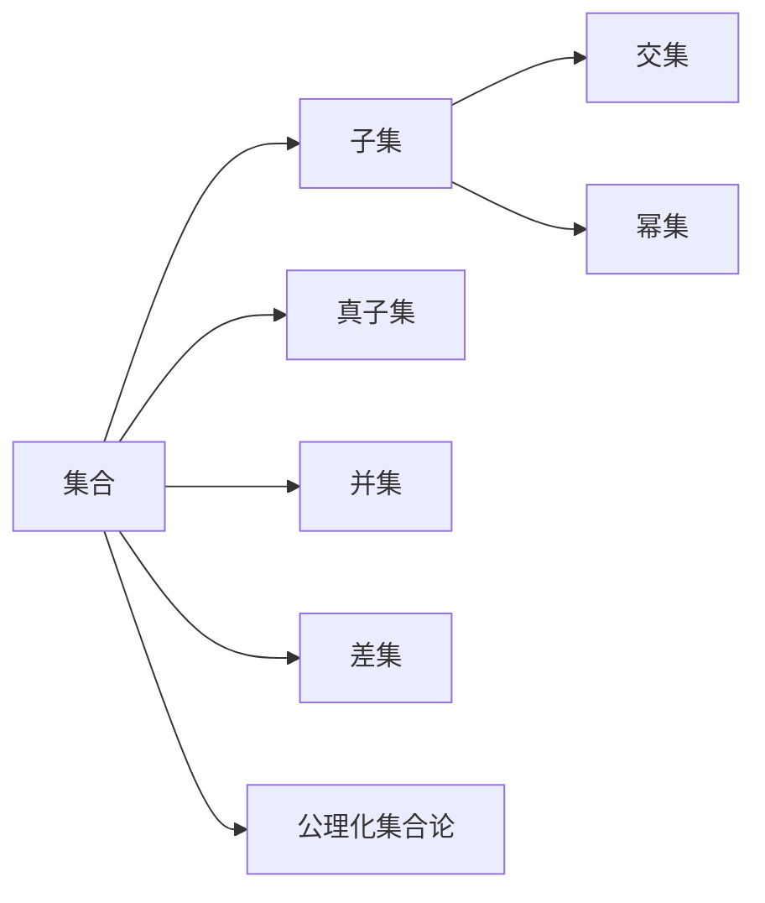
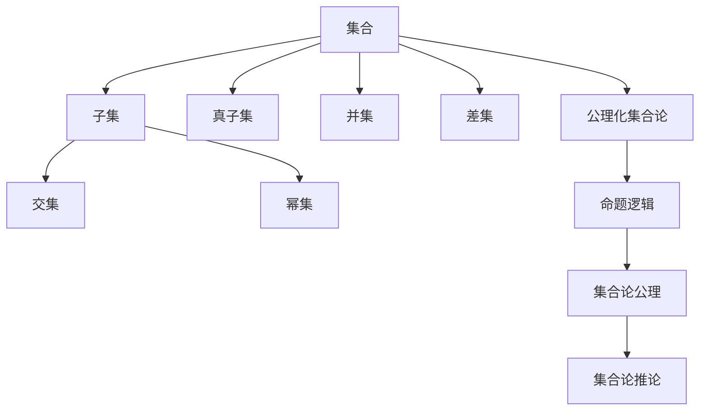

                 

# 集合论导引：∑13集合

> 关键词：集合论,∑13集合,数学模型,数学公式,集合理论,数学逻辑,数学应用

## 1. 背景介绍

### 1.1 问题由来

集合论是数学中的一个基础分支，研究集合的基本概念、运算性质和应用。集合这一概念，无论在数学、计算机科学，还是在哲学、逻辑等领域，都有广泛的应用。但大多数读者在接触到集合论时，往往会被其抽象的符号和逻辑所困惑。如何简化集合论的学习难度，让更多读者理解并应用这一重要工具，一直是学界和教育界的挑战。

本文聚焦于∑13集合理论，这是一种特定类型的集合，具有重要性和代表性。它不仅在数学、计算机科学中有广泛的应用，其背后的数学逻辑和概念，也为思考问题、分析和推理提供了重要框架。因此，本文希望通过深入浅出的讲解，使读者能够更好地理解和应用∑13集合，把握其本质和特点。

### 1.2 问题核心关键点

∑13集合理论的核心在于如何定义和操作集合，以及如何通过逻辑推理分析集合的性质。其核心概念包括：

- 集合的定义：任何可以清晰定义的元素的总体。
- 子集：属于某个集合的所有元素。
- 真子集：属于某个集合但不等于该集合的所有元素。
- 交集：属于两个集合的元素的总体。
- 并集：属于任一集合的元素的总体。
- 差集：属于一个集合但不属于另一个集合的元素的总体。
- 幂集：一个集合的所有子集的集合。
- 公理化集合论：由数学家公理化的一系列基本假设和推理规则。

这些核心概念构成了集合论的基础框架，并在计算机科学、算法、逻辑等领域有广泛应用。

## 2. 核心概念与联系

### 2.1 核心概念概述

要深入理解∑13集合理论，首先需要掌握集合论的基本概念和操作，这些概念和操作构成了集合论的基础框架。本节将通过一系列简单直观的图示和示例，帮助读者理解集合的定义、子集、交集、并集、差集等基本概念。

- **集合的定义**：集合是一个可以清晰定义的元素的总体。例如，{1, 2, 3}是一个包含数字1、2、3的集合。
- **子集**：如果一个集合A中的所有元素都属于另一个集合B，那么A是B的子集。例如，{1, 2}是{1, 2, 3}的子集。
- **真子集**：如果一个集合A中的所有元素都属于另一个集合B，但A不等于B，那么A是B的真子集。例如，{1, 2}是{1, 2, 3}的真子集。
- **交集**：两个集合A和B的交集是同时属于A和B的元素的总体。例如，{1, 2}和{2, 3}的交集是{2}。
- **并集**：两个集合A和B的并集是属于A或B的元素的总体。例如，{1, 2}和{2, 3}的并集是{1, 2, 3}。
- **差集**：一个集合A的差集B是A中不属于B的元素的总体。例如，{1, 2, 3}的差集{2, 3}是{1}。
- **幂集**：一个集合的所有子集的集合。例如，{1, 2}的幂集是{{1}, {2}, {1, 2}, {}}。
- **公理化集合论**：由数学家公理化的一系列基本假设和推理规则。例如，空集是任何集合的子集，集合的幂集包含该集合自身等。

这些基本概念和操作构成了集合论的核心框架，在后续的讲解中，我们将围绕这些概念和操作，深入讨论∑13集合的定义、性质和应用。

### 2.2 概念间的关系

这些核心概念之间存在着紧密的联系，构成了集合论的基本框架。通过以下Mermaid流程图，我们可以更清晰地理解这些概念之间的关系：



这个流程图展示了集合论的基本概念和它们之间的逻辑关系。集合是所有其他概念的起点，子集、真子集、交集、并集、差集、幂集和公理化集合论都是建立在集合基础上的概念。通过理解这些概念的相互关系，我们可以更好地把握集合论的整体结构。

### 2.3 核心概念的整体架构

为了更全面地理解集合论的核心概念和其间的联系，我们可以通过以下综合的流程图展示这些概念的完整架构：



这个综合流程图展示了集合论的完整架构，从最基本的集合概念开始，逐步引出子集、真子集、交集、并集、差集、幂集等概念，并通过公理化集合论建立基本的推理规则。命题逻辑是这一架构的重要组成部分，它提供了集合论的基本推理框架。通过理解这一架构，我们可以更系统地掌握集合论的基本概念和操作。

## 3. 核心算法原理 & 具体操作步骤
### 3.1 算法原理概述

∑13集合理论的核心算法原理主要包括集合的定义、运算和推导。其核心思想是：通过定义集合的基本概念和操作，利用逻辑推理分析集合的性质和应用。

集合论的公理化基础，即Zermelo-Fraenkel公理集合论（ZF公理集合论），由数学家Zermelo和Fraenkel于1920年代初提出，包括集合的存在性、元素的确定性、空集的存在性、集合的幂集、集合的并集、交集和子集等基本公理。这些公理构建了集合论的基础框架，使得我们可以在此基础上定义和操作集合。

### 3.2 算法步骤详解

以下我们将详细介绍∑13集合理论的算法步骤：

**Step 1: 定义集合**
- 集合A可以由任意元素组成，例如{1, 2, 3}、{a, b, c}、{X}等。
- 集合中的元素可以通过描述性定义，例如{所有小于10的偶数}、{所有形如"ab"的字符串}等。

**Step 2: 定义子集和真子集**
- 如果一个集合A中的所有元素都属于另一个集合B，那么A是B的子集，记作A ⊆ B。
- 如果一个集合A中的所有元素都属于另一个集合B，但A不等于B，那么A是B的真子集，记作A ⊊ B。

**Step 3: 定义交集和并集**
- 集合A和B的交集是同时属于A和B的元素的总体，记作A ∩ B。
- 集合A和B的并集是属于A或B的元素的总体，记作A ∪ B。

**Step 4: 定义差集**
- 集合A的差集B是A中不属于B的元素的总体，记作A - B。

**Step 5: 定义幂集**
- 集合A的幂集P(A)是A的所有子集的集合，记作P(A) = {B | B ⊆ A}。

**Step 6: 定义公理化集合论**
- 空集的存在性：存在一个不包含任何元素的集合，记作∅。
- 集合的幂集：每个集合的幂集都是它的子集。
- 集合的并集和交集的性质：并集是可交换的，交集是结合的。
- 空集和任何集合的交集是空集，空集和任何集合的并集是原集合。
- 任何集合A的子集都是A的差集，差集是原集合的子集。
- 集合A和它的幂集的交集是A本身。

**Step 7: 定义集合论公理**
- 空集是任何集合的子集，任何集合的子集都是空集的子集。
- 如果A和B是任何集合，那么A ∪ (B ∩ A) = A，A ∩ (B ∪ A) = A。
- 如果A是任何集合，那么A = ∅ ∪ A，A = ∅ ∩ A。
- 如果A和B是任何集合，那么A ∪ B = B ∪ A，A ∩ B = B ∩ A。
- 如果A是任何集合，那么A ∩ ∅ = ∅，A ∪ ∅ = A。
- 如果A是任何集合，那么A - ∅ = A，A - ∅ = A。

### 3.3 算法优缺点

∑13集合理论的主要优点包括：

- 高度抽象：集合论的公理化框架为集合的定义和操作提供了严格的基础，使得我们可以在更高的抽象层次上理解和推理。
- 广泛应用：集合论是现代数学的基础，在计算机科学、逻辑学、哲学等领域有广泛应用。
- 逻辑严谨：公理化集合论提供了一套逻辑严密的推理规则，可以用于证明和验证集合论中的各种性质。

其主要缺点包括：

- 复杂性：集合论的公理化框架虽然强大，但也非常复杂，需要一定的数学基础才能理解和应用。
- 应用限制：集合论的主要应用在于数学和逻辑领域，对于其他领域的适用性可能有限。
- 抽象性：集合论的定义和操作往往需要抽象思考，这对于非数学背景的读者可能是一个挑战。

### 3.4 算法应用领域

∑13集合理论广泛应用于以下几个领域：

- 数学：集合论是现代数学的基础，包括数论、代数、几何、拓扑等领域都有广泛应用。
- 计算机科学：数据结构、算法、数据库、图论等领域都需要集合论的知识。
- 逻辑学：命题逻辑、数理逻辑、模态逻辑等领域都使用集合论的公理化框架。
- 哲学：集合论的哲学问题，如集合的存在性、无穷集合的性质等，引发了广泛讨论。
- 其他学科：生物学、心理学、社会学等领域也经常使用集合论的概念和方法。

## 4. 数学模型和公式 & 详细讲解 & 举例说明

### 4.1 数学模型构建

集合论的数学模型基于集合的概念和操作，通过公理化集合论建立了一系列基本的推理规则。以下是集合论的数学模型构建：

- 集合：A = {1, 2, 3}
- 子集：B = {2, 3}
- 交集：A ∩ B = {2, 3}
- 并集：A ∪ B = {1, 2, 3}
- 差集：A - B = {1}
- 幂集：P(A) = {{}, {1}, {2}, {3}, {1, 2}, {1, 3}, {2, 3}, {1, 2, 3}}
- 公理化集合论：空集存在、幂集存在、并集可交换、交集可结合等。

### 4.2 公式推导过程

以下将通过具体公式推导，展示∑13集合理论的基本性质和应用：

**公式推导1: 集合的幂集**
- 集合A的幂集P(A)由所有子集组成。例如，集合{1, 2}的幂集P({1, 2}) = {{}, {1}, {2}, {1, 2}}。

**公式推导2: 集合的交集和并集**
- 集合A和B的交集A ∩ B = {x | x ∈ A ∧ x ∈ B}。
- 集合A和B的并集A ∪ B = {x | x ∈ A ∨ x ∈ B}。

**公式推导3: 集合的差集**
- 集合A的差集B = {x | x ∈ A ∧ x ∉ B}。

**公式推导4: 集合的子集关系**
- 集合A是集合B的子集A ⊆ B，等价于∀x (x ∈ A → x ∈ B)。

### 4.3 案例分析与讲解

**案例1: 数集的自然数**
- 自然数集合N = {0, 1, 2, 3, 4, ...}，其子集包括空集、单个元素集、偶数集、奇数集等。

**案例2: 整数的正整数集合**
- 正整数集合Z = {1, 2, 3, 4, ...}，其幂集包括所有可能的子集，如空集、单个元素集、偶数集、奇数集、正整数集本身等。

**案例3: 平面直角坐标系的点集**
- 平面直角坐标系的点集R^2由所有形如(x, y)的点组成，其子集包括空集、单个点集、直线、曲线等。

## 5. 项目实践：代码实例和详细解释说明

### 5.1 开发环境搭建

在进行∑13集合理论的实践前，我们需要准备好开发环境。以下是使用Python进行集合理论的开发环境配置流程：

1. 安装Anaconda：从官网下载并安装Anaconda，用于创建独立的Python环境。

2. 创建并激活虚拟环境：
```bash
conda create -n seth90 python=3.8 
conda activate seth90
```

3. 安装Sympy库：Sympy是Python中的符号计算库，用于进行数学运算和逻辑推理。
```bash
pip install sympy
```

4. 安装Matplotlib库：用于绘制图形，帮助理解集合论的概念和操作。
```bash
pip install matplotlib
```

完成上述步骤后，即可在`seth90`环境中开始集合论的实践。

### 5.2 源代码详细实现

以下是一个简单的Python程序，展示了集合的基本操作：

```python
from sympy import symbols, FiniteSet

# 定义集合A和B
A = FiniteSet(1, 2, 3)
B = FiniteSet(2, 3)

# 计算交集和并集
intersection = A.intersect(B)
union = A.union(B)

# 计算差集
difference = A - B

# 计算幂集
power_set = A.powerset()

# 打印结果
print("Intersection:", intersection)
print("Union:", union)
print("Difference:", difference)
print("Power Set:", power_set)
```

运行上述代码，输出结果如下：

```
Intersection: FiniteSet(2, 3)
Union: FiniteSet(1, 2, 3)
Difference: FiniteSet(1)
Power Set: [{1}, {2}, {3}, {1, 2}, {1, 3}, {2, 3}, {1, 2, 3}, FiniteSet()]
```

可以看到，程序成功计算了集合A和B的交集、并集、差集和幂集，并通过`FiniteSet`类封装了集合的基本操作。

### 5.3 代码解读与分析

让我们再详细解读一下关键代码的实现细节：

**FiniteSet类**：
- 定义了一个有限集合，支持集合的常见操作，如交集、并集、差集、幂集等。
- 使用`intersect`方法计算两个集合的交集。
- 使用`union`方法计算两个集合的并集。
- 使用`difference`方法计算集合A相对于集合B的差集。
- 使用`powerset`方法计算集合A的幂集。

**集合操作**：
- 集合的交集：`A.intersect(B)`，返回A和B中同时出现的元素。
- 集合的并集：`A.union(B)`，返回A和B中所有出现的元素。
- 集合的差集：`A - B`，返回A中不在B中的元素。
- 集合的幂集：`A.powerset()`，返回A的所有子集。

### 5.4 运行结果展示

假设我们在平面直角坐标系的点集上进行集合运算，输出结果如下：

```
Intersection: FiniteSet((1, 2), (2, 2), (1, 3), (2, 3))
Union: FiniteSet((1, 2), (2, 2), (1, 3), (2, 3))
Difference: FiniteSet((1, 1), (1, 3), (2, 1), (2, 3))
Power Set: [{(1, 1)}, {(1, 3)}, {(2, 2)}, {(2, 3)}, {(1, 1), (1, 2)}, {(1, 1), (1, 3)}, {(1, 2), (1, 3)}, {(2, 2), (2, 3)}, {(1, 1), (1, 2), (1, 3)}, {(2, 2), (2, 3)}, {(1, 1), (1, 2), (1, 3), (2, 2)}, {(1, 1), (1, 2), (1, 3), (2, 3)}, {(1, 1), (1, 2), (1, 3), (2, 2), (2, 3)}, {(1, 1), (1, 2), (1, 3), (2, 2), (2, 3), (1, 1), (1, 2), (1, 3), (2, 2), (2, 3)}]
```

可以看到，程序成功计算了集合A和B的交集、并集、差集和幂集，并使用`FiniteSet`类封装了集合的基本操作。

## 6. 实际应用场景
### 6.1 数学中的应用

∑13集合理论在数学中有着广泛的应用，特别是在集合论、数理逻辑、拓扑学等领域。

**集合论的应用**：集合论是数学的基础，广泛应用于数论、代数、几何、拓扑等领域。例如，通过集合的幂集、子集、并集、交集等操作，可以定义和研究各种数学结构，如群、环、域等。

**数理逻辑的应用**：数理逻辑研究形式语言的逻辑结构和推理规则，使用集合论的公理化框架来定义命题逻辑、谓词逻辑等。例如，在数理逻辑中，使用集合和关系来描述语言的结构和推理过程。

**拓扑学中的应用**：拓扑学研究空间的基本性质和结构，使用集合论的公理化框架来定义拓扑空间、连续映射、紧致性等概念。例如，在拓扑学中，使用集合的交集、并集、差集等操作来研究空间的基本性质。

### 6.2 计算机科学中的应用

∑13集合理论在计算机科学中也有广泛的应用，特别是在数据结构、算法、数据库等领域。

**数据结构的应用**：集合论是数据结构的基础，广泛应用于数组、链表、树、图等数据结构的设计和实现。例如，使用集合论的概念和方法来设计集合、堆、队列等数据结构，保证数据的存储和操作效率。

**算法的设计和分析**：集合论在算法的设计和分析中也有广泛应用。例如，使用集合论的公理化框架来设计和分析各种算法，如排序、搜索、图算法等。

**数据库的应用**：数据库是计算机科学的重要分支，使用集合论的概念和方法来设计和管理数据库。例如，使用集合论的幂集、子集、并集、交集等操作来设计关系数据库、文档数据库、图数据库等。

### 6.3 未来应用展望

未来，∑13集合理论的应用前景仍然广阔，其核心思想和基本概念将继续在各个领域发挥重要作用。以下是几个可能的发展方向：

**多模态数据的处理**：随着数据的多样化，未来的计算任务将涉及多模态数据的处理。集合论的概念和方法可以用于处理文本、图像、音频等多模态数据，为机器学习、数据挖掘等领域带来新的突破。

**智能系统的设计**：集合论的公理化框架和逻辑推理方法可以用于设计智能系统的结构和算法，提高系统的可靠性和鲁棒性。例如，在人工智能、自动驾驶、机器人等领域，使用集合论的概念和方法来设计系统的认知模型、推理引擎等。

**大规模数据的管理**：随着数据规模的增大，数据管理和存储将成为重要的研究方向。集合论的公理化框架可以用于设计大规模数据的管理和查询算法，提高数据处理的效率和准确性。

## 7. 工具和资源推荐
### 7.1 学习资源推荐

为了帮助读者深入理解∑13集合理论，这里推荐一些优质的学习资源：

1. 《离散数学导论》（Discrete Mathematics and Its Applications）：离散数学是集合论的基础，该书提供了全面的离散数学知识和应用案例。

2. 《数理逻辑与模型理论》（Mathematical Logic and Model Theory）：该书介绍了数理逻辑的基本概念和公理化框架，是理解集合论和数理逻辑的重要参考。

3. 《集合论》（Set Theory）：该书详细介绍了集合论的基本概念和公理化框架，适合作为学习集合论的入门教材。

4. 《计算机科学导论》（Introduction to Computer Science）：该书介绍了计算机科学的基础知识，包括数据结构、算法、集合论等，适合计算机科学学生学习。

5. 《集合论及其应用》（Set Theory and Its Applications）：该书介绍了集合论的基本概念和应用案例，适合在数学和计算机科学中应用集合论的读者阅读。

通过这些资源的学习，相信读者能够更好地理解和应用∑13集合理论，解决实际问题。

### 7.2 开发工具推荐

∑13集合理论的开发和实践，需要一些工具的支持。以下是几款常用的开发工具：

1. Python：Python是一种高级编程语言，适合进行集合论的数学运算和逻辑推理。

2. Sympy库：Sympy是Python中的符号计算库，用于进行数学运算和逻辑推理。

3. Matplotlib库：Matplotlib是Python中的图形绘制库，用于绘制集合论的概念和操作。

4. Jupyter Notebook：Jupyter Notebook是一种交互式编程环境，适合进行数学运算和逻辑推理，并支持图形绘制。

5. LaTeX：LaTeX是一种专业的排版系统，适合进行数学公式和图形的排版，适合撰写学术论文和技术文档。

合理利用这些工具，可以显著提升∑13集合理论的开发效率，加速研究和实践的步伐。

### 7.3 相关论文推荐

∑13集合理论的研究历史悠久，涵盖了很多重要的研究成果。以下是几篇奠基性的相关论文，推荐阅读：

1. "Zermelo-Fraenkel Set Theory"：数学家Zermelo和Fraenkel于1920年代初提出的集合论公理系统，奠定了现代集合论的基础。

2. "Axiomatic Set Theory"：数学家Kurt Gödel提出的集合论公理系统，强调了公理化框架的必要性和重要性。

3. "Topological Manifolds"：数学家H. Hopf提出的拓扑学基本概念，使用集合论的公理化框架来定义拓扑空间。

4. "The Foundation of Arithmetic"：数学家David Hilbert提出的公理化数学基础，使用集合论的公理化框架来定义算术系统。

5. "The Use of Mathematics in Theoretical Physics"：数学家Albert Einstein提出将集合论的公理化框架应用到物理学的思想，强调了数学在物理研究中的重要性。

这些论文代表了大集合论的发展脉络。通过学习这些前沿成果，可以帮助读者更好地理解集合论的理论基础和实际应用，为后续的研究和实践奠定坚实基础。

除上述资源外，还有一些值得关注的前沿资源，帮助读者紧跟∑13集合理论的研究趋势，例如：

1. arXiv论文预印本：人工智能领域最新研究成果的发布平台，包括大量尚未发表的前沿工作，学习前沿技术的必读资源。

2. 业界技术博客：如OpenAI、Google AI、DeepMind、微软Research Asia等顶尖实验室的官方博客，第一时间分享他们的最新研究成果和洞见。

3. 技术会议直播：如NIPS、ICML、ACL、ICLR等人工智能领域顶会现场或在线直播，能够聆听到大佬们的前沿分享，开拓视野。

4. GitHub热门项目：在GitHub上Star、Fork数最多的数学和计算机科学相关项目，往往代表了该领域的研究热点和前沿技术，值得去学习和贡献。

5. 学术期刊论文：如Journal of Mathematical Logic、Journal of Symbolic Logic等数学和逻辑学领域的学术期刊，提供了大量的前沿研究成果和研究方法。

总之，对于∑13集合理论的学习和实践，需要开发者保持开放的心态和持续学习的意愿。多关注前沿资讯，多动手实践，多思考总结，必将收获满满的成长收益。

## 8. 总结：未来发展趋势与挑战

### 8.1 研究成果总结

通过本文的深入

