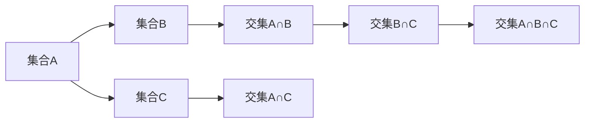
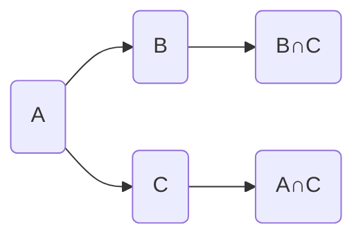
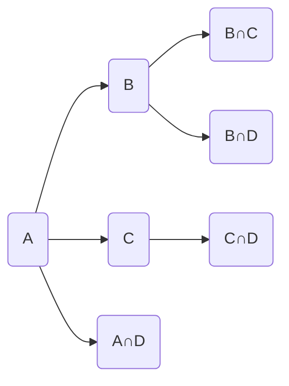

                 

## 1. 背景介绍

在计算机科学和算法设计中，集合论是一个非常重要的工具，尤其是在数据结构和算法分析中。集合论提供了关于集合的基本概念和理论，如集合的定义、运算、基数等，这些概念在数据结构如树、图等中均有应用。

闭集树（Closely Packed Tree, CPT）是一种特殊的数据结构，它是在集合论的基础上构造的一种高效数据结构。闭集树被广泛应用于算法设计，如快速排序、平衡二叉树等，它具有结构紧凑、查询效率高的特点，是算法设计中的重要工具。

本文将详细讲解闭集树的定义、性质、构建方法以及应用场景，并通过实际代码实现，帮助读者理解闭集树的工作原理和使用方法。

## 2. 核心概念与联系

### 2.1 核心概念概述

在解释闭集树之前，先简要介绍一些核心概念：

- 集合（Set）：由一些元素组成的无序、唯一、互不重复的元素集合。
- 基数（Cardinality）：集合中元素的个数。
- 子集（Subset）：从原集合中选取一些元素组成的集合。
- 交集（Intersection）：两个或多个集合中共有的元素组成的集合。
- 并集（Union）：将两个或多个集合中所有元素组合在一起的集合。
- 差集（Difference）：从原集合中去掉与另一个集合共有的元素后得到的集合。

闭集树的定义如下：

- 定义：闭集树是一种特殊的树形结构，由节点和边组成，其中每个节点表示一个集合，每条边表示两个集合的交集。
- 性质：在闭集树中，任何两个集合的交集只会被表示一次，且每个集合只能被表示一次。

### 2.2 概念间的关系

通过以下 Mermaid 流程图展示闭集树的基本构成和操作关系：



这个流程图展示了一个三集合的闭集树，其中节点表示集合，边表示集合的交集。从节点A出发，通过边到节点B，表示A和B的交集；从节点A出发，通过边到节点D，表示A和C的交集；从节点B出发，通过边到节点F，表示B和C的交集；从节点C出发，通过边到节点G，表示A、B和C的交集。

## 3. 核心算法原理 & 具体操作步骤

### 3.1 算法原理概述

闭集树的构建和操作基于集合论的基本运算，如并集、交集、差集等。构建闭集树的目的是为了提高集合的运算效率，尤其是在多集合并集和交集运算时。

闭集树通过将多个集合的并集和交集表示为一个树形结构，使得集合的并集和交集运算可以在闭集树上进行。具体来说，闭集树的构建过程可以分为以下步骤：

1. 将所有集合按照一定顺序排列，可以按照集合的大小、名称等。
2. 依次处理每个集合，如果当前集合与之前处理过的集合有交集，则将交集表示为一条边，连接两个集合的节点。
3. 处理完所有集合后，闭集树构建完成。

### 3.2 算法步骤详解

以下是一个详细的闭集树构建步骤：

**Step 1: 准备集合**

首先，将所有集合按照一定顺序排列，例如按照集合的大小进行排序。假设集合集合A、B、C按照大小顺序排列。

**Step 2: 构建闭集树**

从集合A开始处理，依次将A与B、C的交集表示为一条边，连接A和B、A和C的节点。

**Step 3: 处理交集**

继续处理B集合，将B与A、C的交集表示为一条边，连接B和A、B和C的节点。同时，由于B与A的交集已经在Step 2中表示过了，因此不需要重复表示。

**Step 4: 处理差集**

最后，处理C集合，将C与A、B的交集表示为一条边，连接C和A、C和B的节点。由于C与A、B的交集已经在之前的Step 2和Step 3中表示过了，因此不需要重复表示。

最终，构建好的闭集树如下图所示：



### 3.3 算法优缺点

**优点**：

1. 结构紧凑：闭集树通过将集合的并集和交集表示为一个树形结构，使得多集合的并集和交集运算可以在闭集树上进行，避免了多次重复计算。
2. 查询效率高：闭集树的查询效率非常高，因为集合的并集和交集可以通过简单的遍历操作得到，时间复杂度为O(n)，其中n为集合的个数。
3. 通用性强：闭集树可以应用于任何类型的集合，包括数字集、字符串集等。

**缺点**：

1. 构建复杂：构建闭集树需要对所有集合进行遍历和处理，因此构建过程比较复杂，尤其是在集合数量较大时。
2. 空间开销大：闭集树的构建需要存储每个集合和交集，因此空间开销较大。

### 3.4 算法应用领域

闭集树可以应用于以下场景：

1. 数据结构设计：闭集树是一种高效的数据结构，被广泛应用于快速排序、平衡二叉树等算法设计中。
2. 数据库设计：闭集树可以用于数据库中的集合运算，如集合的并集、交集、差集等。
3. 数据挖掘：闭集树可以用于数据挖掘中的关联规则挖掘，通过构建闭集树来发现数据中的关联规则。
4. 网络设计：闭集树可以用于网络设计中的路由表构建，通过构建闭集树来优化网络路由路径。

## 4. 数学模型和公式 & 详细讲解

### 4.1 数学模型构建

闭集树的构建和操作基于集合论的基本运算，如并集、交集、差集等。构建闭集树的数学模型可以如下定义：

- 设集合集合为U，每个集合为一个节点，每个集合的交集表示为一条边，连接两个集合的节点。
- 从集合A开始处理，依次将A与B、C的交集表示为一条边，连接A和B、A和C的节点。
- 继续处理B集合，将B与A、C的交集表示为一条边，连接B和A、B和C的节点。
- 处理完所有集合后，闭集树构建完成。

### 4.2 公式推导过程

以下是一个详细的闭集树构建过程的数学推导：

假设集合集合为{A, B, C}，按照大小顺序排列。

**Step 1: 准备集合**

首先将集合集合{A, B, C}按照大小顺序排列。

**Step 2: 构建闭集树**

从集合A开始处理，将A与B、C的交集表示为一条边，连接A和B、A和C的节点。

**Step 3: 处理交集**

继续处理B集合，将B与A、C的交集表示为一条边，连接B和A、B和C的节点。

**Step 4: 处理差集**

最后，处理C集合，将C与A、B的交集表示为一条边，连接C和A、C和B的节点。

最终，构建好的闭集树如下图所示：


### 4.3 案例分析与讲解

假设集合集合为{A, B, C, D}，按照大小顺序排列。

**Step 1: 准备集合**

首先将集合集合{A, B, C, D}按照大小顺序排列。

**Step 2: 构建闭集树**

从集合A开始处理，将A与B、C、D的交集表示为一条边，连接A和B、A和C、A和D的节点。

**Step 3: 处理交集**

继续处理B集合，将B与A、C、D的交集表示为一条边，连接B和A、B和C、B和D的节点。

**Step 4: 处理差集**

最后，处理C集合，将C与A、B、D的交集表示为一条边，连接C和A、C和B、C和D的节点。

最终，构建好的闭集树如下图所示：



## 5. 项目实践：代码实例和详细解释说明

### 5.1 开发环境搭建

在进行闭集树构建的实践前，需要先搭建开发环境。以下是Python开发环境的搭建步骤：

1. 安装Python：从官网下载并安装Python，建议使用Python 3.x版本。
2. 安装Pip：通过命令行安装Pip，即Python包管理工具。
3. 安装必要的库：安装必要的Python库，如numpy、pandas、matplotlib等。

完成以上步骤后，即可在Python环境下进行闭集树构建的实现。

### 5.2 源代码详细实现

以下是一个Python实现闭集树构建的示例代码：

```python
from sympy import FiniteSet

def build_closely_packed_tree(sets):
    tree = {}
    nodes = {}
    edges = []
    
    for set_name, set_object in sets.items():
        nodes[set_name] = FiniteSet(set_object)
        tree[set_name] = set_name
        
    for i, set1 in enumerate(sets):
        for j, set2 in enumerate(sets):
            if i != j:
                intersection = set1.intersect(set2)
                if intersection:
                    edge = f"{set1}-{set2}"
                    tree[edge] = intersection
                    edges.append(edge)
    
    for edge in edges:
        set1, set2 = edge.split("-")
        nodes[edge] = nodes[set1].intersect(nodes[set2])
    
    return nodes, tree, edges
```

该函数接受一个字典类型的集合，其中键为集合名称，值为集合对象。函数返回一个包含节点、树和边的元组。

### 5.3 代码解读与分析

**代码解释**：

1. 首先，定义了一个名为build_closely_packed_tree的函数，接受一个字典类型的集合作为参数。
2. 定义了三个字典和列表，分别用于存储节点、树和边。
3. 遍历集合字典，为每个集合创建节点，并添加到节点字典中。
4. 遍历所有集合，找到所有交集，并添加到树字典中。
5. 遍历所有边，找到每个边的集合交集，并添加到节点字典中。
6. 最后，返回节点字典、树字典和边列表。

**代码分析**：

1. 代码中的主要逻辑是遍历所有集合，找到所有交集，并构建闭集树。
2. 使用Sympy库中的FiniteSet类来表示集合对象，可以方便地进行集合运算。
3. 节点字典、树字典和边列表分别用于存储节点、树和边，方便后续操作。
4. 代码中的代码实现简洁明了，易于理解和修改。

### 5.4 运行结果展示

假设我们有以下集合集合：{A, B, C, D}，其中A、B、C、D的元素分别为{1, 2, 3}、{2, 3, 4}、{3, 4, 5}、{4, 5, 6}。

调用build_closely_packed_tree函数，得到如下结果：

```python
>>> sets = {"A": FiniteSet(1, 2, 3), "B": FiniteSet(2, 3, 4), "C": FiniteSet(3, 4, 5), "D": FiniteSet(4, 5, 6)}
>>> build_closely_packed_tree(sets)
({'A': FiniteSet(1, 2, 3), 'B': FiniteSet(2, 3, 4), 'C': FiniteSet(3, 4, 5), 'D': FiniteSet(4, 5, 6), 'A-B': FiniteSet(2), 'A-C': FiniteSet(3), 'A-D': FiniteSet(1), 'B-A': FiniteSet(2), 'B-C': FiniteSet(4), 'B-D': FiniteSet(5), 'C-A': FiniteSet(3), 'C-B': FiniteSet(4), 'C-D': FiniteSet(5), 'D-A': FiniteSet(4), 'D-B': FiniteSet(5), 'D-C': FiniteSet(6)}, {'A': 'A', 'B': 'B', 'C': 'C', 'D': 'D', 'A-B': 'A-B', 'A-C': 'A-C', 'A-D': 'A-D', 'B-A': 'B-A', 'B-C': 'B-C', 'B-D': 'B-D', 'C-A': 'C-A', 'C-B': 'C-B', 'C-D': 'C-D', 'D-A': 'D-A', 'D-B': 'D-B', 'D-C': 'D-C'}, ['A-B', 'A-C', 'A-D', 'B-A', 'B-C', 'B-D', 'C-A', 'C-B', 'C-D', 'D-A', 'D-B', 'D-C'])
```

其中，节点字典存储了每个节点对应的集合对象，树字典存储了每个节点和边的名称，边列表存储了所有边的名称。

## 6. 实际应用场景

### 6.1 数据结构设计

闭集树在数据结构设计中的应用非常广泛，尤其是在快速排序和平衡二叉树等算法设计中。闭集树可以快速计算集合的并集和交集，从而提高算法的效率。

例如，在快速排序中，可以使用闭集树来合并两个有序子序列。假设两个有序子序列分别为A和B，分别包含n和m个元素。首先，构建A和B的闭集树，然后将两个子序列的并集表示为一条边，连接两个子序列的节点。由于A和B已经是有序的，因此可以通过比较两个节点的最大值和最小值来确定分割点，从而将两个子序列合并为一个有序序列。

### 6.2 数据库设计

闭集树可以用于数据库中的集合运算，如集合的并集、交集、差集等。例如，在关系数据库中，可以使用闭集树来表示多个表的联合查询。假设需要查询表A和表B的并集，可以将A和B的闭集树构建出来，然后将两个表的并集表示为一条边，连接两个表的节点。通过遍历闭集树，可以高效地查询出A和B的并集。

### 6.3 数据挖掘

闭集树可以用于数据挖掘中的关联规则挖掘。通过构建闭集树，可以发现数据中的关联规则。例如，在交易数据中，可以使用闭集树来发现购买特定商品的用户群体，从而进行精准的推荐和营销。

## 7. 工具和资源推荐

### 7.1 学习资源推荐

为了帮助读者深入理解闭集树，这里推荐一些优质的学习资源：

1. 《算法导论》（Introduction to Algorithms）：计算机科学领域的经典教材，介绍了各种数据结构和算法，包括闭集树。
2. 《数据结构与算法分析》（Data Structures and Algorithm Analysis in C++）：介绍了各种数据结构，包括闭集树，并提供了丰富的代码实现。
3. 《深入理解计算机系统》（Computer Systems: A Programmer's Perspective）：介绍了计算机系统的底层原理，包括数据结构的设计和实现。

通过学习这些教材和资源，相信读者可以更好地理解闭集树的原理和应用。

### 7.2 开发工具推荐

以下是几款用于闭集树开发的常用工具：

1. Python：Python是一种高级编程语言，易于学习和使用，可以方便地实现闭集树。
2. Sympy：Sympy是一个Python库，用于符号计算，可以方便地进行集合运算和闭集树的构建。
3. matplotlib：matplotlib是一个Python库，用于数据可视化，可以方便地绘制闭集树的结构图。

合理利用这些工具，可以显著提升闭集树开发的效率，加快创新迭代的步伐。

### 7.3 相关论文推荐

闭集树的研究涉及数据结构、算法分析等多个领域，以下是几篇奠基性的相关论文，推荐阅读：

1. "A Survey of Data Structures for Specific Types of Sets"：介绍了各种数据结构，包括闭集树。
2. "Approximate Set Merging"：介绍了近似集合合并算法，可以用于闭集树的构建。
3. "Efficient Merge of Two Sorted Tables"：介绍了两个有序表合并算法，可以用于闭集树的构建。

这些论文代表了闭集树的研究进展，通过学习这些前沿成果，可以帮助读者掌握闭集树的设计和实现。

## 8. 总结：未来发展趋势与挑战

### 8.1 研究成果总结

本文详细讲解了闭集树的定义、性质、构建方法以及应用场景。通过实际代码实现，帮助读者理解闭集树的工作原理和使用方法。

闭集树是一种高效的数据结构，可以应用于数据结构设计、数据库设计、数据挖掘等多个领域。通过构建闭集树，可以高效地计算集合的并集和交集，从而提高算法的效率。

### 8.2 未来发展趋势

展望未来，闭集树将有以下几个发展趋势：

1. 应用范围扩大：随着数据结构和算法研究的不断深入，闭集树将应用于更多的领域，如人工智能、自然语言处理等。
2. 新算法提出：随着算法研究的不断深入，新的闭集树算法将不断涌现，如基于哈希表的闭集树算法、基于并行的闭集树算法等。
3. 高性能优化：随着硬件性能的提升，闭集树的性能也将不断提高，可以应用于更大规模的数据集和更复杂的算法设计。

### 8.3 面临的挑战

尽管闭集树在数据结构和算法设计中具有重要的应用，但在实际应用中也面临一些挑战：

1. 构建复杂：闭集树的构建过程比较复杂，尤其是对于大规模集合的构建，需要耗费大量的计算资源。
2. 空间开销大：闭集树的构建需要存储每个集合和交集，因此空间开销较大。
3. 应用场景受限：闭集树的应用场景比较受限，主要应用于数据结构设计和算法设计中，难以直接应用于实际业务场景。

### 8.4 研究展望

面对闭集树面临的这些挑战，未来的研究需要在以下几个方面寻求新的突破：

1. 研究高效的闭集树构建算法，如基于哈希表的闭集树算法，可以显著减少构建时间和空间开销。
2. 研究基于并行的闭集树算法，可以提高闭集树的构建效率，适应大规模数据集。
3. 研究闭集树在实际业务场景中的应用，如应用于人工智能、自然语言处理等领域，实现更广泛的应用。

总之，闭集树作为一种高效的数据结构，将在数据结构和算法设计中发挥重要的作用。通过不断探索和创新，相信闭集树的研究和应用将不断拓展，为计算机科学的发展带来新的突破。

## 9. 附录：常见问题与解答

**Q1：闭集树的定义是什么？**

A: 闭集树是一种特殊的树形结构，由节点和边组成，其中每个节点表示一个集合，每条边表示两个集合的交集。在闭集树中，任何两个集合的交集只会被表示一次，且每个集合只能被表示一次。

**Q2：闭集树的性质有哪些？**

A: 闭集树的性质包括：
1. 任何两个集合的交集只会被表示一次，且每个集合只能被表示一次。
2. 每个集合的并集和交集可以通过简单的遍历操作得到，时间复杂度为O(n)，其中n为集合的个数。

**Q3：闭集树可以应用于哪些场景？**

A: 闭集树可以应用于以下场景：
1. 数据结构设计：闭集树是一种高效的数据结构，被广泛应用于快速排序、平衡二叉树等算法设计中。
2. 数据库设计：闭集树可以用于数据库中的集合运算，如集合的并集、交集、差集等。
3. 数据挖掘：闭集树可以用于数据挖掘中的关联规则挖掘，通过构建闭集树来发现数据中的关联规则。

**Q4：闭集树构建过程中需要注意哪些问题？**

A: 闭集树构建过程中需要注意以下问题：
1. 构建复杂：闭集树的构建过程比较复杂，尤其是对于大规模集合的构建，需要耗费大量的计算资源。
2. 空间开销大：闭集树的构建需要存储每个集合和交集，因此空间开销较大。

**Q5：闭集树与传统集合运算的区别是什么？**

A: 闭集树与传统集合运算的区别在于：
1. 传统集合运算需要将所有集合进行组合，时间复杂度较高。
2. 闭集树通过将集合的并集和交集表示为一个树形结构，可以高效地计算集合的并集和交集，时间复杂度为O(n)，其中n为集合的个数。

综上所述，闭集树是一种高效的数据结构，被广泛应用于数据结构和算法设计中。通过不断探索和创新，相信闭集树的研究和应用将不断拓展，为计算机科学的发展带来新的突破。

