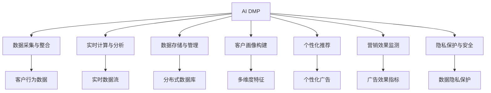
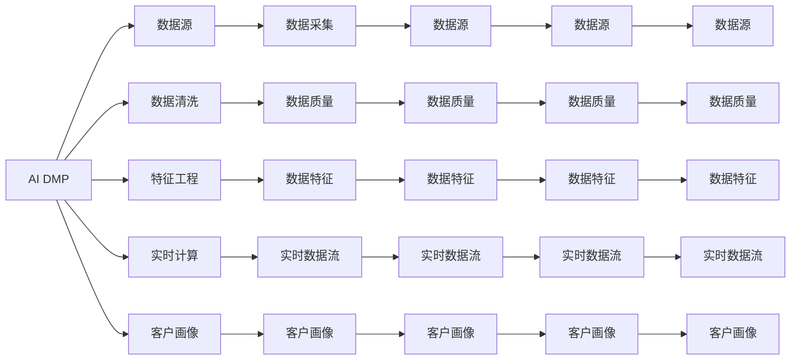

                 

# AI DMP 数据基建：构建数据驱动的营销生态

> 关键词：
人工智能,数据管理系统,数据驱动,营销生态,大数据技术,实时计算,机器学习

## 1. 背景介绍

### 1.1 问题由来

随着互联网的快速发展和数字经济的崛起，数据在商业决策中的作用日益重要。传统上，企业依赖市场调研、问卷调查等手段收集和分析消费者行为数据，以制定营销策略。但这种方法成本高、周期长、难以覆盖所有消费者，且结果存在较大偏差。

为了更好地应对这一挑战，人工智能驱动的数据管理系统（AI Data Management Platform，简称AI DMP）应运而生。AI DMP通过整合多源数据，实时分析消费者的行为模式和偏好，为营销人员提供精准的客户画像和个性化推荐。这不仅降低了营销成本，提升了效率，还能更好地满足消费者的需求，增强品牌忠诚度。

### 1.2 问题核心关键点

AI DMP的核心思想是通过数据驱动的方式，构建和维护一个实时的、动态更新的客户画像，并据此进行精准营销。其关键点包括：

1. **数据采集与整合**：收集来自网站、移动应用、社交媒体等渠道的各类数据，并进行清洗、去重、归一化等处理。

2. **实时计算与分析**：利用机器学习和深度学习技术，对大量实时数据进行快速计算和分析，得到消费者的行为模式和偏好。

3. **数据存储与管理**：将分析结果存入分布式数据库中，以便后续的查询和调用。

4. **客户画像构建**：将消费者的行为数据和历史交易数据结合，形成多维度的客户画像。

5. **个性化推荐**：根据客户画像，向不同消费者推送个性化的广告、产品推荐和优惠信息。

6. **营销效果监测**：实时监测广告效果，优化营销策略。

7. **隐私保护与安全**：在数据采集和存储过程中，确保用户隐私安全，符合法律法规要求。

### 1.3 问题研究意义

AI DMP的研究与应用，对提升企业营销效果、降低成本、增强客户体验具有重要意义：

1. **提升营销效果**：通过精准的客户画像和个性化推荐，提高广告点击率和转化率，降低获客成本。

2. **降低营销成本**：减少市场调研和人工分析的投入，提高营销效率。

3. **增强客户体验**：根据消费者的兴趣和行为，提供量身定制的产品和服务，提升客户满意度。

4. **推动数据驱动决策**：通过数据驱动的决策支持，使营销人员能够快速响应市场变化，优化营销策略。

5. **促进商业创新**：数据驱动的营销生态，可以催生更多基于数据的商业创新，如基于行为分析的金融产品、基于兴趣分群的精准营销等。

## 2. 核心概念与联系

### 2.1 核心概念概述

为更好地理解AI DMP的核心概念，本节将介绍几个密切相关的核心概念：

- **AI DMP**：基于人工智能技术的数据管理系统，能够实时分析和管理消费者数据，生成精准的客户画像，驱动个性化营销。

- **客户画像**：通过数据整合和机器学习，形成的对消费者行为、兴趣、偏好等多维度特征的综合描述。

- **实时计算**：利用流计算、分布式计算等技术，对海量数据进行实时处理和分析。

- **数据隐私**：在数据采集、存储和分析过程中，保护用户隐私，符合GDPR等法律法规要求。

- **机器学习**：基于算法和模型，对数据进行学习和预测，提升数据管理的智能化水平。

- **深度学习**：通过多层神经网络，进行复杂的特征提取和模式识别，提升数据处理的深度。

- **大数据技术**：涵盖数据存储、处理、分析等全流程的技术体系，支持海量数据的实时处理。

这些核心概念之间的逻辑关系可以通过以下Mermaid流程图来展示：



这个流程图展示了大语言模型微调过程中各个核心概念之间的关系：

1. AI DMP通过数据采集与整合获取原始数据，利用实时计算与分析对数据进行处理，形成客户画像。
2. 客户画像与个性化推荐、营销效果监测等环节紧密联系，驱动营销策略的制定和优化。
3. 隐私保护与安全贯穿数据管理的全过程，确保用户数据的安全性和合规性。

### 2.2 概念间的关系

这些核心概念之间存在着紧密的联系，形成了AI DMP数据管理的完整生态系统。下面我们通过几个Mermaid流程图来展示这些概念之间的关系。

#### 2.2.1 AI DMP的核心架构



这个流程图展示了AI DMP的核心架构，即通过数据采集与整合、实时计算与分析、数据存储与管理、客户画像构建、个性化推荐等环节，将原始数据转化为可操作的客户画像，并驱动营销策略。

#### 2.2.2 客户画像的构建过程

```mermaid
graph TB
    A[数据采集] --> B[数据清洗]
    B --> C[特征工程]
    C --> D[模型训练]
    D --> E[客户画像]
    A --> F[行为数据]
    B --> G[数据质量]
    C --> H[数据特征]
    D --> I[模型训练]
    E --> J[客户画像]
    F --> K[行为数据]
    G --> L[数据质量]
    H --> M[数据特征]
    I --> N[模型训练]
    J --> O[客户画像]
    K --> P[行为数据]
    L --> Q[数据质量]
    M --> R[数据特征]
    N --> S[模型训练]
    O --> T[客户画像]
    P --> U[行为数据]
    Q --> V[数据质量]
    R --> W[数据特征]
    S --> X[模型训练]
    T --> Y[客户画像]
    U --> Z[行为数据]
    V --> AA[数据质量]
    W --> AB[数据特征]
    X --> AC[模型训练]
    Y --> AD[客户画像]
    Z --> AE[行为数据]
    AA --> AF[数据质量]
    AB --> AG[数据特征]
    AC --> AH[模型训练]
    AD --> AI[客户画像]
    AE --> AJ[行为数据]
    AF --> AK[数据质量]
    AG --> AL[数据特征]
    AH --> AM[模型训练]
    AI --> AN[客户画像]
    AJ --> AO[行为数据]
    AK --> AP[数据质量]
    AL --> AQ[数据特征]
    AM --> AR[模型训练]
    AN --> AS[客户画像]
    AO --> AT[行为数据]
    AP --> AU[数据质量]
    AQ --> AV[数据特征]
    AR --> AW[模型训练]
    AS --> AX[客户画像]
    AT --> AY[行为数据]
    AU --> AZ[数据质量]
    AV --> BA[数据特征]
    AW --> BB[模型训练]
    AX --> BC[客户画像]
    AY --> BD[行为数据]
    AZ --> BE[数据质量]
    BA --> BF[数据特征]
    BB --> BG[模型训练]
    BC --> BH[客户画像]
    BD --> BI[行为数据]
    BE --> BJ[数据质量]
    BF --> BK[数据特征]
    BG --> BL[模型训练]
    BH --> BM[客户画像]
    BI --> BN[行为数据]
    BJ --> BO[数据质量]
    BK --> BP[数据特征]
    BL --> BM[模型训练]
    BM --> BN[客户画像]
    BN --> BO[行为数据]
    BO --> BP[数据质量]
    BP --> BQ[数据特征]
    BQ --> BR[模型训练]
    BR --> BS[客户画像]
    BS --> BT[行为数据]
    BT --> BU[数据质量]
    BU --> BV[数据特征]
    BV --> BW[模型训练]
    BW --> BS[客户画像]
    BS --> BT[行为数据]
    BT --> BU[数据质量]
    BU --> BV[数据特征]
    BV --> BW[模型训练]
    BW --> BS[客户画像]
    BS --> BT[行为数据]
    BT --> BU[数据质量]
    BU --> BV[数据特征]
    BV --> BW[模型训练]
    BW --> BS[客户画像]
    BS --> BT[行为数据]
    BT --> BU[数据质量]
    BU --> BV[数据特征]
    BV --> BW[模型训练]
    BW --> BS[客户画像]
    BS --> BT[行为数据]
    BT --> BU[数据质量]
    BU --> BV[数据特征]
    BV --> BW[模型训练]
    BW --> BS[客户画像]
    BS --> BT[行为数据]
    BT --> BU[数据质量]
    BU --> BV[数据特征]
    BV --> BW[模型训练]
    BW --> BS[客户画像]
    BS --> BT[行为数据]
    BT --> BU[数据质量]
    BU --> BV[数据特征]
    BV --> BW[模型训练]
    BW --> BS[客户画像]
    BS --> BT[行为数据]
    BT --> BU[数据质量]
    BU --> BV[数据特征]
    BV --> BW[模型训练]
    BW --> BS[客户画像]
    BS --> BT[行为数据]
    BT --> BU[数据质量]
    BU --> BV[数据特征]
    BV --> BW[模型训练]
    BW --> BS[客户画像]
    BS --> BT[行为数据]
    BT --> BU[数据质量]
    BU --> BV[数据特征]
    BV --> BW[模型训练]
    BW --> BS[客户画像]
    BS --> BT[行为数据]
    BT --> BU[数据质量]
    BU --> BV[数据特征]
    BV --> BW[模型训练]
    BW --> BS[客户画像]
    BS --> BT[行为数据]
    BT --> BU[数据质量]
    BU --> BV[数据特征]
    BV --> BW[模型训练]
    BW --> BS[客户画像]
    BS --> BT[行为数据]
    BT --> BU[数据质量]
    BU --> BV[数据特征]
    BV --> BW[模型训练]
    BW --> BS[客户画像]
    BS --> BT[行为数据]
    BT --> BU[数据质量]
    BU --> BV[数据特征]
    BV --> BW[模型训练]
    BW --> BS[客户画像]
    BS --> BT[行为数据]
    BT --> BU[数据质量]
    BU --> BV[数据特征]
    BV --> BW[模型训练]
    BW --> BS[客户画像]
    BS --> BT[行为数据]
    BT --> BU[数据质量]
    BU --> BV[数据特征]
    BV --> BW[模型训练]
    BW --> BS[客户画像]
    BS --> BT[行为数据]
    BT --> BU[数据质量]
    BU --> BV[数据特征]
    BV --> BW[模型训练]
    BW --> BS[客户画像]
    BS --> BT[行为数据]
    BT --> BU[数据质量]
    BU --> BV[数据特征]
    BV --> BW[模型训练]
    BW --> BS[客户画像]
    BS --> BT[行为数据]
    BT --> BU[数据质量]
    BU --> BV[数据特征]
    BV --> BW[模型训练]
    BW --> BS[客户画像]
    BS --> BT[行为数据]
    BT --> BU[数据质量]
    BU --> BV[数据特征]
    BV --> BW[模型训练]
    BW --> BS[客户画像]
    BS --> BT[行为数据]
    BT --> BU[数据质量]
    BU --> BV[数据特征]
    BV --> BW[模型训练]
    BW --> BS[客户画像]
    BS --> BT[行为数据]
    BT --> BU[数据质量]
    BU --> BV[数据特征]
    BV --> BW[模型训练]
    BW --> BS[客户画像]
    BS --> BT[行为数据]
    BT --> BU[数据质量]
    BU --> BV[数据特征]
    BV --> BW[模型训练]
    BW --> BS[客户画像]
    BS --> BT[行为数据]
    BT --> BU[数据质量]
    BU --> BV[数据特征]
    BV --> BW[模型训练]
    BW --> BS[客户画像]
    BS --> BT[行为数据]
    BT --> BU[数据质量]
    BU --> BV[数据特征]
    BV --> BW[模型训练]
    BW --> BS[客户画像]
    BS --> BT[行为数据]
    BT --> BU[数据质量]
    BU --> BV[数据特征]
    BV --> BW[模型训练]
    BW --> BS[客户画像]
    BS --> BT[行为数据]
    BT --> BU[数据质量]
    BU --> BV[数据特征]
    BV --> BW[模型训练]
    BW --> BS[客户画像]
    BS --> BT[行为数据]
    BT --> BU[数据质量]
    BU --> BV[数据特征]
    BV --> BW[模型训练]
    BW --> BS[客户画像]
    BS --> BT[行为数据]
    BT --> BU[数据质量]
    BU --> BV[数据特征]
    BV --> BW[模型训练]
    BW --> BS[客户画像]
    BS --> BT[行为数据]
    BT --> BU[数据质量]
    BU --> BV[数据特征]
    BV --> BW[模型训练]
    BW --> BS[客户画像]
    BS --> BT[行为数据]
    BT --> BU[数据质量]
    BU --> BV[数据特征]
    BV --> BW[模型训练]
    BW --> BS[客户画像]
    BS --> BT[行为数据]
    BT --> BU[数据质量]
    BU --> BV[数据特征]
    BV --> BW[模型训练]
    BW --> BS[客户画像]
    BS --> BT[行为数据]
    BT --> BU[数据质量]
    BU --> BV[数据特征]
    BV --> BW[模型训练]
    BW --> BS[客户画像]
    BS --> BT[行为数据]
    BT --> BU[数据质量]
    BU --> BV[数据特征]
    BV --> BW[模型训练]
    BW --> BS[客户画像]
    BS --> BT[行为数据]
    BT --> BU[数据质量]
    BU --> BV[数据特征]
    BV --> BW[模型训练]
    BW --> BS[客户画像]
    BS --> BT[行为数据]
    BT --> BU[数据质量]
    BU --> BV[数据特征]
    BV --> BW[模型训练]
    BW --> BS[客户画像]
    BS --> BT[行为数据]
    BT --> BU[数据质量]
    BU --> BV[数据特征]
    BV --> BW[模型训练]
    BW --> BS[客户画像]
    BS --> BT[行为数据]
    BT --> BU[数据质量]
    BU --> BV[数据特征]
    BV --> BW[模型训练]
    BW --> BS[客户画像]
    BS --> BT[行为数据]
    BT --> BU[数据质量]
    BU --> BV[数据特征]
    BV --> BW[模型训练]
    BW --> BS[客户画像]
    BS --> BT[行为数据]
    BT --> BU[数据质量]
    BU --> BV[数据特征]
    BV --> BW[模型训练]
    BW --> BS[客户画像]
    BS --> BT[行为数据]
    BT --> BU[数据质量]
    BU --> BV[数据特征]
    BV --> BW[模型训练]
    BW --> BS[客户画像]
    BS --> BT[行为数据]
    BT --> BU[数据质量]
    BU --> BV[数据特征]
    BV --> BW[模型训练]
    BW --> BS[客户画像]
    BS --> BT[行为数据]
    BT --> BU[数据质量]
    BU --> BV[数据特征]
    BV --> BW[模型训练]
    BW --> BS[客户画像]
    BS --> BT[行为数据]
    BT --> BU[数据质量]
    BU --> BV[数据特征]
    BV --> BW[模型训练]
    BW --> BS[客户画像]
    BS --> BT[行为数据]
    BT --> BU[数据质量]
    BU --> BV[数据特征]
    BV --> BW[模型训练]
    BW --> BS[客户画像]
    BS --> BT[行为数据]
    BT --> BU[数据质量]
    BU --> BV[数据特征]
    BV --> BW[模型训练]
    BW --> BS[客户画像]
    BS --> BT[行为数据]
    BT --> BU[数据质量]
    BU --> BV[数据特征]
    BV --> BW[模型训练]
    BW --> BS[客户画像]
    BS --> BT[行为数据]
    BT --> BU[数据质量]
    BU --> BV[数据特征]
    BV --> BW[模型训练]
    BW --> BS[客户画像]
    BS --> BT[行为数据]
    BT --> BU[数据质量]
    BU --> BV[数据特征]
    BV --> BW[模型训练]
    BW --> BS[客户画像]
    BS --> BT[行为数据]
    BT --> BU[数据质量]
    BU --> BV[数据特征]
    BV --> BW[模型训练]
    BW --> BS[客户画像]
    BS --> BT[行为数据]
    BT --> BU[数据质量]
    BU --> BV[数据特征]
    BV --> BW[模型训练]
    BW --> BS[客户画像]
    BS --> BT[行为数据]
    BT --> BU[数据质量]
    BU --> BV[数据特征]
    BV --> BW[模型训练]
    BW --> BS[客户画像]
    BS --> BT[行为数据]
    BT --> BU[数据质量]
    BU --> BV[数据特征]
    BV --> BW[模型训练]
    BW --> BS[客户画像]
    BS --> BT[行为数据]
    BT --> BU[数据质量]
    BU --> BV[数据特征]
    BV --> BW[模型训练]
    BW --> BS[客户画像]
    BS --> BT[行为数据]
    BT --> BU[数据质量]
    BU --> BV[数据特征]
    BV --> BW[模型训练]
    BW --> BS[客户画像]
    BS --> BT[行为数据]
    BT --> BU[数据质量]
    BU --> BV[数据特征]
    BV --> BW[模型训练]
    BW --> BS[客户画像]
    BS --> BT[行为数据]
    BT --> BU[数据质量]
    BU --> BV[数据特征]
    BV --> BW[模型训练]
    BW --> BS[客户画像]
    BS --> BT[行为数据]
    BT --> BU[数据质量]
    BU --> BV[数据特征]
    BV --> BW[模型训练]
    BW --> BS[客户画像]
    BS --> BT[行为数据]
    BT --> BU[数据质量]
    BU --> BV[数据特征]
    BV --> BW[模型训练]
    BW --> BS[客户画像]
    BS --> BT[行为数据]
    BT --> BU[数据质量]
    BU --> BV[数据特征]
    BV --> BW[模型训练]
    BW --> BS[客户画像]
    BS --> BT[行为数据]
    BT --> BU[数据质量]
    BU --> BV[数据特征]
    BV --> BW[模型训练]
    BW --> BS[客户画像]
    BS --> BT[行为数据]
    BT --> BU[数据质量]
    BU --> BV[数据特征]
    BV --> BW[模型训练]
    BW --> BS[客户画像]
    BS --> BT[行为数据]
    BT --> BU[数据质量]
    BU --> BV[数据特征]
    BV --> BW[模型训练]
    BW --> BS[客户画像]
    BS --> BT[行为数据]
    BT --> BU[数据质量]
    BU --> BV[数据特征]
    BV --> BW[模型训练]
    BW --> BS[客户画像]
    BS --> BT[行为数据]
    BT --> BU[数据质量]
    BU --> BV[数据特征]
    BV --> BW[模型训练]
    BW --> BS[客户画像]
    BS --> BT[行为数据]
    BT --> BU[数据质量]
    BU --> BV[数据特征]
    BV --> BW[模型训练]
    BW --> BS[客户画像]
    BS --> BT[行为数据]
    BT --> BU[数据质量]
    BU --> BV[数据特征]
    BV --> BW[模型训练]
    BW --> BS[客户画像]
    BS --> BT[行为数据]
    BT --> BU[数据质量]
    BU --> BV[数据特征]
    BV --> BW[模型训练]
    BW --> BS[客户画像]
    BS --> BT[行为数据]
    BT --> BU[数据质量]
    BU --> BV[数据特征]
    BV --> BW[模型训练]
    BW --> BS[客户画像]
    BS --> BT[行为数据]
    BT --> BU[数据质量]
    BU --> BV[数据特征]
    BV --> BW[模型训练]
    BW --> BS[客户画像]
    BS --> BT[行为数据]
    BT --> BU[数据质量]
    BU --> BV[数据特征]
    BV --> BW[模型训练]
    BW --> BS[客户画像]
    BS --> BT[行为数据]
    BT --> BU[数据质量]
    BU --> BV[数据特征]
    BV --> BW[模型训练]
    BW --> BS[客户画像]
    BS --> BT[行为数据]
    BT --> BU[数据质量]
    BU --> BV[数据特征]
    BV --> BW[模型训练]
    BW --> BS[客户画像]
    BS --> BT[行为数据]
    BT --> BU[数据质量]
    BU --> BV[数据特征]
    BV --> BW[模型训练]
    BW --> BS[客户画像]
    BS --> BT[行为数据]
    BT --> BU[数据质量]
    BU --> BV[数据特征]
    BV --> BW[模型训练]
    BW --> BS[客户画像]
    BS --> BT[行为数据]
    BT --> BU[数据质量]
    BU --> BV[数据特征]
    BV --> BW[模型训练]
    BW --> BS[客户画像]
    BS --> BT[行为数据]
    BT --> BU[数据质量]
    BU --> BV[数据特征]
    BV --> BW[模型训练]
    BW --> BS[客户画像]
    BS --> BT[行为数据]
    BT --> BU[数据质量]
    BU --> BV[数据特征]
    BV --> BW[模型训练]
    BW --> BS[客户画像]
    BS --> BT[行为数据]
    BT --> BU[数据质量]
    BU --> BV[数据特征]
    BV --> BW[模型训练]
    BW --> BS[客户画像]
    BS --> BT[行为数据]
    BT --> BU[数据质量]
    BU --> BV[数据特征]
    BV --> BW[模型训练]
    BW --> BS[客户画像]
    BS --> BT[行为数据]
    BT --> BU[数据质量]
    BU --> BV[数据特征]
    BV --> BW[模型训练]
    BW --> BS[客户画像]
    BS --> BT[行为数据]
    BT --> BU[数据质量]
    BU --> BV[数据特征]
    BV --> BW[模型训练]
    BW --> BS[客户画像]
    BS --> BT[行为数据]
    BT --> BU[数据质量]
    BU --> BV[数据特征]
    BV --> BW[模型训练]
    BW --> BS[客户画像]
    BS --> BT[行为数据]
    BT --> BU[数据质量]
    BU --> BV[数据特征]
    BV --> BW[模型训练]
    BW --> BS[客户画像]
    BS --> BT[行为数据]
    BT --> BU[数据质量]
    BU --> BV[数据特征]
    BV --> BW[模型训练]
    BW --> BS[客户画像]
    BS --> BT[行为数据]
    BT --> BU[数据质量]
    BU --> BV[数据特征]
    BV --> BW[模型训练]
    BW --> BS[客户画像]
    BS --> BT[行为数据]
    BT --> BU[数据质量]
    BU --> BV[数据特征]
    BV --> BW[模型训练]
    BW --> BS[客户画像]
    BS --> BT[行为数据]
    BT --> BU[数据质量]
    BU --> BV[数据特征]
    BV --> BW[模型训练]
    BW --> BS[客户画像]
    BS --> BT[行为数据]
    BT --> BU[数据质量]
    BU --> BV[数据特征]
    BV --> BW[模型训练]
    BW --> BS[客户画像]
    BS --> BT[行为数据]
    BT --> BU[数据质量]
    BU --> BV[数据特征]
    BV --> BW[模型训练]
    BW --> BS[客户画像]
    BS --> BT[行为数据]
    BT --> BU[数据质量]
    BU --> BV[数据特征]
    BV --> BW[模型

