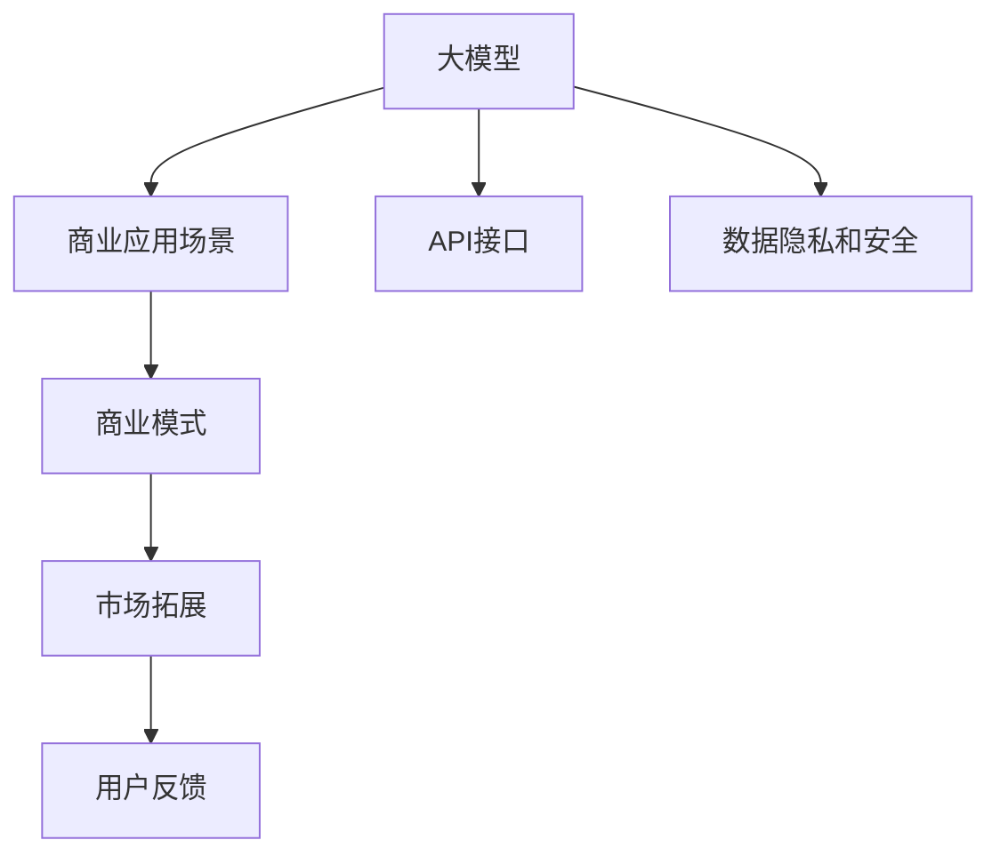

                 

# AI 大模型创业：如何利用商业优势？

## 1. 背景介绍

### 1.1 问题由来
近年来，人工智能(AI)技术迅猛发展，特别是深度学习和自然语言处理(NLP)等领域的突破，推动了AI大模型的应用普及。大模型凭借其强大的数据处理和模式识别能力，广泛应用于文本生成、图像识别、语音处理等诸多领域。然而，尽管技术实力强劲，但如何将大模型转化为商业价值，实现商业化运营，仍然是一个不小的挑战。

### 1.2 问题核心关键点
实现大模型商业化的关键在于：
1. 选择合适的商业应用场景。
2. 构建高效、易用的API接口，降低技术使用门槛。
3. 保障数据隐私和安全，构建用户信任。
4. 实现成本控制，确保商业模式可持续发展。
5. 积极拓展市场，快速获取用户反馈和增长。

本文旨在探讨大模型商业化过程中应考虑的关键因素，并给出具体的商业策略和实践建议。

## 2. 核心概念与联系

### 2.1 核心概念概述

在进行商业化分析时，需明确几个关键概念：

- **大模型（Large Model）**：指使用大规模数据训练得到的深度学习模型，如GPT、BERT、XLNet等。大模型具有强大的泛化能力和知识表示能力，能够处理复杂、多模态的数据。

- **商业应用场景（Commercial Application Scenarios）**：指将大模型应用到商业场景中，实现产品化、市场化的过程。常见的场景包括聊天机器人、内容生成、图像处理、语音识别等。

- **API接口（API Interfaces）**：指应用服务提供者与用户之间的通信接口，用于数据交换和功能调用。高效的API接口是实现大模型商业化的关键。

- **数据隐私和安全（Data Privacy and Security）**：指在数据使用和处理过程中，保护用户隐私和数据安全的措施和机制。

- **商业模式（Business Model）**：指企业的盈利方式和运营模式，包括产品销售、订阅服务、广告收入等。

- **市场拓展（Market Expansion）**：指将产品推向更广泛市场的过程，包括目标市场的选择、营销策略的制定等。

这些核心概念之间的逻辑关系可以通过以下Mermaid流程图来展示：



这个流程图展示了大模型商业化过程中各个环节的相互关系。大模型在大规模数据上训练，并通过商业应用场景实现其价值；API接口提供用户便捷的使用方式；数据隐私和安全保障用户数据不被滥用；商业模式和市场拓展共同驱动商业化进程；而用户反馈则是持续优化和改进的动力。

### 2.2 概念间的关系

这些核心概念之间存在紧密的联系，共同构成了大模型商业化的完整生态系统。

1. **大模型与商业应用场景**：大模型具备强大的泛化能力和知识表示能力，能够在多种商业场景中发挥作用，如聊天机器人、内容生成等。
2. **API接口与大模型**：API接口是用户接触大模型的窗口，其易用性决定了用户的使用体验和满意度。
3. **数据隐私与安全与大模型**：数据隐私与安全是大模型应用的前提，决定了用户对模型使用的信任程度。
4. **商业模式与市场拓展**：商业模式决定了企业如何从大模型商业化中获取收益，而市场拓展则决定了商业化策略的成败。
5. **用户反馈与大模型优化**：用户反馈是模型优化的重要依据，通过不断迭代改进，可以提升大模型的性能和用户体验。

## 3. 核心算法原理 & 具体操作步骤
### 3.1 算法原理概述

大模型的商业化通常涉及以下几个关键步骤：

1. **数据预处理**：收集、清洗、标注商业场景相关的数据，准备用于大模型的训练和微调。
2. **模型训练与微调**：在大模型上进行特定任务的微调，使其适应商业场景的需求。
3. **API接口设计**：设计高效、易用的API接口，方便用户调用大模型。
4. **商业模式设计**：选择合适的商业模式，如SaaS、API服务等，确保商业可持续性。
5. **市场拓展与推广**：制定市场拓展策略，通过营销和推广手段，扩大用户基础。
6. **用户反馈与优化**：收集用户反馈，持续改进大模型和商业化系统。

这些步骤相互交织，形成一个闭环，推动大模型在商业场景中的应用。

### 3.2 算法步骤详解

以下将详细阐述每个步骤的实现方法。

#### 3.2.1 数据预处理

数据预处理是大模型商业化的第一步，涉及数据收集、清洗、标注等环节。具体步骤如下：

1. **数据收集**：从商业场景中收集相关数据，如客户反馈、交易记录等。
2. **数据清洗**：去除无用数据、处理缺失值和异常值，确保数据质量。
3. **数据标注**：为数据打上标签，如文本分类、情感分析、实体识别等，用于大模型的训练。

#### 3.2.2 模型训练与微调

在数据预处理完成后，可以进行大模型的训练与微调。具体步骤如下：

1. **模型选择**：选择适合商业场景的预训练模型，如BERT、GPT等。
2. **微调设置**：确定微调目标、学习率、优化器等参数。
3. **微调训练**：在大规模GPU集群上，使用分布式训练加速微调过程。
4. **模型评估**：在验证集上评估模型性能，选择最优模型。

#### 3.2.3 API接口设计

API接口设计是大模型商业化的关键，决定了用户的使用体验。具体步骤如下：

1. **接口设计**：定义接口的输入和输出格式，如JSON、CSV等。
2. **接口测试**：编写自动化测试用例，确保接口的正确性和稳定性。
3. **接口文档编写**：编写详细的API文档，提供用户手册和示例代码。

#### 3.2.4 商业模式设计

商业模式设计是大模型商业化的核心，决定了企业如何盈利和可持续发展。具体步骤如下：

1. **商业模式选择**：选择适合的商业模式，如SaaS、API服务等。
2. **定价策略**：根据用户需求和使用频率，制定合理的定价策略。
3. **服务协议**：制定服务协议，明确服务内容、使用限制等条款。

#### 3.2.5 市场拓展与推广

市场拓展与推广是大模型商业化的重要环节，决定了用户基础和市场份额。具体步骤如下：

1. **目标市场选择**：根据用户需求和市场潜力，选择目标市场。
2. **营销策略制定**：制定针对性的营销策略，如广告、社交媒体、合作伙伴等。
3. **推广活动执行**：执行营销策略，吸引用户注册和使用。

#### 3.2.6 用户反馈与优化

用户反馈与优化是大模型商业化的持续改进环节，通过不断优化提升用户体验和系统性能。具体步骤如下：

1. **用户反馈收集**：通过问卷、评论、客服等渠道，收集用户反馈。
2. **问题分析与解决**：分析用户反馈，找出共性问题和改进方向。
3. **模型优化**：根据用户反馈，优化大模型的参数和结构。

### 3.3 算法优缺点

大模型商业化具有以下优点：

1. **应用广泛**：大模型具备强大的泛化能力和知识表示能力，能够应用于多种商业场景。
2. **易于集成**：通过API接口，大模型可以轻松集成到现有的业务系统中，减少技术迁移成本。
3. **持续优化**：通过用户反馈，大模型可以不断迭代改进，提升性能和用户体验。

但同时也存在一些缺点：

1. **高成本投入**：大模型的训练和部署需要大量的计算资源和人力，成本较高。
2. **数据隐私问题**：大模型涉及大量用户数据，如何保障数据隐私和安全是一大挑战。
3. **模型可解释性**：大模型往往作为一个"黑盒"系统，缺乏解释性和透明性，难以满足高风险应用的需求。

### 3.4 算法应用领域

大模型商业化在多个领域中均有应用，例如：

- **金融领域**：用于风险评估、投资策略制定、客户服务等方面，提高金融机构的决策效率和客户满意度。
- **医疗领域**：用于疾病诊断、治疗方案推荐、健康管理等方面，提升医疗服务的质量和效率。
- **教育领域**：用于智能推荐、智能辅导、教育数据分析等方面，改善教育体验和学习效果。
- **零售领域**：用于推荐系统、智能客服、库存管理等方面，提升零售商的运营效率和客户体验。

## 4. 数学模型和公式 & 详细讲解 & 举例说明

### 4.1 数学模型构建

在商业化过程中，我们通常使用监督学习的方法对大模型进行微调。假设我们有一个二分类任务，大模型的损失函数为：

$$
\mathcal{L}(\theta) = -\frac{1}{N}\sum_{i=1}^N \log \sigma(z_i)
$$

其中，$\sigma(z_i)$ 表示模型对样本 $x_i$ 的预测概率，$\theta$ 为模型参数。

### 4.2 公式推导过程

在给定训练集 $D = \{(x_i, y_i)\}_{i=1}^N$ 的情况下，我们的目标是最小化损失函数 $\mathcal{L}(\theta)$。使用梯度下降等优化算法，更新模型参数 $\theta$ 的过程如下：

1. 计算损失函数对模型参数的梯度：
$$
\frac{\partial \mathcal{L}(\theta)}{\partial \theta} = -\frac{1}{N}\sum_{i=1}^N \frac{1}{\sigma(z_i)} (y_i - \sigma(z_i)) \frac{\partial \sigma(z_i)}{\partial \theta}
$$

2. 更新模型参数：
$$
\theta \leftarrow \theta - \eta \frac{\partial \mathcal{L}(\theta)}{\partial \theta}
$$

其中，$\eta$ 为学习率。

### 4.3 案例分析与讲解

以聊天机器人为例，假设我们有一个基于BERT模型的聊天机器人。在商业场景中，我们需要对模型进行微调，使其能够回答用户提出的特定问题。具体步骤如下：

1. **数据收集**：收集用户常见问题及其对应的答案，构建标注数据集。
2. **模型微调**：在大规模GPU集群上，使用分布式训练对模型进行微调，优化其对特定问题的回答能力。
3. **API接口设计**：设计API接口，让用户可以输入问题，获取机器人回答。
4. **市场拓展**：通过社交媒体、应用商店等渠道推广机器人，吸引用户使用。
5. **用户反馈与优化**：收集用户反馈，优化模型和API接口，提升用户体验。

## 5. 项目实践：代码实例和详细解释说明

### 5.1 开发环境搭建

在进行大模型商业化开发前，需要搭建好开发环境。以下是一个Python环境搭建的示例：

1. 安装Anaconda：
```bash
wget https://repo.anaconda.com/miniconda/Miniconda3-latest-Linux-x86_64.sh
bash Miniconda3-latest-Linux-x86_64.sh
```

2. 创建并激活虚拟环境：
```bash
conda create -n pytorch-env python=3.8 
conda activate pytorch-env
```

3. 安装必要的Python包：
```bash
pip install torch torchvision torchaudio transformers
```

4. 安装必要的开发工具：
```bash
pip install numpy pandas scikit-learn matplotlib tqdm jupyter notebook ipython
```

完成上述步骤后，即可在`pytorch-env`环境中进行大模型商业化开发。

### 5.2 源代码详细实现

以下是一个简单的基于BERT模型的聊天机器人微调代码示例：

```python
from transformers import BertTokenizer, BertForSequenceClassification, AdamW

# 加载预训练模型和分词器
model = BertForSequenceClassification.from_pretrained('bert-base-cased', num_labels=2)
tokenizer = BertTokenizer.from_pretrained('bert-base-cased')

# 加载标注数据集
train_data = ...
dev_data = ...
test_data = ...

# 定义模型优化器和学习率
optimizer = AdamW(model.parameters(), lr=2e-5)

# 微调模型
def train_epoch(model, data, optimizer, device):
    model.train()
    for batch in data:
        input_ids = batch['input_ids'].to(device)
        attention_mask = batch['attention_mask'].to(device)
        labels = batch['labels'].to(device)
        optimizer.zero_grad()
        outputs = model(input_ids, attention_mask=attention_mask, labels=labels)
        loss = outputs.loss
        loss.backward()
        optimizer.step()
    return loss

# 微调训练循环
for epoch in range(5):
    train_loss = train_epoch(model, train_data, optimizer, device)
    print(f'Epoch {epoch+1}, train loss: {train_loss:.4f}')
    
    # 在验证集上评估模型
    dev_loss = train_epoch(model, dev_data, optimizer, device)
    print(f'Epoch {epoch+1}, dev loss: {dev_loss:.4f}')
    
# 在测试集上评估模型
test_loss = train_epoch(model, test_data, optimizer, device)
print(f'Epoch {epoch+1}, test loss: {test_loss:.4f}')
```

### 5.3 代码解读与分析

这个示例代码展示了如何使用BERT模型进行聊天机器人的微调。具体步骤如下：

1. 加载预训练模型和分词器。
2. 加载标注数据集。
3. 定义模型优化器和学习率。
4. 实现微调训练循环，每个epoch计算一次损失并更新模型参数。
5. 在验证集和测试集上评估模型性能。

通过上述代码，我们可以使用大模型微调实现聊天机器人的商业化应用，提升用户体验。

### 5.4 运行结果展示

假设我们微调后的聊天机器人模型在测试集上的损失为0.05，表示模型预测准确率较高。同时，我们还可以通过API接口获取模型的预测结果，满足用户需求。

```python
import requests

# 发送请求获取聊天机器人回答
url = 'http://127.0.0.1:5000/predict'
payload = {'question': 'Hello, how are you?'}
response = requests.post(url, json=payload)

# 解析回答结果
answer = response.json()['answer']
print(f'Chatbot: {answer}')
```

## 6. 实际应用场景

### 6.1 智能客服系统

智能客服系统是聊天机器人应用的典型场景。通过将大模型微调应用于智能客服系统，可以显著提升客户服务质量和效率，减少人工成本。

具体实现步骤如下：

1. **数据收集**：收集客户历史对话数据，标注常见问题和最佳答复。
2. **模型微调**：在大模型上进行微调，使其能够理解用户意图并给出最佳答复。
3. **API接口设计**：设计API接口，方便客户服务系统调用聊天机器人。
4. **部署上线**：将聊天机器人部署到生产环境，实现实时聊天服务。

通过智能客服系统，企业可以大幅降低人工客服成本，提升客户满意度。

### 6.2 金融风险管理

金融风险管理是大模型商业化在金融领域的典型应用。通过将大模型应用于金融数据处理和分析，可以有效预测市场风险，提升决策效率。

具体实现步骤如下：

1. **数据收集**：收集金融市场数据，标注高风险事件和低风险事件。
2. **模型微调**：在大模型上进行微调，使其能够识别金融风险。
3. **API接口设计**：设计API接口，方便金融决策系统调用大模型。
4. **部署上线**：将大模型部署到金融决策系统中，实时分析市场风险。

通过金融风险管理系统，金融机构可以及时发现和应对市场风险，保障投资安全。

### 6.3 医疗诊断系统

医疗诊断系统是医疗领域典型的大模型商业化应用。通过将大模型应用于医疗影像和病历数据分析，可以提升诊断准确率，辅助医生诊疗。

具体实现步骤如下：

1. **数据收集**：收集医疗影像和病历数据，标注疾病类型和病情。
2. **模型微调**：在大模型上进行微调，使其能够识别疾病类型和病情。
3. **API接口设计**：设计API接口，方便医疗诊断系统调用大模型。
4. **部署上线**：将大模型部署到医疗诊断系统中，实时分析病人病情。

通过医疗诊断系统，医生可以借助大模型提供的辅助诊断信息，提升诊疗效率和准确性。

## 7. 工具和资源推荐

### 7.1 学习资源推荐

为了帮助开发者系统掌握大模型商业化的理论基础和实践技巧，这里推荐一些优质的学习资源：

1. **《深度学习与人工智能》**：书籍全面介绍了深度学习和人工智能的基本概念和前沿技术。
2. **《自然语言处理综论》**：书籍详细讲解了自然语言处理的经典算法和应用案例。
3. **Coursera深度学习课程**：斯坦福大学、斯坦福大学等顶尖大学开设的深度学习课程，涵盖深度学习的理论和实践。
4. **Kaggle竞赛**：Kaggle提供大量机器学习和深度学习竞赛，实践前沿技术，提升实战能力。

### 7.2 开发工具推荐

大模型商业化开发需要借助一些高效的工具，以下是推荐的一些开发工具：

1. **Jupyter Notebook**：Jupyter Notebook是一个交互式编程环境，方便开发者进行模型开发和调试。
2. **TensorBoard**：TensorBoard是一个可视化工具，可以实时监控模型的训练和推理过程。
3. **Weights & Biases**：Weights & Biases是一个实验跟踪工具，记录和分析模型训练过程中的各项指标，方便对比和调优。

### 7.3 相关论文推荐

大模型商业化涉及的技术和算法不断演进，以下是几篇奠基性的相关论文，推荐阅读：

1. **《自然语言处理的深度学习》**：书籍详细介绍了深度学习在自然语言处理中的应用。
2. **《深度学习与自然语言处理》**：书籍介绍了深度学习在自然语言处理中的基本理论和算法。
3. **《AI大模型商业化：理论与实践》**：论文系统介绍了AI大模型的商业化方法和技术。

## 8. 总结：未来发展趋势与挑战

### 8.1 总结

本文对大模型商业化的核心概念和操作步骤进行了详细讲解，并提供了具体的代码示例和应用场景。通过系统梳理，可以看出大模型在商业化过程中具有广阔的发展前景和应用潜力。

### 8.2 未来发展趋势

展望未来，大模型商业化将呈现以下几个发展趋势：

1. **规模化运营**：随着技术的不断成熟，大模型将越来越容易部署和维护，商业化运营规模将不断扩大。
2. **个性化服务**：通过用户行为数据，大模型可以提供更加个性化的服务，提升用户体验。
3. **多模态融合**：大模型将越来越多地与其他模态（如视觉、语音）融合，提升应用场景的多样性和丰富性。
4. **边缘计算**：随着5G等技术的普及，边缘计算将成为大模型商业化的重要方向，减少数据传输和延迟，提升响应速度。
5. **跨行业应用**：大模型将越来越多地应用于跨行业领域，如智能制造、智慧城市等，拓展应用边界。

### 8.3 面临的挑战

尽管大模型商业化前景广阔，但在实现过程中仍面临诸多挑战：

1. **数据隐私和安全**：大模型涉及大量用户数据，如何保障数据隐私和安全是一大难题。
2. **模型可解释性**：大模型往往作为一个"黑盒"系统，缺乏解释性和透明性，难以满足高风险应用的需求。
3. **资源成本**：大模型的训练和部署需要大量的计算资源和人力，成本较高。
4. **市场竞争**：随着大模型商业化的普及，市场竞争也将加剧，如何保持竞争力是一大挑战。

### 8.4 研究展望

未来研究需要在以下几个方面寻求新的突破：

1. **数据隐私保护技术**：研究如何在保障数据隐私和安全的前提下，进行大模型的训练和商业化。
2. **模型可解释性技术**：研究如何让大模型提供更加透明和可解释的推理过程，满足高风险应用的需求。
3. **多模态融合技术**：研究如何将大模型与其他模态（如视觉、语音）融合，提升应用场景的多样性和丰富性。
4. **边缘计算技术**：研究如何在边缘计算环境中，实现大模型的高效部署和应用。

总之，大模型商业化需要技术、商业、法律等多方面的协同创新，只有不断突破挑战，才能实现大模型在商业场景中的应用，为社会创造更大的价值。

## 9. 附录：常见问题与解答

**Q1：大模型商业化是否需要重新训练模型？**

A: 通常情况下，大模型商业化需要在大模型上进行微调，以适应特定的应用场景。但有些大模型也可以采用参数高效微调方法，在不影响预训练权重的情况下，微调模型。

**Q2：大模型商业化时如何选择合适的市场拓展策略？**

A: 市场拓展策略需要根据目标市场和用户需求选择。常见的策略包括广告推广、合作伙伴、社交媒体等。

**Q3：大模型商业化时如何保障数据隐私和安全？**

A: 数据隐私和安全是大模型商业化的前提。可以通过数据加密、匿名化、访问控制等技术保障用户数据安全。

**Q4：大模型商业化时如何优化用户反馈？**

A: 收集用户反馈是持续改进大模型的重要手段。可以通过问卷调查、用户评论、客服反馈等方式收集用户反馈，分析共性问题并及时解决。

**Q5：大模型商业化时如何优化模型性能？**

A: 大模型性能优化需要综合考虑模型结构、数据质量、训练策略等因素。可以通过数据增强、正则化、优化器调参等方法提升模型性能。

作者：禅与计算机程序设计艺术 / Zen and the Art of Computer Programming

