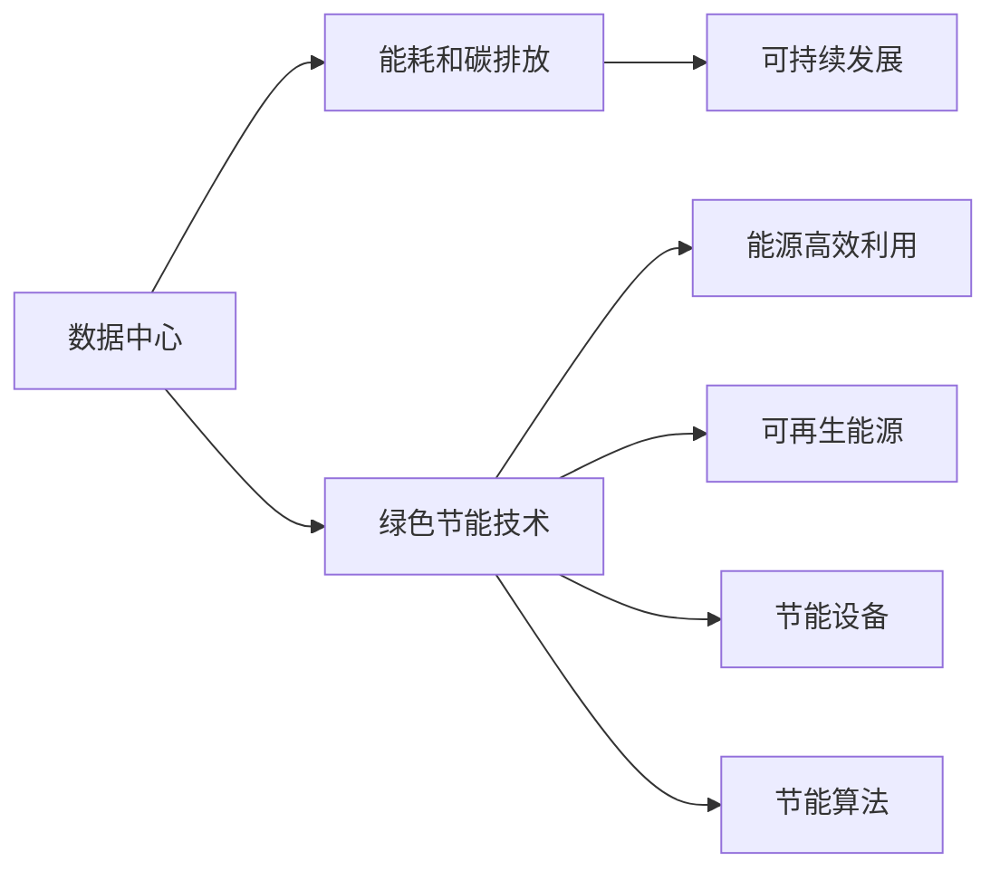
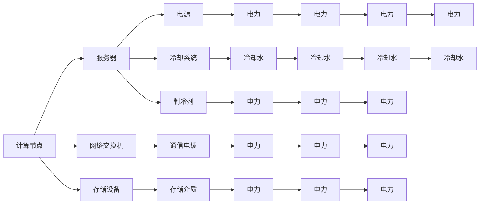
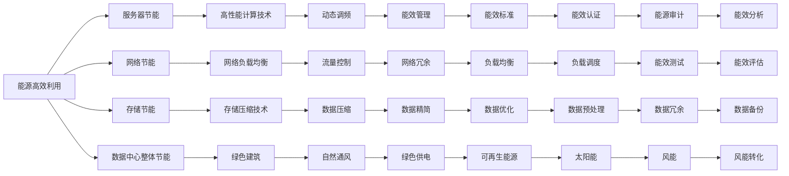

                 

# AI 大模型应用数据中心建设：数据中心绿色节能

> 关键词：AI大模型,数据中心,绿色节能,低碳环保,可持续技术

## 1. 背景介绍

### 1.1 问题由来
随着人工智能（AI）和大数据技术的发展，数据中心成为支撑AI大模型训练和应用的重要基础设施。然而，数据中心的高能耗、高碳排放问题也日益凸显。在全球气候变化和环境保护的迫切需求下，如何实现数据中心的绿色节能成为一项重要的课题。

### 1.2 问题核心关键点
本问题核心在于，如何在保证数据中心高效运行的前提下，降低其能耗和碳排放，实现可持续发展的目标。具体来说，需要解决以下核心问题：
- 数据中心的能耗和碳排放量计算方法
- 数据中心的绿色节能技术
- 数据中心的可持续发展策略
- 数据中心的管理和维护

### 1.3 问题研究意义
实现数据中心的绿色节能，不仅有助于缓解全球气候变化，还有助于降低运营成本，提升企业形象和竞争力。具体意义包括：
- 降低数据中心的运营成本，提高企业的经济效益。
- 减少对环境的负面影响，提升企业的社会责任感和品牌形象。
- 促进技术的创新和应用，推动AI和大数据技术的发展。
- 为其他行业提供示范和借鉴，推动整体产业的绿色转型。

## 2. 核心概念与联系

### 2.1 核心概念概述
为更好地理解数据中心的绿色节能技术，本节将介绍几个密切相关的核心概念：

- **数据中心**：由计算、网络、存储等基础设施组成的，为计算机系统提供数据存储、处理、传输等服务的大型设施。
- **能耗和碳排放**：数据中心在运行过程中消耗的电力和排放的二氧化碳量。
- **绿色节能技术**：包括能源高效利用、可再生能源、节能设备、节能算法等，用于降低数据中心的能耗和碳排放。
- **可持续发展**：指在满足当前需求的前提下，不损害未来代际发展的能力，包括经济、社会、环境等方面的综合考虑。

这些核心概念之间的逻辑关系可以通过以下Mermaid流程图来展示：



这个流程图展示了数据中心与能耗和碳排放的关系，以及绿色节能技术如何通过多种手段降低能耗和碳排放，最终实现可持续发展。

### 2.2 概念间的关系

这些核心概念之间存在着紧密的联系，形成了数据中心绿色节能的整体架构。下面我们通过几个Mermaid流程图来展示这些概念之间的关系。

#### 2.2.1 数据中心的能源消耗


这个流程图展示了数据中心的主要能源消耗环节，包括服务器、网络交换机、存储设备、电源、冷却系统等。这些环节的能耗直接影响到数据中心的总能耗。

#### 2.2.2 绿色节能技术的分类


这个流程图展示了绿色节能技术的分类，包括服务器、网络、存储等方面的节能技术，以及整体节能和建筑方面的节能措施。

#### 2.2.3 可持续发展策略
```mermaid
graph LR
    A[能效管理] --> B[能源利用效率]
    A --> C[可再生能源比例]
    A --> D[碳排放量]
    A --> E[废弃物管理]
    A --> F[资源回收]
    B --> G[数据中心建设]
    C --> H[能源供应]
    D --> I[环境影响]
    E --> J[废物处理]
    F --> K[物料回收]
    G --> L[设施维护]
    H --> M[供电策略]
    I --> N[生态保护]
    J --> O[废物减量化]
    K --> P[材料再利用]
    L --> Q[设备更新]
    M --> R[能源源配置]
    N --> S[自然保护]
    O --> T[废物收集]
    P --> U[材料循环]
    Q --> V[技术升级]
    R --> W[分布式电源]
    S --> X[生态系统保护]
    T --> Y[废物分类]
    U --> Z[材料再生]
    V --> AA[技术改进]
    W --> AB[分布式发电]
    X --> AC[生态保护措施]
    Y --> AD[废物分类策略]
    Z --> AE[材料再生技术]
    AA --> AF[技术优化]
    AB --> AG[分布式发电技术]
    AC --> AH[生态保护方法]
    AD --> AI[废物分类标准]
    AE --> AJ[材料再生流程]
    AF --> AK[技术优化措施]
    AG --> AL[分布式发电系统]
    AH --> AM[生态保护方法]
    AI --> AN[废物分类策略]
    AJ --> AO[材料再生流程]
    AK --> AP[技术优化措施]
    AL --> AQ[分布式发电系统]
    AM --> AR[生态保护措施]
    AN --> AS[废物分类标准]
    AO --> AT[废物分类策略]
    AP --> AU[技术优化措施]
    AQ --> AV[分布式发电系统]
    AR --> AW[生态保护方法]
    AS --> AX[废物分类策略]
    AT --> AY[废物分类标准]
    AU --> AZ[技术优化措施]
    AV --> BA[分布式发电系统]
    AW --> BB[生态保护方法]
    AX --> BC[废物分类策略]
    AY --> BD[废物分类标准]
    AZ --> BE[技术优化措施]
    BA --> BF[分布式发电系统]
    BB --> BG[生态保护方法]
    BC --> BH[废物分类策略]
    BD --> BI[废物分类标准]
    BE --> BJ[技术优化措施]
    BF --> BL[分布式发电系统]
    BG --> BM[生态保护方法]
    BH --> BN[废物分类策略]
    BI --> BO[废物分类标准]
    BJ --> BP[技术优化措施]
    BL --> BM[分布式发电系统]
    BM --> BN[生态保护方法]
    BN --> BO[废物分类策略]
    BP --> BQ[技术优化措施]
    BM --> BR[分布式发电系统]
    BN --> BS[生态保护方法]
    BO --> BT[废物分类标准]
    BQ --> BU[技术优化措施]
    BR --> BS[分布式发电系统]
    BS --> BT[生态保护方法]
    BT --> BO[废物分类策略]
    BU --> BV[技术优化措施]
    BV --> BW[分布式发电系统]
    BW --> BX[生态保护方法]
    BX --> BY[废物分类策略]
    BY --> BZ[废物分类标准]
    BZ --> BA[分布式发电系统]
    BA --> BF[分布式发电系统]
    BF --> BG[生态保护方法]
    BG --> BH[废物分类策略]
    BH --> BI[废物分类标准]
    BI --> BJ[技术优化措施]
    BJ --> BL[分布式发电系统]
    BL --> BM[生态保护方法]
    BM --> BN[废物分类策略]
    BN --> BO[废物分类标准]
    BO --> BP[技术优化措施]
    BP --> BQ[分布式发电系统]
    BQ --> BR[生态保护方法]
    BR --> BS[废物分类策略]
    BS --> BT[废物分类标准]
    BT --> BO[废物分类策略]
    BO --> BP[技术优化措施]
    BP --> BQ[分布式发电系统]
    BQ --> BR[生态保护方法]
    BR --> BS[废物分类策略]
    BS --> BT[废物分类标准]
    BT --> BO[废物分类策略]
    BO --> BP[技术优化措施]
    BP --> BQ[分布式发电系统]
    BQ --> BR[生态保护方法]
    BR --> BS[废物分类策略]
    BS --> BT[废物分类标准]
    BT --> BO[废物分类策略]
    BO --> BP[技术优化措施]
    BP --> BQ[分布式发电系统]
    BQ --> BR[生态保护方法]
    BR --> BS[废物分类策略]
    BS --> BT[废物分类标准]
    BT --> BO[废物分类策略]
    BO --> BP[技术优化措施]
    BP --> BQ[分布式发电系统]
    BQ --> BR[生态保护方法]
    BR --> BS[废物分类策略]
    BS --> BT[废物分类标准]
    BT --> BO[废物分类策略]
    BO --> BP[技术优化措施]
    BP --> BQ[分布式发电系统]
    BQ --> BR[生态保护方法]
    BR --> BS[废物分类策略]
    BS --> BT[废物分类标准]
    BT --> BO[废物分类策略]
    BO --> BP[技术优化措施]
    BP --> BQ[分布式发电系统]
    BQ --> BR[生态保护方法]
    BR --> BS[废物分类策略]
    BS --> BT[废物分类标准]
    BT --> BO[废物分类策略]
    BO --> BP[技术优化措施]
    BP --> BQ[分布式发电系统]
    BQ --> BR[生态保护方法]
    BR --> BS[废物分类策略]
    BS --> BT[废物分类标准]
    BT --> BO[废物分类策略]
    BO --> BP[技术优化措施]
    BP --> BQ[分布式发电系统]
    BQ --> BR[生态保护方法]
    BR --> BS[废物分类策略]
    BS --> BT[废物分类标准]
    BT --> BO[废物分类策略]
    BO --> BP[技术优化措施]
    BP --> BQ[分布式发电系统]
    BQ --> BR[生态保护方法]
    BR --> BS[废物分类策略]
    BS --> BT[废物分类标准]
    BT --> BO[废物分类策略]
    BO --> BP[技术优化措施]
    BP --> BQ[分布式发电系统]
    BQ --> BR[生态保护方法]
    BR --> BS[废物分类策略]
    BS --> BT[废物分类标准]
    BT --> BO[废物分类策略]
    BO --> BP[技术优化措施]
    BP --> BQ[分布式发电系统]
    BQ --> BR[生态保护方法]
    BR --> BS[废物分类策略]
    BS --> BT[废物分类标准]
    BT --> BO[废物分类策略]
    BO --> BP[技术优化措施]
    BP --> BQ[分布式发电系统]
    BQ --> BR[生态保护方法]
    BR --> BS[废物分类策略]
    BS --> BT[废物分类标准]
    BT --> BO[废物分类策略]
    BO --> BP[技术优化措施]
    BP --> BQ[分布式发电系统]
    BQ --> BR[生态保护方法]
    BR --> BS[废物分类策略]
    BS --> BT[废物分类标准]
    BT --> BO[废物分类策略]
    BO --> BP[技术优化措施]
    BP --> BQ[分布式发电系统]
    BQ --> BR[生态保护方法]
    BR --> BS[废物分类策略]
    BS --> BT[废物分类标准]
    BT --> BO[废物分类策略]
    BO --> BP[技术优化措施]
    BP --> BQ[分布式发电系统]
    BQ --> BR[生态保护方法]
    BR --> BS[废物分类策略]
    BS --> BT[废物分类标准]
    BT --> BO[废物分类策略]
    BO --> BP[技术优化措施]
    BP --> BQ[分布式发电系统]
    BQ --> BR[生态保护方法]
    BR --> BS[废物分类策略]
    BS --> BT[废物分类标准]
    BT --> BO[废物分类策略]
    BO --> BP[技术优化措施]
    BP --> BQ[分布式发电系统]
    BQ --> BR[生态保护方法]
    BR --> BS[废物分类策略]
    BS --> BT[废物分类标准]
    BT --> BO[废物分类策略]
    BO --> BP[技术优化措施]
    BP --> BQ[分布式发电系统]
    BQ --> BR[生态保护方法]
    BR --> BS[废物分类策略]
    BS --> BT[废物分类标准]
    BT --> BO[废物分类策略]
    BO --> BP[技术优化措施]
    BP --> BQ[分布式发电系统]
    BQ --> BR[生态保护方法]
    BR --> BS[废物分类策略]
    BS --> BT[废物分类标准]
    BT --> BO[废物分类策略]
    BO --> BP[技术优化措施]
    BP --> BQ[分布式发电系统]
    BQ --> BR[生态保护方法]
    BR --> BS[废物分类策略]
    BS --> BT[废物分类标准]
    BT --> BO[废物分类策略]
    BO --> BP[技术优化措施]
    BP --> BQ[分布式发电系统]
    BQ --> BR[生态保护方法]
    BR --> BS[废物分类策略]
    BS --> BT[废物分类标准]
    BT --> BO[废物分类策略]
    BO --> BP[技术优化措施]
    BP --> BQ[分布式发电系统]
    BQ --> BR[生态保护方法]
    BR --> BS[废物分类策略]
    BS --> BT[废物分类标准]
    BT --> BO[废物分类策略]
    BO --> BP[技术优化措施]
    BP --> BQ[分布式发电系统]
    BQ --> BR[生态保护方法]
    BR --> BS[废物分类策略]
    BS --> BT[废物分类标准]
    BT --> BO[废物分类策略]
    BO --> BP[技术优化措施]
    BP --> BQ[分布式发电系统]
    BQ --> BR[生态保护方法]
    BR --> BS[废物分类策略]
    BS --> BT[废物分类标准]
    BT --> BO[废物分类策略]
    BO --> BP[技术优化措施]
    BP --> BQ[分布式发电系统]
    BQ --> BR[生态保护方法]
    BR --> BS[废物分类策略]
    BS --> BT[废物分类标准]
    BT --> BO[废物分类策略]
    BO --> BP[技术优化措施]
    BP --> BQ[分布式发电系统]
    BQ --> BR[生态保护方法]
    BR --> BS[废物分类策略]
    BS --> BT[废物分类标准]
    BT --> BO[废物分类策略]
    BO --> BP[技术优化措施]
    BP --> BQ[分布式发电系统]
    BQ --> BR[生态保护方法]
    BR --> BS[废物分类策略]
    BS --> BT[废物分类标准]
    BT --> BO[废物分类策略]
    BO --> BP[技术优化措施]
    BP --> BQ[分布式发电系统]
    BQ --> BR[生态保护方法]
    BR --> BS[废物分类策略]
    BS --> BT[废物分类标准]
    BT --> BO[废物分类策略]
    BO --> BP[技术优化措施]
    BP --> BQ[分布式发电系统]
    BQ --> BR[生态保护方法]
    BR --> BS[废物分类策略]
    BS --> BT[废物分类标准]
    BT --> BO[废物分类策略]
    BO --> BP[技术优化措施]
    BP --> BQ[分布式发电系统]
    BQ --> BR[生态保护方法]
    BR --> BS[废物分类策略]
    BS --> BT[废物分类标准]
    BT --> BO[废物分类策略]
    BO --> BP[技术优化措施]
    BP --> BQ[分布式发电系统]
    BQ --> BR[生态保护方法]
    BR --> BS[废物分类策略]
    BS --> BT[废物分类标准]
    BT --> BO[废物分类策略]
    BO --> BP[技术优化措施]
    BP --> BQ[分布式发电系统]
    BQ --> BR[生态保护方法]
    BR --> BS[废物分类策略]
    BS --> BT[废物分类标准]
    BT --> BO[废物分类策略]
    BO --> BP[技术优化措施]
    BP --> BQ[分布式发电系统]
    BQ --> BR[生态保护方法]
    BR --> BS[废物分类策略]
    BS --> BT[废物分类标准]
    BT --> BO[废物分类策略]
    BO --> BP[技术优化措施]
    BP --> BQ[分布式发电系统]
    BQ --> BR[生态保护方法]
    BR --> BS[废物分类策略]
    BS --> BT[废物分类标准]
    BT --> BO[废物分类策略]
    BO --> BP[技术优化措施]
    BP --> BQ[分布式发电系统]
    BQ --> BR[生态保护方法]
    BR --> BS[废物分类策略]
    BS --> BT[废物分类标准]
    BT --> BO[废物分类策略]
    BO --> BP[技术优化措施]
    BP --> BQ[分布式发电系统]
    BQ --> BR[生态保护方法]
    BR --> BS[废物分类策略]
    BS --> BT[废物分类标准]
    BT --> BO[废物分类策略]
    BO --> BP[技术优化措施]
    BP --> BQ[分布式发电系统]
    BQ --> BR[生态保护方法]
    BR --> BS[废物分类策略]
    BS --> BT[废物分类标准]
    BT --> BO[废物分类策略]
    BO --> BP[技术优化措施]
    BP --> BQ[分布式发电系统]
    BQ --> BR[生态保护方法]
    BR --> BS[废物分类策略]
    BS --> BT[废物分类标准]
    BT --> BO[废物分类策略]
    BO --> BP[技术优化措施]
    BP --> BQ[分布式发电系统]
    BQ --> BR[生态保护方法]
    BR --> BS[废物分类策略]
    BS --> BT[废物分类标准]
    BT --> BO[废物分类策略]
    BO --> BP[技术优化措施]
    BP --> BQ[分布式发电系统]
    BQ --> BR[生态保护方法]
    BR --> BS[废物分类策略]
    BS --> BT[废物分类标准]
    BT --> BO[废物分类策略]
    BO --> BP[技术优化措施]
    BP --> BQ[分布式发电系统]
    BQ --> BR[生态保护方法]
    BR --> BS[废物分类策略]
    BS --> BT[废物分类标准]
    BT --> BO[废物分类策略]
    BO --> BP[技术优化措施]
    BP --> BQ[分布式发电系统]
    BQ --> BR[生态保护方法]
    BR --> BS[废物分类策略]
    BS --> BT[废物分类标准]
    BT --> BO[废物分类策略]
    BO --> BP[技术优化措施]
    BP --> BQ[分布式发电系统]
    BQ --> BR[生态保护方法]
    BR --> BS[废物分类策略]
    BS --> BT[废物分类标准]
    BT --> BO[废物分类策略]
    BO --> BP[技术优化措施]
    BP --> BQ[分布式发电系统]
    BQ --> BR[生态保护方法]
    BR --> BS[废物分类策略]
    BS --> BT[废物分类标准]
    BT --> BO[废物分类策略]
    BO --> BP[技术优化措施]
    BP --> BQ[分布式发电系统]
    BQ --> BR[生态保护方法]
    BR --> BS[废物分类策略]
    BS --> BT[废物分类标准]
    BT --> BO[废物分类策略]
    BO --> BP[技术优化措施]
    BP --> BQ[分布式发电系统]
    BQ --> BR[生态保护方法]
    BR --> BS[废物分类策略]
    BS --> BT[废物分类标准]
    BT --> BO[废物分类策略]
    BO --> BP[技术优化措施]
    BP --> BQ[分布式发电系统]
    BQ --> BR[生态保护方法]
    BR --> BS[废物分类策略]
    BS --> BT[废物分类标准]
    BT --> BO[废物分类策略]
    BO --> BP[技术优化措施]
    BP --> BQ[分布式发电系统]
    BQ --> BR[生态保护方法]
    BR --> BS[废物分类策略]
    BS --> BT[废物分类标准]
    BT --> BO[废物分类策略]
    BO --> BP[技术优化措施]
    BP --> BQ[分布式发电系统]
    BQ --> BR[生态保护方法]
    BR --> BS[废物分类策略]
    BS --> BT[废物分类标准]
    BT --> BO[废物分类策略]
    BO --> BP[技术优化措施]
    BP --> BQ[分布式发电系统]
    BQ --> BR[生态保护方法]
    BR --> BS[废物分类策略]
    BS --> BT[废物分类标准]
    BT --> BO[废物分类策略]
    BO --> BP[技术优化措施]
    BP --> BQ[分布式发电系统]
    BQ --> BR[生态保护方法]
    BR --> BS[废物分类策略]
    BS --> BT[废物分类标准]
    BT --> BO[废物分类策略]
    BO --> BP[技术优化措施]
    BP --> BQ[分布式发电系统]
    BQ --> BR[生态保护方法]
    BR --> BS[废物分类策略]
    BS --> BT[废物分类标准]
    BT --> BO[废物分类策略]
    BO --> BP[技术优化措施]
    BP --> BQ[分布式发电系统]
    BQ --> BR[生态保护方法]
    BR --> BS[废物分类策略]
    BS --> BT[废物分类标准]
    BT --> BO[废物分类策略]
    BO --> BP[技术优化措施]
    BP --> BQ[分布式发电系统]
    BQ --> BR[生态保护方法]
    BR --> BS[废物分类策略]
    BS --> BT[废物分类标准]
    BT --> BO[废物分类策略]
    BO --> BP[技术优化措施]
    BP --> BQ[分布式发电系统]
    BQ --> BR[生态保护方法]
    BR --> BS[废物分类策略]
    BS --> BT[废物分类标准]
    BT --> BO[废物分类策略]
    BO --> BP[技术优化措施]
    BP --> BQ[分布式发电系统]
    BQ --> BR[生态保护方法]
    BR --> BS[废物分类策略]
    BS --> BT[废物分类标准]
    BT --> BO[废物分类策略]
    BO --> BP[技术优化措施]
    BP --> BQ[分布式发电系统]
    BQ --> BR[生态保护方法]
    BR --> BS[废物分类策略]
    BS --> BT[废物分类标准]
    BT --> BO[废物分类策略]
    BO --> BP[技术优化措施]
    BP --> BQ[分布式发电系统]
    BQ --> BR[生态保护方法]
    BR --> BS[废物分类策略]
    BS --> BT[废物分类标准]
    BT --> BO[废物分类策略]
    BO --> BP[技术优化措施]
    BP --> BQ[分布式发电系统]
    BQ --> BR[生态保护方法]
    BR --> BS[废物分类策略]
    BS --> BT[废物分类标准]
    BT --> BO[废物分类策略]
    BO --> BP[技术优化措施]
    BP --> BQ[分布式发电系统]
    BQ --> BR[生态保护方法]
    BR --> BS[废物分类策略]
    BS --> BT[废物分类标准]
    BT --> BO[废物分类策略]
    BO --> BP[技术优化措施]
    BP --> BQ[分布式发电系统]
    BQ --> BR[生态保护方法]
    BR --> BS[废物分类策略]
    BS --> BT[废物分类标准]
    BT --> BO[废物分类策略]
    BO --> BP[技术优化措施]
    BP --> BQ[分布式发电系统]
    BQ --> BR[生态保护方法]
    BR --> BS[废物分类策略]
    BS --> BT[废物分类标准]
    BT --> BO[废物分类策略]
    BO --> BP[技术优化措施]
    BP --> BQ[分布式发电系统]
    BQ --> BR[生态保护方法]
    BR --> BS[废物分类策略]
    BS --> BT[废物分类标准]
    BT --> BO[废物分类策略]
    BO --> BP[技术优化措施]
    BP --> BQ[分布式发电系统]
    BQ --> BR[生态保护方法]
    BR --> BS[废物分类策略]
    BS --> BT[废物分类标准]
    BT --> BO[废物分类策略]
    BO --> BP[技术优化措施]
    BP --> BQ[分布式发电系统]
    BQ --> BR[生态保护方法]
    BR --> BS[废物分类策略]
    BS --> BT[废物分类标准]
    BT --> BO[废物分类策略]
    BO --> BP[技术优化措施]
    BP --> B

