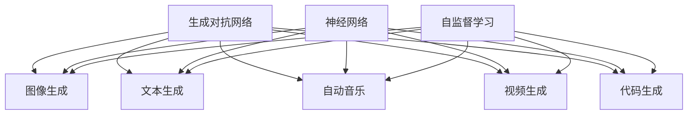
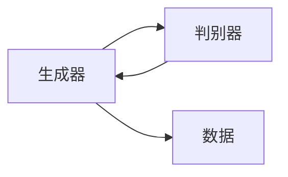
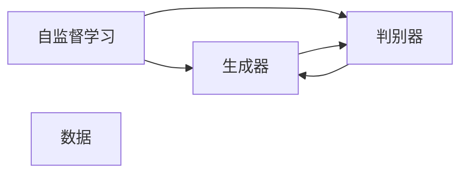
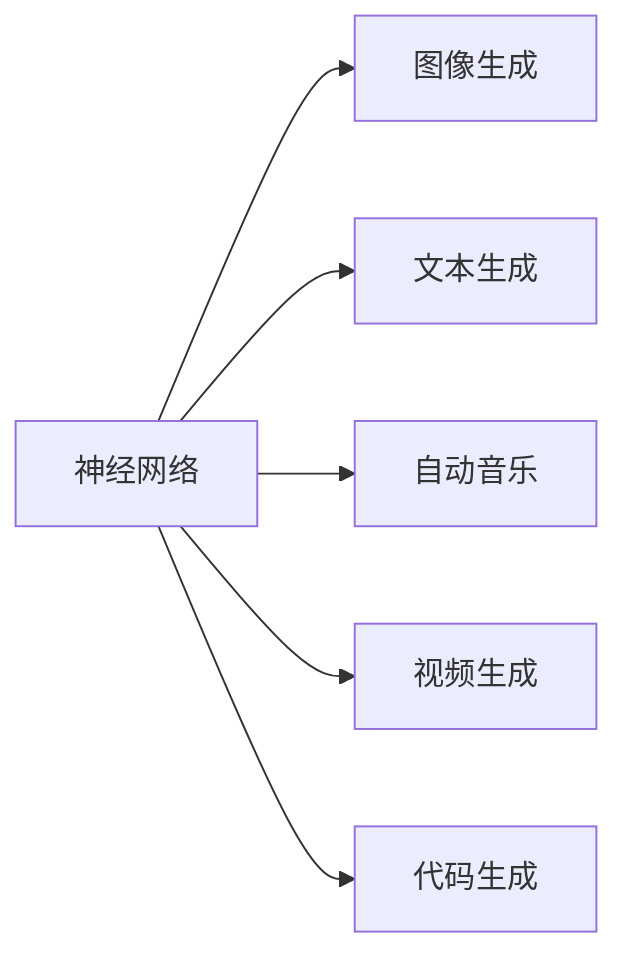
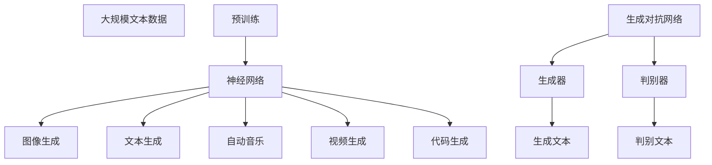

                 

# AIGC 原理与代码实例讲解

> 关键词：生成对抗网络, 自监督学习, 神经网络, 图像生成, 文本生成, 自动音乐, 视频生成, 代码生成, 生成模型

## 1. 背景介绍

### 1.1 问题由来
近年来，随着人工智能技术的迅猛发展，生成对抗网络(Generative Adversarial Networks, GANs)在图像、视频、音频、文本等多个领域展现出强大的生成能力，并逐渐形成了一门独立的AI分支——生成对抗网络，简称AIGC。AIGC 技术与传统人工智能技术相比，具有高度的多样化、智能化和可扩展性，已经成为人工智能领域的研究热点和应用前沿。

AIGC 在内容创作、艺术设计、教育培训、娱乐休闲等领域展现出广阔的应用前景。例如，在艺术领域，AIGC 技术可以用于生成逼真的艺术作品，提升创作效率；在教育领域，AIGC 技术可以用于个性化教育内容的生成，促进因材施教；在娱乐领域，AIGC 技术可以用于虚拟角色的生成，提升用户体验。因此，深入理解和掌握 AIGC 技术，对于推动人工智能技术的普及和应用具有重要意义。

### 1.2 问题核心关键点
AIGC 技术主要包括生成器和判别器两个部分，通过对抗训练的方式，生成器生成逼真的数据，判别器评估生成的数据与真实数据之间的差异。生成器和判别器通过不断的博弈，不断提高自身的生成能力和判别能力。AIGC 技术的核心目标是在生成与判别之间找到最优平衡点，使得生成器生成的数据尽可能地逼真，而判别器无法准确区分生成数据和真实数据。

在实际应用中，AIGC 技术可以通过以下方式进行扩展和应用：

1. 图像生成：利用 GANs 生成逼真的图像，广泛应用于人脸生成、图像修复、图像转换等领域。
2. 视频生成：利用 GANs 生成逼真的视频片段，应用于视频补帧、视频预测、视频编辑等领域。
3. 音频生成：利用 WaveGAN 等技术生成逼真的音频，应用于音乐创作、语音合成、声音转换等领域。
4. 文本生成：利用 GPT 等语言模型生成逼真的文本，广泛应用于自动摘要、对话系统、机器翻译等领域。
5. 代码生成：利用神经网络生成符合规范的代码，应用于程序自动生成、代码缺陷检测等领域。

AIGC 技术的应用价值在于其能够自动化地生成高质量的数据，极大地提高了数据采集和处理的效率。同时，AIGC 技术也可以应用于复杂领域的知识发现和信息检索，促进人工智能技术在各行业的应用和发展。

### 1.3 问题研究意义
AIGC 技术的研究和发展，对于推动人工智能技术的普及和应用具有重要意义：

1. 提升数据获取效率：AIGC 技术可以自动化生成大量高质量的数据，减少了人工采集和标注的成本和时间。
2. 促进模型训练：AIGC 技术可以生成符合任务需求的数据，提高模型训练的效率和效果。
3. 拓展应用场景：AIGC 技术可以应用于多个领域，提升各行业的智能化水平。
4. 推动技术创新：AIGC 技术为人工智能技术的突破和创新提供了新的方向和思路。

## 2. 核心概念与联系

### 2.1 核心概念概述

为了更好地理解 AIGC 技术的原理和应用，本节将介绍几个密切相关的核心概念：

- 生成对抗网络(Generative Adversarial Networks, GANs)：一种基于博弈论的深度学习模型，包含生成器和判别器两个部分，通过对抗训练的方式生成逼真的数据。
- 自监督学习(Self-Supervised Learning)：一种无需人工标注的训练方法，通过利用数据自身的内在关系进行学习。
- 神经网络(Neural Network)：一种由大量神经元组成的计算模型，可以用于图像、文本、音频等多种数据类型的生成和处理。
- 图像生成(Image Generation)：利用 GANs 生成逼真的图像，广泛应用于人脸生成、图像修复、图像转换等领域。
- 文本生成(Text Generation)：利用 GPT 等语言模型生成逼真的文本，广泛应用于自动摘要、对话系统、机器翻译等领域。
- 自动音乐(Automatic Music)：利用 WaveGAN 等技术生成逼真的音乐，广泛应用于音乐创作、语音合成、声音转换等领域。
- 视频生成(Video Generation)：利用 GANs 生成逼真的视频片段，广泛应用于视频补帧、视频预测、视频编辑等领域。
- 代码生成(Code Generation)：利用神经网络生成符合规范的代码，应用于程序自动生成、代码缺陷检测等领域。

这些核心概念之间的逻辑关系可以通过以下 Mermaid 流程图来展示：



这个流程图展示了大语言模型微调过程中各个核心概念之间的关系：

1. 生成对抗网络是 AIGC 技术的基础，包含生成器和判别器两个部分。
2. 自监督学习是训练生成对抗网络的一种方式，通过利用数据自身的内在关系进行学习。
3. 神经网络是 AIGC 技术的主要工具，用于生成和处理各种数据类型。
4. 图像生成、文本生成、自动音乐、视频生成、代码生成等是 AIGC 技术在各个领域的具体应用。

这些概念共同构成了 AIGC 技术的核心生态系统，使其能够在各个领域发挥强大的生成能力。通过理解这些核心概念，我们可以更好地把握 AIGC 技术的工作原理和优化方向。

### 2.2 概念间的关系

这些核心概念之间存在着紧密的联系，形成了 AIGC 技术的完整生态系统。下面我通过几个 Mermaid 流程图来展示这些概念之间的关系。

#### 2.2.1 生成对抗网络的基本原理



这个流程图展示了生成对抗网络的基本原理，即生成器和判别器通过不断的博弈，不断提高自身的生成能力和判别能力。

#### 2.2.2 自监督学习与生成对抗网络的关系



这个流程图展示了自监督学习在生成对抗网络中的应用。通过自监督学习，生成器和判别器可以更好地理解数据的特征和规律，从而提高生成和判别的准确性。

#### 2.2.3 神经网络在 AIGC 技术中的应用



这个流程图展示了神经网络在 AIGC 技术中的应用，包括图像生成、文本生成、自动音乐、视频生成、代码生成等。

### 2.3 核心概念的整体架构

最后，我们用一个综合的流程图来展示这些核心概念在大语言模型微调过程中的整体架构：



这个综合流程图展示了从预训练到生成对抗网络，再到生成各个领域数据的完整过程。神经网络通过预训练学习到数据的特征和规律，生成对抗网络通过对抗训练生成逼真的数据，从而实现了 AIGC 技术在各个领域的应用。

## 3. 核心算法原理 & 具体操作步骤
### 3.1 算法原理概述

生成对抗网络是一种基于博弈论的深度学习模型，包含生成器和判别器两个部分。生成器通过训练学习到数据的生成模型，判别器则通过训练学习到数据的判别模型。生成器和判别器通过不断的博弈，不断提高自身的生成能力和判别能力。

生成对抗网络的基本原理是：
1. 生成器生成一组数据，判别器对这些数据进行评估，判断其是否逼真。
2. 生成器通过学习判别器的评估结果，调整生成策略，生成更逼真的数据。
3. 判别器通过学习生成器生成的数据，调整判别策略，提高判别能力。
4. 通过不断迭代，生成器和判别器达到最优平衡点，使得生成器生成的数据尽可能逼真，而判别器无法准确区分生成数据和真实数据。

形式化地，假设生成器和判别器的输入为 $x$，输出分别为 $G(x)$ 和 $D(x)$。生成器的损失函数为 $L_G$，判别器的损失函数为 $L_D$，则生成对抗网络的目标函数为：

$$
\mathcal{L} = \mathbb{E}_{x\sim p_{data}}[\log D(x)] + \mathbb{E}_{z\sim p_z}[\log (1-D(G(z)))]
$$

其中 $p_{data}$ 为真实数据的分布，$p_z$ 为噪声分布，$z$ 为噪声向量。目标函数为生成器和判别器的损失函数之和。

通过梯度下降等优化算法，生成器和判别器不断更新模型参数，最小化目标函数，最终生成器和判别器达到最优平衡点，使得生成器生成的数据尽可能逼真，而判别器无法准确区分生成数据和真实数据。

### 3.2 算法步骤详解

生成对抗网络的主要步骤如下：

**Step 1: 准备数据集**
- 收集用于训练生成器和判别器的数据集，包括真实数据和噪声数据。
- 将数据集划分为训练集、验证集和测试集。

**Step 2: 设计生成器和判别器**
- 根据生成和判别的任务类型，设计合适的生成器和判别器结构，如卷积神经网络(CNN)、循环神经网络(RNN)等。
- 生成器的输入为噪声向量，输出为生成数据。
- 判别器的输入为真实数据和生成数据，输出为真实数据和生成数据的概率。

**Step 3: 设置超参数**
- 选择合适的优化算法及其参数，如 Adam、SGD 等，设置学习率、批大小、迭代轮数等。
- 设置正则化技术及强度，包括权重衰减、Dropout、Early Stopping 等。
- 确定冻结生成器和判别器的部分层策略，如仅微调顶层，或全部参数都参与训练。

**Step 4: 执行对抗训练**
- 将训练集数据分批次输入生成器和判别器，前向传播计算损失函数。
- 反向传播计算生成器和判别器的梯度，根据设定的优化算法和学习率更新模型参数。
- 周期性在验证集上评估生成器和判别器的性能，根据性能指标决定是否触发 Early Stopping。
- 重复上述步骤直到满足预设的迭代轮数或 Early Stopping 条件。

**Step 5: 测试和部署**
- 在测试集上评估生成器和判别器的性能，对比生成器生成的数据与真实数据的差异。
- 使用生成器生成的数据进行实际应用，集成到实际的应用系统中。
- 持续收集新的数据，定期重新训练生成器和判别器，以适应数据分布的变化。

以上是生成对抗网络的主要步骤，各步骤的具体实现细节可以在实际应用中进行调整和优化。

### 3.3 算法优缺点

生成对抗网络具有以下优点：
1. 生成逼真的数据：通过对抗训练，生成器可以生成高质量的逼真数据，应用于图像、视频、音频等多个领域。
2. 无需标注数据：生成对抗网络可以通过自监督学习的方式进行训练，避免了标注数据的依赖。
3. 参数可控：通过冻结生成器和判别器的部分层，可以控制模型的参数量和计算效率。
4. 计算效率高：生成对抗网络可以通过硬件加速，提高计算效率，缩短训练时间。

同时，生成对抗网络也存在以下缺点：
1. 训练不稳定：生成对抗网络训练过程中，生成器和判别器的博弈过程容易陷入局部最优解，导致训练不稳定。
2. 数据分布限制：生成对抗网络的训练效果依赖于数据分布的广度和多样性，对于数据分布较窄的任务效果可能不佳。
3. 可解释性不足：生成对抗网络作为一种黑盒模型，其生成过程和判别机制缺乏可解释性，难以调试和优化。
4. 对抗样本易受攻击：生成对抗网络生成的数据容易受到对抗样本的攻击，导致模型性能下降。

尽管存在这些缺点，但就目前而言，生成对抗网络仍是一种有效的生成模型，广泛应用于图像、视频、音频等多个领域。未来相关研究需要重点解决生成对抗网络的不稳定性、对抗样本攻击等问题，以提升其应用价值。

### 3.4 算法应用领域

生成对抗网络已经在多个领域得到了广泛的应用，包括但不限于：

1. 图像生成：利用 GANs 生成逼真的图像，广泛应用于人脸生成、图像修复、图像转换等领域。
2. 视频生成：利用 GANs 生成逼真的视频片段，应用于视频补帧、视频预测、视频编辑等领域。
3. 自动音乐：利用 WaveGAN 等技术生成逼真的音乐，广泛应用于音乐创作、语音合成、声音转换等领域。
4. 文本生成：利用 GPT 等语言模型生成逼真的文本，广泛应用于自动摘要、对话系统、机器翻译等领域。
5. 代码生成：利用神经网络生成符合规范的代码，应用于程序自动生成、代码缺陷检测等领域。

除了上述这些经典应用外，生成对抗网络还被创新性地应用到更多场景中，如可控文本生成、智能城市建设、医疗影像生成等，为人工智能技术带来了全新的突破。随着生成对抗网络技术的不断进步，相信其在更多领域的应用前景将更加广阔。

## 4. 数学模型和公式 & 详细讲解 & 举例说明

### 4.1 数学模型构建

生成对抗网络的基本数学模型如下：

**生成器的目标函数：**
$$
\mathcal{L}_G = \mathbb{E}_{z\sim p_z}[\log (1-D(G(z)))]
$$

**判别器的目标函数：**
$$
\mathcal{L}_D = \mathbb{E}_{x\sim p_{data}}[\log D(x)] + \mathbb{E}_{z\sim p_z}[\log (1-D(G(z))))
$$

其中 $p_{data}$ 为真实数据的分布，$p_z$ 为噪声分布，$z$ 为噪声向量。生成器的目标函数为使得生成数据尽可能逼真，而判别器的目标函数为使得判别器尽可能准确区分生成数据和真实数据。

### 4.2 公式推导过程

以下是生成对抗网络的基本公式推导：

1. **生成器的目标函数推导：**
   $$
   \mathcal{L}_G = \mathbb{E}_{z\sim p_z}[\log (1-D(G(z)))]
   $$
   表示生成器的目标函数为最大化生成数据的判别概率，即生成器生成的数据尽可能逼真。

2. **判别器的目标函数推导：**
   $$
   \mathcal{L}_D = \mathbb{E}_{x\sim p_{data}}[\log D(x)] + \mathbb{E}_{z\sim p_z}[\log (1-D(G(z))))
   $$
   表示判别器的目标函数为最大化判别真实数据和生成数据的概率，即判别器尽可能准确区分生成数据和真实数据。

### 4.3 案例分析与讲解

以图像生成为例，以下是生成对抗网络的基本流程和实现细节：

1. **生成器的设计：**
   生成器通常采用卷积神经网络(CNN)的结构，将噪声向量 $z$ 输入到生成器中，输出一张高分辨率的图像。
   ```python
   import torch.nn as nn
   import torch

   class Generator(nn.Module):
       def __init__(self):
           super(Generator, self).__init__()
           self.conv1 = nn.Conv2d(100, 256, 4, 1, 0)
           self.conv2 = nn.Conv2d(256, 512, 4, 2, 1)
           self.conv3 = nn.Conv2d(512, 512, 4, 2, 1)
           self.conv4 = nn.Conv2d(512, 256, 4, 2, 1)
           self.conv5 = nn.Conv2d(256, 3, 4, 2, 1)

       def forward(self, input):
           x = input
           x = self.conv1(x)
           x = nn.functional.relu(x)
           x = self.conv2(x)
           x = nn.functional.relu(x)
           x = self.conv3(x)
           x = nn.functional.relu(x)
           x = self.conv4(x)
           x = nn.functional.relu(x)
           x = self.conv5(x)
           return nn.functional.tanh(x)
   ```

2. **判别器的设计：**
   判别器同样采用卷积神经网络(CNN)的结构，将输入的图像 $x$ 输入到判别器中，输出一个概率值，表示 $x$ 为真实数据的概率。
   ```python
   import torch.nn as nn
   import torch

   class Discriminator(nn.Module):
       def __init__(self):
           super(Discriminator, self).__init__()
           self.conv1 = nn.Conv2d(3, 64, 4, 2, 1)
           self.conv2 = nn.Conv2d(64, 128, 4, 2, 1)
           self.conv3 = nn.Conv2d(128, 256, 4, 2, 1)
           self.conv4 = nn.Conv2d(256, 1, 4, 1, 0)

       def forward(self, input):
           x = input
           x = self.conv1(x)
           x = nn.functional.relu(x)
           x = self.conv2(x)
           x = nn.functional.relu(x)
           x = self.conv3(x)
           x = nn.functional.relu(x)
           x = self.conv4(x)
           return nn.functional.sigmoid(x)
   ```

3. **对抗训练的实现：**
   将训练集数据分批次输入生成器和判别器，前向传播计算损失函数，反向传播计算生成器和判别器的梯度，并根据优化算法更新模型参数。
   ```python
   import torch.optim as optim
   from torch.utils.data import DataLoader

   def train(generator, discriminator, dataset, batch_size, epochs):
       device = torch.device("cuda" if torch.cuda.is_available() else "cpu")
       generator.to(device)
       discriminator.to(device)

       optimizer_G = optim.Adam(generator.parameters(), lr=0.0002, betas=(0.5, 0.999))
       optimizer_D = optim.Adam(discriminator.parameters(), lr=0.0002, betas=(0.5, 0.999))

       criterion = nn.BCELoss()

       for epoch in range(epochs):
           for i, (real_images, _) in enumerate(DataLoader(dataset, batch_size=batch_size)):
               real_images = real_images.to(device)

               # Adversarial ground truths
               real_labels = torch.ones(batch_size, 1).to(device)
               fake_labels = torch.zeros(batch_size, 1).to(device)

               # ---------------------
               #  Train Generator
               # ---------------------
               optimizer_G.zero_grad()

               z = torch.randn(batch_size, 100, 1, 1, device=device)
               fake_images = generator(z)
               g_loss = criterion(discriminator(fake_images), real_labels)
               g_loss.backward()
               optimizer_G.step()

               # ---------------------
               #  Train Discriminator
               # ---------------------
               optimizer_D.zero_grad()

               real_images = real_images.to(device)
               real_labels = real_labels.to(device)
               real_loss = criterion(discriminator(real_images), real_labels)
               fake_images = fake_images.to(device)
               fake_loss = criterion(discriminator(fake_images), fake_labels)
               d_loss = real_loss + fake_loss
               d_loss.backward()
               optimizer_D.step()

               batches_done = epoch * len(dataset) + i
               if batches_done % 100 == 0:
                   print("[Epoch %d/%d] [Batch %d/%d] [D loss: %f] [G loss: %f]"
                         % (epoch, epochs, i, len(dataset), d_loss.item(), g_loss.item()))

           if epoch % 10 == 0:
               save_image(fake_images, "images/%d.png" % epoch)
               save_image(real_images, "images/%d_real.png" % epoch)
   ```

4. **测试和部署：**
   在测试集上评估生成器的性能，输出生成的图像与真实图像的对比。
   ```python
   import torchvision.transforms as transforms

   def save_image(images, filename, nrow=8, padding=2):
       nplt = nrow * ncol
       plt.figure(figsize=(nplt**0.5, nplt**0.5))
       plt.axis('off')
       plt.imshow(np.concatenate([images[i].cpu().numpy() for i in range(images.shape[0])]), aspect='auto')
       plt.savefig(filename)

   def test(generator, dataset, batch_size):
       device = torch.device("cuda" if torch.cuda.is_available() else "cpu")
       generator.to(device)

       fake_images = generator(z)
       save_image(fake_images, "images/test.png")
   ```

通过以上案例分析，我们可以看到生成对抗网络的基本实现过程，包括生成器和判别器的设计、对抗训练的实现以及测试和部署的细节。

## 5. 项目实践：代码实例和详细解释说明
### 5.1 开发环境搭建

在进行生成对抗网络实践前，我们需要准备好开发环境。以下是使用Python进行PyTorch开发的环境配置流程：

1. 安装Anaconda：从官网下载并安装Anaconda，用于创建独立的Python环境。

2. 创建并激活虚拟环境：
```bash
conda create -n pytorch-env python=3.8 
conda activate pytorch-env
```

3. 安装PyTorch：根据CUDA版本，从官网获取对应的安装命令。例如：
```bash
conda install pytorch torchvision torchaudio cudatoolkit=11.1 -c pytorch -c conda-forge
```

4. 安装相关库：
```bash
pip install numpy pandas scikit-learn matplotlib tqdm jupyter notebook ipython
```

完成上述步骤后，即可在`pytorch-env`环境中开始生成对抗网络实践。

### 5.2 源代码详细实现

这里我们以图像生成为例，给出使用PyTorch对GANs模型进行训练的PyTorch代码实现。

首先，定义GANs模型的数据处理函数：

```python
import torch
from torch.utils.data import Dataset
from torchvision import transforms
import torchvision.datasets as datasets
import torchvision.transforms as transforms

class GANsDataset(Dataset):
    def __init__(self, data_path, transform=None):
        self.data = datasets.ImageFolder(data_path, transform)
        self.transform = transform
        
    def __len__(self):
        return len(self.data)
    
    def __getitem__(self, idx):
        img, target = self.data[idx]
        if self.transform is not None:
            img = self.transform(img)
        return img, target

transform = transforms.Compose([
    transforms.Resize(64),
    transforms.ToTensor(),
    transforms.Normalize((0.5, 0.5, 0.5), (0.5, 0.5, 0.5))
])
```

然后，定义GANs模型的生成器和判别器：

```python
import torch.nn as nn
import torch.nn.functional as F
import torch

class Generator(nn.Module):
    def __init__(self, z_dim):
        super(Generator, self).__init__()
        self.fc1 = nn.Linear(z_dim, 256)
        self.fc2 = nn.Linear(256, 512)
        self.fc3 = nn.Linear(512, 1024)
        self.fc4 = nn.Linear(1024, 784)

        self.conv1 = nn.ConvTranspose2d(784, 64, 4, 1, 0)
        self.conv2 = nn.ConvTranspose2d(64, 128, 4, 2, 1)
        self.conv3 = nn.ConvTranspose2d(128, 256, 4, 2, 1)
        self.conv4 = nn.ConvTranspose2d(256, 1, 4, 2, 1)

    def forward(self, input):
        x = input
        x = self.fc1(x)
        x = self.fc2(x)
        x = self.fc3(x)
        x = self.fc4(x)

        x = x.view(-1, 1, 28, 28)
        x = F.relu(self.conv1(x))
        x = F.relu(self.conv2(x))
        x = F.relu(self.conv3(x))
        x = torch.tanh(self.conv4(x))
        return x

class Discriminator(nn.Module):
    def __init__(self):
        super(Discriminator, self).__init__()


