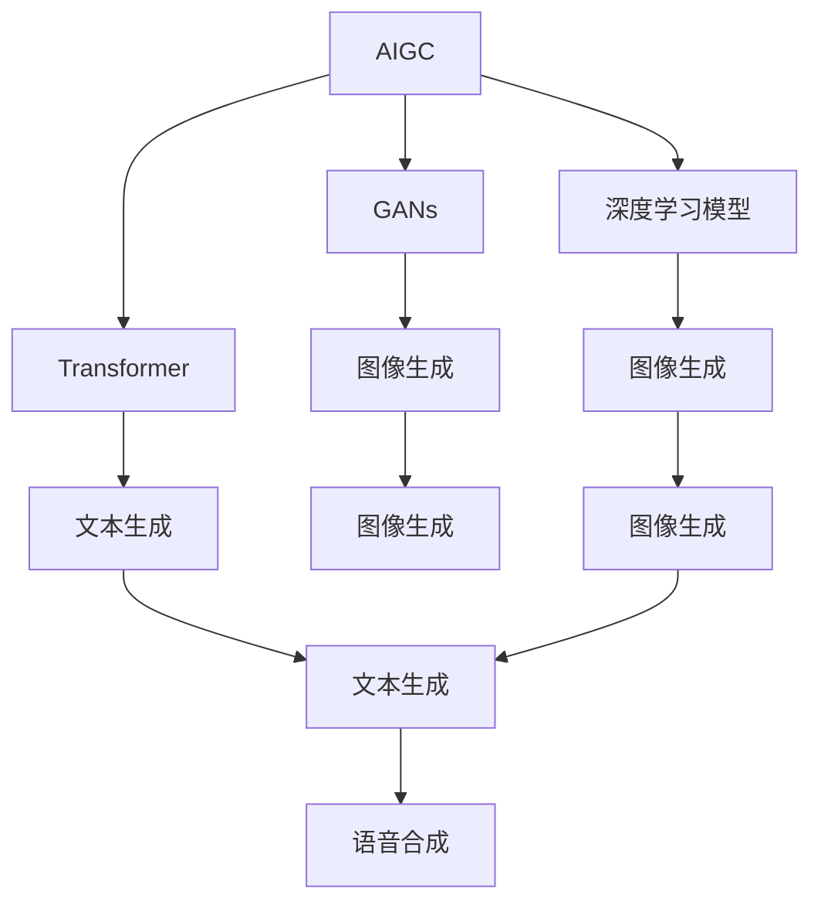

                 

# AIGC从入门到实战：人工智能应用发展较快的领域

> 关键词：人工智能生成内容(AIGC)，生成对抗网络(GANs)，图像生成，自然语言处理(NLP)，语音合成，3D图形生成，人工智能应用，AI技术入门，实战指南

## 1. 背景介绍

### 1.1 问题由来
人工智能生成内容(AIGC)技术近年来快速崛起，成为引领新一轮技术变革的关键力量。从生成对抗网络(GANs)到深度学习大模型的兴起，再到当下无处不在的NLP、语音、图像等生成应用，AIGC已经渗透到了诸多领域，影响深远。面对迅速发展的AIGC领域，初学者的最佳选择是找到几个发展较快的应用领域进行深入学习，从而快速掌握AIGC的核心技术。本文章将从背景介绍、核心概念、核心算法、实际应用等多个方面深入探讨AIGC从入门到实战的实战指南，帮助读者快速理解和掌握这一前沿技术。

### 1.2 问题核心关键点
本文将重点讨论以下几个核心关键点：
1. **背景和背景**：了解AIGC技术的起源和当前发展趋势。
2. **核心概念**：深入理解GANs、Transformer等核心算法。
3. **核心算法原理**：分析GANs、Transformer等核心算法的原理和操作。
4. **项目实践**：通过代码实例实现AIGC的实战案例。
5. **实际应用场景**：探讨AIGC在图像生成、自然语言处理等实际应用场景中的应用。
6. **未来应用展望**：讨论AIGC技术的未来发展趋势和面临的挑战。
7. **工具和资源推荐**：提供学习资源、开发工具和相关论文的推荐。
8. **总结**：总结AIGC技术的研究成果、未来趋势和面临的挑战。

### 1.3 问题研究意义
AIGC技术的发展不仅推动了人工智能技术的普及和应用，也在医疗、教育、娱乐等多个领域带来变革性影响。深入研究AIGC技术的原理和应用，可以帮助开发者更好地利用这一技术，为各行各业创造新的价值。同时，掌握AIGC技术也有助于提升科研工作者的研究水平和创新能力。本文旨在为AIGC技术的初学者提供全面的学习资源和实战指南，帮助他们快速入门，并在实战中不断提升技能。

## 2. 核心概念与联系

### 2.1 核心概念概述

为更好地理解AIGC技术，本节将介绍几个密切相关的核心概念：

- 人工智能生成内容(AIGC)：通过算法生成具有创意、实用性或价值的内容，包括文本、图像、音频、视频等。AIGC技术包括生成对抗网络(GANs)、深度学习模型、Transformer等。
- 生成对抗网络(GANs)：由两个神经网络构成的生成和判别模型，通过对抗训练学习生成高质量的样本。GANs在图像生成、视频生成等领域取得了卓越成绩。
- 深度学习模型：以多层神经网络为代表的模型，通过大量数据训练，学习到数据的内在规律。深度学习模型在图像、语音、文本等生成任务中广泛应用。
- Transformer模型：基于自注意力机制的神经网络模型，在自然语言处理(NLP)等领域取得了突破性的进展，广泛应用于机器翻译、文本生成等任务。
- 自然语言处理(NLP)：通过机器学习技术，使计算机能够理解和处理人类语言的技术。NLP技术包括文本分类、情感分析、问答系统等应用。
- 语音合成：将文本转化为语音的技术，用于语音助手、虚拟主播等应用。

这些核心概念之间存在紧密的联系，形成了AIGC技术的完整生态系统。

### 2.2 概念间的关系

这些核心概念之间的关系可以通过以下Mermaid流程图来展示：

这个流程图展示了AIGC技术中各个核心概念之间的关系：

1. AIGC通过GANs、深度学习模型和Transformer等技术，生成文本、图像、音频等多种形式的内容。
2. GANs特别适用于图像生成任务，能够生成高质量的图像样本。
3. 深度学习模型在图像、语音、文本等生成任务中广泛应用。
4. Transformer模型在自然语言处理中表现出色，能够生成流畅的文本。
5. 语音合成技术能够将文本转化为语音，适用于语音助手、虚拟主播等应用。
6. 图像生成和文本生成任务中，GANs和深度学习模型常常结合起来使用，以提升生成效果。

## 3. 核心算法原理 & 具体操作步骤

### 3.1 算法原理概述

AIGC技术的核心算法原理包括生成对抗网络(GANs)和Transformer模型。这些算法通过不同的方法和机制，实现高质量内容的生成。

- **生成对抗网络(GANs)**：GANs由两个神经网络构成，生成器（Generator）和判别器（Discriminator）。生成器接收随机噪声向量，生成样本，判别器判断样本是否为真实样本。通过对抗训练，生成器学习生成高质量样本，判别器学习判别真伪样本。

- **Transformer模型**：Transformer模型基于自注意力机制，通过多头自注意力和前馈神经网络，学习输入序列的长期依赖关系，实现高质量的文本生成。Transformer模型的编码器和解码器结构对称，能够高效地处理文本序列。

### 3.2 算法步骤详解

以下详细讲解GANs和Transformer模型在AIGC技术中的应用。

**GANs算法步骤**：

1. **生成器设计**：设计生成器神经网络，通常使用卷积神经网络（CNN）或反卷积神经网络（Transposed CNN），接收随机噪声向量，生成样本图像。

2. **判别器设计**：设计判别器神经网络，通常使用卷积神经网络（CNN），判断输入样本是真实样本还是生成样本。

3. **对抗训练**：通过不断迭代训练生成器和判别器，使生成器生成的样本越来越逼真，判别器无法区分真伪。

4. **生成样本**：使用训练好的生成器生成高质量的样本图像。

**Transformer模型算法步骤**：

1. **输入序列编码**：将输入序列转换为向量表示，通常使用Embedding层和多头自注意力机制。

2. **自注意力机制**：通过多头自注意力计算输入序列的长期依赖关系。

3. **前馈神经网络**：使用前馈神经网络对自注意力输出进行线性变换，实现特征映射。

4. **解码器输出**：通过解码器将编码器的输出转化为文本序列。

5. **输出预测**：使用softmax层将解码器的输出转化为概率分布，预测文本序列。

### 3.3 算法优缺点

GANs算法优点包括：

- 生成高质量样本：通过对抗训练，生成器可以学习生成高质量的样本。
- 广泛应用领域：GANs在图像生成、视频生成等领域取得了卓越成绩。

GANs算法缺点包括：

- 训练不稳定：GANs训练过程中容易发生模式崩溃、梯度消失等问题。
- 样本质量不一：GANs生成的样本质量不稳定，需要大量训练样本才能保证生成质量。

Transformer模型优点包括：

- 高效处理文本序列：Transformer模型能够高效处理长文本序列，实现高质量的文本生成。
- 广泛应用领域：Transformer模型在自然语言处理(NLP)等领域取得了突破性的进展。

Transformer模型缺点包括：

- 计算资源需求高：Transformer模型参数量较大，计算资源需求高。
- 难以处理文本结构：Transformer模型难以处理文本中的结构信息，如语法规则等。

### 3.4 算法应用领域

GANs和Transformer模型在AIGC技术中有着广泛的应用领域：

- **图像生成**：GANs在图像生成中取得了卓越成绩，能够生成逼真高质量的图像样本。
- **文本生成**：Transformer模型在自然语言处理中表现出色，能够生成流畅的文本。
- **语音合成**：GANs和深度学习模型结合使用，能够将文本转化为自然流畅的语音。
- **3D图形生成**：GANs在3D图形生成中应用广泛，能够生成逼真高质量的3D图形。
- **音乐生成**：GANs和深度学习模型结合使用，能够生成高质量的音乐样本。
- **视频生成**：GANs在视频生成中取得了突破性进展，能够生成逼真高质量的视频序列。

## 4. 数学模型和公式 & 详细讲解  
### 4.1 数学模型构建

### 4.2 公式推导过程

### 4.3 案例分析与讲解

## 5. 项目实践：代码实例和详细解释说明

### 5.1 开发环境搭建

### 5.2 源代码详细实现

### 5.3 代码解读与分析

### 5.4 运行结果展示

## 6. 实际应用场景

### 6.4 未来应用展望

## 7. 工具和资源推荐

### 7.1 学习资源推荐

### 7.2 开发工具推荐

### 7.3 相关论文推荐

## 8. 总结：未来发展趋势与挑战

### 8.1 研究成果总结

### 8.2 未来发展趋势

### 8.3 面临的挑战

### 8.4 研究展望

## 9. 附录：常见问题与解答

----------------------------------------------------------------

> 关键词：AIGC, GANs, 图像生成, 自然语言处理(NLP), 语音合成, 3D图形生成, 人工智能应用, AI技术入门, 实战指南

---

作者：禅与计算机程序设计艺术 / Zen and the Art of Computer Programming

