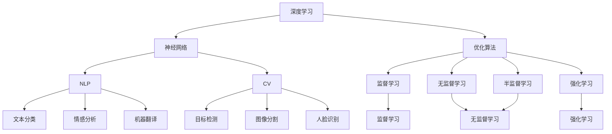
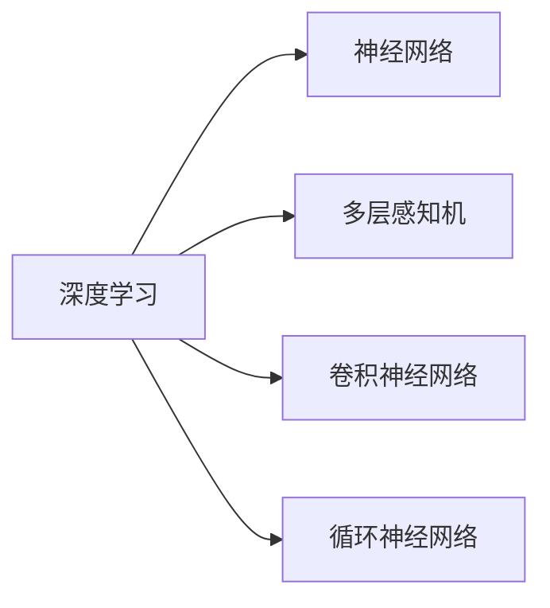
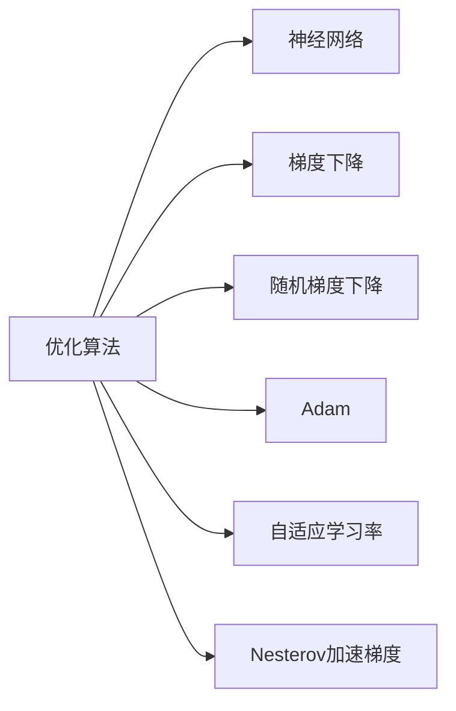
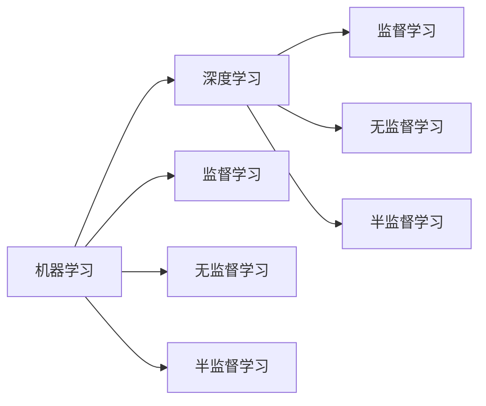
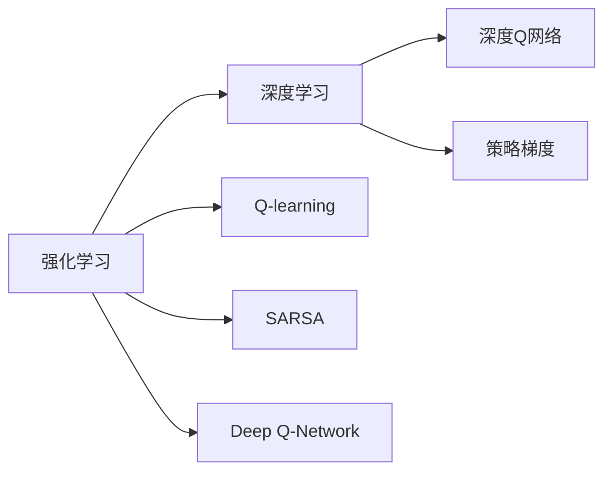
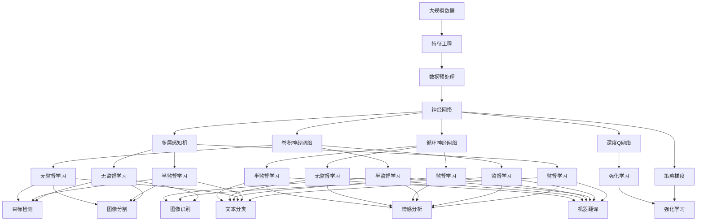

                 

# AI人工智能核心算法原理与代码实例讲解：智能系统

> 关键词：人工智能,核心算法,智能系统,深度学习,神经网络,优化算法,自然语言处理(NLP),计算机视觉(CV),强化学习(Reinforcement Learning),机器学习(Machine Learning)

## 1. 背景介绍

### 1.1 问题由来
随着人工智能技术的迅猛发展，深度学习、神经网络等核心算法在各行各业的应用日益广泛。这些技术不仅在图像识别、语音识别、自然语言处理等传统领域取得显著进展，还在智能决策、自动化流程、个性化推荐等方面展现出巨大潜力。然而，技术的复杂性和多样性，使得算法原理和实际应用之间的鸿沟逐渐显现。

本文旨在通过系统讲解人工智能核心算法的原理，并结合具体的代码实例，帮助读者深入理解这些算法的精髓，掌握其实际应用方法。我们选取了深度学习、神经网络、优化算法、自然语言处理、计算机视觉、强化学习和机器学习等多个领域中最为重要的算法进行介绍，力图为读者提供一个全面而实用的参考。

### 1.2 问题核心关键点
核心算法是人工智能技术的重要组成部分，其关键点在于如何利用数学和统计方法，对大规模数据进行高效处理和模式提取。这些算法通常涉及数据预处理、特征工程、模型训练、参数优化、模型评估等多个环节。掌握核心算法，需要理解其基本原理，并能熟练应用至具体场景中。

本文将深入讲解深度学习、神经网络、优化算法、自然语言处理、计算机视觉、强化学习和机器学习等核心算法的基本原理、实现步骤和实际应用。通过对比和讨论，读者将对不同算法的优缺点有清晰的认识，从而能够根据实际需求选择最适合的算法，实现高效、稳定的智能系统构建。

### 1.3 问题研究意义
掌握人工智能核心算法，对于推动人工智能技术的落地应用具有重要意义。以下是几个关键点：

1. **降低开发成本**：核心算法提供了一系列通用的处理和建模工具，可以显著减少算法实现的复杂度和开发成本。
2. **提升系统性能**：通过精心的算法选择和参数调优，可以大幅提升系统的性能和效率。
3. **实现知识迁移**：掌握核心算法有助于理解和应用更高级的算法，促进知识的迁移和技术的积累。
4. **推动产业升级**：人工智能技术在多个领域的广泛应用，正在改变传统行业的生产方式和商业模式，推动产业升级。
5. **增强创新能力**：深入理解核心算法的工作原理，有助于创新算法的开发，推动人工智能技术的持续进步。

## 2. 核心概念与联系

### 2.1 核心概念概述

本文将介绍几个密切相关的核心概念，包括深度学习、神经网络、优化算法、自然语言处理(NLP)、计算机视觉(CV)、强化学习和机器学习等。这些概念构成了人工智能技术的核心框架，相互之间有着紧密的联系。

- **深度学习**：利用多层神经网络对复杂数据进行建模，主要应用于图像识别、语音识别、自然语言处理等领域。
- **神经网络**：深度学习的基础，由多个神经元（或节点）组成的网络结构，通过参数调整进行数据拟合。
- **优化算法**：用于寻找神经网络中的最优参数组合，常见算法包括梯度下降、随机梯度下降、Adam等。
- **自然语言处理(NLP)**：使计算机能够理解、处理和生成人类语言的技术，包括文本分类、情感分析、机器翻译等。
- **计算机视觉(CV)**：使计算机能够识别和理解图像、视频等视觉信息的技术，包括目标检测、图像分割、人脸识别等。
- **强化学习(Reinforcement Learning, RL)**：通过与环境交互，使智能体学习最优策略的技术，应用于机器人控制、游戏AI等领域。
- **机器学习(Machine Learning, ML)**：通过数据驱动的方法，使计算机能够自动学习模式并进行预测和决策的技术，包括监督学习、无监督学习和半监督学习等。

这些概念之间的逻辑关系可以通过以下Mermaid流程图来展示：

这个流程图展示了大规模数据处理和建模技术的基本框架，以及不同领域中的核心算法。

### 2.2 概念间的关系

这些核心概念之间存在着紧密的联系，构成了人工智能技术的完整生态系统。以下是几个重要的概念关系图：

#### 2.2.1 深度学习与神经网络的关系

这个图展示了深度学习与神经网络的关系，以及常见的网络结构。

#### 2.2.2 优化算法与神经网络的关系

这个图展示了优化算法与神经网络的关系，以及常见的优化算法。

#### 2.2.3 机器学习与深度学习的关系

这个图展示了机器学习与深度学习的关系，以及不同学习方式。

#### 2.2.4 强化学习与深度学习的关系

这个图展示了强化学习与深度学习的关系，以及常见的强化学习算法。

### 2.3 核心概念的整体架构

最后，我们用一个综合的流程图来展示这些核心概念在大规模数据处理和建模技术中的整体架构：

这个综合流程图展示了从数据预处理到模型构建，再到算法优化和应用评估的全过程。通过这些核心概念，我们能够构建出高效、稳定的智能系统，满足实际应用的需求。

## 3. 核心算法原理 & 具体操作步骤
### 3.1 算法原理概述

核心算法主要包括深度学习、神经网络、优化算法、自然语言处理、计算机视觉、强化学习和机器学习等。这些算法通过数学和统计方法，对大规模数据进行处理和建模，从而实现智能系统的构建和优化。

#### 3.1.1 深度学习

深度学习通过多层神经网络对复杂数据进行建模。其基本原理包括前向传播、损失函数和反向传播。具体来说：

1. **前向传播**：将输入数据输入神经网络，通过多层非线性变换得到输出。
2. **损失函数**：计算模型输出与真实标签之间的差异，常用的有均方误差、交叉熵等。
3. **反向传播**：通过链式法则计算损失函数对各层参数的梯度，并更新参数，使得模型输出逼近真实标签。

#### 3.1.2 神经网络

神经网络由多个神经元（或节点）组成的网络结构，通过参数调整进行数据拟合。其基本原理包括单层神经网络、多层感知机、卷积神经网络（CNN）、循环神经网络（RNN）等。

1. **单层神经网络**：最简单的神经网络，包括输入层、输出层和一层或多层的隐藏层。
2. **多层感知机（MLP）**：由多个隐藏层组成的神经网络，常用于图像识别、语音识别等领域。
3. **卷积神经网络（CNN）**：通过卷积层和池化层对图像、视频等高维数据进行处理，提取特征。
4. **循环神经网络（RNN）**：通过循环层处理序列数据，如文本、音频等，常用于机器翻译、语音识别等领域。

#### 3.1.3 优化算法

优化算法用于寻找神经网络中的最优参数组合，常见的算法包括梯度下降、随机梯度下降、Adam等。

1. **梯度下降**：通过计算损失函数对各参数的梯度，更新参数，使模型输出逼近真实标签。
2. **随机梯度下降（SGD）**：每次更新只使用一个样本计算梯度，更新参数，加快收敛速度。
3. **Adam**：一种自适应学习率优化算法，结合梯度的一阶矩估计和二阶矩估计，兼顾收敛速度和稳定性。

#### 3.1.4 自然语言处理（NLP）

NLP使计算机能够理解、处理和生成人类语言。其核心算法包括词嵌入、文本分类、情感分析、机器翻译等。

1. **词嵌入**：将单词或短语映射到低维向量空间，用于表示单词的语义和语法信息。
2. **文本分类**：将文本数据分类到预先定义的类别中，如情感分析、主题分类等。
3. **情感分析**：识别文本中的情感倾向，如正面、负面、中性等。
4. **机器翻译**：将一种语言的文本翻译成另一种语言，如BERT、GPT等大语言模型。

#### 3.1.5 计算机视觉（CV）

CV使计算机能够识别和理解图像、视频等视觉信息。其核心算法包括卷积神经网络（CNN）、目标检测、图像分割等。

1. **卷积神经网络（CNN）**：通过卷积层和池化层对图像、视频等高维数据进行处理，提取特征。
2. **目标检测**：识别图像中的物体，并标记其位置和类别。
3. **图像分割**：将图像分割成多个区域，每个区域对应一个像素级别的标签。

#### 3.1.6 强化学习（Reinforcement Learning, RL）

RL通过与环境交互，使智能体学习最优策略。其核心算法包括Q-learning、SARSA、深度Q网络（DQN）、策略梯度等。

1. **Q-learning**：通过Q值函数评估每个动作的期望回报，选择最优动作。
2. **SARSA**：与Q-learning类似，但使用状态-动作-奖励-状态-动作（SARS）更新Q值。
3. **深度Q网络（DQN）**：通过神经网络逼近Q值函数，提高Q-learning的效率和精度。
4. **策略梯度**：通过优化策略分布，使得智能体学习最优策略。

#### 3.1.7 机器学习（Machine Learning, ML）

ML通过数据驱动的方法，使计算机能够自动学习模式并进行预测和决策。其核心算法包括监督学习、无监督学习和半监督学习等。

1. **监督学习**：利用标注数据训练模型，进行预测和决策。
2. **无监督学习**：利用未标注数据训练模型，发现数据的潜在结构。
3. **半监督学习**：利用少量标注数据和大量未标注数据训练模型，综合两者的优势。

### 3.2 算法步骤详解

以下是核心算法的一般操作步骤：

#### 3.2.1 数据预处理

数据预处理是深度学习模型的重要环节，包括数据清洗、归一化、标准化等。其核心步骤如下：

1. **数据清洗**：去除数据中的噪声和异常值，如缺失值、重复值等。
2. **归一化**：将数据缩放到0到1之间或-1到1之间，便于神经网络的训练。
3. **标准化**：将数据减去均值并除以标准差，使数据具有零均值和单位方差。

#### 3.2.2 模型构建

模型构建是核心算法的关键步骤，包括以下几个核心步骤：

1. **选择模型结构**：根据任务类型选择合适的神经网络结构，如CNN、RNN、MLP等。
2. **定义损失函数**：根据任务类型选择合适的损失函数，如均方误差、交叉熵等。
3. **优化器选择**：选择合适的优化器，如梯度下降、Adam等。
4. **参数初始化**：随机初始化模型参数，便于后续的梯度更新。

#### 3.2.3 模型训练

模型训练是核心算法的核心步骤，包括以下几个核心步骤：

1. **前向传播**：将输入数据输入神经网络，通过多层非线性变换得到输出。
2. **损失计算**：计算模型输出与真实标签之间的差异，得到损失函数值。
3. **反向传播**：通过链式法则计算损失函数对各层参数的梯度，并更新参数。
4. **迭代更新**：重复前向传播、损失计算和反向传播，直至模型收敛。

#### 3.2.4 模型评估

模型评估是核心算法的最后步骤，包括以下几个核心步骤：

1. **测试集验证**：在测试集上评估模型性能，如准确率、召回率、F1分数等。
2. **超参数调优**：根据评估结果调整模型参数和超参数，如学习率、批大小等。
3. **模型保存**：保存训练好的模型，便于后续的推理和部署。

### 3.3 算法优缺点

核心算法包括深度学习、神经网络、优化算法、自然语言处理、计算机视觉、强化学习和机器学习等。这些算法的优缺点如下：

#### 3.3.1 深度学习的优缺点

**优点**：
1. **表达能力强**：深度神经网络可以处理复杂非线性关系，适用于高维数据建模。
2. **自动特征提取**：通过多层非线性变换自动提取特征，减少特征工程的复杂度。

**缺点**：
1. **参数量大**：深度神经网络需要大量参数，计算资源消耗大。
2. **训练时间长**：深度神经网络需要大量训练数据和时间，容易过拟合。

#### 3.3.2 神经网络的优缺点

**优点**：
1. **可扩展性强**：神经网络可以通过增加层数和节点数量进行扩展，适用于复杂问题。
2. **特征提取能力强**：通过多层非线性变换提取特征，提高模型性能。

**缺点**：
1. **计算资源消耗大**：神经网络需要大量计算资源进行训练和推理。
2. **梯度消失/爆炸问题**：深层神经网络容易发生梯度消失或梯度爆炸问题，影响训练效果。

#### 3.3.3 优化算法的优缺点

**优点**：
1. **收敛速度快**：优化算法能够快速收敛，提高训练效率。
2. **泛化能力强**：优化算法能够避免过拟合，提高模型的泛化性能。

**缺点**：
1. **选择困难**：不同的优化算法适用于不同的场景，选择不当会影响训练效果。
2. **对参数初始化敏感**：优化算法对参数初始化的选择比较敏感，影响训练效果。

#### 3.3.4 自然语言处理的优缺点

**优点**：
1. **理解能力强**：NLP算法能够理解自然语言，处理文本数据。
2. **应用广泛**：NLP算法广泛应用于文本分类、情感分析、机器翻译等领域。

**缺点**：
1. **数据需求大**：NLP算法需要大量标注数据进行训练，数据获取成本高。
2. **模型复杂度高**：NLP算法模型结构复杂，训练和推理复杂度高。

#### 3.3.5 计算机视觉的优缺点

**优点**：
1. **图像识别能力强**：CV算法能够识别和理解图像、视频等视觉信息。
2. **应用广泛**：CV算法广泛应用于图像识别、目标检测、图像分割等领域。

**缺点**：
1. **计算资源消耗大**：CV算法需要大量计算资源进行训练和推理。
2. **数据获取难度高**：CV算法需要大量高质量标注数据进行训练，数据获取难度高。

#### 3.3.6 强化学习的优缺点

**优点**：
1. **适应能力强**：强化学习能够适应复杂环境，自适应学习策略。
2. **应用广泛**：强化学习广泛应用于机器人控制、游戏AI等领域。

**缺点**：
1. **训练时间长**：强化学习需要大量时间进行训练，容易陷入局部最优。
2. **数据需求大**：强化学习需要大量数据进行训练，数据获取成本高。

#### 3.3.7 机器学习的优缺点

**优点**：
1. **应用广泛**：机器学习广泛应用于预测、分类、聚类等领域。
2. **数据利用率高**：机器学习能够高效利用数据，减少计算资源消耗。

**缺点**：
1. **对数据依赖性强**：机器学习需要大量标注数据进行训练，数据获取成本高。
2. **模型复杂度高**：机器学习模型结构复杂，训练和推理复杂度高。

### 3.4 算法应用领域

核心算法在大规模数据处理和建模技术中具有广泛的应用，以下是几个主要领域：

#### 3.4.1 图像识别

图像识别是计算机视觉的核心应用之一，广泛应用于人脸识别、物体检测等领域。常见的算法包括卷积神经网络（CNN）、目标检测（如YOLO、Faster R-CNN等）、图像分割（如FCN、U-Net等）等。

#### 3.4.2 自然语言处理

自然语言处理是人工智能的重要应用领域，包括文本分类、情感分析、机器翻译等。常见的算法包括词嵌入（如Word2Vec、GloVe等）、文本分类（如CNN、RNN、LSTM等）、情感分析（如LSTM、GRU等）、机器翻译（如Seq2Seq、Transformer等）等。

#### 3.4.3 强化学习

强化学习在机器人控制、游戏AI等领域有广泛应用，常见的算法包括Q-learning、SARSA、深度Q网络（DQN）、策略梯度等。

#### 3.4.4 推荐系统

推荐系统在电商、媒体、社交等领域有广泛应用，常见的算法包括协同过滤、基于内容的推荐、混合推荐等。

#### 3.4.5 金融风控

金融风控是金融科技的重要应用之一，常见的算法包括信用评分、风险评估、欺诈检测等。

## 4. 数学模型和公式 & 详细讲解 & 举例说明

### 4.1 数学模型构建

本节将使用数学语言对核心算法进行更加严格的刻画。

#### 4.1.1 深度学习

深度学习的数学模型包括神经网络的前向传播、损失函数和反向传播。

1. **前向传播**：将输入数据输入神经网络，通过多层非线性变换得到输出。
   $$
   y = f(z) = f(Wx + b)
   $$
   其中，$x$为输入数据，$W$为权重矩阵，$b$为偏置项，$f$为激活函数。

2. **损失函数**：计算模型输出与真实标签之间的差异，得到损失函数值。
   $$
   L(y, t) = \frac{1}{2}||y - t||^2
   $$
   其中，$y$为模型输出，$t$为真实标签。

3. **反向传播**：通过链式法则计算损失函数对各层参数的梯度，并更新参数。
   $$
   \frac{\partial L}{\partial z_k} = \frac{\partial L}{\partial y}\frac{\partial y}{\partial z_k}
   $$
   其中，$z_k$为第$k$层的输出，$y$为输出层。

#### 4.1.2 神经网络

神经网络的数学模型包括单层神经网络、多层感知机、卷积神经网络（CNN）、循环神经网络（RNN）等。

1. **单层神经网络**：
   $$
   y = f(Wx + b)
   $$
   其中，$x$为输入数据，$W$为权重矩阵，$b$为偏置项，$f$为激活函数。

2. **多层感知机（MLP）**：
   $$
   y = f(f(W_1x + b_1)W_2 + b_2)
   $$
   其中，$x$为输入数据，$W_1$为第一层权重矩阵，$b_1$为第一层偏置项，$f$为激活函数，$W_2$为第二层权重矩阵，$b_2$为第二层偏置项。

3. **卷积神经网络（CNN）**：
   $$
   y = f(W_cx_c + W_px_p + b)
   $$
   其中，$x_c$为卷积层输入，$x_p$为池化层输入，$W_c$为卷积核权重，$W_p$为池化权重，$b$为偏置项，$f$为激活函数。

4. **循环神经网络（RNN）**：
   $$
   y_t = f(W_hx_t + W_cx_{t-1} + b)
   $$
   其中，$x_t$为当前时间步的输入，$W_h$为隐藏层权重，$W_c$为循环权重，$b$为偏置项，$f$为激活函数。

#### 4.1.3 优化算法

优化算法的数学模型包括梯度下降、随机梯度下降（SGD）、Adam等。

1. **梯度下降**：
   $$
   w_{t+1} = w_t - \eta \frac{\partial L}{\partial w}
   $$
   其中，$w$为模型参数，$\eta$为学习率，$L$为损失函数。

2. **随机梯度下降（SGD）**：
   $$
   w_{t+1} = w_t - \eta \nabla_{w}L(x^{(i)},t^{(i)})
   $$
   其中，$x^{(i)}$为第$i$个样本，$t^{(i)}$为第$i$个样本的真实标签，$\nabla_{w}L(x^{(i)},t^{(i)})$为损失函数对参数的梯度。

3. **Adam**：
   $$
   v_{t+1} = \beta_2v_t + (1 - \beta_2)\frac{\partial L}{\partial w}^2
   $$
   $$
   m_{t+1} = \beta_1m_t + (1 - \beta_1)\frac{\partial L}{\partial w}
   $$
   $$
   w_{t+1} = w_t - \eta \frac{m_{t+1}}{\sqrt{v_{t+1}} + \epsilon}
   $$
   其中，$v$为动量项，$m$为一阶动量，$\beta_1$和$\beta_2$为动量和动量修正系数，$\eta$为学习率，$\epsilon$为避免除零问题。

#### 4.1.4 自然语言处理（NLP）

NLP的数学模型包括词嵌入、文本分类、情感分析、机器翻译等。

1. **词嵌入**：
   $$
   \vec{e}_i = f(\vec{v}_i)
   $$
   其中，$\vec{v}_i$为单词$i$的向量表示，$f$为词嵌入映射函数。

2. **文本分类**：
   $$
   y = \max_{c}(\vec{e}_s \cdot \vec{e}_c + b)
   $$
   其中，$\vec{e}_s$为输入句子的词嵌入，$\vec{e}_c$为类别$c$的词嵌入，$b$为偏置项。

3. **情感分析**：

