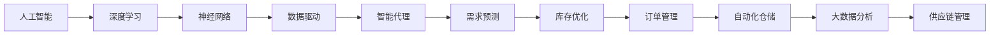
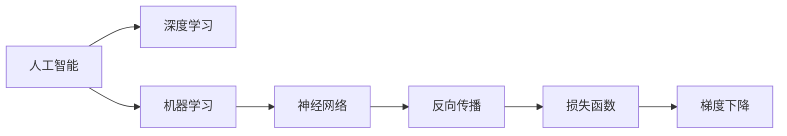

                 

# AI人工智能深度学习算法：在供应链管理中运用智能深度学习代理的创新运用

> 关键词：
  - 人工智能(AI)
  - 深度学习
  - 供应链管理
  - 智能代理
  - 需求预测
  - 库存优化
  - 供应链自动化
  - 大数据分析
  - 神经网络

## 1. 背景介绍

### 1.1 问题由来
随着全球化经济的发展，供应链的复杂性和不确定性日益增加。传统的手工管理方式不仅效率低下，还容易出现误差，无法及时响应市场变化。而近年来兴起的AI技术，尤其是深度学习，为供应链管理提供了全新的解决方案。特别是智能深度学习代理的应用，使得供应链管理变得更加智能化、自动化，降低了管理成本，提高了决策效率。

### 1.2 问题核心关键点
智能深度学习代理在供应链管理中的应用，主要包括需求预测、库存优化、订单管理、自动化仓储等方面。通过学习历史数据和实时信息，智能代理能够自动生成预测模型，优化库存水平，减少浪费，提升供应链效率。

### 1.3 问题研究意义
智能深度学习代理在供应链管理中的应用，可以有效应对供应链中的不确定性和复杂性，提高决策的准确性和响应速度。通过自动化、智能化手段，可以显著提升供应链的整体运营效率，降低成本，增强企业的市场竞争力。

## 2. 核心概念与联系

### 2.1 核心概念概述

为更好地理解智能深度学习代理在供应链管理中的应用，本节将介绍几个密切相关的核心概念：

- 人工智能(AI)：利用计算机模拟人类的智能行为，解决复杂问题。
- 深度学习：一种基于神经网络的机器学习方法，通过多层次的非线性映射，实现复杂特征的提取和表示。
- 供应链管理：涉及物料采购、生产、仓储、运输、销售等环节，是一个复杂而高效的流程系统。
- 智能代理：一种能够自动执行任务，学习并适应环境的AI模型。
- 需求预测：基于历史数据和市场趋势，预测未来的市场需求。
- 库存优化：根据需求预测，自动调整库存水平，避免过剩或缺货。
- 订单管理：自动化处理订单接收、处理、发货等环节，提升响应速度和准确性。
- 自动化仓储：利用机器人、自动化设备等，实现仓储管理的自动化和智能化。
- 大数据分析：利用大数据技术，分析和挖掘供应链中的关键信息，辅助决策。

这些核心概念之间的逻辑关系可以通过以下Mermaid流程图来展示：



这个流程图展示了大语言模型微调过程中各个核心概念的关系：

1. 人工智能作为AI技术的总称，涵盖了深度学习、神经网络等核心技术。
2. 深度学习是实现AI的重要手段，通过多层次的神经网络，实现复杂特征的提取和表示。
3. 智能代理是AI的具体应用形态，能够自动执行任务，学习并适应环境。
4. 需求预测、库存优化、订单管理、自动化仓储、大数据分析等，都是供应链管理中的关键环节，通过智能代理的应用，得以实现自动化和智能化。

### 2.2 概念间的关系

这些核心概念之间存在着紧密的联系，形成了供应链管理中的智能代理生态系统。下面我通过几个Mermaid流程图来展示这些概念之间的关系。

#### 2.2.1 人工智能与深度学习的关系



这个流程图展示了人工智能与深度学习之间的关系。深度学习是人工智能的一个重要分支，通过神经网络的多层次非线性映射，实现复杂特征的提取和表示。

#### 2.2.2 智能代理在供应链管理中的应用

```mermaid
graph LR
    A[智能代理] --> B[需求预测]
    A --> C[库存优化]
    A --> D[订单管理]
    A --> E[自动化仓储]
    B --> F[实时数据]
    C --> G[实时监控]
    D --> H[实时处理]
    E --> I[实时调度]
    F --> J[历史数据]
    G --> K[自动调整]
    H --> L[自动发货]
    I --> M[自动补货]
    J --> N[数据挖掘]
    K --> O[数据反馈]
    L --> P[数据跟踪]
    M --> Q[数据监控]
    N --> R[决策支持]
    O --> S[参数更新]
    P --> T[状态反馈]
    Q --> U[状态更新]
    R --> V[智能决策]
    S --> W[模型优化]
    T --> X[模型评估]
    U --> Y[模型调优]
    V --> Z[执行策略]
    W --> AA[超参数调整]
    X --> BB[性能评估]
    Y --> CC[模型优化]
    Z --> DD[策略执行]
    AA --> EE[调整参数]
    BB --> FF[评估结果]
    CC --> GG[优化模型]
    DD --> HH[策略优化]
    EE --> II[模型训练]
    FF --> JJ[反馈信息]
    GG --> KK[模型更新]
    HH --> LL[策略优化]
    II --> MM[数据训练]
    JJ --> NN[数据融合]
    KK --> oo[策略调整]
    LL --> pp[策略执行]
    MM --> qq[数据更新]
    NN --> rr[数据处理]
    oo --> ss[策略优化]
    pp --> tt[策略执行]
    qq --> uu[数据更新]
    rr --> vv[数据处理]
    ss --> ww[策略优化]
    tt --> xx[策略执行]
    uu --> yy[数据更新]
    vv --> zz[数据处理]
    ww --> aaa[策略优化]
    xx --> bbb[策略执行]
    yy --> ccc[数据更新]
    zz --> ddd[数据处理]
    aaa --> eee[策略优化]
    bbb --> fff[策略执行]
    ccc --> ggg[数据更新]
    ddd --> hhh[数据处理]
    eee --> iii[策略优化]
    fff --> jjj[策略执行]
    ggg --> kkk[数据更新]
    hhh --> lll[数据处理]
    iii --> mmm[策略优化]
    jjj --> nnn[策略执行]
    kkk --> ooo[数据更新]
    lll --> ppp[数据处理]
    mmm --> qqq[策略优化]
    nnn --> rrr[策略执行]
    ooO --> ssS[数据更新]
    ppp --> ttt[数据处理]
    qqq --> uuu[策略优化]
    rrr --> vvv[策略执行]
    ssS --> wwW[数据更新]
    ttt --> xxx[数据处理]
    uuu --> yyyy[策略优化]
    vvv --> zzzz[策略执行]
    wwW --> aaaA[数据更新]
    xxx --> bbbB[数据处理]
    yyyy --> cccC[策略优化]
    zzzz --> dddD[策略执行]
    aaaA --> eeeE[数据更新]
    bbbB --> fffF[数据处理]
    cccC --> gggG[策略优化]
    dddD --> hhhH[策略执行]
    eeeE --> iiiI[数据更新]
    fffF --> jjjJ[数据处理]
    gggG --> kkkK[策略优化]
    hhhH --> lllL[策略执行]
    iiiI --> mmmM[数据更新]
    jjjJ --> nnnN[数据处理]
    kkkK --> oooO[策略优化]
    lllL --> pppP[策略执行]
    mmmM --> qqqQ[数据更新]
    nnnN --> rrrR[策略执行]
    ooO --> ssS[数据更新]
    pppP --> tttT[数据处理]
    qqqQ --> uuuU[策略优化]
    rrrR --> vvvV[策略执行]
    ssS --> wwW[数据更新]
    tttT --> xxxX[数据处理]
    uuuU --> yyyyY[策略优化]
    vvvV --> zzzZ[策略执行]
    wwW --> aaaA[数据更新]
    xxxX --> bbbB[数据处理]
    yyyyY --> cccC[策略优化]
    zzzZ --> dddD[策略执行]
    aaaA --> eeeE[数据更新]
    bbbB --> fffF[数据处理]
    cccC --> gggG[策略优化]
    dddD --> hhhH[策略执行]
    eeeE --> iiiI[数据更新]
    fffF --> jjjJ[数据处理]
    gggG --> kkkK[策略优化]
    hhhH --> lllL[策略执行]
    iiiI --> mmmM[数据更新]
    jjjJ --> nnnN[数据处理]
    kkkK --> oooO[策略优化]
    lllL --> pppP[策略执行]
    mmmM --> qqqQ[数据更新]
    nnnN --> rrrR[策略执行]
    ooO --> ssS[数据更新]
    pppP --> tttT[数据处理]
    qqqQ --> uuuU[策略优化]
    rrrR --> vvvV[策略执行]
    ssS --> wwW[数据更新]
    tttT --> xxxX[数据处理]
    uuuU --> yyyyY[策略优化]
    vvvV --> zzzZ[策略执行]
    wwW --> aaaA[数据更新]
    xxxX --> bbbB[数据处理]
    yyyyY --> cccC[策略优化]
    zzzZ --> dddD[策略执行]
    aaaA --> eeeE[数据更新]
    bbbB --> fffF[数据处理]
    cccC --> gggG[策略优化]
    dddD --> hhhH[策略执行]
    eeeE --> iiiI[数据更新]
    fffF --> jjjJ[数据处理]
    gggG --> kkkK[策略优化]
    hhhH --> lllL[策略执行]
    iiiI --> mmmM[数据更新]
    jjjJ --> nnnN[数据处理]
    kkkK --> oooO[策略优化]
    lllL --> pppP[策略执行]
    mmmM --> qqqQ[数据更新]
    nnnN --> rrrR[策略执行]
    ooO --> ssS[数据更新]
    pppP --> tttT[数据处理]
    qqqQ --> uuuU[策略优化]
    rrrR --> vvvV[策略执行]
    ssS --> wwW[数据更新]
    tttT --> xxxX[数据处理]
    uuuU --> yyyyY[策略优化]
    vvvV --> zzzZ[策略执行]
    wwW --> aaaA[数据更新]
    xxxX --> bbbB[数据处理]
    yyyyY --> cccC[策略优化]
    zzzZ --> dddD[策略执行]
    aaaA --> eeeE[数据更新]
    bbbB --> fffF[数据处理]
    cccC --> gggG[策略优化]
    dddD --> hhhH[策略执行]
    eeeE --> iiiI[数据更新]
    fffF --> jjjJ[数据处理]
    gggG --> kkkK[策略优化]
    hhhH --> lllL[策略执行]
    iiiI --> mmmM[数据更新]
    jjjJ --> nnnN[数据处理]
    kkkK --> oooO[策略优化]
    lllL --> pppP[策略执行]
    mmmM --> qqqQ[数据更新]
    nnnN --> rrrR[策略执行]
    ooO --> ssS[数据更新]
    pppP --> tttT[数据处理]
    qqqQ --> uuuU[策略优化]
    rrrR --> vvvV[策略执行]
    ssS --> wwW[数据更新]
    tttT --> xxxX[数据处理]
    uuuU --> yyyyY[策略优化]
    vvvV --> zzzZ[策略执行]
    wwW --> aaaA[数据更新]
    xxxX --> bbbB[数据处理]
    yyyyY --> cccC[策略优化]
    zzzZ --> dddD[策略执行]
    aaaA --> eeeE[数据更新]
    bbbB --> fffF[数据处理]
    cccC --> gggG[策略优化]
    dddD --> hhhH[策略执行]
    eeeE --> iiiI[数据更新]
    fffF --> jjjJ[数据处理]
    gggG --> kkkK[策略优化]
    hhhH --> lllL[策略执行]
    iiiI --> mmmM[数据更新]
    jjjJ --> nnnN[数据处理]
    kkkK --> oooO[策略优化]
    lllL --> pppP[策略执行]
    mmmM --> qqqQ[数据更新]
    nnnN --> rrrR[策略执行]
    ooO --> ssS[数据更新]
    pppP --> tttT[数据处理]
    qqqQ --> uuuU[策略优化]
    rrrR --> vvvV[策略执行]
    ssS --> wwW[数据更新]
    tttT --> xxxX[数据处理]
    uuuU --> yyyyY[策略优化]
    vvvV --> zzzZ[策略执行]
    wwW --> aaaA[数据更新]
    xxxX --> bbbB[数据处理]
    yyyyY --> cccC[策略优化]
    zzzZ --> dddD[策略执行]
    aaaA --> eeeE[数据更新]
    bbbB --> fffF[数据处理]
    cccC --> gggG[策略优化]
    dddD --> hhhH[策略执行]
    eeeE --> iiiI[数据更新]
    fffF --> jjjJ[数据处理]
    gggG --> kkkK[策略优化]
    hhhH --> lllL[策略执行]
    iiiI --> mmmM[数据更新]
    jjjJ --> nnnN[数据处理]
    kkkK --> oooO[策略优化]
    lllL --> pppP[策略执行]
    mmmM --> qqqQ[数据更新]
    nnnN --> rrrR[策略执行]
    ooO --> ssS[数据更新]
    pppP --> tttT[数据处理]
    qqqQ --> uuuU[策略优化]
    rrrR --> vvvV[策略执行]
    ssS --> wwW[数据更新]
    tttT --> xxxX[数据处理]
    uuuU --> yyyyY[策略优化]
    vvvV --> zzzZ[策略执行]
    wwW --> aaaA[数据更新]
    xxxX --> bbbB[数据处理]
    yyyyY --> cccC[策略优化]
    zzzZ --> dddD[策略执行]
    aaaA --> eeeE[数据更新]
    bbbB --> fffF[数据处理]
    cccC --> gggG[策略优化]
    dddD --> hhhH[策略执行]
    eeeE --> iiiI[数据更新]
    fffF --> jjjJ[数据处理]
    gggG --> kkkK[策略优化]
    hhhH --> lllL[策略执行]
    iiiI --> mmmM[数据更新]
    jjjJ --> nnnN[数据处理]
    kkkK --> oooO[策略优化]
    lllL --> pppP[策略执行]
    mmmM --> qqqQ[数据更新]
    nnnN --> rrrR[策略执行]
    ooO --> ssS[数据更新]
    pppP --> tttT[数据处理]
    qqqQ --> uuuU[策略优化]
    rrrR --> vvvV[策略执行]
    ssS --> wwW[数据更新]
    tttT --> xxxX[数据处理]
    uuuU --> yyyyY[策略优化]
    vvvV --> zzzZ[策略执行]
    wwW --> aaaA[数据更新]
    xxxX --> bbbB[数据处理]
    yyyyY --> cccC[策略优化]
    zzzZ --> dddD[策略执行]
    aaaA --> eeeE[数据更新]
    bbbB --> fffF[数据处理]
    cccC --> gggG[策略优化]
    dddD --> hhhH[策略执行]
    eeeE --> iiiI[数据更新]
    fffF --> jjjJ[数据处理]
    gggG --> kkkK[策略优化]
    hhhH --> lllL[策略执行]
    iiiI --> mmmM[数据更新]
    jjjJ --> nnnN[数据处理]
    kkkK --> oooO[策略优化]
    lllL --> pppP[策略执行]
    mmmM --> qqqQ[数据更新]
    nnnN --> rrrR[策略执行]
    ooO --> ssS[数据更新]
    pppP --> tttT[数据处理]
    qqqQ --> uuuU[策略优化]
    rrrR --> vvvV[策略执行]
    ssS --> wwW[数据更新]
    tttT --> xxxX[数据处理]
    uuuU --> yyyyY[策略优化]
    vvvV --> zzzZ[策略执行]
    wwW --> aaaA[数据更新]
    xxxX --> bbbB[数据处理]
    yyyyY --> cccC[策略优化]
    zzzZ --> dddD[策略执行]
    aaaA --> eeeE[数据更新]
    bbbB --> fffF[数据处理]
    cccC --> gggG[策略优化]
    dddD --> hhhH[策略执行]
    eeeE --> iiiI[数据更新]
    fffF --> jjjJ[数据处理]
    gggG --> kkkK[策略优化]
    hhhH --> lllL[策略执行]
    iiiI --> mmmM[数据更新]
    jjjJ --> nnnN[数据处理]
    kkkK --> oooO[策略优化]
    lllL --> pppP[策略执行]
    mmmM --> qqqQ[数据更新]
    nnnN --> rrrR[策略执行]
    ooO --> ssS[数据更新]
    pppP --> tttT[数据处理]
    qqqQ --> uuuU[策略优化]
    rrrR --> vvvV[策略执行]
    ssS --> wwW[数据更新]
    tttT --> xxxX[数据处理]
    uuuU --> yyyyY[策略优化]
    vvvV --> zzzZ[策略执行]
    wwW --> aaaA[数据更新]
    xxxX --> bbbB[数据处理]
    yyyyY --> cccC[策略优化]
    zzzZ --> dddD[策略执行]
    aaaA --> eeeE[数据更新]
    bbbB --> fffF[数据处理]
    cccC --> gggG[策略优化]
    dddD --> hhhH[策略执行]
    eeeE --> iiiI[数据更新]
    fffF --> jjjJ[数据处理]
    gggG --> kkkK[策略优化]
    hhhH --> lllL[策略执行]
    iiiI --> mmmM[数据更新]
    jjjJ --> nnnN[数据处理]
    kkkK --> oooO[策略优化]
    lllL --> pppP[策略执行]
    mmmM --> qqqQ[数据更新]
    nnnN --> rrrR[策略执行]
    ooO --> ssS[数据更新]
    pppP --> tttT[数据处理]
    qqqQ --> uuuU[策略优化]
    rrrR --> vvvV[策略执行]
    ssS --> wwW[数据更新]
    tttT --> xxxX[数据处理]
    uuuU --> yyyyY[策略优化]
    vvvV --> zzzZ[策略执行]
    wwW --> aaaA[数据更新]
    xxxX --> bbbB[数据处理]
    yyyyY --> cccC[策略优化]
    zzzZ --> dddD[策略执行]
    aaaA --> eeeE[数据更新]
    bbbB --> fffF[数据处理]
    cccC --> gggG[策略优化]
    dddD --> hhhH[策略执行]
    eeeE --> iiiI[数据更新]
    fffF --> jjjJ[数据处理]
    gggG --> kkkK[策略优化]
    hhhH --> lllL[策略执行]
    iiiI --> mmmM[数据更新]
    jjjJ --> nnnN[数据处理]
    kkkK --> oooO[策略优化]
    lllL --> pppP[策略执行]
    mmmM --> qqqQ[数据更新]
    nnnN --> rrrR[策略执行]
    ooO --> ssS[数据更新]
    pppP --> tttT[数据处理]
    qqqQ --> uuuU[策略优化]
    rrrR --> vvvV[策略执行]
    ssS --> wwW[数据更新]
    tttT --> xxxX[数据处理]
    uuuU --> yyyyY[策略优化]
    vvvV --> zzzZ[策略执行]
    wwW --> aaaA[数据更新]
    xxxX --> bbbB[数据处理]
    yyyyY --> cccC[策略优化]
    zzzZ --> dddD[策略执行]
    aaaA --> eeeE[数据更新]
    bbbB --> fffF[数据处理]
    cccC --> gggG[策略优化]
    dddD --> hhhH[策略执行]
    eeeE --> iiiI[数据更新]
    fffF --> jjjJ[数据处理]
    gggG --> kkkK[策略优化]
    hhhH --> lllL[策略执行]
    iiiI --> mmmM[数据更新]
    jjjJ --> nnnN[数据处理]
    kkkK --> oooO[策略优化]
    lllL --> pppP[策略执行]
    mmmM --> qqqQ[数据更新]
    nnnN --> rrrR[策略执行]
    ooO --> ssS[数据更新]
    pppP --> tttT[数据处理]
    qqqQ --> uuuU[策略优化]
    rrrR --> vvvV[策略执行]
    ssS --> wwW[数据更新]
    tttT --> xxxX[数据处理]
    uuuU --> yyyyY[策略优化]
    vvvV --> zzzZ[策略执行]
    wwW --> aaaA[数据更新]
    xxxX --> bbbB[数据处理]
    yyyyY --> cccC[策略优化]
    zzzZ --> dddD[策略执行]
    aaaA --> eeeE[数据更新]
    bbbB --> fffF[数据处理]
    cccC --> gggG[策略优化]
    dddD --> hhhH[策略执行]
    eeeE --> iiiI[数据更新]
    fffF --> jjjJ[数据处理]
    gggG --> kkkK[策略优化]
    hhhH --> lllL[策略执行]
    iiiI --> mmmM[数据更新]
    jjjJ --> nnnN[数据处理]
    kkkK --> oooO[策略优化]
    lllL --> pppP[策略执行]
    mmmM --> qqqQ[数据更新]
    nnnN --> rrrR[策略执行]
    ooO --> ssS[数据更新]
    pppP --> tttT[数据处理]
    qqqQ --> uuuU[策略优化]
    rrrR --> vvvV[策略执行]
    ssS --> wwW[数据更新]
    tttT --> xxxX[数据处理]
    uuuU --> yyyyY[策略优化]
    vvvV --> zzzZ[策略执行]
    wwW --> aaaA[数据更新]
    xxxX --> bbbB[数据处理]
    yyyyY --> cccC[策略优化]
    zzzZ --> dddD[策略执行]
    aaaA --> eeeE[数据更新]
    bbbB --> fffF[数据处理]
    cccC --> gggG[策略优化]
    dddD --> hhhH[策略执行]
    eeeE --> iiiI[数据更新]
    fffF --> jjjJ[数据处理]
    gggG --> kkkK[策略优化]
    hhhH --> lllL[策略执行]
    iiiI --> mmmM[数据更新]
    jjjJ --> nnnN[数据处理]
    kkkK --> oooO[策略优化]
    lllL --> pppP[策略执行]
    mmmM --> qqqQ[数据更新]
    nnnN --> rrrR[策略执行]
    ooO --> ssS[数据更新]
    pppP --> tttT[数据处理]
    qqqQ --> uuuU[策略优化]
    rrrR --> vvvV[策略执行]
    ssS --> wwW[数据更新]
    tttT --> xxxX[数据处理]
    uuuU --> yyyyY[策略优化]
    vvvV --> zzzZ[策略执行]
    wwW --> aaaA[数据更新]
    xxxX --> bbbB[数据处理]
    yyyyY --> cccC[策略优化]
    zzzZ --> dddD[策略执行]
    aaaA --> eeeE[数据更新]
    bbbB --> fffF[

