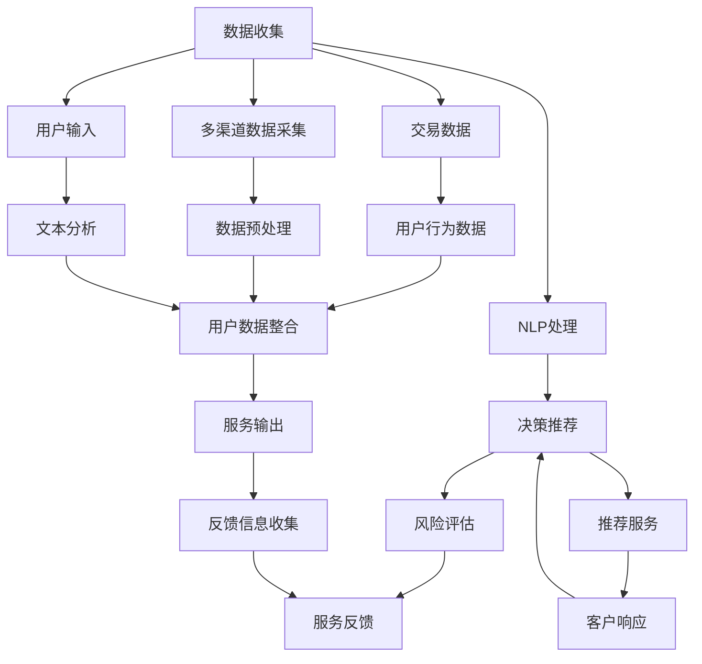
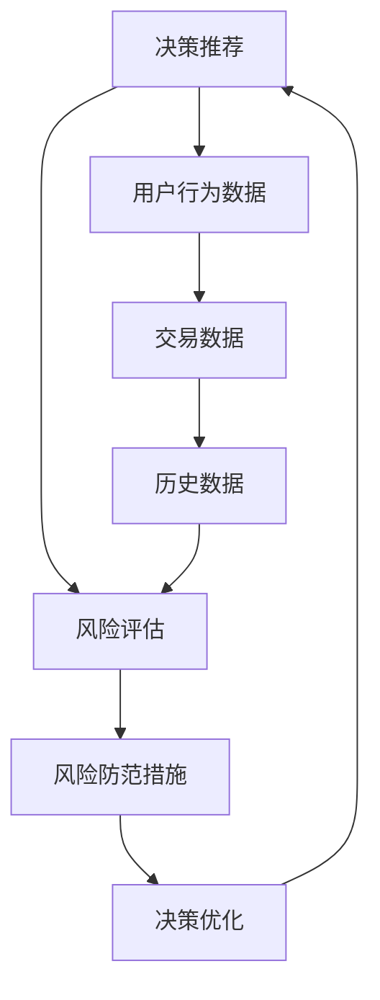
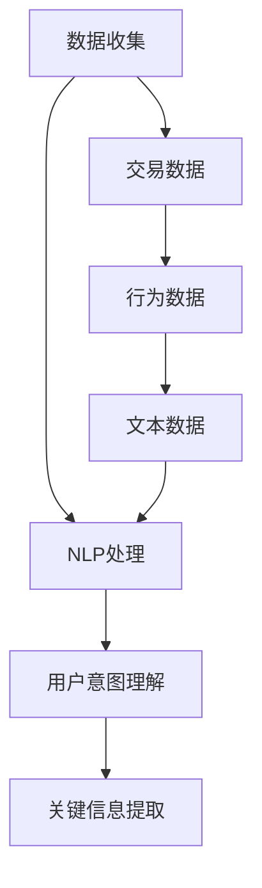

                 

# AI代理在金融服务中的工作流程与风险评估

## 1. 背景介绍

### 1.1 问题由来

金融服务行业作为经济的重要支柱，其数字化转型迫在眉睫。传统金融服务依赖于人工操作，效率低下，风险控制难度大。而人工智能技术，特别是AI代理，可以大幅提升金融服务的智能化水平，降低运营成本，提升客户体验，加强风险管理。

AI代理是指通过自然语言处理(NLP)、机器学习和数据分析技术构建的金融服务机器人，能够自动完成客户咨询、贷款申请、投资分析等任务。AI代理可以24小时不间断工作，响应速度更快，处理能力更强，同时可以避免人为操作错误，提高服务质量。

但与此同时，金融领域的数据敏感性高，风险控制难度大，这对AI代理的设计和应用提出了更高的要求。如何构建可靠、安全的AI代理，进行全面的风险评估，确保其应用效果，成为业界亟需解决的重要问题。

### 1.2 问题核心关键点

AI代理在金融服务中的主要工作流程包括：

1. 数据收集：从各种金融服务渠道（如网站、APP、客服热线）收集用户行为数据和交易数据。
2. 自然语言处理：利用NLP技术对用户输入的文本进行理解和分析，提取关键信息。
3. 决策推荐：根据用户输入的信息和历史数据，结合AI模型进行决策分析，推荐合适的金融产品和服务。
4. 风险评估：对用户的交易行为进行风险评估，识别潜在的风险点，采取相应的防范措施。
5. 服务反馈：收集用户的反馈信息，持续优化AI代理的性能。

AI代理的构建和应用需要重点关注以下几个关键点：

- 如何构建准确、高效的NLP模型，理解用户需求。
- 如何选择合适的人工智能算法，进行有效的决策推荐。
- 如何设计全面的风险评估指标，及时发现和防范风险。
- 如何设计高效的交互界面，提升用户体验。

这些核心问题贯穿于AI代理的设计和应用全过程，是构建可靠金融服务AI代理的关键。

### 1.3 问题研究意义

AI代理在金融服务中的应用，具有以下重要意义：

1. 提高服务效率。AI代理可以处理大量用户请求，减少人工操作，提升金融服务的处理速度和效率。
2. 降低运营成本。AI代理可以无间断工作，降低人力成本和运营成本，提升金融服务的盈利能力。
3. 提升客户体验。AI代理能够快速响应客户需求，提供个性化的服务，提升客户满意度和忠诚度。
4. 加强风险管理。AI代理可以实时监控交易行为，及时发现和防范风险，保障金融服务的稳定运行。
5. 推动金融创新。AI代理能够助力金融产品和服务创新，开拓新的市场空间，促进金融技术的快速发展。

因此，研究AI代理在金融服务中的应用，对提升金融服务水平、推动金融业数字化转型具有重要意义。

## 2. 核心概念与联系

### 2.1 核心概念概述

为更好地理解AI代理在金融服务中的工作流程与风险评估，本节将介绍几个密切相关的核心概念：

- **AI代理（AI Agent）**：通过NLP、机器学习和数据分析技术构建的金融服务机器人，能够自动处理用户请求，推荐金融产品，提供个性化服务。
- **自然语言处理（NLP）**：涉及计算机对人类语言进行理解、生成和分析的技术，包括分词、命名实体识别、情感分析等。
- **机器学习（ML）**：通过算法模型对大量数据进行训练，使计算机具备预测、分类等能力，实现自动化决策。
- **风险评估（Risk Assessment）**：对用户行为、交易数据进行分析和评估，识别潜在的风险点，采取防范措施。
- **金融服务**：包括银行业务、投资管理、贷款服务、保险产品等，涉及用户需求分析、交易处理、风险控制等多个环节。

这些核心概念之间的逻辑关系可以通过以下Mermaid流程图来展示：



这个流程图展示了AI代理在金融服务中的核心工作流程和数据流动：

1. 从金融服务渠道收集数据，包括交易数据和用户行为数据。
2. 利用NLP技术处理用户输入的文本，提取关键信息。
3. 结合历史数据和用户信息，使用机器学习模型进行决策推荐。
4. 对推荐结果进行风险评估，识别潜在风险。
5. 根据用户反馈，持续优化AI代理的性能。

### 2.2 概念间的关系

这些核心概念之间存在着紧密的联系，形成了AI代理在金融服务中的完整生态系统。下面我们通过几个Mermaid流程图来展示这些概念之间的关系。

#### 2.2.1 AI代理的工作流程


这个流程图展示了AI代理的基本工作流程：

1. 从金融服务渠道收集数据。
2. 利用NLP技术处理用户输入，提取关键信息。
3. 结合历史数据和用户信息，使用机器学习模型进行决策推荐。
4. 对推荐结果进行风险评估，识别潜在风险。
5. 根据用户反馈，持续优化AI代理的性能。

#### 2.2.2 风险评估与决策推荐的关联



这个流程图展示了风险评估与决策推荐之间的关系：

1. 根据用户行为和交易数据，进行决策推荐。
2. 对推荐结果进行风险评估，识别潜在的风险点。
3. 根据风险评估结果，采取相应的风险防范措施。
4. 根据风险防范措施的效果，优化决策推荐模型。

#### 2.2.3 数据收集与NLP处理的关系



这个流程图展示了数据收集与NLP处理之间的关系：

1. 从金融服务渠道收集数据，包括交易数据和行为数据。
2. 对文本数据进行NLP处理，理解用户意图，提取关键信息。
3. 根据用户意图和关键信息，进行决策推荐和风险评估。

### 2.3 核心概念的整体架构

最后，我们用一个综合的流程图来展示这些核心概念在大语言模型微调过程中的整体架构：


这个综合流程图展示了从数据收集到服务反馈的完整流程，帮助理解AI代理在金融服务中的应用框架。

## 3. 核心算法原理 & 具体操作步骤
### 3.1 算法原理概述

AI代理在金融服务中的核心算法主要包括自然语言处理（NLP）、机器学习和风险评估三个部分。以下是每个部分的算法原理概述：

**3.1.1 自然语言处理（NLP）**

NLP的核心目标是通过计算机对人类语言进行理解和生成。在AI代理中，NLP主要涉及以下几个任务：

- **分词**：将文本分解成词汇单元，为后续处理做准备。
- **命名实体识别（NER）**：识别文本中的人名、地名、机构名等实体。
- **情感分析**：分析用户输入的文本情感倾向，判断用户情绪。
- **意图识别**：理解用户的意图，提取关键信息。

这些任务的算法原理通常基于规则、统计和深度学习模型。常见的模型包括BERT、GPT、LSTM等。

**3.1.2 机器学习（ML）**

机器学习在AI代理中的应用主要涉及两个方面：

- **决策推荐**：通过训练模型，根据用户输入和历史数据，预测用户的金融需求，推荐合适的产品和服务。
- **风险评估**：对用户行为和交易数据进行分析，识别潜在的风险点，采取防范措施。

常见的算法包括决策树、随机森林、神经网络等。

**3.1.3 风险评估（Risk Assessment）**

风险评估的核心目标是识别和评估用户的风险水平。常用的风险评估指标包括：

- **信用评分**：评估用户的信用历史和财务状况。
- **行为评分**：根据用户的交易行为和操作历史，评估其风险偏好和行为模式。
- **模型预测**：使用机器学习模型预测用户的违约概率和风险等级。

这些指标的计算和分析需要结合具体业务场景和数据特点进行设计。

### 3.2 算法步骤详解

AI代理在金融服务中的应用需要经过以下步骤：

**Step 1: 数据收集与预处理**

- 从金融服务渠道（如网站、APP、客服热线）收集用户行为数据和交易数据。
- 对数据进行清洗和预处理，去除无关信息，提取关键特征。

**Step 2: 自然语言处理**

- 对用户输入的文本进行分词、命名实体识别和情感分析，提取关键信息。
- 利用NLP模型对文本进行意图识别，理解用户的真实需求。

**Step 3: 决策推荐**

- 结合用户历史数据和金融产品信息，使用机器学习模型进行决策推荐。
- 选择合适的推荐算法，优化模型参数，提高推荐效果。

**Step 4: 风险评估**

- 对用户的交易行为进行风险评估，识别潜在的风险点。
- 根据风险评估结果，采取相应的风险防范措施，如预警、限制交易等。

**Step 5: 服务反馈**

- 收集用户的反馈信息，分析用户满意度，进行持续优化。
- 根据用户反馈，调整模型参数，提升AI代理的性能。

### 3.3 算法优缺点

AI代理在金融服务中的应用具有以下优点：

1. 提高服务效率。AI代理可以处理大量用户请求，减少人工操作，提升金融服务的处理速度和效率。
2. 降低运营成本。AI代理可以无间断工作，降低人力成本和运营成本，提升金融服务的盈利能力。
3. 提升客户体验。AI代理能够快速响应客户需求，提供个性化的服务，提升客户满意度和忠诚度。
4. 加强风险管理。AI代理可以实时监控交易行为，及时发现和防范风险，保障金融服务的稳定运行。

但同时，AI代理在金融服务中也存在一些局限性：

1. 数据质量问题。金融数据的质量直接影响AI代理的决策推荐和风险评估效果。
2. 模型偏差问题。AI代理的模型可能存在偏见，影响对特定群体的服务质量和公平性。
3. 隐私保护问题。AI代理需要处理大量敏感数据，需要严格保护用户隐私。
4. 模型可解释性问题。AI代理的决策过程难以解释，需要提高模型的可解释性和透明度。
5. 模型鲁棒性问题。AI代理的模型可能对噪声和异常数据敏感，需要进行鲁棒性测试和优化。

### 3.4 算法应用领域

AI代理在金融服务中的应用领域非常广泛，涵盖了以下多个方面：

1. **客户咨询**：自动回答客户的常见问题，如贷款利率、投资回报等。
2. **贷款申请**：自动处理客户的贷款申请，评估信用评分和风险等级。
3. **投资管理**：推荐合适的投资产品和策略，管理用户的投资组合。
4. **风险预警**：实时监控交易行为，及时发现和预警潜在的风险点。
5. **客户服务**：提供个性化的客户服务，提升客户满意度和忠诚度。

此外，AI代理还可以应用于金融产品的开发和销售、金融市场的分析和预测、金融机构的运营管理等。随着技术的不断进步，AI代理在金融服务中的应用前景将更加广阔。

## 4. 数学模型和公式 & 详细讲解 & 举例说明
### 4.1 数学模型构建

在AI代理的决策推荐和风险评估中，常用的数学模型包括线性回归、逻辑回归、决策树、随机森林等。这里以逻辑回归为例，介绍其基本数学模型和公式。

**逻辑回归模型**

逻辑回归是一种常用的分类模型，用于预测用户的决策和行为。其数学模型如下：

$$
P(y=1|x;\theta) = \frac{1}{1+e^{-\theta^T x}}
$$

其中，$y$ 表示用户的决策，$x$ 表示用户的历史数据和行为特征，$\theta$ 表示模型的参数向量，$e$ 表示自然对数。

模型的目标是最小化损失函数，常用的损失函数包括交叉熵损失：

$$
L(y,\hat{y}) = -\frac{1}{N}\sum_{i=1}^N y_i\log \hat{y}_i + (1-y_i)\log(1-\hat{y}_i)
$$

### 4.2 公式推导过程

逻辑回归的推导过程如下：

1. **样本概率计算**：根据给定的历史数据和行为特征，计算样本属于正类的概率。
2. **损失函数计算**：根据样本的真实标签和预测概率，计算交叉熵损失。
3. **参数更新**：使用梯度下降等优化算法，最小化损失函数，更新模型参数。

### 4.3 案例分析与讲解

以贷款申请为例，假设有一个贷款申请数据集，包括用户的收入、年龄、信用评分等信息。通过逻辑回归模型，可以预测用户是否会违约：

- **样本概率计算**：对于每个贷款申请样本，计算其违约概率 $P(y=1|x;\theta)$。
- **损失函数计算**：将样本的真实标签和预测概率代入交叉熵损失公式，计算每个样本的损失。
- **参数更新**：使用梯度下降算法，最小化损失函数，更新模型参数。

## 5. 项目实践：代码实例和详细解释说明
### 5.1 开发环境搭建

在进行AI代理的开发和测试时，需要搭建Python开发环境，主要包含以下几个步骤：

1. 安装Python环境
2. 安装必要的依赖库，如Numpy、Pandas、Scikit-Learn等
3. 安装机器学习库，如Scikit-Learn、TensorFlow、Keras等
4. 安装自然语言处理库，如NLTK、SpaCy、Gensim等
5. 安装金融服务相关的库，如PyBank、StockAnalysis等

### 5.2 源代码详细实现

以下是一个简单的贷款申请处理代码示例，展示了AI代理在金融服务中的应用：

```python
import pandas as pd
from sklearn.linear_model import LogisticRegression
from sklearn.model_selection import train_test_split
from sklearn.metrics import accuracy_score

# 读取数据
data = pd.read_csv('loan_data.csv')

# 数据预处理
X = data[['income', 'age', 'credit_score']]
y = data['default']
X_train, X_test, y_train, y_test = train_test_split(X, y, test_size=0.2, random_state=42)

# 逻辑回归模型
model = LogisticRegression()
model.fit(X_train, y_train)

# 预测
y_pred = model.predict(X_test)

# 评估
accuracy = accuracy_score(y_test, y_pred)
print('Accuracy:', accuracy)
```

### 5.3 代码解读与分析

在这个示例中，我们使用Python和Scikit-Learn库构建了逻辑回归模型，用于预测贷款申请是否违约。

1. **数据读取**：使用Pandas库读取贷款申请数据集。
2. **数据预处理**：选择收入、年龄、信用评分等特征，作为模型的输入。
3. **模型训练**：使用LogisticRegression模型进行训练，最小化交叉熵损失。
4. **预测和评估**：对测试集进行预测，并计算模型的准确率。

## 6. 实际应用场景
### 6.1 智能客服系统

在智能客服系统中，AI代理可以处理客户的各种咨询问题，提高客服效率，减少人工成本。具体应用场景包括：

1. **常见问题解答**：自动回答客户的常见问题，如贷款利率、信用卡积分等。
2. **预约服务**：自动处理客户的预约请求，提供的服务包括但不限于预约理财顾问、银行开户等。
3. **问题升级处理**：对于无法解决的问题，将请求升级至人工客服，确保客户得到及时有效的帮助。

### 6.2 贷款审批系统

贷款审批系统是金融服务的重要环节，AI代理可以在其中发挥重要作用。具体应用场景包括：

1. **贷款申请预处理**：自动处理客户的贷款申请，初步筛选符合要求的申请人。
2. **信用评分评估**：根据客户的历史数据和行为特征，评估其信用评分和风险等级。
3. **贷款审批决策**：根据信用评分和风险评估结果，自动做出贷款审批决策。

### 6.3 投资分析系统

投资分析系统是金融服务的重要组成部分，AI代理可以在其中提供个性化的投资建议。具体应用场景包括：

1. **投资组合推荐**：根据客户的风险偏好和历史投资数据，推荐合适的投资组合。
2. **市场分析**：分析市场走势，提供投资建议和风险预警。
3. **客户反馈处理**：根据客户的投资表现和反馈，调整投资策略，提升客户满意度和忠诚度。

### 6.4 未来应用展望

未来，AI代理在金融服务中的应用将更加广泛和深入。以下是一些可能的未来应用场景：

1. **信用评分动态更新**：根据客户的行为数据，实时更新其信用评分，提高风险评估的准确性。
2. **投资策略优化**：结合市场数据和客户行为，优化投资策略，提升投资回报。
3. **智能合约执行**：自动处理金融合约的执行和监管，保障合约的公平性和透明度。
4. **智能合规监控**：实时监控金融交易，识别和防范违规行为，保障金融市场的稳定运行。
5. **智能反欺诈**：利用AI代理进行反欺诈检测，识别和防范各种金融欺诈行为。

## 7. 工具和资源推荐
### 7.1 学习资源推荐

为了帮助开发者系统掌握AI代理在金融服务中的应用，这里推荐一些优质的学习资源：

1. 《Python金融数据分析》系列书籍：介绍了金融数据分析的基础知识和常用技术。
2. 《深度学习与人工智能在金融中的应用》课程：由金融科技专家授课，系统讲解AI在金融中的实践应用。
3. 《机器学习实战》系列文章：详细介绍机器学习算法和实际应用场景，适合入门学习。
4. Kaggle金融数据分析竞赛：参加实战竞赛，提升解决实际问题的能力。
5. Udacity金融科技专业：提供系统的金融科技课程，涵盖AI、区块链、大数据等多个方向。

### 7.2 开发工具推荐

高效的开发离不开优秀的工具支持。以下是几款用于AI代理开发和测试的工具：

1. Python：Python是AI代理开发的主流语言，拥有丰富的库和框架。
2. PyTorch：深度学习框架，支持动态计算图和GPU加速，适合构建复杂模型。
3. TensorFlow：深度学习框架，支持分布式计算和GPU加速，适合大规模模型训练。
4. Scikit-Learn：机器学习库，提供了各种常见的机器学习算法和工具。
5. NLTK：自然语言处理库，提供了分词、命名实体识别等基本功能。
6. SpaCy：自然语言处理库，支持更高效的NLP任务。

### 7.3 相关论文推荐

AI代理在金融服务中的应用需要深入研究机器学习和NLP技术。以下是几篇相关的经典论文，推荐阅读：

1. "A Survey on Deep Learning and NLP in Finance"：由金融科技专家撰写，全面回顾了AI在金融中的应用。
2. "Machine Learning in Credit Risk Management"：介绍了机器学习在信用风险管理中的应用，包括信用评分、违约预测等。
3. "Natural Language Processing for Customer Service in Financial Institutions"：探讨了NLP技术在金融客户服务中的应用，包括客服聊天机器人等。
4. "Deep Learning for Financial Analysis and Decision Making"：介绍了深度学习在金融分析和决策中的应用，包括风险评估、投资管理等。

## 8. 总结：未来发展趋势与挑战
### 8.1 研究成果总结

本文对AI代理在金融服务中的应用进行了全面系统的介绍。主要内容包括：

- AI代理的工作流程和数据流
- 自然语言处理、机器学习和风险评估的基本算法
- 贷款申请处理、智能客服、投资分析等实际应用场景
- 数学模型和公式的详细讲解

### 8.2 未来发展趋势

未来，AI代理在金融服务中的应用将呈现以下发展趋势：

1. **智能化和自动化**：AI代理将更加智能化和自动化，能够自主处理更多复杂的金融任务。
2. **数据驱动**：AI代理将更加依赖数据驱动，利用大数据和机器学习技术，提供更精准的服务。
3. **跨领域融合**：AI代理将与区块链、物联网等技术融合，提升金融服务的智能化水平。
4. **隐私保护**：AI代理将更加注重用户隐私保护，采用差分隐私、联邦学习等技术，确保数据安全。
5. **可解释性**：AI代理将更加注重模型的可解释性，提高用户对系统的信任度和接受度。

### 8.3 面临的挑战

AI代理在金融服务中的应用仍面临以下挑战：

1. **数据质量**：金融数据的质量直接影响AI代理的决策推荐和风险评估效果。
2. **模型偏差**：AI代理的模型可能存在偏见，影响对特定群体的服务质量和公平性。
3. **隐私保护**：AI代理需要处理大量敏感数据，需要严格保护用户隐私。
4. **模型可解释性**：AI代理的决策过程难以解释，需要提高模型的可解释性和透明度。
5. **模型鲁棒性**：AI代理的模型可能对噪声和异常数据敏感，需要进行鲁棒性测试和优化。

### 8.4 研究展望

未来，AI代理在金融服务中的应用需要在以下几个方面寻求新的突破：

1. **数据治理**：建立全面的数据治理机制，确保数据质量和安全。
2. **模型优化**：优化AI代理的模型算法和参数，提高模型的准确性和鲁棒性。
3. **隐私保护**：采用差分隐私、联邦学习等技术，保护用户隐私。
4. **可解释性**：提高模型的可解释性，增强用户信任。
5. **跨领域融合**：将AI代理与其他技术（如区块链、物联网）进行融合，提升金融服务的智能化水平。

## 9. 附录：常见问题与解答

**Q1：AI代理在金融服务中的安全性如何保证？**

A: AI代理在金融服务中的安全性主要通过以下几个方面保障：

1. **数据加密**：采用数据加密技术，保护用户数据的安全性。
2. **访问控制**：采用访问控制技术，确保只有授权用户能够访问和操作系统。
3. **异常检测**：利用异常检测技术，及时发现和防范异常行为和攻击。
4. **安全监控**：建立安全监控系统，实时监控系统的运行状态和安全风险。

**Q2：AI代理在金融服务中的风险管理机制是什么？**

A: AI代理在金融服务中的风险管理机制主要包括以下几个方面：

1. **信用评分模型**：根据用户的历史数据和行为特征，评估其信用评分和风险等级。
2. **行为评分模型**：根据用户的交易行为和操作历史，评估其行为模式和风险偏好。
3. **模型预测机制**：使用机器学习模型预测用户的违约概率和风险等级。
4. **预警和防范机制**：根据风险评估结果，采取相应的预警和防范措施，如限制交易、提醒客户等。

**Q3：如何优化AI代理的性能？**

A: 优化AI代理的性能可以从以下几个方面入手：

1. **数据质量**：确保数据的准确性和完整性，提升模型的训练效果。
2. **模型选择**：选择适合业务场景的模型算法，优化模型参数。
3. **算法优化**：采用更高效的算法，提升模型计算速度和精度。
4. **跨领域融合**：将AI代理与其他技术（如区块链、物联网）进行融合，提升金融服务的智能化水平。
5. **持续优化**：根据用户反馈和业务需求，持续优化AI代理的性能。

**Q4：AI代理在金融服务中的应用有哪些局限性？**

A: AI代理在金融服务中的应用存在以下几个局限性：

1. **数据质量问题**：金融数据的质量直接影响AI代理的决策推荐和风险评估效果。
2. **模型偏差问题**：AI代理的模型可能存在偏见，影响对特定群体的服务质量和公平性。
3.

