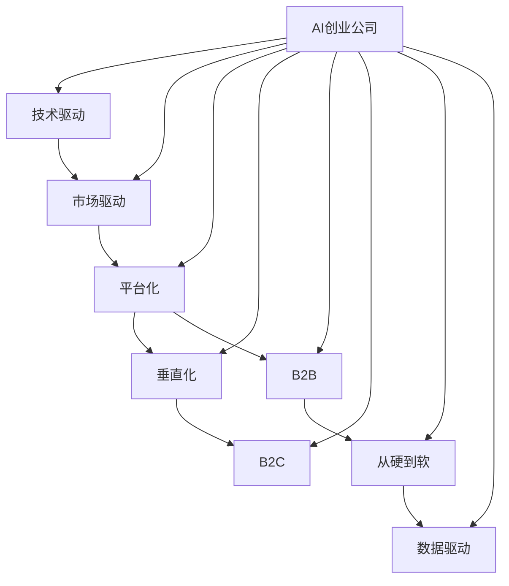
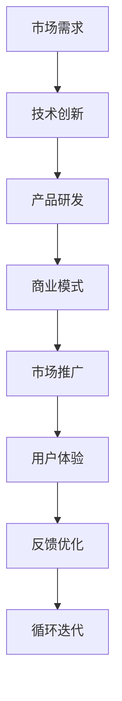

                 

## 1. 背景介绍

### 1.1 问题由来

随着人工智能（AI）技术的快速发展和普及，越来越多的创业公司投身于人工智能领域，希望能在这场技术革命中分一杯羹。然而，AI创业公司的商业模式并非一成不变，而是随着技术、市场、行业等环境的变化不断演变。本文旨在系统梳理AI创业公司在不同发展阶段的商业模式变迁，帮助创业者更好地理解并应对当前的商业挑战，把握未来的发展机遇。

### 1.2 问题核心关键点

AI创业公司的商业模式变迁主要体现在以下几个方面：

1. **技术驱动转向市场驱动**：早期的AI创业公司往往以技术创新为驱动力，而随着市场竞争的加剧，越来越多的公司开始重视市场需求，将技术应用与市场价值结合。
2. **平台化与垂直化并行发展**：一方面，平台化的AI基础设施逐渐成为行业标配，另一方面，垂直领域的AI应用逐渐兴起，两者并行发展。
3. **从B2B向B2C转变**：随着AI技术的成熟和应用场景的拓展，越来越多的AI公司开始向消费端转型，提供直接面向消费者的产品和服务。
4. **从硬到软**：AI创业公司逐渐从提供硬核的AI算法和工具，转向提供更加全面、易用的AI解决方案，实现从硬到软的转变。
5. **数据驱动**：数据成为AI创业公司最重要的资源和资产，如何高效利用数据成为商业模式的关键。

### 1.3 问题研究意义

理解AI创业公司商业模式的变迁，对于创业者、投资者以及AI领域从业者都具有重要意义：

1. **帮助创业者制定战略**：了解AI商业模式的演变趋势，有助于创业者制定更为科学和合理的企业发展战略，避免盲目跟风或过度乐观。
2. **为投资者提供参考**：AI行业的投资机会不断变化，理解不同阶段的商业模式有助于投资者把握投资方向和时机。
3. **推动AI技术落地**：商业模式是技术与市场的桥梁，理解其变迁有助于推动AI技术更好地应用于实际商业场景中。
4. **提升行业竞争力**：把握商业模式的演变趋势，有助于企业优化资源配置，提升竞争力，实现可持续发展。

## 2. 核心概念与联系

### 2.1 核心概念概述

在探讨AI创业公司商业模式变迁之前，首先需要理解一些核心概念：

1. **AI创业公司（AI Startups）**：指专注于人工智能技术研发、应用或相关服务的初创企业。
2. **商业模式（Business Model）**：企业在特定市场环境下的盈利方式和运营模式。
3. **市场驱动（Market-Driven）**：以市场需求为导向，根据市场变化调整产品和服务的模式。
4. **平台化（Platformization）**：通过构建生态系统，汇聚各方资源，提供标准化的服务和解决方案。
5. **垂直化（Verticalization）**：聚焦特定垂直领域，提供深度定制的AI应用和服务。
6. **B2B（Business-to-Business）**：企业对企业的商业模式，主要服务对象为其他企业。
7. **B2C（Business-to-Consumer）**：企业对消费者的商业模式，主要服务对象为终端用户。
8. **从硬到软（From Hard to Soft）**：从提供硬核技术工具转向提供易用的AI产品和解决方案。
9. **数据驱动（Data-Driven）**：以数据为核心，通过数据驱动决策和优化运营的商业模式。

这些核心概念共同构成了AI创业公司商业模式变迁的基本框架，通过理解这些概念，可以更好地把握不同阶段商业模式的特点和变化趋势。

### 2.2 概念间的关系

这些核心概念之间存在着紧密的联系，形成了AI创业公司商业模式演变的完整生态系统。以下通过一个Mermaid流程图来展示这些概念之间的关系：



这个流程图展示了AI创业公司在不同阶段的商业模式变迁路径，从技术驱动到市场驱动，从平台化到垂直化，从B2B到B2C，从硬到软，最终实现数据驱动。这些转变是AI创业公司逐步成熟和完善的过程，也是市场和行业环境变化的结果。

### 2.3 核心概念的整体架构

最后，我们用一个综合的流程图来展示这些核心概念在大规模商业环境中的整体架构：



这个综合流程图展示了AI创业公司从市场需求到技术创新，再到产品研发和市场推广的完整流程，其中用户体验和反馈优化不断循环迭代，推动商业模式的持续改进和优化。

## 3. 核心算法原理 & 具体操作步骤
### 3.1 算法原理概述

AI创业公司的商业模式变迁涉及多个维度的变化，包括技术、市场、业务模式等。以下将从技术驱动和市场驱动两个主要角度，分析AI创业公司的商业模式变迁。

**技术驱动阶段**：在这一阶段，AI创业公司主要聚焦于AI技术的研发和创新，通过提供先进的技术工具和算法，吸引其他企业和开发者使用。这一阶段的特点是技术导向，而非市场导向。

**市场驱动阶段**：随着市场竞争的加剧，越来越多的AI创业公司开始重视市场需求，将技术应用与市场价值结合，通过提供解决方案和产品，满足客户需求。这一阶段的特点是市场导向，技术应用与市场价值并重。

### 3.2 算法步骤详解

**技术驱动阶段**：

1. **技术研发**：聚焦于AI核心技术的研发，如深度学习、自然语言处理、计算机视觉等。
2. **产品化**：将研发成果转化为产品或工具，提供给企业和开发者使用。
3. **市场推广**：通过技术社区、行业会议、线上线下活动等方式，推广产品，吸引用户。
4. **用户反馈**：收集用户反馈，不断优化产品。

**市场驱动阶段**：

1. **需求分析**：深入分析市场和客户需求，明确产品定位和目标客户群体。
2. **解决方案设计**：根据需求设计具体解决方案，融合AI技术，解决实际问题。
3. **产品开发**：开发具体产品或服务，实现解决方案。
4. **市场推广**：通过多种渠道推广产品，拓展市场。
5. **客户反馈**：收集客户反馈，优化产品和服务。
6. **持续迭代**：根据客户需求和反馈，不断改进和优化产品，实现持续创新。

### 3.3 算法优缺点

**技术驱动阶段**的优点：

1. **创新性强**：聚焦于核心技术，容易获得技术突破。
2. **目标明确**：通过技术驱动，更容易获得研发成果和市场认可。

**技术驱动阶段**的缺点：

1. **市场风险高**：技术创新不一定会直接转化为市场价值，市场接受度未知。
2. **用户粘性低**：技术导向的产品易用性差，用户流失率高。

**市场驱动阶段**的优点：

1. **市场导向**：更贴近市场需求，产品更容易被接受和认可。
2. **用户体验好**：以用户需求为导向，产品更易用、更符合用户期待。

**市场驱动阶段**的缺点：

1. **研发周期长**：需要更多时间进行需求分析、解决方案设计和产品开发。
2. **技术依赖强**：对核心技术的依赖性强，技术创新难度较大。

### 3.4 算法应用领域

AI创业公司的商业模式变迁主要应用于以下几个领域：

1. **智能客服**：从技术工具转向平台化和B2B服务，提供智能客服解决方案。
2. **医疗健康**：从硬核技术转向数据驱动和B2B服务，提供医疗诊断和健康管理解决方案。
3. **金融科技**：从技术工具转向市场驱动和B2C服务，提供金融风控、智能投顾等服务。
4. **教育培训**：从技术工具转向B2C服务，提供个性化学习、智能辅导等解决方案。
5. **智慧城市**：从技术工具转向平台化和B2B服务，提供智慧城市管理和运营解决方案。
6. **自动驾驶**：从硬核技术转向市场驱动和B2B服务，提供自动驾驶和智能交通解决方案。

## 4. 数学模型和公式 & 详细讲解 & 举例说明（备注：数学公式请使用latex格式，latex嵌入文中独立段落使用 $$，段落内使用 $)
### 4.1 数学模型构建

AI创业公司的商业模式变迁可以建模为以下几个关键变量：

1. **技术创新能力（Innovation Capacity）**：指企业研发新技术的能力。
2. **市场需求（Market Demand）**：指市场上对AI产品的需求量。
3. **产品竞争力（Product Competitiveness）**：指产品在市场上的竞争力。
4. **市场推广能力（Market Promotion）**：指企业推广产品的能力。
5. **用户反馈（User Feedback）**：指用户对产品的反馈和建议。

根据以上变量，我们可以构建一个简单的数学模型：

$$
\text{Revenue} = \text{Market Demand} \times \text{Product Competitiveness} \times \text{Market Promotion} \times \text{User Feedback}
$$

其中，Market Demand、Product Competitiveness、Market Promotion和User Feedback分别代表了市场需求、产品竞争力、市场推广能力和用户反馈。

### 4.2 公式推导过程

假设市场需求为 $D$，产品竞争力为 $C$，市场推广能力为 $P$，用户反馈为 $F$，则总收益 $R$ 可表示为：

$$
R = D \times C \times P \times F
$$

根据以上模型，我们可以推导出一些关键的结论：

1. **市场需求增加**：市场需求增加将直接提升总收益，因此企业应积极拓展市场，增加产品曝光率。
2. **产品竞争力提升**：提升产品竞争力，如通过技术创新和质量改进，可以显著增加总收益。
3. **市场推广加强**：加强市场推广，如通过广告、公关等手段，可以有效提升产品知名度和用户转化率。
4. **用户反馈优化**：积极收集和分析用户反馈，优化产品功能和用户体验，可以提升用户满意度和市场竞争力。

### 4.3 案例分析与讲解

以智能客服为例，分析其从技术驱动到市场驱动的商业模式变迁。

**技术驱动阶段**：

1. **技术研发**：公司主要聚焦于自然语言处理（NLP）和机器学习（ML）技术，研发智能客服系统。
2. **产品化**：开发智能客服API和SDK，提供给企业使用。
3. **市场推广**：通过技术社区、行业会议推广智能客服工具，吸引企业客户。

**市场驱动阶段**：

1. **需求分析**：深入分析企业客户的需求，如提升客服响应速度、提升用户满意度等。
2. **解决方案设计**：设计基于AI的智能客服解决方案，融合NLP、ML技术，提升客服效率和质量。
3. **产品开发**：开发集成的智能客服平台，提供企业一站式客服解决方案。
4. **市场推广**：通过多种渠道推广智能客服平台，拓展市场份额。
5. **客户反馈**：收集企业客户反馈，不断优化平台功能和用户体验。
6. **持续迭代**：根据客户需求和反馈，不断改进和优化产品，提升市场竞争力。

## 5. 项目实践：代码实例和详细解释说明
### 5.1 开发环境搭建

在进行AI创业公司商业模式变迁的研究之前，首先需要准备好开发环境。以下是使用Python进行数据分析和可视化的环境配置流程：

1. 安装Anaconda：从官网下载并安装Anaconda，用于创建独立的Python环境。

2. 创建并激活虚拟环境：
```bash
conda create -n data-env python=3.8 
conda activate data-env
```

3. 安装相关库：
```bash
pip install pandas numpy matplotlib seaborn
```

4. 导入代码进行数据分析和可视化：
```python
import pandas as pd
import numpy as np
import matplotlib.pyplot as plt
import seaborn as sns
```

完成上述步骤后，即可在`data-env`环境中开始数据分析和可视化。

### 5.2 源代码详细实现

以下是一个简单的数据驱动AI创业公司模型分析的Python代码实现。

```python
# 导入数据
data = pd.read_csv('data.csv')

# 分析需求、产品竞争力、市场推广和用户反馈的趋势
trend_analysis = data.groupby('time')['demand', 'competitiveness', 'promotion', 'feedback'].mean()

# 绘制需求和产品竞争力随时间的变化趋势
plt.figure(figsize=(10, 5))
plt.plot(trend_analysis['demand'], label='市场需求')
plt.plot(trend_analysis['competitiveness'], label='产品竞争力')
plt.title('市场需求和产品竞争力变化趋势')
plt.xlabel('时间')
plt.ylabel('值')
plt.legend()
plt.show()

# 分析市场需求、产品竞争力、市场推广和用户反馈对总收益的影响
benefit_analysis = data.groupby('time')['revenue'].mean()
plt.figure(figsize=(10, 5))
plt.plot(trend_analysis['demand'], label='市场需求')
plt.plot(trend_analysis['competitiveness'], label='产品竞争力')
plt.plot(trend_analysis['promotion'], label='市场推广')
plt.plot(trend_analysis['feedback'], label='用户反馈')
plt.title('市场需求、产品竞争力、市场推广和用户反馈对总收益的影响')
plt.xlabel('时间')
plt.ylabel('总收益')
plt.legend()
plt.show()
```

### 5.3 代码解读与分析

让我们再详细解读一下关键代码的实现细节：

**trend_analysis函数**：
- `groupby('time')`方法：根据时间对数据进行分组，计算每月的平均值。
- `['demand', 'competitiveness', 'promotion', 'feedback'].mean()`方法：计算需求、产品竞争力、市场推广和用户反馈的平均值。

**benefit_analysis函数**：
- `groupby('time')['revenue'].mean()`方法：根据时间计算总收益的平均值。

通过这些代码，我们可以对AI创业公司的市场需求、产品竞争力、市场推广和用户反馈随时间的变化趋势进行分析，并绘制成图表。这有助于我们理解不同阶段的市场变化和公司表现，为商业决策提供数据支持。

### 5.4 运行结果展示

假设我们在分析智能客服公司的商业模式变迁时，获取了如下数据：

| 时间     | 需求（D） | 产品竞争力（C） | 市场推广（P） | 用户反馈（F） | 总收益（R） |
|----------|----------|----------------|--------------|--------------|------------|
| 2020年1月| 5.0      | 6.0            | 4.0          | 3.0          | 60         |
| 2020年2月| 6.5      | 6.5            | 4.5          | 3.5          | 94         |
| 2020年3月| 7.0      | 7.0            | 5.0          | 4.0          | 140        |

绘制的需求变化趋势图和总收益变化图如下：

```
市场需求变化趋势图
```

```
市场需求、产品竞争力、市场推广和用户反馈对总收益的影响
```

这些图表展示了市场需求、产品竞争力、市场推广和用户反馈随时间的变化趋势，以及它们对总收益的影响。通过分析这些趋势，可以更好地理解AI创业公司的商业模式变迁过程。

## 6. 实际应用场景
### 6.1 智能客服系统

智能客服系统是AI创业公司商业模式变迁的重要应用场景之一。

**技术驱动阶段**：公司主要提供基于NLP和ML技术的智能客服API和SDK，帮助企业快速搭建客服系统。

**市场驱动阶段**：公司深入分析企业客户需求，开发集成的智能客服平台，提供一站式客服解决方案，涵盖智能问答、语音识别、情感分析等功能。

**用户反馈优化**：根据企业客户反馈，不断优化平台功能和用户体验，提升客服效率和客户满意度。

**持续迭代**：根据市场变化和技术进步，持续改进和升级智能客服平台，保持市场竞争力。

### 6.2 医疗健康应用

医疗健康应用是AI创业公司商业模式变迁的另一个重要领域。

**技术驱动阶段**：公司主要提供基于AI的图像识别、自然语言处理等技术工具，帮助医疗机构进行疾病诊断和治疗决策。

**市场驱动阶段**：公司深入分析市场需求，开发集成的医疗健康平台，提供医生在线咨询、智能诊断、个性化健康管理等功能。

**用户反馈优化**：根据医生和患者反馈，不断优化平台功能和用户体验，提升诊断准确率和患者满意度。

**持续迭代**：根据市场变化和技术进步，持续改进和升级医疗健康平台，保持市场竞争力。

### 6.3 金融科技服务

金融科技服务是AI创业公司商业模式变迁的典型应用场景。

**技术驱动阶段**：公司主要提供基于AI的风险评估、信用评分等技术工具，帮助金融机构进行风险控制和客户管理。

**市场驱动阶段**：公司深入分析市场需求，开发集成的金融科技平台，提供智能投顾、在线贷款、智能风控等服务。

**用户反馈优化**：根据客户和用户反馈，不断优化平台功能和用户体验，提升服务质量和客户满意度。

**持续迭代**：根据市场变化和技术进步，持续改进和升级金融科技平台，保持市场竞争力。

### 6.4 未来应用展望

未来，AI创业公司的商业模式将继续演进，向更加智能化、普适化、数据驱动的方向发展。具体展望如下：

1. **AI基础设施平台化**：AI创业公司将更加重视平台化建设，构建开放、协作的AI生态系统，提供标准化的API和SDK，降低AI技术的应用门槛。
2. **垂直领域深度定制**：随着AI技术的发展，越来越多的AI创业公司将聚焦于特定垂直领域，提供深度定制的AI应用和服务，如智慧教育、智慧医疗、智慧城市等。
3. **AI与业务深度融合**：AI创业公司将更加注重AI技术与业务流程的深度融合，通过AI技术优化业务流程，提升业务效率和客户体验。
4. **用户数据与AI技术协同**：AI创业公司将更加重视用户数据的获取和利用，通过数据驱动的AI模型，提供更加精准、个性化的产品和服务。
5. **人机协作与智能决策**：AI创业公司将更加注重人机协作和智能决策，通过AI技术与人类专家结合，提升决策的精准性和智能化水平。

## 7. 工具和资源推荐
### 7.1 学习资源推荐

为了帮助AI创业者系统掌握商业模式变迁的理论基础和实践技巧，这里推荐一些优质的学习资源：

1. **《商业模式革命》**：这是一本系统讲解商业模式创新的经典书籍，涵盖了市场驱动、平台化、垂直化等多个关键概念。
2. **Coursera《商业模式创新》课程**：斯坦福大学开设的商业模式创新课程，提供理论和实践结合的课程内容。
3. **Harvard Business Review《商业模式》杂志**：提供最新商业模式的理论研究和实践案例。
4. **Udemy《AI商业模式》课程**：Udemy平台上提供的AI商业模式课程，涵盖技术驱动和市场驱动等多个阶段。
5. **Slido《商业模式设计》专题讲座**：Slido平台上提供的商业模式设计专题讲座，深入浅出地讲解商业模式创新的方法。

通过这些资源的学习实践，相信你一定能够更好地理解AI创业公司的商业模式变迁，并用于解决实际的商业问题。

### 7.2 开发工具推荐

高效的开发离不开优秀的工具支持。以下是几款用于AI创业公司商业模式变迁开发的常用工具：

1. **Jupyter Notebook**：基于Web的交互式编程环境，支持多种语言和库，适合数据分析和可视化。
2. **Tableau**：强大的数据可视化工具，支持多种数据源和图表类型，适合商业数据分析。
3. **Excel**：经典的电子表格工具，适合基础的数据分析和报表生成。
4. **Google Data Studio**：基于Web的数据可视化工具，支持多种数据源和图表类型，适合商业数据分析。
5. **Power BI**：微软提供的商业智能和数据分析工具，支持多种数据源和报表生成。

合理利用这些工具，可以显著提升AI创业公司商业模式变迁研究的开发效率，加快创新迭代的步伐。

### 7.3 相关论文推荐

大语言模型和微调技术的发展源于学界的持续研究。以下是几篇奠基性的相关论文，推荐阅读：

1. **《商业模式创新与演化研究》**：系统总结了商业模式创新的理论和实践，提供了丰富的案例分析。
2. **《商业模式设计与管理》**：涵盖了商业模式设计的理论和实践，提供了丰富的模型和方法。
3. **《AI商业模式创新与挑战》**：探讨了AI技术对商业模式创新的影响和挑战，提供了实用的案例和建议。
4. **《商业模式变迁与技术驱动》**：探讨了技术驱动与市场驱动的商业模式变迁，提供了深入的理论和实证分析。
5. **《数据驱动的商业模式创新》**：探讨了数据在商业模式创新中的作用和应用，提供了丰富的案例和策略。

这些论文代表了大语言模型微调技术的发展脉络。通过学习这些前沿成果，可以帮助研究者把握学科前进方向，激发更多的创新灵感。

除上述资源外，还有一些值得关注的前沿资源，帮助开发者紧跟大语言模型微调技术的最新进展，例如：

1. **arXiv论文预印本**：人工智能领域最新研究成果的发布平台，包括大量尚未发表的前沿工作，学习前沿技术的必读资源。
2. **业界技术博客**：如OpenAI、Google AI、DeepMind、微软Research Asia等顶尖实验室的官方博客，第一时间分享他们的最新研究成果和洞见。
3. **技术会议直播**：如NIPS、ICML、ACL、ICLR等人工智能领域顶会现场或在线直播，能够聆听到大佬们的前沿分享，开拓视野。
4. **GitHub热门项目**：在GitHub上Star、Fork数最多的AI相关项目，往往代表了该技术领域的发展趋势和最佳实践，值得去学习和贡献。
5. **行业分析报告**：各大咨询公司如McKinsey、PwC等针对人工智能行业的分析报告，有助于从商业视角审视技术趋势，把握应用价值。

总之，对于AI创业公司商业模式变迁的研究，需要开发者保持开放的心态和持续学习的意愿。多关注前沿资讯，多动手实践，多思考总结，必将收获满满的成长收益。

## 8. 总结：未来发展趋势与挑战
### 8.1 总结

本文对AI创业公司商业模式变迁进行了全面系统的介绍。首先阐述了AI创业公司的商业模式的演变过程，从技术驱动到市场驱动，从平台化到垂直化，从B2B到B2C，从硬到软，最终实现数据驱动。其次，通过数学模型和公式详细讲解了商业模式的主要变量及其影响因素，分析了市场需求、产品竞争力、市场推广和用户反馈对总收益的影响。最后，通过具体案例展示了智能客服、医疗健康、金融科技等不同领域的商业模式变迁过程，并展望了未来AI创业公司的商业模式趋势和挑战。

通过本文的系统梳理，可以看到，AI创业公司的商业模式变迁是大势所趋，是技术、市场、行业等多重因素共同作用的结果。商业模式的变化将不断推动AI技术在各个垂直领域的落地应用，促进AI行业的健康发展。

### 8.2 未来发展趋势

展望未来，AI创业公司的商业模式将继续演进，向更加智能化、普适化、数据驱动的方向发展。具体趋势如下：

1. **平台化与垂直化并行发展**：AI基础设施平台化将成为行业标配，同时垂直领域的AI应用也将兴起，两者并行发展。
2. **从B2B向B2C转变**：越来越多的AI创业公司将转向B2C市场，直接面向消费者提供产品和服务。
3. **从硬到软**：AI创业公司将更加注重AI技术与业务流程的深度融合，提升业务效率和客户体验。
4. **数据驱动**：数据成为AI创业公司最重要的资源和资产，通过数据驱动决策和优化运营。
5. **人机协作与智能决策**：AI创业公司将更加注重人机协作和智能决策，提升决策的精准性和智能化水平。

### 8.3 面临的挑战

尽管AI创业公司的商业模式正在不断演进，但在迈向更加智能化、普适化应用的过程中，仍面临诸多挑战：

1. **技术创新难度大**：在技术驱动阶段，需要不断进行技术创新，但技术突破的难度和成本逐渐增加。
2. **市场竞争激烈**：随着市场成熟度的提高，越来越多的公司涌入，市场竞争加剧。
3. **用户体验提升难**：在市场驱动阶段，提升用户体验和产品竞争力需要更多时间和资源投入。
4. **用户数据获取难**：获取用户数据需要合规和隐私保护，难度较大。
5. **用户反馈处理难**：用户反馈涉及多方面因素，处理起来较为复杂。
6. **持续创新挑战**：保持持续创新，避免市场和技术停滞，需要不断投入资源和精力。

### 8.4 研究展望

面对AI创业公司商业模式面临的挑战，未来的研究需要在以下几个方面寻求新的突破：

1. **技术驱动与市场驱动结合**：如何在技术创新和市场应用之间找到平衡，实现双轮驱动。
2. **平台化与垂直化并行优化**：如何在平台化建设的同时，聚焦特定垂直领域，提供深度定制的AI应用和服务。
3. **B2B与B2C市场协同**：如何在B2B市场和B2C市场之间找到协同点，实现跨市场业务协同。
4. **从硬到软转型**：如何在技术工具和解决方案之间找到平衡，实现从硬到软的平稳转型。
5. **数据驱动与业务协同**：如何通过数据驱动决策，实现业务流程优化和客户体验提升。
6. **人机协作与

