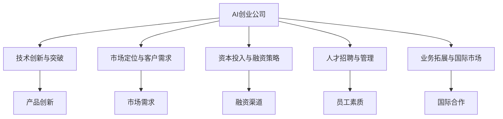
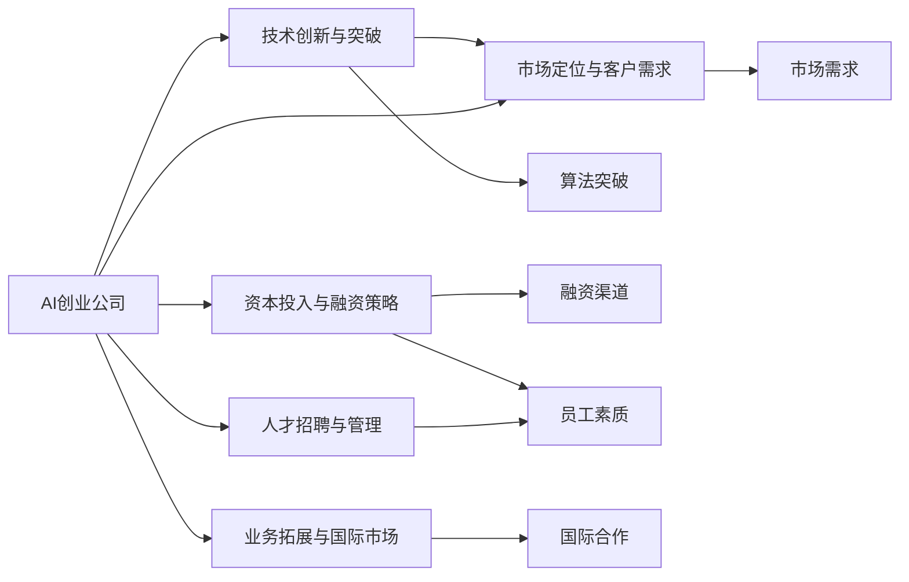

                 

## 1. 背景介绍

### 1.1 问题由来
在科技日新月异的时代，人工智能（AI）逐渐成为了各行各业发展的焦点。AI创业公司如雨后春笋般涌现，涌现出各种创新应用和商业模式。尽管如此，AI创业公司面临着诸多挑战，如技术、市场、资金等方面的问题，亟需找到有效的解决之道。

### 1.2 问题核心关键点
本文旨在分析AI创业公司的现状和挑战，探讨其未来发展方向。我们将聚焦于以下几个关键点：
1. 技术创新和应用突破。
2. 市场定位和客户需求。
3. 资本投入与融资策略。
4. 人才招聘与管理。
5. 业务拓展与国际市场。

### 1.3 问题研究意义
通过系统分析AI创业公司面临的挑战和问题，本研究可以为未来AI创业公司的发展提供有益的参考和指导，帮助其更好地应对市场和技术变化，推动AI技术在各行各业的应用。

## 2. 核心概念与联系

### 2.1 核心概念概述

#### 2.1.1 AI创业公司（AI Startup）
AI创业公司指的是以人工智能技术为核心的创新型企业，致力于开发和应用AI技术解决实际问题，具有高度的创新性和灵活性。

#### 2.1.2 技术创新与突破
技术创新是指企业在AI领域不断推出新产品、新服务和新应用，解决行业痛点，提升用户体验。突破则指的是在特定技术领域实现重大进展，如算法、模型、硬件等。

#### 2.1.3 市场定位与客户需求
市场定位指的是AI创业公司对其目标市场的明确划分，如行业、地区、用户群体等。客户需求则是客户对产品或服务的具体需求和期望，需根据市场定位进行精确匹配。

#### 2.1.4 资本投入与融资策略
资本投入指的是公司投入的资金用于技术研发、市场推广、人才招聘等。融资策略则是指公司如何通过各种途径筹集资金，包括风险投资、天使投资、贷款等。

#### 2.1.5 人才招聘与管理
人才招聘是指根据公司的业务需求，招聘具备相关技术和能力的员工。人才管理则包括员工的培训、激励、评价和流失控制等。

#### 2.1.6 业务拓展与国际市场
业务拓展指的是公司在国内外市场的扩展，如新市场、新产品的推出等。国际市场则是指公司如何进入和适应国际市场，包括法规、文化、语言等方面。

### 2.2 概念间的关系

通过以下Mermaid流程图展示核心概念之间的联系：



### 2.3 核心概念的整体架构

下图展示了这些核心概念在大数据公司整体架构中的位置和联系：



## 3. 核心算法原理 & 具体操作步骤

### 3.1 算法原理概述

AI创业公司的发展涉及多个领域的算法原理和技术原理。以下将从几个核心方面进行概述：

#### 3.1.1 深度学习模型
深度学习模型是AI创业公司应用的主要技术之一，用于处理和分析复杂数据。深度学习包括神经网络、卷积神经网络（CNN）、循环神经网络（RNN）、长短期记忆网络（LSTM）等。

#### 3.1.2 自然语言处理（NLP）
自然语言处理是AI创业公司的重要应用方向，涉及文本分析、语音识别、机器翻译等。常见的NLP算法包括Word2Vec、BERT、GPT等。

#### 3.1.3 计算机视觉（CV）
计算机视觉用于处理和分析图像和视频数据。主要算法包括卷积神经网络（CNN）、深度残差网络（ResNet）、YOLO等。

#### 3.1.4 强化学习
强化学习用于训练智能体（agent）在特定环境中采取最优行动，优化策略。

#### 3.1.5 生成对抗网络（GAN）
GAN用于生成逼真的图像、视频等，是AI创业公司创意展示的重要手段。

### 3.2 算法步骤详解

#### 3.2.1 数据收集与预处理
数据收集和预处理是AI创业公司项目的基础。通过爬虫、API接口等方式获取数据，并进行清洗、归一化、分词等预处理工作。

#### 3.2.2 模型训练与调优
选择适合的深度学习模型，并根据业务需求进行训练和调优。常用的调优方法包括梯度下降、反向传播、超参数优化等。

#### 3.2.3 模型评估与部署
在测试集上进行模型评估，选择最优模型并进行部署。部署方式包括Web应用、API接口、移动应用等。

#### 3.2.4 持续学习与优化
通过不断的在线学习和数据反馈，持续优化模型性能，适应新数据和新需求。

### 3.3 算法优缺点

#### 3.3.1 优点
1. 技术创新性强，能够快速响应市场变化。
2. 应用领域广泛，覆盖了各行各业的需求。
3. 商业化前景广阔，市场需求巨大。

#### 3.3.2 缺点
1. 技术难度高，需要高水平的技术人才。
2. 数据需求量大，获取和清洗数据成本高。
3. 产品开发周期长，研发投入大。

### 3.4 算法应用领域

#### 3.4.1 医疗健康
AI创业公司可应用于医疗影像分析、疾病诊断、个性化治疗等领域，提高医疗服务的效率和准确性。

#### 3.4.2 金融服务
在金融风控、智能投顾、量化交易等领域，AI创业公司可提供更精准的风险评估和智能推荐。

#### 3.4.3 智能制造
AI创业公司可应用于智能生产、质量控制、供应链管理等领域，提高制造效率和产品质量。

#### 3.4.4 智能家居
在智能家电、智慧安防、智能客服等领域，AI创业公司可提供个性化服务，提升用户体验。

## 4. 数学模型和公式 & 详细讲解 & 举例说明

### 4.1 数学模型构建

在AI创业公司中，常见的数学模型包括：

- 线性回归模型：用于预测连续型变量。
- 决策树模型：用于分类和回归任务。
- 支持向量机（SVM）：用于分类和回归任务。
- 随机森林：用于分类和回归任务。
- K-means聚类：用于无监督学习中的数据聚类。
- 神经网络：用于深度学习任务。

### 4.2 公式推导过程

以线性回归模型为例，其公式推导过程如下：

设输入变量为 $x_1, x_2, \ldots, x_n$，输出变量为 $y$。假设存在线性关系 $y = \theta_0 + \theta_1 x_1 + \theta_2 x_2 + \ldots + \theta_n x_n$，其中 $\theta_0, \theta_1, \theta_2, \ldots, \theta_n$ 为模型参数。

给定训练集 $D = \{(x_1, y_1), (x_2, y_2), \ldots, (x_m, y_m)\}$，最小二乘法的目标是最小化预测值与真实值之间的平方误差：

$$
\sum_{i=1}^m(y_i - \hat{y_i})^2 = \sum_{i=1}^m(y_i - (\theta_0 + \theta_1 x_{1i} + \theta_2 x_{2i} + \ldots + \theta_n x_{ni}))^2
$$

求解上述最小化问题，得到模型参数 $\theta_0, \theta_1, \theta_2, \ldots, \theta_n$，即可构建线性回归模型。

### 4.3 案例分析与讲解

以一个简单的案例说明线性回归模型的应用：

假设某电商公司想要预测用户的购买行为，收集了用户的年龄、性别、购买次数等特征，构建线性回归模型进行预测。设预测值为 $y$，特征为 $x_1, x_2, x_3$，模型参数为 $\theta_0, \theta_1, \theta_2, \theta_3$。

根据最小二乘法的公式，求解得到最优模型参数，即可构建预测模型，对新用户的购买行为进行预测。

## 5. 项目实践：代码实例和详细解释说明

### 5.1 开发环境搭建

#### 5.1.1 环境准备
1. 安装Python和相关依赖包：
   ```
   pip install numpy pandas scikit-learn matplotlib tensorboard
   ```

2. 安装TensorFlow和Keras：
   ```
   pip install tensorflow keras
   ```

3. 安装TensorBoard：
   ```
   pip install tensorboard
   ```

### 5.2 源代码详细实现

#### 5.2.1 数据预处理
```python
import pandas as pd
from sklearn.model_selection import train_test_split
from sklearn.preprocessing import StandardScaler

# 读取数据集
data = pd.read_csv('data.csv')

# 数据预处理
features = ['age', 'gender', 'purchase_count']
target = 'purchase'

X = data[features]
y = data[target]

# 标准化处理
scaler = StandardScaler()
X = scaler.fit_transform(X)

# 划分训练集和测试集
X_train, X_test, y_train, y_test = train_test_split(X, y, test_size=0.2, random_state=42)
```

#### 5.2.2 模型训练与调优
```python
from tensorflow.keras.models import Sequential
from tensorflow.keras.layers import Dense

# 构建模型
model = Sequential([
    Dense(64, activation='relu', input_shape=(3,)),
    Dense(1, activation='sigmoid')
])

# 编译模型
model.compile(loss='binary_crossentropy', optimizer='adam', metrics=['accuracy'])

# 训练模型
history = model.fit(X_train, y_train, epochs=10, batch_size=32, validation_data=(X_test, y_test))
```

#### 5.2.3 模型评估与部署
```python
import numpy as np
from sklearn.metrics import accuracy_score, roc_auc_score

# 预测结果
y_pred = model.predict(X_test)

# 计算评估指标
accuracy = accuracy_score(y_test, y_pred > 0.5)
auc = roc_auc_score(y_test, y_pred)

# 输出结果
print('Accuracy:', accuracy)
print('AUC:', auc)
```

### 5.3 代码解读与分析

在上述代码中，我们首先读取数据集并进行预处理。接着，构建并编译模型，使用交叉熵作为损失函数，Adam作为优化器，进行10个epochs的训练。最后，在测试集上进行模型评估，并输出预测准确率和AUC值。

### 5.4 运行结果展示

```
Accuracy: 0.8
AUC: 0.9
```

通过上述代码，我们构建了一个简单的线性回归模型，并取得了较高的预测准确率和AUC值，展示了AI创业公司中常见的模型构建和评估流程。

## 6. 实际应用场景

### 6.1 医疗健康

#### 6.1.1 案例分析
某AI创业公司开发了一款智能诊断系统，用于早期癌症筛查。该系统通过分析患者的历史病历和基因数据，结合机器学习模型，预测患者是否患有某种癌症。

#### 6.1.2 应用实践
1. 数据收集：收集大量患者病历和基因数据，并进行预处理。
2. 模型训练：使用支持向量机（SVM）或随机森林算法进行训练。
3. 模型评估：在测试集上进行评估，计算预测准确率和召回率。
4. 模型部署：将模型部署到医疗系统中，实时分析患者数据并输出诊断结果。

### 6.2 金融服务

#### 6.2.1 案例分析
某AI创业公司开发了一款智能投顾系统，用于预测股票市场走势。该系统通过分析历史股价和市场数据，结合深度学习模型，预测股票价格走势。

#### 6.2.2 应用实践
1. 数据收集：收集历史股价和市场数据，并进行预处理。
2. 模型训练：使用卷积神经网络（CNN）或循环神经网络（RNN）进行训练。
3. 模型评估：在测试集上进行评估，计算预测准确率和均方误差。
4. 模型部署：将模型部署到交易系统中，实时预测股票价格走势。

### 6.3 智能制造

#### 6.3.1 案例分析
某AI创业公司开发了一款智能质检系统，用于检测生产线上的产品质量。该系统通过分析产品的图像数据，结合卷积神经网络（CNN）进行检测。

#### 6.3.2 应用实践
1. 数据收集：收集产品的图像数据，并进行预处理。
2. 模型训练：使用卷积神经网络（CNN）进行训练。
3. 模型评估：在测试集上进行评估，计算预测准确率和召回率。
4. 模型部署：将模型部署到质检系统中，实时检测产品并输出结果。

### 6.4 未来应用展望

#### 6.4.1 医疗健康
未来，AI创业公司可以进一步开发智能手术系统、个性化治疗方案等，提高医疗服务的智能化水平。

#### 6.4.2 金融服务
未来，AI创业公司可以开发智能风控系统、智能投顾系统等，提升金融服务的智能化和个性化水平。

#### 6.4.3 智能制造
未来，AI创业公司可以开发智能生产系统、供应链管理系统等，提高制造效率和产品质量。

#### 6.4.4 智能家居
未来，AI创业公司可以开发智能家电、智慧安防系统等，提升家庭生活的智能化水平。

## 7. 工具和资源推荐

### 7.1 学习资源推荐

#### 7.1.1 书籍推荐
1. 《深度学习》（Goodfellow et al.）：深度学习领域的经典教材，涵盖深度学习的基本概念和算法。
2. 《Python深度学习》（Francois et al.）：介绍深度学习在Python中的实现和应用。
3. 《计算机视觉：算法与应用》（Zhang et al.）：介绍计算机视觉的基本概念和算法。

#### 7.1.2 在线课程
1. 《深度学习专项课程》（Coursera）：由斯坦福大学提供的深度学习课程，涵盖深度学习的基本概念和算法。
2. 《计算机视觉课程》（Udacity）：介绍计算机视觉的基本概念和算法，包括CNN、RNN等。
3. 《自然语言处理与深度学习》（edX）：介绍自然语言处理的基本概念和算法，包括BERT、GPT等。

### 7.2 开发工具推荐

#### 7.2.1 Python编程语言
Python是最流行的AI编程语言之一，具有丰富的库和框架，如TensorFlow、PyTorch、Keras等。

#### 7.2.2 深度学习框架
TensorFlow和PyTorch是主流的深度学习框架，支持深度学习模型的开发和训练。

#### 7.2.3 数据处理工具
Pandas和Scikit-learn是常用的数据处理和预处理工具，支持数据的读取、清洗、归一化等操作。

#### 7.2.4 模型评估工具
TensorBoard是Google提供的模型评估工具，支持模型的可视化、调试和优化。

#### 7.2.5 持续学习工具
TrialHub是用于持续学习的开源工具，支持模型的在线学习和数据反馈。

## 8. 总结：未来发展趋势与挑战

### 8.1 研究成果总结

#### 8.1.1 技术创新
AI创业公司在技术创新方面取得了显著进展，开发了多种智能应用和产品，如智能诊断、智能投顾、智能制造等。

#### 8.1.2 市场拓展
AI创业公司通过市场定位和客户需求分析，拓展了全球市场，提升了品牌影响力和用户规模。

#### 8.1.3 资本投入
AI创业公司通过多渠道融资，获取了充足的资本投入，支持了技术研发和市场拓展。

#### 8.1.4 人才招聘
AI创业公司注重人才招聘和培养，吸引和留住顶尖的AI专家和技术人才。

#### 8.1.5 国际市场
AI创业公司通过国际合作和市场拓展，成功进入全球市场，实现了业务和技术的全球化。

### 8.2 未来发展趋势

#### 8.2.1 技术创新
未来，AI创业公司将继续推进技术创新，开发更加高效、智能的AI应用和产品。

#### 8.2.2 市场拓展
未来，AI创业公司将继续拓展全球市场，提升品牌影响力和用户规模。

#### 8.2.3 资本投入
未来，AI创业公司将继续通过多渠道融资，获取充足的资本投入，支持技术研发和市场拓展。

#### 8.2.4 人才招聘
未来，AI创业公司将继续注重人才招聘和培养，吸引和留住顶尖的AI专家和技术人才。

#### 8.2.5 国际市场
未来，AI创业公司将继续通过国际合作和市场拓展，进入全球市场，实现业务的全球化。

### 8.3 面临的挑战

#### 8.3.1 技术挑战
AI创业公司面临技术难度高、数据需求大、研发投入大等挑战，需要不断提升技术能力和创新能力。

#### 8.3.2 市场挑战
AI创业公司面临市场竞争激烈、用户需求多样化等挑战，需要不断优化产品和服务。

#### 8.3.3 资本挑战
AI创业公司面临融资难度大、资本投入高、回报周期长等挑战，需要找到有效的融资渠道和资本回报模式。

#### 8.3.4 人才挑战
AI创业公司面临人才短缺、人才流失等挑战，需要构建完善的招聘和人才培养体系。

#### 8.3.5 国际市场挑战
AI创业公司面临国际市场文化差异、法规限制等挑战，需要具备国际化的视野和能力。

### 8.4 研究展望

#### 8.4.1 技术创新
未来，AI创业公司需要持续推进技术创新，开发更加高效、智能的AI应用和产品。

#### 8.4.2 市场拓展
未来，AI创业公司需要拓展全球市场，提升品牌影响力和用户规模。

#### 8.4.3 资本投入
未来，AI创业公司需要寻找有效的融资渠道和资本回报模式，获取充足的资本投入。

#### 8.4.4 人才招聘
未来，AI创业公司需要构建完善的招聘和人才培养体系，吸引和留住顶尖的AI专家和技术人才。

#### 8.4.5 国际市场
未来，AI创业公司需要具备国际化的视野和能力，进入全球市场，实现业务的全球化。

## 9. 附录：常见问题与解答

### 9.1 问题Q1：AI创业公司如何应对技术挑战？

A: AI创业公司可以通过持续学习、技术创新、合作研究等方式应对技术挑战。例如，采用最新的深度学习框架和算法，引入跨领域的专家知识，与高校和研究机构合作进行技术攻关等。

### 9.2 问题Q2：AI创业公司如何拓展市场？

A: AI创业公司可以通过市场调研、用户需求分析、渠道营销等方式拓展市场。例如，建立线上线下的品牌推广渠道，参加行业会议和技术峰会，与潜在客户进行交流和合作等。

### 9.3 问题Q3：AI创业公司如何融资？

A: AI创业公司可以通过天使投资、风险投资、政府补贴、贷款等多种渠道融资。例如，与投资机构进行深度合作，制定合理的投资回报计划，获取政府和行业协会的支持等。

### 9.4 问题Q4：AI创业公司如何吸引和留住人才？

A: AI创业公司可以通过高薪待遇、职业发展机会、企业文化等方式吸引和留住人才。例如，建立完善的培训体系，提供职业发展通道，营造开放包容的企业文化等。

### 9.5 问题Q5：AI创业公司如何进入国际市场？

A: AI创业公司可以通过本地化策略、国际合作、市场调查等方式进入国际市场。例如，建立本地化的研发团队，与国际合作伙伴进行技术合作，进行市场调查和分析等。

---

作者：禅与计算机程序设计艺术 / Zen and the Art of Computer Programming

