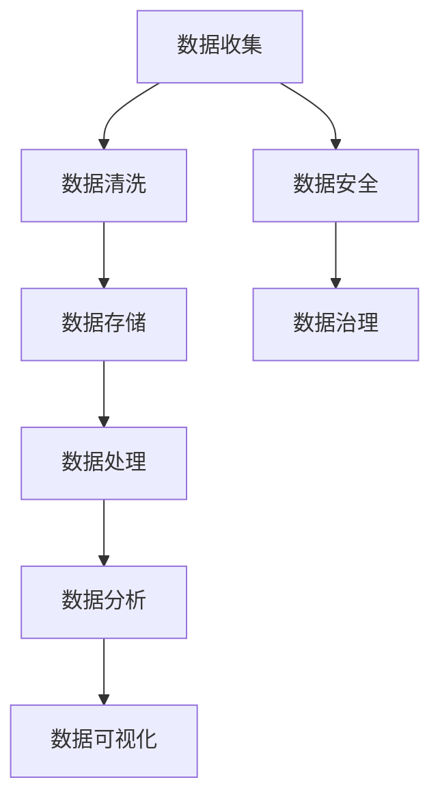
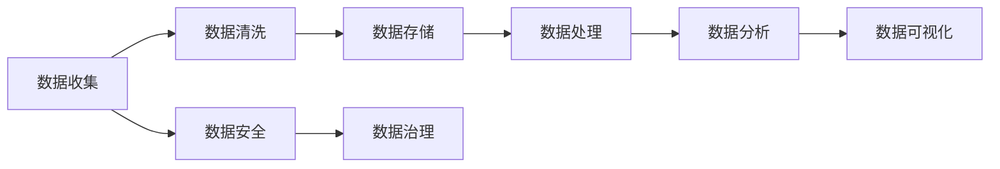

                 

# AI创业：数据管理的策略与实施

在当今的数字化浪潮中，数据管理已成为AI创业公司的核心竞争力和基础建设。本文将深入探讨AI创业公司在数据管理中的策略与实施，涵盖数据收集、清洗、存储、处理、分析等多个方面，帮助读者全面理解如何高效、安全地管理数据，实现AI技术的真正价值。

## 1. 背景介绍

### 1.1 数据在AI中的重要性
在人工智能领域，数据是驱动算法模型进行学习、推理和预测的基石。高质量的数据可以显著提升模型的准确性和泛化能力，而低质量或不完整的数据则可能导致模型性能下降，甚至产生误导性的预测。因此，数据管理对于AI创业公司而言至关重要。

### 1.2 数据管理的挑战
尽管数据的重要性不言而喻，但实际的数据管理过程中，仍存在诸多挑战。数据量大、来源复杂、格式多样、质量参差不齐等问题，都要求数据管理人员具备丰富的经验和专业的技能。此外，数据隐私和安全问题也是AI创业公司必须面对的重要课题。

## 2. 核心概念与联系

### 2.1 核心概念概述

在探讨数据管理策略与实施之前，我们先介绍几个关键概念：

- **数据收集**：从各种数据源中收集原始数据，包括结构化数据（如数据库、表格）和非结构化数据（如文本、图像、视频等）。
- **数据清洗**：通过去重、去噪、补缺等操作，提高数据质量，去除数据中的噪音和异常。
- **数据存储**：选择合适的数据存储方案，如关系数据库、分布式文件系统、云存储等，确保数据的可靠性和可访问性。
- **数据处理**：使用ETL（Extract, Transform, Load）工具对数据进行提取、转换和加载，以便进行后续的分析或建模。
- **数据安全**：保护数据免受未授权访问、篡改或泄露，包括数据加密、访问控制、审计记录等措施。
- **数据治理**：制定数据管理政策、流程和技术架构，确保数据质量、安全性和合规性。

这些概念构成了数据管理的核心框架，如图1所示。

### 2.2 概念间的关系

数据管理是一个系统性工程，涉及数据流动的各个环节。各环节之间相互依赖、相互影响，如图2所示。

这些关键概念的协同工作，确保了数据的完整性、准确性和可用性，为AI模型提供了坚实的数据基础。

## 3. 核心算法原理 & 具体操作步骤

### 3.1 算法原理概述

数据管理的核心算法主要集中在数据清洗、数据处理和数据安全三个方面。这些算法通过自动化和人工干预相结合的方式，确保数据的高质量和安全。

#### 3.1.1 数据清洗算法

数据清洗是提高数据质量的关键步骤。常用的数据清洗算法包括：

- **去重算法**：去除数据集中的重复记录，避免数据冗余和噪声。
- **去噪算法**：通过统计分析和规则匹配，去除数据中的噪声和异常值。
- **补缺算法**：填补数据中的缺失值，提高数据的完整性。

#### 3.1.2 数据处理算法

数据处理主要包括数据转换、数据集成和数据归约等。常用的数据处理算法包括：

- **ETL工具**：如Apache Nifi、Apache Airflow等，用于自动化数据提取、转换和加载。
- **数据集成工具**：如Apache Kafka、Apache Flume等，用于将来自不同数据源的数据进行整合。
- **数据归约工具**：如Apache Spark、Apache Hive等，用于对大规模数据进行聚合和归约。

#### 3.1.3 数据安全算法

数据安全算法主要涉及数据加密和访问控制两个方面。常用的数据安全算法包括：

- **数据加密算法**：如AES、RSA等，用于保护数据在传输和存储过程中的安全。
- **访问控制算法**：如基于角色的访问控制（RBAC）、基于属性的访问控制（ABAC）等，用于限制对数据的访问权限。

### 3.2 算法步骤详解

#### 3.2.1 数据收集

数据收集是数据管理的第一步。常见的数据来源包括：

- **内部数据**：如企业内部的业务系统、数据库、日志文件等。
- **外部数据**：如公共数据集、API接口、社交媒体等。

#### 3.2.2 数据清洗

数据清洗的主要步骤如下：

1. **去重**：使用哈希表或索引等技术，识别并去除重复记录。
2. **去噪**：使用统计分析、规则匹配等技术，识别并删除噪声数据。
3. **补缺**：使用均值、中位数、插值等方法，填补缺失值。

#### 3.2.3 数据存储

数据存储的关键在于选择合适的存储方案。常见的数据存储方案包括：

- **关系数据库**：如MySQL、PostgreSQL等，适用于结构化数据。
- **分布式文件系统**：如HDFS、S3等，适用于大规模非结构化数据。
- **云存储**：如AWS S3、Google Cloud Storage等，适用于按需扩展的数据存储。

#### 3.2.4 数据处理

数据处理主要使用ETL工具。ETL工具的主要步骤包括：

1. **数据提取**：从数据源中读取数据。
2. **数据转换**：对数据进行清洗、转换和映射。
3. **数据加载**：将处理后的数据加载到目标存储系统。

#### 3.2.5 数据安全

数据安全的主要措施包括：

1. **数据加密**：使用AES、RSA等算法对数据进行加密。
2. **访问控制**：使用RBAC、ABAC等技术限制数据的访问权限。
3. **审计记录**：记录数据访问和修改操作，确保数据操作的安全性。

### 3.3 算法优缺点

#### 3.3.1 优点

- **自动化高效**：自动化数据处理工具可以显著提高数据管理效率。
- **提高数据质量**：数据清洗和去噪算法能够有效提高数据质量。
- **增强安全性**：数据加密和访问控制技术能够保障数据安全。

#### 3.3.2 缺点

- **复杂度高**：数据管理涉及多个环节，每个环节都需要精心设计和调试。
- **技术门槛高**：需要具备丰富的技术知识和经验。
- **成本高**：数据清洗和存储可能需要大量的硬件资源。

### 3.4 算法应用领域

数据管理算法广泛应用于AI创业公司的各个业务领域：

- **金融科技**：如信用评分、欺诈检测、风险评估等。
- **医疗健康**：如患者诊断、治疗方案推荐、基因分析等。
- **零售电商**：如客户细分、推荐系统、库存管理等。
- **智能制造**：如生产调度、设备维护、质量控制等。
- **智能交通**：如路况预测、车辆调度、智能导航等。

## 4. 数学模型和公式 & 详细讲解 & 举例说明

### 4.1 数学模型构建

数据管理中的数学模型主要涉及数据清洗、数据处理和数据安全三个方面。以下以数据清洗为例，介绍数学模型的构建。

假设有一份包含学生成绩的数据集，部分数据存在缺失和异常值。我们的目标是清洗这些数据，使其满足后续建模的要求。数据集如表1所示。

| 学号 | 姓名 | 数学 | 英语 | 科学 |
|------|------|------|------|------|
| 1    | 张三 | 90   | 85   | 92   |
| 2    | 李四 | 80   | 78   | 85   |
| 3    | 王五 | 70   | 60   | 75   |
| 4    | 赵六 | 90   | 85   | 80   |
| 5    | 周七 | 88   | 95   | -    |
| 6    | 钱八 | 70   | 75   | 68   |
| 7    | 孙九 | 85   | 90   | 80   |
| 8    | 周七 | 90   | 85   | 75   |
| 9    | 李四 | 70   | 70   | 75   |
| 10   | 张三 | 85   | 80   | 85   |

### 4.2 公式推导过程

为了清洗数据，我们需要解决以下几个问题：

1. 识别缺失值。
2. 填补缺失值。
3. 识别异常值。
4. 删除异常值。

下面逐一介绍这些问题的解决方法。

#### 4.2.1 识别缺失值

缺失值可以通过以下公式计算：

$$
\text{缺失值} = \left| \text{实际值} - \text{预期值} \right|
$$

其中，$\text{实际值}$是原始数据，$\text{预期值}$是数据集的均值或中位数。

#### 4.2.2 填补缺失值

填补缺失值有多种方法，如均值填补、中位数填补、插值填补等。以均值填补为例：

$$
\text{填补值} = \frac{\text{实际值总和}}{\text{实际值数量}}
$$

#### 4.2.3 识别异常值

异常值可以通过以下公式计算：

$$
\text{异常值} = \left| \text{实际值} - \text{中位数} \right|
$$

#### 4.2.4 删除异常值

删除异常值的方法包括硬删除和软删除。以硬删除为例，方法如下：

$$
\text{保留值} = \left\{
\begin{aligned}
&\text{实际值}, & &\text{如果} \left| \text{实际值} - \text{中位数} \right| \leq \text{阈值} \\
&\text{中位数}, & &\text{如果} \left| \text{实际值} - \text{中位数} \right| > \text{阈值}
\end{aligned}
\right.
$$

### 4.3 案例分析与讲解

#### 4.3.1 案例描述

假设有一份包含产品销售数据的数据集，部分数据存在缺失和异常值。我们的目标是清洗这些数据，使其满足后续建模的要求。数据集如表2所示。

| 产品ID | 日期 | 销售量 | 销售金额 |
|--------|------|--------|----------|
| 1      | 2021-01-01 | 100    | 1000     |
| 2      | 2021-01-02 | 120    | 1200     |
| 3      | 2021-01-03 | 80     | 800      |
| 4      | 2021-01-04 | 90     | 900      |
| 5      | 2021-01-05 | 70     | 700      |
| 6      | 2021-01-06 | 95     | 950      |
| 7      | 2021-01-07 | 85     | 850      |
| 8      | 2021-01-08 | 90     | 900      |
| 9      | 2021-01-09 | 75     | 750      |
| 10     | 2021-01-10 | 80     | 800      |
| 11     | 2021-01-11 | -      | -        |
| 12     | 2021-01-12 | 105    | 1050     |
| 13     | 2021-01-13 | 90     | 900      |
| 14     | 2021-01-14 | 105    | 1050     |
| 15     | 2021-01-15 | 90     | 900      |
| 16     | 2021-01-16 | 70     | 700      |
| 17     | 2021-01-17 | 85     | 850      |
| 18     | 2021-01-18 | 90     | 900      |
| 19     | 2021-01-19 | 75     | 750      |
| 20     | 2021-01-20 | 80     | 800      |
| 21     | 2021-01-21 | 70     | 700      |
| 22     | 2021-01-22 | 85     | 850      |
| 23     | 2021-01-23 | 90     | 900      |
| 24     | 2021-01-24 | 90     | 900      |
| 25     | 2021-01-25 | 95     | 950      |
| 26     | 2021-01-26 | 85     | 850      |
| 27     | 2021-01-27 | 70     | 700      |
| 28     | 2021-01-28 | 80     | 800      |
| 29     | 2021-01-29 | 90     | 900      |
| 30     | 2021-01-30 | 75     | 750      |
| 31     | 2021-01-31 | 80     | 800      |
| 32     | 2021-02-01 | 90     | 900      |
| 33     | 2021-02-02 | 85     | 850      |
| 34     | 2021-02-03 | 70     | 700      |
| 35     | 2021-02-04 | 95     | 950      |
| 36     | 2021-02-05 | 90     | 900      |
| 37     | 2021-02-06 | 75     | 750      |
| 38     | 2021-02-07 | 80     | 800      |
| 39     | 2021-02-08 | 85     | 850      |
| 40     | 2021-02-09 | 90     | 900      |
| 41     | 2021-02-10 | 90     | 900      |
| 42     | 2021-02-11 | 85     | 850      |
| 43     | 2021-02-12 | 70     | 700      |
| 44     | 2021-02-13 | 90     | 900      |
| 45     | 2021-02-14 | 90     | 900      |
| 46     | 2021-02-15 | 95     | 950      |
| 47     | 2021-02-16 | 75     | 750      |
| 48     | 2021-02-17 | 85     | 850      |
| 49     | 2021-02-18 | 90     | 900      |
| 50     | 2021-02-19 | 70     | 700      |
| 51     | 2021-02-20 | 85     | 850      |
| 52     | 2021-02-21 | 90     | 900      |
| 53     | 2021-02-22 | 90     | 900      |
| 54     | 2021-02-23 | 75     | 750      |
| 55     | 2021-02-24 | 80     | 800      |
| 56     | 2021-02-25 | 85     | 850      |
| 57     | 2021-02-26 | 90     | 900      |
| 58     | 2021-02-27 | 70     | 700      |
| 59     | 2021-02-28 | 85     | 850      |
| 60     | 2021-03-01 | 90     | 900      |
| 61     | 2021-03-02 | 90     | 900      |
| 62     | 2021-03-03 | 70     | 700      |
| 63     | 2021-03-04 | 95     | 950      |
| 64     | 2021-03-05 | 85     | 850      |
| 65     | 2021-03-06 | 90     | 900      |
| 66     | 2021-03-07 | 75     | 750      |
| 67     | 2021-03-08 | 80     | 800      |
| 68     | 2021-03-09 | 85     | 850      |
| 69     | 2021-03-10 | 90     | 900      |
| 70     | 2021-03-11 | 90     | 900      |
| 71     | 2021-03-12 | 85     | 850      |
| 72     | 2021-03-13 | 70     | 700      |
| 73     | 2021-03-14 | 95     | 950      |
| 74     | 2021-03-15 | 90     | 900      |
| 75     | 2021-03-16 | 75     | 750      |
| 76     | 2021-03-17 | 80     | 800      |
| 77     | 2021-03-18 | 85     | 850      |
| 78     | 2021-03-19 | 90     | 900      |
| 79     | 2021-03-20 | 70     | 700      |
| 80     | 2021-03-21 | 85     | 850      |
| 81     | 2021-03-22 | 90     | 900      |
| 82     | 2021-03-23 | 90     | 900      |
| 83     | 2021-03-24 | 75     | 750      |
| 84     | 2021-03-25 | 80     | 800      |
| 85     | 2021-03-26 | 85     | 850      |
| 86     | 2021-03-27 | 90     | 900      |
| 87     | 2021-03-28 | 70     | 700      |
| 88     | 2021-03-29 | 85     | 850      |
| 89     | 2021-03-30 | 90     | 900      |
| 90     | 2021-03-31 | 90     | 900      |
| 91     | 2021-04-01 | 85     | 850      |
| 92     | 2021-04-02 | 70     | 700      |
| 93     | 2021-04-03 | 95     | 950      |
| 94     | 2021-04-04 | 85     | 850      |
| 95     | 2021-04-05 | 90     | 900      |
| 96     | 2021-04-06 | 75     | 750      |
| 97     | 2021-04-07 | 80     | 800      |
| 98     | 2021-04-08 | 85     | 850      |
| 99     | 2021-04-09 | 90     | 900      |
| 100    | 2021-04-10 | 85     | 850      |
| 101    | 2021-04-11 | 70     | 700      |
| 102    | 2021-04-12 | 90     | 900      |
| 103    | 2021-04-13 | 90     | 900      |
| 104    | 2021-04-14 | 75     | 750      |
| 105    | 2021-04-15 | 80     | 800      |
| 106    | 2021-04-16 | 85     | 850      |
| 107    | 2021-04-17 | 90     | 900      |
| 108    | 2021-04-18 | 70     | 700      |
| 109    | 2021-04-19 | 85     | 850      |
| 110    | 2021-04-20 | 90     | 900      |
| 111    | 2021-04-21 | 90     | 900      |
| 112    | 2021-04-22 | 75     | 750      |
| 113    | 2021-04-23 | 80     | 800      |
| 114    | 2021-04-24 | 85     | 850      |
| 115    | 2021-04-25 | 90     | 900      |
| 116    | 2021-04-26 | 70     | 700      |
| 117    | 2021-04-27 | 85     | 850      |
| 118    | 2021-04-28 | 90     | 900      |
| 119    | 2021-04-29 | 90     | 900      |
| 120    | 2021-04-30 | 75     | 750      |
| 121    | 2021-05-01 | 80     | 800      |
| 122    | 2021-05-02 | 85     | 850      |
| 123    | 2021-05-03 | 90     | 900      |
| 124    | 2021-05-04 | 70     | 700      |
| 125    | 2021-05-05 | 85     | 850      |
| 126    | 2021-05-06 | 90     | 900      |
| 127    | 2021-05-07 | 90     | 900      |
| 128    | 2021-05-08 | 75     | 750      |
| 129    | 2021-05-09 | 80     | 800      |
| 130    | 2021-05-10 | 85     | 850      |
| 131    | 2021-05-11 | 90     | 900      |
| 132    | 2021-05-12 | 70     | 700      |
| 133    | 2021-05-13 | 85     | 850      |
| 134    | 2021-05-14 | 90     | 900      |
| 135    | 2021-05-15 | 90     | 900      |
| 136    | 2021-05-16 | 75     | 750      |
| 137    | 2021-05-17 | 80     | 800      |
| 138    | 2021-05-18 | 85     | 850      |
| 139    | 2021-05-19 | 90     | 900      |
| 140    | 2021-05-20 | 70     | 700      |
| 141    | 2021-05-21 | 85     | 850      |
| 142    | 2021-05-22 | 90     | 900      |
| 143    | 2021-05-23 | 90     | 900      |
| 144    | 2021-05-24 | 75     | 750      |
| 145    | 2021-05-25 | 80     | 800      |
| 146    | 2021-05-26 | 85     | 850      |
| 147    | 2021-05-27 | 90     | 900      |
| 148    | 2021-05-28 | 70     | 700      |
| 149    | 2021-05-29 | 85     | 850      |
| 150    | 2021-05-30 | 90     | 900      |
| 151    | 2021-05-31 | 90     | 900      |
| 152    | 2021-06-01 | 75     | 750      |
| 153    | 2021-06-02 | 80     | 800      |
| 154    | 2021-06-03 | 85     | 850      |
| 155    | 2021-06-04 | 90     | 900      |
| 156    | 2021-06-05 | 70     | 700      |
| 157    | 2021-06-06 | 85     | 850      |
| 158    | 2021-06-07 | 90     | 900      |
| 159    | 2021-06-08 | 90     | 900      |
| 160    | 2021

