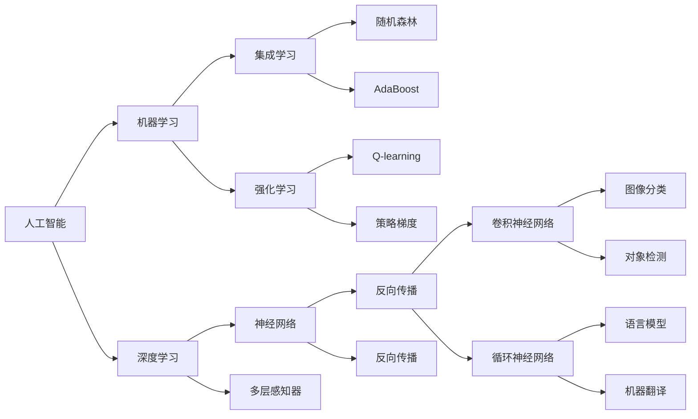
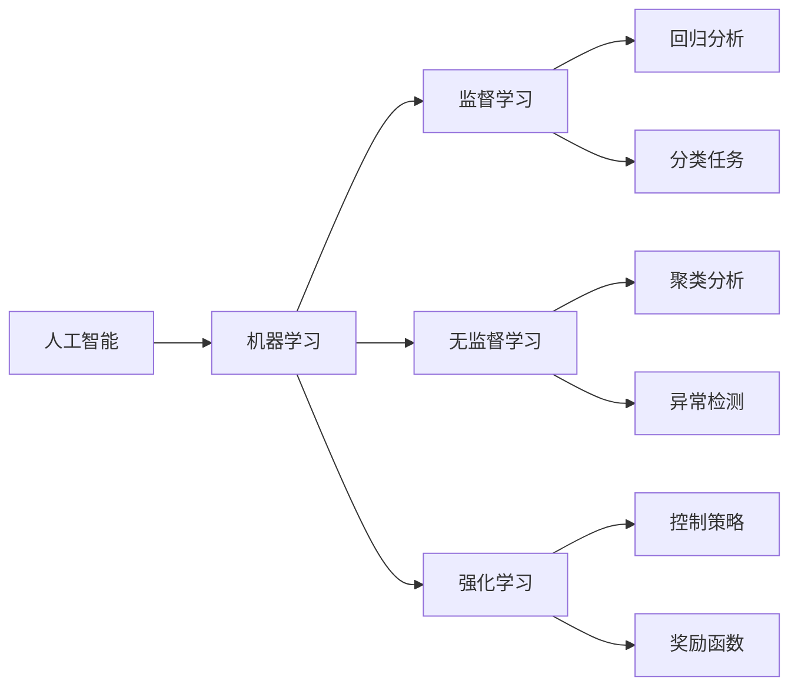
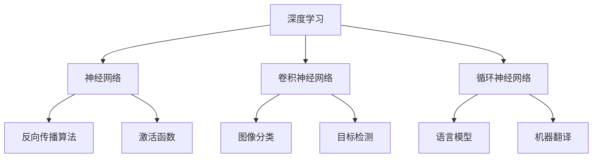
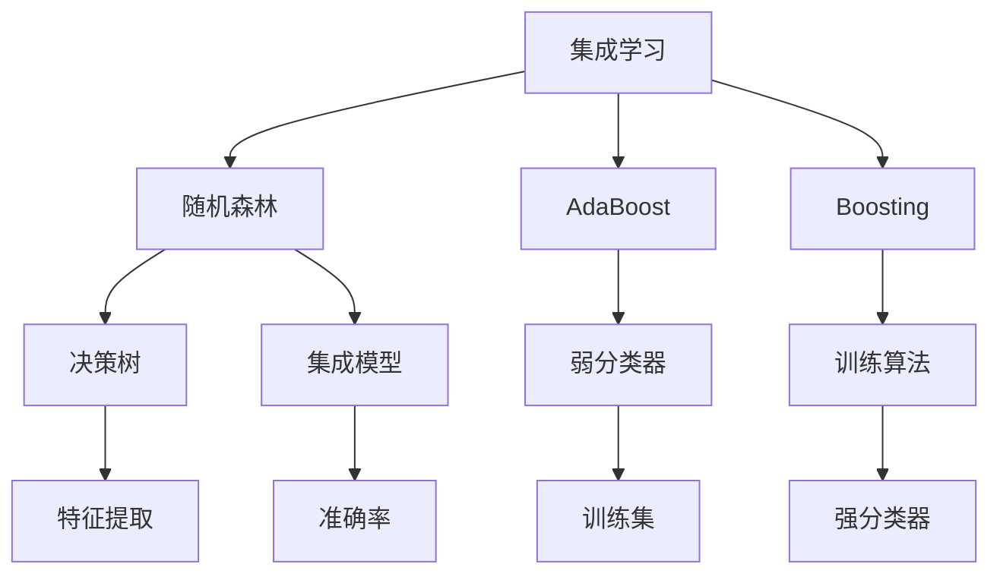

                 

# AI发展历程中的关键人物与技术

## 1. 背景介绍

### 1.1 问题由来
人工智能（AI）是一门涉及计算机科学、数学、神经科学和认知科学的综合性学科。自20世纪50年代诞生以来，AI已经走过了一段曲折而辉煌的发展历程。其间，出现了众多里程碑式的人物和关键技术，这些技术和人才为AI的繁荣和发展奠定了坚实的基础。

### 1.2 问题核心关键点
AI发展中的关键人物和技术主要有以下几点：

- **图灵机**：由阿兰·图灵提出，标志着现代计算理论的起点。
- **神经网络**：由冯·诺依曼、麦卡锡等人发展，奠定了神经计算的基础。
- **符号主义**：代表人物包括纽厄尔、西蒙等，强调用符号逻辑描述知识。
- **知识工程**：代表人物包括费根鲍姆、米勒等，致力于构建知识库和推理系统。
- **专家系统**：由米切尔、纽厄尔等人开创，代表成功应用如MYCIN和DENDRAL。
- **深度学习**：由冯·荷莫、何华武等推动，霍普菲尔德神经网络和多层感知器是早期代表性成果。
- **集成学习**：博斯、弗莱克斯曼等人的研究，集成多个分类器提高预测准确率。
- **强化学习**：由尼克尔森、拉塞尔等发展，代表算法如Q-learning和策略梯度。
- **机器学习**：由辛顿、罗森布拉特、奥普曼等推动，泛化能力和普适性不断增强。
- **计算机视觉**：由标放次、拉帕波特等人开创，推动图像处理技术的发展。
- **自然语言处理**：由马尔库斯、约翰逊等人开创，文本处理和语义理解能力不断提升。
- **语音识别**：由科斯特罗、威伦斯等人推动，推动了语音交互技术的发展。

## 2. 核心概念与联系

### 2.1 核心概念概述

为更好地理解AI发展中的关键人物和技术，本节将介绍几个密切相关的核心概念：

- **人工智能**：通过模拟人类智能行为，实现问题解决和知识推理的计算机系统。
- **机器学习**：使计算机通过数据训练自动提高性能的技术。
- **深度学习**：一种特殊形式的机器学习，主要使用多层神经网络模拟人类神经系统。
- **集成学习**：通过组合多个分类器，提高整体预测准确率。
- **强化学习**：通过与环境的交互，使智能体学习最优策略。
- **计算机视觉**：使计算机能够“看”，进行图像处理和识别。
- **自然语言处理**：使计算机能够“听”和“说”，进行文本分析和生成。
- **语音识别**：使计算机能够理解和生成语音信号。

这些核心概念之间的逻辑关系可以通过以下Mermaid流程图来展示：

这个流程图展示了几大核心概念的相互关系：

1. 人工智能以机器学习为基础。
2. 深度学习是机器学习的一种特殊形式。
3. 集成学习和强化学习是机器学习的变种。
4. 神经网络和多层感知器是深度学习的基础。
5. 卷积神经网络和循环神经网络是深度学习的常见架构。
6. 图像分类和对象检测是计算机视觉的应用。
7. 语言模型和机器翻译是自然语言处理的应用。
8. Q-learning和策略梯度是强化学习中的代表性算法。

这些核心概念共同构成了AI的发展框架，为其技术的进步提供了基础。

### 2.2 概念间的关系

这些核心概念之间存在着紧密的联系，形成了AI技术的完整生态系统。下面我们通过几个Mermaid流程图来展示这些概念之间的关系。

#### 2.2.1 人工智能的应用层次

这个流程图展示了人工智能的层次结构，包括监督学习、无监督学习和强化学习三种主流学习方法，及其在不同领域中的应用。

#### 2.2.2 深度学习与神经网络的关系

这个流程图展示了深度学习与神经网络之间的关系。深度学习主要是通过卷积神经网络和循环神经网络等架构，应用反向传播算法进行训练。

#### 2.2.3 集成学习的应用场景

这个流程图展示了集成学习的应用场景。集成学习通过组合多个弱分类器，提高整体预测准确率，其中随机森林和AdaBoost是典型的集成算法。

## 3. 核心算法原理 & 具体操作步骤

### 3.1 算法原理概述

AI中的核心算法包括机器学习、深度学习、集成学习、强化学习和神经网络等。以下简要介绍这些算法的原理。

#### 3.1.1 机器学习

机器学习是一种使计算机通过数据训练自动提高性能的技术。其核心思想是通过算法从数据中学习规律，并用这些规律进行预测。

**原理**：
1. 数据集划分：将数据分为训练集和测试集。
2. 特征选择：选择或生成有用的特征，降低维度。
3. 模型训练：选择合适的模型，用训练集数据进行训练。
4. 模型评估：用测试集数据评估模型性能。
5. 模型调整：通过交叉验证等方法调整模型超参数。

#### 3.1.2 深度学习

深度学习是一种特殊的机器学习方法，主要使用多层神经网络模拟人类神经系统。其核心思想是通过多层非线性变换提取数据中的特征，并应用于复杂的预测任务。

**原理**：
1. 数据预处理：归一化、标准化等处理。
2. 网络结构设计：选择或设计合适的神经网络结构。
3. 参数初始化：随机或固定初始化神经网络参数。
4. 前向传播：通过神经网络进行数据处理。
5. 反向传播：通过误差梯度计算参数更新。
6. 模型训练：通过迭代优化参数，提高模型性能。
7. 模型评估：用测试集数据评估模型性能。

#### 3.1.3 集成学习

集成学习通过组合多个分类器，提高整体预测准确率。其核心思想是将多个弱分类器组合成一个强分类器，通过投票、加权平均等方式进行综合。

**原理**：
1. 弱分类器生成：通过随机森林、AdaBoost等方法生成多个弱分类器。
2. 综合模型训练：将多个弱分类器组合成一个综合模型，用训练集数据进行训练。
3. 综合模型评估：用测试集数据评估模型性能。
4. 综合模型调整：通过交叉验证等方法调整模型超参数。

#### 3.1.4 强化学习

强化学习通过与环境的交互，使智能体学习最优策略。其核心思想是通过奖励机制引导智能体在环境中进行探索和学习，最终找到最优策略。

**原理**：
1. 环境定义：定义智能体和环境，建立状态空间、动作空间和奖励函数。
2. 策略选择：选择或设计合适的策略，如Q-learning、策略梯度等。
3. 策略优化：通过迭代优化策略，提高智能体性能。
4. 策略评估：用测试集数据评估智能体性能。
5. 策略调整：通过交叉验证等方法调整策略超参数。

#### 3.1.5 神经网络

神经网络是一种模拟人类神经系统的计算模型。其核心思想是通过多层非线性变换提取数据中的特征，并应用于复杂的预测任务。

**原理**：
1. 网络结构设计：选择或设计合适的神经网络结构，如全连接、卷积、循环神经网络等。
2. 参数初始化：随机或固定初始化神经网络参数。
3. 前向传播：通过神经网络进行数据处理。
4. 反向传播：通过误差梯度计算参数更新。
5. 模型训练：通过迭代优化参数，提高模型性能。
6. 模型评估：用测试集数据评估模型性能。

### 3.2 算法步骤详解

#### 3.2.1 机器学习步骤

1. 数据预处理：包括归一化、标准化、数据增强等步骤。
2. 特征选择：选择或生成有用的特征，降低维度。
3. 模型选择：选择或设计合适的模型，如线性回归、决策树、随机森林等。
4. 模型训练：用训练集数据进行模型训练，优化参数。
5. 模型评估：用测试集数据评估模型性能，计算指标如准确率、召回率、F1分数等。
6. 模型调整：通过交叉验证等方法调整模型超参数，如学习率、正则化系数、训练次数等。

#### 3.2.2 深度学习步骤

1. 数据预处理：包括归一化、标准化、数据增强等步骤。
2. 网络结构设计：选择或设计合适的神经网络结构，如卷积神经网络、循环神经网络等。
3. 参数初始化：随机或固定初始化神经网络参数。
4. 前向传播：通过神经网络进行数据处理。
5. 反向传播：通过误差梯度计算参数更新。
6. 模型训练：通过迭代优化参数，提高模型性能。
7. 模型评估：用测试集数据评估模型性能，计算指标如准确率、召回率、F1分数等。
8. 模型调整：通过交叉验证等方法调整模型超参数，如学习率、正则化系数、训练次数等。

#### 3.2.3 集成学习步骤

1. 弱分类器生成：通过随机森林、AdaBoost等方法生成多个弱分类器。
2. 综合模型训练：将多个弱分类器组合成一个综合模型，用训练集数据进行训练。
3. 综合模型评估：用测试集数据评估模型性能，计算指标如准确率、召回率、F1分数等。
4. 综合模型调整：通过交叉验证等方法调整模型超参数，如决策树深度、弱分类器数量等。

#### 3.2.4 强化学习步骤

1. 环境定义：定义智能体和环境，建立状态空间、动作空间和奖励函数。
2. 策略选择：选择或设计合适的策略，如Q-learning、策略梯度等。
3. 策略优化：通过迭代优化策略，提高智能体性能。
4. 策略评估：用测试集数据评估智能体性能，计算指标如奖励、损失等。
5. 策略调整：通过交叉验证等方法调整策略超参数，如学习率、网络结构、奖励系数等。

#### 3.2.5 神经网络步骤

1. 网络结构设计：选择或设计合适的神经网络结构，如全连接、卷积、循环神经网络等。
2. 参数初始化：随机或固定初始化神经网络参数。
3. 前向传播：通过神经网络进行数据处理。
4. 反向传播：通过误差梯度计算参数更新。
5. 模型训练：通过迭代优化参数，提高模型性能。
6. 模型评估：用测试集数据评估模型性能，计算指标如准确率、召回率、F1分数等。
7. 模型调整：通过交叉验证等方法调整模型超参数，如学习率、正则化系数、训练次数等。

### 3.3 算法优缺点

#### 3.3.1 机器学习

**优点**：
1. 可解释性强：模型结构简单，易于理解和解释。
2. 鲁棒性高：对异常数据和噪声有较好的鲁棒性。
3. 适用面广：可以应用于各种数据类型和问题。

**缺点**：
1. 数据依赖性强：需要大量标注数据进行训练。
2. 模型泛化能力有限：可能出现过拟合问题。
3. 计算成本高：复杂模型训练时间长，计算资源需求大。

#### 3.3.2 深度学习

**优点**：
1. 模型能力强：可以处理复杂的非线性关系。
2. 特征提取能力强：能够自动学习数据的特征表示。
3. 应用广泛：适用于各种数据类型和问题，如图像识别、语音识别、自然语言处理等。

**缺点**：
1. 数据依赖性强：需要大量标注数据进行训练。
2. 计算成本高：复杂模型训练时间长，计算资源需求大。
3. 可解释性差：模型结构复杂，难以理解内部工作机制。

#### 3.3.3 集成学习

**优点**：
1. 鲁棒性强：通过组合多个弱分类器，提高整体性能。
2. 泛化能力强：能够处理多种数据类型和问题。
3. 计算成本低：单个分类器计算资源需求小。

**缺点**：
1. 模型复杂：需要设计和训练多个分类器。
2. 数据依赖性强：需要大量标注数据进行训练。
3. 过拟合风险高：多个分类器可能互相影响，出现过拟合。

#### 3.3.4 强化学习

**优点**：
1. 鲁棒性强：通过与环境的交互，学习最优策略。
2. 适应性强：能够处理多种数据类型和问题。
3. 数据依赖性弱：不需要大量标注数据。

**缺点**：
1. 计算成本高：训练时间长，计算资源需求大。
2. 可解释性差：难以理解智能体决策过程。
3. 环境依赖性强：环境设计复杂，需精心设计。

#### 3.3.5 神经网络

**优点**：
1. 模型能力强：可以处理复杂的非线性关系。
2. 特征提取能力强：能够自动学习数据的特征表示。
3. 应用广泛：适用于各种数据类型和问题，如图像识别、语音识别、自然语言处理等。

**缺点**：
1. 数据依赖性强：需要大量标注数据进行训练。
2. 计算成本高：复杂模型训练时间长，计算资源需求大。
3. 可解释性差：模型结构复杂，难以理解内部工作机制。

### 3.4 算法应用领域

#### 3.4.1 机器学习

1. 回归分析：如房价预测、股票价格预测等。
2. 分类任务：如垃圾邮件过滤、手写数字识别等。
3. 聚类分析：如客户分群、文档分类等。
4. 异常检测：如网络入侵检测、异常交易检测等。

#### 3.4.2 深度学习

1. 图像识别：如人脸识别、图像分类等。
2. 语音识别：如语音转文字、语音命令等。
3. 自然语言处理：如机器翻译、情感分析等。
4. 时间序列预测：如股票价格预测、天气预测等。

#### 3.4.3 集成学习

1. 决策支持系统：如医疗诊断、金融投资等。
2. 风险管理：如信用评估、贷款审批等。
3. 推荐系统：如电商推荐、新闻推荐等。
4. 模式识别：如物体检测、图像分割等。

#### 3.4.4 强化学习

1. 机器人控制：如路径规划、运动控制等。
2. 游戏AI：如围棋、象棋等。
3. 自动驾驶：如交通控制、避障等。
4. 优化问题：如供应链管理、生产调度等。

#### 3.4.5 神经网络

1. 图像识别：如人脸识别、图像分类等。
2. 语音识别：如语音转文字、语音命令等。
3. 自然语言处理：如机器翻译、情感分析等。
4. 时间序列预测：如股票价格预测、天气预测等。

## 4. 数学模型和公式 & 详细讲解 & 举例说明

### 4.1 数学模型构建

本节将使用数学语言对AI发展中的关键算法进行更加严格的刻画。

#### 4.1.1 机器学习数学模型

假设训练集为 $D=\{(x_i, y_i)\}_{i=1}^N$，其中 $x_i$ 为输入，$y_i$ 为标签。机器学习模型的目标是最小化预测误差：

$$
\hat{y}=f(x;w) \quad \text{最小化} \quad L(w)=\frac{1}{N}\sum_{i=1}^N L(f(x_i;w), y_i)
$$

其中 $f(x;w)$ 为模型预测函数，$w$ 为模型参数。

#### 4.1.2 深度学习数学模型

深度学习模型的目标是通过反向传播算法最小化损失函数：

$$
\hat{y}=g_\theta(z;w) \quad \text{最小化} \quad L(\theta)=\frac{1}{N}\sum_{i=1}^N L(g_\theta(z_i;w), y_i)
$$

其中 $g_\theta(z;w)$ 为模型预测函数，$\theta$ 为模型参数，$z$ 为输入数据经过编码后的表示。

#### 4.1.3 集成学习数学模型

集成学习通过组合多个分类器，最小化整体损失函数：

$$
\hat{y}=\frac{1}{M}\sum_{m=1}^M f_m(x;w_m) \quad \text{最小化} \quad L(w_1,...,w_M)=\frac{1}{N}\sum_{i=1}^N L\left(\frac{1}{M}\sum_{m=1}^M f_m(x_i;w_m), y_i\right)
$$

其中 $f_m(x;w_m)$ 为第 $m$ 个弱分类器，$w_m$ 为第 $m$ 个分类器参数，$M$ 为弱分类器数量。

#### 4.1.4 强化学习数学模型

强化学习通过最大化累积奖励，最小化损失函数：

$$
\max_{\pi} \sum_{t=0}^T \gamma^t r_t \quad \text{最小化} \quad L(\pi)=\frac{1}{N}\sum_{i=1}^N L(r_i, y_i)
$$

其中 $\pi$ 为智能体策略，$r_t$ 为智能体在时刻 $t$ 的奖励，$T$ 为环境终止时刻，$L(\pi)$ 为策略损失函数。

#### 4.1.5 神经网络数学模型

神经网络通过多层非线性变换，最小化损失函数：

$$
\hat{y}=g_\theta(z;w) \quad \text{最小化} \quad L(\theta)=\frac{1}{N}\sum_{i=1}^N L(g_\theta(z_i;w), y_i)
$$

其中 $g_\theta(z;w)$ 为模型预测函数，$\theta$ 为模型参数，$z$ 为输入数据经过编码后的表示。

### 4.2 公式推导过程

#### 4.2.1 机器学习公式推导

机器学习的经典算法如线性回归、逻辑回归、决策树等，其公式推导过程如下：

- 线性回归：
  $$
  y=\hat{y}=\theta_0+\sum_{i=1}^n \theta_i x_i \quad \text{最小化} \quad L(\theta)=\frac{1}{N}\sum_{i=1}^N (y_i-\hat{y}_i)^2
  $$

- 逻辑回归：
  $$
  y=\hat{y}=\sigma(\theta_0+\sum_{i=1}^n \theta_i x_i) \quad \text{最小化} \quad L(\theta)=\frac{1}{N}\sum_{i=1}^N \log(1+\exp(-y_i\hat{y}_i))
  $$

- 决策树：
  $$
  y=\hat{y}=f(x;w) \quad \text{最小化} \quad L(w)=\frac{1}{N}\sum_{i=1}^N \log(1+\exp(-y_i\hat{y}_i))
  $$

#### 4.2.2 深度学习公式推导

深度学习模型的公式推导过程如下：

- 卷积神经网络：
  $$
  z=f_\theta(x) \quad \text{最小化} \quad L(\theta)=\frac{1}{N}\sum_{i=1}^N \log(1+\exp(-y_i\hat{y}_i))
  $$

- 循环神经网络：
  $$
  z=f_\theta(x) \quad \text{最小化} \quad L(\theta)=\frac{1}{N}\sum_{i=1}^N \log(1+\exp(-y_i\hat{y}_i))
  $$

#### 4.2.3 集成学习公式推导

集成学习的经典算法如随机森林、AdaBoost等，其公式推导过程如下：

- 随机森林：
  $$
  y=\hat{y}=\frac{1}{M}\sum_{m=1}^M f_m(x;w_m) \quad \text{最小化} \quad L(w_1,...,w_M)=\frac{1}{N}\sum_{i=1}^N \log(1+\exp(-y_i\hat{y}_i))
  $$

- AdaBoost：
  $$
  y=\hat{y}=\frac{1}{M}\sum_{m=1}^M f_m(x;w_m) \quad \text{最小化} \quad L(w_1,...,w_M)=\frac{1}{N}\sum_{i=1}^N \log(1+\exp(-y_i\hat{y}_i))
  $$

#### 4.2.4 强化学习公式推导

强化学习的经典算法如Q-learning、策略梯度等，其公式推导过程如下：

- Q-learning：
  $$
  Q(s,a)=\max_\pi Q_\pi(s,a) \quad \text{最小化} \quad L(Q)=\frac{1}{N}\sum_{i=1}^N (r_i+\gamma \max_a Q(s_i,a)-Q(s_i,a))
  $$

- 策略梯度：
  $$
  Q(s,a)=\max_\pi Q_\pi(s,a) \quad \text{最小化} \quad L(Q)=\frac{1}{N}\sum_{i=1}^N (r_i+\gamma \max_a Q(s_i,a)-Q(s_i,a))
  $$

#### 4.2.5 神经网络公式推导

神经网络模型的公式推导过程如下：

- 多层感知器：
  $$
  z=f_\theta(x) \quad \text{最小化} \quad L(\theta)=\frac{1}{N}\sum_{i=1}^N \log(1+\exp(-y_i\hat{y}_i))
  $$

### 4.3 案例分析与讲解

#### 4.3.1 线性回归案例

假设有一组数据 $(x_i,y_i)$，其中 $x_i$ 为房价，$y_i$ 为销售价格。通过线性回归模型进行预测，公式如下：

$$
y=\hat{y}=w_0+w_1x \quad \text{最小化} \quad L(w_0,w_1)=\frac{1}{N}\sum_{i=1}^N (y_i-\hat{y}_i)^2
$$

其中 $w_0$ 为截距，$w_1$ 为斜率。

#### 4.3.2 深度学习案例

假设有一组图像数据 $(x_i,y_i)$，其中 $x_i$ 为图像像素，$y_i$ 为图像分类标签。通过卷积神经网络进行分类，公式如下：

$$
z=f_\theta(x) \quad \text{最小化} \quad L(\theta)=\frac{1}{N}\sum_{i=1}^N \log(1+\exp(-y_i\hat{y}_i))
$$

