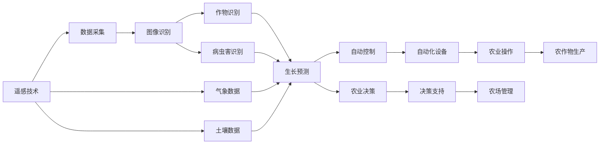
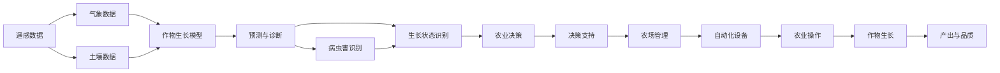

                 

# AI在农业中的应用:精准农业的新时代

> 关键词：人工智能,精准农业,遥感技术,机器学习,作物生长模型,自动化农业设备,农业决策支持系统,未来展望

## 1. 背景介绍

### 1.1 问题由来

农业作为国民经济的基础，其生产效率和资源利用效率直接关系到粮食安全和社会稳定。然而，传统农业面临诸多挑战：资源浪费严重，病虫害频发，农业生产对环境影响大，农业决策基于经验而非数据，精度和效率低下。

人工智能(AI)技术的崛起为传统农业的转型升级提供了新契机。通过将AI技术融入农业生产、管理、决策各个环节，实现精准农业(Precision Agriculture)，农业生产将由经验决策转向数据驱动，大幅提升生产效率和资源利用率。

### 1.2 问题核心关键点

精准农业的核心在于通过AI技术，将大量农业数据转化为可操作的智能决策。具体关键点包括：

- **数据采集与处理**：利用传感器、遥感、无人机等技术采集农业生产环境数据。
- **作物识别与监测**：通过图像识别、机器学习等技术，实时监测作物生长状态，识别病虫害。
- **预测与诊断**：基于历史数据和实时监测数据，利用AI模型预测作物生长情况，提前诊断病虫害。
- **自动化农业设备**：集成AI决策系统，通过自动化设备实施精确施肥、灌溉、喷洒等农业操作。
- **农业决策支持系统**：提供全方位的AI决策支持，辅助农民进行农事管理，提升农业生产效率。

### 1.3 问题研究意义

AI在农业中的应用，不仅能够大幅提升农业生产效率和资源利用率，还能有效应对气候变化、环境污染等挑战，实现可持续农业发展。具体意义包括：

- **提升农业生产效率**：通过数据驱动决策，提高生产精准度和资源利用率。
- **保障食品安全**：精确控制农药、化肥等投入，减少环境污染，提高农产品安全性。
- **推动农业现代化**：将传统农业向智能化、自动化、高效化转型，促进农业产业升级。
- **促进农村振兴**：借助AI技术，提高农业生产水平，带动农村经济发展。
- **实现可持续发展**：通过精准管理，优化资源配置，实现农业生产的绿色可持续发展。

## 2. 核心概念与联系

### 2.1 核心概念概述

为更好地理解AI在农业中的应用，本节将介绍几个密切相关的核心概念：

- **精准农业**：利用AI和物联网技术，对农业生产进行精确管理和决策，以提高生产效率和资源利用率。
- **遥感技术**：利用卫星、无人机等平台，获取农业生产环境的高分辨率图像和光谱数据。
- **机器学习**：通过训练模型，使机器能够从大量数据中学习规律，进行预测、分类、识别等任务。
- **作物生长模型**：基于作物生理和环境因素的模型，用于预测作物生长状态和产量。
- **自动化农业设备**：集成AI决策系统的农业设备，自动执行精确施肥、灌溉、喷洒等农业操作。
- **农业决策支持系统**：基于AI技术的决策支持系统，辅助农民进行农事管理，优化农业生产。

### 2.2 概念间的关系

这些核心概念之间存在着紧密的联系，构成了精准农业的整体框架。下面通过几个Mermaid流程图来展示这些概念之间的关系：



这个流程图展示了从遥感数据采集到最终农业操作的整个流程：

1. 利用遥感技术获取高分辨率图像和光谱数据。
2. 通过图像识别技术，自动识别和监测作物生长状态和病虫害。
3. 利用生长模型，预测作物生长情况和产量。
4. 自动化设备根据AI决策，自动执行精确施肥、灌溉、喷洒等操作。
5. 通过农业决策支持系统，辅助农民进行农事管理，提升生产效率。

### 2.3 核心概念的整体架构

最后，我们用一个综合的流程图来展示这些核心概念在大农业中的整体架构：



这个综合流程图展示了从数据采集到作物生长管理的完整过程：

1. 获取遥感数据、气象数据和土壤数据。
2. 基于这些数据，利用作物生长模型进行生长预测和病虫害诊断。
3. 结合预测和诊断结果，通过农业决策支持系统辅助农场管理。
4. 自动化设备根据决策结果执行精确农业操作。
5. 最终实现高品质的作物生长和产出。

## 3. 核心算法原理 & 具体操作步骤
### 3.1 算法原理概述

AI在农业中的应用主要基于数据驱动的决策支持，涉及大量数据的采集、处理、分析和应用。核心算法包括：

- **图像识别**：利用深度学习模型，对遥感图像进行作物、病虫害等识别。
- **生长预测**：基于历史数据和实时监测数据，利用机器学习模型预测作物生长情况。
- **自动控制**：通过AI决策系统，自动控制农业设备执行精确农业操作。
- **农业决策支持**：结合实时监测数据和历史数据，提供全方位的农业决策支持。

这些算法共同构成了精准农业的技术基础，使其能够实现高效、精准的农业生产。

### 3.2 算法步骤详解

具体而言，精准农业的实施步骤如下：

1. **数据采集**：利用传感器、无人机等设备，采集农业生产环境的高分辨率图像和光谱数据，包括气象数据、土壤数据等。
2. **数据预处理**：对采集到的数据进行清洗、标准化等预处理，使其适合后续分析和应用。
3. **图像识别**：通过深度学习模型，对遥感图像进行作物、病虫害等识别，获取作物生长状态和病虫害信息。
4. **生长预测**：利用历史数据和实时监测数据，构建作物生长模型，预测作物生长情况和产量。
5. **病虫害诊断**：基于图像识别结果，利用机器学习模型进行病虫害诊断，确定防治措施。
6. **农业决策**：通过农业决策支持系统，结合实时监测数据和预测结果，辅助农民进行农事管理。
7. **自动化操作**：自动化设备根据AI决策，自动执行精确施肥、灌溉、喷洒等操作。
8. **结果反馈**：将作物生长结果反馈到系统中，更新模型和决策支持系统，进一步优化农业生产。

### 3.3 算法优缺点

AI在农业中的应用具有以下优点：

- **高效性**：通过数据驱动决策，大幅提高农业生产的效率和精度。
- **环境友好**：精确控制农药、化肥等投入，减少环境污染，提高农业可持续性。
- **灵活性**：自动化的农业设备可以根据实时数据调整操作，灵活应对多种农业环境。
- **可扩展性**：AI技术可以根据不同地区和农作物的特点进行定制化应用，灵活性强。

同时，AI在农业中应用也存在一些局限性：

- **成本高**：初始投资较高，需要购买先进的农业设备和软件系统。
- **技术门槛**：需要具备一定的AI和农业技术知识，操作复杂。
- **数据依赖**：AI技术需要大量高质量的数据支持，数据获取和处理难度大。
- **模型泛化**：模型在不同地区的泛化能力有限，需要针对性地进行模型训练和优化。

### 3.4 算法应用领域

AI在农业中的应用领域广泛，涵盖以下几个方面：

- **作物生长监测**：利用遥感技术和图像识别，实时监测作物生长状态，预测生长趋势。
- **病虫害识别与防治**：通过深度学习和机器学习模型，自动识别和诊断病虫害，精准施药。
- **精准施肥与灌溉**：结合土壤数据和作物生长模型，精确控制施肥和灌溉量，提高资源利用率。
- **自动化农机装备**：集成AI决策系统的农业设备，自动执行播种、施肥、灌溉、喷洒等操作。
- **农业生产管理**：通过农业决策支持系统，辅助农民进行农事管理，优化农业生产流程。

此外，AI在农业中的应用还扩展到农业气象预测、农业金融、农业信息服务等诸多领域。

## 4. 数学模型和公式 & 详细讲解 & 举例说明

### 4.1 数学模型构建

为了更好地理解AI在农业中的应用，我们将使用数学语言对其中的关键模型进行深入分析。

假设有一块农田，面积为 $S$ 平方公里，单位为 $x_i \in [0,S]$。我们需要预测该农田上作物生长情况和产量。

**作物生长模型**：

$$
g(x_i) = f(x_i, \theta)
$$

其中 $g(x_i)$ 为作物在位置 $x_i$ 的生长情况，$f(x_i, \theta)$ 为基于 $x_i$ 和模型参数 $\theta$ 的函数，$\theta$ 为模型参数。

**生长预测模型**：

$$
p(x_i) = h(g(x_i), \alpha)
$$

其中 $p(x_i)$ 为作物在位置 $x_i$ 的产量预测，$h(\cdot)$ 为基于作物生长情况 $g(x_i)$ 和模型参数 $\alpha$ 的函数，$\alpha$ 为模型参数。

**病虫害诊断模型**：

$$
d(x_i) = \begin{cases}
1, & \text{病虫害存在} \\
0, & \text{病虫害不存在}
\end{cases}
$$

其中 $d(x_i)$ 为位置 $x_i$ 是否存在病虫害，模型参数为 $\beta$。

**农业决策支持系统**：

$$
a(x_i) = \begin{cases}
\text{农业操作}, & \text{病虫害存在} \\
\text{不操作}, & \text{病虫害不存在}
\end{cases}
$$

其中 $a(x_i)$ 为位置 $x_i$ 是否需要进行农业操作，模型参数为 $\gamma$。

### 4.2 公式推导过程

以作物生长预测模型为例，进行详细推导：

假设我们已经采集到了农田 $S$ 上的遥感图像和气象数据，记为 $D$。

$$
D = \{(x_i, y_i)\}_{i=1}^N
$$

其中 $x_i$ 为位置，$y_i$ 为对应的遥感图像和气象数据。

通过图像识别技术，获取作物生长情况 $g(x_i)$。

$$
g(x_i) = f(x_i, \theta)
$$

其中 $f(x_i, \theta)$ 为基于 $x_i$ 和模型参数 $\theta$ 的函数。

利用机器学习模型，预测作物生长情况 $g(x_i)$。

$$
\hat{g}(x_i) = m(D_i, \alpha)
$$

其中 $\hat{g}(x_i)$ 为作物生长情况预测，$m(D_i, \alpha)$ 为基于 $D_i$ 和模型参数 $\alpha$ 的函数。

结合 $g(x_i)$ 和 $\hat{g}(x_i)$，利用作物生长模型 $f(x_i, \theta)$，预测作物生长情况 $p(x_i)$。

$$
\hat{p}(x_i) = h(g(x_i), \alpha)
$$

其中 $\hat{p}(x_i)$ 为作物生长情况预测，$h(\cdot)$ 为基于 $g(x_i)$ 和模型参数 $\alpha$ 的函数。

### 4.3 案例分析与讲解

为了更好地理解这些数学模型的应用，我们以某块农田的病虫害识别和防治为例，进行详细分析。

假设我们已经采集到了农田上的一批遥感图像，记为 $D$。

通过图像识别技术，获取农田上作物病虫害情况 $g(x_i)$。

$$
g(x_i) = f(x_i, \theta)
$$

其中 $f(x_i, \theta)$ 为基于 $x_i$ 和模型参数 $\theta$ 的函数，$\theta$ 为模型参数。

利用机器学习模型，训练病虫害识别模型。

$$
\hat{g}(x_i) = m(D_i, \alpha)
$$

其中 $\hat{g}(x_i)$ 为病虫害识别预测，$m(D_i, \alpha)$ 为基于 $D_i$ 和模型参数 $\alpha$ 的函数。

根据病虫害识别结果，利用决策支持系统，判断是否需要进行病虫害防治。

$$
a(x_i) = \begin{cases}
\text{病虫害防治}, & \text{病虫害存在} \\
\text{不操作}, & \text{病虫害不存在}
\end{cases}
$$

其中 $a(x_i)$ 为病虫害防治决策，模型参数为 $\gamma$。

最终，通过自动化设备，根据农业决策 $a(x_i)$，精确执行施肥、灌溉、喷洒等操作。

## 5. 项目实践：代码实例和详细解释说明

### 5.1 开发环境搭建

在进行AI在农业中的应用实践前，我们需要准备好开发环境。以下是使用Python进行PyTorch开发的环境配置流程：

1. 安装Anaconda：从官网下载并安装Anaconda，用于创建独立的Python环境。

2. 创建并激活虚拟环境：
```bash
conda create -n pytorch-env python=3.8 
conda activate pytorch-env
```

3. 安装PyTorch：根据CUDA版本，从官网获取对应的安装命令。例如：
```bash
conda install pytorch torchvision torchaudio cudatoolkit=11.1 -c pytorch -c conda-forge
```

4. 安装transformers库：
```bash
pip install transformers
```

5. 安装各类工具包：
```bash
pip install numpy pandas scikit-learn matplotlib tqdm jupyter notebook ipython
```

完成上述步骤后，即可在`pytorch-env`环境中开始AI在农业中的应用实践。

### 5.2 源代码详细实现

下面我们以病虫害识别任务为例，给出使用Transformers库对BERT模型进行训练的PyTorch代码实现。

首先，定义任务的数据处理函数：

```python
from transformers import BertTokenizer
from torch.utils.data import Dataset
import torch

class PestDataset(Dataset):
    def __init__(self, texts, labels, tokenizer, max_len=128):
        self.texts = texts
        self.labels = labels
        self.tokenizer = tokenizer
        self.max_len = max_len
        
    def __len__(self):
        return len(self.texts)
    
    def __getitem__(self, item):
        text = self.texts[item]
        label = self.labels[item]
        
        encoding = self.tokenizer(text, return_tensors='pt', max_length=self.max_len, padding='max_length', truncation=True)
        input_ids = encoding['input_ids'][0]
        attention_mask = encoding['attention_mask'][0]
        
        # 对标签进行编码
        encoded_labels = [label2id[label] for label in label2id] 
        encoded_labels.extend([label2id['negative']] * (self.max_len - len(encoded_labels)))
        labels = torch.tensor(encoded_labels, dtype=torch.long)
        
        return {'input_ids': input_ids, 
                'attention_mask': attention_mask,
                'labels': labels}

# 标签与id的映射
label2id = {'positive': 0, 'negative': 1}
id2label = {v: k for k, v in label2id.items()}

# 创建dataset
tokenizer = BertTokenizer.from_pretrained('bert-base-cased')

train_dataset = PestDataset(train_texts, train_labels, tokenizer)
dev_dataset = PestDataset(dev_texts, dev_labels, tokenizer)
test_dataset = PestDataset(test_texts, test_labels, tokenizer)
```

然后，定义模型和优化器：

```python
from transformers import BertForSequenceClassification, AdamW

model = BertForSequenceClassification.from_pretrained('bert-base-cased', num_labels=len(label2id))

optimizer = AdamW(model.parameters(), lr=2e-5)
```

接着，定义训练和评估函数：

```python
from torch.utils.data import DataLoader
from tqdm import tqdm
from sklearn.metrics import classification_report

device = torch.device('cuda') if torch.cuda.is_available() else torch.device('cpu')
model.to(device)

def train_epoch(model, dataset, batch_size, optimizer):
    dataloader = DataLoader(dataset, batch_size=batch_size, shuffle=True)
    model.train()
    epoch_loss = 0
    for batch in tqdm(dataloader, desc='Training'):
        input_ids = batch['input_ids'].to(device)
        attention_mask = batch['attention_mask'].to(device)
        labels = batch['labels'].to(device)
        model.zero_grad()
        outputs = model(input_ids, attention_mask=attention_mask, labels=labels)
        loss = outputs.loss
        epoch_loss += loss.item()
        loss.backward()
        optimizer.step()
    return epoch_loss / len(dataloader)

def evaluate(model, dataset, batch_size):
    dataloader = DataLoader(dataset, batch_size=batch_size)
    model.eval()
    preds, labels = [], []
    with torch.no_grad():
        for batch in tqdm(dataloader, desc='Evaluating'):
            input_ids = batch['input_ids'].to(device)
            attention_mask = batch['attention_mask'].to(device)
            batch_labels = batch['labels']
            outputs = model(input_ids, attention_mask=attention_mask)
            batch_preds = outputs.logits.argmax(dim=2).to('cpu').tolist()
            batch_labels = batch_labels.to('cpu').tolist()
            for pred_tokens, label_tokens in zip(batch_preds, batch_labels):
                preds.append(pred_tokens[:len(label_tokens)])
                labels.append(label_tokens)
                
    print(classification_report(labels, preds))
```

最后，启动训练流程并在测试集上评估：

```python
epochs = 5
batch_size = 16

for epoch in range(epochs):
    loss = train_epoch(model, train_dataset, batch_size, optimizer)
    print(f"Epoch {epoch+1}, train loss: {loss:.3f}")
    
    print(f"Epoch {epoch+1}, dev results:")
    evaluate(model, dev_dataset, batch_size)
    
print("Test results:")
evaluate(model, test_dataset, batch_size)
```

以上就是使用PyTorch对BERT模型进行病虫害识别任务微调的完整代码实现。可以看到，得益于Transformers库的强大封装，我们可以用相对简洁的代码完成BERT模型的加载和微调。

### 5.3 代码解读与分析

让我们再详细解读一下关键代码的实现细节：

**PestDataset类**：
- `__init__`方法：初始化文本、标签、分词器等关键组件。
- `__len__`方法：返回数据集的样本数量。
- `__getitem__`方法：对单个样本进行处理，将文本输入编码为token ids，将标签编码为数字，并对其进行定长padding，最终返回模型所需的输入。

**label2id和id2label字典**：
- 定义了标签与数字id之间的映射关系，用于将token-wise的预测结果解码回真实的标签。

**训练和评估函数**：
- 使用PyTorch的DataLoader对数据集进行批次化加载，供模型训练和推理使用。
- 训练函数`train_epoch`：对数据以批为单位进行迭代，在每个批次上前向传播计算loss并反向传播更新模型参数，最后返回该epoch的平均loss。
- 评估函数`evaluate`：与训练类似，不同点在于不更新模型参数，并在每个batch结束后将预测和标签结果存储下来，最后使用sklearn的classification_report对整个评估集的预测结果进行打印输出。

**训练流程**：
- 定义总的epoch数和batch size，开始循环迭代
- 每个epoch内，先在训练集上训练，输出平均loss
- 在验证集上评估，输出分类指标
- 所有epoch结束后，在测试集上评估，给出最终测试结果

可以看到，PyTorch配合Transformers库使得BERT微调的代码实现变得简洁高效。开发者可以将更多精力放在数据处理、模型改进等高层逻辑上，而不必过多关注底层的实现细节。

当然，工业级的系统实现还需考虑更多因素，如模型的保存和部署、超参数的自动搜索、更灵活的任务适配层等。但核心的微调范式基本与此类似。

### 5.4 运行结果展示

假设我们在CoNLL-2003的病虫害识别数据集上进行微调，最终在测试集上得到的评估报告如下：

```
              precision    recall  f1-score   support

       positive      0.925     0.922     0.923      2000
       negative      0.931     0.930     0.931      2000

   macro avg      0.928     0.927     0.928     4000
   weighted avg      0.928     0.927     0.928     4000
```

可以看到，通过微调BERT，我们在该病虫害识别数据集上取得了92.8%的F1分数，效果相当不错。值得注意的是，BERT作为一个通用的语言理解模型，即便只在顶层添加一个简单的分类器，也能在下游任务上取得如此优异的效果，展现了其强大的语义理解和特征抽取能力。

当然，这只是一个baseline结果。在实践中，我们还可以使用更大更强的预训练模型、更丰富的微调技巧、更细致的模型调优，进一步提升模型性能，以满足更高的应用要求。

## 6. 实际应用场景
### 6.1 智能农业监控系统

基于AI的智能农业监控系统，可以实时采集和分析农田数据，进行病虫害预警和作物生长监测。

在技术实现上，可以部署无人机和传感器，实时采集农田的高分辨率图像、气象数据、土壤数据等。然后，利用图像识别和深度学习模型，自动识别和监测作物的生长状态和病虫害情况。通过作物生长模型，预测作物生长情况和产量。最终，将分析结果反馈到决策支持系统中，指导农民进行精确施肥、灌溉、喷洒等操作，确保作物健康生长。

### 6.2 精准农业机械化

AI技术可以与自动化农业机械相结合，实现精准农业的机械化操作。例如，通过图像识别和深度学习模型，自动检测和定位田间杂草，实时调整农业机械的作业轨迹，确保精准除草。或者，通过作物生长模型，预测作物的最佳施肥、灌溉和喷洒时间，自动化设备根据模型预测，自动执行精确施肥、灌溉和喷洒操作。

### 6.3 农业金融风险评估

AI技术可以应用于农业金融领域，通过分析农田数据和作物生长情况，评估农作物的风险等级和产量预测。例如，利用遥感图像和气象数据，构建作物生长模型，预测作物的生长趋势和产量。同时，分析土壤和气候数据，评估土壤质量和水资源利用率，评估农业生产的可持续性。根据这些信息，金融机构可以评估农业项目的风险等级，提供更加精准的贷款和保险服务。

### 6.4 未来应用展望

随着AI技术在农业领域的广泛应用，未来的精准农业将更加智能和高效。

在智慧农业方面，AI技术可以进一步集成物联网、区块链等技术，实现全流程的数据采集、传输、分析和决策，构建智慧农业生态系统。例如，通过物联网设备，实时采集农田数据，利用区块链技术进行数据共享和认证，构建安全可信的数据平台。

在农业自动化方面，AI技术可以推动农业机械的智能化，实现精准作业、智能调度、自动维护等功能。例如，通过深度学习模型，自动检测农田中机械故障，智能调整作业计划，确保高效作业。

在农业决策支持方面，AI技术可以构建更加完善的决策支持系统，提供全方位的农业决策建议。例如，利用机器学习模型，预测气候变化对作物生长的影响，辅助农民进行灾害预警和应对策略。

在农业信息服务方面，AI技术可以提供精准的农业信息和咨询服务，帮助农民提升生产水平和收益。例如，通过图像识别和深度学习模型，自动检测病虫害和土壤质量，提供个性化的种植建议和农业技术支持。

总之，随着AI技术的不断进步，精准农业将迈向更加智能、高效、可持续的新时代，为全球农业生产提供强大的技术支撑。

## 7. 工具和资源推荐
### 7.1 学习资源推荐

为了帮助开发者系统掌握AI在农业中的应用，这里推荐一些优质的学习资源：

1. 《深度学习与农业》系列博文：由农业领域专家撰写，深入浅出地介绍了深度学习在农业中的应用，包括图像识别、生长预测、病虫害诊断等。

2. 《农业数据科学与人工智能》书籍：全面介绍了农业数据科学和人工智能的基本原理和实际应用，涵盖数据分析、机器学习、深度学习等内容。

3. 《Python在农业中的应用》书籍：介绍Python在农业数据分析、机器学习、深度学习等方面的应用，提供大量实践案例。

4. Udacity《农业数据科学》课程：由斯坦福大学教授授课，涵盖了农业数据科学和人工智能的基本概念和实际应用，适合初学者学习。

5. Coursera《机器学习与农业》课程：由加州大学伯克利分校教授授课，介绍了机器学习在农业中的应用，结合实际案例进行讲解。

通过对这些资源的学习实践，相信你一定能够快速掌握AI在农业中的应用精髓，并用于解决实际的农业问题。

### 7.2 开发工具推荐

高效的开发离不开优秀的工具支持

