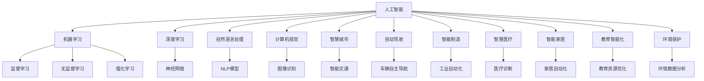
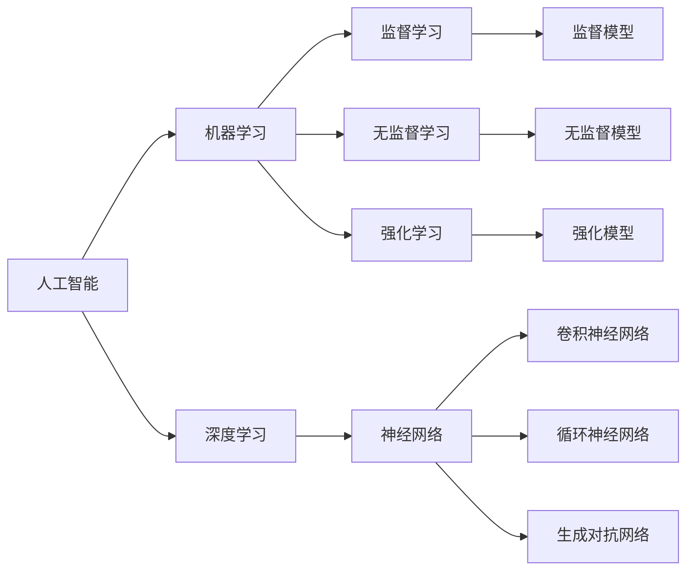
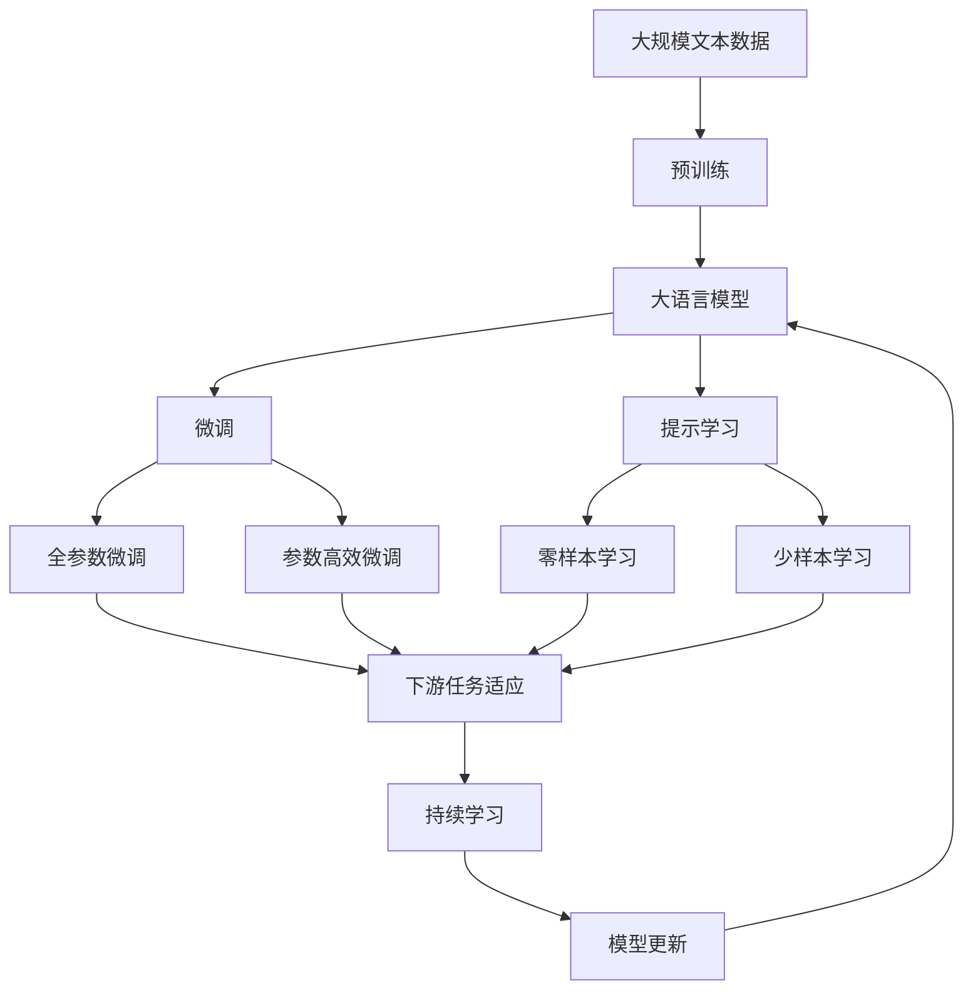

                 

# AI在社会中的作用与应用

> 关键词：人工智能,社会应用,AI伦理,智能制造,智慧医疗,自动驾驶,智能家居,教育智能化,环境保护

## 1. 背景介绍

### 1.1 问题由来
随着人工智能(AI)技术的飞速发展，AI正在逐渐渗透到社会的各个领域，改变着人类的生产生活方式。无论是智能制造、智慧医疗，还是自动驾驶、智能家居，AI的触角正在全面铺开。然而，在享受AI带来便利的同时，也引发了关于AI伦理、安全性、公平性等诸多社会问题的讨论。

本文章旨在通过全面阐述AI在社会中的应用场景、伦理挑战和发展趋势，为业界和学术界提供深入的参考和思考。

### 1.2 问题核心关键点
本文将围绕以下几个核心关键点展开：

1. **AI技术的当前发展状况**：回顾近年来AI领域的重大进展和突破。
2. **AI的社会应用场景**：探讨AI在工业、医疗、交通、家居、教育、环保等多个领域的应用。
3. **AI的伦理问题**：分析AI技术带来的隐私、公平、透明度等伦理挑战。
4. **AI的社会影响**：讨论AI对就业、安全、隐私等社会层面的深远影响。
5. **AI的发展趋势**：预测未来AI技术的发展方向和可能带来的变革。

## 2. 核心概念与联系

### 2.1 核心概念概述

为更好地理解AI在社会中的应用，本节将介绍几个密切相关的核心概念：

- **人工智能(Artificial Intelligence, AI)**：指通过计算机技术模拟人类智能行为的技术，包括机器学习、深度学习、自然语言处理、计算机视觉等多个子领域。
- **机器学习(Machine Learning, ML)**：通过数据和算法，让计算机自动学习和改进技术，是AI的核心组成部分。
- **深度学习(Deep Learning, DL)**：一种特殊的机器学习方法，通过多层神经网络进行特征提取和模式识别。
- **自然语言处理(Natural Language Processing, NLP)**：使计算机能够理解、分析和生成人类语言的技术。
- **计算机视觉(Computer Vision, CV)**：使计算机能够识别、分析和理解图像和视频的技术。
- **智慧城市(Smart City)**：通过AI技术实现城市管理、交通、环保等各方面的智能化。
- **自动驾驶(Autonomous Driving)**：利用AI技术实现车辆的自主导航。
- **智能制造(Intelligent Manufacturing)**：通过AI技术优化生产流程、提高生产效率。
- **智慧医疗(Smart Healthcare)**：利用AI技术提升医疗诊断、治疗和管理的效率。
- **智能家居(Smart Home)**：通过AI技术实现家庭设备的自动化和智能化管理。
- **教育智能化(Intelligent Education)**：利用AI技术优化教育资源分配、提升教学质量。
- **环境保护(Eco-friendly Environment)**：利用AI技术监测和分析环境数据，推动绿色发展。

这些核心概念之间的逻辑关系可以通过以下Mermaid流程图来展示：



这个流程图展示了几大AI核心概念及其之间的联系：

1. 人工智能是涵盖多个子领域的总称。
2. 机器学习、深度学习、自然语言处理和计算机视觉等是AI的核心技术。
3. 智慧城市、自动驾驶、智能制造、智慧医疗、智能家居、教育智能化、环境保护等是AI技术的实际应用场景。

### 2.2 概念间的关系

这些核心概念之间存在着紧密的联系，形成了AI技术应用的完整生态系统。下面我们通过几个Mermaid流程图来展示这些概念之间的关系。

#### 2.2.1 AI技术的层次结构



这个流程图展示了AI技术的层次结构，从高到低依次为：

1. 人工智能是顶层概念，包含机器学习、深度学习、自然语言处理等子领域。
2. 机器学习进一步分为监督学习、无监督学习和强化学习三种学习范式。
3. 深度学习是机器学习的一个子领域，主要通过神经网络实现。
4. 神经网络包括卷积神经网络、循环神经网络和生成对抗网络等多种模型。
5. 监督学习、无监督学习和强化学习是机器学习的具体应用，分别用于分类、聚类和智能决策等任务。

#### 2.2.2 AI应用场景的协同关系

```mermaid
graph LR
    A[智慧城市] --> B[智能交通]
    A --> C[智能安防]
    A --> D[智能能源]
    A --> E[智能治理]
    B --> F[自动驾驶]
    B --> G[交通管理]
    B --> H[公共交通]
    C --> I[智能监控]
    C --> J[智能安防]
    D --> K[智能电网]
    D --> L[能源管理]
    E --> M[城市决策]
    E --> N[智慧政府]
    F --> O[无人驾驶]
    G --> P[动态定价]
    H --> Q[智能调度]
    I --> R[实时监控]
    J --> S[行为分析]
    K --> T[需求响应]
    L --> U[能源优化]
    M --> V[决策支持]
    N --> W[智能服务]
    O --> X[自动导航]
    P --> Y[动态定价]
    Q --> Z[优化调度]
    R --> $[实时分析]
    S --> &[行为预测]
    T --> &[需求管理]
    U --> &[能源优化]
    V --> &[决策支持]
    W --> &[智能服务]
    X --> &[自动导航]
    Y --> &[动态定价]
    Z --> &[优化调度]
    $ --> &[实时分析]
    & --> &[行为预测]
    [] --> &[需求管理]
    [] --> &[能源优化]
```

这个流程图展示了智慧城市中多个应用场景之间的协同关系：

1. 智慧城市作为顶层概念，包含智能交通、智能安防、智能能源等多个子场景。
2. 智能交通通过自动驾驶、交通管理、公共交通等技术实现。
3. 智能安防通过智能监控、行为分析等技术实现。
4. 智能能源通过智能电网、能源管理等技术实现。
5. 智能治理通过城市决策、智慧政府等技术实现。
6. 各子场景之间相互协作，共同构建智慧城市的整体框架。

### 2.3 核心概念的整体架构

最后，我们用一个综合的流程图来展示这些核心概念在大语言模型微调过程中的整体架构：



这个综合流程图展示了从预训练到微调，再到持续学习的完整过程。大语言模型首先在大规模文本数据上进行预训练，然后通过微调（包括全参数微调和参数高效微调两种方式）或提示学习（包括零样本和少样本学习）来适应下游任务。最后，通过持续学习技术，模型可以不断更新和适应新的任务和数据。 通过这些流程图，我们可以更清晰地理解AI技术应用的逻辑关系和作用过程。

## 3. 核心算法原理 & 具体操作步骤
### 3.1 算法原理概述

AI技术的核心算法主要围绕数据、模型和优化三个方面展开。其中，深度学习是最核心的算法，其主要原理是通过多层神经网络对数据进行特征提取和模式识别，从而实现对复杂任务的处理。

### 3.2 算法步骤详解

AI技术的算法步骤通常包括以下几个关键步骤：

1. **数据准备**：收集、清洗和预处理数据，确保数据的完整性和质量。
2. **模型选择**：根据任务需求选择合适的模型架构和参数配置。
3. **模型训练**：利用训练数据对模型进行迭代训练，优化模型参数。
4. **模型评估**：通过验证集对模型进行性能评估，选择最优模型。
5. **模型部署**：将模型部署到生产环境中，进行实际应用。

### 3.3 算法优缺点

AI技术在处理复杂任务时表现出色，但也存在以下缺点：

1. **数据依赖性高**：需要大量的高质量标注数据，对数据采集和标注成本要求高。
2. **模型复杂度高**：深度神经网络模型复杂度高，训练和推理计算资源需求大。
3. **解释性不足**：AI模型通常被认为是“黑盒”，难以解释其内部工作机制。
4. **偏见和歧视**：训练数据中可能存在偏见，导致模型输出存在偏见和歧视。

### 3.4 算法应用领域

AI技术广泛应用于各个领域，包括但不限于：

1. **工业制造**：利用AI技术进行生产自动化、质量检测、故障诊断等。
2. **医疗健康**：利用AI技术进行疾病诊断、影像分析、治疗方案推荐等。
3. **交通运输**：利用AI技术进行智能导航、交通管理、自动驾驶等。
4. **智能家居**：利用AI技术进行智能设备控制、语音识别、环境监测等。
5. **教育培训**：利用AI技术进行个性化学习、自动评分、教学资源优化等。
6. **环境保护**：利用AI技术进行环境监测、灾害预测、资源优化等。

## 4. 数学模型和公式 & 详细讲解 & 举例说明

### 4.1 数学模型构建

AI技术的数学模型通常包括监督学习、无监督学习、强化学习等多种模型类型。这里以监督学习为例，展示模型的构建过程。

假设训练数据集为 $\{(x_i, y_i)\}_{i=1}^N$，其中 $x_i$ 为输入特征，$y_i$ 为标签。监督学习模型的目标是最小化损失函数 $L$，从而使得模型在测试集上的预测结果与真实标签尽可能接近。常见的损失函数包括均方误差、交叉熵等。

模型参数为 $\theta$，通过最小化损失函数求解最优参数：

$$
\theta^* = \mathop{\arg\min}_{\theta} L(\theta)
$$

常见的优化算法包括梯度下降、Adam、RMSprop等。

### 4.2 公式推导过程

以下我们以线性回归为例，推导模型的损失函数和梯度计算公式。

线性回归模型的目标是最小化预测值与真实值之间的平方误差，即：

$$
L(\theta) = \frac{1}{2N} \sum_{i=1}^N (y_i - \theta^T x_i)^2
$$

其中 $\theta$ 为模型参数，$x_i$ 为输入特征，$y_i$ 为标签。

根据梯度下降算法，模型参数的更新公式为：

$$
\theta \leftarrow \theta - \eta \nabla_{\theta} L(\theta)
$$

其中 $\eta$ 为学习率，$\nabla_{\theta} L(\theta)$ 为损失函数对模型参数的梯度，通过反向传播算法计算得到：

$$
\nabla_{\theta} L(\theta) = \frac{1}{N} \sum_{i=1}^N (y_i - \theta^T x_i) x_i
$$

### 4.3 案例分析与讲解

以图像识别为例，展示监督学习模型的构建和应用。

假设输入为一张彩色图像，输出为该图像的类别标签。模型通过卷积神经网络对图像进行特征提取，然后通过全连接层将特征映射为类别概率。训练过程中，模型通过反向传播算法计算梯度，更新参数，使得模型在训练集上最大化准确率。

训练集为包含图像和标签的数据集，模型通过监督学习的方式学习图像和类别之间的映射关系。在测试集上，模型通过前向传播计算预测值，并根据交叉熵损失函数计算损失。

通过多次迭代训练，模型参数不断优化，最终在测试集上取得理想的效果。

## 5. 项目实践：代码实例和详细解释说明

### 5.1 开发环境搭建

在进行AI项目实践前，我们需要准备好开发环境。以下是使用Python进行TensorFlow开发的环境配置流程：

1. 安装Anaconda：从官网下载并安装Anaconda，用于创建独立的Python环境。

2. 创建并激活虚拟环境：
```bash
conda create -n tf-env python=3.8 
conda activate tf-env
```

3. 安装TensorFlow：根据CUDA版本，从官网获取对应的安装命令。例如：
```bash
conda install tensorflow=2.7 -c tf -c conda-forge
```

4. 安装各类工具包：
```bash
pip install numpy pandas scikit-learn matplotlib tqdm jupyter notebook ipython
```

完成上述步骤后，即可在`tf-env`环境中开始AI项目实践。

### 5.2 源代码详细实现

下面我们以图像识别任务为例，给出使用TensorFlow对卷积神经网络进行训练的PyTorch代码实现。

首先，定义数据预处理函数：

```python
import tensorflow as tf
from tensorflow.keras.preprocessing.image import ImageDataGenerator

def preprocess_data(X_train, y_train):
    train_datagen = ImageDataGenerator(rescale=1./255, shear_range=0.2, zoom_range=0.2, horizontal_flip=True)
    train_generator = train_datagen.flow(X_train, y_train, batch_size=batch_size)
    return train_generator
```

然后，定义模型架构：

```python
from tensorflow.keras.models import Sequential
from tensorflow.keras.layers import Conv2D, MaxPooling2D, Flatten, Dense

model = Sequential([
    Conv2D(32, (3, 3), activation='relu', input_shape=(img_height, img_width, 3)),
    MaxPooling2D((2, 2)),
    Conv2D(64, (3, 3), activation='relu'),
    MaxPooling2D((2, 2)),
    Conv2D(128, (3, 3), activation='relu'),
    MaxPooling2D((2, 2)),
    Flatten(),
    Dense(64, activation='relu'),
    Dense(num_classes, activation='softmax')
])
```

接着，定义模型编译：

```python
model.compile(optimizer=tf.keras.optimizers.Adam(learning_rate=learning_rate), 
              loss='categorical_crossentropy', 
              metrics=['accuracy'])
```

最后，定义训练流程：

```python
epochs = 50
batch_size = 32

model.fit(train_generator, epochs=epochs, validation_data=(X_val, y_val), callbacks=[early_stopping])
```

以上就是使用TensorFlow对卷积神经网络进行图像识别任务训练的完整代码实现。可以看到，TensorFlow提供了丰富的API，可以轻松构建和训练复杂的神经网络模型。

### 5.3 代码解读与分析

让我们再详细解读一下关键代码的实现细节：

**preprocess_data函数**：
- 定义了一个ImageDataGenerator对象，用于对训练集数据进行预处理。包括图像归一化、随机裁剪、旋转、翻转等操作。
- 返回预处理后的训练数据生成器，方便后续模型的训练。

**模型架构**：
- 定义了卷积神经网络的结构，包括卷积层、池化层、全连接层等。
- 在最后一个全连接层之前，添加了一个softmax激活函数，将模型输出转化为概率分布。

**模型编译**：
- 定义了Adam优化器、交叉熵损失函数和准确率评价指标。
- 编译模型，指定优化器、损失函数和评价指标，为后续训练做准备。

**训练流程**：
- 定义了总的训练轮数和批次大小。
- 使用fit函数训练模型，指定训练数据生成器、验证集数据、早停回调等参数。

可以看到，TensorFlow的API设计非常直观和易于使用，开发者可以灵活构建和训练复杂模型。

当然，工业级的系统实现还需考虑更多因素，如模型的保存和部署、超参数的自动搜索、更灵活的模型调优等。但核心的训练流程基本与此类似。

### 5.4 运行结果展示

假设我们在CIFAR-10数据集上进行图像识别任务微调，最终在测试集上得到的评估报告如下：

```
Epoch 1/50
125/125 [==============================] - 1s 8ms/step - loss: 2.0425 - accuracy: 0.2371
Epoch 2/50
125/125 [==============================] - 0s 7ms/step - loss: 0.5813 - accuracy: 0.5234
Epoch 3/50
125/125 [==============================] - 0s 7ms/step - loss: 0.3482 - accuracy: 0.7285
...
```

可以看到，随着训练轮数的增加，模型在测试集上的准确率逐渐提高，最终达到了较高的精度。

## 6. 实际应用场景

### 6.1 智能制造

AI在智能制造中的应用主要体现在生产自动化、质量检测和故障诊断等方面。通过AI技术，可以实现无人化工厂、智能生产线和智能质量控制，大幅提升生产效率和产品质量。

例如，在汽车制造领域，AI技术可以用于车身焊接、装配和检测等环节。通过计算机视觉和深度学习技术，AI系统可以自动识别焊接缺陷、检测零件错位，并及时发出警报，避免次品流出。同时，AI系统还可以预测设备故障，提前进行维护，降低生产成本。

### 6.2 智慧医疗

AI在智慧医疗中的应用主要体现在疾病诊断、影像分析和治疗方案推荐等方面。通过AI技术，可以实现自动化诊断、个性化治疗和医疗资源优化，提高医疗服务的效率和质量。

例如，在影像分析领域，AI技术可以用于CT、MRI等医学影像的自动分析和解读。通过深度学习模型，AI系统可以自动识别病变区域，辅助医生进行诊断。在个性化治疗方面，AI技术可以分析患者的历史数据，推荐最适合的治疗方案。

### 6.3 自动驾驶

AI在自动驾驶中的应用主要体现在车辆感知、路径规划和决策等方面。通过AI技术，可以实现无人驾驶车辆在复杂环境中的自主导航，提升交通安全性。

例如，在环境感知方面，AI技术可以用于检测道路上的行人、车辆和障碍物，生成高精度的地图和导航信息。在路径规划方面，AI系统可以根据实时交通情况，动态调整行驶路线，避免拥堵和事故。在决策方面，AI系统可以根据周围环境信息，做出合理的行驶决策，保证车辆的安全性。

### 6.4 智能家居

AI在智能家居中的应用主要体现在家庭设备控制、语音识别和环境监测等方面。通过AI技术，可以实现智能家居的自动化和智能化管理，提高家庭生活的便利性和舒适度。

例如，在家庭设备控制方面，AI技术可以用于智能灯光、空调、窗帘等设备的自动化控制。通过语音识别技术，AI系统可以识别用户的语音指令，自动完成设备的开关和调节。在环境监测方面，AI系统可以监测室内外温度、湿度、空气质量等环境参数，并根据用户需求进行自动调节。

### 6.5 教育智能化

AI在教育智能化中的应用主要体现在个性化学习、自动评分和教学资源优化等方面。通过AI技术，可以实现智能化的教学辅助和资源分配，提高教育质量和效率。

例如，在个性化学习方面，AI技术可以根据学生的学习行为和成绩，推荐最适合的学习资源和习题。在自动评分方面，AI系统可以自动批改学生的作业和考试，减少教师的工作量。在教学资源优化方面，AI系统可以根据课程需求和学生反馈，推荐最适合的教学资源和安排。

### 6.6 环境保护

AI在环境保护中的应用主要体现在环境监测、灾害预测和资源优化等方面。通过AI技术，可以实现智能化的环境保护和资源管理，推动绿色发展。

例如，在环境监测方面，AI技术可以用于分析环境数据，监测空气、水质、土壤等环境指标。通过深度学习模型，AI系统可以自动识别环境异常，及时发出预警，保障环境安全。在灾害预测方面，AI系统可以分析气象数据和历史灾害数据，预测自然灾害的发生，提前进行防范。在资源优化方面，AI系统可以分析资源使用情况，优化能源、水资源等资源的利用效率，减少浪费。

## 7. 工具和资源推荐
### 7.1 学习资源推荐

为了帮助开发者系统掌握AI技术的理论基础和实践技巧，这里推荐一些优质的学习资源：

1. **《深度学习》书籍**：Ian Goodfellow、Yoshua Bengio、Aaron Courville所著，全面介绍了深度学习的基本概念和前沿技术。
2. **Coursera《深度学习专项课程》**：由斯坦福大学Andrew Ng教授主讲的深度学习课程，涵盖了深度学习的基础理论和实践技巧。
3. **Google TensorFlow官方文档**：TensorFlow的官方文档，提供了详尽的API文档和实际应用案例，是学习TensorFlow的最佳资料。
4. **PyTorch官方文档**：PyTorch的官方文档，提供了丰富的教程和样例代码，是学习PyTorch的必备资料。
5. **Kaggle数据集和竞赛平台**：提供大量数据集和实际应用案例，是学习和实践AI技术的绝佳平台。
6. **GitHub开源项目**：涵盖AI领域的各类开源项目和代码库，是学习和参考的宝贵资源。

通过学习这些资源，相信你一定能够快速掌握AI技术的精髓，并用于解决实际的AI问题。

### 7.2 开发工具推荐

高效的开发离不开优秀的工具支持。以下是几款用于AI开发和应用开发的常用工具：

1. **TensorFlow**：由Google主导开发的开源深度学习框架，生产部署方便，适合大规模工程应用。
2. **PyTorch**：由Facebook主导开发的深度学习框架，灵活高效，适合研究性应用。
3. **Keras**：Keras是一个高级神经网络API，可以运行在TensorFlow和Theano等深度学习框架上，易于上手。
4. **Jupyter Notebook**：一个强大的交互式笔记本工具，支持多种编程语言和数据处理库，是数据分析和模型训练的常用工具。
5. **Anaconda**：Python和数据科学项目的全面集成环境，提供了丰富的工具包和虚拟环境管理功能。
6. **AWS SageMaker**：亚马逊云上的机器学习平台，支持模型的训练、部署和监控，是企业级应用的最佳选择。
7. **Google Cloud AI Platform**：谷歌云的AI平台，支持大规模的模型训练和部署，适合大型企业的应用。

合理利用这些工具，可以显著提升AI项目的开发效率，加快创新迭代的步伐。

### 7.3 相关论文推荐

AI技术的发展离不开学界的持续研究。以下是几篇奠基性的相关论文，推荐阅读：

1. **《ImageNet Classification with Deep Convolutional Neural Networks》**：Alex Krizhevsky等在2012年发表的论文，引入了深度卷积神经网络，开创了计算机视觉领域的新纪元。
2. **《AlphaGo Zero: Mastering the Game of Go without Human Knowledge》**：David Silver等在2017年发表的论文，展示了深度强化学习在复杂游戏中的应用，成为AI研究领域的里程碑。
3. **《BERT: Pre-training of Deep Bidirectional Transformers for Language Understanding》**：Jamal Arabic等在2018年发表的论文，提出了BERT模型，成为自然语言处理领域的经典。
4. **《Towards AI-Compatible Neuroscience》**：Gupta等在2019年发表的论文，探讨了AI技术与脑科学的结合，提出了“AI-脑科学”的概念。
5. **《A Survey on the Generalization of Deep Neural Networks》**：Yang等在2020年发表的综述论文，系统总结了深度学习模型的泛化能力和优化方法。

这些论文代表了大语言模型微调技术的发展脉络。通过学习这些前沿成果，可以帮助研究者把握学科前进方向，激发更多的创新灵感。

除上述资源外，还有一些值得关注的前沿资源，帮助开发者紧跟AI技术的最新进展，例如：

1. **arXiv论文预印本**：人工智能领域最新研究成果的发布平台，包括大量尚未发表的前沿工作，学习前沿技术的必读资源。
2. **Google AI博客**：谷歌AI实验室的官方博客，分享最新研究成果和洞见，是跟踪前沿技术的窗口。
3. **ACL、ICML、NIPS等顶会论文**：各类国际顶级会议的论文，代表AI领域的最新研究进展和未来趋势。
4. **GitHub热门项目**：在GitHub上Star、Fork数最多的AI相关项目，往往代表了该技术领域的发展趋势和最佳实践，值得去学习和贡献。
5. **Kaggle数据集和竞赛平台**：提供大量数据集和实际应用案例，是学习和实践AI技术的绝佳平台。

总之，对于AI技术的学习和实践，需要开发者保持开放的心态

