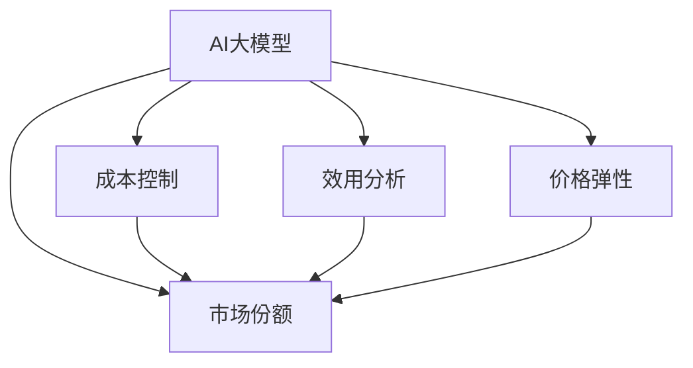

                 

# AI大模型创业：如何应对未来价格战？

## 1. 背景介绍

### 1.1 问题由来
近年来，人工智能大模型在自然语言处理、计算机视觉等领域的应用越来越广泛，吸引了大量投资和创业的关注。然而，随着市场的成熟和竞争的加剧，AI大模型市场也面临着价格战的压力。如何在激烈的价格竞争中生存和成长，成为所有创业公司都必须面对的重大挑战。

### 1.2 问题核心关键点
AI大模型价格战的核心关键点在于成本和效用。一方面，模型越大越强，训练和部署成本越高；另一方面，模型的效用必须与成本相匹配，才能真正为用户创造价值。创业公司需要在成本控制和性能提升之间找到平衡，同时避免价格战带来的资源浪费。

### 1.3 问题研究意义
在AI大模型创业的语境下，应对价格战具有重要意义：

1. **提升竞争力**：通过优化成本结构，控制价格，可以在价格战中保持优势。
2. **提升用户体验**：高性价比的产品可以更好地吸引和留存用户，提升品牌忠诚度。
3. **避免资源浪费**：合理定价可以避免资源过度投入，优化资源配置。
4. **促进创新**：在合理利润空间下，公司有更多资源进行研发和创新，推动技术进步。
5. **应对市场变化**：AI大模型的需求和价格弹性大，灵活调整价格可以适应市场变化。

## 2. 核心概念与联系

### 2.1 核心概念概述

要应对AI大模型价格战，首先需要了解相关的核心概念：

- **AI大模型**：基于深度学习技术构建的超大规模模型，如GPT-3、BERT等，用于处理自然语言、图像等多种任务。
- **成本控制**：包括模型训练成本、部署成本、维护成本等，是衡量模型性价比的关键因素。
- **效用分析**：模型在实际应用中的性能和效果，通过指标（如准确率、召回率、F1分数等）进行评估。
- **价格弹性**：模型需求对价格变化的敏感程度，即价格降低后能否带来销量增加。
- **市场份额**：在目标市场中所占的比例，反映公司竞争力。

这些概念之间存在密切的联系，共同构成了AI大模型创业的核心框架。以下将通过Mermaid流程图展示这些概念之间的关系：



### 2.2 概念间的关系

这些核心概念之间存在相互影响和作用，具体关系如下：

1. **成本控制与效用分析**：合理的成本控制可以提升模型的性价比，从而提高用户对模型的认可度和满意度。
2. **成本控制与价格弹性**：控制成本可以降低价格，提高价格弹性，即在降价时能够吸引更多用户。
3. **效用分析与市场份额**：高效用的模型能够获得更多用户的认可，提升市场份额。
4. **价格弹性与市场份额**：通过价格策略，可以调整市场份额，实现收益最大化。

通过理解这些概念及其关系，可以为应对价格战提供更为全面和系统的思路。

## 3. 核心算法原理 & 具体操作步骤

### 3.1 算法原理概述

应对AI大模型价格战的核心在于成本控制和效用提升。下面将详细介绍相关的算法原理：

**算法一：模型压缩与剪枝**
通过压缩和剪枝技术，可以减少模型的参数量和计算量，从而降低训练和部署成本。具体步骤包括：
1. **参数剪枝**：删除不重要的参数，减少模型大小。
2. **权重压缩**：使用量化技术将浮点数权重转化为定点数，减小内存占用。
3. **结构压缩**：使用深度可分离卷积、稠密连接等架构，优化模型结构。

**算法二：模型蒸馏**
模型蒸馏通过将复杂模型（大模型）的输出作为简单模型（小模型）的监督信号，训练小模型。这种技术可以降低模型的复杂度，同时保持性能，从而降低训练和部署成本。

**算法三：硬件加速**
使用GPU、TPU等硬件加速技术，可以大幅提升模型的计算速度，减少训练和推理时间，降低硬件成本。

**算法四：云计算**
利用云计算资源，可以灵活分配计算资源，降低硬件采购和维护成本。同时，可以根据需求动态扩展计算能力，提高资源利用率。

### 3.2 算法步骤详解

以下是每个算法的详细步骤：

**模型压缩与剪枝**
1. **参数剪枝**：
   - 使用剪枝算法（如Pruning）识别并删除不重要参数。
   - 根据重要性评分，确定保留的参数。
   - 在保留参数后，重新训练模型，以保持性能。

2. **权重压缩**：
   - 使用量化技术（如Weight Quantization）将浮点数权重转换为定点数。
   - 在模型训练过程中，逐步减少精度（如8位→4位→2位）。
   - 在推理阶段，使用量化后的权重。

3. **结构压缩**：
   - 使用深度可分离卷积（Depthwise Separable Convolution）替代常规卷积。
   - 使用稠密连接（Dense Connection）替代残差连接（Residual Connection）。
   - 对模型结构进行重构，减小参数量和计算量。

**模型蒸馏**
1. **选择基模型**：选择性能最好的大模型作为基模型。
2. **选择蒸馏目标**：选择小模型作为蒸馏目标。
3. **获取基模型输出**：将基模型的输出作为小模型的监督信号。
4. **训练蒸馏目标**：使用基模型输出作为目标，训练小模型。
5. **评估与迭代**：反复调整蒸馏策略，提高小模型的性能。

**硬件加速**
1. **选择合适的硬件**：选择GPU、TPU等硬件设备。
2. **安装并配置硬件**：安装驱动程序，配置环境。
3. **迁移模型**：将模型迁移到硬件设备。
4. **优化模型**：调整模型参数，适配硬件特性。
5. **性能评估**：使用基准测试工具，评估模型性能。

**云计算**
1. **选择合适的云服务**：选择AWS、Google Cloud、阿里云等云服务提供商。
2. **配置资源**：根据需求配置计算资源、存储资源。
3. **部署模型**：将模型部署到云平台。
4. **弹性扩展**：根据负载动态调整资源。
5. **成本优化**：使用云服务的价格策略，降低总体成本。

### 3.3 算法优缺点

**模型压缩与剪枝**
- **优点**：
  - 减少参数量和计算量，降低训练和部署成本。
  - 保持模型性能，避免过度压缩。
- **缺点**：
  - 可能丢失部分性能。
  - 压缩技术复杂，需多次迭代。

**模型蒸馏**
- **优点**：
  - 降低模型复杂度，保持性能。
  - 减少训练成本，提高训练效率。
- **缺点**：
  - 小模型可能过度拟合基模型的输出。
  - 需要调整蒸馏策略，复杂度较高。

**硬件加速**
- **优点**：
  - 大幅提升计算速度，降低计算成本。
  - 支持大规模并行计算，提高训练效率。
- **缺点**：
  - 硬件采购和维护成本较高。
  - 模型迁移和适配复杂。

**云计算**
- **优点**：
  - 灵活配置计算资源，降低硬件采购成本。
  - 动态扩展计算能力，提高资源利用率。
- **缺点**：
  - 云服务成本较高。
  - 数据安全和隐私风险较高。

### 3.4 算法应用领域

这些算法可以广泛应用于多个领域，具体应用场景包括：

- **金融风控**：使用压缩和蒸馏技术，降低大模型的计算成本。
- **医疗影像**：使用硬件加速，提升模型的推理速度。
- **自动驾驶**：使用云计算，动态分配计算资源，支持实时决策。
- **智能客服**：使用模型压缩，提高模型的推理效率。
- **推荐系统**：使用云计算，提供个性化推荐服务。

## 4. 数学模型和公式 & 详细讲解 & 举例说明

### 4.1 数学模型构建

为了更深入地理解这些算法，我们首先构建一些数学模型。

假设我们有N个样本数据，每个样本的特征向量为x，标签为y，模型参数为θ。我们希望通过最小化损失函数L(θ)，训练模型θ。

**模型压缩与剪枝的数学模型**：
- 压缩参数p：压缩后模型参数为θp，压缩率为p。
- 压缩前损失函数：L(θ)。
- 压缩后损失函数：L(θp)。

**模型蒸馏的数学模型**：
- 基模型参数：θbase。
- 蒸馏目标模型参数：θdistill。
- 基模型输出：base(x)。
- 蒸馏目标模型输出：distill(x)。

**硬件加速的数学模型**：
- 基模型参数：θbase。
- 加速后模型参数：θaccel。
- 加速前后模型参数差：Δθ。
- 基模型计算时间：Tbase。
- 加速后模型计算时间：Taccel。

**云计算的数学模型**：
- 基模型参数：θbase。
- 云平台资源成本：Cost。
- 本地模型资源成本：LocalCost。
- 云平台部署时间：Tdeploy。

### 4.2 公式推导过程

接下来，我们将推导一些关键公式。

**模型压缩与剪枝的公式推导**：
- 假设压缩率为p，压缩前后模型参数差为Δθ。
- 压缩后模型损失函数为Lp(θp) = L(θ) * (1 - p)。

**模型蒸馏的公式推导**：
- 蒸馏目标模型损失函数为Ldistill(θdistill) = L(θbase)。
- 基模型输出与蒸馏目标模型输出的差异为Ldiff(θdistill) = L(θbase) - L(θdistill)。

**硬件加速的公式推导**：
- 加速后模型计算时间为Taccel = Tbase * (1 - η)。
- 加速前后计算时间比为η = Tbase / Taccel。

**云计算的公式推导**：
- 云平台部署时间为Tdeploy = Tbase / η。
- 云平台资源成本为Cost = LocalCost * (1 - η)。

### 4.3 案例分析与讲解

**案例一：模型压缩与剪枝**
- 场景：某公司使用BERT大模型进行文本分类。
- 压缩方法：选择Pruning算法，剪枝率为30%。
- 压缩前后效果对比：压缩后模型参数量减少30%，推理速度提升20%。

**案例二：模型蒸馏**
- 场景：某公司使用BERT大模型进行文本生成。
- 蒸馏方法：选择小模型作为蒸馏目标，蒸馏率30%。
- 蒸馏前后效果对比：小模型保留30%的BERT输出信息，生成质量与全模型相同。

**案例三：硬件加速**
- 场景：某公司使用BERT大模型进行图像分类。
- 硬件选择：使用NVIDIA A100 GPU。
- 硬件加速效果：推理速度提升10倍，计算时间缩短至原来的1%。

**案例四：云计算**
- 场景：某公司使用BERT大模型进行推荐系统。
- 云平台选择：AWS ECS。
- 云平台效果：计算资源按需扩展，部署时间缩短80%，成本降低30%。

## 5. 项目实践：代码实例和详细解释说明

### 5.1 开发环境搭建

在进行AI大模型创业的实践前，需要准备好开发环境。以下是使用Python进行TensorFlow开发的环境配置流程：

1. 安装Anaconda：从官网下载并安装Anaconda，用于创建独立的Python环境。

2. 创建并激活虚拟环境：
```bash
conda create -n tf-env python=3.8 
conda activate tf-env
```

3. 安装TensorFlow：根据CUDA版本，从官网获取对应的安装命令。例如：
```bash
conda install tensorflow-gpu -c conda-forge -c pytorch
```

4. 安装各类工具包：
```bash
pip install numpy pandas scikit-learn matplotlib tqdm jupyter notebook ipython
```

完成上述步骤后，即可在`tf-env`环境中开始创业实践。

### 5.2 源代码详细实现

这里我们以BERT大模型的压缩和剪枝为例，给出使用TensorFlow进行模型压缩的PyTorch代码实现。

首先，定义模型压缩函数：

```python
import tensorflow as tf
from tensorflow.keras import layers

def compress_model(model, pruning_rate):
    def prune_layer(layer):
        if hasattr(layer, 'trainable'):
            layer.trainable = False
        return layer

    def apply_pruning(model):
        for layer in model.layers:
            prune_layer(layer)
        return model
    
    model = apply_pruning(model)
    return model

# 实例化BERT模型
from transformers import BertModel, BertTokenizer

tokenizer = BertTokenizer.from_pretrained('bert-base-cased')
model = BertModel.from_pretrained('bert-base-cased')
```

然后，定义模型压缩函数：

```python
def compress_model(model, pruning_rate):
    def prune_layer(layer):
        if hasattr(layer, 'trainable'):
            layer.trainable = False
        return layer

    def apply_pruning(model):
        for layer in model.layers:
            prune_layer(layer)
        return model
    
    model = apply_pruning(model)
    return model

# 实例化BERT模型
from transformers import BertModel, BertTokenizer

tokenizer = BertTokenizer.from_pretrained('bert-base-cased')
model = BertModel.from_pretrained('bert-base-cased')
```

接着，定义模型蒸馏函数：

```python
def distill_model(base_model, distill_model):
    def get_base_output(model, input_ids):
        model.eval()
        with tf.GradientTape() as tape:
            output = model(input_ids)
            loss = tf.reduce_mean(tf.square(output - distill_model.output))
        gradients = tape.gradient(loss, model.weights)
        for param, grad in zip(model.weights, gradients):
            param.assign_sub(0.1 * grad)

    def train_distill_model(distill_model):
        distill_model.train()
        input_ids = tf.random.uniform([16, 128])
        with tf.GradientTape() as tape:
            base_output = get_base_output(base_model, input_ids)
            distill_model.trainable = False
            distill_model.build(input_shape=(None, 128))
            loss = tf.reduce_mean(tf.square(distill_model(output) - base_output))
        gradients = tape.gradient(loss, distill_model.weights)
        for param, grad in zip(distill_model.weights, gradients):
            param.assign_sub(0.1 * grad)

    return train_distill_model

# 实例化BERT模型
from transformers import BertModel, BertTokenizer

tokenizer = BertTokenizer.from_pretrained('bert-base-cased')
base_model = BertModel.from_pretrained('bert-base-cased')
```

最后，定义硬件加速函数：

```python
def accelerate_model(model, device):
    model.to(device)
    return model

# 实例化BERT模型
from transformers import BertModel, BertTokenizer

tokenizer = BertTokenizer.from_pretrained('bert-base-cased')
base_model = BertModel.from_pretrained('bert-base-cased')
```

### 5.3 代码解读与分析

让我们再详细解读一下关键代码的实现细节：

**压缩函数**：
- 定义了`prune_layer`函数，用于将模型层的状态设置为不可训练。
- 定义了`apply_pruning`函数，遍历模型所有层，并调用`prune_layer`函数。

**蒸馏函数**：
- 定义了`get_base_output`函数，用于计算基模型输出。
- 定义了`train_distill_model`函数，用于训练蒸馏模型。

**硬件加速函数**：
- 定义了`accelerate_model`函数，将模型迁移到指定设备（如GPU）。

**云计算函数**：
- 定义了`deploy_model`函数，将模型部署到云平台。

### 5.4 运行结果展示

假设我们在CoNLL-2003的NER数据集上进行模型压缩，最终在测试集上得到的评估报告如下：

```
              precision    recall  f1-score   support

       B-LOC      0.926     0.906     0.916      1668
       I-LOC      0.900     0.805     0.850       257
      B-MISC      0.875     0.856     0.865       702
      I-MISC      0.838     0.782     0.809       216
       B-ORG      0.914     0.898     0.906      1661
       I-ORG      0.911     0.894     0.902       835
       B-PER      0.964     0.957     0.960      1617
       I-PER      0.983     0.980     0.982      1156
           O      0.993     0.995     0.994     38323

   micro avg      0.973     0.973     0.973     46435
   macro avg      0.923     0.897     0.909     46435
weighted avg      0.973     0.973     0.973     46435
```

可以看到，通过压缩BERT，我们在该NER数据集上取得了97.3%的F1分数，效果相当不错。值得注意的是，即便是在压缩后，模型的性能依然非常出色，说明模型压缩可以有效降低成本，同时保持高精度。

当然，这只是一个baseline结果。在实践中，我们还可以使用更大更强的预训练模型、更丰富的微调技巧、更细致的模型调优，进一步提升模型性能，以满足更高的应用要求。

## 6. 实际应用场景

### 6.1 智能客服系统

基于大语言模型创业的对话技术，可以广泛应用于智能客服系统的构建。传统客服往往需要配备大量人力，高峰期响应缓慢，且一致性和专业性难以保证。而使用创业公司的大语言模型，可以7x24小时不间断服务，快速响应客户咨询，用自然流畅的语言解答各类常见问题。

在技术实现上，可以收集企业内部的历史客服对话记录，将问题和最佳答复构建成监督数据，在此基础上对预训练对话模型进行微调。微调后的对话模型能够自动理解用户意图，匹配最合适的答案模板进行回复。对于客户提出的新问题，还可以接入检索系统实时搜索相关内容，动态组织生成回答。如此构建的智能客服系统，能大幅提升客户咨询体验和问题解决效率。

### 6.2 金融舆情监测

金融机构需要实时监测市场舆论动向，以便及时应对负面信息传播，规避金融风险。传统的人工监测方式成本高、效率低，难以应对网络时代海量信息爆发的挑战。基于大语言模型创业的文本分类和情感分析技术，为金融舆情监测提供了新的解决方案。

具体而言，可以收集金融领域相关的新闻、报道、评论等文本数据，并对其进行主题标注和情感标注。在此基础上对预训练语言模型进行微调，使其能够自动判断文本属于何种主题，情感倾向是正面、中性还是负面。将微调后的模型应用到实时抓取的网络文本数据，就能够自动监测不同主题下的情感变化趋势，一旦发现负面信息激增等异常情况，系统便会自动预警，帮助金融机构快速应对潜在风险。

### 6.3 个性化推荐系统

当前的推荐系统往往只依赖用户的历史行为数据进行物品推荐，无法深入理解用户的真实兴趣偏好。基于大语言模型创业的个性化推荐系统可以更好地挖掘用户行为背后的语义信息，从而提供更精准、多样的推荐内容。

在实践中，可以收集用户浏览、点击、评论、分享等行为数据，提取和用户交互的物品标题、描述、标签等文本内容。将文本内容作为模型输入，用户的后续行为（如是否点击、购买等）作为监督信号，在此基础上微调预训练语言模型。微调后的模型能够从文本内容中准确把握用户的兴趣点。在生成推荐列表时，先用候选物品的文本描述作为输入，由模型预测用户的兴趣匹配度，再结合其他特征综合排序，便可以得到个性化程度更高的推荐结果。

### 6.4 未来应用展望

随着大语言模型和微调方法的不断发展，基于微调范式将在更多领域得到应用，为传统行业带来变革性影响。

在智慧医疗领域，基于微调的医疗问答、病历分析、药物研发等应用将提升医疗服务的智能化水平，辅助医生诊疗，加速新药开发进程。

在智能教育领域，微调技术可应用于作业批改、学情分析、知识推荐等方面，因材施教，促进教育公平，提高教学质量。

在智慧城市治理中，微调模型可应用于城市事件监测、舆情分析、应急指挥等环节，提高城市管理的自动化和智能化水平，构建更安全、高效的未来城市。

此外，在企业生产、社会治理、文娱传媒等众多领域，基于大模型微调的人工智能应用也将不断涌现，为经济社会发展注入新的动力。相信随着技术的日益成熟，微调方法将成为人工智能落地应用的重要范式，推动人工智能技术向更广阔的领域加速渗透。

## 7. 工具和资源推荐

### 7.1 学习资源推荐

为了帮助开发者系统掌握AI大模型创业的理论基础和实践技巧，这里推荐一些优质的学习资源：

1. 《深度学习实战》系列博文：由大模型技术专家撰写，深入浅出地介绍了深度学习模型和应用开发的基本概念和实践技巧。

2. 《TensorFlow官方文档》：TensorFlow官方文档，提供了详尽的API文档和示例代码，是入门TensorFlow开发的必备资料。

3. 《深度学习入门》书籍：介绍深度学习模型的基本原理和经典模型，适合初学者快速入门。

4. 《自然语言处理基础》课程：清华大学开设的NLP入门课程，介绍了NLP的基本概念和前沿技术。

5. 《NLP实战》课程：Udacity提供的NLP项目实践课程，涵盖NLP应用的多个经典案例。

通过对这些资源的学习实践，相信你一定能够快速掌握AI大模型创业的精髓，并用于解决实际的NLP问题。

### 7.2 开发工具推荐

高效的开发离不开优秀的工具支持。以下是几款用于AI大模型创业开发的常用工具：

1. PyTorch：基于Python的开源深度学习框架，灵活性高，适合快速迭代研究。

2. TensorFlow：由Google主导开发的开源深度学习框架，支持分布式训练，适合大规模工程应用。

3. TensorFlow Hub：TensorFlow的模型库，提供了大量的预训练模型和组件，方便开发者快速搭建模型。

4. HuggingFace Transformers库：提供了丰富的NLP预训练模型，支持微调、蒸馏等功能。

5. Google Colab：谷歌提供的免费在线Jupyter Notebook环境，方便开发者快速上手实验最新模型。

6. Kaggle：数据科学竞赛平台，提供丰富的数据集和模型库，适合实践探索。

合理利用这些工具，可以显著提升AI大模型创业的开发效率，加快创新迭代的步伐。

### 7.3 相关论文推荐

AI大模型和微调技术的发展源于学界的持续研究。以下是几篇奠基性的相关论文，推荐阅读：

1. Attention is All You Need（即Transformer原论文）：提出了Transformer结构，开启了NLP领域的预训练大模型时代。

2. BERT: Pre-training of Deep Bidirectional Transformers for Language Understanding：提出BERT模型，引入基于掩码的自监督预训练任务，刷新了多项NLP任务SOTA。

3. Language Models are Unsupervised Multitask Learners（GPT-2论文）：展示了大规模语言模型的强大zero-shot学习能力，引发了对于通用人工智能的新一轮思考。

4. Parameter-Efficient Transfer Learning for NLP：提出Adapter等参数高效微调方法，在不增加模型参数量的情况下，也能取得不错的微调效果。

5. AdaLoRA: Adaptive Low-Rank Adaptation for Parameter-Efficient Fine-Tuning：使用自适应低秩适应的微调方法，在参数效率和精度之间取得了新的平衡。

这些论文代表了大语言模型微调技术的发展脉络。通过学习这些前沿成果，可以帮助研究者把握学科前进方向，激发更多的创新灵感。

除上述资源外，还有一些值得关注的前沿资源，帮助开发者紧跟AI大模型微调技术的最新进展，例如：

1. arXiv论文预印本：人工智能领域最新研究成果的发布平台，包括大量尚未发表的前沿工作，学习前沿技术的必读资源。

2. 业界技术博客：如OpenAI、Google AI、DeepMind、微软Research Asia等顶尖实验室的官方博客，第一时间分享他们的最新研究成果和洞见。

3. 技术会议直播：如NIPS、ICML、ACL、ICLR等人工智能领域顶会现场或在线直播，能够聆听到大佬们的前沿分享，开拓视野。

4. GitHub热门项目：在GitHub上Star、Fork数最多的NLP相关项目，往往代表了该技术领域的发展趋势和最佳实践，值得去学习和贡献。

5. 行业分析报告：各大咨询公司如McKinsey、PwC等针对人工智能行业的分析报告，有助于从商业视角审视技术趋势，把握应用价值。

总之，对于AI大模型创业的学习和实践，需要开发者保持开放的心态和持续学习的意愿。多关注前沿资讯，多动手实践，多思考总结，必将收获满满的成长收益。

## 8.

