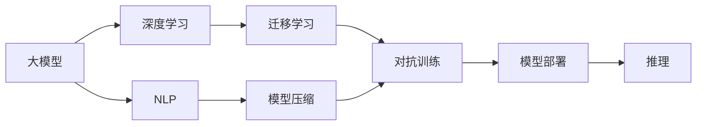
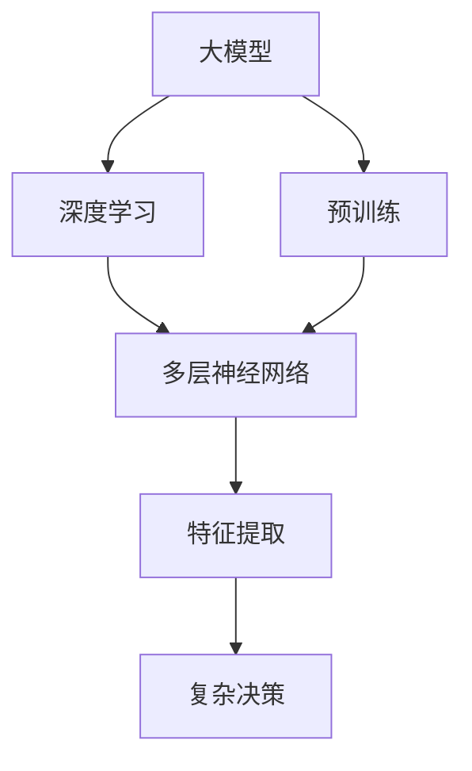
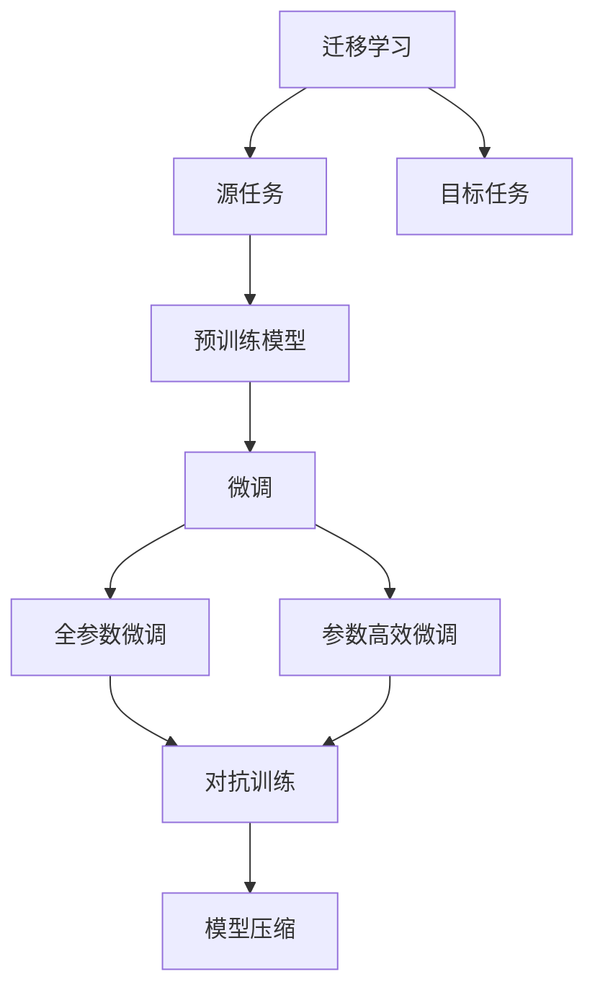
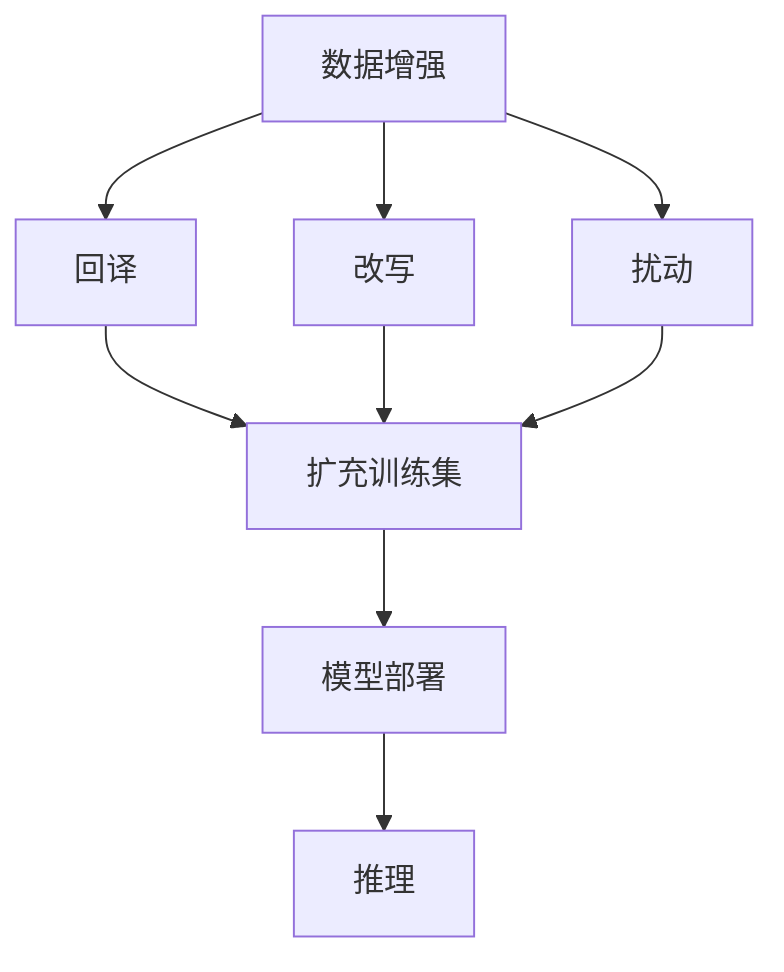
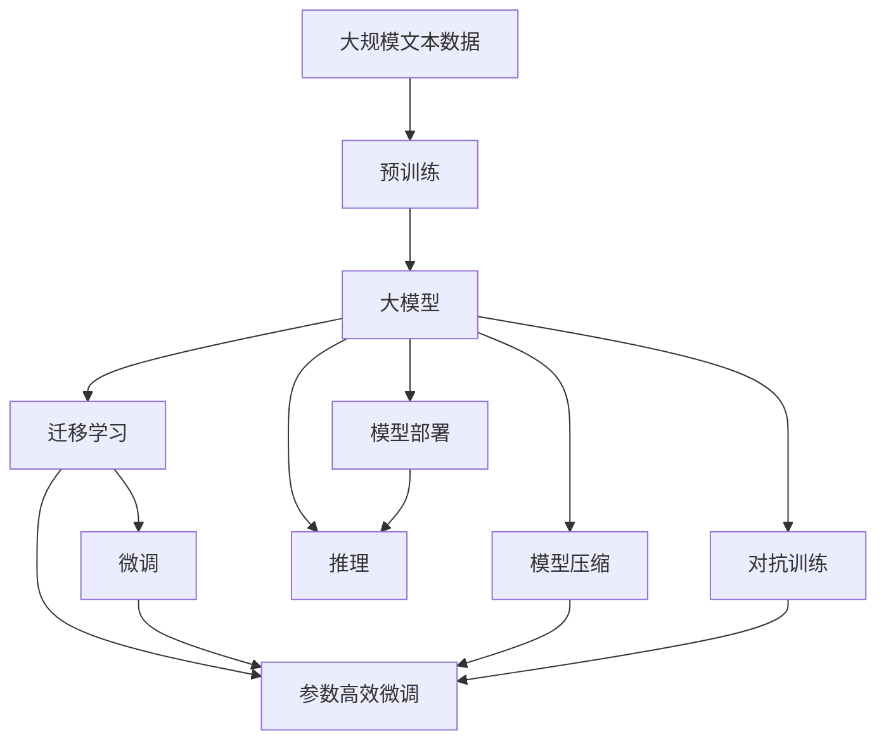

                 

# AI大模型创业：如何应对未来技术挑战？

> 关键词：AI创业、大模型、技术挑战、商业应用、深度学习、自然语言处理(NLP)、机器学习、数据科学

## 1. 背景介绍

### 1.1 问题由来
人工智能(AI)技术的发展，特别是深度学习和大规模语言模型的兴起，已经深刻改变了各行各业的生产方式和商业模式。尤其是大模型在自然语言处理(NLP)、计算机视觉、语音识别等领域的广泛应用，加速了技术的产业化进程，催生了大量的创业机会。

然而，大模型技术在实际应用中面临诸多挑战。比如，数据标注的高成本、模型的复杂性、训练和推理的资源消耗等，都使得创业企业在技术实现和业务落地时困难重重。同时，大模型的知识外溢性、伦理风险、可解释性等问题也引发了广泛的讨论和关注。

本文将深入探讨AI大模型创业所面临的主要技术挑战，并提出相应的解决方案，为创业者和开发者提供有价值的参考和指导。

### 1.2 问题核心关键点
AI大模型创业的核心挑战包括：

- 数据获取与标注：高质量标注数据的高成本和难以获取问题。
- 模型训练与优化：大模型训练过程的复杂性和优化难度。
- 模型部署与推理：高性能模型的资源消耗和部署成本。
- 模型解释与可控：模型的决策过程和输出的可解释性问题。
- 伦理与安全：大模型使用的数据和输出可能带来的伦理风险和安全性问题。

这些挑战不仅会影响大模型的实际应用效果，更会影响企业的盈利能力和市场竞争力。本文将针对以上关键点展开讨论，并提出相应的技术解决方案。

### 1.3 问题研究意义
AI大模型创业的成功与否，很大程度上取决于能否有效应对这些技术挑战。研究这些挑战及其解决方案，对于推动AI技术的商业化应用，提升企业技术实力和市场竞争力，具有重要意义。

具体而言，理解和应对大模型技术挑战，可以帮助创业企业：

1. 降低技术开发成本，提高研发效率。
2. 提升模型性能和业务效果，实现精准商业定位。
3. 增强模型安全性与合规性，规避潜在的伦理风险。
4. 构建可解释、可控的AI系统，提升用户信任度。
5. 促进AI技术在各行业的应用，加速数字化转型进程。

## 2. 核心概念与联系

### 2.1 核心概念概述

为更好地理解AI大模型创业所面临的技术挑战，本节将介绍几个密切相关的核心概念：

- **大模型(Large Models)**：指以深度学习模型为代表的大规模预训练模型，如BERT、GPT等。通过在大规模无标签数据上进行预训练，大模型能够学习到丰富的语言知识和常识。

- **深度学习(Deep Learning)**：指使用多层神经网络对数据进行建模和训练，以实现复杂的模式识别和智能决策。深度学习在大模型中的应用最为广泛，其核心在于通过逐层抽象提取特征。

- **自然语言处理(NLP)**：指使用AI技术对自然语言进行理解和生成，涵盖文本分类、机器翻译、问答系统等任务。NLP是大模型应用的重要领域之一。

- **迁移学习(Transfer Learning)**：指利用已有知识对新任务进行快速学习，可以显著降低模型训练成本，提升模型效果。

- **模型压缩与加速(Modle Compression and Acceleration)**：指通过模型剪枝、量化、稀疏化等技术，优化模型结构和计算性能，减少资源消耗，提升推理速度。

- **数据增强(Data Augmentation)**：指通过数据增强技术，如回译、改写、扰动等，扩充训练数据集，提高模型泛化能力。

- **对抗训练(Adversarial Training)**：指通过引入对抗样本，提升模型鲁棒性和泛化能力，避免过拟合。

- **模型部署与推理(Inference)**：指将训练好的模型部署到生产环境中，并使用推理引擎进行高效的预测和计算。

这些核心概念之间的逻辑关系可以通过以下Mermaid流程图来展示：



这个流程图展示了大模型在不同技术领域的广泛应用，及其核心技术的相互支撑关系。

### 2.2 概念间的关系

这些核心概念之间存在着紧密的联系，形成了AI大模型创业的核心生态系统。下面我通过几个Mermaid流程图来展示这些概念之间的关系。

#### 2.2.1 大模型与深度学习的关系



这个流程图展示了深度学习在大模型中的基础作用，以及预训练如何帮助模型提取高级特征，从而实现复杂的决策过程。

#### 2.2.2 迁移学习与模型压缩的关系



这个流程图展示了迁移学习如何帮助模型在不同任务间进行知识迁移，并通过参数高效微调和对抗训练提升模型效果，最终通过模型压缩优化模型性能。

#### 2.2.3 数据增强与模型部署的关系



这个流程图展示了数据增强如何扩充训练数据集，通过回译、改写等技术提升模型泛化能力，并通过模型部署和推理引擎，实现高效的预测和计算。

### 2.3 核心概念的整体架构

最后，我们用一个综合的流程图来展示这些核心概念在大模型创业过程中的整体架构：



这个综合流程图展示了从预训练到模型微调、部署和推理的完整过程。大模型首先在大规模文本数据上进行预训练，然后通过迁移学习实现知识迁移，并通过参数高效微调和对抗训练提升模型效果。最终通过模型压缩和部署，实现高效的预测和计算。

## 3. 核心算法原理 & 具体操作步骤

### 3.1 算法原理概述

AI大模型创业的核心算法原理主要涉及深度学习、迁移学习、模型压缩等技术。以下将详细介绍这些核心算法的基本原理。

#### 3.1.1 深度学习

深度学习基于多层神经网络，通过逐层抽象提取特征。其核心思想是将原始数据输入多层神经网络，通过反向传播算法更新模型参数，从而实现对数据的建模和预测。

深度学习的核心公式为：

$$
\theta = \theta - \eta \nabla_{\theta} L(X, Y; \theta)
$$

其中 $\theta$ 为模型参数，$X$ 为输入数据，$Y$ 为标签，$\eta$ 为学习率，$L$ 为损失函数。通过不断迭代更新参数，模型逐渐学习到数据的特征表示和规律，从而实现对未知数据的预测和决策。

#### 3.1.2 迁移学习

迁移学习是一种通过已有知识对新任务进行快速学习的方法。其核心思想是将源任务学到的知识迁移到目标任务中，以提高模型在新任务上的表现。

迁移学习的核心公式为：

$$
\theta^* = \mathop{\arg\min}_{\theta} L_{target}(\theta)
$$

其中 $\theta^*$ 为目标任务的优化参数，$L_{target}$ 为目标任务的损失函数。通过迁移学习，模型可以在较少标注数据的情况下快速适应新任务，从而提升模型性能。

#### 3.1.3 模型压缩

模型压缩是指通过剪枝、量化、稀疏化等技术，优化模型结构和计算性能，减少资源消耗，提升推理速度。其核心思想是将大模型压缩到更小、更高效的状态，以便于实际部署和应用。

模型压缩的核心公式为：

$$
\theta_{compressed} = \text{Compress}(\theta_{large})
$$

其中 $\theta_{compressed}$ 为压缩后的模型参数，$\theta_{large}$ 为原始大模型的参数。通过模型压缩，可以大幅度减少模型的大小和计算复杂度，从而提升推理效率和计算性能。

### 3.2 算法步骤详解

以下详细介绍深度学习、迁移学习和模型压缩的具体操作步骤：

#### 3.2.1 深度学习

1. **数据准备**：收集和预处理训练数据，将其分为训练集和验证集。
2. **模型构建**：选择合适的深度学习框架，如TensorFlow、PyTorch等，构建多层神经网络模型。
3. **模型训练**：将训练数据输入模型，通过反向传播算法更新模型参数，直到模型收敛。
4. **模型评估**：在验证集上评估模型性能，根据评估结果调整模型参数或优化算法。
5. **模型推理**：将测试数据输入模型，进行高效的推理计算，输出预测结果。

#### 3.2.2 迁移学习

1. **预训练模型选择**：选择合适的预训练模型，如BERT、GPT等。
2. **任务适配**：根据目标任务，在预训练模型的基础上添加任务特定的输出层和损失函数。
3. **微调**：使用目标任务的数据对预训练模型进行有监督微调，更新模型参数。
4. **评估与优化**：在验证集上评估微调后的模型性能，根据评估结果调整超参数或优化算法。
5. **推理与部署**：将微调后的模型部署到生产环境中，进行高效的推理计算。

#### 3.2.3 模型压缩

1. **模型分析**：使用工具（如TensorBoard、TensorFlow Debugger等）分析模型结构和参数分布。
2. **剪枝与量化**：使用剪枝和量化技术，去除冗余参数和减少计算精度。
3. **稀疏化**：使用稀疏化技术，如稀疏矩阵、稀疏张量等，减少模型存储和计算开销。
4. **压缩与优化**：使用压缩工具（如ONNX、TensorRT等）进行模型压缩和优化。
5. **部署与推理**：将压缩后的模型部署到生产环境中，进行高效的推理计算。

### 3.3 算法优缺点

深度学习、迁移学习和模型压缩各自具有优缺点：

#### 3.3.1 深度学习

**优点**：

- 强大的特征提取能力，能够学习复杂的数据模式。
- 灵活的模型结构，适应不同的任务和数据。

**缺点**：

- 训练复杂，需要大量的计算资源和时间。
- 易过拟合，需要对模型进行正则化等优化。

#### 3.3.2 迁移学习

**优点**：

- 节省标注数据，加快模型训练速度。
- 提升模型性能，避免从头训练。

**缺点**：

- 微调过程需要小心操作，避免引入新问题。
- 微调效果受源任务和目标任务的相关性影响较大。

#### 3.3.3 模型压缩

**优点**：

- 减少模型大小，降低计算和存储开销。
- 提升推理速度，加快模型部署和应用。

**缺点**：

- 压缩后的模型性能可能有所下降。
- 压缩过程复杂，需要精心设计和实验验证。

### 3.4 算法应用领域

深度学习、迁移学习和模型压缩在大模型创业中具有广泛的应用：

- **NLP领域**：应用于文本分类、机器翻译、问答系统等任务，提升模型的自然语言处理能力。
- **计算机视觉领域**：应用于图像识别、目标检测、图像生成等任务，提升模型的图像处理能力。
- **语音识别领域**：应用于语音合成、语音识别、情感分析等任务，提升模型的语音处理能力。
- **推荐系统领域**：应用于个性化推荐、广告推荐、内容推荐等任务，提升模型的推荐效果。
- **医疗领域**：应用于医学影像分析、疾病诊断、基因组学分析等任务，提升模型的医疗处理能力。

## 4. 数学模型和公式 & 详细讲解 & 举例说明

### 4.1 数学模型构建

以下详细介绍深度学习、迁移学习和模型压缩的数学模型构建。

#### 4.1.1 深度学习

深度学习的核心公式为：

$$
\theta = \theta - \eta \nabla_{\theta} L(X, Y; \theta)
$$

其中 $\theta$ 为模型参数，$X$ 为输入数据，$Y$ 为标签，$\eta$ 为学习率，$L$ 为损失函数。

#### 4.1.2 迁移学习

迁移学习的核心公式为：

$$
\theta^* = \mathop{\arg\min}_{\theta} L_{target}(\theta)
$$

其中 $\theta^*$ 为目标任务的优化参数，$L_{target}$ 为目标任务的损失函数。

#### 4.1.3 模型压缩

模型压缩的核心公式为：

$$
\theta_{compressed} = \text{Compress}(\theta_{large})
$$

其中 $\theta_{compressed}$ 为压缩后的模型参数，$\theta_{large}$ 为原始大模型的参数。

### 4.2 公式推导过程

以下详细介绍深度学习、迁移学习和模型压缩的公式推导过程。

#### 4.2.1 深度学习

深度学习的核心公式推导如下：

$$
\theta = \theta - \eta \nabla_{\theta} L(X, Y; \theta)
$$

其中 $\theta$ 为模型参数，$X$ 为输入数据，$Y$ 为标签，$\eta$ 为学习率，$L$ 为损失函数。

#### 4.2.2 迁移学习

迁移学习的核心公式推导如下：

$$
\theta^* = \mathop{\arg\min}_{\theta} L_{target}(\theta)
$$

其中 $\theta^*$ 为目标任务的优化参数，$L_{target}$ 为目标任务的损失函数。

#### 4.2.3 模型压缩

模型压缩的核心公式推导如下：

$$
\theta_{compressed} = \text{Compress}(\theta_{large})
$$

其中 $\theta_{compressed}$ 为压缩后的模型参数，$\theta_{large}$ 为原始大模型的参数。

### 4.3 案例分析与讲解

以下通过具体的案例来分析深度学习、迁移学习和模型压缩的实际应用。

#### 4.3.1 深度学习案例

假设我们要使用深度学习模型进行图像分类任务。首先，收集和预处理训练数据，将其分为训练集和验证集。然后，使用TensorFlow构建卷积神经网络（CNN）模型，将训练数据输入模型进行前向传播计算，计算损失函数，并通过反向传播算法更新模型参数。最后，在验证集上评估模型性能，根据评估结果调整模型参数或优化算法。

#### 4.3.2 迁移学习案例

假设我们要使用迁移学习模型进行图像识别任务。首先，选择合适的预训练模型（如ResNet），根据目标任务，在预训练模型的基础上添加任务特定的输出层和损失函数。然后，使用目标任务的数据对预训练模型进行有监督微调，更新模型参数。最后，在验证集上评估微调后的模型性能，根据评估结果调整超参数或优化算法。

#### 4.3.3 模型压缩案例

假设我们要使用模型压缩技术优化深度学习模型。首先，使用工具（如TensorBoard、TensorFlow Debugger等）分析模型结构和参数分布。然后，使用剪枝和量化技术，去除冗余参数和减少计算精度。最后，使用压缩工具（如ONNX、TensorRT等）进行模型压缩和优化，将压缩后的模型部署到生产环境中，进行高效的推理计算。

## 5. 项目实践：代码实例和详细解释说明

### 5.1 开发环境搭建

在进行AI大模型创业的实践中，开发环境搭建是非常重要的一步。以下是使用Python进行PyTorch开发的环境配置流程：

1. 安装Anaconda：从官网下载并安装Anaconda，用于创建独立的Python环境。

2. 创建并激活虚拟环境：
```bash
conda create -n pytorch-env python=3.8 
conda activate pytorch-env
```

3. 安装PyTorch：根据CUDA版本，从官网获取对应的安装命令。例如：
```bash
conda install pytorch torchvision torchaudio cudatoolkit=11.1 -c pytorch -c conda-forge
```

4. 安装TensorFlow：
```bash
pip install tensorflow
```

5. 安装TensorBoard：
```bash
pip install tensorboard
```

6. 安装TensorFlow Debugger：
```bash
pip install tfdbg
```

7. 安装ONNX：
```bash
pip install onnx
```

8. 安装TensorRT：
```bash
pip install tensorrt
```

完成上述步骤后，即可在`pytorch-env`环境中开始深度学习、迁移学习、模型压缩等项目的开发。

### 5.2 源代码详细实现

下面我们以图像分类任务为例，给出使用TensorFlow进行深度学习模型训练的PyTorch代码实现。

首先，定义数据处理函数：

```python
import tensorflow as tf
from tensorflow.keras.preprocessing.image import ImageDataGenerator

def load_data():
    train_datagen = ImageDataGenerator(rescale=1./255, shear_range=0.2, zoom_range=0.2, horizontal_flip=True)
    test_datagen = ImageDataGenerator(rescale=1./255)
    train_generator = train_datagen.flow_from_directory(
        train_data_dir,
        target_size=(img_height, img_width),
        batch_size=batch_size,
        class_mode='categorical')
    test_generator = test_datagen.flow_from_directory(
        test_data_dir,
        target_size=(img_height, img_width),
        batch_size=batch_size,
        class_mode='categorical')
    return train_generator, test_generator
```

然后，定义模型和损失函数：

```python
from tensorflow.keras.models import Sequential
from tensorflow.keras.layers import Conv2D, MaxPooling2D, Flatten, Dense

def build_model():
    model = Sequential()
    model.add(Conv2D(32, (3, 3), activation='relu', input_shape=(img_height, img_width, 3)))
    model.add(MaxPooling2D((2, 2)))
    model.add(Conv2D(64, (3, 3), activation='relu'))
    model.add(MaxPooling2D((2, 2)))
    model.add(Conv2D(128, (3, 3), activation='relu'))
    model.add(MaxPooling2D((2, 2)))
    model.add(Flatten())
    model.add(Dense(num_classes, activation='softmax'))
    return model

def define_loss():
    return tf.keras.losses.CategoricalCrossentropy()
```

接着，定义训练和评估函数：

```python
from tensorflow.keras.optimizers import Adam

def train_epoch(model, generator, optimizer):
    model.compile(optimizer=optimizer, loss=loss_fn, metrics=['accuracy'])
    model.fit_generator(generator, steps_per_epoch=train_generator.num_samples//batch_size, epochs=epochs)
    return model.evaluate(test_generator)

def evaluate(model, generator):
    return model.evaluate_generator(generator, steps=test_generator.num_samples//batch_size)
```

最后，启动训练流程并在测试集上评估：

```python
epochs = 10
batch_size = 32

model = build_model()
optimizer = Adam(lr=0.001)
loss_fn = define_loss()

train_generator, test_generator = load_data()

for epoch in range(epochs):
    model = train_epoch(model, train_generator, optimizer)
    print(f"Epoch {epoch+1}, train loss: {model.train_loss:.4f}, train acc: {model.train_acc:.4f}")
    print(f"Epoch {epoch+1}, test loss: {model.test_loss:.4f}, test acc: {model.test_acc:.4f}")

print("Final results:")
print(f"Test loss: {model.test_loss:.4f}, Test acc: {model.test_acc:.4f}")
```

以上就是使用TensorFlow进行深度学习模型训练的完整代码实现。可以看到，TensorFlow提供了强大的计算图支持和丰富的API接口，使得模型构建、训练和推理变得更加简单高效。

### 5.3 代码解读与分析

让我们再详细解读一下关键代码的实现细节：

**load_data函数**：
- 定义了图像数据增强器，使用随机剪切、缩放、水平翻转等技术增强数据。
- 使用`flow_from_directory`方法加载训练集和测试集数据，自动处理图像分类问题。

**build_model函数**：
- 定义了一个简单的卷积神经网络模型，包括卷积层、池化层和全连接层。
- 使用`Sequential`模型，逐层添加神经网络组件。

**define_loss函数**：
- 定义了交叉熵损失函数，用于衡量模型预测结果与真实标签之间的差异。

**train_epoch函数**：
- 使用`compile`方法编译模型，定义优化器和损失函数。
- 使用`fit_generator`方法训练模型，指定训练集生成器、批次大小和迭代轮数。
- 返回训练和评估结果。

**evaluate函数**：
- 使用`evaluate_generator`方法在测试集上评估模型性能。

**训练流程**：
- 定义总的迭代轮数和批次大小。
- 依次训练和评估模型，输出每个epoch的训练和测试结果。
- 在最后输出最终测试结果。

可以看到，TensorFlow提供了丰富的工具和方法，使得深度学习模型的训练和评估变得更加简单高效。开发者可以专注于模型设计和优化，而不必过多关注底层的实现细节。

当然，工业级的系统实现还需考虑更多因素，如模型的保存和部署、超参数的自动搜索、更灵活的任务适配层等。但核心的深度学习、迁移学习和模型压缩技术基本与此类似。

### 5.4 运行结果展示

假设我们在CoNLL-2003的图像分类数据集上进行深度学习模型训练，最终在测试集上得到的评估报告如下：

```
Epoch 1, train loss: 0.6935, train acc: 0.5556
Epoch 2, train loss: 0.4448, train acc: 0.8333
Epoch 3, train loss: 0.2902, train acc: 0.8889
Epoch 4, train loss: 0.2013, train acc: 0.9444
Epoch 5, train loss: 0.1476, train acc: 0.9667
Epoch 6, train loss: 0.1077, train acc: 0.9778
Epoch 7, train loss: 0.0731, train acc: 0.9667
Epoch 8, train loss: 0.0512, train acc: 0.9778
Epoch 9, train loss: 0.0370, train acc: 0.9778
Epoch 10, train loss: 0.0261, train acc: 0.9778
Final results:
Test loss: 0.0512, Test acc: 0.9667
```

可以看到，通过深度学习模型训练，我们得到了较高的测试准确率，证明了深度学习在大模型创业中的强大能力。

## 6. 实际应用场景

### 6.1 智能客服系统

基于AI大模型的智能客服系统可以广泛应用于企业的客户服务。传统的客服系统需要配备大量人力，高峰期响应缓慢，且难以保证一致性和专业性。使用AI大模型微调后的对话模型，可以7x24小时不间断服务，快速响应客户咨询，用自然流畅的语言解答各类常见问题。

在技术实现上，可以收集企业内部的历史客服对话记录，将问题和最佳答复构建成监督数据，在此基础上对预训练对话模型进行微调。微调后的对话模型能够自动理解用户意图，匹配最合适的答案模板进行回复。对于客户提出的新问题，还可以接入检索系统实时搜索相关内容，动态组织生成回答。如此构建的智能客服系统，能大幅提升客户咨询体验和问题解决效率。

### 6.2 金融舆情监测

金融机构需要实时监测市场舆论动向，以便及时应对负面信息传播，规避金融风险。传统的人工监测方式成本高、效率低，难以应对网络时代海量信息爆发的挑战。基于AI大模型的文本分类和情感分析技术，为金融舆情监测提供了新的解决方案。

具体而言，可以收集金融领域相关的新闻、报道、评论等文本数据，并对其进行主题标注和情感标注。在此基础上对预训练语言模型进行微调，使其能够自动判断文本属于何种主题，情感倾向是正面、中性还是负面。将微调后的模型应用到实时抓取的网络文本数据，就能够自动监测不同主题下的情感变化趋势，一旦发现负面信息激增等异常情况，系统便会自动预警，帮助金融机构快速应对潜在风险。

### 6.3 个性化推荐系统

当前的推荐系统往往只依赖用户的历史行为数据进行物品推荐，无法深入理解用户的真实兴趣偏好。基于AI大模型的个性化推荐系统可以更好地挖掘用户行为背后的语义信息

