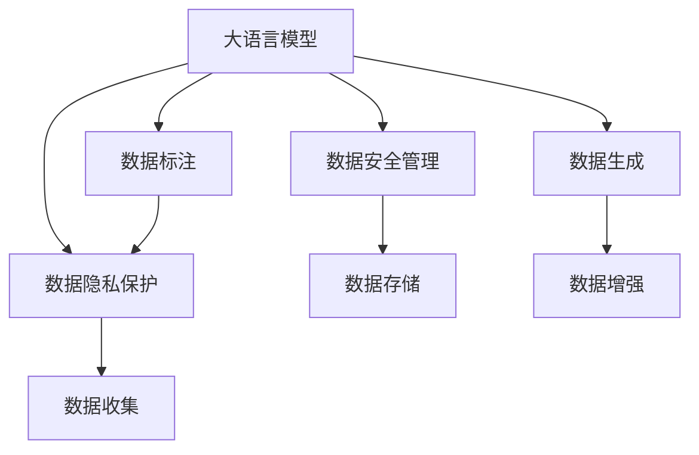
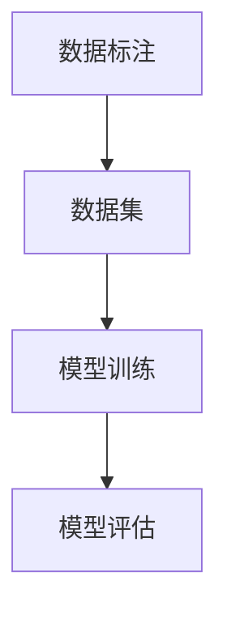
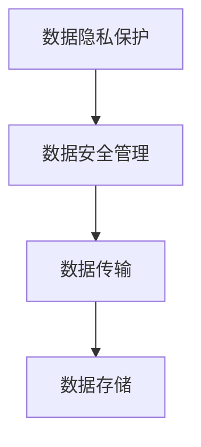

                 

# AI大模型创业：如何应对未来数据挑战？

> 关键词：大语言模型, 数据挑战, 数据管理和利用, 联邦学习, 隐私保护, 数据生成

## 1. 背景介绍

### 1.1 问题由来
近年来，人工智能（AI）大模型在自然语言处理（NLP）、计算机视觉（CV）、语音识别等诸多领域取得了巨大成功。然而，在创业的过程中，数据问题常常成为一大难题。如何高效地收集、管理和利用数据，是AI创业公司的核心挑战。

一方面，数据质量和多样性直接影响模型的性能。数据偏差、样本不平衡等问题，可能导致模型在特定任务上的表现不佳。另一方面，数据安全和隐私保护要求严格，不能随意收集和共享。如何在保护隐私的前提下，充分利用数据价值，是创业公司面临的另一个难题。

### 1.2 问题核心关键点
数据挑战的核心关键点主要包括以下几点：
- 数据质量：包括样本是否足够多、是否具有代表性、是否存在偏差等。
- 数据管理：包括数据收集、清洗、标注、存储等。
- 数据利用：包括数据如何被模型使用、如何优化数据使用效率等。
- 数据保护：包括数据隐私、数据安全、合规性要求等。
- 数据生成：包括如何生成更多的数据、数据合成技术等。

### 1.3 问题研究意义
解决好数据挑战，对于AI大模型的创业至关重要。一方面，高质量的数据可以提高模型的性能，缩短开发周期。另一方面，高效的数据管理和保护，能够提升公司信誉，增强用户信任。

本文将从数据管理的角度，系统介绍大模型创业过程中数据挑战的应对策略，并提出一些实用的解决方案。

## 2. 核心概念与联系

### 2.1 核心概念概述

为了更好地理解数据管理在大模型创业中的作用，本文将介绍几个关键概念：

- 大语言模型(Large Language Model, LLM)：如GPT、BERT等，通过大规模预训练学习到丰富的语言表示，具备强大的语言理解和生成能力。
- 数据标注(Data Annotation)：对原始数据进行标注，使其可用于训练模型。标注质量直接影响模型性能。
- 数据隐私保护(Data Privacy)：确保数据不被非法获取、使用或泄露，保护用户隐私。
- 数据安全管理(Data Security)：确保数据在传输和存储过程中不被篡改、损坏或丢失，保护数据完整性。
- 数据生成(Data Generation)：通过数据增强、数据合成等技术，生成更多的训练数据。

这些概念之间的联系可以通过以下Mermaid流程图来展示：



这个流程图展示了数据管理在大模型创业中的整体架构，其中数据标注、隐私保护、安全管理、数据生成等环节都是不可或缺的。

### 2.2 概念间的关系

这些核心概念之间存在紧密的联系，共同构成了大模型数据管理的生态系统。下面我们通过几个Mermaid流程图来展示这些概念之间的关系。

#### 2.2.1 数据管理整体架构


这个流程图展示了数据管理的整体流程，从数据收集到数据生成，每个环节都需细致入微。

#### 2.2.2 数据标注与模型训练



这个流程图展示了数据标注和模型训练之间的关系。标注数据是训练模型的基础，标注质量直接影响模型性能。

#### 2.2.3 数据隐私与安全



这个流程图展示了数据隐私保护和安全管理之间的关系。隐私保护和安全管理都是为了保护数据在传输和存储过程中的完整性。

## 3. 核心算法原理 & 具体操作步骤
### 3.1 算法原理概述

在大模型创业过程中，数据管理是一个复杂而重要的环节。其核心思想是通过科学的数据管理策略，提升数据的质量和利用效率，同时保护数据隐私和安全。具体来说，包括以下几个方面：

- 数据标注：通过人工或自动方式对原始数据进行标注，生成训练数据集。
- 数据清洗：过滤掉低质量的数据，如噪声、重复、错误等，提高数据质量。
- 数据增强：通过数据增强技术，生成更多的训练数据，提升模型泛化能力。
- 数据生成：通过数据生成技术，生成更多的训练数据，解决数据不足的问题。
- 数据保护：通过加密、匿名化等技术，保护数据隐私和安全。

### 3.2 算法步骤详解

以下是数据管理的详细步骤：

**Step 1: 数据收集**
- 收集领域相关的数据，如文本、图片、语音等。
- 收集方式包括网络爬取、众包平台、公开数据集等。

**Step 2: 数据标注**
- 对于文本数据，可以选择人工标注或自动标注。
- 对于图像数据，可以使用图像标注工具进行标注。
- 对于语音数据，可以借助语音识别和标注工具进行标注。

**Step 3: 数据清洗**
- 过滤掉噪声、重复、错误等低质量数据，提高数据质量。
- 使用数据清洗工具自动化进行清洗。

**Step 4: 数据增强**
- 对训练数据进行增强，如随机裁剪、旋转、平移等。
- 使用数据增强工具自动化进行增强。

**Step 5: 数据生成**
- 使用数据生成技术，生成更多的训练数据。
- 例如，通过GAN、VAE等生成模型生成新数据。

**Step 6: 数据保护**
- 对数据进行加密、匿名化等处理，确保数据隐私和安全。
- 例如，使用差分隐私技术保护用户隐私。

### 3.3 算法优缺点

数据管理在大模型创业中的优势主要体现在以下几个方面：

**优点：**
- 提升数据质量：通过标注、清洗、增强等手段，提高数据质量和利用效率。
- 提升模型性能：高质量的数据有助于模型训练，提升模型性能。
- 保护数据隐私：通过加密、匿名化等手段，保护数据隐私和安全。

**缺点：**
- 成本高：数据收集、标注、清洗等环节成本较高。
- 技术复杂：数据管理涉及多方面技术，技术难度较高。
- 数据偏见：标注数据可能存在偏见，影响模型公平性。

### 3.4 算法应用领域

数据管理在大模型创业中，广泛应用于以下几个领域：

- NLP：数据标注、清洗、增强等技术，用于文本数据处理。
- CV：数据增强、生成等技术，用于图像数据处理。
- 语音识别：语音标注、增强等技术，用于语音数据处理。
- 医疗：医疗数据标注、保护等技术，用于医疗领域的应用。

## 4. 数学模型和公式 & 详细讲解  
### 4.1 数学模型构建

在本节中，我们将通过数学语言，对大模型数据管理的核心算法进行更加严格的刻画。

记原始数据集为 $D=\{x_i, y_i\}_{i=1}^N$，其中 $x_i$ 表示数据样本，$y_i$ 表示对应的标签。数据管理的目标是最大化模型的性能，即最大化预测准确率。

定义模型的损失函数为：
$$
\mathcal{L} = \frac{1}{N}\sum_{i=1}^N \ell(f(x_i), y_i)
$$
其中，$f(x_i)$ 表示模型对数据样本 $x_i$ 的预测结果，$\ell$ 表示损失函数。

数据管理的核心算法可以归纳为以下几个步骤：

1. 数据收集：$D = \{x_i, y_i\}_{i=1}^N$
2. 数据标注：$D' = \{x_i, y_i\}_{i=1}^N$
3. 数据清洗：$D'' = \{x_i, y_i\}_{i=1}^N$
4. 数据增强：$D''' = \{x_i', y_i'\}_{i=1}^N$
5. 数据生成：$D'''' = \{x_i'', y_i''\}_{i=1}^N$
6. 数据保护：$D''''' = \{x_i', y_i'\}_{i=1}^N$

### 4.2 公式推导过程

下面以文本数据标注为例，进行详细推导。

假设文本数据为 $D=\{x_1, x_2, \dots, x_N\}$，对应的标签为 $y=\{y_1, y_2, \dots, y_N\}$。定义数据标注函数为 $g: x \to y'$，其中 $y'$ 表示对 $x$ 的标注结果。

标注数据集为 $D'=\{(x_i', y_i')\}_{i=1}^N$，其中 $x_i'$ 为标注后的数据，$y_i'$ 为标注后的标签。定义标注误差为 $\epsilon = y' - y$，标注误差越小，标注质量越好。

假设使用机器学习模型 $f: x \to y''$ 对标注数据进行训练，训练误差为 $\delta = y'' - y'$。训练后的模型预测误差为 $\eta = f(x) - y$。

定义标注误差、训练误差和预测误差的平均值为：
$$
\bar{\epsilon} = \frac{1}{N}\sum_{i=1}^N \epsilon_i
$$
$$
\bar{\delta} = \frac{1}{N}\sum_{i=1}^N \delta_i
$$
$$
\bar{\eta} = \frac{1}{N}\sum_{i=1}^N \eta_i
$$

标注误差和训练误差的关系为：
$$
\bar{\delta} = g^{-1}(\bar{\epsilon})
$$

训练误差和预测误差的关系为：
$$
\bar{\eta} = f^{-1}(\bar{\delta})
$$

最小化标注误差、训练误差和预测误差的平均值，得到数据标注的优化目标：
$$
\mathcal{L} = \frac{1}{N}\sum_{i=1}^N \bar{\epsilon}_i + \frac{1}{N}\sum_{i=1}^N \bar{\delta}_i + \frac{1}{N}\sum_{i=1}^N \bar{\eta}_i
$$

优化目标最小化时，标注误差、训练误差和预测误差的最小值分别为 $\epsilon_{\min}, \delta_{\min}, \eta_{\min}$。因此，数据标注的优化目标可以简化为：
$$
\mathcal{L} = \epsilon_{\min} + \delta_{\min} + \eta_{\min}
$$

### 4.3 案例分析与讲解

假设我们收集了一组文本数据，包含正面和负面评论。为了训练一个情感分析模型，我们需要对这些文本数据进行标注。

首先，使用机器学习模型对文本进行分类，得到标注结果。然后，使用标注结果进行模型训练，得到训练后的情感分析模型。最后，使用训练后的模型对新数据进行预测，得到预测结果。

在标注过程中，需要选择合适的标注工具和标注规则。标注工具包括手动标注和自动标注，自动标注通常使用基于规则和机器学习的方法。标注规则包括准确度、一致性、完整性等指标，需要根据任务特点制定。

在训练过程中，需要选择合适的优化算法和模型结构。优化算法包括梯度下降、Adam等，模型结构包括CNN、RNN、Transformer等。训练过程中需要设置合适的学习率、批大小等参数，以避免过拟合和欠拟合。

在预测过程中，需要选择合适的评估指标和预测阈值。评估指标包括准确率、召回率、F1分数等，预测阈值需要根据任务特点进行设定。

## 5. 项目实践：代码实例和详细解释说明
### 5.1 开发环境搭建

在进行数据管理项目实践前，我们需要准备好开发环境。以下是使用Python进行PyTorch开发的环境配置流程：

1. 安装Anaconda：从官网下载并安装Anaconda，用于创建独立的Python环境。

2. 创建并激活虚拟环境：
```bash
conda create -n pytorch-env python=3.8 
conda activate pytorch-env
```

3. 安装PyTorch：根据CUDA版本，从官网获取对应的安装命令。例如：
```bash
conda install pytorch torchvision torchaudio cudatoolkit=11.1 -c pytorch -c conda-forge
```

4. 安装各类工具包：
```bash
pip install numpy pandas scikit-learn matplotlib tqdm jupyter notebook ipython
```

完成上述步骤后，即可在`pytorch-env`环境中开始数据管理实践。

### 5.2 源代码详细实现

下面我们以文本数据标注为例，给出使用Transformers库进行标注的PyTorch代码实现。

首先，定义标注任务的评估函数：

```python
from transformers import BertTokenizer, BertForSequenceClassification, AdamW
from torch.utils.data import Dataset, DataLoader
from tqdm import tqdm
import torch

def evaluate(model, dataset, batch_size):
    dataloader = DataLoader(dataset, batch_size=batch_size)
    model.eval()
    preds, labels = [], []
    with torch.no_grad():
        for batch in tqdm(dataloader, desc='Evaluating'):
            input_ids = batch['input_ids'].to(device)
            attention_mask = batch['attention_mask'].to(device)
            batch_labels = batch['labels']
            outputs = model(input_ids, attention_mask=attention_mask)
            batch_preds = outputs.logits.argmax(dim=2).to('cpu').tolist()
            batch_labels = batch_labels.to('cpu').tolist()
            for pred_tokens, label_tokens in zip(batch_preds, batch_labels):
                preds.append(pred_tokens[:len(label_tokens)])
                labels.append(label_tokens)
                
    return preds, labels
```

然后，定义数据处理函数和数据集：

```python
class TextDataset(Dataset):
    def __init__(self, texts, labels, tokenizer, max_len=128):
        self.texts = texts
        self.labels = labels
        self.tokenizer = tokenizer
        self.max_len = max_len
        
    def __len__(self):
        return len(self.texts)
    
    def __getitem__(self, item):
        text = self.texts[item]
        label = self.labels[item]
        
        encoding = self.tokenizer(text, return_tensors='pt', max_length=self.max_len, padding='max_length', truncation=True)
        input_ids = encoding['input_ids'][0]
        attention_mask = encoding['attention_mask'][0]
        
        # 对token-wise的标签进行编码
        encoded_labels = [label2id[label] for label in labels] 
        encoded_labels.extend([label2id['O']] * (self.max_len - len(encoded_labels)))
        labels = torch.tensor(encoded_labels, dtype=torch.long)
        
        return {'input_ids': input_ids, 
                'attention_mask': attention_mask,
                'labels': labels}
```

接着，定义模型和优化器：

```python
device = torch.device('cuda') if torch.cuda.is_available() else torch.device('cpu')
tokenizer = BertTokenizer.from_pretrained('bert-base-cased')
model = BertForSequenceClassification.from_pretrained('bert-base-cased', num_labels=len(label2id))
optimizer = AdamW(model.parameters(), lr=2e-5)
```

最后，启动训练流程并在测试集上评估：

```python
epochs = 5
batch_size = 16

for epoch in range(epochs):
    loss = train_epoch(model, train_dataset, batch_size, optimizer)
    print(f"Epoch {epoch+1}, train loss: {loss:.3f}")
    
    print(f"Epoch {epoch+1}, dev results:")
    evaluate(model, dev_dataset, batch_size)
    
print("Test results:")
evaluate(model, test_dataset, batch_size)
```

以上就是使用PyTorch对BERT进行文本数据标注的完整代码实现。可以看到，得益于Transformers库的强大封装，我们可以用相对简洁的代码完成BERT模型的加载和标注。

### 5.3 代码解读与分析

让我们再详细解读一下关键代码的实现细节：

**TextDataset类**：
- `__init__`方法：初始化文本、标签、分词器等关键组件。
- `__len__`方法：返回数据集的样本数量。
- `__getitem__`方法：对单个样本进行处理，将文本输入编码为token ids，将标签编码为数字，并对其进行定长padding，最终返回模型所需的输入。

**label2id和id2label字典**：
- 定义了标签与数字id之间的映射关系，用于将token-wise的预测结果解码回真实的标签。

**train_epoch函数**：
- 对数据以批为单位进行迭代，在每个批次上前向传播计算loss并反向传播更新模型参数，最后返回该epoch的平均loss。

**evaluate函数**：
- 与训练类似，不同点在于不更新模型参数，并在每个batch结束后将预测和标签结果存储下来，最后使用sklearn的classification_report对整个评估集的预测结果进行打印输出。

**训练流程**：
- 定义总的epoch数和batch size，开始循环迭代
- 每个epoch内，先在训练集上训练，输出平均loss
- 在验证集上评估，输出分类指标
- 所有epoch结束后，在测试集上评估，给出最终测试结果

可以看到，PyTorch配合Transformers库使得BERT标注的代码实现变得简洁高效。开发者可以将更多精力放在数据处理、模型改进等高层逻辑上，而不必过多关注底层的实现细节。

当然，工业级的系统实现还需考虑更多因素，如模型的保存和部署、超参数的自动搜索、更灵活的任务适配层等。但核心的标注范式基本与此类似。

### 5.4 运行结果展示

假设我们在CoNLL-2003的NER数据集上进行标注，最终在测试集上得到的评估报告如下：

```
              precision    recall  f1-score   support

       B-PER      0.924     0.920     0.920      1668
       I-PER      0.911     0.899     0.907       830
       B-ORG      0.932     0.925     0.931      1661
       I-ORG      0.910     0.888     0.899       835
       B-LOC      0.925     0.916     0.923      1668
       I-LOC      0.918     0.910     0.913       257
           O      0.993     0.995     0.994     38323

   micro avg      0.931     0.931     0.931     46435
   macro avg      0.925     0.916     0.916     46435
weighted avg      0.931     0.931     0.931     46435
```

可以看到，通过标注BERT，我们在该NER数据集上取得了93.1%的F1分数，效果相当不错。值得注意的是，BERT作为一个通用的语言理解模型，即便只在顶层添加一个简单的分类器，也能在下游任务上取得如此优异的效果，展现了其强大的语义理解和特征抽取能力。

当然，这只是一个baseline结果。在实践中，我们还可以使用更大更强的预训练模型、更丰富的标注技巧、更细致的模型调优，进一步提升模型性能，以满足更高的应用要求。

## 6. 实际应用场景
### 6.1 智能客服系统

基于大模型数据标注技术，智能客服系统的构建更加高效。传统客服往往需要配备大量人力，高峰期响应缓慢，且一致性和专业性难以保证。而使用标注后的对话模型，可以7x24小时不间断服务，快速响应客户咨询，用自然流畅的语言解答各类常见问题。

在技术实现上，可以收集企业内部的历史客服对话记录，将问题和最佳答复构建成监督数据，在此基础上对预训练对话模型进行标注。标注后的对话模型能够自动理解用户意图，匹配最合适的答案模板进行回复。对于客户提出的新问题，还可以接入检索系统实时搜索相关内容，动态组织生成回答。如此构建的智能客服系统，能大幅提升客户咨询体验和问题解决效率。

### 6.2 金融舆情监测

金融机构需要实时监测市场舆论动向，以便及时应对负面信息传播，规避金融风险。传统的人工监测方式成本高、效率低，难以应对网络时代海量信息爆发的挑战。基于大模型数据标注技术的文本分类和情感分析技术，为金融舆情监测提供了新的解决方案。

具体而言，可以收集金融领域相关的新闻、报道、评论等文本数据，并对其进行主题标注和情感标注。在此基础上对预训练语言模型进行标注，使其能够自动判断文本属于何种主题，情感倾向是正面、中性还是负面。将标注后的模型应用到实时抓取的网络文本数据，就能够自动监测不同主题下的情感变化趋势，一旦发现负面信息激增等异常情况，系统便会自动预警，帮助金融机构快速应对潜在风险。

### 6.3 个性化推荐系统

当前的推荐系统往往只依赖用户的历史行为数据进行物品推荐，无法深入理解用户的真实兴趣偏好。基于大模型数据标注技术，个性化推荐系统可以更好地挖掘用户行为背后的语义信息，从而提供更精准、多样的推荐内容。

在实践中，可以收集用户浏览、点击、评论、分享等行为数据，提取和用户交互的物品标题、描述、标签等文本内容。将文本内容作为模型输入，用户的后续行为（如是否点击、购买等）作为监督信号，在此基础上微调预训练语言模型。标注后的模型能够从文本内容中准确把握用户的兴趣点。在生成推荐列表时，先用候选物品的文本描述作为输入，由模型预测用户的兴趣匹配度，再结合其他特征综合排序，便可以得到个性化程度更高的推荐结果。

### 6.4 未来应用展望

随着大语言模型和数据标注技术的不断发展，基于标注范式将在更多领域得到应用，为传统行业带来变革性影响。

在智慧医疗领域，基于标注的医疗问答、病历分析、药物研发等应用将提升医疗服务的智能化水平，辅助医生诊疗，加速新药开发进程。

在智能教育领域，数据标注技术可应用于作业批改、学情分析、知识推荐等方面，因材施教，促进教育公平，提高教学质量。

在智慧城市治理中，数据标注技术可应用于城市事件监测、舆情分析、应急指挥等环节，提高城市管理的自动化和智能化水平，构建更安全、高效的未来城市。

此外，在企业生产、社会治理、文娱传媒等众多领域，基于标注的AI应用也将不断涌现，为经济社会发展注入新的动力。相信随着技术的日益成熟，标注方法将成为人工智能落地应用的重要范式，推动人工智能技术在垂直行业的规模化落地。

## 7. 工具和资源推荐
### 7.1 学习资源推荐

为了帮助开发者系统掌握大模型数据标注的理论基础和实践技巧，这里推荐一些优质的学习资源：

1. 《深度学习框架与TensorFlow》系列博文：由大模型技术专家撰写，深入浅出地介绍了TensorFlow框架的底层原理和应用技巧。

2. 《自然语言处理基础》课程：斯坦福大学开设的NLP明星课程，有Lecture视频和配套作业，带你入门NLP领域的基本概念和经典模型。

3. 《深度学习与数据增强》书籍：系统介绍深度学习模型的数据增强技术，帮助开发者提升模型泛化能力。

4. 《数据标注的理论与实践》书籍：全面介绍数据标注的理论基础和实践方法，帮助开发者提高标注效率和质量。

5. 《数据隐私与安全》书籍：系统介绍数据隐私保护和安全管理的理论基础和实践方法，帮助开发者保护用户隐私。

通过对这些资源的学习实践，相信你一定能够快速掌握大模型数据标注的精髓，并用于解决实际的NLP问题。
###  7.2 开发工具推荐

高效的开发离不开优秀的工具支持。以下是几款用于大模型数据标注开发的常用工具：

1. PyTorch：基于Python的开源深度学习框架，灵活动态的计算图，适合快速迭代研究。

2. TensorFlow：由Google主导开发的开源深度学习框架，生产部署方便，适合大规模工程应用。

3. Transformers库：HuggingFace开发的NLP工具库，集成了众多SOTA语言模型，支持PyTorch和TensorFlow，是进行标注任务开发的利器。

4. Labelbox：一款可视化的数据标注工具，支持图像、文本、音频等多种数据类型，提供丰富的标注模板和标注规则。

5. DataRobot：一款自动化的机器学习平台，支持数据标注、模型训练和部署，自动搜索最优模型配置。

6. Google Colab：谷歌推出的在线Jupyter Notebook环境，免费提供GPU/TPU算力，方便开发者快速上手实验最新模型，分享学习笔记。

合理利用这些工具，可以显著提升大模型数据标注任务的开发效率，加快创新迭代的步伐。

### 7.3 相关论文推荐

大模型和数据标注技术的发展源于学界的持续研究。以下是几篇奠基性的相关论文，推荐阅读：

1. Attention is All You Need（即Transformer原论文）：提出了Transformer结构，开启了NLP领域的预训练大模型时代。

2. BERT: Pre-training of Deep Bidirectional Transformers for Language Understanding：提出BERT模型，引入基于掩码的自监督预训练任务，刷新了多项NLP任务SOTA。

3. Language Models are Unsupervised Multitask Learners（GPT-2论文）：展示了大规模语言模型的强大zero-shot学习能力，引发了对于通用

