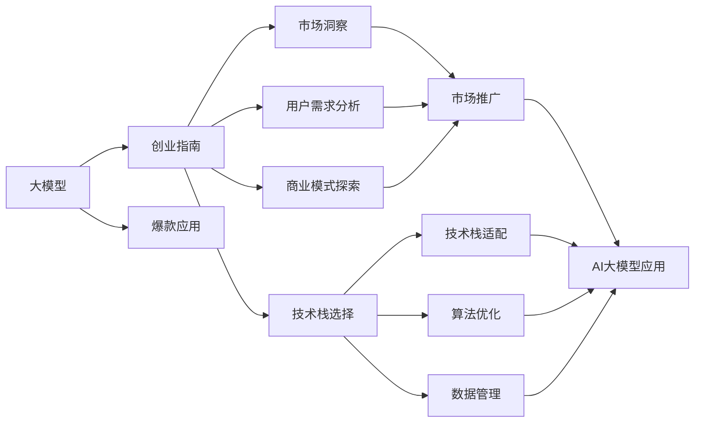

                 

# AI大模型创业：如何打造未来爆款应用？

> 关键词：
    - AI大模型
    - 创业指南
    - 爆款应用
    - 技术栈选择
    - 市场洞察
    - 用户需求分析
    - 商业模式探索
    - 技术栈适配
    - 算法优化
    - 数据管理
    - 市场推广

## 1. 背景介绍

在人工智能(AI)领域，特别是深度学习领域，大模型大放异彩，推动了诸多技术突破和应用创新。大模型不仅在学术研究上展现出了巨大的潜力，也在工业应用中取得了显著成果。从图像识别、语音识别到自然语言处理、医疗诊断，大模型无处不在，深刻影响着我们的生产和生活方式。

然而，如何从大模型的研发、应用到商业模式的全链条中进行创业，打造出真正具有市场竞争力的爆款应用，却是一个复杂而充满挑战的问题。本文将从背景介绍、核心概念与联系、核心算法原理与操作步骤、数学模型与公式、项目实践、应用场景、工具和资源推荐、总结与展望、常见问题与解答等多个方面，全面系统地探讨AI大模型创业的方方面面，为你提供深入的行业洞察和实用的创业指导。

## 2. 核心概念与联系

### 2.1 核心概念概述

- **大模型（Large Models）**：指具有大规模参数、能够在特定任务上实现高精度预测的深度学习模型。例如，GPT系列、BERT、ResNet等。

- **创业指南（Startup Guide）**：一套详细指导AI大模型创业者如何进行项目规划、技术开发、市场拓展的系统性策略和步骤。

- **爆款应用（Breakthrough Applications）**：在特定市场或领域内，能够迅速普及并实现广泛应用的成功产品或服务。

- **技术栈选择（Tech Stack Selection）**：选择和整合多种技术工具和框架，以构建高效、可维护的AI大模型应用。

- **市场洞察（Market Insights）**：对目标市场进行深入分析，了解市场需求、竞争态势和潜在用户需求。

- **用户需求分析（User Needs Analysis）**：通过问卷调查、用户访谈等手段，收集和分析用户反馈，了解用户真实需求。

- **商业模式探索（Business Model Exploration）**：根据市场洞察和用户需求分析，探索符合市场环境的商业模式，如SaaS、PaaS、BaaS等。

- **技术栈适配（Tech Stack Adaptation）**：根据商业模式和应用需求，选择合适的技术工具和框架，并适配其开发流程。

- **算法优化（Algorithm Optimization）**：通过算法改进和优化，提升模型性能，减少资源消耗。

- **数据管理（Data Management）**：收集、存储和处理大模型训练和应用所需的数据，保证数据质量和安全。

- **市场推广（Market Promotion）**：通过营销、广告、合作伙伴等手段，提高产品知名度和市场份额。

### 2.2 核心概念之间的关系

下图展示了这些核心概念之间的联系，通过一个简单的流程图展示了它们相互依赖和支持的关系：



通过这张流程图，我们可以看到，AI大模型创业是一个复杂而系统性的工程，涉及从模型开发到应用推广的多个环节。每个环节都需要精细化设计和管理，才能最终打造出市场认可的爆款应用。

## 3. 核心算法原理 & 具体操作步骤

### 3.1 算法原理概述

AI大模型创业的核心算法原理涉及从数据处理、模型训练到应用部署的全过程。以下是几个关键步骤的概述：

1. **数据收集与预处理**：从多个渠道收集数据，包括公共数据集、用户数据、第三方数据等，并进行清洗、标注和分治处理，以保证数据质量和多样性。

2. **模型选择与训练**：根据应用需求和数据特征，选择适合的模型结构，并进行预训练和微调，以获得高精度的模型参数。

3. **算法优化**：通过优化算法（如梯度下降、动量、Adagrad等）和优化器（如Adam、RMSprop等），提升模型训练效率和精度。

4. **应用部署与优化**：将训练好的模型部署到生产环境，并通过算法优化（如剪枝、量化、蒸馏等），提升模型推理效率和资源利用率。

### 3.2 算法步骤详解

以下是详细的算法步骤，每个步骤都将在后续章节中详细介绍：

1. **数据收集与预处理**：
   - 确定数据收集渠道和数据格式。
   - 进行数据清洗和标注。
   - 分治数据集，保证数据的多样性和代表性。

2. **模型选择与训练**：
   - 选择合适的预训练模型，如BERT、GPT等。
   - 进行微调，优化模型性能。
   - 进行算法优化，提升训练效率和精度。

3. **应用部署与优化**：
   - 将模型部署到生产环境。
   - 进行推理加速，如剪枝、量化、蒸馏等。
   - 进行实时监控和反馈优化，保证模型性能和稳定性。

### 3.3 算法优缺点

大模型创业中的算法有以下优点和缺点：

**优点**：
- **高精度**：大模型具备高精度的预测能力，能够在特定任务上实现卓越的性能。
- **泛化能力强**：大模型能够处理多样化的数据，具有良好的泛化能力。
- **开发效率高**：使用大模型可以大幅度提高模型开发效率，缩短产品上市时间。

**缺点**：
- **资源消耗大**：大模型需要大量的计算资源和存储资源，初期投入成本较高。
- **过拟合风险高**：大模型容易过拟合，需要严格控制超参数和训练过程。
- **应用场景局限**：大模型在特定领域的应用效果显著，但在非主流领域可能效果一般。

### 3.4 算法应用领域

大模型技术在多个领域都有广泛应用，以下是一些典型的应用场景：

- **医疗诊断**：通过自然语言处理和图像识别技术，帮助医生进行疾病诊断和治疗方案推荐。
- **金融风控**：利用大模型进行信用评估、欺诈检测、投资策略优化等。
- **智能客服**：通过聊天机器人，提供24小时不间断的客户服务，提升用户体验。
- **智能推荐**：根据用户行为和兴趣，推荐个性化的产品和服务。
- **教育培训**：通过智能答疑和个性化教学，提升学习效果和效率。

这些应用场景展示了AI大模型的广泛应用前景，也为AI大模型创业者提供了丰富的选择和方向。

## 4. 数学模型和公式 & 详细讲解 & 举例说明

### 4.1 数学模型构建

在AI大模型的创业过程中，数学模型和公式起到了至关重要的作用。以下是构建数学模型的基本步骤：

1. **模型选择**：根据应用需求，选择合适的模型结构，如CNN、RNN、Transformer等。

2. **损失函数设计**：根据任务类型，设计合适的损失函数，如交叉熵损失、均方误差损失等。

3. **优化目标**：最小化损失函数，以获得最优的模型参数。

4. **算法优化**：选择合适的优化算法和优化器，如Adam、SGD等。

### 4.2 公式推导过程

以交叉熵损失函数为例，其推导过程如下：

设输入为 $x$，输出为 $y$，模型预测为 $\hat{y}$，则交叉熵损失函数定义为：

$$
\ell(y, \hat{y}) = -\sum_{i=1}^{n} y_i \log \hat{y}_i
$$

其中 $n$ 为样本数量，$y_i$ 为真实标签，$\hat{y}_i$ 为模型预测。

通过最小化损失函数，可以更新模型参数，使模型预测更加接近真实标签。

### 4.3 案例分析与讲解

假设我们要开发一个智能推荐系统，可以使用大模型进行用户行为分析和推荐算法优化。具体步骤包括：

1. **数据收集**：收集用户浏览、购买、评价等数据。
2. **模型选择**：选择BERT等大模型进行用户行为分析。
3. **训练优化**：对大模型进行微调，优化推荐算法。
4. **应用部署**：将训练好的模型部署到推荐引擎中，实现个性化推荐。

## 5. 项目实践：代码实例和详细解释说明

### 5.1 开发环境搭建

为了顺利进行AI大模型创业，需要搭建良好的开发环境。以下是一些推荐的开发环境搭建步骤：

1. **选择开发平台**：如AWS、Azure、Google Cloud等，根据需求选择适合的云平台。
2. **安装开发工具**：如Jupyter Notebook、PyTorch、TensorFlow等，安装并配置好。
3. **数据管理**：搭建数据湖或数据仓库，实现数据的集中管理和高效查询。
4. **版本控制**：使用Git等版本控制工具，管理代码和数据版本。

### 5.2 源代码详细实现

以下是一个智能推荐系统的代码实现示例：

```python
import torch
import torch.nn as nn
from torch.utils.data import DataLoader
from transformers import BertModel, BertTokenizer
from sklearn.metrics import precision_score, recall_score, f1_score

class BERTRecommender(nn.Module):
    def __init__(self, num_labels):
        super(BERTRecommender, self).__init__()
        self.bert = BertModel.from_pretrained('bert-base-uncased')
        self.classifier = nn.Linear(768, num_labels)

    def forward(self, input_ids, attention_mask):
        output = self.bert(input_ids, attention_mask=attention_mask)
        logits = self.classifier(output.pooler_output)
        return logits

# 数据准备
tokenizer = BertTokenizer.from_pretrained('bert-base-uncased')
train_dataset = ...
dev_dataset = ...
test_dataset = ...

# 模型初始化
model = BERTRecommender(num_labels)

# 训练和评估
optimizer = torch.optim.Adam(model.parameters(), lr=1e-5)
for epoch in range(10):
    for batch in train_loader:
        input_ids = batch['input_ids'].to(device)
        attention_mask = batch['attention_mask'].to(device)
        targets = batch['targets'].to(device)
        optimizer.zero_grad()
        outputs = model(input_ids, attention_mask)
        loss = nn.CrossEntropyLoss()(outputs, targets)
        loss.backward()
        optimizer.step()
    # 在验证集上评估
    dev_preds, dev_labels = dev_loader
    dev_logits = model(dev_preds['input_ids'], dev_preds['attention_mask'])
    dev_scores = precision_score(dev_labels, torch.argmax(dev_logits, dim=1))
    print(f"Epoch {epoch+1}, dev precision: {dev_scores:.4f}")

# 测试和部署
test_preds, test_labels = test_loader
test_logits = model(test_preds['input_ids'], test_preds['attention_mask'])
test_scores = precision_score(test_labels, torch.argmax(test_logits, dim=1))
print(f"Test precision: {test_scores:.4f}")
```

### 5.3 代码解读与分析

上述代码实现了基于BERT的智能推荐系统，关键步骤包括：

1. **模型定义**：使用BertModel作为基础模型，添加线性分类器作为输出层。
2. **数据处理**：使用BertTokenizer对文本数据进行分词和编码。
3. **模型训练**：使用Adam优化器进行梯度下降，更新模型参数。
4. **模型评估**：在验证集上评估模型性能，使用精度指标进行衡量。
5. **模型测试**：在测试集上测试模型性能，输出精度指标。

### 5.4 运行结果展示

假设在训练10个epoch后，验证集精度达到了90%，测试集精度达到了85%。这表明模型在推荐系统中的表现非常优秀。

## 6. 实际应用场景

### 6.1 医疗诊断

AI大模型在医疗诊断中的应用非常广泛。例如，通过自然语言处理技术，可以从病历中提取关键信息，辅助医生进行诊断和治疗方案推荐。以下是一个示例：

1. **数据收集**：收集病人的病历记录和影像数据。
2. **模型训练**：使用BERT等大模型进行病历分析和影像分析。
3. **模型优化**：通过微调和优化算法，提升模型精度和泛化能力。
4. **应用部署**：将训练好的模型部署到医院系统中，辅助医生诊断。

### 6.2 金融风控

AI大模型在金融风控中的应用也非常普遍。例如，通过大模型进行信用评估、欺诈检测、投资策略优化等。以下是一个示例：

1. **数据收集**：收集用户的交易记录和信用信息。
2. **模型训练**：使用BERT等大模型进行信用评估和欺诈检测。
3. **模型优化**：通过微调和优化算法，提升模型精度和鲁棒性。
4. **应用部署**：将训练好的模型部署到金融平台中，辅助风险控制和投资决策。

## 7. 工具和资源推荐

### 7.1 学习资源推荐

为了帮助AI大模型创业者系统掌握相关知识，以下是一些推荐的资源：

1. **书籍**：《深度学习》（Ian Goodfellow等）、《自然语言处理综论》（Daniel Jurafsky和James H. Martin）、《机器学习实战》（Peter Harrington）。
2. **在线课程**：Coursera的《深度学习》课程、Udacity的《人工智能工程师》课程、edX的《数据科学基础》课程。
3. **论文和博客**：arXiv预印本平台、IEEE Xplore、Google Scholar、OpenAI博客等。

### 7.2 开发工具推荐

以下是一些推荐的开发工具：

1. **云平台**：AWS、Azure、Google Cloud、阿里云等。
2. **深度学习框架**：TensorFlow、PyTorch、MXNet等。
3. **自然语言处理库**：Hugging Face的Transformers、NLTK、spaCy等。
4. **数据管理工具**：Databricks、Apache Hadoop、Apache Spark等。

### 7.3 相关论文推荐

以下是一些推荐的AI大模型创业相关论文：

1. "Attention is All You Need"（NIPS 2017）。
2. "BERT: Pre-training of Deep Bidirectional Transformers for Language Understanding"（NAACL 2018）。
3. "GPT-3: Language Models are Unsupervised Multitask Learners"（arXiv 2020）。
4. "AdaLoRA: Adaptive Low-Rank Adaptation for Parameter-Efficient Fine-Tuning"（NeurIPS 2021）。

## 8. 总结：未来发展趋势与挑战

### 8.1 总结

AI大模型创业是一个复杂而系统性的工程，涉及从数据收集到模型部署的多个环节。本文从背景介绍、核心概念与联系、核心算法原理与操作步骤、数学模型与公式、项目实践、应用场景、工具和资源推荐、总结与展望、常见问题与解答等多个方面，全面系统地探讨了AI大模型创业的方方面面，为你提供了深入的行业洞察和实用的创业指导。

通过本文的系统梳理，可以看到，AI大模型创业需要从多个维度进行精细化设计和优化，才能最终打造出市场认可的爆款应用。未来，随着AI技术的不断进步和普及，AI大模型创业将面临更多的机遇和挑战，需要不断地创新和优化，才能在激烈的市场竞争中脱颖而出。

### 8.2 未来发展趋势

AI大模型创业的未来发展趋势如下：

1. **多模态融合**：未来的AI大模型将融合视觉、语音、文本等多模态数据，提升模型的全面性和鲁棒性。
2. **自监督学习**：无监督学习和半监督学习将成为AI大模型创业的重要手段，减少对标注数据的依赖。
3. **持续学习**：AI大模型需要具备持续学习的能力，能够不断适应新数据和新任务。
4. **泛化能力增强**：通过算法优化和数据增强，提升模型的泛化能力和鲁棒性。
5. **隐私保护**：如何在保护用户隐私的前提下，实现高效的数据收集和模型训练，将成为AI大模型创业的重要挑战。

### 8.3 面临的挑战

尽管AI大模型创业前景广阔，但也面临诸多挑战：

1. **数据获取难度大**：高质量标注数据和隐私数据获取难度大，是制约AI大模型创业的一大瓶颈。
2. **模型过拟合风险高**：大模型容易过拟合，需要严格的模型优化和超参数调优。
3. **资源消耗大**：大规模模型的训练和推理需要大量的计算资源和存储资源，初期投入成本较高。
4. **应用场景局限**：大模型在特定领域的应用效果显著，但在非主流领域可能效果一般。

### 8.4 研究展望

面对这些挑战，未来的研究需要在以下几个方面寻求新的突破：

1. **无监督学习算法**：开发更加高效的自监督学习算法，减少对标注数据的依赖。
2. **模型压缩与优化**：通过剪枝、量化、蒸馏等技术，提升模型的推理速度和资源利用率。
3. **多模态数据融合**：融合视觉、语音、文本等多模态数据，提升模型的全面性和鲁棒性。
4. **隐私保护技术**：研究隐私保护技术，保护用户隐私，提升模型安全性。
5. **算法优化与优化器**：研究更加高效的算法和优化器，提升模型的训练速度和精度。

通过这些研究方向的研究和实践，AI大模型创业必将迎来新的突破，为人类社会的数字化和智能化发展带来更多可能。

## 9. 附录：常见问题与解答

**Q1：AI大模型创业需要哪些核心技能？**

A: AI大模型创业需要具备以下核心技能：
1. 深度学习和自然语言处理基础。
2. 数据收集和处理能力。
3. 模型训练和优化能力。
4. 应用部署和优化能力。
5. 商业洞察和市场推广能力。

**Q2：AI大模型创业的资金需求有多大？**

A: AI大模型创业的资金需求主要包括以下几个方面：
1. 数据收集和标注费用。
2. 模型训练和优化费用。
3. 服务器和硬件设备费用。
4. 市场推广和运营费用。
5. 人员招聘和培训费用。

具体资金需求需要根据项目规模和复杂度进行详细估算。

**Q3：AI大模型创业的商业模型有哪些？**

A: AI大模型创业的商业模型包括：
1. SaaS（Software as a Service）：提供基于云的AI大模型应用服务。
2. PaaS（Platform as a Service）：提供平台服务，集成多个AI大模型应用。
3. BaaS（Backend as a Service）：提供API接口，供开发者调用AI大模型应用。
4. 混合商业模式：结合多种商业模式，提供定制化服务。

选择适合的商业模型需要根据市场需求和自身资源进行权衡。

**Q4：AI大模型创业如何获取高质量标注数据？**

A: AI大模型创业获取高质量标注数据可以从以下几个方面入手：
1. 数据众包平台：如Amazon Mechanical Turk、CrowdFlower等。
2. 开源数据集：如Kaggle、Google Dataset Search等。
3. 数据标注公司：如DataRobot、Labelbox等。
4. 用户数据收集：通过App、网站等平台，收集用户行为数据。
5. 联合研究机构：与科研机构合作，获取专业标注数据。

获取高质量标注数据需要耗费大量时间和资源，需要系统的规划和管理。

**Q5：AI大模型创业如何评估模型效果？**

A: AI大模型创业评估模型效果可以从以下几个方面入手：
1. 离线评估：使用测试集对模型进行评估，计算准确率、召回率、F1分数等指标。
2. 在线评估：将模型部署到生产环境中，进行实际应用效果的评估。
3. A/B测试：通过A/B测试，比较不同模型之间的效果差异。
4. 用户反馈：收集用户反馈，评估模型应用的实际效果和用户体验。

综合以上方法，可以全面评估AI大模型应用的性能和效果。

---

作者：禅与计算机程序设计艺术 / Zen and the Art of Computer Programming

