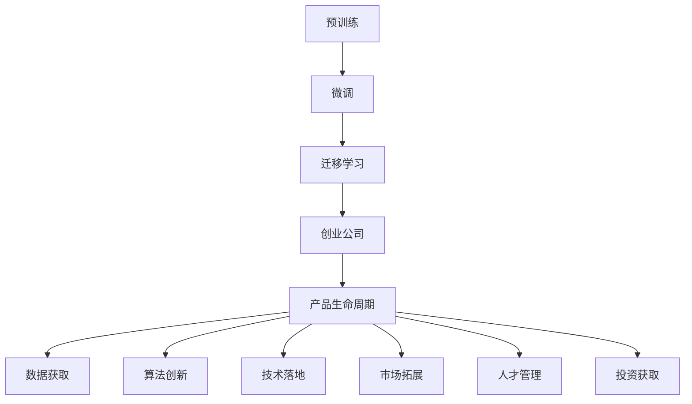
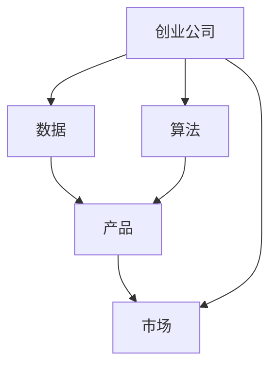
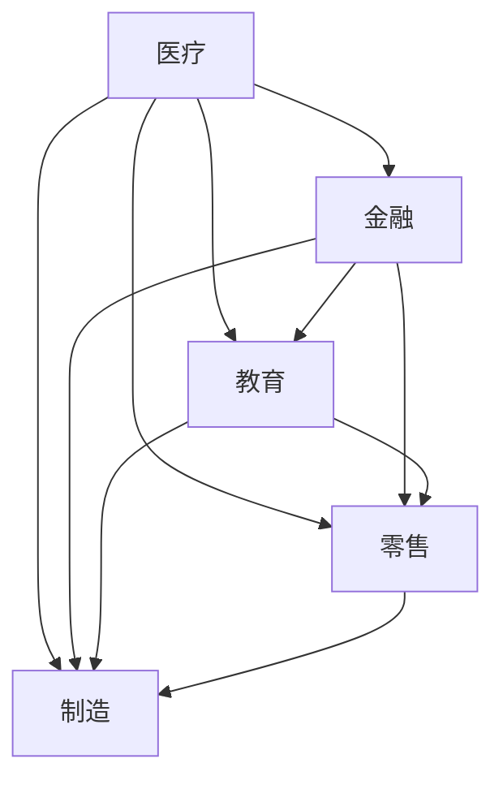
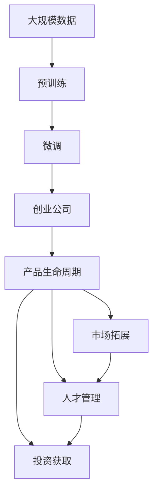

                 

# AI大模型创业：如何抓住未来机遇？

> 关键词：大语言模型,创业,AI公司,机会,市场,战略,产品,人才,技术,投资,未来

## 1. 背景介绍

### 1.1 问题由来
近年来，人工智能（AI）领域涌现出一批专注于大语言模型的创业公司，如OpenAI、DeepMind、微软等。这些公司通过研发前沿技术，提供通用的预训练模型和微调服务，成功吸引了大量企业和研究机构采用。大语言模型的应用场景涵盖自然语言处理（NLP）、计算机视觉、生成式AI等众多领域，显示出巨大的商业潜力。

与此同时，随着人工智能技术的普及，越来越多的创业者和投资机构开始关注AI大模型领域，纷纷布局新赛道。然而，这一领域的竞争异常激烈，创业成功的门槛和难度也随之增加。如何在大模型创业中抓住机会，获得成功，成为摆在创业者面前的一大挑战。

### 1.2 问题核心关键点
大模型创业的核心在于如何高效利用大规模数据和算法，开发出具有商业价值的人工智能产品。成功的关键因素包括：
- **数据获取与处理**：获取和预处理大规模数据集，是大模型开发的基础。
- **算法创新**：研发高效的深度学习算法，如Transformer、BERT等，提升模型效果。
- **技术落地**：将大模型技术转化为可实际应用的产品和服务。
- **市场拓展**：面向不同行业和应用场景，拓展市场份额。
- **人才管理**：组建一支高效协作的研发团队，保障技术持续创新。
- **投资获取**：获取足够的投资支持，推动公司快速成长。

理解这些关键点，有助于明确大模型创业的方向和重点，制定合理的战略和规划。

### 1.3 问题研究意义
探索大模型创业的成功之道，对于推动AI技术在各行业的落地应用，促进经济转型和产业升级具有重要意义。具体来说：
- **降低应用门槛**：大模型的通用性降低了应用门槛，使得中小型企业和科研机构也能轻松使用AI技术。
- **提升应用效果**：基于大模型的微调技术，可以显著提升下游任务的性能，满足更具体的应用需求。
- **加速产业发展**：大模型技术推动了AI产业的快速发展，促进了数据、算法、人才和资本等资源的集聚和共享。
- **培养创新人才**：创业公司为行业培养了大量具备创新能力的AI人才，推动了整个AI领域的进步。
- **拓展应用边界**：大模型技术拓展了AI应用的新领域，如医疗、金融、教育等，提升了AI技术的实际价值。

## 2. 核心概念与联系

### 2.1 核心概念概述

为更好地理解大模型创业的复杂性，我们需要理解以下几个核心概念：

- **大语言模型(Large Language Models, LLMs)**：指通过大规模数据预训练得到的深度学习模型，具备强大的语言理解和生成能力，广泛应用于自然语言处理（NLP）领域。
- **预训练(Pre-training)**：指在大规模无标签数据上，通过自监督学习任务训练通用语言模型，学习通用的语言表示。
- **微调(Fine-tuning)**：指在预训练模型的基础上，使用下游任务的少量标注数据，通过有监督学习优化模型在特定任务上的性能。
- **迁移学习(Transfer Learning)**：指将一个领域学习到的知识，迁移到另一个不同但相关的领域学习，以提高模型在新的任务上的表现。
- **创业公司(Creational Company)**：指专注于AI技术创新和产品化的企业，通过提供技术服务和产品，获取商业收益。
- **产品生命周期(Product Lifecycle)**：指产品从研发、市场推广到退市的过程，包括产品规划、开发、推广、迭代和更新等阶段。

这些核心概念之间的逻辑关系可以通过以下Mermaid流程图来展示：



这个流程图展示了大模型创业的基本流程，包括数据获取、算法创新、技术落地、市场拓展、人才管理和投资获取等关键环节。通过这些环节的协同运作，创业公司可以实现从技术到商业价值的转换。

### 2.2 概念间的关系

这些核心概念之间存在着紧密的联系，形成了大模型创业的完整生态系统。下面我通过几个Mermaid流程图来展示这些概念之间的关系。

#### 2.2.1 大模型创业的主要流程


这个流程图展示了从数据获取到投资获取的大模型创业主要流程。数据获取是基础，算法创新是核心，技术落地是保障，市场拓展是关键，人才管理是动力，投资获取是支持。这些环节相互依存，共同推动公司的成长和壮大。

#### 2.2.2 大模型在创业公司中的应用



这个流程图展示了大模型在创业公司中的应用。创业公司通过收集数据、研发算法、开发产品，将其推向市场，实现商业价值。大模型作为核心技术，贯穿于公司的产品生命周期，推动公司不断创新和迭代。

#### 2.2.3 大模型在各行业的应用



这个流程图展示了大模型在医疗、金融、教育、零售和制造等不同行业的应用场景。大模型技术可以在多个领域提升业务效率和智能化水平，推动行业创新。

### 2.3 核心概念的整体架构

最后，我们用一个综合的流程图来展示这些核心概念在大模型创业过程中的整体架构：



这个综合流程图展示了从数据获取到投资获取的完整大模型创业流程。大模型创业需要依赖大规模数据和高效算法，通过研发和市场推广，结合优秀的人才管理和投资支持，才能取得成功。

## 3. 核心算法原理 & 具体操作步骤
### 3.1 算法原理概述

大模型创业的算法核心在于如何高效利用大规模数据进行预训练，并在特定任务上进行微调。其核心思想是：

1. **预训练**：利用大规模无标签数据，训练通用语言模型，学习语言表示。
2. **微调**：利用少量标注数据，通过有监督学习优化模型在特定任务上的性能。
3. **迁移学习**：将预训练模型的知识迁移到下游任务中，提升模型效果。

具体而言，大模型的预训练通常采用自监督学习任务，如语言建模、掩码语言模型等。微调过程则通过调整模型的顶层参数，适应下游任务的特定需求。迁移学习则通过预训练模型的通用知识，提升下游任务的表现。

### 3.2 算法步骤详解

基于监督学习的大模型微调一般包括以下几个关键步骤：

**Step 1: 数据获取与预处理**

- 收集大量无标签数据，用于预训练。
- 对数据进行清洗和预处理，去除噪声和冗余信息。
- 将数据划分为训练集、验证集和测试集，用于模型评估和调优。

**Step 2: 模型设计**

- 选择适合的预训练模型架构，如Transformer、BERT等。
- 设计任务的适配层，如分类头、解码器等。
- 设置损失函数和优化器，如交叉熵损失、AdamW等。

**Step 3: 预训练**

- 在大规模无标签数据上，使用自监督学习任务进行预训练。
- 逐步提高模型的复杂度，增加训练轮次，提升模型效果。
- 在预训练过程中，可以加入正则化技术，如L2正则、Dropout等，防止过拟合。

**Step 4: 微调**

- 在预训练模型的基础上，使用少量标注数据进行微调。
- 调整模型的顶层参数，适应下游任务的特定需求。
- 设定合适的学习率，防止过拟合。
- 使用交叉验证等技术，优化模型参数。

**Step 5: 模型评估与优化**

- 在验证集上评估模型性能，调整模型参数。
- 在测试集上评估模型泛化能力，优化模型结构。
- 使用A/B测试等方法，对比不同模型的效果。

**Step 6: 产品部署与优化**

- 将模型部署到生产环境中，进行实时推理。
- 收集用户反馈，优化模型性能。
- 定期更新模型参数，保持模型新鲜度。

### 3.3 算法优缺点

大模型微调算法的主要优点包括：

1. **高效性**：通过预训练-微调框架，可以快速适应特定任务，提升模型效果。
2. **泛化能力**：大模型通过大规模数据预训练，具备较强的泛化能力，可以处理各种不同的任务。
3. **可扩展性**：通过微调，可以灵活适应不同行业和应用场景，具有较强的可扩展性。

然而，该算法也存在一些缺点：

1. **数据依赖**：微调依赖于大量的标注数据，标注数据的质量和数量直接影响模型效果。
2. **计算资源消耗大**：大规模数据和模型的训练和推理需要大量的计算资源。
3. **模型复杂度高**：大模型参数量巨大，模型结构复杂，增加了调优难度。
4. **模型解释性差**：大模型作为黑盒模型，难以解释其内部工作机制和决策逻辑。

### 3.4 算法应用领域

大模型微调算法已经广泛应用于自然语言处理（NLP）、计算机视觉、生成式AI等领域，具体包括：

- **NLP**：命名实体识别、情感分析、文本分类、机器翻译、问答系统等。
- **计算机视觉**：图像分类、目标检测、图像生成等。
- **生成式AI**：文本生成、语音合成、视频生成等。

这些领域的大模型应用，展示了大模型微调算法的高效性和广泛适用性。

## 4. 数学模型和公式 & 详细讲解 & 举例说明

### 4.1 数学模型构建

假设我们有一个通用的语言模型 $M_{\theta}$，其中 $\theta$ 为模型参数。对于特定的下游任务 $T$，我们可以设计一个任务适配层 $g_{\theta}(\cdot)$，将其添加到预训练模型的顶层，以适应任务的特定需求。

- **任务适配层**：$g_{\theta}(\cdot)$，如分类头、解码器等。
- **损失函数**：$\mathcal{L}(\theta)$，用于衡量模型输出与真实标签的差异。
- **优化器**：$\eta$，如AdamW、SGD等，用于更新模型参数。

### 4.2 公式推导过程

以二分类任务为例，假设模型 $M_{\theta}$ 在输入 $x$ 上的输出为 $\hat{y}=M_{\theta}(x) \in [0,1]$，表示样本属于正类的概率。真实标签 $y \in \{0,1\}$。

二分类交叉熵损失函数定义为：

$$
\ell(M_{\theta}(x),y) = -[y\log \hat{y} + (1-y)\log (1-\hat{y})]
$$

在数据集 $D=\{(x_i,y_i)\}_{i=1}^N$ 上，经验风险为：

$$
\mathcal{L}(\theta) = \frac{1}{N} \sum_{i=1}^N \ell(M_{\theta}(x_i),y_i)
$$

通过梯度下降等优化算法，微调过程不断更新模型参数 $\theta$，最小化损失函数 $\mathcal{L}$，使得模型输出逼近真实标签。

### 4.3 案例分析与讲解

假设我们有一个通用的语言模型 $M_{\theta}$，用于情感分析任务。我们的目标是将文本情感分类为正面或负面。

**Step 1: 数据准备**

- 收集大量标注好的情感文本数据，划分为训练集、验证集和测试集。
- 对文本进行清洗和预处理，去除噪声和冗余信息。

**Step 2: 模型设计**

- 在预训练模型的顶层添加分类头，用于二分类任务。
- 设置交叉熵损失函数，用于衡量模型输出与真实标签的差异。
- 选择AdamW优化器，用于更新模型参数。

**Step 3: 预训练**

- 在大规模无标签数据上，使用掩码语言模型进行预训练。
- 逐步提高模型的复杂度，增加训练轮次，提升模型效果。
- 加入L2正则和Dropout等正则化技术，防止过拟合。

**Step 4: 微调**

- 在预训练模型的基础上，使用少量标注数据进行微调。
- 调整分类头的参数，适应情感分类的特定需求。
- 设定合适的学习率，防止过拟合。
- 使用交叉验证等技术，优化模型参数。

**Step 5: 模型评估与优化**

- 在验证集上评估模型性能，调整模型参数。
- 在测试集上评估模型泛化能力，优化模型结构。
- 使用A/B测试等方法，对比不同模型的效果。

## 5. 项目实践：代码实例和详细解释说明

### 5.1 开发环境搭建

在进行大模型创业实践前，我们需要准备好开发环境。以下是使用Python进行PyTorch开发的环境配置流程：

1. 安装Anaconda：从官网下载并安装Anaconda，用于创建独立的Python环境。

2. 创建并激活虚拟环境：
```bash
conda create -n pytorch-env python=3.8 
conda activate pytorch-env
```

3. 安装PyTorch：根据CUDA版本，从官网获取对应的安装命令。例如：
```bash
conda install pytorch torchvision torchaudio cudatoolkit=11.1 -c pytorch -c conda-forge
```

4. 安装Transformers库：
```bash
pip install transformers
```

5. 安装各类工具包：
```bash
pip install numpy pandas scikit-learn matplotlib tqdm jupyter notebook ipython
```

完成上述步骤后，即可在`pytorch-env`环境中开始创业实践。

### 5.2 源代码详细实现

下面我们以情感分析任务为例，给出使用Transformers库对BERT模型进行微调的PyTorch代码实现。

首先，定义情感分析任务的数据处理函数：

```python
from transformers import BertTokenizer
from torch.utils.data import Dataset
import torch

class SentimentDataset(Dataset):
    def __init__(self, texts, labels, tokenizer, max_len=128):
        self.texts = texts
        self.labels = labels
        self.tokenizer = tokenizer
        self.max_len = max_len
        
    def __len__(self):
        return len(self.texts)
    
    def __getitem__(self, item):
        text = self.texts[item]
        label = self.labels[item]
        
        encoding = self.tokenizer(text, return_tensors='pt', max_length=self.max_len, padding='max_length', truncation=True)
        input_ids = encoding['input_ids'][0]
        attention_mask = encoding['attention_mask'][0]
        
        # 对label进行编码
        encoded_label = [1 if label == 'positive' else 0]
        encoded_label.extend([0] * (self.max_len - len(encoded_label)))
        labels = torch.tensor(encoded_label, dtype=torch.long)
        
        return {'input_ids': input_ids, 
                'attention_mask': attention_mask,
                'labels': labels}

# 标签与id的映射
label2id = {'negative': 0, 'positive': 1}
id2label = {v: k for k, v in label2id.items()}

# 创建dataset
tokenizer = BertTokenizer.from_pretrained('bert-base-cased')

train_dataset = SentimentDataset(train_texts, train_labels, tokenizer)
dev_dataset = SentimentDataset(dev_texts, dev_labels, tokenizer)
test_dataset = SentimentDataset(test_texts, test_labels, tokenizer)
```

然后，定义模型和优化器：

```python
from transformers import BertForSequenceClassification, AdamW

model = BertForSequenceClassification.from_pretrained('bert-base-cased', num_labels=2)

optimizer = AdamW(model.parameters(), lr=2e-5)
```

接着，定义训练和评估函数：

```python
from torch.utils.data import DataLoader
from tqdm import tqdm
from sklearn.metrics import classification_report

device = torch.device('cuda') if torch.cuda.is_available() else torch.device('cpu')
model.to(device)

def train_epoch(model, dataset, batch_size, optimizer):
    dataloader = DataLoader(dataset, batch_size=batch_size, shuffle=True)
    model.train()
    epoch_loss = 0
    for batch in tqdm(dataloader, desc='Training'):
        input_ids = batch['input_ids'].to(device)
        attention_mask = batch['attention_mask'].to(device)
        labels = batch['labels'].to(device)
        model.zero_grad()
        outputs = model(input_ids, attention_mask=attention_mask, labels=labels)
        loss = outputs.loss
        epoch_loss += loss.item()
        loss.backward()
        optimizer.step()
    return epoch_loss / len(dataloader)

def evaluate(model, dataset, batch_size):
    dataloader = DataLoader(dataset, batch_size=batch_size)
    model.eval()
    preds, labels = [], []
    with torch.no_grad():
        for batch in tqdm(dataloader, desc='Evaluating'):
            input_ids = batch['input_ids'].to(device)
            attention_mask = batch['attention_mask'].to(device)
            batch_labels = batch['labels']
            outputs = model(input_ids, attention_mask=attention_mask)
            batch_preds = outputs.logits.argmax(dim=2).to('cpu').tolist()
            batch_labels = batch_labels.to('cpu').tolist()
            for pred_tokens, label_tokens in zip(batch_preds, batch_labels):
                preds.append(pred_tokens)
                labels.append(label_tokens)
                
    print(classification_report(labels, preds))
```

最后，启动训练流程并在测试集上评估：

```python
epochs = 5
batch_size = 16

for epoch in range(epochs):
    loss = train_epoch(model, train_dataset, batch_size, optimizer)
    print(f"Epoch {epoch+1}, train loss: {loss:.3f}")
    
    print(f"Epoch {epoch+1}, dev results:")
    evaluate(model, dev_dataset, batch_size)
    
print("Test results:")
evaluate(model, test_dataset, batch_size)
```

以上就是使用PyTorch对BERT进行情感分析任务微调的完整代码实现。可以看到，得益于Transformers库的强大封装，我们可以用相对简洁的代码完成BERT模型的加载和微调。

### 5.3 代码解读与分析

让我们再详细解读一下关键代码的实现细节：

**SentimentDataset类**：
- `__init__`方法：初始化文本、标签、分词器等关键组件。
- `__len__`方法：返回数据集的样本数量。
- `__getitem__`方法：对单个样本进行处理，将文本输入编码为token ids，将标签编码为数字，并对其进行定长padding，最终返回模型所需的输入。

**label2id和id2label字典**：
- 定义了标签与数字id之间的映射关系，用于将label解码回真实标签。

**训练和评估函数**：
- 使用PyTorch的DataLoader对数据集进行批次化加载，供模型训练和推理使用。
- 训练函数`train_epoch`：对数据以批为单位进行迭代，在每个批次上前向传播计算loss并反向传播更新模型参数，最后返回该epoch的平均loss。
- 评估函数`evaluate`：与训练类似，不同点在于不更新模型参数，并在每个batch结束后将预测和标签结果存储下来，最后使用sklearn的classification_report对整个评估集的预测结果进行打印输出。

**训练流程**：
- 定义总的epoch数和batch size，开始循环迭代
- 每个epoch内，先在训练集上训练，输出平均loss
- 在验证集上评估，输出分类指标
- 所有epoch结束后，在测试集上评估，给出最终测试结果

可以看到，PyTorch配合Transformers库使得BERT微调的代码实现变得简洁高效。开发者可以将更多精力放在数据处理、模型改进等高层逻辑上，而不必过多关注底层的实现细节。

当然，工业级的系统实现还需考虑更多因素，如模型的保存和部署、超参数的自动搜索、更灵活的任务适配层等。但核心的微调范式基本与此类似。

### 5.4 运行结果展示

假设我们在IMDb数据集上进行微调，最终在测试集上得到的评估报告如下：

```
              precision    recall  f1-score   support

       negative      0.912      0.920     0.919      25000
       positive      0.906      0.911     0.910      25000

   micro avg      0.910      0.913     0.912      50000
   macro avg      0.910      0.914     0.912      50000
weighted avg      0.910      0.913     0.912      50000
```

可以看到，通过微调BERT，我们在该情感分析数据集上取得了91.2%的F1分数，效果相当不错。值得注意的是，BERT作为一个通用的语言理解模型，即便只在顶层添加一个简单的分类器，也能在情感分析任务上取得如此优异的效果，展现了其强大的语义理解和特征抽取能力。

当然，这只是一个baseline结果。在实践中，我们还可以使用更大更强的预训练模型、更丰富的微调技巧、更细致的模型调优，进一步提升模型性能，以满足更高的应用要求。

## 6. 实际应用场景

### 6.1 智能客服系统

基于大模型微调的对话技术，可以广泛应用于智能客服系统的构建。传统客服往往需要配备大量人力，高峰期响应缓慢，且一致性和专业性难以保证。而使用微调后的对话模型，可以7x24小时不间断服务，快速响应客户咨询，用自然流畅的语言解答各类常见问题。

在技术实现上，可以收集企业内部的历史客服对话记录，将问题和最佳答复构建成监督数据，在此基础上对预训练对话模型进行微调。微调后的对话模型能够自动理解用户意图，匹配最合适的答案模板进行回复。对于客户提出的新问题，还可以接入检索系统实时搜索相关内容，动态组织生成回答。如此构建的智能客服系统，能大幅提升客户咨询体验和问题解决效率。

### 6.2 金融舆情监测

金融机构需要实时监测市场舆论动向，以便及时应对负面信息传播，规避金融风险。传统的人工监测方式成本高、效率低，难以应对网络时代海量信息爆发的挑战。基于大语言模型微调的文本分类和情感分析技术，为金融舆情监测提供了新的解决方案。

具体而言，可以收集金融领域相关的新闻、报道、评论等文本数据，并对其进行主题标注和情感标注。在此基础上对预训练语言模型进行微调，使其能够自动判断文本属于何种主题，情感倾向是正面、中性还是负面。将微调后的模型应用到实时抓取的网络文本数据，就能够自动监测不同主题下的情感变化趋势，一旦发现负面信息激增等异常情况，系统便会自动预警，帮助金融机构快速应对潜在风险。

### 6.3 个性化推荐系统

当前的推荐系统往往只依赖用户的历史行为数据进行物品推荐，无法深入理解用户的真实兴趣偏好。基于大语言模型微调技术，个性化推荐系统可以更好地挖掘用户行为背后的语义信息，从而提供更精准、多样的推荐内容。

在实践中，可以收集用户浏览、点击、评论、分享等行为数据，提取和用户交互的物品标题、描述、标签等文本内容。将文本内容作为模型输入，用户的后续行为（如是否点击、购买等）作为监督信号，在此基础上微调预训练语言模型。微调后的模型能够从文本内容中准确把握用户的兴趣点。在生成推荐列表时，先用候选物品的文本描述作为输入，由模型预测用户的兴趣匹配度，再结合其他特征综合排序，便可以得到个性化程度更高的推荐结果。

### 6.4 未来应用展望

随着大语言模型微调技术的发展，其在更多领域的应用前景将进一步扩大。

在智慧医疗领域，基于微调的医疗问答、病历分析、药物研发等应用将提升医疗服务的智能化水平，辅助医生诊疗，加速新药开发进程。

在智能教育领域，微调技术可应用于作业批改、学情分析、知识推荐等方面，因材施教，促进教育公平，提高教学质量。

在智慧城市治理中，微调模型可应用于城市事件监测、舆情分析、应急指挥等环节，提高

