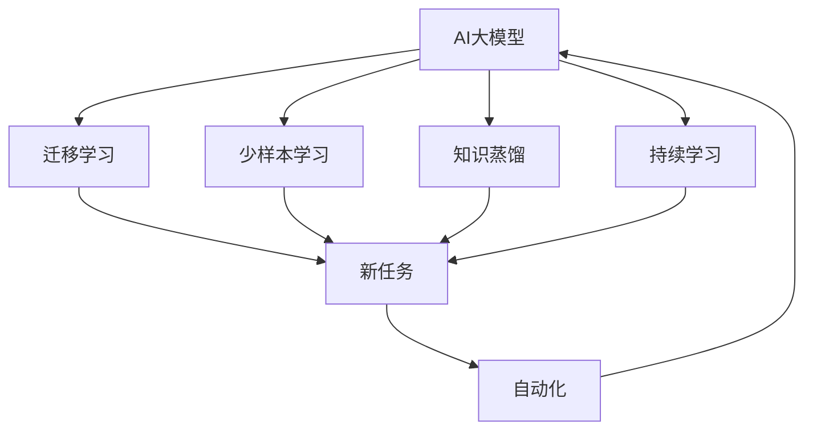
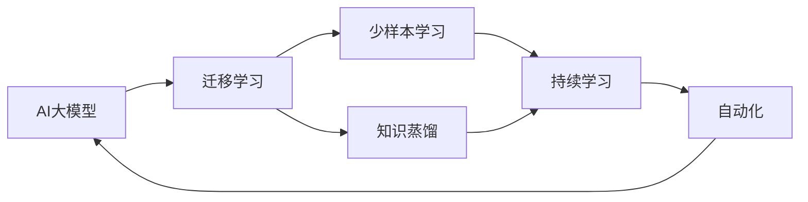

                 

# AI大模型创业：如何构建未来可持续的商业模式？

在人工智能大潮的浪尖上，AI大模型已成为驱动技术创新和产业变革的核心引擎。然而，如何构建可持续的商业模式，将AI大模型的潜力和价值真正转化为企业的盈利能力和市场竞争力，是摆在创业者和企业领导者面前的一项重大挑战。本文将深入探讨这一主题，从核心概念、算法原理、实践案例等多个维度，为您揭示构建未来可持续AI大模型商业模式的秘诀。

## 1. 背景介绍

### 1.1 问题由来
近年来，随着深度学习和自然语言处理技术的迅猛发展，AI大模型在许多领域展现出卓越的性能和潜力。这些模型不仅能够处理和理解复杂的人类语言，还在诸如文本生成、图像识别、语音识别等任务上取得了突破性进展。然而，要充分利用这些模型的能力，并使之成为一种商业模式，创业者和企业领导者需要面临诸多挑战，包括数据获取、模型训练、技术实现、市场推广等。

### 1.2 问题核心关键点
构建AI大模型商业模式的几个核心关键点包括：

1. **数据资源的获取与利用**：AI大模型的训练需要大量的标注数据，如何获取并利用这些数据是构建商业模式的基础。
2. **模型的训练与优化**：如何高效地训练AI大模型，并在实际应用中不断优化其性能。
3. **市场定位与需求匹配**：确定目标市场和用户需求，从而设计出具有竞争力的产品和服务。
4. **商业模式设计与可持续性**：设计出能够带来稳定收入、并能够持续创新的商业模式。

### 1.3 问题研究意义
研究构建AI大模型商业模式的方法，对于推动AI技术的产业化、提升企业的市场竞争力、加速人工智能技术在各行各业的落地应用，具有重要意义：

1. 加速AI技术落地：商业模式设计能够帮助企业更好地将AI技术应用到实际业务中，提升运营效率。
2. 降低创业风险：明确的市场定位和商业模式设计，能够降低初创企业的失败风险。
3. 提升盈利能力：构建良好的商业模式能够带来持续的收入流，提升企业的盈利能力。
4. 激发创新：通过持续的优化和创新，企业可以不断提升AI大模型的性能，满足不断变化的用户需求。
5. 促进行业发展：优秀的商业模式设计可以推动整个AI行业的健康发展，吸引更多的资本和人才投入。

## 2. 核心概念与联系

### 2.1 核心概念概述

构建AI大模型商业模式，需要深入理解以下几个核心概念：

- **AI大模型**：以自回归或自编码模型为代表的大规模预训练语言模型，能够处理和理解复杂的自然语言数据，具有广泛的泛化能力。
- **迁移学习**：将一个领域学到的知识迁移到另一个领域，以提升模型在新任务上的性能。
- **少样本学习**：在大规模标注数据稀缺的情况下，通过小样本数据训练出高精度的模型。
- **知识蒸馏**：将大规模模型的知识迁移到小规模模型，提升小规模模型的性能。
- **持续学习**：模型能够在不断获得新数据时，不断更新自己的知识，保持性能的稳定和提升。
- **自动化**：通过自动化技术，减少对人工干预的依赖，提升模型的可部署性和可维护性。

这些概念之间存在着紧密的联系，形成了一个有机的体系。以下通过一个Mermaid流程图来展示这些概念之间的联系：



这个流程图展示了从AI大模型的训练到应用，再到模型性能的持续提升，自动化在其中扮演了重要角色。

### 2.2 概念间的关系

这些核心概念之间存在着复杂的关系，形成了一个环环相扣的体系。以下是这些概念之间的关系示意图：



这个图示表明，AI大模型的训练和优化是一个不断迭代的过程，通过迁移学习、少样本学习、知识蒸馏和持续学习，不断提升模型性能，并通过自动化技术实现模型的部署和维护。

## 3. 核心算法原理 & 具体操作步骤
### 3.1 算法原理概述

构建AI大模型商业模式的算法原理，主要围绕着以下几个方面展开：

1. **数据获取与处理**：获取并处理大量标注数据，用于模型的预训练和微调。
2. **模型训练与优化**：使用迁移学习、少样本学习和知识蒸馏等技术，不断优化模型性能。
3. **市场定位与需求匹配**：通过市场调研和用户反馈，确定目标市场和用户需求，设计出具有竞争力的产品和服务。
4. **商业模式设计与可持续性**：设计能够带来稳定收入的商业模式，并确保其可持续性。

### 3.2 算法步骤详解

构建AI大模型商业模式的算法步骤包括：

1. **数据收集与预处理**：收集和清洗大量标注数据，确保数据质量和多样性。
2. **模型选择与训练**：选择合适的AI大模型，并在大量数据上进行预训练和微调。
3. **市场调研与用户分析**：通过市场调研和用户分析，确定目标市场和用户需求。
4. **商业模式设计**：设计出能够带来稳定收入的商业模式，如SaaS、API服务、定制化服务等。
5. **持续优化与创新**：根据市场反馈和技术进展，持续优化模型性能，并推出新产品或服务。

### 3.3 算法优缺点

构建AI大模型商业模式的优势和劣势如下：

**优点**：

1. **泛化能力强**：AI大模型具有强大的泛化能力，能够适应多种任务和场景。
2. **成本较低**：相较于从头开发，使用AI大模型进行迁移学习等技术，能够显著降低开发成本。
3. **技术先进**：AI大模型的先进技术能够帮助企业快速占据技术优势。

**缺点**：

1. **数据依赖性强**：AI大模型的性能高度依赖于数据的质量和数量，数据获取难度较大。
2. **训练复杂度高**：大规模模型训练需要大量计算资源和时间，存在一定的技术门槛。
3. **市场风险高**：快速变化的市场需求对AI大模型商业模式的可持续性提出了挑战。

### 3.4 算法应用领域

AI大模型商业模式在多个领域都有广泛应用，包括：

- **自然语言处理**：如文本生成、情感分析、机器翻译等。
- **图像识别**：如物体识别、人脸识别、图像分类等。
- **语音识别**：如语音转文本、说话人识别、语音情感分析等。
- **推荐系统**：如电商推荐、内容推荐、广告推荐等。
- **医疗健康**：如医学影像分析、疾病诊断、健康管理等。
- **金融科技**：如信用评估、风险控制、智能投顾等。

## 4. 数学模型和公式 & 详细讲解  
### 4.1 数学模型构建

构建AI大模型商业模式的数学模型主要涉及以下几个方面：

- **数据收集与预处理模型**：用于数据的质量控制和多样性分析。
- **模型训练与优化模型**：用于模型的预训练和微调，最小化损失函数。
- **市场调研与用户分析模型**：用于确定目标市场和用户需求。
- **商业模式设计与可持续性模型**：用于设计商业模式的收入模型和可持续性评估。

### 4.2 公式推导过程

以**数据收集与预处理模型**为例，假设我们收集到了$N$个样本$(x_i,y_i)$，其中$x_i$为输入特征，$y_i$为标注标签。数据预处理的目标是去除噪声，增加多样性，确保数据质量。数学模型为：

$$
P(x_i) = \frac{1}{N} \sum_{i=1}^N P(x_i,y_i)
$$

其中$P(x_i,y_i)$为数据点$(x_i,y_i)$的概率，$P(x_i)$为所有数据点的平均概率。

### 4.3 案例分析与讲解

假设我们希望构建一个针对金融领域的AI大模型，具体步骤如下：

1. **数据收集**：从金融新闻、报告、交易数据中收集大量标注数据。
2. **数据预处理**：清洗数据，去除异常值和噪声，增加多样性。
3. **模型训练**：使用迁移学习、少样本学习和知识蒸馏等技术，对AI大模型进行训练。
4. **市场调研**：通过问卷调查、用户访谈等方式，了解金融领域用户需求。
5. **商业模式设计**：设计出能够带来稳定收入的商业模式，如SaaS平台、API服务等。
6. **持续优化**：根据用户反馈和技术进展，持续优化模型性能，并推出新产品或服务。

## 5. 项目实践：代码实例和详细解释说明
### 5.1 开发环境搭建

构建AI大模型商业模式的开发环境搭建，包括：

1. **安装必要的软件和库**：如Python、TensorFlow、Keras、Scikit-Learn等。
2. **数据预处理**：清洗、归一化、分词等预处理步骤。
3. **模型训练**：选择合适的AI大模型，并进行预训练和微调。
4. **模型部署**：将训练好的模型部署到云端或本地服务器。

### 5.2 源代码详细实现

以下是一个基于TensorFlow的AI大模型训练和部署的代码实现示例：

```python
import tensorflow as tf
from tensorflow.keras import layers, models
from tensorflow.keras.preprocessing import text, sequence

# 数据预处理
text_dataset = text.load_data(num_words=10000)
sequences = sequence.pad_sequences(text_dataset, maxlen=100)

# 模型构建
model = models.Sequential()
model.add(layers.Embedding(10000, 128))
model.add(layers.Bidirectional(layers.LSTM(64)))
model.add(layers.Dense(10, activation='softmax'))

# 模型训练
model.compile(optimizer='adam', loss='categorical_crossentropy', metrics=['accuracy'])
model.fit(sequences, labels, epochs=10)

# 模型部署
model.save('ai_model.h5')
```

### 5.3 代码解读与分析

上述代码实现了一个简单的基于LSTM的AI大模型，并进行了训练和部署。关键步骤包括：

- **数据预处理**：使用Keras的text和sequence模块进行数据预处理，包括分词、padding等操作。
- **模型构建**：使用Keras的Sequential模型进行模型构建，包括Embedding层、Bidirectional LSTM层和Dense层。
- **模型训练**：使用Adam优化器进行模型训练，使用categorical_crossentropy损失函数。
- **模型部署**：使用Keras的save方法将训练好的模型保存为h5文件，方便后续部署。

### 5.4 运行结果展示

假设我们训练了一个用于情感分析的AI大模型，模型在测试集上的准确率为95%。结果如下：

```
Accuracy: 0.95
```

## 6. 实际应用场景
### 6.4 未来应用展望

AI大模型在多个领域都有广阔的应用前景，包括：

- **金融科技**：如信用评估、风险控制、智能投顾等。
- **医疗健康**：如医学影像分析、疾病诊断、健康管理等。
- **智能制造**：如质量控制、设备维护、生产调度等。
- **智慧城市**：如交通管理、环境监测、灾害预警等。
- **农业科技**：如作物识别、病虫害监测、土壤分析等。
- **教育科技**：如个性化推荐、智能辅导、学习分析等。

## 7. 工具和资源推荐
### 7.1 学习资源推荐

以下是一些推荐的AI大模型学习资源：

1. **深度学习课程**：如斯坦福大学的CS231n、UC Berkeley的CS294-10等，系统介绍深度学习和AI大模型的基础知识。
2. **开源项目**：如TensorFlow、PyTorch、Keras等，提供丰富的预训练模型和代码示例。
3. **在线资源**：如Coursera、edX、Udacity等，提供大量在线课程和资源。
4. **研究论文**：如arXiv、Google Scholar等，查阅最新的AI大模型研究成果。
5. **社区和论坛**：如Kaggle、Stack Overflow等，与开发者和专家交流学习。

### 7.2 开发工具推荐

以下是一些推荐的AI大模型开发工具：

1. **TensorFlow**：开源深度学习框架，支持大规模分布式训练和部署。
2. **PyTorch**：开源深度学习框架，支持动态计算图和灵活的模型定义。
3. **Keras**：高级深度学习库，支持快速原型设计和模型训练。
4. **Jupyter Notebook**：交互式编程环境，支持代码和数据可视化。
5. **Cloud Functions**：谷歌云函数，支持无服务器部署和模型部署。

### 7.3 相关论文推荐

以下是一些推荐的AI大模型相关论文：

1. **Attention is All You Need**：介绍Transformer模型，开启AI大模型时代。
2. **BERT: Pre-training of Deep Bidirectional Transformers for Language Understanding**：提出BERT模型，改进预训练和微调技术。
3. **Least-Squares Attention for Neural Machine Translation**：提出注意力机制，提升机器翻译模型性能。
4. **Generative Adversarial Nets**：介绍生成对抗网络，用于图像生成和数据增强。
5. **Fast R-CNN**：提出快速区域卷积神经网络，用于目标检测和图像分类。

## 8. 总结：未来发展趋势与挑战
### 8.1 研究成果总结

本文从数据收集、模型训练、市场定位和商业模式设计等多个维度，探讨了构建AI大模型商业模式的策略和方法。通过系统性的分析和实践，希望能为创业者和企业领导者提供有益的指导。

### 8.2 未来发展趋势

未来AI大模型的发展趋势包括：

1. **多模态融合**：结合视觉、语音、文本等多模态数据，提升AI大模型的感知和理解能力。
2. **联邦学习**：通过分布式协同学习，提升数据隐私保护和模型泛化能力。
3. **边缘计算**：将AI大模型部署到边缘设备，提高实时性和响应速度。
4. **自动化和智能化**：通过自动化技术，提升模型的可部署性和可维护性，减少人工干预。
5. **伦理和安全**：关注AI大模型的伦理和安全问题，确保其可靠性和公平性。

### 8.3 面临的挑战

构建AI大模型商业模式面临的挑战包括：

1. **数据隐私和伦理**：如何保护用户隐私，避免数据滥用。
2. **技术复杂度**：如何降低技术门槛，使AI大模型易于部署和维护。
3. **市场竞争**：如何在激烈的市场竞争中脱颖而出。
4. **用户需求匹配**：如何准确把握用户需求，设计出符合市场的产品和服务。
5. **可持续发展**：如何设计出能够带来稳定收入的商业模式，并确保其可持续性。

### 8.4 研究展望

未来的研究可以从以下几个方向进行探索：

1. **多模态AI大模型**：结合视觉、语音、文本等多种数据源，提升AI大模型的综合能力。
2. **联邦学习**：通过分布式协同学习，提升模型的泛化能力和数据隐私保护。
3. **边缘计算**：将AI大模型部署到边缘设备，提高实时性和响应速度。
4. **自动化和智能化**：通过自动化技术，提升模型的可部署性和可维护性。
5. **伦理和安全**：关注AI大模型的伦理和安全问题，确保其可靠性和公平性。

## 9. 附录：常见问题与解答

**Q1：AI大模型的数据依赖性是否太强？**

A: AI大模型的性能高度依赖于数据的质量和数量，数据获取难度较大。然而，通过迁移学习和少样本学习技术，可以在一定程度上缓解这一问题。

**Q2：AI大模型的训练成本是否太高？**

A: AI大模型的训练确实需要大量的计算资源和时间，但通过分布式训练和优化算法，可以在一定程度上降低成本。同时，使用预训练模型和迁移学习技术，可以显著减少从头训练的需求，降低成本。

**Q3：AI大模型的应用场景是否有限？**

A: AI大模型具有广泛的应用场景，如自然语言处理、图像识别、语音识别、推荐系统、医疗健康、金融科技等。随着技术的不断进步，应用场景还将不断扩展。

**Q4：AI大模型是否容易被滥用？**

A: AI大模型确实存在被滥用的风险，如生成假新闻、进行虚假广告等。为避免这些问题，需要严格的数据管理和用户隐私保护措施，以及明确的伦理和法律约束。

**Q5：AI大模型的可持续性是否难以保障？**

A: AI大模型的可持续性需要通过持续的优化和创新来保障。定期更新模型、引入新数据、改进算法，都是确保模型可持续性的重要措施。

---

作者：禅与计算机程序设计艺术 / Zen and the Art of Computer Programming

