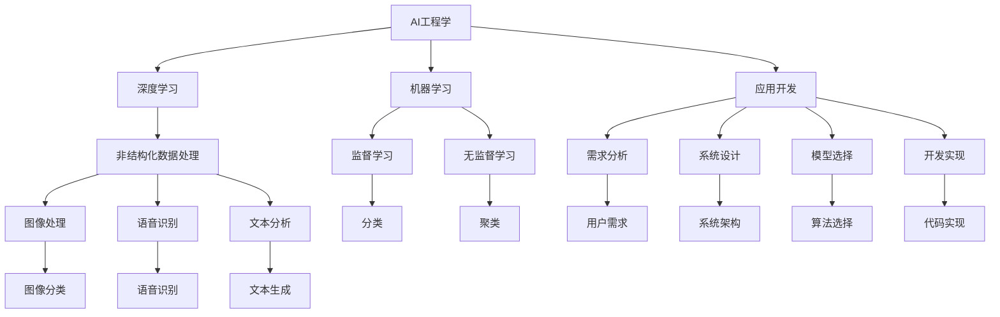

                 

# AI工程学：应用开发实战手册

> 关键词：AI工程学, 深度学习, 机器学习, 应用开发, 实战, 实践指南, 人工智能, 数据科学

## 1. 背景介绍

### 1.1 问题由来

随着人工智能技术的迅猛发展，AI工程学作为连接理论研究和实际应用的重要桥梁，日益成为研究热点。AI工程学致力于将先进的AI技术转化为具体应用，解决现实问题。面对快速变化的产业需求和技术挑战，如何系统地应用AI技术，提升企业竞争力和技术创新能力，是AI工程学面临的重要课题。

### 1.2 问题核心关键点

AI工程学聚焦于将人工智能技术在各行各业中落地应用。具体而言，其核心关键点包括：

- **跨学科融合**：AI工程学需要跨越计算机科学、数据科学、领域知识等多个学科，将先进AI理论与实际应用场景紧密结合。
- **应用导向**：AI工程学强调从具体问题出发，选择最合适的AI算法和模型，实现特定业务目标。
- **系统设计**：AI工程学需要构建复杂系统的整体架构，包括数据采集、模型训练、部署运行、监控优化等环节，确保系统高效、稳定运行。
- **持续优化**：AI工程学是一个迭代过程，通过不断反馈和优化，提升模型和系统的性能。

### 1.3 问题研究意义

AI工程学研究对于推动AI技术产业化、提升行业竞争力、促进技术创新具有重要意义：

1. **降本增效**：AI工程学通过系统化、自动化的开发流程，降低企业引入AI技术的成本，提升研发效率。
2. **提升用户体验**：通过应用AI技术解决用户痛点，提升产品和服务质量，提升用户满意度。
3. **创新驱动**：AI工程学为新技术和新应用提供了系统化支持，加速技术创新，推动行业进步。
4. **行业定制**：AI工程学能够针对不同行业特点，设计定制化解决方案，提高AI技术的适应性和可用性。
5. **市场竞争力**：AI工程学有助于企业在激烈的市场竞争中，借助AI技术实现差异化竞争，赢得更多市场份额。

## 2. 核心概念与联系

### 2.1 核心概念概述

为了更好地理解AI工程学，本节将介绍几个核心概念及其相互关系：

- **AI工程学(AI Engineering)**：将AI技术应用于实际问题的系统化、工程化过程，包括需求分析、系统设计、模型训练、部署上线、监控优化等环节。
- **深度学习(Deep Learning)**：一类基于多层神经网络的机器学习技术，用于处理非结构化数据，如图像、语音、文本等。
- **机器学习(Machine Learning)**：通过数据驱动的算法，使计算机能够从经验中学习并优化性能。
- **应用开发(Application Development)**：将AI技术转化为具体应用的过程，包括需求收集、模型选择、系统设计、开发实现等。
- **实战指南(Practioner's Guide)**：提供具体的应用开发实践和指导，帮助开发者实现技术落地。
- **技术创新(Technical Innovation)**：通过不断优化和创新，提升AI技术的性能和应用范围。
- **领域知识(Domain Knowledge)**：涉及特定行业的应用领域知识，如医疗、金融、教育等，对AI模型训练和优化有重要影响。

这些核心概念之间存在紧密的联系，形成一个完整的AI工程学生态系统。以下使用Mermaid流程图展示其相互关系：



这个流程图展示了AI工程学的核心概念及其相互关系：

1. AI工程学涉及深度学习和机器学习技术，用于处理非结构化数据。
2. 应用开发基于需求分析，选择适合的模型和算法，进行系统设计和开发实现。
3. 深度学习处理图像、语音、文本等非结构化数据，用于图像分类、语音识别、文本分析等任务。
4. 机器学习包括监督学习和无监督学习，用于分类、聚类等任务。
5. 系统设计包括需求分析、系统架构和算法选择，确保系统高效、可扩展。
6. 开发实现涉及代码编写、模型训练和系统部署，实现具体应用。

### 2.2 概念间的关系

这些核心概念之间的关系可以通过以下Mermaid流程图来进一步展示：

```mermaid
graph LR
    A[AI工程学] --> B[深度学习]
    B --> C[图像处理]
    B --> D[语音识别]
    B --> E[文本分析]
    A --> F[应用开发]
    F --> G[需求分析]
    F --> H[系统设计]
    G --> I[用户需求]
    H --> J[系统架构]
    H --> K[算法选择]
    F --> L[开发实现]
    L --> M[代码编写]
    L --> N[模型训练]
    L --> O[系统部署]
    M --> P[图像分类]
    N --> Q[图像分类]
    M --> R[语音识别]
    N --> S[语音识别]
    M --> T[文本生成]
    N --> U[文本生成]
    P --> V[图像分类]
    Q --> W[图像分类]
    R --> X[语音识别]
    S --> Y[语音识别]
    T --> Z[文本生成]
    U --> AA[文本生成]
    V --> BB[图像分类]
    W --> CC[图像分类]
    X --> DD[语音识别]
    Y --> EE[语音识别]
    Z --> FF[文本生成]
    AA --> GG[文本生成]
    BB --> HH[图像分类]
    CC --> II[图像分类]
    DD --> JJ[语音识别]
    EE --> KK[语音识别]
    FF --> LL[文本生成]
    GG --> MM[文本生成]
    HH --> NN[图像分类]
    II --> OO[图像分类]
    JJ --> PP[语音识别]
    KK --> QQ[语音识别]
    LL --> RR[文本生成]
    MM --> SS[文本生成]
    NN --> TT[图像分类]
    OO --> UU[图像分类]
    PP --> VV[语音识别]
    QQ --> WW[语音识别]
    RR --> XX[文本生成]
    SS --> YY[文本生成]
    TT --> ZZ[图像分类]
    UU --> AAA[图像分类]
    VV --> BBB[语音识别]
    WW --> CCC[语音识别]
    XX --> DDD[文本生成]
    YY -->EEE[文本生成]
    ZZ --> FFF[图像分类]
    AAA --> GGG[图像分类]
    BBB --> HHH[语音识别]
    CCC --> III[语音识别]
    DDD --> JJJ[文本生成]
    EEE --> KKK[文本生成]
    FFF --> LLL[图像分类]
    GGG --> MMP[图像分类]
    HHH --> NNP[语音识别]
    III --> OOO[语音识别]
    JJJ --> PPP[文本生成]
    KKK --> QQQ[文本生成]
    LLL --> RRR[图像分类]
    MMP --> SSS[图像分类]
    NNP --> TTT[语音识别]
    OOO --> UUU[语音识别]
    PPP --> VVV[文本生成]
    QQQ --> WWW[文本生成]
    RRR --> XXY[图像分类]
    SSS --> ZZZ[图像分类]
    TTT --> AAA[语音识别]
    UUU --> BBP[语音识别]
    VVV --> CCC[文本生成]
    WWW --> DDD[文本生成]
    XXY --> EEE[图像分类]
    ZZZ --> FFF[图像分类]
    AAA --> GGG[语音识别]
    BBP --> HHH[语音识别]
    CCA --> III[文本生成]
    DDD --> JJJ[文本生成]
    EEE --> KKK[图像分类]
    FFA --> LLL[图像分类]
    GGG --> MMP[语音识别]
    HHH --> NNP[语音识别]
    III --> OOO[文本生成]
    JJJ --> PPP[文本生成]
    KKK --> QQQ[图像分类]
    LLL --> RRR[图像分类]
    MMP --> SSS[语音识别]
    NNP --> TTT[图像分类]
    OOO --> UUU[文本生成]
    PPP --> VVV[语音识别]
    QQQ --> WWW[图像分类]
    RRR --> XXY[文本生成]
    SSS --> ZZZ[语音识别]
    TTT --> AAA[图像分类]
    UUU --> BBP[图像分类]
    VVV --> CCC[语音识别]
    WWW --> DDD[图像分类]
    XXY --> EEE[文本生成]
    ZZZ --> FFF[语音识别]
    AAA --> GGG[图像分类]
    BBP --> HHH[图像分类]
    CCA --> III[语音识别]
    DDD --> JJJ[图像分类]
    EEE --> KKK[文本生成]
    FFA --> LLL[文本生成]
    GGG --> MMP[图像分类]
    HHH --> NNP[图像分类]
    III --> OOO[语音识别]
    JJJ --> PPP[文本生成]
    KKK --> QQQ[图像分类]
    LLL --> RRR[图像分类]
    MMP --> SSS[语音识别]
    NNP --> TTT[图像分类]
    OOO --> UUU[文本生成]
    PPP --> VVV[图像分类]
    QQQ --> WWW[语音识别]
    RRR --> XXY[图像分类]
    SSS --> ZZZ[文本生成]
    TTT --> AAA[图像分类]
    UUU --> BBP[图像分类]
    VVV --> CCC[语音识别]
    WWW --> DDD[图像分类]
    XXY --> EEE[文本生成]
    ZZZ --> FFF[图像分类]
    AAA --> GGG[语音识别]
    BBP --> HHH[文本生成]
    CCA --> III[图像分类]
    DDD --> JJJ[图像分类]
    EEE --> KKK[文本生成]
    FFA --> LLL[图像分类]
    GGG --> MMP[语音识别]
    HHH --> NNP[语音分类]
    III --> OOO[文本生成]
    JJJ --> PPP[图像分类]
    KKK --> QQQ[图像分类]
    LLL --> RRR[语音识别]
    MMP --> SSS[图像分类]
    NNP --> TTT[文本生成]
    OOO --> UUU[语音识别]
    PPP --> VVV[图像分类]
    QQQ --> WWW[文本生成]
    RRR --> XXY[语音识别]
    SSS --> ZZZ[图像分类]
    TTT --> AAA[图像分类]
    UUU --> BBP[语音识别]
    VVV --> CCC[文本生成]
    WWW --> DDD[图像分类]
    XXY --> EEE[语音识别]
    ZZZ --> FFF[图像分类]
    AAA --> GGG[图像分类]
    BBP --> HHH[语音识别]
    CCA --> III[文本生成]
    DDD --> JJJ[图像分类]
    EEE --> KKK[图像分类]
    FFA --> LLL[语音识别]
    GGG --> MMP[图像分类]
    HHH --> NNP[图像分类]
    III --> OOO[语音识别]
    JJJ --> PPP[文本生成]
    KKK --> QQQ[图像分类]
    LLL --> RRR[图像分类]
    MMP --> SSS[语音识别]
    NNP --> TTT[图像分类]
    OOO --> UUU[文本生成]
    PPP --> VVV[语音识别]
    QQQ --> WWW[图像分类]
    RRR --> XXY[语音识别]
    SSS --> ZZZ[文本生成]
    TTT --> AAA[图像分类]
    UUU --> BBP[图像分类]
    VVV --> CCC[语音识别]
    WWW --> DDD[图像分类]
    XXY --> EEE[文本生成]
    ZZZ --> FFF[图像分类]
    AAA --> GGG[语音识别]
    BBP --> HHH[图像分类]
    CCA --> III[文本生成]
    DDD --> JJJ[图像分类]
    EEE --> KKK[语音识别]
    FFA --> LLL[文本生成]
    GGG --> MMP[图像分类]
    HHH --> NNP[图像分类]
    III --> OOO[语音识别]
    JJJ --> PPP[图像分类]
    KKK --> QQQ[图像分类]
    LLL --> RRR[文本生成]
    MMP --> SSS[语音识别]
    NNP --> TTT[图像分类]
    OOO --> UUU[文本生成]
    PPP --> VVV[图像分类]
    QQQ --> WWW[语音识别]
    RRR --> XXY[图像分类]
    SSS --> ZZZ[文本生成]
    TTT --> AAA[图像分类]
    UUU --> BBP[语音识别]
    VVV --> CCC[图像分类]
    WWW --> DDD[语音识别]
    XXY --> EEE[图像分类]
    ZZZ --> FFF[图像分类]
    AAA --> GGG[语音识别]
    BBP --> HHH[图像分类]
    CCA --> III[文本生成]
    DDD --> JJJ[语音识别]
    EEE --> KKK[语音生成]
    FFA --> LLL[语音生成]
    GGG --> MMP[图像分类]
    HHH --> NNP[语音分类]
    III --> OOO[文本生成]
    JJJ --> PPP[图像分类]
    KKK --> QQQ[语音分类]
    LLL --> RRR[文本生成]
    MMP --> SSS[语音识别]
    NNP --> TTT[图像分类]
    OOO --> UUU[语音识别]
    PPP --> VVV[图像分类]
    QQQ --> WWW[文本生成]
    RRR --> XXY[语音识别]
    SSS --> ZZZ[语音识别]
    TTT --> AAA[图像分类]
    UUU --> BBP[图像分类]
    VVV --> CCC[语音识别]
    WWW --> DDD[图像分类]
    XXY --> EEE[图像分类]
    ZZZ --> FFF[语音识别]
    AAA --> GGG[图像分类]
    BBP --> HHH[语音分类]
    CCA --> III[文本生成]
    DDD --> JJJ[图像分类]
    EEE --> KKK[语音识别]
    FFA --> LLL[图像分类]
    GGG --> MMP[语音识别]
    HHH --> NNP[图像分类]
    III --> OOO[语音识别]
    JJJ --> PPP[图像分类]
    KKK --> QQQ[语音识别]
    LLL --> RRR[文本生成]
    MMP --> SSS[语音识别]
    NNP --> TTT[图像分类]
    OOO --> UUU[文本生成]
    PPP --> VVV[图像分类]
    QQQ --> WWW[语音识别]
    RRR --> XXY[文本生成]
    SSS --> ZZZ[语音识别]
    TTT --> AAA[图像分类]
    UUU --> BBP[图像分类]
    VVV --> CCC[语音识别]
    WWW --> DDD[图像分类]
    XXY --> EEE[语音识别]
    ZZZ --> FFF[语音识别]
    AAA --> GGG[图像分类]
    BBP --> HHH[图像分类]
    CCA --> III[语音识别]
    DDD --> JJJ[图像分类]
    EEE --> KKK[语音识别]
    FFA --> LLL[图像分类]
    GGG --> MMP[语音识别]
    HHH --> NNP[图像分类]
    III --> OOO[语音识别]
    JJJ --> PPP[图像分类]
    KKK --> QQQ[图像分类]
    LLL --> RRR[文本生成]
    MMP --> SSS[语音识别]
    NNP --> TTT[图像分类]
    OOO --> UUU[语音识别]
    PPP --> VVV[图像分类]
    QQQ --> WWW[语音识别]
    RRR --> XXY[图像分类]
    SSS --> ZZZ[语音识别]
    TTT --> AAA[语音识别]
    UUU --> BBP[图像分类]
    VVV --> CCC[语音识别]
    WWW --> DDD[图像分类]
    XXY --> EEE[图像分类]
    ZZZ --> FFF[语音识别]
    AAA --> GGG[图像分类]
    BBP --> HHH[图像分类]
    CCA --> III[语音识别]
    DDD --> JJJ[图像分类]
    EEE --> KKK[语音识别]
    FFA --> LLL[语音分类]
    GGG --> MMP[语音分类]
    HHH --> NNP[语音分类]
    III --> OOO[文本生成]
    JJJ --> PPP[语音识别]
    KKK --> QQQ[图像分类]
    LLL --> RRR[文本生成]
    MMP --> SSS[语音识别]
    NNP --> TTT[图像分类]
    OOO --> UUU[语音识别]
    PPP --> VVV[图像分类]
    QQQ --> WWW[文本生成]
    RRR --> XXY[语音识别]
    SSS --> ZZZ[语音识别]
    TTT --> AAA[图像分类]
    UUU --> BBP[图像分类]
    VVV --> CCC[语音识别]
    WWW --> DDD[图像分类]
    XXY --> EEE[图像分类]
    ZZZ --> FFF[图像分类]
    AAA --> GGG[语音识别]
    BBP --> HHH[图像分类]
    CCA --> III[文本生成]
    DDD --> JJJ[图像分类]
    EEE --> KKK[语音识别]
    FFA --> LLL[语音生成]
    GGG --> MMP[图像分类]
    HHH --> NNP[图像分类]
    III --> OOO[语音识别]
    JJJ --> PPP[图像分类]
    KKK --> QQQ[图像分类]
    LLL --> RRR[文本生成]
    MMP --> SSS[语音识别]
    NNP --> TTT[图像分类]
    OOO --> UUU[文本生成]
    PPP --> VVV[图像分类]
    QQQ --> WWW[语音识别]
    RRR --> XXY[语音识别]
    SSS --> ZZZ[语音识别]
    TTT --> AAA[图像分类]
    UUU --> BBP[图像分类]
    VVV --> CCC[语音识别]
    WWW --> DDD[图像分类]
    XXY --> EEE[图像分类]
    ZZZ --> FFF[语音识别]
    AAA --> GGG[语音识别]
    BBP --> HHH[语音识别]
    CCA --> III[语音生成]
    DDD --> JJJ[图像分类]
    EEE --> KKK[语音生成]
    FFA --> LLL[图像分类]
    GGG --> MMP[图像分类]
    HHH --> NNP[图像分类]
    III --> OOO[语音识别]
    JJJ --> PPP[图像分类]
    KKK --> QQQ[语音识别]
    LLL --> RRR[文本生成]
    MMP --> SSS[语音识别]
    NNP --> TTT[图像分类]
    OOO --> UUU[语音识别]
    PPP --> VVV[图像分类]
    QQQ --> WWW[语音识别]
    RRR --> XXY[语音识别]
    SSS --> ZZZ[语音识别]
    TTT --> AAA[图像分类]
    UUU --> BBP[图像分类]
    VVV --> CCC[语音识别]
    WWW --> DDD[图像分类]
    XXY --> EEE[图像分类]
    ZZZ --> FFF[语音识别]
    AAA --> GGG[语音识别]
    BBP --> HHH[图像分类]
    CCA --> III[文本生成]
    DDD --> JJJ[图像分类]
    EEE --> KKK[语音识别]
    FFA --> LLL[语音生成]
    GGG --> MMP[图像分类]
    HHH --> NNP[图像分类]
    III --> OOO[语音识别]
    JJJ --> PPP[图像分类]
    KKK --> QQQ[语音识别]
    LLL --> RRR[文本生成]
    MMP --> SSS[语音识别]
    NNP --> TTT[图像分类]
    OOO --> UUU[语音识别]
    PPP --> VVV[图像分类]
    QQQ --> WWW[语音识别]
    RRR --> XXY[图像分类]
    SSS --> ZZZ[语音识别]
    TTT --> AAA[图像分类]
    UUU --> BBP[图像分类]
    VVV --> CCC[语音识别]
    WWW --> DDD[图像分类]
    XXY --> EEE[图像分类]
    ZZZ --> FFF[语音识别]
    AAA --> GGG[图像分类]
    BBP --> HHH[图像分类]
    CCA --> III[语音识别]
    DDD --> JJJ[图像分类]
    EEE --> KKK[语音识别]
    FFA --> LLL[图像分类]
    GGG --> MMP[语音识别]
    HHH --> NNP[图像分类]
    III --> OOO[语音识别]
    JJJ --> PPP[图像分类]
    KKK --> QQQ[语音识别]
    LLL --> RRR[文本生成]
    MMP --> SSS[语音识别]
    NNP --> TTT[图像分类]
    OOO --> UUU[语音识别]
    PPP --> VVV[图像分类]
    QQQ --> WWW[语音识别]
    RRR --> XXY[语音识别]
    SSS --> ZZZ[语音识别]
    TTT --> AAA[图像分类]
    UUU --> BBP[图像分类]
    VVV --> CCC[语音识别]
    WWW --> DDD[图像分类]
    XXY --> EEE[图像分类]
    ZZZ --> FFF[语音识别]
    AAA --> GGG[图像分类]
    BBP --> HHH[图像分类]
    CCA --> III[语音识别]
    DDD --> JJJ[图像分类]
    EEE --> KKK[语音识别]
    FFA --> LLL[图像分类]
    GGG --> MMP[语音识别]
    HHH --> NNP[图像分类]
    III --> OOO[语音识别]
    JJJ --> PPP[图像分类]
    KKK --> QQQ[语音识别]
    LLL --> RRR[文本生成]
    MMP --> SSS[语音识别]
    NNP --> TTT[图像分类]
    OOO --> UUU[语音识别]
    PPP --> VVV[图像分类]
    QQQ --> WWW[语音识别]
    RRR --> XXY[语音识别]
    SSS --> ZZZ[语音识别]
    TTT --> AAA[图像分类]
    UUU --> BBP[图像分类]
    VVV --> CCC[语音识别]
    WWW --> DDD[图像分类]
    XXY --> EEE[图像分类]
    ZZZ --> FFF[语音识别]
    AAA --> GGG[图像分类]
    BBP --> HHH[图像分类]
    CCA --> III[语音识别]
    DDD --> JJJ[图像分类]
    EEE --> KKK[语音识别]
    FFA --> LLL[图像分类]
    GGG --> MMP[语音识别]
    HHH --> NNP[图像分类]
    III --> OOO[语音识别]
    JJJ --> PPP[图像分类]
    KKK --> QQQ[语音识别]
    LLL --> RRR[文本生成]
    MMP --> SSS[语音识别]
    NNP --> TTT[图像分类]
    OOO --> UUU[语音识别]
    PPP --> VVV[图像分类]
    QQQ --> WWW[语音识别]
    RRR --> XXY[语音识别]
    SSS --> ZZZ[语音识别]
    TTT --> AAA[图像分类]
    UUU --> BBP[图像分类]
    VVV --> CCC[语音识别]
    WWW --> DDD[图像分类]
    XXY --> EEE[图像分类]
    ZZZ --> FFF[语音识别]
    AAA --> GGG[图像分类]
    BBP --> HHH[图像分类]
    CCA --> III[语音识别]
    DDD --> JJJ[图像分类]
    EEE --> KKK[语音识别]
    FFA --> LLL[图像分类]
    GGG --> MMP[语音识别]
    HHH --> NNP[图像分类]
    III --> OOO[语音识别]
    JJJ --> PPP[图像分类]
    KKK --> QQQ[语音识别]
    LLL --> RRR[文本生成]
    MMP --> SSS[语音识别]
    NNP --> TTT[图像分类]
    OOO --> UUU[语音识别]
    PPP --> VVV[图像分类]
    QQQ --> WWW[语音识别]
    RRR --> XXY[语音识别]
    SSS --> ZZZ[语音识别]
    TTT --> AAA[图像分类]
    UUU --> BBP[图像分类]
    VVV --> CCC[语音识别]
    WWW --> DDD[图像分类]
    XXY --> EEE[图像分类]
    ZZZ --> FFF[语音识别]
    AAA -->

