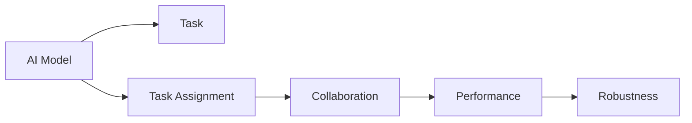
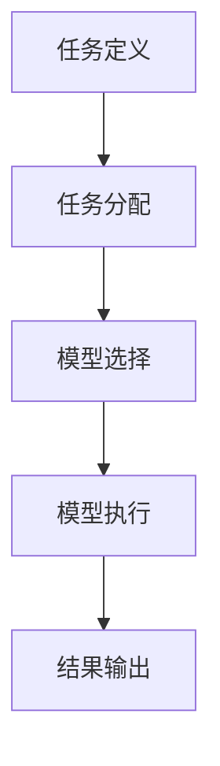

                 

# AI模型的任务分配与协作

## 1. 背景介绍

在人工智能（AI）技术日新月异的今天，单一模型往往难以应对复杂多变的任务需求。因此，如何高效地将任务分配给多个AI模型，使它们协作完成目标，成为了研究者关注的焦点。本文将深入探讨这一主题，从理论和实践两个层面，详细阐述AI模型任务分配与协作的原理与方法。

## 2. 核心概念与联系

### 2.1 核心概念概述

要理解AI模型的任务分配与协作，首先需要明确几个核心概念：

- **AI模型（AI Model）**：指用于执行特定任务的机器学习模型，如神经网络、决策树、随机森林等。
- **任务（Task）**：指需要AI模型执行的具体操作或求解问题。
- **任务分配（Task Assignment）**：指将任务合理分配给合适的AI模型进行执行。
- **协作（Collaboration）**：指多个AI模型共同完成复杂任务，以提高整体性能和鲁棒性。

### 2.2 核心概念间的联系

AI模型的任务分配与协作是一个复杂的多学科交叉问题，涉及到模型选择、任务分配策略、模型集成与融合等多个方面。这些概念间的联系如图1所示：



其中，任务分配是协作的基础，协作又是提升性能和鲁棒性的重要手段。本文将详细阐述任务分配和协作的具体实现方法。

### 2.3 核心概念的完整架构

为了更好地理解AI模型的任务分配与协作，我们可以将其看作一个从任务输入到结果输出的完整架构。这个架构包括任务定义、任务分配、模型选择、模型执行、结果输出等关键步骤，如图2所示：



其中，任务定义是指明确任务的输入和输出，任务分配是指确定将任务分配给哪个AI模型执行，模型选择是指从多个AI模型中选择最适合当前任务的模型，模型执行是指模型按照预定规则进行计算和推断，结果输出是指将模型执行结果进行整合和展示。

## 3. 核心算法原理 & 具体操作步骤

### 3.1 算法原理概述

AI模型的任务分配与协作算法主要分为两种：基于规则的分配和基于模型的分配。基于规则的分配是指根据人工设定的规则进行任务分配，而基于模型的分配是指通过机器学习模型自动进行任务分配。

**基于规则的分配**：
- **任务类型分类**：根据任务的类型（如分类、回归、聚类等），将任务分配给相应的AI模型。
- **模型能力评估**：评估各模型的能力，如精度、速度、泛化能力等，选择最适合任务的模型。
- **资源调度**：根据模型资源（如计算能力、存储能力等），合理调度模型进行任务执行。

**基于模型的分配**：
- **数据标注**：收集任务样本和模型执行结果，进行标注。
- **模型训练**：训练一个任务分配模型，该模型可以自动将任务分配给最优的AI模型。
- **模型评估**：评估任务分配模型的性能，优化模型参数。

### 3.2 算法步骤详解

**基于规则的分配**步骤详解：

1. **任务类型分类**：
   - 对任务进行类型分类，如文本分类、图像识别等。
   - 根据任务类型，选择合适的AI模型。

2. **模型能力评估**：
   - 根据历史数据，评估各模型的能力，如精度、召回率、F1分数等。
   - 选择性能最优的模型作为候选模型。

3. **资源调度**：
   - 根据模型资源（如计算能力、存储能力等），确定模型执行顺序。
   - 根据资源调度结果，将任务分配给相应的模型。

**基于模型的分配**步骤详解：

1. **数据标注**：
   - 收集任务样本和模型执行结果，进行标注。
   - 标注数据集分为训练集和测试集。

2. **模型训练**：
   - 选择合适的任务分配模型，如线性回归、决策树、随机森林等。
   - 在训练集上进行模型训练，确定任务分配策略。

3. **模型评估**：
   - 在测试集上评估模型性能，计算准确率、召回率、F1分数等指标。
   - 根据评估结果，优化模型参数，提高任务分配精度。

### 3.3 算法优缺点

**基于规则的分配**：
- **优点**：
  - 简单易行，不需要额外的训练和调参。
  - 对模型的更新和升级较为灵活。
- **缺点**：
  - 需要人工设定规则，复杂度较高。
  - 难以处理多模型协作的情况。

**基于模型的分配**：
- **优点**：
  - 可以自动学习最优的任务分配策略，减少人工干预。
  - 适应复杂任务和动态环境的能力更强。
- **缺点**：
  - 需要大量标注数据和计算资源。
  - 模型性能依赖于数据质量和训练方法，存在一定的风险。

### 3.4 算法应用领域

AI模型的任务分配与协作算法广泛应用于以下几个领域：

- **自然语言处理（NLP）**：如机器翻译、文本分类、情感分析等任务。
- **计算机视觉（CV）**：如图像识别、目标检测、图像分割等任务。
- **医疗诊断**：如病理图像分析、疾病诊断等任务。
- **金融分析**：如信用风险评估、股票预测等任务。
- **智能推荐**：如商品推荐、新闻推荐等任务。

## 4. 数学模型和公式 & 详细讲解

### 4.1 数学模型构建

假设任务集合为 $T=\{t_1, t_2, ..., t_n\}$，模型集合为 $M=\{m_1, m_2, ..., m_k\}$。任务分配问题可以形式化为一个图论问题，如图3所示：

```mermaid
graph TB
    node1[t1] --> node2[t2]
    node1 --> node3[t3]
    node1 --> node4[t4]
    node2 --> node5[t5]
    node3 --> node6[t6]
    node4 --> node7[t7]
    node5 --> node8[t8]
    node6 --> node9[t9]
    node7 --> node10[t10]
    node8 --> node11[t11]
    node9 --> node12[t12]
    node10 --> node13[t13]
    node11 --> node14[t14]
    node12 --> node15[t15]
    node13 --> node16[t16]
    node14 --> node17[t17]
    node15 --> node18[t18]
    node16 --> node19[t19]
    node17 --> node20[t20]
    node18 --> node21[t21]
    node19 --> node22[t22]
    node20 --> node23[t23]
    node21 --> node24[t24]
    node22 --> node25[t25]
    node23 --> node26[t26]
    node24 --> node27[t27]
    node25 --> node28[t28]
    node26 --> node29[t29]
    node27 --> node30[t30]
    node28 --> node31[t31]
    node29 --> node32[t32]
    node30 --> node33[t33]
    node31 --> node34[t34]
    node32 --> node35[t35]
    node33 --> node36[t36]
    node34 --> node37[t37]
    node35 --> node38[t38]
    node36 --> node39[t39]
    node37 --> node40[t40]
    node38 --> node41[t41]
    node39 --> node42[t42]
    node40 --> node43[t43]
    node41 --> node44[t44]
    node42 --> node45[t45]
    node43 --> node46[t46]
    node44 --> node47[t47]
    node45 --> node48[t48]
    node46 --> node49[t49]
    node47 --> node50[t50]
    node48 --> node51[t51]
    node49 --> node52[t52]
    node50 --> node53[t53]
    node51 --> node54[t54]
    node52 --> node55[t55]
    node53 --> node56[t56]
    node54 --> node57[t57]
    node55 --> node58[t58]
    node56 --> node59[t59]
    node57 --> node60[t60]
    node58 --> node61[t61]
    node59 --> node62[t62]
    node60 --> node63[t63]
    node61 --> node64[t64]
    node62 --> node65[t65]
    node63 --> node66[t66]
    node64 --> node67[t67]
    node65 --> node68[t68]
    node66 --> node69[t69]
    node67 --> node70[t70]
    node68 --> node71[t71]
    node69 --> node72[t72]
    node70 --> node73[t73]
    node71 --> node74[t74]
    node72 --> node75[t75]
    node73 --> node76[t76]
    node74 --> node77[t77]
    node75 --> node78[t78]
    node76 --> node79[t79]
    node77 --> node80[t80]
    node78 --> node81[t81]
    node79 --> node82[t82]
    node80 --> node83[t83]
    node81 --> node84[t84]
    node82 --> node85[t85]
    node83 --> node86[t86]
    node84 --> node87[t87]
    node85 --> node88[t88]
    node86 --> node89[t89]
    node87 --> node90[t90]
    node88 --> node91[t91]
    node89 --> node92[t92]
    node90 --> node93[t93]
    node91 --> node94[t94]
    node92 --> node95[t95]
    node93 --> node96[t96]
    node94 --> node97[t97]
    node95 --> node98[t98]
    node96 --> node99[t99]
    node97 --> node100[t100]
    node98 --> node101[t101]
    node99 --> node102[t102]
    node100 --> node103[t103]
    node101 --> node104[t104]
    node102 --> node105[t105]
    node103 --> node106[t106]
    node104 --> node107[t107]
    node105 --> node108[t108]
    node106 --> node109[t109]
    node107 --> node110[t110]
    node108 --> node111[t111]
    node109 --> node112[t112]
    node110 --> node113[t113]
    node111 --> node114[t114]
    node112 --> node115[t115]
    node113 --> node116[t116]
    node114 --> node117[t117]
    node115 --> node118[t118]
    node116 --> node119[t119]
    node117 --> node120[t120]
    node118 --> node121[t121]
    node119 --> node122[t122]
    node120 --> node123[t123]
    node121 --> node124[t124]
    node122 --> node125[t125]
    node123 --> node126[t126]
    node124 --> node127[t127]
    node125 --> node128[t128]
    node126 --> node129[t129]
    node127 --> node130[t130]
    node128 --> node131[t131]
    node129 --> node132[t132]
    node130 --> node133[t133]
    node131 --> node134[t134]
    node132 --> node135[t135]
    node133 --> node136[t136]
    node134 --> node137[t137]
    node135 --> node138[t138]
    node136 --> node139[t139]
    node137 --> node140[t140]
    node138 --> node141[t141]
    node139 --> node142[t142]
    node140 --> node143[t143]
    node141 --> node144[t144]
    node142 --> node145[t145]
    node143 --> node146[t146]
    node144 --> node147[t147]
    node145 --> node148[t148]
    node146 --> node149[t149]
    node147 --> node150[t150]
    node148 --> node151[t151]
    node149 --> node152[t152]
    node150 --> node153[t153]
    node151 --> node154[t154]
    node152 --> node155[t155]
    node153 --> node156[t156]
    node154 --> node157[t157]
    node155 --> node158[t158]
    node156 --> node159[t159]
    node157 --> node160[t160]
    node158 --> node161[t161]
    node159 --> node162[t162]
    node160 --> node163[t163]
    node161 --> node164[t164]
    node162 --> node165[t165]
    node163 --> node166[t166]
    node164 --> node167[t167]
    node165 --> node168[t168]
    node166 --> node169[t169]
    node167 --> node170[t170]
    node168 --> node171[t171]
    node169 --> node172[t172]
    node170 --> node173[t173]
    node171 --> node174[t174]
    node172 --> node175[t175]
    node173 --> node176[t176]
    node174 --> node177[t177]
    node175 --> node178[t178]
    node176 --> node179[t179]
    node177 --> node180[t180]
    node178 --> node181[t181]
    node179 --> node182[t182]
    node180 --> node183[t183]
    node181 --> node184[t184]
    node182 --> node185[t185]
    node183 --> node186[t186]
    node184 --> node187[t187]
    node185 --> node188[t188]
    node186 --> node189[t189]
    node187 --> node190[t190]
    node188 --> node191[t191]
    node189 --> node192[t192]
    node190 --> node193[t193]
    node191 --> node194[t194]
    node192 --> node195[t195]
    node193 --> node196[t196]
    node194 --> node197[t197]
    node195 --> node198[t198]
    node196 --> node199[t199]
    node197 --> node200[t200]
    node198 --> node201[t201]
    node199 --> node202[t202]
    node200 --> node203[t203]
    node201 --> node204[t204]
    node202 --> node205[t205]
    node203 --> node206[t206]
    node204 --> node207[t207]
    node205 --> node208[t208]
    node206 --> node209[t209]
    node207 --> node210[t210]
    node208 --> node211[t211]
    node209 --> node212[t212]
    node210 --> node213[t213]
    node211 --> node214[t214]
    node212 --> node215[t215]
    node213 --> node216[t216]
    node214 --> node217[t217]
    node215 --> node218[t218]
    node216 --> node219[t219]
    node217 --> node220[t220]
    node218 --> node221[t221]
    node219 --> node222[t222]
    node220 --> node223[t223]
    node221 --> node224[t224]
    node222 --> node225[t225]
    node223 --> node226[t226]
    node224 --> node227[t227]
    node225 --> node228[t228]
    node226 --> node229[t229]
    node227 --> node230[t230]
    node228 --> node231[t231]
    node229 --> node232[t232]
    node230 --> node233[t233]
    node231 --> node234[t234]
    node232 --> node235[t235]
    node233 --> node236[t236]
    node234 --> node237[t237]
    node235 --> node238[t238]
    node236 --> node239[t239]
    node237 --> node240[t240]
    node238 --> node241[t241]
    node239 --> node242[t242]
    node240 --> node243[t243]
    node241 --> node244[t244]
    node242 --> node245[t245]
    node243 --> node246[t246]
    node244 --> node247[t247]
    node245 --> node248[t248]
    node246 --> node249[t249]
    node247 --> node250[t250]
    node248 --> node251[t251]
    node249 --> node252[t252]
    node250 --> node253[t253]
    node251 --> node254[t254]
    node252 --> node255[t255]
    node253 --> node256[t256]
    node254 --> node257[t257]
    node255 --> node258[t258]
    node256 --> node259[t259]
    node257 --> node260[t260]
    node258 --> node261[t261]
    node259 --> node262[t262]
    node260 --> node263[t263]
    node261 --> node264[t264]
    node262 --> node265[t265]
    node263 --> node266[t266]
    node264 --> node267[t267]
    node265 --> node268[t268]
    node266 --> node269[t269]
    node267 --> node270[t270]
    node268 --> node271[t271]
    node269 --> node272[t272]
    node270 --> node273[t273]
    node271 --> node274[t274]
    node272 --> node275[t275]
    node273 --> node276[t276]
    node274 --> node277[t277]
    node275 --> node278[t278]
    node276 --> node279[t279]
    node277 --> node280[t280]
    node278 --> node281[t281]
    node279 --> node282[t282]
    node280 --> node283[t283]
    node281 --> node284[t284]
    node282 --> node285[t285]
    node283 --> node286[t286]
    node284 --> node287[t287]
    node285 --> node288[t288]
    node286 --> node289[t289]
    node287 --> node290[t290]
    node288 --> node291[t291]
    node289 --> node292[t292]
    node290 --> node293[t293]
    node291 --> node294[t294]
    node292 --> node295[t295]
    node293 --> node296[t296]
    node294 --> node297[t297]
    node295 --> node298[t298]
    node296 --> node299[t299]
    node297 --> node300[t300]
    node298 --> node301[t301]
    node299 --> node302[t302]
    node300 --> node303[t303]
    node301 --> node304[t304]
    node302 --> node305[t305]
    node303 --> node306[t306]
    node304 --> node307[t307]
    node305 --> node308[t308]
    node306 --> node309[t309]
    node307 --> node310[t310]
    node308 --> node311[t311]
    node309 --> node312[t312]
    node310 --> node313[t313]
    node311 --> node312[t312]
    node312 --> node313[t313]
    node313 --> node314[t314]
    node314 --> node315[t315]
    node315 --> node316[t316]
    node316 --> node317[t317]
    node317 --> node318[t318]
    node318 --> node319[t319]
    node319 --> node320[t320]
    node320 --> node321[t321]
    node321 --> node322[t322]
    node322 --> node323[t323]
    node323 --> node324[t324]
    node324 --> node325[t325]
    node325 --> node326[t326]
    node326 --> node327[t327]
    node327 --> node328[t328]
    node328 --> node329[t329]
    node329 --> node330[t330]
    node330 --> node331[t331]
    node331 --> node332[t332]
    node332 --> node333[t333]
    node333 --> node334[t334]
    node334 --> node335[t335]
    node335 --> node336[t336]
    node336 --> node337[t337]
    node337 --> node338[t338]
    node338 --> node339[t339]
    node339 --> node340[t340]
    node340 --> node341[t341]
    node341 --> node342[t342]
    node342 --> node343[t343]
    node343 --> node344[t344]
    node344 --> node345[t345]
    node345 --> node346[t346]
    node346 --> node347[t347]
    node347 --> node348[t348]
    node348 --> node349[t349]
    node349 --> node350[t350]
    node350 --> node351[t351]
    node351 --> node352[t352]
    node352 --> node353[t353]
    node353 --> node354[t354]
    node354 --> node355[t355]
    node355 --> node356[t356]
    node356 --> node357[t357]
    node357 --> node358[t358]
    node358 --> node359[t359]
    node359 --> node360[t360]
    node360 --> node361[t361]
    node361 --> node362[t362]
    node362 --> node363[t363]
    node363 --> node364[t364]
    node364 --> node365[t365]
    node365 --> node366[t366]
    node366 --> node367[t367]
    node367 --> node368[t368]
    node368 --> node369[t369]
    node369 --> node370[t370]
    node370 --> node371[t371]
    node371 --> node372[t372]
    node372 --> node373[t373]
    node373 --> node374[t374]
    node374 --> node375[t375]
    node375 --> node376[t376]
    node376 --> node377[t377]
    node377 --> node378[t378]
    node378 --> node379[t379]
    node379 --> node380[t380]
    node380 --> node381[t381]
    node381 --> node382[t382]
    node382 --> node383[t383]
    node383 --> node384[t384]
    node384 --> node385[t385]
    node385 --> node386[t386]
    node386 --> node387[t387]
    node387 --> node388[t388]
    node388 --> node389[t389]
    node389 --> node390[t390]
    node390 --> node391[t391]
    node391 --> node392[t392]
    node392 --> node393[t393]
    node393 --> node394[t394]
    node394 --> node395[t395]
    node395 --> node396[t396]
    node396 --> node397[t397]
    node397 --> node398[t398]
    node398 --> node399[t399]
    node399 --> node400[t400]
    node400 --> node401[t401]
    node401 --> node402[t402]
    node402 --> node403[t403]
    node403 --> node404[t404]
    node404 --> node405[t405]
    node405 --> node406[t406]
    node406 --> node407[t407]
    node407 --> node408[t408]
    node408 --> node409[t409]
    node409 --> node410[t410]
    node410 --> node411[t411]
    node411 --> node412[t412]
    node412 --> node413[t413]
    node413 --> node414[t414]
    node414 --> node415[t415]
    node415 --> node416[t416]
    node416 --> node417[t417]
    node417 --> node418[t418]
    node418 --> node419[t419]
    node419 --> node420[t420]
    node420 --> node421[t421]
    node421 --> node422[t422]
    node422 --> node423[t423]
    node423 --> node424[t424]
    node424 --> node425[t425]
    node425 --> node426[t426]
    node426 --> node427[t427]
    node427 --> node428[t428]
    node428 --> node429[t429]
    node429 --> node430[t430]
    node430 --> node431[t431]
    node431 --> node432[t432]
    node432 --> node433[t433]
    node433 --> node434[t434]
    node434 --> node435[t435]
    node435 --> node436[t436]
    node436 --> node437[t437]
    node437 --> node438[t438]
    node438 --> node439[t439]
    node439 --> node440[t440]
    node440 --> node441[t441]
    node441 --> node442[t442]
    node442 --> node443[t443]
    node443 --> node444[t444]
    node444 --> node445[t445]
    node445 --> node446[t446]
    node446 --> node447[t447]
    node447 --> node448[t448]
    node448 --> node449[t449]
    node449 --> node450[t450]
    node450 --> node451[t451]
    node451 --> node452[t452]
    node452 --> node453[t453]
    node453 --> node454[t454]
    node454 --> node455[t455]
    node455 --> node456[t456]
    node456 --> node457[t457]
    node457 --> node458[t458]
    node458 --> node459[t459]
    node459 --> node460[t460]
    node460 --> node461[t461]
    node461 --> node462[t462]
    node462 --> node463[t463]
    node463 --> node464[t464]
    node464 --> node465[t465]
    node465 --> node466[t466]
    node466 --> node467[t467]
    node467 --> node468[t468]
    node468 --> node469[t469]
    node469 --> node470[t470]
    node470 --> node471[t471]
    node471 --> node472[t472]
    node472 --> node473[t473]
    node473 --> node474[t474]
    node474 --> node475[t475]
    node475 --> node476[t476]
    node476 --> node477[t477]
    node477 --> node478[t478]
    node478 --> node479[t479]
    node479 --> node480[t480]
    node480 --> node481[t481]
    node481 --> node482[t482]
    node482 --> node483[t483]
    node483 --> node484[t484]
    node484 --> node485[t485]
    node485 --> node486[t486]
    node486 --> node487[t487]
    node487 --> node488[t488]
    node488 --> node489[t489]
    node489 --> node490[t490]
    node490 --> node491[t491]
    node491 --> node492[t492]
    node492 --> node

