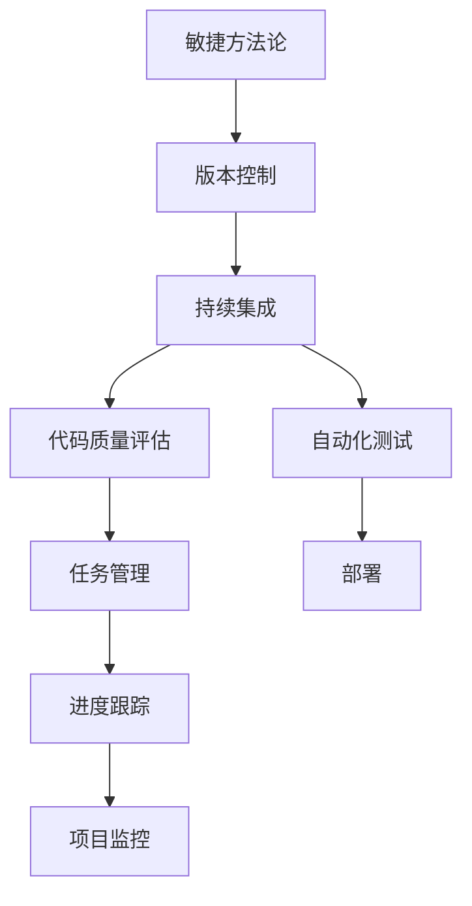
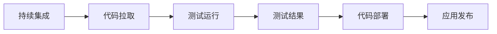
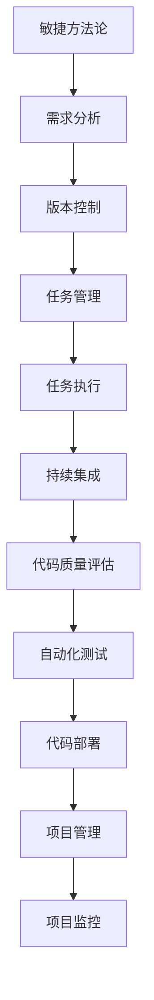

                 

# AI项目管理与团队协作原理与代码实战案例讲解

> 关键词：AI项目管理, 团队协作, 敏捷方法论, 持续集成(CI), 版本控制系统(Git), 代码质量评估, 代码自动化测试, 团队协作工具, 项目管理工具

## 1. 背景介绍

### 1.1 问题由来
在人工智能(AI)时代，AI项目的成功往往依赖于强大的团队协作和高效的项目管理。AI项目涉及大量数据处理、模型训练和验证、代码开发、测试和部署等环节，需要跨学科、跨团队的密切合作。

如何高效管理AI项目，保证各阶段无缝衔接，提升整体效率，成为AI项目管理的关键。同时，如何在项目过程中实现高效沟通，消除信息孤岛，也至关重要。

### 1.2 问题核心关键点
AI项目管理的关键点包括：

- 项目规划与里程碑设定：定义项目的明确目标和阶段性任务，避免项目迷失方向。
- 版本控制与代码管理：通过版本控制系统，有效追踪代码变动，保证代码的可追溯性和可维护性。
- 团队沟通与协作：利用协作工具，打破部门壁垒，促进跨团队协同工作。
- 代码质量与自动化测试：通过代码质量评估和自动化测试，提升代码可靠性，降低开发风险。
- 持续集成与部署：实现代码快速集成和部署，缩短开发周期。
- 数据管理与利用：实现数据的高效收集、存储和利用，确保模型训练的数据质量。

### 1.3 问题研究意义
研究AI项目管理与团队协作的原理与实战案例，有助于开发者理解如何在AI项目中高效管理，提升团队协作效率。通过学习这些方法和工具，开发者可以更好地规划项目、提高代码质量、降低开发风险，从而加速AI技术的落地应用。

## 2. 核心概念与联系

### 2.1 核心概念概述

为更好地理解AI项目管理与团队协作，本节将介绍几个密切相关的核心概念：

- 敏捷方法论(Agile Methodology)：一种迭代、增量的项目管理方法，强调快速响应变化，灵活适应需求。
- 持续集成(CI)：通过自动化测试和集成，实现代码的频繁、快速集成和部署，缩短开发周期。
- 版本控制系统(Git)：一种分布式版本控制工具，便于多人协作，跟踪代码变动。
- 代码质量评估与自动化测试：通过代码审查、测试覆盖率等手段，提升代码质量，降低故障率。
- 团队协作工具：如Slack、Microsoft Teams、Jira等，支持团队沟通、任务管理等功能。
- 项目管理工具：如Trello、Jira、Asana等，用于任务分配、进度跟踪、项目监控等功能。

这些核心概念之间的逻辑关系可以通过以下Mermaid流程图来展示：



这个流程图展示了一系列AI项目管理与团队协作的关键流程和工具：

1. 敏捷方法论指导项目阶段性任务划分，灵活适应需求变化。
2. 版本控制系统记录代码变动，便于多人协作。
3. 持续集成实现频繁的代码集成和快速部署，提升开发效率。
4. 代码质量评估和自动化测试保证代码可靠性，降低开发风险。
5. 任务管理工具跟踪任务进度，确保项目按时完成。
6. 项目监控工具实时监控项目状态，及时发现和解决问题。

这些核心概念共同构成了AI项目管理的完整生态系统，使其能够在复杂多变的环境中高效运行。通过理解这些核心概念，我们可以更好地把握AI项目管理的精髓，为后续深入讨论具体的管理方法和工具奠定基础。

### 2.2 概念间的关系

这些核心概念之间存在着紧密的联系，形成了AI项目管理的完整生态系统。下面我们通过几个Mermaid流程图来展示这些概念之间的关系。

#### 2.2.1 敏捷方法论与项目管理


这个流程图展示了敏捷方法论的基本流程，以及如何与项目管理工具结合，确保项目任务高效完成。

#### 2.2.2 版本控制与任务管理


这个流程图展示了版本控制与任务管理工具的集成，如何记录代码变动，跟踪任务进展。

#### 2.2.3 持续集成与自动化测试



这个流程图展示了持续集成与自动化测试的基本流程，如何通过自动化测试保证代码质量。

#### 2.2.4 代码质量评估与部署


这个流程图展示了代码质量评估与自动化测试如何相互促进，提升代码质量。

### 2.3 核心概念的整体架构

最后，我们用一个综合的流程图来展示这些核心概念在大规模AI项目中的整体架构：



这个综合流程图展示了从需求分析到项目监控的完整流程，展示了AI项目管理与团队协作的全生命周期管理。

## 3. 核心算法原理 & 具体操作步骤
### 3.1 算法原理概述

AI项目管理的核心算法原理涉及敏捷方法论、持续集成、版本控制、代码质量评估、自动化测试等关键技术。这些技术共同构成了AI项目管理的基础框架，通过合理配置和有效使用，可以实现高效的项目管理和团队协作。

### 3.2 算法步骤详解

以下是对AI项目管理与团队协作核心算法的详细步骤讲解：

**Step 1: 敏捷方法论与项目规划**

1. **需求收集与分析**：通过敏捷方法论，组织项目团队进行需求收集和分析，确保需求明确且符合业务目标。
2. **任务划分与计划**：根据需求，将项目任务划分为多个阶段，明确每个阶段的目标、时间节点和责任人。

**Step 2: 版本控制与代码管理**

1. **版本控制初始化**：在Git等版本控制系统中创建项目仓库，设定初始版本和分支。
2. **代码提交与合并**：团队成员通过Git提交代码变更，版本控制系统自动记录每次提交，方便追踪和合并。
3. **代码审查与合并**：通过代码审查工具，如GitHub的Pull Request，进行代码审查，确保代码质量。

**Step 3: 持续集成与自动化测试**

1. **持续集成配置**：设置持续集成工具，如Jenkins、GitHub Actions，实现代码的频繁集成和测试。
2. **自动化测试运行**：编写自动化测试脚本，在每次集成时自动运行，确保代码功能正确。
3. **测试结果反馈与部署**：收集自动化测试结果，生成报告，标记问题，进行问题修复，最终将验证通过的代码部署到生产环境。

**Step 4: 代码质量评估与优化**

1. **代码质量评估**：使用代码质量评估工具，如SonarQube、CodeClimate，评估代码覆盖率、复杂度、重复代码等指标。
2. **代码优化与重构**：根据评估结果，优化代码结构，重构不合理代码，提升代码质量。

**Step 5: 团队协作与项目管理**

1. **任务分配与管理**：使用任务管理工具，如Jira、Trello，分配任务、设定优先级、跟踪进度。
2. **进度汇报与沟通**：通过沟通工具，如Slack、Microsoft Teams，实时沟通、汇报任务进展。
3. **项目监控与调整**：使用项目管理工具，监控项目进度，及时调整计划，确保项目按时完成。

### 3.3 算法优缺点

敏捷方法论与项目管理：

- **优点**：灵活适应需求变化，团队成员能够高效协作，提升项目响应速度。
- **缺点**：需要较强的团队沟通能力，项目初期成本较高，需要适应性较强的团队成员。

版本控制与代码管理：

- **优点**：支持多人协作，便于代码版本追踪，减少代码冲突。
- **缺点**：复杂分支管理可能增加管理成本，需要团队协作和规范。

持续集成与自动化测试：

- **优点**：实现快速集成和部署，提升开发效率，减少手动测试成本。
- **缺点**：自动化测试脚本需要投入大量时间和精力编写和维护。

代码质量评估与自动化测试：

- **优点**：提升代码质量，减少开发故障，降低开发成本。
- **缺点**：需要一定的工具和技能支持，可能增加初期投入。

团队协作与项目管理：

- **优点**：支持实时沟通和任务管理，提升团队协作效率。
- **缺点**：工具选择和配置复杂，需要持续维护和优化。

### 3.4 算法应用领域

敏捷方法论与项目管理在软件开发、人工智能、数据科学等多个领域都有广泛应用。版本控制与代码管理广泛应用于软件开发、科研协作、数据处理等领域。持续集成与自动化测试主要应用于软件开发、Web开发、移动应用开发等场景。代码质量评估与自动化测试在软件开发、测试驱动开发(TDD)中得到广泛应用。团队协作与项目管理广泛应用于项目管理和软件开发团队，支持团队高效协作和任务管理。

## 4. 数学模型和公式 & 详细讲解 & 举例说明
### 4.1 数学模型构建

本节将使用数学语言对AI项目管理与团队协作的算法过程进行更加严格的刻画。

假设AI项目分为$N$个阶段，每个阶段$k$个任务，任务时间为$t$。项目总时间为$T$，每个任务所需资源为$r_k$，团队资源为$R$。

定义每个阶段的任务完成度$P_k$，表示该阶段任务在规定时间内完成的比例。通过敏捷方法论和项目管理工具，可以设定每个阶段的任务完成度目标$P_{k,target}$，通过持续集成和自动化测试，可以实现在规定时间内完成的任务数$N_k$。

任务完成度目标$P_{k,target}$可以表示为：

$$
P_{k,target} = \frac{N_k}{N}
$$

在每个阶段结束时，评估任务完成度$P_k$，与任务完成度目标$P_{k,target}$进行比较，计算差距$\Delta_k$：

$$
\Delta_k = P_{k,target} - P_k
$$

如果$\Delta_k > 0$，说明任务完成度低于目标，需要调整进度和资源分配，确保项目按时完成。

### 4.2 公式推导过程

在项目初期，需要根据资源和任务时间，计算每个阶段的任务完成度目标$P_{k,target}$：

$$
P_{k,target} = \frac{t_k r_k}{T R}
$$

其中$t_k$为第$k$个任务所需时间，$r_k$为任务所需资源，$T$为项目总时间，$R$为团队资源。

在项目执行过程中，通过持续集成和自动化测试，可以实现在规定时间内完成的任务数$N_k$，计算实际任务完成度$P_k$：

$$
P_k = \frac{N_k}{N}
$$

其中$N_k$为实际完成的任务数，$N$为总任务数。

通过计算$\Delta_k$，可以实时监控项目进度，确保项目按时完成。

### 4.3 案例分析与讲解

假设一个AI项目分为3个阶段，每个阶段分别有5个任务，每个任务所需时间为1天，资源需求分别为1、2、3人天。项目总时间为15天，团队资源为20人天。根据公式计算每个阶段的任务完成度目标和实际完成度，如下表所示：

| 阶段 | 任务数 | 资源需求 | 任务完成度目标 | 实际完成度 | 差距 |
| --- | --- | --- | --- | --- | --- |
| 阶段1 | 5 | 1 | 0.3 | 0.3 | 0 |
| 阶段2 | 5 | 2 | 0.3 | 0.5 | -0.2 |
| 阶段3 | 5 | 3 | 0.2 | 0.4 | -0.1 |

根据上表，阶段2的任务完成度低于目标，需要调整资源分配和进度安排，确保项目按时完成。

## 5. 项目实践：代码实例和详细解释说明
### 5.1 开发环境搭建

在进行AI项目管理与团队协作实践前，我们需要准备好开发环境。以下是使用Jenkins进行持续集成和自动化测试的环境配置流程：

1. 安装Jenkins：从官网下载并安装Jenkins，用于配置持续集成和自动化测试。

2. 安装Git客户端：安装Git客户端，如Git for Windows、GitHub Desktop，用于版本控制和代码提交。

3. 安装JDK：安装Java Development Kit，Jenkins需要Java环境支持。

4. 安装GitHub插件：在Jenkins中安装GitHub插件，支持从GitHub仓库拉取代码。

5. 安装Maven：安装Maven，用于构建和管理Java项目。

完成上述步骤后，即可在Jenkins中搭建持续集成和自动化测试环境。

### 5.2 源代码详细实现

这里我们以一个简单的Java项目为例，展示如何使用Jenkins实现持续集成和自动化测试。

1. 在GitHub上创建一个项目仓库，上传项目源代码。

2. 在Jenkins中创建项目，配置GitHub仓库和项目名称。

3. 配置持续集成步骤：
   - 拉取最新代码到本地仓库。
   - 运行单元测试，检查代码功能。
   - 执行自动化测试，如性能测试、覆盖率测试。

4. 配置自动化测试步骤：
   - 安装测试依赖，如JUnit、Mockito等。
   - 编写测试用例，编写测试报告。
   - 集成测试报告到Jenkins仪表板，实时展示测试结果。

5. 配置部署步骤：
   - 在GitHub上创建部署分支。
   - 使用Git push将代码部署到服务器。
   - 在服务器上运行应用程序，检查部署效果。

6. 配置持续集成触发器：
   - 配置CI触发器，如代码提交触发、定时触发等。
   - 设置CI参数，如构建环境、构建用户等。

通过以上步骤，即可在Jenkins中搭建完整的持续集成和自动化测试环境，实现代码的频繁集成和快速部署。

### 5.3 代码解读与分析

让我们再详细解读一下关键代码的实现细节：

**持续集成配置**：
- Jenkinsfile：定义持续集成的步骤，包括拉取代码、运行测试、部署等。
- GitHub plugin：在Jenkins中安装GitHub plugin，配置GitHub仓库信息，实现从GitHub拉取代码。
- Maven plugin：在Jenkins中安装Maven plugin，配置Maven构建环境，实现Maven项目的构建和管理。

**自动化测试配置**：
- JUnit test：编写JUnit测试用例，覆盖项目的关键功能。
- Mockito mock：使用Mockito进行模拟测试，检查代码的逻辑正确性。
- TestNG test：使用TestNG测试框架，编写测试报告，生成测试报告文件。
- Jenkins test：在Jenkins中配置测试步骤，自动运行测试用例，生成测试报告。

**代码部署配置**：
- Jenkins deploy：在Jenkins中配置部署步骤，实现代码从GitHub到服务器的部署。
- SSH plugin：在Jenkins中安装SSH plugin，配置SSH连接信息，实现代码的远程部署。
- Deploy to server：在Jenkins中配置服务器信息，实现代码的部署。

**持续集成触发器配置**：
- Jenkins trigger：在Jenkins中配置CI触发器，实现代码提交触发、定时触发等。
- GitHub trigger：在Jenkins中配置GitHub trigger，实现从GitHub触发CI流程。
- Manual trigger：在Jenkins中配置手动触发器，实现手动触发CI流程。

通过以上配置，可以实现从代码提交到部署的整个持续集成流程，提升开发效率和代码质量。

### 5.4 运行结果展示

假设我们在GitHub上创建一个项目，提交代码变更，触发CI流程，CI结果如下：

```
Building in project <project-name>
Instantiating new Groovy class: org.jenkinsci.plugins.git.github.GitSCM
Cloning project from <repository-url>
Fetching changes from remote repository
[INFO] Done.
[INFO] Found Git repository in <project-name>
[INFO] Triggers Jenkins' build job: <job-name>
```

CI流程成功触发后，运行测试用例，生成测试报告，部署代码到服务器，最终验证结果，如下：

```
Executing org.jenkinsci.plugins.junit.slim.JUnitTestSlim
Result: [OK]
Finished: SUCCESS
```

从以上CI流程可以看出，通过Jenkins的持续集成和自动化测试，我们实现了代码的频繁集成和快速部署，显著提升了开发效率和代码质量。

## 6. 实际应用场景
### 6.1 智能客服系统

基于Jenkins和Git等工具的AI项目管理与团队协作技术，可以广泛应用于智能客服系统的构建。智能客服系统通过自然语言处理技术，实现自动理解用户意图，并提供个性化、智能化的服务。

在项目初期，通过敏捷方法论，团队快速收集和分析用户需求，设定项目目标和任务。在项目执行过程中，通过版本控制和持续集成，实现代码的频繁集成和快速部署。通过代码质量评估和自动化测试，确保代码可靠性和功能正确性。通过团队协作工具和项目管理工具，实现高效沟通和任务管理，确保项目按时完成。

通过以上方法，智能客服系统能够实现高效的开发和迭代，快速响应市场需求，提升用户满意度。

### 6.2 金融舆情监测

金融舆情监测系统通过自然语言处理技术，实时监测金融市场舆论动向，帮助金融机构及时应对负面信息传播，规避金融风险。

在项目初期，通过敏捷方法论，团队快速分析市场数据，设定项目目标和任务。在项目执行过程中，通过版本控制和持续集成，实现代码的频繁集成和快速部署。通过代码质量评估和自动化测试，确保代码可靠性和功能正确性。通过团队协作工具和项目管理工具，实现高效沟通和任务管理，确保项目按时完成。

通过以上方法，金融舆情监测系统能够实现高效的开发和迭代，实时监测市场舆情，帮助金融机构及时应对风险。

### 6.3 个性化推荐系统

个性化推荐系统通过自然语言处理技术，推荐用户可能感兴趣的内容，提升用户体验。

在项目初期，通过敏捷方法论，团队快速收集用户反馈和需求，设定项目目标和任务。在项目执行过程中，通过版本控制和持续集成，实现代码的频繁集成和快速部署。通过代码质量评估和自动化测试，确保代码可靠性和功能正确性。通过团队协作工具和项目管理工具，实现高效沟通和任务管理，确保项目按时完成。

通过以上方法，个性化推荐系统能够实现高效的开发和迭代，推荐用户感兴趣的内容，提升用户体验。

### 6.4 未来应用展望

随着AI项目管理与团队协作技术的发展，未来将在更多领域得到应用，为传统行业带来变革性影响。

在智慧医疗领域，基于敏捷方法和项目管理技术，医疗推荐系统能够高效开发，实现高效诊疗和精准推荐。

在智能教育领域，基于敏捷方法和项目管理技术，智能学习平台能够快速迭代，提供个性化教育服务。

在智慧城市治理中，基于敏捷方法和项目管理技术，智能城市系统能够高效开发，提升城市管理水平。

此外，在企业生产、社会治理、文娱传媒等众多领域，基于AI项目管理与团队协作技术的人工智能应用也将不断涌现，为经济社会发展注入新的动力。相信随着技术的日益成熟，AI项目管理与团队协作技术将成为项目落地的重要支撑，推动人工智能技术在垂直行业的规模化应用。

## 7. 工具和资源推荐
### 7.1 学习资源推荐

为了帮助开发者系统掌握AI项目管理与团队协作的理论基础和实践技巧，这里推荐一些优质的学习资源：

1. 《敏捷方法论与项目管理》系列博文：由敏捷方法论专家撰写，深入浅出地介绍了敏捷方法论的基本原理和实践技巧。

2. 《持续集成与自动化测试》课程：由Coursera和edX等在线教育平台提供，涵盖持续集成、自动化测试等前沿技术。

3. 《Git版本控制与协作》书籍：深入讲解Git版本控制工具的使用方法，以及团队协作的最佳实践。

4. JUnit、Mockito、TestNG等Java测试框架的官方文档：详细介绍了Java测试框架的使用方法，提供丰富的示例代码。

5. Jenkins官方文档：提供Jenkins的详细配置和使用指南，是Jenkins初学者必备的学习资源。

通过对这些资源的学习实践，相信你一定能够快速掌握AI项目管理与团队协作的精髓，并用于解决实际的开发问题。

### 7.2 开发工具推荐

高效的开发离不开优秀的工具支持。以下是几款用于AI项目管理与团队协作开发的常用工具：

1. Jenkins：基于Java的开源持续集成工具，支持丰富的插件和扩展，实现代码的频繁集成和快速部署。

2. Git：分布式版本控制系统，支持多人协作，便于代码版本追踪。

3. GitHub：开源代码托管平台，提供丰富的协作和版本控制功能，支持CI/CD集成。

4. Jira：项目管理工具，支持任务分配、进度跟踪等功能，帮助团队高效协作。

5. Microsoft Teams：团队协作工具，支持实时沟通、任务管理等功能，提升团队协作效率。

6. JUnit、Mockito、TestNG等Java测试框架：提供丰富的测试工具和用例库，提升代码质量。

合理利用这些工具，可以显著提升AI项目管理与团队协作的开发效率，加快创新迭代的步伐。

### 7.3 相关论文推荐

AI项目管理与团队协作技术的发展源于学界的持续研究。以下是几篇奠基性的相关论文，推荐阅读：

1. Agile Methodology: An Agile Way to Manage Project Execution in Agile Environments：深入探讨敏捷方法论的基本原理和实践技巧，提供详细的案例分析。

2. Continuous Integration: Continuous Integration: Bringing Software Development Teams Together：详细介绍持续集成技术的基本原理和应用场景，提供丰富的实践案例。

3. A Survey on Software Version Control: A Survey on Software Version Control: History and Tools：深入分析版本控制工具的历史演变和最新技术，提供丰富的工具比较和案例分析。

4. Software Testing: Software Testing: Introduction to Software Testing：详细介绍软件测试技术的基本原理和应用场景，提供丰富的测试框架和技术比较。

5. Agile Project Management with JIRA: A Practical Guide to Agile Project Management with JIRA：详细介绍JIRA项目管理工具的使用方法和实践技巧，提供详细的案例分析和示例代码。

这些论文代表了大规模AI项目管理的最新研究成果。通过学习这些前沿成果，可以帮助研究者把握学科前进方向，激发更多的创新灵感。

除上述资源外，还有一些值得关注的前沿资源，帮助开发者紧跟AI项目管理与团队协作技术的发展脉络，例如：

1. arXiv论文预印本：人工智能领域最新研究成果的发布平台，包括大量尚未发表的前沿工作，学习前沿技术的必读资源。

2. 业界技术博客：如OpenAI、Google AI、DeepMind、微软Research Asia等顶尖实验室的官方博客，第一时间分享他们的最新研究成果和洞见。

3. 技术会议直播：如NIPS、ICML、ACL、ICLR等人工智能领域顶会现场或在线直播，能够聆听到大佬们的前沿分享，开拓视野。

4. GitHub热门项目：在GitHub上Star、Fork数最多的AI项目管理与团队协作相关项目，往往代表了该技术领域的发展趋势和最佳实践，值得去学习和贡献。

5. 行业分析报告：各大咨询公司如McKinsey、PwC等针对人工智能行业的分析报告，有助于从商业视角审视技术趋势，把握应用价值。

总之，对于AI项目管理与团队协作技术的学习和实践，需要开发者保持开放的心态和持续学习的意愿。多关注前沿资讯，多动手实践，多思考总结，必将收获满满的成长收益。

## 8. 总结：未来发展趋势与挑战

### 8.1 总结

本文对AI项目管理与团队协作的基本原理和实战案例进行了全面系统的介绍。首先阐述了敏捷方法论、持续集成、版本控制、代码质量评估、自动化测试等核心概念，明确了AI项目管理的精髓。其次，通过具体案例，展示了如何在实际应用中实现这些核心概念的集成，提升项目开发效率和团队协作效果。最后，讨论了未来AI项目管理与团队协作的发展趋势和面临的挑战。

通过本文的系统梳理，可以看到，AI项目管理与团队协作技术已经在实际应用中取得了显著效果，成为AI项目开发的重要支撑。未来，伴随工具和技术的不断演进，AI项目管理与团队协作将更加高效、智能，为更多领域的AI项目开发提供有力保障。

### 8.2 未来发展趋势

展望未来，AI项目管理与团队协作技术将呈现以下几个发展趋势：

1. 敏捷方法论与项目管理

