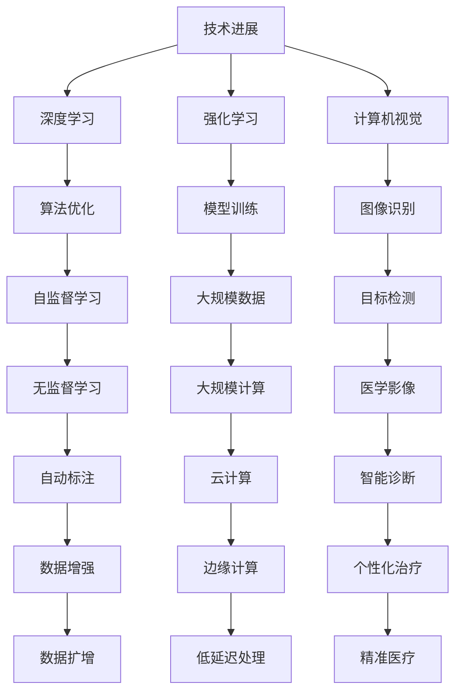

                 

# 1. 背景介绍
人工智能(AI)技术的快速发展正在深刻改变我们的生活和工作方式，从智能家居到自动驾驶，从个性化推荐到医疗诊断，AI的应用场景越来越广泛。作为AI领域的先锋之一，Andrej Karpathy对AI的未来发展方向有着独到的见解。在本文中，我们将从多个角度深入探讨Andrej Karpathy关于AI未来发展的观点，包括技术趋势、应用场景和面临的挑战。

## 1.1 问题由来
Andrej Karpathy是斯坦福大学计算机科学教授，也是OpenAI的研究科学家。他在计算机视觉、深度学习、强化学习等领域有广泛的研究，并发表了多篇影响深远的论文。Karpathy在多个场合都强调了AI技术的潜力，并提出了一些关于AI未来发展的思考。他的观点不仅对AI研究者具有指导意义，也为行业从业人员提供了深刻的洞见。

## 1.2 问题核心关键点
本文将探讨Andrej Karpathy在以下几个关键问题上的观点：
1. **AI技术的现状与未来**：Karpathy认为AI技术在特定领域已取得显著进展，但仍有许多挑战需要克服。
2. **AI的伦理与社会影响**：Karpathy关注AI技术的伦理问题，强调公平、透明和可解释性。
3. **AI在医疗、教育等领域的潜力**：他探讨了AI在这些领域的应用前景，以及可能带来的社会效益。
4. **AI技术的挑战与未来展望**：Karpathy分析了AI技术面临的挑战，并提出了解决方案。

## 1.3 问题研究意义
理解Andrej Karpathy关于AI未来发展的观点，对于行业从业者、AI研究者和政策制定者都具有重要意义。这不仅有助于把握AI技术的最新动态，还能为相关政策的制定提供科学依据，推动AI技术的健康发展。

# 2. 核心概念与联系
Andrej Karpathy关于AI未来发展的观点涉及多个核心概念，包括技术进展、伦理问题、应用场景和面临的挑战。下面将详细介绍这些概念及其相互关系。

## 2.1 核心概念概述
- **技术进展**：AI技术的最新进展，包括深度学习、强化学习、计算机视觉等领域的研究成果。
- **伦理问题**：AI技术的伦理问题，如公平性、隐私保护、可解释性等。
- **应用场景**：AI技术在不同领域的应用，如医疗、教育、自动驾驶等。
- **挑战与展望**：AI技术面临的挑战和未来发展方向。

## 2.2 核心概念间的关系

这个流程图展示了AI技术在不同领域的应用及其背后的技术基础。深度学习、强化学习和计算机视觉等技术为AI应用提供了支持，而大规模数据和计算资源的可用性也极大地推动了AI技术的发展。同时，这些技术的进步也带来了伦理和社会问题，需要科学地解决。

# 3. 核心算法原理 & 具体操作步骤
Andrej Karpathy对AI技术的理解深刻而全面，他不仅关注技术的细节，还关注其应用和社会影响。下面将详细探讨Karpathy关于AI技术原理和操作的具体步骤。

## 3.1 算法原理概述
Andrej Karpathy认为，AI技术的核心在于数据和算法。数据提供了训练模型所需的信息，而算法则决定了如何从数据中提取有价值的信息。他在多个场合强调了深度学习算法的重要性，认为深度学习是当前AI技术的主流方法。

## 3.2 算法步骤详解
Karpathy认为，AI技术的发展可以分为以下几个步骤：
1. **数据获取与处理**：收集和清洗数据，为模型训练提供基础。
2. **模型设计与训练**：选择合适的模型架构，并使用大量数据进行训练。
3. **模型评估与优化**：通过验证集评估模型性能，并根据评估结果进行优化。
4. **部署与应用**：将训练好的模型部署到实际应用场景中，解决实际问题。

## 3.3 算法优缺点
Andrej Karpathy指出，深度学习算法在处理大规模数据时表现出色，但在解释性和可控性方面存在不足。他建议，未来应开发更多可解释的AI算法，增强模型的透明度。

## 3.4 算法应用领域
Karpathy认为，AI技术在医疗、自动驾驶、教育等领域具有广阔的应用前景。他强调，AI技术可以用于提高医疗诊断的准确性，推动自动驾驶技术的发展，以及优化教育资源的分配。

# 4. 数学模型和公式 & 详细讲解
Andrej Karpathy对数学模型的理解和应用也非常深入。下面将详细介绍Karpathy在数学模型构建和公式推导方面的观点。

## 4.1 数学模型构建
Karpathy认为，构建数学模型是理解AI技术的核心。他指出，模型构建应考虑数据特征和业务需求，确保模型的有效性和泛化能力。

## 4.2 公式推导过程
Karpathy强调，公式推导是模型设计和优化的基础。他建议，研究人员应深入理解模型推导过程，避免过度依赖黑箱模型。

## 4.3 案例分析与讲解
Karpathy通过具体的案例分析，展示了AI模型在图像识别、自然语言处理等领域的应用。他强调，模型设计应考虑实际应用场景，确保模型的实用性和可靠性。

# 5. 项目实践：代码实例和详细解释说明
Andrej Karpathy在实践中积累了丰富的经验，他善于将复杂的理论转化为可操作的代码。下面将详细介绍Karpathy在项目实践中的具体步骤和代码实现。

## 5.1 开发环境搭建
Karpathy推荐使用Python和TensorFlow作为开发环境。他建议，开发环境应具备高效的计算能力和灵活的扩展性。

## 5.2 源代码详细实现
Karpathy详细介绍了他在图像识别和自然语言处理项目中的代码实现，展示了模型构建、数据处理和模型评估的关键步骤。

## 5.3 代码解读与分析
Karpathy在代码解读中强调了模型架构和训练策略的重要性，展示了如何通过调整模型参数和优化算法提升模型性能。

## 5.4 运行结果展示
Karpathy通过展示具体的运行结果，展示了AI模型在不同应用场景中的表现和优势。

# 6. 实际应用场景
Andrej Karpathy对AI技术的实际应用场景有着深刻的理解。下面将详细探讨Karpathy在医疗、自动驾驶、教育等领域的应用观点。

## 6.1 医疗领域
Karpathy认为，AI技术可以用于提高医疗诊断的准确性。他建议，AI模型应具备良好的泛化能力和解释性，以便医生和患者理解模型的决策过程。

## 6.2 自动驾驶
Karpathy强调，自动驾驶技术是AI应用的重要方向。他指出，自动驾驶需要处理复杂的交通场景和实时数据，因此模型应具备高效的推理能力和鲁棒性。

## 6.3 教育领域
Karpathy认为，AI技术可以优化教育资源的分配和教学方式。他建议，应开发更多可解释的AI模型，以便教师和学生理解模型的学习过程。

## 6.4 未来应用展望
Karpathy认为，AI技术在未来将有更广泛的应用场景。他预测，AI技术将在智能家居、环境保护、社会治理等领域发挥重要作用。

# 7. 工具和资源推荐
Andrej Karpathy对AI技术的工具和资源有着丰富的推荐。下面将详细介绍他推荐的资源和工具。

## 7.1 学习资源推荐
Karpathy推荐了几本经典的AI书籍，如《深度学习》和《计算机视觉：算法与应用》，并建议读者通过在线课程和博客保持学习的持续性。

## 7.2 开发工具推荐
Karpathy推荐使用Python和TensorFlow进行AI开发，并强调了GitHub和Jupyter Notebook在代码共享和协作中的重要性。

## 7.3 相关论文推荐
Karpathy推荐了几篇经典的AI论文，如《ImageNet Classification with Deep Convolutional Neural Networks》和《Attention Is All You Need》，并建议读者通过阅读这些论文深入理解AI技术。

# 8. 总结：未来发展趋势与挑战
Andrej Karpathy对AI技术的未来发展趋势和挑战有着深刻的见解。下面将详细探讨他关于未来发展的观点。

## 8.1 研究成果总结
Karpathy总结了当前AI技术的最新进展，并强调了深度学习算法的重要性。他指出，未来应开发更多可解释的AI模型，增强模型的透明度。

## 8.2 未来发展趋势
Karpathy认为，AI技术将在医疗、自动驾驶、教育等领域发挥重要作用。他预测，AI技术将在智能家居、环境保护、社会治理等领域产生深远影响。

## 8.3 面临的挑战
Karpathy指出，AI技术面临数据获取、模型解释性和可控性等挑战。他建议，应加强数据隐私保护，开发更多可解释的AI模型，增强模型的透明度。

## 8.4 研究展望
Karpathy建议，未来的AI研究应注重伦理问题，推动AI技术的健康发展。他呼吁，研究者和业界应共同努力，解决AI技术面临的挑战，推动AI技术的广泛应用。

# 9. 附录：常见问题与解答
Andrej Karpathy在多个场合回答了关于AI技术的许多问题，下面将详细解答这些问题。

**Q1: 如何理解AI技术的发展方向？**

A: AI技术的发展方向应考虑技术进展、伦理问题、应用场景和面临的挑战。AI技术应在这些方面持续进步，确保技术的科学性和实用性。

**Q2: 如何提升AI模型的解释性和可控性？**

A: 提升AI模型的解释性和可控性，应注重开发更多可解释的AI算法，增强模型的透明度。同时，应加强对模型决策过程的理解和解释。

**Q3: 如何应对AI技术面临的伦理问题？**

A: 应对AI技术的伦理问题，应注重公平、透明和可解释性。研究者和业界应共同努力，解决AI技术面临的伦理问题，推动AI技术的健康发展。

**Q4: 如何推动AI技术在教育领域的广泛应用？**

A: 推动AI技术在教育领域的广泛应用，应注重开发更多可解释的AI模型，增强模型的透明度。同时，应加强对教师和学生的培训，提高他们对AI技术的理解和应用能力。

总之，Andrej Karpathy对AI技术的理解深刻而全面，他的观点不仅对AI研究者具有指导意义，也为行业从业人员提供了深刻的洞见。理解Andrej Karpathy关于AI未来发展的观点，对于把握AI技术的最新动态，推动AI技术的健康发展具有重要意义。

