                 

# Andrej Karpathy：人工智能的未来发展目标

> 关键词：人工智能,深度学习,自动驾驶,未来技术,机器学习,计算机视觉,深度神经网络

## 1. 背景介绍

### 1.1 问题由来
人工智能（AI）正经历一场前所未有的发展热潮，从深度学习到自动驾驶，再到智能助手和机器人，AI技术正在迅速渗透到各行各业。然而，AI的发展目标究竟是什么？如何确保技术的安全、可靠和可解释性？这些问题亟需深入探讨。在这个背景下，Andrej Karpathy 作为深度学习领域的权威人士，提出了他对人工智能未来发展目标的见解，为AI研究者和从业者提供了宝贵的视角。

### 1.2 问题核心关键点
Andrej Karpathy 认为，人工智能的未来发展目标主要集中在以下几个方面：
- **深度学习与机器学习的融合**：未来AI将更多地依赖深度学习和机器学习的结合，以实现更强大的建模能力和泛化能力。
- **自动驾驶技术的成熟**：自动驾驶是AI的重要应用领域，未来需进一步提升其在复杂环境下的安全性和可靠性。
- **智能助手和机器人**：智能助手和机器人将成为日常生活中的重要工具，未来需提升其智能水平和适应性。
- **计算机视觉与自然语言处理的突破**：计算机视觉和自然语言处理是AI的重要分支，未来需进一步提升其在多模态数据处理上的能力。
- **AI系统的透明性和可解释性**：AI系统需具备透明性和可解释性，以确保其决策过程的合理性和可信度。

### 1.3 问题研究意义
探讨Andrej Karpathy 对AI未来发展目标的见解，有助于明确AI技术的发展方向和应用领域，指导未来的AI研究和技术开发。

## 2. 核心概念与联系

### 2.1 核心概念概述

为更好地理解Andrej Karpathy 的见解，本节将介绍几个核心概念及其联系：

- **深度学习**：一种基于多层神经网络的学习方式，通过反向传播算法优化模型参数，实现对数据的深度学习和复杂模式的识别。
- **机器学习**：一种从数据中自动学习规律和知识的方法，涵盖监督学习、无监督学习和强化学习等。
- **自动驾驶**：一种基于AI的汽车驾驶技术，通过计算机视觉、传感器融合和路径规划实现自动驾驶。
- **智能助手**：一种基于AI的交互式服务系统，通过自然语言处理和对话系统实现人机交互。
- **计算机视觉**：一种使计算机具备视觉感知能力的技术，通过图像和视频处理实现物体识别、场景理解等。
- **自然语言处理（NLP）**：一种使计算机具备理解、处理和生成自然语言的技术，涵盖文本分类、语义分析、机器翻译等。
- **可解释性**：AI系统需具备透明性和可解释性，即其决策过程应可被理解和解释。

这些概念之间的联系主要体现在：深度学习和机器学习是AI的基础技术手段，自动驾驶、智能助手、计算机视觉和NLP是AI的具体应用领域，可解释性则是AI系统安全和可信的关键。

### 2.2 概念间的关系

通过以下Mermaid流程图展示这些核心概念之间的关系：

```mermaid
graph TB
    A[深度学习] --> B[机器学习]
    A --> C[自动驾驶]
    A --> D[智能助手]
    A --> E[计算机视觉]
    A --> F[NLP]
    B --> G[监督学习]
    B --> H[无监督学习]
    B --> I[强化学习]
    C --> J[计算机视觉]
    C --> K[传感器融合]
    C --> L[路径规划]
    D --> M[NLP]
    D --> N[对话系统]
    D --> O[自然语言理解]
    E --> P[物体识别]
    E --> Q[场景理解]
    F --> R[文本分类]
    F --> S[语义分析]
    F --> T[机器翻译]
    G --> U[标注数据]
    H --> V[非标注数据]
    I --> W[强化信号]
    G --> X[有监督学习]
    H --> Y[无监督学习]
    I --> Z[强化学习]
    C --> AA[环境感知]
    C --> AB[行为决策]
    C --> AC[控制执行]
    D --> AD[用户交互]
    D --> AE[任务处理]
    D --> AF[决策支持]
    E --> AG[图像采集]
    E --> AH[视频处理]
    E --> AI[数据增强]
    F --> AJ[文本输入]
    F --> AK[文本输出]
    F --> AL[文本处理]
    J --> AM[物体检测]
    J --> AN[场景分析]
    K --> AO[数据融合]
    L --> AP[路径规划]
    M --> AQ[问题回答]
    M --> AR[文本生成]
    M --> AS[情感分析]
    N --> AT[语义分析]
    N --> AU[对话管理]
    N --> AV[上下文理解]
    O --> AW[词向量嵌入]
    O --> AX[语义相似度]
    O --> AY[实体识别]
    P --> AZ[特征提取]
    Q --> BA[场景分类]
    R --> BB[分类器]
    S --> BC[语义关系]
    T --> BD[翻译器]
    U --> BE[标注工具]
    V --> BF[无标注数据]
    W --> BG[强化学习环境]
    X --> BI[监督学习环境]
    Y --> BJ[无监督学习环境]
    Z --> BK[强化学习环境]
```



### 2.3 核心概念的整体架构

最后，我们用一个综合的流程图来展示这些核心概念在大语言模型微调过程中的整体架构：

```mermaid
graph TB
    A[深度学习] --> B[机器学习]
    A --> C[自动驾驶]
    A --> D[智能助手]
    A --> E[计算机视觉]
    A --> F[NLP]
    B --> G[监督学习]
    B --> H[无监督学习]
    B --> I[强化学习]
    C --> J[计算机视觉]
    C --> K[传感器融合]
    C --> L[路径规划]
    D --> M[NLP]
    D --> N[对话系统]
    D --> O[自然语言理解]
    E --> P[物体识别]
    E --> Q[场景理解]
    F --> R[文本分类]
    F --> S[语义分析]
    F --> T[机器翻译]
    G --> U[标注数据]
    H --> V[非标注数据]
    I --> W[强化信号]
    G --> X[有监督学习]
    H --> Y[无监督学习]
    I --> Z[强化学习]
    C --> AA[环境感知]
    C --> AB[行为决策]
    C --> AC[控制执行]
    D --> AD[用户交互]
    D --> AE[任务处理]
    D --> AF[决策支持]
    E --> AG[图像采集]
    E --> AH[视频处理]
    E --> AI[数据增强]
    F --> AJ[文本输入]
    F --> AK[文本输出]
    F --> AL[文本处理]
    J --> AM[物体检测]
    J --> AN[场景分析]
    K --> AO[数据融合]
    L --> AP[路径规划]
    M --> AQ[问题回答]
    M --> AR[文本生成]
    M --> AS[情感分析]
    N --> AT[语义分析]
    N --> AU[对话管理]
    N --> AV[上下文理解]
    O --> AW[词向量嵌入]
    O --> AX[语义相似度]
    O --> AY[实体识别]
    P --> AZ[特征提取]
    Q --> BA[场景分类]
    R --> BB[分类器]
    S --> BC[语义关系]
    T --> BD[翻译器]
    U --> BE[标注工具]
    V --> BF[无标注数据]
    W --> BG[强化学习环境]
    X --> BI[监督学习环境]
    Y --> BJ[无监督学习环境]
    Z --> BK[强化学习环境]
    A --> B1[深度学习]
    A --> B2[机器学习]
    A --> B3[自动驾驶]
    A --> B4[智能助手]
    A --> B5[计算机视觉]
    A --> B6[NLP]
    B1 --> B11[监督学习]
    B1 --> B12[无监督学习]
    B1 --> B13[强化学习]
    B2 --> B21[监督学习]
    B2 --> B22[无监督学习]
    B2 --> B23[强化学习]
    B3 --> B31[计算机视觉]
    B3 --> B32[传感器融合]
    B3 --> B33[路径规划]
    B4 --> B41[NLP]
    B4 --> B42[对话系统]
    B4 --> B43[自然语言理解]
    B5 --> B51[物体识别]
    B5 --> B52[场景理解]
    B6 --> B61[文本分类]
    B6 --> B62[语义分析]
    B6 --> B63[机器翻译]
    B11 --> B111[标注数据]
    B11 --> B112[监督学习]
    B12 --> B121[非标注数据]
    B12 --> B122[无监督学习]
    B13 --> B131[强化信号]
    B13 --> B132[强化学习]
    B21 --> B211[标注数据]
    B21 --> B212[监督学习]
    B22 --> B221[非标注数据]
    B22 --> B222[无监督学习]
    B23 --> B231[强化信号]
    B23 --> B232[强化学习]
    B31 --> B311[图像采集]
    B31 --> B312[视频处理]
    B31 --> B313[数据增强]
    B32 --> B321[数据融合]
    B33 --> B331[路径规划]
    B41 --> B411[问题回答]
    B41 --> B412[文本生成]
    B41 --> B413[情感分析]
    B42 --> B421[对话管理]
    B42 --> B422[上下文理解]
    B43 --> B431[词向量嵌入]
    B43 --> B432[语义相似度]
    B43 --> B433[实体识别]
    B51 --> B511[物体检测]
    B51 --> B512[场景分析]
    B52 --> B521[场景分类]
    B61 --> B611[文本分类]
    B61 --> B612[语义分析]
    B61 --> B613[机器翻译]
    B62 --> B621[文本分类]
    B62 --> B622[语义分析]
    B62 --> B623[机器翻译]
    B63 --> B631[翻译器]
    B63 --> B632[翻译器]
    B63 --> B633[翻译器]
    B11 --> B114[监督学习]
    B12 --> B124[无监督学习]
    B13 --> B134[强化学习]
    B21 --> B214[监督学习]
    B22 --> B224[无监督学习]
    B23 --> B234[强化学习]
    B31 --> B314[图像采集]
    B31 --> B314[视频处理]
    B31 --> B313[数据增强]
    B32 --> B324[数据融合]
    B33 --> B334[路径规划]
    B41 --> B414[问题回答]
    B41 --> B415[文本生成]
    B41 --> B416[情感分析]
    B42 --> B424[对话管理]
    B42 --> B425[上下文理解]
    B43 --> B434[词向量嵌入]
    B43 --> B435[语义相似度]
    B43 --> B436[实体识别]
    B51 --> B514[物体检测]
    B51 --> B515[场景分析]
    B52 --> B524[场景分类]
    B61 --> B614[文本分类]
    B61 --> B615[语义分析]
    B61 --> B616[机器翻译]
    B62 --> B621[文本分类]
    B62 --> B622[语义分析]
    B62 --> B623[机器翻译]
    B63 --> B631[翻译器]
    B63 --> B632[翻译器]
    B63 --> B633[翻译器]
    B11 --> B1111[标注数据]
    B11 --> B1112[监督学习]
    B12 --> B1211[非标注数据]
    B12 --> B1212[无监督学习]
    B13 --> B1311[强化信号]
    B13 --> B1312[强化学习]
    B21 --> B2112[标注数据]
    B21 --> B2113[监督学习]
    B22 --> B2212[非标注数据]
    B22 --> B2213[无监督学习]
    B23 --> B2311[强化信号]
    B23 --> B2312[强化学习]
    B31 --> B3111[图像采集]
    B31 --> B3112[视频处理]
    B31 --> B3113[数据增强]
    B32 --> B3211[数据融合]
    B33 --> B3311[路径规划]
    B41 --> B4111[问题回答]
    B41 --> B4112[文本生成]
    B41 --> B4113[情感分析]
    B42 --> B4211[对话管理]
    B42 --> B4212[上下文理解]
    B43 --> B4331[词向量嵌入]
    B43 --> B4312[语义相似度]
    B43 --> B4313[实体识别]
    B51 --> B5111[物体检测]
    B51 --> B5112[场景分析]
    B52 --> B5211[场景分类]
    B61 --> B6111[文本分类]
    B61 --> B6112[语义分析]
    B61 --> B6113[机器翻译]
    B62 --> B6211[文本分类]
    B62 --> B6212[语义分析]
    B62 --> B6213[机器翻译]
    B63 --> B6331[翻译器]
    B63 --> B6312[翻译器]
    B63 --> B6313[翻译器]
    B11 --> B1111[标注数据]
    B11 --> B1112[监督学习]
    B12 --> B1211[非标注数据]
    B12 --> B1212[无监督学习]
    B13 --> B1311[强化信号]
    B13 --> B1312[强化学习]
    B21 --> B2112[标注数据]
    B21 --> B2113[监督学习]
    B22 --> B2212[非标注数据]
    B22 --> B2213[无监督学习]
    B23 --> B2311[强化信号]
    B23 --> B2312[强化学习]
    B31 --> B3111[图像采集]
    B31 --> B3112[视频处理]
    B31 --> B3113[数据增强]
    B32 --> B3211[数据融合]
    B33 --> B3311[路径规划]
    B41 --> B4111[问题回答]
    B41 --> B4112[文本生成]
    B41 --> B4113[情感分析]
    B42 --> B4211[对话管理]
    B42 --> B4212[上下文理解]
    B43 --> B4331[词向量嵌入]
    B43 --> B4312[语义相似度]
    B43 --> B4313[实体识别]
    B51 --> B5111[物体检测]
    B51 --> B5112[场景分析]
    B52 --> B5211[场景分类]
    B61 --> B6111[文本分类]
    B61 --> B6112[语义分析]
    B61 --> B6113[机器翻译]
    B62 --> B6211[文本分类]
    B62 --> B6212[语义分析]
    B62 --> B6213[机器翻译]
    B63 --> B6331[翻译器]
    B63 --> B6312[翻译器]
    B63 --> B6313[翻译器]
    B11 --> B1111[标注数据]
    B11 --> B1112[监督学习]
    B12 --> B1211[非标注数据]
    B12 --> B1212[无监督学习]
    B13 --> B1311[强化信号]
    B13 --> B1312[强化学习]
    B21 --> B2112[标注数据]
    B21 --> B2113[监督学习]
    B22 --> B2212[非标注数据]
    B22 --> B2213[无监督学习]
    B23 --> B2311[强化信号]
    B23 --> B2312[强化学习]
    B31 --> B3111[图像采集]
    B31 --> B3112[视频处理]
    B31 --> B3113[数据增强]
    B32 --> B3211[数据融合]
    B33 --> B3311[路径规划]
    B41 --> B4111[问题回答]
    B41 --> B4112[文本生成]
    B41 --> B4113[情感分析]
    B42 --> B4211[对话管理]
    B42 --> B4212[上下文理解]
    B43 --> B4331[词向量嵌入]
    B43 --> B4312[语义相似度]
    B43 --> B4313[实体识别]
    B51 --> B5111[物体检测]
    B51 --> B5112[场景分析]
    B52 --> B5211[场景分类]
    B61 --> B6111[文本分类]
    B61 --> B6112[语义分析]
    B61 --> B6113[机器翻译]
    B62 --> B6211[文本分类]
    B62 --> B6212[语义分析]
    B62 --> B6213[机器翻译]
    B63 --> B6331[翻译器]
    B63 --> B6312[翻译器]
    B63 --> B6313[翻译器]
    B11 --> B1111[标注数据]
    B11 --> B1112[监督学习]
    B12 --> B1211[非标注数据]
    B12 --> B1212[无监督学习]
    B13 --> B1311[强化信号]
    B13 --> B1312[强化学习]
    B21 --> B2112[标注数据]
    B21 --> B2113[监督学习]
    B22 --> B2212[非标注数据]
    B22 --> B2213[无监督学习]
    B23 --> B2311[强化信号]
    B23 --> B2312[强化学习]
    B31 --> B3111[图像采集]
    B31 --> B3112[视频处理]
    B31 --> B3113[数据增强]
    B32 --> B3211[数据融合]
    B33 --> B3311[路径规划]
    B41 --> B4111[问题回答]
    B41 --> B4112[文本生成]
    B41 --> B4113[情感分析]
    B42 --> B4211[对话管理]
    B42 --> B4212[上下文理解]
    B43 --> B4331[词向量嵌入]
    B43 --> B4312[语义相似度]
    B43 --> B4313[实体识别]
    B51 --> B5111[物体检测]
    B51 --> B5112[场景分析]
    B52 --> B5211[场景分类]
    B61 --> B6111[文本分类]
    B61 --> B6112[语义分析]
    B61 --> B6113[机器翻译]
    B62 --> B6211[文本分类]
    B62 --> B6212[语义分析]
    B62 --> B6213[机器翻译]
    B63 --> B6331[翻译器]
    B63 --> B6312[翻译器]
    B63 --> B6313[翻译器]
    B11 --> B1111[标注数据]
    B11 --> B1112[监督学习]
    B12 --> B1211[非标注数据]
    B12 --> B1212[无监督学习]
    B13 --> B1311[强化信号]
    B13 --> B1312[强化学习]
    B21 --> B2112[标注数据]
    B21 --> B2113[监督学习]
    B22 --> B2212[非标注数据]
    B22 --> B2213[无监督学习]
    B23 --> B2311[强化信号]
    B23 --> B2312[强化学习]
    B31 --> B3111[图像采集]
    B31 --> B3112[视频处理]
    B31 --> B3113[数据增强]
    B32 --> B3211[数据融合]
    B33 --> B3311[路径规划]
    B41 --> B4111[问题回答]
    B41 --> B4112[文本生成]
    B41 --> B4113[情感分析]
    B42 --> B4211[对话管理]
    B42 --> B4212[上下文理解]
    B43 --> B4331[词向量嵌入]
    B43 --> B4312[语义相似度]
    B43 --> B4313[实体识别]
    B51 --> B5111[物体检测]
    B51 --> B5112[场景分析]
    B52 --> B5211[场景分类]
    B61 --> B6111[文本分类]
    B61 --> B6112[语义分析]
    B61 --> B6113[机器翻译]
    B62 --> B6211[文本分类]
    B62 --> B6212[语义分析]
    B62 --> B6213[机器翻译]
    B63 --> B6331[翻译器]
    B63 --> B6312[翻译器]
    B63 --> B6313[翻译器]
    B11 --> B1111[标注数据]
    B11 --> B1112[监督学习]
    B12 --> B1211[非标注数据]
    B12 --> B1212[无监督学习]
    B13 --> B1311[强化信号]
    B13 --> B1312[强化学习]
    B21 --> B2112[标注数据]
    B21 --> B2113[监督学习]
    B22 --> B2212[非标注数据]
    B22 --> B2213[无监督学习]
    B23 --> B2311[强化信号]
    B23 --> B2312[强化学习]
    B31 --> B3111[图像采集]
    B31 --> B3112[视频处理]
    B31 --> B3113[数据增强]
    B32 --> B3211[数据融合]
    B33 --> B3311[路径规划]
    B41 --> B4111[问题回答]
    B41 --> B4112[文本生成]
    B41 --> B4113[情感分析]
    B42 --> B4211[对话管理]
    B42 --> B4212[上下文理解]
    B43 --> B4331[词向量嵌入]
    B43 --> B4312[语义相似度]
    B43 --> B4313[实体识别]
    B51 --> B5111[物体检测]
    B51 --> B5112[场景分析]
    B52 --> B5211[场景分类]
    B61 --> B6111[文本分类]
    B61 --> B6112[语义分析]
    B61 --> B6113[机器翻译]
    B62 --> B6211[文本分类]
    B62 --> B6212[语义分析]
    B62 --> B6213[机器翻译]
    B63 --> B6331[翻译器]
    B63 --> B6312[翻译器]
    B63 --> B6313[翻译器]
    B11 --> B1111[标注数据]
    B11 --> B1112[监督学习]
    B12 --> B1211[非标注数据]
    B12 --> B1212[无监督学习]
    B13 --> B1311[强化信号]
    B13 --> B1312[强化学习]
    B21 --> B2112[标注数据]
    B21 --> B2113[监督学习]
    B22 --> B2212[非标注数据]
    B22 --> B2213[无监督学习]
    B23 --> B2311[强化信号]
    B23 --> B2312[强化学习]
    B31 --> B3111[图像采集]
    B31 --> B3112[视频处理]
    B31 --> B3113[数据增强]
    B32 --> B3211[数据融合]
    B33 --> B3311[路径规划]
    B41 --> B4111[问题回答]
    B41 --> B4112[文本生成]
    B41 --> B4113[情感分析]
    B42 --> B4211[对话管理]
    B42 --> B4212[上下文理解]
    B43 --> B4331[词向量嵌入]
    B43 --> B4312[语义相似度]
    B43 --> B4313[实体识别]
    B51 --> B5111[物体检测]
    B51 --> B5112[场景分析]
    B52 --> B5211[场景分类]
    B61 --> B6111[文本分类]
    B61 --> B6112[语义分析]
    B61 --> B6113[机器翻译]
    B62 --> B6211[文本分类]
    B62 --> B6212[语义分析]
    B62 --> B6213[机器翻译]
    B63 --> B6331[翻译器]
    B63 --> B6312[翻译器]
    B63 --> B6313[翻译器]
    B11 --> B1111[标注数据]
    B11 --> B1112[监督学习]
    B12 --> B1211[非标注数据]
    B12 --> B1212[无监督学习]
    B13 --> B1311[强化信号]
    B13 --> B1312[强化学习]
    B21 --> B2112[标注数据]
    B21 --> B2113[监督学习]
    B22 --> B2212[非标注数据]
    B22 --> B2213[无监督学习]
    B23 --> B2311[强化信号]
    B23 --> B2312[强化学习]
    B31 --> B3111[图像采集]
    B31 --> B3112[视频处理]
    B31 --> B3113[数据增强]
    B32 --> B3211[数据融合]
    B33 --> B3311[路径规划]
    B41 --> B4111[问题回答]
    B41 --> B4112[文本生成]


