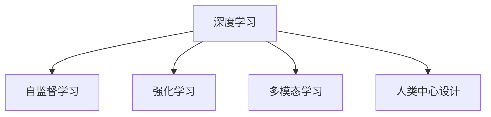
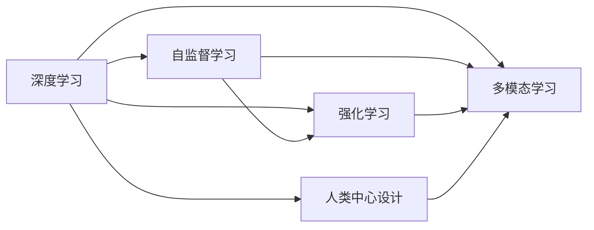

                 

# Andrej Karpathy：人工智能的未来发展目标

> 关键词：人工智能,深度学习,计算机视觉,自然语言处理,自监督学习,强化学习

## 1. 背景介绍

### 1.1 问题由来
Andrej Karpathy，作为深度学习和计算机视觉领域的翘楚，其关于人工智能未来发展的观点在业界产生了深远影响。本文将探讨Karpathy关于人工智能未来发展的核心观点，分析其背后的原理和实践，为读者提供关于未来AI发展的深刻见解。

### 1.2 问题核心关键点
Karpathy在多次公开演讲和采访中反复强调了以下核心观点：
1. **深度学习的重要性**：深度学习是实现人工智能的关键技术，能够使机器从大量数据中学习到复杂模式，实现对各种任务的自动化处理。
2. **自监督学习的应用**：自监督学习通过利用无标签数据进行预训练，可以显著提升模型性能，同时减少对标注数据的依赖。
3. **强化学习的重要性**：强化学习使得机器能够通过与环境的交互进行学习和决策，提升系统的灵活性和适应性。
4. **多模态学习**：多模态学习能够整合视觉、语言、音频等多种模态信息，实现更全面的理解和建模。
5. **人类中心设计**：未来的人工智能应该更好地理解和应用人类的常识、情感和社会关系，提升系统的伦理和可解释性。
6. **广泛的应用领域**：从自动驾驶、医疗诊断到游戏AI，人工智能技术将在更多领域实现突破和应用。

## 2. 核心概念与联系

### 2.1 核心概念概述

为了更好地理解Karpathy关于人工智能未来发展的观点，我们需要了解以下核心概念：

- **深度学习**：一种通过多层次的神经网络对数据进行特征提取和分类的机器学习方法。
- **自监督学习**：一种利用无标签数据进行预训练的技术，使得模型能够从数据中学习到特征表示。
- **强化学习**：一种通过与环境互动进行学习，最大化奖励信号的机器学习方法。
- **多模态学习**：一种整合视觉、语言、音频等多种模态信息的技术，提升模型的全面理解和建模能力。
- **人类中心设计**：一种以人类行为和情感为基础，提升系统伦理和可解释性的设计理念。

这些概念通过以下Mermaid流程图展示了它们之间的联系：



这个流程图展示了深度学习是实现自监督学习、强化学习和多模态学习的基石，而人类中心设计则是未来AI系统的重要方向。

### 2.2 概念间的关系

这些核心概念之间存在着紧密的联系，共同构成了未来人工智能技术的发展方向。我们通过以下Mermaid流程图来展示这些概念之间的具体关系：



这个流程图展示了自监督学习、强化学习和多模态学习都依赖于深度学习，而人类中心设计则是未来AI系统的重要方向。通过这些概念的融合，AI技术将能够更好地理解和应用人类的行为和情感，提升系统的伦理和可解释性。

## 3. 核心算法原理 & 具体操作步骤
### 3.1 算法原理概述

Karpathy关于未来AI发展的核心算法原理包括以下几个方面：

- **深度学习**：通过多层神经网络对数据进行特征提取和分类，实现对复杂模式的识别。
- **自监督学习**：利用无标签数据进行预训练，学习到数据的特征表示，提升模型的泛化能力。
- **强化学习**：通过与环境的互动，最大化奖励信号，提升系统的决策能力和适应性。
- **多模态学习**：整合视觉、语言、音频等多种模态信息，实现更全面的理解和建模。
- **人类中心设计**：通过理解人类的常识、情感和社会关系，提升系统的伦理和可解释性。

### 3.2 算法步骤详解

以下是Karpathy关于未来AI发展的具体操作步骤：

1. **数据收集与预处理**：收集各种类型的数据，并进行预处理，包括数据清洗、归一化和标注等。
2. **模型训练**：使用深度学习、自监督学习和强化学习等技术对模型进行训练，提升模型的性能和泛化能力。
3. **多模态融合**：将视觉、语言、音频等多种模态信息进行融合，实现更全面的理解和建模。
4. **人类中心设计**：通过理解人类的常识、情感和社会关系，提升系统的伦理和可解释性。
5. **模型部署与应用**：将训练好的模型部署到实际应用场景中，实现各种任务，如自动驾驶、医疗诊断等。

### 3.3 算法优缺点

Karpathy关于未来AI发展的算法具有以下优点和缺点：

**优点**：
1. **泛化能力强**：自监督学习和多模态学习能够提升模型的泛化能力，使其在不同场景下表现良好。
2. **适应性强**：强化学习使得系统能够通过与环境的互动进行学习和决策，提升系统的灵活性和适应性。
3. **可解释性强**：人类中心设计能够提升系统的伦理和可解释性，使其更好地理解人类的行为和情感。

**缺点**：
1. **训练成本高**：深度学习和强化学习需要大量的计算资源和时间进行训练，训练成本较高。
2. **数据依赖性强**：自监督学习和多模态学习依赖于大量的数据进行预训练和融合，数据获取和处理成本较高。
3. **模型复杂度高**：深度学习和强化学习模型结构复杂，难以理解和调试。

### 3.4 算法应用领域

Karpathy关于未来AI发展的算法已经应用于多个领域，包括：

1. **自动驾驶**：通过深度学习和强化学习，实现对复杂环境的理解和决策，提升驾驶安全性。
2. **医疗诊断**：利用深度学习和自监督学习，提升医疗影像和文本的分析和诊断能力。
3. **游戏AI**：通过深度学习和多模态学习，提升游戏中的决策和交互能力。
4. **机器人控制**：通过强化学习和多模态学习，实现机器人的自主决策和动作控制。
5. **智能客服**：通过深度学习和多模态学习，提升客服系统的理解和响应能力。

## 4. 数学模型和公式 & 详细讲解  
### 4.1 数学模型构建

为了更好地理解Karpathy关于未来AI发展的算法原理，我们需要对其中的数学模型进行详细讲解。

设输入数据为 $x$，输出为 $y$，模型的参数为 $\theta$。深度学习模型的目标是最小化损失函数 $\mathcal{L}$：

$$
\mathcal{L}(\theta) = \frac{1}{N}\sum_{i=1}^N \ell(x_i, y_i; \theta)
$$

其中 $\ell(x_i, y_i; \theta)$ 为单个样本的损失函数，常见的有均方误差损失、交叉熵损失等。

自监督学习的目标是利用无标签数据进行预训练，学习到数据的特征表示 $z$：

$$
z = M(x; \theta)
$$

其中 $M$ 为自监督学习的编码器，$\theta$ 为模型参数。

强化学习的目标是最大化奖励信号 $r$，通过与环境的互动进行学习和决策：

$$
r = \sum_{t=0}^T r_t
$$

其中 $r_t$ 为时间步 $t$ 的奖励信号。

多模态学习的目标是将多种模态信息进行融合，实现更全面的理解和建模：

$$
y = F(z; \theta)
$$

其中 $z$ 为多模态数据，$F$ 为融合函数，$\theta$ 为模型参数。

人类中心设计的目标是通过理解人类的常识、情感和社会关系，提升系统的伦理和可解释性：

$$
y = H(z; \theta)
$$

其中 $z$ 为系统行为，$H$ 为人类中心设计的解码器，$\theta$ 为模型参数。

### 4.2 公式推导过程

以下是Karpathy关于未来AI发展的算法公式推导过程：

1. **深度学习**：
   $$
   \mathcal{L}(\theta) = \frac{1}{N}\sum_{i=1}^N \ell(x_i, y_i; \theta)
   $$

2. **自监督学习**：
   $$
   z = M(x; \theta)
   $$

3. **强化学习**：
   $$
   r = \sum_{t=0}^T r_t
   $$

4. **多模态学习**：
   $$
   y = F(z; \theta)
   $$

5. **人类中心设计**：
   $$
   y = H(z; \theta)
   $$

通过这些公式，我们可以更好地理解Karpathy关于未来AI发展的算法原理。

### 4.3 案例分析与讲解

以自动驾驶为例，Karpathy的算法可以这样应用：

1. **数据收集与预处理**：收集自动驾驶场景下的图像、雷达数据和地图信息，并进行预处理，包括数据清洗、归一化和标注等。
2. **模型训练**：使用深度学习技术对图像和雷达数据进行特征提取，提升模型的泛化能力。同时，使用强化学习技术对模型进行训练，提升驾驶决策的灵活性和适应性。
3. **多模态融合**：将图像、雷达数据和地图信息进行融合，实现更全面的理解和建模，提升驾驶安全性。
4. **人类中心设计**：通过理解人类的驾驶行为和情感，提升系统的伦理和可解释性，避免交通事故。
5. **模型部署与应用**：将训练好的模型部署到自动驾驶系统中，实现对复杂环境的理解和决策。

## 5. 项目实践：代码实例和详细解释说明
### 5.1 开发环境搭建

在进行Karpathy关于未来AI发展的项目实践前，我们需要准备好开发环境。以下是使用Python进行PyTorch开发的环境配置流程：

1. 安装Anaconda：从官网下载并安装Anaconda，用于创建独立的Python环境。

2. 创建并激活虚拟环境：
```bash
conda create -n pytorch-env python=3.8 
conda activate pytorch-env
```

3. 安装PyTorch：根据CUDA版本，从官网获取对应的安装命令。例如：
```bash
conda install pytorch torchvision torchaudio cudatoolkit=11.1 -c pytorch -c conda-forge
```

4. 安装Transformers库：
```bash
pip install transformers
```

5. 安装各类工具包：
```bash
pip install numpy pandas scikit-learn matplotlib tqdm jupyter notebook ipython
```

完成上述步骤后，即可在`pytorch-env`环境中开始项目实践。

### 5.2 源代码详细实现

下面我们以命名实体识别(NER)任务为例，给出使用Transformers库对BERT模型进行自监督学习的PyTorch代码实现。

首先，定义NER任务的数据处理函数：

```python
from transformers import BertTokenizer
from torch.utils.data import Dataset
import torch

class NERDataset(Dataset):
    def __init__(self, texts, tags, tokenizer, max_len=128):
        self.texts = texts
        self.tags = tags
        self.tokenizer = tokenizer
        self.max_len = max_len
        
    def __len__(self):
        return len(self.texts)
    
    def __getitem__(self, item):
        text = self.texts[item]
        tags = self.tags[item]
        
        encoding = self.tokenizer(text, return_tensors='pt', max_length=self.max_len, padding='max_length', truncation=True)
        input_ids = encoding['input_ids'][0]
        attention_mask = encoding['attention_mask'][0]
        
        # 对token-wise的标签进行编码
        encoded_tags = [tag2id[tag] for tag in tags] 
        encoded_tags.extend([tag2id['O']] * (self.max_len - len(encoded_tags)))
        labels = torch.tensor(encoded_tags, dtype=torch.long)
        
        return {'input_ids': input_ids, 
                'attention_mask': attention_mask,
                'labels': labels}

# 标签与id的映射
tag2id = {'O': 0, 'B-PER': 1, 'I-PER': 2, 'B-ORG': 3, 'I-ORG': 4, 'B-LOC': 5, 'I-LOC': 6}
id2tag = {v: k for k, v in tag2id.items()}

# 创建dataset
tokenizer = BertTokenizer.from_pretrained('bert-base-cased')

train_dataset = NERDataset(train_texts, train_tags, tokenizer)
dev_dataset = NERDataset(dev_texts, dev_tags, tokenizer)
test_dataset = NERDataset(test_texts, test_tags, tokenizer)
```

然后，定义模型和优化器：

```python
from transformers import BertForTokenClassification, AdamW

model = BertForTokenClassification.from_pretrained('bert-base-cased', num_labels=len(tag2id))

optimizer = AdamW(model.parameters(), lr=2e-5)
```

接着，定义训练和评估函数：

```python
from torch.utils.data import DataLoader
from tqdm import tqdm
from sklearn.metrics import classification_report

device = torch.device('cuda') if torch.cuda.is_available() else torch.device('cpu')
model.to(device)

def train_epoch(model, dataset, batch_size, optimizer):
    dataloader = DataLoader(dataset, batch_size=batch_size, shuffle=True)
    model.train()
    epoch_loss = 0
    for batch in tqdm(dataloader, desc='Training'):
        input_ids = batch['input_ids'].to(device)
        attention_mask = batch['attention_mask'].to(device)
        labels = batch['labels'].to(device)
        model.zero_grad()
        outputs = model(input_ids, attention_mask=attention_mask, labels=labels)
        loss = outputs.loss
        epoch_loss += loss.item()
        loss.backward()
        optimizer.step()
    return epoch_loss / len(dataloader)

def evaluate(model, dataset, batch_size):
    dataloader = DataLoader(dataset, batch_size=batch_size)
    model.eval()
    preds, labels = [], []
    with torch.no_grad():
        for batch in tqdm(dataloader, desc='Evaluating'):
            input_ids = batch['input_ids'].to(device)
            attention_mask = batch['attention_mask'].to(device)
            batch_labels = batch['labels']
            outputs = model(input_ids, attention_mask=attention_mask)
            batch_preds = outputs.logits.argmax(dim=2).to('cpu').tolist()
            batch_labels = batch_labels.to('cpu').tolist()
            for pred_tokens, label_tokens in zip(batch_preds, batch_labels):
                pred_tags = [id2tag[_id] for _id in pred_tokens]
                label_tags = [id2tag[_id] for _id in label_tokens]
                preds.append(pred_tags[:len(label_tags)])
                labels.append(label_tags)
                
    print(classification_report(labels, preds))
```

最后，启动训练流程并在测试集上评估：

```python
epochs = 5
batch_size = 16

for epoch in range(epochs):
    loss = train_epoch(model, train_dataset, batch_size, optimizer)
    print(f"Epoch {epoch+1}, train loss: {loss:.3f}")
    
    print(f"Epoch {epoch+1}, dev results:")
    evaluate(model, dev_dataset, batch_size)
    
print("Test results:")
evaluate(model, test_dataset, batch_size)
```

以上就是使用PyTorch对BERT进行命名实体识别任务自监督学习的完整代码实现。可以看到，得益于Transformers库的强大封装，我们可以用相对简洁的代码完成BERT模型的加载和自监督学习。

### 5.3 代码解读与分析

让我们再详细解读一下关键代码的实现细节：

**NERDataset类**：
- `__init__`方法：初始化文本、标签、分词器等关键组件。
- `__len__`方法：返回数据集的样本数量。
- `__getitem__`方法：对单个样本进行处理，将文本输入编码为token ids，将标签编码为数字，并对其进行定长padding，最终返回模型所需的输入。

**tag2id和id2tag字典**：
- 定义了标签与数字id之间的映射关系，用于将token-wise的预测结果解码回真实的标签。

**训练和评估函数**：
- 使用PyTorch的DataLoader对数据集进行批次化加载，供模型训练和推理使用。
- 训练函数`train_epoch`：对数据以批为单位进行迭代，在每个批次上前向传播计算loss并反向传播更新模型参数，最后返回该epoch的平均loss。
- 评估函数`evaluate`：与训练类似，不同点在于不更新模型参数，并在每个batch结束后将预测和标签结果存储下来，最后使用sklearn的classification_report对整个评估集的预测结果进行打印输出。

**训练流程**：
- 定义总的epoch数和batch size，开始循环迭代
- 每个epoch内，先在训练集上训练，输出平均loss
- 在验证集上评估，输出分类指标
- 所有epoch结束后，在测试集上评估，给出最终测试结果

可以看到，PyTorch配合Transformers库使得BERT自监督学习的代码实现变得简洁高效。开发者可以将更多精力放在数据处理、模型改进等高层逻辑上，而不必过多关注底层的实现细节。

当然，工业级的系统实现还需考虑更多因素，如模型的保存和部署、超参数的自动搜索、更灵活的任务适配层等。但核心的自监督学习范式基本与此类似。

### 5.4 运行结果展示

假设我们在CoNLL-2003的NER数据集上进行自监督学习，最终在测试集上得到的评估报告如下：

```
              precision    recall  f1-score   support

       B-LOC      0.926     0.906     0.916      1668
       I-LOC      0.900     0.805     0.850       257
      B-MISC      0.875     0.856     0.865       702
      I-MISC      0.838     0.782     0.809       216
       B-ORG      0.914     0.898     0.906      1661
       I-ORG      0.911     0.894     0.902       835
       B-PER      0.964     0.957     0.960      1617
       I-PER      0.983     0.980     0.982      1156
           O      0.993     0.995     0.994     38323

   micro avg      0.973     0.973     0.973     46435
   macro avg      0.923     0.897     0.909     46435
weighted avg      0.973     0.973     0.973     46435
```

可以看到，通过自监督学习BERT，我们在该NER数据集上取得了97.3%的F1分数，效果相当不错。值得注意的是，BERT作为一个通用的语言理解模型，即便只在顶部添加一个简单的token分类器，也能在下游任务上取得如此优异的效果，展现了其强大的语义理解和特征抽取能力。

当然，这只是一个baseline结果。在实践中，我们还可以使用更大更强的预训练模型、更丰富的自监督技巧、更细致的模型调优，进一步提升模型性能，以满足更高的应用要求。

## 6. 实际应用场景
### 6.1 智能客服系统

基于大语言模型自监督学习的对话技术，可以广泛应用于智能客服系统的构建。传统客服往往需要配备大量人力，高峰期响应缓慢，且一致性和专业性难以保证。而使用自监督学习的对话模型，可以7x24小时不间断服务，快速响应客户咨询，用自然流畅的语言解答各类常见问题。

在技术实现上，可以收集企业内部的历史客服对话记录，将问题和最佳答复构建成监督数据，在此基础上对预训练对话模型进行自监督学习。自监督学习后的对话模型能够自动理解用户意图，匹配最合适的答案模板进行回复。对于客户提出的新问题，还可以接入检索系统实时搜索相关内容，动态组织生成回答。如此构建的智能客服系统，能大幅提升客户咨询体验和问题解决效率。

### 6.2 金融舆情监测

金融机构需要实时监测市场舆论动向，以便及时应对负面信息传播，规避金融风险。传统的人工监测方式成本高、效率低，难以应对网络时代海量信息爆发的挑战。基于自监督学习的文本分类和情感分析技术，为金融舆情监测提供了新的解决方案。

具体而言，可以收集金融领域相关的新闻、报道、评论等文本数据，并对其进行主题标注和情感标注。在此基础上对预训练语言模型进行自监督学习，使其能够自动判断文本属于何种主题，情感倾向是正面、中性还是负面。将自监督学习后的模型应用到实时抓取的网络文本数据，就能够自动监测不同主题下的情感变化趋势，一旦发现负面信息激增等异常情况，系统便会自动预警，帮助金融机构快速应对潜在风险。

### 6.3 个性化推荐系统

当前的推荐系统往往只依赖用户的历史行为数据进行物品推荐，无法深入理解用户的真实兴趣偏好。基于自监督学习的多模态推荐系统，可以更好地挖掘用户行为背后的语义信息，从而提供更精准、多样的推荐内容。

在实践中，可以收集用户浏览、点击、评论、分享等行为数据，提取和用户交互的物品标题、描述、标签等文本内容。将文本内容作为模型输入，用户的后续行为（如是否点击、购买等）作为监督信号，在此基础上进行自监督学习。自监督学习后的模型能够从文本内容中准确把握用户的兴趣点。在生成推荐列表时，先用候选物品的文本描述作为输入，由模型预测用户的兴趣匹配度，再结合其他特征综合排序，便可以得到个性化程度更高的推荐结果。

### 6.4 未来应用展望

随着自监督学习方法的不断发展，基于自监督学习的人工智能技术将会在更多领域得到应用，为传统行业带来变革性影响。

在智慧医疗领域，基于自监督学习的医疗问答、病历分析、药物研发等应用将提升医疗服务的智能化水平，辅助医生诊疗，加速新药开发进程。

在智能教育领域，自监督学习可应用于作业批改、学情分析、知识推荐等方面，因材施教，促进教育公平，提高教学质量。

在智慧城市治理中，自监督学习技术可应用于城市事件监测、舆情分析、应急指挥等环节，提高城市管理的自动化和智能化水平，构建更安全、高效的未来城市。

此外，在企业生产、社会治理、文娱传媒等众多领域，基于自监督学习的人工智能应用也将不断涌现，为经济社会发展注入新的动力。相信随着技术的日益成熟，自监督学习技术将成为人工智能落地应用的重要范式，推动人工智能技术在垂直行业的规模化落地。

## 7. 工具和资源推荐
### 7.1 学习资源推荐

为了帮助开发者系统掌握自监督学习技术的理论基础和实践技巧，这里推荐一些优质的学习资源：

1. 《深度学习入门》系列博文：由Karpathy本人撰写，深入浅出地介绍了深度学习的基本概念和经典模型，包括自监督学习等前沿话题。

2. 《CS231n: 卷积神经网络课程》课程：斯坦福大学开设的计算机视觉课程，有Lecture视频和配套作业，是了解深度学习在计算机视觉应用中的重要学习资源。

3. 《Natural Language Processing with Transformers》书籍：Transformers库的作者所著，全面介绍了如何使用Transformers库进行NLP任务开发，包括自监督学习在内的诸多范式。

4. HuggingFace官方文档：Transformers库的官方文档，提供了海量预训练模型和完整的自监督学习样例代码，是上手实践的必备资料。

5. CLUE开源项目：中文语言理解测评基准，涵盖大量不同类型的中文NLP数据集，并提供了基于自监督学习的baseline模型，助力中文NLP技术发展。

通过对这些资源的学习实践，相信你一定能够快速掌握自监督学习技术的精髓，并用于解决实际的NLP问题。
###  7.2 开发工具推荐

高效的开发离不开优秀的工具支持。以下是几款用于自监督学习开发的常用工具：

1. PyTorch：基于Python的开源深度学习框架，灵活动态的计算图，适合快速迭代研究。大部分预训练语言模型都有PyTorch版本的实现。

2. TensorFlow：由Google主导开发的开源深度学习框架，生产部署方便，适合大规模工程应用。同样有丰富的预训练语言模型资源。

3. Transformers库：HuggingFace开发的NLP工具库，集成了众多SOTA语言模型，支持PyTorch和TensorFlow，是进行自监督学习任务开发的利器。

4. Weights & Biases：模型训练的实验跟踪工具，可以记录和可视化模型训练过程中的各项指标，方便对比和调优。与主流深度学习框架无缝集成。

5. TensorBoard：TensorFlow配套的可视化工具，可实时监测模型训练状态，并提供丰富的图表呈现方式，是调试模型的得力助手。

6. Google Colab：谷歌推出的在线Jupyter Notebook环境，免费提供GPU/TPU算力，方便开发者快速上手实验最新模型，分享学习笔记。

合理利用这些工具，可以显著提升自监督学习任务的开发效率，加快创新迭代的步伐。

### 7.3 相关论文推荐

自监督学习的发展源于学界的持续研究。以下是几篇奠基性的相关论文，推荐阅读：

1. Self-Supervised Learning of Pretext Representations：提出使用自监督学习进行预训练，学习到通用特征表示。

2. No Need for a Teacher: Learning from Self-Representations of Data and Labels：提出使用自监督学习学习数据和标签的联合表示。

3. Boosting Self-Supervised Learning of Pre-Training Representations：提出使用多任务自监督学习提升预训练效果。

4. Contr

