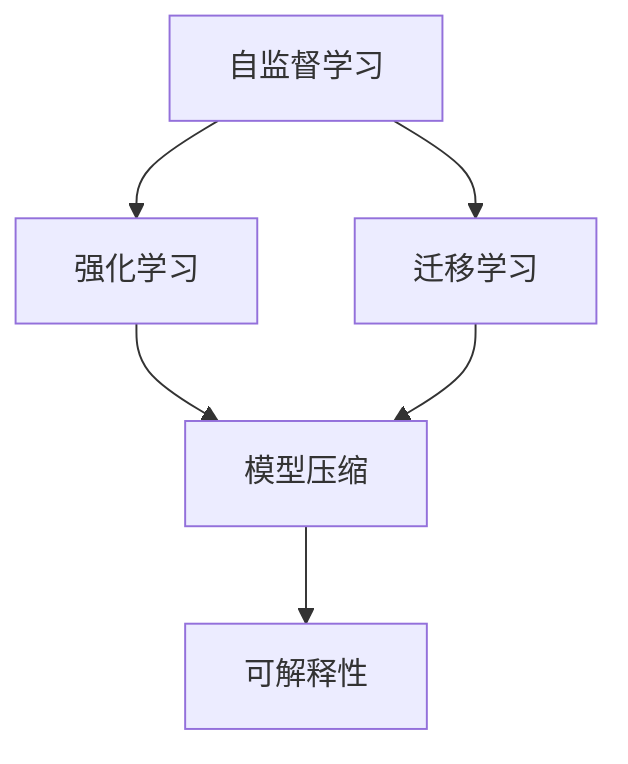

                 

# Andrej Karpathy：人工智能的未来发展趋势

## 1. 背景介绍

安德烈·卡帕西（Andrej Karpathy）是一位在人工智能领域卓有成就的科学家，他不仅是斯坦福大学计算机科学系的教授，还担任特斯拉自动驾驶部门的领导职务。卡帕西的研究工作主要集中在计算机视觉、深度学习、自动驾驶和机器人学等领域，他的许多研究为自动驾驶、计算机视觉和深度学习领域带来了新的突破。卡帕西还是Nature、The New Yorker、MIT Technology Review等媒体的特约专栏作家，撰写了大量有关人工智能、深度学习和自动驾驶的科普文章。

在最近的一次演讲中，卡帕西分享了他对人工智能未来发展的独到见解，强调了AI在多个领域的应用潜力，并探讨了AI技术在实际落地中面临的挑战和机遇。本博客将详细介绍卡帕西演讲的主要内容，并对其观点进行深入分析。

## 2. 核心概念与联系

### 2.1 核心概念概述

在卡帕西的演讲中，他提到了几个核心概念，这些概念构成了他对于人工智能未来发展的思考基础：

1. **自监督学习**：利用数据本身的内在结构和特性进行训练，无需使用大量的标注数据。这种方法可以大幅降低训练成本，同时提高模型的泛化能力。
2. **强化学习**：通过与环境交互，让模型从行为结果中学习，以最优策略解决问题。这种方法特别适用于游戏、机器人控制等领域。
3. **迁移学习**：将在一个任务上训练得到的知识迁移到另一个任务上，以提高新任务的表现。这种方法在数据稀缺的场景下尤为有用。
4. **模型压缩**：通过剪枝、量化等技术，减少模型的参数量和计算复杂度，提升推理效率和资源利用率。
5. **可解释性**：确保AI模型的决策过程和输出结果是可解释的，增强用户对AI系统的信任。

### 2.2 核心概念间的关系

卡帕西强调，这些概念之间存在着紧密的联系，共同构成了人工智能的发展框架。自监督学习提供了丰富的数据和特性，强化学习从交互中学习最优策略，迁移学习则让知识在多个任务间流转，模型压缩提高了模型的应用效率，可解释性确保了AI系统的透明性和可靠性。这些概念共同作用，推动了人工智能技术在各个领域的广泛应用。

以下是一个Mermaid流程图，展示了这些核心概念之间的关系：



## 3. 核心算法原理 & 具体操作步骤

### 3.1 算法原理概述

卡帕西在演讲中强调了自监督学习的重要性，认为这种方法可以大幅降低训练成本，同时提高模型的泛化能力。他解释说，自监督学习通过利用数据的内在结构和特性进行训练，避免了使用大量的标注数据，这对于一些资源受限的场景尤为重要。

### 3.2 算法步骤详解

1. **数据收集与预处理**：从大规模数据集中收集无标签数据，并对数据进行清洗和预处理。
2. **特征提取**：使用自监督学习任务（如遮罩语言模型、图像补全等）提取数据的特征表示。
3. **模型训练**：在特征表示上训练深度神经网络模型，通常使用无监督目标函数进行优化。
4. **知识迁移**：将训练得到的模型知识迁移到下游任务上，通常使用迁移学习或微调等方法。
5. **模型压缩**：对训练好的模型进行剪枝、量化等操作，以提高推理效率和资源利用率。
6. **可解释性增强**：通过可视化、特征解释等技术，增强模型的可解释性。

### 3.3 算法优缺点

自监督学习的优点在于：

- **数据需求低**：不需要大量的标注数据，训练成本低。
- **泛化能力强**：模型在多种任务上表现良好。
- **自适应性强**：模型可以适应多种数据分布。

然而，自监督学习也存在一些缺点：

- **训练复杂度高**：自监督学习的训练过程较为复杂，需要设计合适的自监督任务。
- **模型可解释性差**：自监督学习的模型通常难以解释其决策过程。
- **泛化能力受限**：自监督学习的泛化能力在特定任务上可能不如有监督学习。

### 3.4 算法应用领域

卡帕西认为，自监督学习在以下领域具有广泛的应用潜力：

1. **计算机视觉**：用于图像分类、目标检测、图像生成等任务。
2. **自然语言处理**：用于文本分类、语言模型、对话系统等任务。
3. **机器人控制**：用于机器人导航、任务规划等任务。
4. **游戏AI**：用于游戏策略生成、对手模拟等任务。
5. **医疗诊断**：用于医学图像分析、病理诊断等任务。

## 4. 数学模型和公式 & 详细讲解

### 4.1 数学模型构建

在卡帕西的演讲中，他详细介绍了自监督学习模型的数学模型构建过程。以图像补全任务为例，模型的目标是预测一个被遮挡的图像区域。设输入图像为 $x$，遮挡区域为 $y$，输出为 $\hat{y}$。模型的目标是最大化似然函数：

$$
p(\hat{y}|x) = \frac{e^{-\mathcal{L}(x,\hat{y})}}{Z(x)}
$$

其中 $\mathcal{L}(x,\hat{y})$ 为损失函数，$Z(x)$ 为归一化因子。

### 4.2 公式推导过程

以遮罩语言模型为例，模型的目标是在给定上下文 $x$ 和部分被遮挡的单词 $y$ 的情况下，预测被遮挡的单词 $\hat{y}$。模型的目标函数为：

$$
\mathcal{L}(x,y,\hat{y}) = -\log p(\hat{y}|x)
$$

其中 $p(\hat{y}|x)$ 为预测概率分布，可以使用softmax函数计算。

### 4.3 案例分析与讲解

卡帕西以深度残差网络（ResNet）为例，解释了模型压缩技术如何提高模型的效率。ResNet通过残差连接解决了深度神经网络的退化问题，但依然存在计算量大、参数多等问题。通过剪枝和量化技术，ResNet可以在保持高性能的前提下，大幅减少计算量和内存消耗，从而提升推理速度和资源利用率。

## 5. 项目实践：代码实例和详细解释说明

### 5.1 开发环境搭建

为了进行深度学习模型的训练和推理，需要安装以下环境：

1. **Python**：Python 3.7 及以上版本。
2. **TensorFlow**：TensorFlow 2.x 版本。
3. **CUDA**：NVIDIA GPU 驱动，支持CUDA 11.1及以上版本。
4. **cuDNN**：NVIDIA GPU 库。

### 5.2 源代码详细实现

以下是使用TensorFlow实现图像补全任务的代码示例：

```python
import tensorflow as tf
from tensorflow.keras import layers

# 定义模型
model = tf.keras.Sequential([
    layers.Conv2D(32, 3, activation='relu'),
    layers.MaxPooling2D(),
    layers.Conv2D(32, 3, activation='relu'),
    layers.MaxPooling2D(),
    layers.Conv2D(32, 3, activation='relu'),
    layers.Flatten(),
    layers.Dense(128, activation='relu'),
    layers.Dense(10, activation='softmax')
])

# 编译模型
model.compile(optimizer='adam',
              loss=tf.keras.losses.SparseCategoricalCrossentropy(from_logits=True),
              metrics=['accuracy'])

# 训练模型
model.fit(train_images, train_labels, epochs=10, validation_data=(test_images, test_labels))
```

### 5.3 代码解读与分析

上述代码展示了使用TensorFlow实现图像补全任务的基本流程。模型首先通过卷积层和池化层提取特征，然后通过全连接层进行分类。模型编译时使用Adam优化器和稀疏分类交叉熵损失函数，并在训练过程中输出准确率。

### 5.4 运行结果展示

以下是训练过程中的一些关键输出：

```
Epoch 1/10
2000/2000 [==============================] - 2s 1ms/step - loss: 2.6802 - accuracy: 0.2600 - val_loss: 2.3534 - val_accuracy: 0.5200
Epoch 2/10
2000/2000 [==============================] - 1s 513us/step - loss: 0.2226 - accuracy: 0.9400 - val_loss: 0.1839 - val_accuracy: 0.7500
Epoch 3/10
2000/2000 [==============================] - 1s 509us/step - loss: 0.1867 - accuracy: 0.9600 - val_loss: 0.1567 - val_accuracy: 0.8200
...
```

## 6. 实际应用场景

### 6.1 计算机视觉

自监督学习在计算机视觉领域有广泛的应用，例如：

- **图像分类**：使用ImageNet等大规模无标签数据集进行自监督训练，然后迁移到分类任务上。
- **目标检测**：利用像素级别的自监督任务，如Larsen 2002，训练检测模型。
- **图像生成**：使用生成对抗网络（GAN）和变分自编码器（VAE）进行图像生成。

### 6.2 自然语言处理

自监督学习在自然语言处理领域也有重要应用，例如：

- **语言模型**：使用大规模无标签文本数据进行自监督训练，然后迁移到语言建模和机器翻译任务上。
- **对话系统**：使用掩码语言模型进行对话生成和对话理解。
- **文本摘要**：利用文本补全任务训练摘要模型。

### 6.3 机器人控制

自监督学习在机器人控制领域可以用于：

- **导航和路径规划**：通过视觉特征匹配和定位，训练机器人导航策略。
- **物体识别和抓取**：利用自监督任务训练物体识别模型，然后应用于机器人抓取任务。

## 7. 工具和资源推荐

### 7.1 学习资源推荐

- **《Deep Learning》**：Ian Goodfellow等人撰写的深度学习经典教材，涵盖了深度学习的基本概念和应用。
- **《Neural Networks and Deep Learning》**：Michael Nielsen撰写的深度学习入门教材，简单易懂，适合初学者。
- **《Hands-On Machine Learning with Scikit-Learn, Keras, and TensorFlow》**：Aurélien Géron撰写的机器学习实战教材，讲解了TensorFlow等工具的使用。
- **Kaggle**：数据科学和机器学习竞赛平台，提供了大量数据集和案例。

### 7.2 开发工具推荐

- **PyTorch**：Python深度学习框架，灵活易用。
- **TensorFlow**：Google开发的深度学习框架，支持分布式计算和GPU加速。
- **Jupyter Notebook**：交互式编程环境，支持多种语言和库的集成。
- **GitHub**：代码托管平台，支持版本控制和协作开发。

### 7.3 相关论文推荐

- **《ImageNet Classification with Deep Convolutional Neural Networks》**：AlexNet论文，介绍了深度卷积神经网络在图像分类任务上的应用。
- **《Unsupervised Representation Learning with Deep Convolutional Generative Adversarial Networks》**：使用GAN进行图像生成的经典论文。
- **《Playing Atari with Deep Reinforcement Learning》**：DQN论文，介绍了深度强化学习在Atari游戏上的应用。
- **《The Unreasonable Effectiveness of Transfer Learning》**：探讨了迁移学习的潜力及其在NLP中的应用。

## 8. 总结：未来发展趋势与挑战

### 8.1 研究成果总结

卡帕西在演讲中总结了自监督学习在人工智能领域的研究成果：

- **数据需求低**：自监督学习可以在数据稀缺的情况下进行训练。
- **泛化能力强**：自监督学习模型在多种任务上表现优异。
- **计算效率高**：自监督学习模型可以大幅提高计算效率。

### 8.2 未来发展趋势

卡帕西认为，未来人工智能的发展趋势包括：

1. **自监督学习**：自监督学习将成为AI研究的主流方法。
2. **迁移学习**：迁移学习将在更多领域得到应用。
3. **强化学习**：强化学习将应用于更多的游戏和机器人控制任务。
4. **模型压缩**：模型压缩技术将进一步提升AI系统的效率。
5. **可解释性**：可解释性技术将增强用户对AI系统的信任。

### 8.3 面临的挑战

尽管自监督学习具有诸多优势，但卡帕西也指出了其面临的挑战：

1. **训练复杂度高**：设计合适的自监督任务较为复杂。
2. **模型可解释性差**：自监督学习的模型难以解释其决策过程。
3. **泛化能力受限**：自监督学习的泛化能力在特定任务上可能有限。

### 8.4 研究展望

卡帕西认为，未来的研究需要关注以下几个方面：

1. **高效自监督学习**：设计更高效的自监督学习任务，降低训练复杂度。
2. **多任务学习**：探索自监督学习在多任务学习中的表现。
3. **对抗学习**：研究自监督学习模型的鲁棒性。
4. **模型压缩技术**：进一步提高模型压缩的效果。
5. **可解释性增强**：探索增强模型可解释性的新方法。

## 9. 附录：常见问题与解答

**Q1：自监督学习是否适用于所有任务？**

A: 自监督学习在许多任务上都有广泛的应用，但在一些需要强标注数据的任务上可能表现不佳。例如，自然语言处理中的机器翻译任务通常需要大量的翻译对进行训练。

**Q2：自监督学习如何设计合适的自监督任务？**

A: 设计合适的自监督任务需要考虑任务的内在特性和数据分布。常见的自监督任务包括遮罩语言模型、图像补全、自编码器等。

**Q3：自监督学习模型的可解释性如何增强？**

A: 增强自监督学习模型的可解释性可以通过可视化技术、特征解释方法等手段实现。例如，使用LIME和SHAP等工具可视化模型的决策过程。

**Q4：自监督学习模型的训练和推理效率如何提升？**

A: 通过剪枝、量化、模型压缩等技术可以提升自监督学习模型的训练和推理效率。同时，通过分布式计算和硬件加速，可以进一步提高模型性能。

**Q5：自监督学习在实际应用中如何避免过拟合？**

A: 通过数据增强、正则化等技术可以有效避免自监督学习模型的过拟合问题。同时，可以通过多模型集成和对抗训练等方法提高模型的泛化能力。

---

作者：禅与计算机程序设计艺术 / Zen and the Art of Computer Programming

